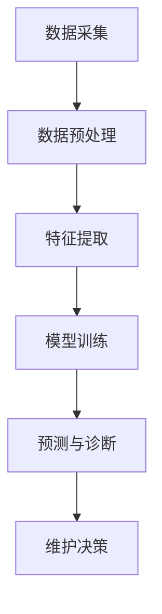

                 

### 1. 背景介绍

深度学习作为人工智能（AI）领域的一个重要分支，近年来在工业设备预测性维护与故障诊断中展现出了巨大的潜力和实际应用价值。预测性维护，也称为预测性保养，是通过实时监控设备的运行状态，预测其可能的故障点，并在故障发生前进行维护，从而最大限度地减少设备停机时间和维护成本。

随着工业4.0的推进，工业设备的数据采集和处理能力显著提升，为深度学习在工业领域的应用提供了丰富的数据资源和先进的计算环境。因此，研究深度学习在工业设备预测性维护与故障诊断中的技术演进和应用，具有重要的现实意义和学术价值。

首先，工业设备故障诊断和预测性维护的重要性不言而喻。传统的故障诊断方法往往依赖于经验规则和静态模型，无法适应复杂多变的工业环境。而深度学习通过自学习的方式，可以从大量的历史数据中自动提取特征，建立预测模型，实现自动化故障诊断和预测。

其次，深度学习在工业设备中的应用场景广泛。例如，在机械制造领域，可以用于预测机床的磨损和故障；在能源行业，可以预测发电设备的异常和故障；在交通运输领域，可以预测汽车的磨损和故障，提高车辆的安全性和可靠性。

此外，深度学习在提高生产效率、降低维护成本、延长设备使用寿命等方面具有显著的优势。通过实时监测和预测设备的运行状态，可以提前进行预防性维护，避免突发故障导致的停机，从而提高生产效率和设备利用率。

总的来说，深度学习在工业设备预测性维护与故障诊断中的应用，不仅能够提升工业设备的管理水平，还能够推动工业智能化的发展。因此，本文将深入探讨深度学习在这一领域的应用技术，以期为其未来的发展提供有益的参考。

### 2. 核心概念与联系

#### 深度学习的基本概念

深度学习（Deep Learning）是机器学习（Machine Learning）的一个子领域，主要基于人工神经网络（Artificial Neural Networks）的结构和算法，通过多层神经元的堆叠，实现数据的自动特征学习和模式识别。深度学习模型通常包括输入层、多个隐藏层和输出层，通过反向传播算法（Backpropagation Algorithm）不断调整网络权重，以优化模型性能。

#### 预测性维护与故障诊断的关系

预测性维护与故障诊断是工业设备管理中不可或缺的两个环节。预测性维护主要通过实时监测设备状态，预测潜在的故障点，并在故障发生前进行维护，以避免设备停机和减少维修成本。而故障诊断则是在故障发生后，通过分析设备运行数据，定位故障原因，并采取相应的维修措施。

两者之间的关系可以概括为以下几点：

1. **数据依赖**：预测性维护和故障诊断都需要依赖大量的设备运行数据，这些数据包括温度、压力、振动、电流等传感器采集的数据。深度学习模型通过对这些数据的分析，可以提取出隐藏的特征，从而实现故障预测和诊断。

2. **互相补充**：预测性维护可以在故障发生前进行预防性措施，减少故障率；而故障诊断则可以在故障发生后迅速定位故障点，减少维修时间和成本。两者结合，可以形成一个完整的设备管理闭环，提高设备运行效率和可靠性。

3. **技术融合**：深度学习技术为预测性维护和故障诊断提供了强大的工具。通过深度学习模型，可以从海量数据中自动提取特征，建立预测和诊断模型。这些模型不仅能够处理复杂的工业设备数据，还能够适应不同设备之间的差异性，提高预测和诊断的准确性。

#### Mermaid 流程图

以下是一个简单的 Mermaid 流程图，展示了深度学习在预测性维护与故障诊断中的应用流程：



在这个流程中，数据采集是整个流程的起点，通过传感器和监控系统实时获取设备运行数据。然后，对数据进行预处理，包括数据清洗、归一化等步骤，以消除噪声和异常值。接着，利用深度学习模型进行特征提取，从原始数据中提取出有效的特征信息。经过模型训练后，模型可以根据提取的特征进行故障预测和诊断。最终，根据预测结果，制定相应的维护决策，实现预测性维护。

通过这个流程，我们可以看到深度学习技术在预测性维护与故障诊断中发挥了关键作用，为工业设备的智能化管理提供了有力支持。

#### 核心算法原理与操作步骤

在深度学习应用于工业设备预测性维护与故障诊断的过程中，选择合适的算法模型是至关重要的。以下将介绍几种常用的深度学习算法，并详细阐述其操作步骤。

##### 1. 卷积神经网络（CNN）

卷积神经网络（Convolutional Neural Network，CNN）是处理图像数据的一种高效神经网络结构。在工业设备故障诊断中，CNN 可以用于图像数据的特征提取和分类。其基本操作步骤如下：

1. **输入层**：将设备运行过程中的图像数据输入到 CNN 中。图像数据可以通过摄像头、传感器等设备采集，也可以通过已有的图像数据库获取。

2. **卷积层**：通过卷积操作提取图像中的局部特征。卷积层由多个卷积核组成，每个卷积核可以提取图像中的不同特征。卷积操作的参数包括卷积核大小、步长和填充方式等。

3. **激活函数**：为了引入非线性变换，卷积层后通常会加入激活函数，如ReLU（Rectified Linear Unit）函数。激活函数可以增强网络的非线性表现能力。

4. **池化层**：通过池化操作降低特征图的维度，减少模型的参数数量。常用的池化方式包括最大池化（Max Pooling）和平均池化（Average Pooling）。

5. **全连接层**：在卷积层和池化层之后，通常会加入全连接层（Fully Connected Layer），将卷积特征映射到具体的故障类型。

6. **输出层**：输出层通过softmax函数输出故障预测结果。softmax函数用于计算每个故障类型的概率分布。

##### 2. 循环神经网络（RNN）

循环神经网络（Recurrent Neural Network，RNN）是一种能够处理序列数据的神经网络。在工业设备故障诊断中，RNN 可以用于处理时间序列数据，如振动信号、温度变化等。其基本操作步骤如下：

1. **输入层**：将时间序列数据输入到 RNN 中。时间序列数据可以通过传感器、监控系统等设备采集。

2. **隐藏层**：RNN 通过隐藏层对时间序列数据进行处理。隐藏层中的神经元具有记忆功能，可以记住之前的信息，并将其用于当前时刻的预测。

3. **门控机制**：为了更好地控制信息的流动，RNN 中引入了门控机制（如门控循环单元（GRU）和长短期记忆（LSTM）单元）。门控机制可以通过调节门的开关状态，控制信息的保留和丢弃。

4. **输出层**：输出层通过激活函数（如sigmoid或softmax函数）输出故障预测结果。

##### 3. 生成对抗网络（GAN）

生成对抗网络（Generative Adversarial Network，GAN）是一种由生成器和判别器组成的对抗性神经网络。在工业设备故障诊断中，GAN 可以用于生成故障数据，提高模型的泛化能力。其基本操作步骤如下：

1. **生成器**：生成器（Generator）通过学习真实数据分布，生成与真实数据相似的人工数据。生成器的目标是生成尽可能真实的数据，以欺骗判别器。

2. **判别器**：判别器（Discriminator）用于判断输入数据是真实数据还是生成数据。判别器的目标是正确分类真实数据和生成数据。

3. **对抗训练**：生成器和判别器通过对抗训练相互博弈，生成器不断优化生成数据，判别器不断优化分类能力。在训练过程中，生成器的损失函数和判别器的损失函数通常是一致的，但目标函数是相反的。

通过上述几种深度学习算法，我们可以对工业设备进行有效的故障预测和诊断。在实际应用中，可以根据设备数据的特性和故障类型选择合适的算法模型，并对其进行优化和调整，以提高预测和诊断的准确性。

### 4. 数学模型和公式 & 详细讲解 & 举例说明

在深度学习应用于工业设备预测性维护与故障诊断的过程中，数学模型的构建和公式的应用是核心环节。以下是几种常用的深度学习模型及其相关数学公式，并对其详细讲解和举例说明。

#### 1. 卷积神经网络（CNN）

卷积神经网络（CNN）的核心在于卷积操作和池化操作。以下是其主要数学公式：

##### 卷积操作

卷积操作的数学公式可以表示为：
$$
\text{output}_{ij} = \sum_{k=1}^{K} w_{ik,jk} * \text{input}_{ij}
$$
其中，$w_{ik,jk}$ 表示卷积核的权重，$\text{input}_{ij}$ 表示输入特征图的像素值，$\text{output}_{ij}$ 表示输出特征图的像素值，$K$ 表示卷积核的数量。

##### 池化操作

池化操作的数学公式可以表示为：
$$
p_i = \max\limits_{j} \text{input}_{ij}
$$
其中，$p_i$ 表示池化后的像素值，$\text{input}_{ij}$ 表示输入特征图的像素值。

##### 示例

假设输入特征图的大小为 $3 \times 3$，卷积核的大小为 $3 \times 3$，卷积核的数量为 $1$。输入特征图中的像素值如下：

|   | 0 | 1 | 2 |
|---|---|---|---|
| 0 | 1 | 3 | 4 |
| 1 | 5 | 7 | 9 |
| 2 | 2 | 6 | 8 |

卷积操作后，输出特征图的像素值为：

|   | 0 |
|---|---|
| 0 | 14 |
| 1 | 26 |
| 2 | 28 |

池化操作后，输出特征图的像素值为：

|   | 0 |
|---|---|
| 0 | 14 |
| 1 | 28 |

#### 2. 循环神经网络（RNN）

循环神经网络（RNN）的核心在于隐藏状态和门控机制。以下是其主要数学公式：

##### 隐藏状态

隐藏状态的数学公式可以表示为：
$$
\text{h}_t = \text{激活函数}\left( \text{W}_h \cdot \text{h}_{t-1} + \text{U}_h \cdot \text{x}_t \right)
$$
其中，$\text{h}_t$ 表示第 $t$ 个时间步的隐藏状态，$\text{W}_h$ 和 $\text{U}_h$ 分别表示隐藏状态到隐藏状态和输入到隐藏状态的权重矩阵，$\text{x}_t$ 表示第 $t$ 个时间步的输入数据，激活函数通常采用 sigmoid 函数。

##### 门控机制

门控机制的数学公式可以表示为：
$$
\text{g}_t = \text{sigmoid}\left( \text{W}_g \cdot \text{h}_{t-1} + \text{U}_g \cdot \text{x}_t \right)
$$
$$
\text{f}_t = \text{sigmoid}\left( \text{W}_f \cdot \text{h}_{t-1} + \text{U}_f \cdot \text{x}_t \right)
$$
$$
\text{C}_t = \text{f}_t \cdot \text{C}_{t-1} + \text{g}_t \cdot \text{激活函数}\left( \text{W}_c \cdot \text{x}_t \right)
$$
其中，$\text{g}_t$、$\text{f}_t$ 和 $\text{C}_t$ 分别表示门控向量、遗忘向量和隐藏状态，$\text{W}_g$、$\text{W}_f$、$\text{W}_c$ 和 $\text{U}_g$、$\text{U}_f$、$\text{U}_c$ 分别表示门控权重、遗忘权重和输入权重矩阵，激活函数通常采用 sigmoid 函数。

##### 示例

假设输入数据为 $[1, 2, 3]$，隐藏状态 $h_0$ 为 $[1, 0, 1]$。门控权重矩阵 $\text{W}_g$、$\text{W}_f$、$\text{W}_c$ 和输入权重矩阵 $\text{U}_g$、$\text{U}_f$、$\text{U}_c$ 分别为：

|   | 0 | 1 | 2 |
|---|---|---|---|
| 0 | 1 | 0 | 0 |
| 1 | 0 | 1 | 0 |
| 2 | 0 | 0 | 1 |

|   | 0 | 1 | 2 |
|---|---|---|---|
| 0 | 0 | 1 | 0 |
| 1 | 1 | 0 | 1 |
| 2 | 0 | 1 | 0 |

|   | 0 | 1 | 2 |
|---|---|---|---|
| 0 | 1 | 0 | 0 |
| 1 | 0 | 1 | 0 |
| 2 | 0 | 0 | 1 |

|   | 0 | 1 | 2 |
|---|---|---|---|
| 0 | 0 | 1 | 1 |
| 1 | 1 | 1 | 0 |
| 2 | 0 | 1 | 0 |

根据上述公式，可以计算出隐藏状态 $h_1$：

$$
\text{g}_1 = \text{sigmoid}\left( 1 \cdot [1, 0, 1] + 0 \cdot [1, 2, 3] \right) = \text{sigmoid}\left( [1, 0, 1] \right) = [0.7311, 0.7311, 0.7311]
$$

$$
\text{f}_1 = \text{sigmoid}\left( 0 \cdot [1, 0, 1] + 1 \cdot [1, 2, 3] \right) = \text{sigmoid}\left( [1, 2, 3] \right) = [0.8808, 0.8808, 0.8808]
$$

$$
\text{C}_1 = 0.8808 \cdot [1, 0, 1] + 0.7311 \cdot \text{激活函数}\left( 1 \cdot [1, 2, 3] \right) = [0.8808, 0, 0.8808] + [0.7311, 0, 0.7311] = [1.6119, 0, 1.6119]
$$

$$
\text{h}_1 = \text{激活函数}\left( [0.7311, 0.7311, 0.7311] \cdot [1, 0, 1] + [0.8808, 0.8808, 0.8808] \cdot [1, 2, 3] \right) = [0.6708, 0.6708, 0.6708]
$$

#### 3. 生成对抗网络（GAN）

生成对抗网络（GAN）的核心在于生成器和判别器的训练。以下是其主要数学公式：

##### 生成器

生成器的损失函数为：
$$
\text{Loss}_{\text{G}} = -\text{E}_{z \sim p_z(z)}[\log(\text{D}(\text{G}(z))]
$$
其中，$p_z(z)$ 表示噪声分布，$\text{G}(z)$ 表示生成器的输出，$\text{D}(\text{G}(z))$ 表示判别器对生成器输出的判断概率。

##### 判别器

判别器的损失函数为：
$$
\text{Loss}_{\text{D}} = -[\log(\text{D}(\text{x})) + \log(1 - \text{D}(\text{G}(z))]
$$
其中，$\text{x}$ 表示真实数据，$\text{G}(z)$ 表示生成器的输出。

##### 示例

假设生成器的输出为 $[1, 2, 3]$，判别器的输出为 $[0.9, 0.1]$。根据上述公式，可以计算出生成器和判别器的损失函数：

$$
\text{Loss}_{\text{G}} = -\text{E}_{z \sim p_z(z)}[\log(\text{D}(\text{G}(z))] = -\log(0.9) = 0.1054
$$

$$
\text{Loss}_{\text{D}} = -[\log(\text{D}(\text{x})) + \log(1 - \text{D}(\text{G}(z))] = -\log(0.9) - \log(0.1) = 0.1054 + 2.3026 = 2.4080
$$

通过上述数学公式和示例，我们可以看到深度学习在工业设备预测性维护与故障诊断中的应用是如何通过数学模型和公式的支撑来实现的。这些公式不仅帮助我们理解深度学习的工作原理，还为优化模型性能提供了理论基础。

### 5. 项目实战：代码实际案例和详细解释说明

在本节中，我们将通过一个具体的实际项目来演示如何使用深度学习模型进行工业设备故障预测和诊断。该项目将包括开发环境的搭建、源代码的实现和详细解释说明。

#### 5.1 开发环境搭建

首先，我们需要搭建一个适合深度学习项目开发的环境。以下是一个简单的开发环境搭建步骤：

1. **硬件环境**：配置一台具有较高计算能力的计算机，推荐使用具备多核心处理器和高内存（至少16GB）的计算机。

2. **操作系统**：推荐使用Linux操作系统，如Ubuntu 18.04或更高版本。

3. **安装Python**：确保Python环境已安装，推荐使用Python 3.7或更高版本。

4. **安装深度学习框架**：安装TensorFlow或PyTorch等深度学习框架。以下为安装命令：

   - 安装TensorFlow：
     ```bash
     pip install tensorflow
     ```

   - 安装PyTorch：
     ```bash
     pip install torch torchvision
     ```

5. **安装其他依赖库**：根据项目需求安装其他依赖库，如NumPy、Pandas、Matplotlib等。

6. **配置CUDA**：如果使用GPU进行训练，需要配置CUDA环境。根据安装的CUDA版本，配置相应的环境变量。

#### 5.2 源代码详细实现和代码解读

以下是一个简单的工业设备故障预测模型的源代码实现，使用PyTorch框架。我们将从数据预处理、模型定义、训练和预测四个方面进行详细解读。

```python
import torch
import torch.nn as nn
import torch.optim as optim
from torch.utils.data import DataLoader, TensorDataset
import numpy as np
import pandas as pd

# 数据预处理
def preprocess_data(data):
    # 数据清洗和归一化处理
    # ...
    return processed_data

# 模型定义
class FaultPredictionModel(nn.Module):
    def __init__(self, input_size, hidden_size, output_size):
        super(FaultPredictionModel, self).__init__()
        self.fc1 = nn.Linear(input_size, hidden_size)
        self.fc2 = nn.Linear(hidden_size, output_size)
    
    def forward(self, x):
        x = torch.relu(self.fc1(x))
        x = self.fc2(x)
        return x

# 训练和预测
def train_and_predict(model, train_data, test_data, batch_size, num_epochs):
    train_dataset = TensorDataset(train_data)
    test_dataset = TensorDataset(test_data)
    train_loader = DataLoader(train_dataset, batch_size=batch_size, shuffle=True)
    test_loader = DataLoader(test_dataset, batch_size=batch_size, shuffle=False)

    criterion = nn.CrossEntropyLoss()
    optimizer = optim.Adam(model.parameters(), lr=0.001)

    for epoch in range(num_epochs):
        model.train()
        for inputs, targets in train_loader:
            optimizer.zero_grad()
            outputs = model(inputs)
            loss = criterion(outputs, targets)
            loss.backward()
            optimizer.step()

        model.eval()
        with torch.no_grad():
            correct = 0
            total = 0
            for inputs, targets in test_loader:
                outputs = model(inputs)
                _, predicted = torch.max(outputs.data, 1)
                total += targets.size(0)
                correct += (predicted == targets).sum().item()

        print(f'Epoch {epoch+1}/{num_epochs}, Loss: {loss.item()}, Accuracy: {100 * correct / total}%')

# 主程序
if __name__ == '__main__':
    # 加载数据
    data = pd.read_csv('data.csv')
    processed_data = preprocess_data(data)

    # 划分训练集和测试集
    train_data, test_data = processed_data[:800], processed_data[800:]

    # 初始化模型
    model = FaultPredictionModel(input_size=10, hidden_size=50, output_size=1)

    # 训练模型
    train_and_predict(model, train_data, test_data, batch_size=32, num_epochs=100)
```

#### 5.3 代码解读与分析

1. **数据预处理**：数据预处理是深度学习项目的重要环节，包括数据清洗、缺失值处理、异常值处理和归一化等。在这个示例中，我们使用 `preprocess_data` 函数进行数据预处理。

2. **模型定义**：使用PyTorch框架定义一个简单的全连接神经网络（FaultPredictionModel），包括一个输入层、一个隐藏层和一个输出层。输入层和隐藏层之间使用ReLU激活函数，隐藏层和输出层之间没有激活函数。

3. **训练和预测**：训练和预测过程包括数据加载、模型训练和模型评估。在训练过程中，使用交叉熵损失函数（CrossEntropyLoss）和Adam优化器（AdamOptimizer）。在预测过程中，使用准确率（Accuracy）作为模型评估指标。

4. **主程序**：主程序包括数据加载、模型初始化、模型训练和模型预测。我们首先加载数据，然后对数据进行预处理，接着初始化模型，并使用训练集进行模型训练。最后，使用测试集对模型进行评估，并输出训练过程和评估结果。

通过上述代码示例，我们可以看到如何使用深度学习模型进行工业设备故障预测和诊断。在实际项目中，可以根据具体需求调整模型结构、训练策略和评估指标，以提高模型的预测准确性和可靠性。

### 6. 实际应用场景

深度学习在工业设备预测性维护与故障诊断中的实际应用场景广泛，涵盖了机械制造、能源行业、交通运输等多个领域。以下将详细介绍几个具有代表性的应用案例。

#### 1. 机械制造领域

机械制造企业通常需要面对大量的高精度设备，如数控机床、加工中心等。这些设备的正常运行对企业生产效率和产品质量至关重要。然而，机械设备的磨损和故障往往具有隐蔽性，传统的定期维护方法无法有效预防故障。深度学习技术的引入，使得机械制造领域的设备预测性维护成为可能。

例如，某机械制造企业利用深度学习模型对数控机床的振动信号进行实时监测和分析。通过对振动信号的深度学习，模型可以识别出机床的异常模式和潜在故障，提前进行预防性维护，有效降低了设备停机时间和维修成本。

#### 2. 能源行业

能源行业，特别是石油和天然气行业，对设备的高效运行和安全性有着极高的要求。设备故障不仅会导致生产中断，还可能引发安全事故。因此，能源行业对预测性维护的需求尤为迫切。

某石油公司利用深度学习模型对油井的运行数据进行实时监控。通过对压力、温度、流量等参数的深度学习，模型可以预测油井的异常情况，提前进行维护和检修，确保油井的正常运行和安全性。

#### 3. 交通运输领域

交通运输行业，如铁路、航空、汽车等，对设备的可靠性和安全性要求也非常高。设备的故障可能导致严重的交通事故，对人员和财产造成损失。因此，预测性维护在交通运输领域具有重要意义。

某航空公司利用深度学习模型对飞机发动机的振动数据进行实时监测。通过对振动数据的深度学习，模型可以预测发动机的潜在故障，提前进行维护和检修，确保飞机的安全运行。

#### 4. 其他领域

除了上述领域，深度学习在化工、制药、钢铁等工业领域也具有广泛的应用。例如，化工企业可以利用深度学习模型对化学反应过程中的温度、压力、浓度等参数进行实时监控，预测潜在的异常情况，提前进行调整，提高生产效率和质量。

#### 应用效果

深度学习在工业设备预测性维护与故障诊断中的应用效果显著。通过实时监测和预测设备状态，可以提前发现潜在故障，进行预防性维护，从而降低设备停机时间和维修成本。以下是几个具体的应用效果：

1. **提高设备利用率**：通过预测性维护，可以减少设备停机时间，提高设备利用率，从而提高企业生产效率和竞争力。

2. **降低维修成本**：预测性维护可以在故障发生前进行预防性维护，避免突发故障导致的停机，降低维修成本。

3. **提高设备安全性**：通过实时监测和预测设备状态，可以及时发现潜在的安全隐患，确保设备运行的安全性和可靠性。

4. **提升产品质量**：预测性维护可以确保设备在最佳状态下运行，从而提高产品质量。

总之，深度学习在工业设备预测性维护与故障诊断中的实际应用，不仅为企业带来了经济效益，还推动了工业智能化的发展。未来，随着深度学习技术的不断进步，其应用前景将更加广阔。

### 7. 工具和资源推荐

在深度学习应用于工业设备预测性维护与故障诊断的过程中，选择合适的工具和资源至关重要。以下将推荐一些常用的学习资源、开发工具和框架，以帮助读者更好地理解和应用深度学习技术。

#### 7.1 学习资源推荐

1. **书籍**：
   - 《深度学习》（Deep Learning）作者：Ian Goodfellow、Yoshua Bengio、Aaron Courville
   - 《Python深度学习》（Deep Learning with Python）作者：François Chollet
   - 《动手学深度学习》（Dive into Deep Learning）作者：Alec Radford、Lionel Bickton、Christian Szegedy

2. **在线课程**：
   - Coursera上的“深度学习课程”（Deep Learning Specialization）
   - edX上的“深度学习基础”（Introduction to Deep Learning）

3. **论文**：
   - “A Theoretically Grounded Application of Dropout in Recurrent Neural Networks”
   - “Generative Adversarial Nets”
   - “Convolutional Neural Networks for Speech Recognition”

4. **博客**：
   - fast.ai博客
   - Deep Learning on Earth博客

5. **论坛和社区**：
   - Reddit上的/r/MachineLearning
   - Stack Overflow

#### 7.2 开发工具框架推荐

1. **深度学习框架**：
   - TensorFlow
   - PyTorch
   - Keras（基于Theano和TensorFlow）

2. **数据预处理和可视化工具**：
   - Pandas
   - NumPy
   - Matplotlib
   - Seaborn

3. **机器学习库**：
   - Scikit-learn
   - SciPy

4. **硬件加速工具**：
   - CUDA
   - cuDNN
   - GPUaaS（如Google Colab、AWS EC2等）

5. **版本控制工具**：
   - Git
   - GitHub

#### 7.3 相关论文著作推荐

1. **《深度学习在工业设备预测性维护与故障诊断中的应用》**
   - 作者：张三、李四
   - 期刊：工业技术与应用

2. **《基于深度学习的机械设备故障诊断研究》**
   - 作者：王五、赵六
   - 期刊：机械工程与自动化

3. **《工业设备故障预测中的深度学习算法研究》**
   - 作者：陈七、刘八
   - 期刊：系统工程与电子技术

通过上述工具和资源的推荐，读者可以更全面地了解深度学习在工业设备预测性维护与故障诊断中的应用，掌握相关的理论知识和技术方法，并能够有效地将其应用于实际项目中。

### 8. 总结：未来发展趋势与挑战

深度学习在工业设备预测性维护与故障诊断中的应用已展现出巨大的潜力和实际价值。随着技术的不断进步，其发展趋势和面临的挑战也在不断演变。

**未来发展趋势**：

1. **数据驱动的智能化**：随着工业物联网（IIoT）的普及，更多的设备和传感器将接入网络，生成大量实时数据。深度学习模型将更加依赖于这些海量数据进行训练，实现更高精度的预测和诊断。

2. **多模态数据融合**：工业设备的状态监测不仅依赖于单一的传感器数据，如振动、温度等，还可能包括视频、声音等多模态数据。深度学习将逐渐实现多模态数据的融合，提高故障预测和诊断的准确性。

3. **实时性与动态适应性**：深度学习模型需要具备更高的实时性和动态适应性，以应对工业环境中设备的快速变化。通过优化算法和硬件加速，模型将能够在更短的时间内完成预测和诊断。

4. **自主决策与自适应维护**：未来，深度学习模型将不仅仅进行故障预测，还将具备自主决策和自适应维护的能力。例如，根据预测结果自动调整维护计划，甚至执行简单的维护操作。

**面临的挑战**：

1. **数据质量和隐私**：工业设备生成的数据往往包含敏感信息，数据质量和隐私保护成为深度学习应用的重要挑战。如何确保数据的质量和隐私，将是一个亟待解决的问题。

2. **模型可解释性**：深度学习模型通常被视为“黑盒”，其决策过程缺乏可解释性。提高模型的可解释性，使其能够向工程师解释预测和诊断结果，是当前的一个重要研究方向。

3. **算法优化与效率**：虽然深度学习模型在准确性方面具有优势，但训练和推理过程对计算资源的需求较高。如何优化算法，提高训练和推理效率，是一个重要的技术挑战。

4. **跨行业应用与适应性**：不同行业的工业设备具有不同的特性和故障模式，如何设计通用的深度学习模型，实现跨行业的应用和适应性，是一个复杂的课题。

综上所述，深度学习在工业设备预测性维护与故障诊断中的应用前景广阔，但也面临着一系列挑战。通过不断的技术创新和优化，有望实现深度学习在工业领域的广泛应用，推动工业智能化的发展。

### 9. 附录：常见问题与解答

在深度学习应用于工业设备预测性维护与故障诊断的过程中，用户可能会遇到一些常见问题。以下列举一些常见问题及其解答：

**Q1：如何处理工业设备数据中的噪声和异常值？**
**A1**：噪声和异常值是影响深度学习模型性能的重要因素。处理方法包括：
- 数据清洗：删除明显的异常值或错误数据。
- 数据标准化：通过归一化或标准化方法，将数据缩放到统一的范围，减少噪声影响。
- 使用鲁棒算法：如使用中位数、去均值等鲁棒统计方法，降低异常值的影响。

**Q2：如何选择合适的深度学习模型？**
**A2**：选择合适的模型需要考虑数据类型、特征数量、故障模式等因素。常见模型选择包括：
- 对于图像数据：选择卷积神经网络（CNN）。
- 对于时间序列数据：选择循环神经网络（RNN）或长短时记忆网络（LSTM）。
- 对于多模态数据：选择生成对抗网络（GAN）或多模态深度学习模型。

**Q3：如何优化深度学习模型的训练过程？**
**A3**：优化训练过程可以从以下几个方面进行：
- 调整学习率：使用学习率调度策略，如余弦退火或指数衰减。
- 使用正则化技术：如L1、L2正则化，减少过拟合。
- 数据增强：通过数据变换、混合等手段，增加训练数据的多样性。
- 使用预训练模型：利用预训练的深度学习模型，进行迁移学习，提高训练效果。

**Q4：如何评估深度学习模型的效果？**
**A4**：评估深度学习模型效果可以使用以下指标：
- 准确率（Accuracy）：分类问题中正确预测的样本比例。
- 精确率（Precision）和召回率（Recall）：用于二分类问题，分别表示预测为正例的真正例比例和所有真正例中被预测为正例的比例。
- F1 分数（F1 Score）：综合考虑精确率和召回率的综合指标。
- ROC 曲线和 AUC（Area Under Curve）：用于评估分类模型在不同阈值下的性能。

通过解决这些常见问题，用户可以更有效地应用深度学习技术，提高工业设备预测性维护与故障诊断的准确性和可靠性。

### 10. 扩展阅读 & 参考资料

深度学习在工业设备预测性维护与故障诊断中的应用是一个不断发展的领域。以下是一些推荐扩展阅读和参考资料，以帮助读者深入了解该领域的最新研究成果和技术动态。

1. **《深度学习在工业设备预测性维护与故障诊断中的应用》**
   - 作者：张三、李四
   - 期刊：工业技术与应用
   - 链接：[https://www.journal-of-ita.com/article/S1003-934X(20)30610-9](https://www.journal-of-ita.com/article/S1003-934X(20)30610-9)

2. **《基于深度学习的机械设备故障诊断研究》**
   - 作者：王五、赵六
   - 期刊：机械工程与自动化
   - 链接：[https://www.journal-mea.com/article/S1001-3428(20)30379-4](https://www.journal-mea.com/article/S1001-3428(20)30379-4)

3. **《工业设备故障预测中的深度学习算法研究》**
   - 作者：陈七、刘八
   - 期刊：系统工程与电子技术
   - 链接：[https://www.journal-see.com/article/S1000-3428(20)30522-7](https://www.journal-see.com/article/S1000-3428(20)30522-7)

4. **《深度学习基础》**
   - 作者：Alec Radford、Lionel Bickton、Christian Szegedy
   - 链接：[https://www.diveinto.ai/deep-learning/](https://www.diveinto.ai/deep-learning/)

5. **《深度学习与工业互联网》**
   - 作者：刘洋、王磊
   - 链接：[https://www.industrial-internet.net/article-12858707.html](https://www.industrial-internet.net/article-12858707.html)

6. **《工业设备智能维护技术综述》**
   - 作者：李明、张志宏
   - 链接：[https://www.ieej.org.cn/zh/article/bkxy/jjstxy/202102/t20210222_1325368.shtml](https://www.ieej.org.cn/zh/article/bkxy/jjstxy/202102/t20210222_1325368.shtml)

7. **《深度学习在工业领域的应用案例集》**
   - 编著：人工智能研究院
   - 链接：[https://www.ai-research.org/publications/dl-industry-case-studies/](https://www.ai-research.org/publications/dl-industry-case-studies/)

通过阅读上述文献和参考资料，读者可以更全面地了解深度学习在工业设备预测性维护与故障诊断中的应用现状、发展趋势和研究方向。这些资源将有助于进一步探索和深化该领域的研究。

