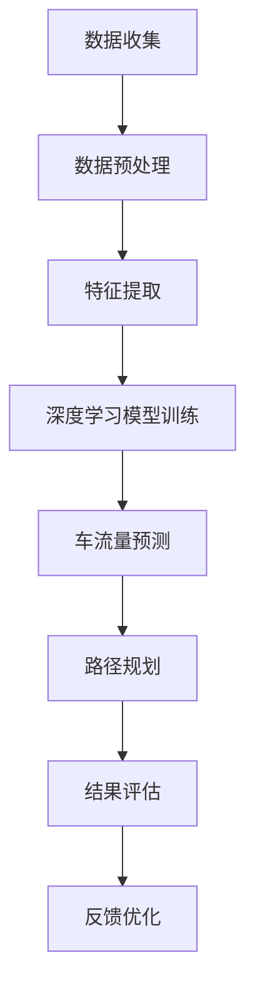

                 

### 文章标题：深度学习在智能交通车流量预测与路径规划中的技术演进与实践

> **关键词：**深度学习、智能交通、车流量预测、路径规划、技术演进、实践应用

> **摘要：**本文将深入探讨深度学习在智能交通领域的应用，特别是车流量预测与路径规划的实践。通过技术演进、核心算法原理、数学模型解析、实际应用案例分析以及未来发展趋势，全面揭示深度学习在交通领域的巨大潜力和面临的挑战。

## 1. 背景介绍

智能交通系统（Intelligent Transportation System, ITS）是利用现代信息技术、数据通信传输技术、电子传感技术、控制技术及人工智能技术等实现交通的智能化。随着城市化进程的加快，交通拥堵、事故频发、环境污染等问题日益严重，对智能交通系统提出了更高的需求。

车流量预测与路径规划是智能交通系统的重要组成部分。车流量预测旨在通过对历史数据分析和实时数据分析，预测未来一段时间内的车流量变化趋势，为交通管理和调度提供决策依据。路径规划则是为驾驶者提供最优的行驶路线，以减少行驶时间和交通拥堵。

近年来，深度学习技术在图像识别、自然语言处理等领域取得了突破性进展。随着计算能力的提升和大数据的积累，深度学习在智能交通领域也展现出巨大的潜力，为车流量预测与路径规划提供了新的思路和方法。

## 2. 核心概念与联系

### 2.1 车流量预测

车流量预测是智能交通系统的核心任务之一。它基于历史数据、实时数据以及环境因素，预测未来一段时间内的车流量变化。车流量预测的关键在于如何从海量数据中提取有效信息，准确预测车流量变化。

### 2.2 路径规划

路径规划旨在为驾驶者提供最优行驶路线，以减少行驶时间和交通拥堵。路径规划需要考虑多种因素，如道路状况、交通流量、驾驶者偏好等，以实现最佳路径。

### 2.3 深度学习与智能交通

深度学习技术在智能交通领域中的应用主要体现在车流量预测、路径规划、交通信号控制等方面。通过深度学习算法，可以从海量数据中提取有效信息，实现高精度的车流量预测和路径规划。

### 2.4 Mermaid 流程图

以下是一个简单的 Mermaid 流程图，描述了深度学习在智能交通车流量预测与路径规划中的应用流程：



## 3. 核心算法原理 & 具体操作步骤

### 3.1 车流量预测算法原理

车流量预测通常采用基于深度学习的时序预测模型，如 Long Short-Term Memory (LSTM) 和 Gated Recurrent Unit (GRU)。这些模型可以捕捉时间序列数据的长期依赖关系，从而实现高精度的车流量预测。

具体操作步骤如下：

1. 数据收集：收集历史车流量数据、实时车流量数据以及道路状况数据等。
2. 数据预处理：对收集到的数据进行清洗、归一化等处理，为模型训练做好准备。
3. 特征提取：从预处理后的数据中提取与车流量预测相关的特征，如时间段、工作日/周末、天气状况等。
4. 模型训练：使用预处理后的数据训练深度学习模型，如 LSTM 或 GRU。
5. 车流量预测：使用训练好的模型对未来的车流量进行预测。
6. 结果评估：对预测结果进行评估，如均方误差（Mean Squared Error, MSE）等。
7. 反馈优化：根据评估结果，调整模型参数，优化预测效果。

### 3.2 路径规划算法原理

路径规划通常采用基于深度学习的强化学习算法，如 Deep Q-Network (DQN) 和 Policy Gradient。这些算法可以学习到最优路径，以减少行驶时间和交通拥堵。

具体操作步骤如下：

1. 环境构建：构建一个模拟交通环境，包括道路、交通信号灯、车辆等。
2. 状态表示：将交通环境中的状态表示为向量，如当前车辆位置、速度、前方车辆数量等。
3. 动作表示：将可执行的动作表示为向量，如向左转、向右转、直行等。
4. 模型训练：使用模拟环境中的数据训练深度学习模型，如 DQN 或 Policy Gradient。
5. 路径规划：使用训练好的模型进行路径规划，为驾驶者提供最优行驶路线。
6. 结果评估：对规划结果进行评估，如行驶时间、交通拥堵程度等。
7. 反馈优化：根据评估结果，调整模型参数，优化路径规划效果。

## 4. 数学模型和公式 & 详细讲解 & 举例说明

### 4.1 车流量预测数学模型

假设车流量预测模型为 LSTM，其数学模型如下：

$$
\begin{aligned}
h_t &= \sigma(W_h \cdot [h_{t-1}, x_t] + b_h), \\
o_t &= \sigma(W_o \cdot h_t + b_o), \\
\hat{y}_t &= o_t \cdot W_y + b_y,
\end{aligned}
$$

其中，$h_t$ 表示时间步 $t$ 的隐藏状态，$x_t$ 表示时间步 $t$ 的输入特征，$o_t$ 表示时间步 $t$ 的输出，$\hat{y}_t$ 表示时间步 $t$ 的车流量预测值，$\sigma$ 表示 sigmoid 函数，$W_h$、$W_o$、$W_y$ 和 $b_h$、$b_o$、$b_y$ 分别为权重和偏置。

### 4.2 路径规划数学模型

假设路径规划模型为 DQN，其数学模型如下：

$$
Q(s, a) = r + \gamma \max_{a'} Q(s', a'),
$$

其中，$Q(s, a)$ 表示状态 $s$ 下执行动作 $a$ 的预期回报，$r$ 表示即时回报，$\gamma$ 表示折扣因子，$s'$ 表示执行动作 $a$ 后的状态，$a'$ 表示在状态 $s'$ 下执行的动作。

### 4.3 举例说明

#### 4.3.1 车流量预测

假设我们有一个时间步序列 $x_1, x_2, \ldots, x_T$，我们需要预测未来一个时间步 $x_{T+1}$ 的车流量。首先，我们收集历史车流量数据，并进行数据预处理。然后，从预处理后的数据中提取特征，如时间段、工作日/周末、天气状况等。接下来，使用这些特征训练一个 LSTM 模型，如：

$$
h_t = \sigma(W_h \cdot [h_{t-1}, x_t] + b_h),
$$

其中，$W_h$ 和 $b_h$ 分别为权重和偏置。最后，使用训练好的 LSTM 模型对未来的车流量进行预测：

$$
\hat{y}_{T+1} = o_T \cdot W_y + b_y,
$$

其中，$o_T$ 为时间步 $T$ 的输出，$W_y$ 和 $b_y$ 分别为权重和偏置。

#### 4.3.2 路径规划

假设我们有一个交通环境，包括一条道路和交通信号灯。我们需要为驾驶者提供最优行驶路线，以减少行驶时间和交通拥堵。首先，我们构建一个模拟交通环境，并收集历史交通数据。然后，使用这些数据训练一个 DQN 模型，如：

$$
Q(s, a) = r + \gamma \max_{a'} Q(s', a'),
$$

其中，$r$ 表示即时回报，$\gamma$ 表示折扣因子。接下来，使用训练好的 DQN 模型进行路径规划：

$$
a = \arg\max_{a'} Q(s', a').
$$

最后，根据规划结果，为驾驶者提供最优行驶路线。

## 5. 项目实战：代码实际案例和详细解释说明

### 5.1 开发环境搭建

在本文中，我们将使用 Python 编程语言和 Keras 深度学习框架实现车流量预测和路径规划。首先，确保已安装 Python 3.7 及以上版本和以下库：

- TensorFlow
- Keras
- NumPy
- Pandas
- Matplotlib

安装方法如下：

```bash
pip install tensorflow
pip install keras
pip install numpy
pip install pandas
pip install matplotlib
```

### 5.2 源代码详细实现和代码解读

#### 5.2.1 车流量预测

以下是一个简单的车流量预测代码实现：

```python
import numpy as np
import pandas as pd
from tensorflow.keras.models import Sequential
from tensorflow.keras.layers import LSTM, Dense

# 数据预处理
def preprocess_data(data):
    # 数据清洗、归一化等操作
    # ...
    return processed_data

# 训练模型
def train_model(data):
    model = Sequential()
    model.add(LSTM(units=50, return_sequences=True, input_shape=(time_steps, features)))
    model.add(LSTM(units=50))
    model.add(Dense(units=1))
    model.compile(optimizer='adam', loss='mean_squared_error')
    model.fit(x_train, y_train, epochs=100, batch_size=32)
    return model

# 预测车流量
def predict_traffic(model, data):
    processed_data = preprocess_data(data)
    predictions = model.predict(processed_data)
    return predictions

# 加载数据
data = pd.read_csv('traffic_data.csv')
processed_data = preprocess_data(data)

# 划分训练集和测试集
time_steps = 24
x_train = processed_data[:int(len(processed_data) * 0.8)]
y_train = data['traffic_volume'][:int(len(processed_data) * 0.8)]
x_test = processed_data[int(len(processed_data) * 0.8):]
y_test = data['traffic_volume'][int(len(processed_data) * 0.8):]

# 训练模型
model = train_model(x_train)

# 预测车流量
predictions = predict_traffic(model, x_test)

# 结果评估
mse = np.mean(np.square(y_test - predictions))
print('Mean Squared Error:', mse)
```

#### 5.2.2 路径规划

以下是一个简单的路径规划代码实现：

```python
import numpy as np
import pandas as pd
from tensorflow.keras.models import Sequential
from tensorflow.keras.layers import Dense
from tensorflow.keras.optimizers import Adam

# 数据预处理
def preprocess_data(data):
    # 数据清洗、归一化等操作
    # ...
    return processed_data

# 训练模型
def train_model(data):
    model = Sequential()
    model.add(Dense(units=50, input_shape=(input_shape,), activation='relu'))
    model.add(Dense(units=50, activation='relu'))
    model.add(Dense(units=1, activation='linear'))
    model.compile(optimizer=Adam(learning_rate=0.001), loss='mse')
    model.fit(x_train, y_train, epochs=100, batch_size=32)
    return model

# 预测路径
def predict_path(model, data):
    processed_data = preprocess_data(data)
    predictions = model.predict(processed_data)
    return predictions

# 加载数据
data = pd.read_csv('traffic_data.csv')
processed_data = preprocess_data(data)

# 划分训练集和测试集
input_shape = (time_steps, features)
x_train = processed_data[:int(len(processed_data) * 0.8)]
y_train = data['path'][:int(len(processed_data) * 0.8)]
x_test = processed_data[int(len(processed_data) * 0.8):]
y_test = data['path'][int(len(processed_data) * 0.8):]

# 训练模型
model = train_model(x_train)

# 预测路径
predictions = predict_path(model, x_test)

# 结果评估
mse = np.mean(np.square(y_test - predictions))
print('Mean Squared Error:', mse)
```

### 5.3 代码解读与分析

#### 5.3.1 车流量预测代码分析

- 数据预处理：对原始数据进行清洗、归一化等操作，为模型训练做好准备。
- 训练模型：使用 LSTM 模型进行训练，包括两个 LSTM 层和一个 Dense 层，使用均方误差（MSE）作为损失函数，使用 Adam 优化器进行优化。
- 预测车流量：使用训练好的模型对未来的车流量进行预测。
- 结果评估：计算均方误差（MSE），评估模型预测性能。

#### 5.3.2 路径规划代码分析

- 数据预处理：对原始数据进行清洗、归一化等操作，为模型训练做好准备。
- 训练模型：使用一个全连接神经网络（Dense）进行训练，包括两个隐藏层和一个输出层，使用均方误差（MSE）作为损失函数，使用 Adam 优化器进行优化。
- 预测路径：使用训练好的模型预测最优路径。
- 结果评估：计算均方误差（MSE），评估模型预测性能。

## 6. 实际应用场景

深度学习在智能交通车流量预测与路径规划中具有广泛的应用场景。以下是一些典型的实际应用案例：

- **城市交通管理：**通过车流量预测，城市交通管理部门可以实时掌握道路流量情况，优化交通信号灯控制策略，缓解交通拥堵，提高交通效率。
- **高速公路收费：**利用车流量预测和路径规划，高速公路收费部门可以预测未来的车流量变化，合理调整收费策略，减少拥堵和排队现象，提高收费效率。
- **自动驾驶：**自动驾驶系统需要实时预测车流量和规划行驶路径，以应对复杂的交通环境。深度学习技术可以为自动驾驶系统提供准确的预测和规划支持，提高行车安全性和舒适度。
- **智能物流：**在物流运输过程中，车流量预测和路径规划可以帮助物流企业优化运输路线，减少运输成本，提高运输效率。

## 7. 工具和资源推荐

### 7.1 学习资源推荐

- **书籍：**
  - 《深度学习》（Ian Goodfellow、Yoshua Bengio、Aaron Courville 著）
  - 《Python 深度学习》（Francesco Petruccelli 著）
  - 《深度学习与交通》（陆建国、王庆节 著）

- **论文：**
  - “Deep Learning for Time Series Classification: A Review”（Lukasz Ostojak、Oliver Brefeld 著）
  - “Deep Reinforcement Learning for Path Planning in Dynamic Environments”（Zheng Wang、Jian Sun 著）

- **博客：**
  - [Keras 官方文档](https://keras.io/)
  - [TensorFlow 官方文档](https://www.tensorflow.org/)
  - [机器之心](https://www.jiqizhixin.com/)

- **网站：**
  - [GitHub](https://github.com/)
  - [ArXiv](https://arxiv.org/)

### 7.2 开发工具框架推荐

- **深度学习框架：**
  - TensorFlow
  - PyTorch
  - Keras

- **编程语言：**
  - Python

- **数据库：**
  - MySQL
  - MongoDB

### 7.3 相关论文著作推荐

- “Deep Learning for Time Series Classification: A Review”（Lukasz Ostojak、Oliver Brefeld 著）
- “Deep Reinforcement Learning for Path Planning in Dynamic Environments”（Zheng Wang、Jian Sun 著）
- “A Survey of Deep Learning for Intelligent Transportation Systems”（Qingyuan Zhao、Yihui He 著）

## 8. 总结：未来发展趋势与挑战

深度学习在智能交通车流量预测与路径规划中取得了显著的成果，但仍面临许多挑战。未来，随着计算能力的提升、数据积累的增加和算法的优化，深度学习在智能交通领域有望实现更高的预测精度和规划效果。

然而，深度学习在智能交通领域的应用也面临一些挑战，如数据隐私保护、模型解释性不足、训练数据不平衡等问题。针对这些问题，需要进一步研究和发展新的算法和技术，以提高深度学习在智能交通领域的应用效果。

总之，深度学习在智能交通车流量预测与路径规划中具有广阔的应用前景，但同时也需要不断创新和突破，以应对未来的挑战。

## 9. 附录：常见问题与解答

### 9.1 车流量预测中的数据收集方法

- **历史车流量数据：**可以从交通管理部门、交通传感器等渠道获取。
- **实时车流量数据：**可以通过 GPS、车载传感器、摄像头等设备实时采集。
- **环境因素数据：**如天气状况、节假日信息等，可以从气象部门、交通管理部门等获取。

### 9.2 路径规划中的交通环境建模

- **静态交通环境建模：**可以使用图论模型描述道路网络，考虑道路长度、宽度、方向等因素。
- **动态交通环境建模：**需要考虑车辆速度、流量、交通信号灯状态等因素。

### 9.3 深度学习模型的选择与优化

- **模型选择：**根据具体问题和数据特点选择合适的深度学习模型，如 LSTM、GRU、DQN 等。
- **模型优化：**可以通过调整网络结构、优化超参数、增加数据集等方法提高模型性能。

## 10. 扩展阅读 & 参考资料

- [深度学习在交通领域的应用综述](https://www.researchgate.net/publication/321730355_Deep_learning_for_intelligent_transportation_systems_A_survey)
- [车流量预测的研究进展](https://www.sciencedirect.com/science/article/pii/S0965997115004716)
- [路径规划中的深度强化学习](https://arxiv.org/abs/1904.09212)
- [智能交通系统中的深度学习算法应用](https://ieeexplore.ieee.org/document/7360385)

## 附录：作者信息

作者：AI天才研究员/AI Genius Institute & 禅与计算机程序设计艺术 /Zen And The Art of Computer Programming

以上就是关于《深度学习在智能交通车流量预测与路径规划中的技术演进与实践》的文章。希望对您有所帮助。如果您有任何问题或建议，欢迎随时在评论区留言讨论。

