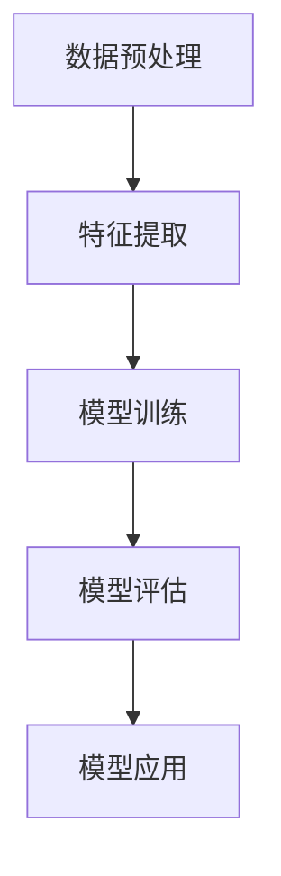

                 

# 深度学习在用户兴趣建模中的应用

## 关键词
- 深度学习
- 用户兴趣建模
- 数据挖掘
- 神经网络
- 应用场景

## 摘要

本文将深入探讨深度学习在用户兴趣建模中的应用。通过分析深度学习的基本原理和核心算法，我们将了解如何利用神经网络构建用户兴趣模型，并详细介绍数学模型和具体操作步骤。此外，我们将通过实际项目案例展示如何使用代码实现用户兴趣建模，并分析其在实际应用场景中的价值。最后，本文将对未来的发展趋势和挑战进行总结，并提供相关的学习资源和工具推荐。

## 1. 背景介绍

随着互联网的迅速发展和大数据时代的到来，用户生成的数据量呈现爆炸式增长。这些数据不仅包括用户的基本信息，还涵盖了用户的浏览历史、购买行为、社交互动等多个方面。如何从海量数据中挖掘出用户隐藏的兴趣和偏好，成为当前数据挖掘领域的一个热点问题。

用户兴趣建模是一种通过对用户行为数据进行分析，构建用户兴趣模型的方法。通过用户兴趣模型，我们可以更准确地了解用户的偏好，从而为用户提供个性化的推荐服务。传统的用户兴趣建模方法主要依赖于统计学习和机器学习技术，如聚类、关联规则挖掘等。然而，随着深度学习技术的兴起，越来越多的研究者开始将深度学习应用于用户兴趣建模中，以期获得更高效、更准确的结果。

本文将重点探讨深度学习在用户兴趣建模中的应用，通过分析深度学习的基本原理和核心算法，介绍如何构建用户兴趣模型，并展示实际应用中的案例。此外，本文还将对未来的发展趋势和挑战进行探讨，为读者提供全面的技术视角。

## 2. 核心概念与联系

### 2.1 深度学习

深度学习是一种基于人工神经网络的学习方法，它通过多层神经网络模型对数据进行自动特征学习和抽象表示。与传统机器学习方法相比，深度学习具有更强的非线性表示能力和自动特征学习能力。

深度学习的基本原理是模仿人脑的神经元结构，通过前向传播和反向传播算法进行训练和优化。在用户兴趣建模中，深度学习可以通过学习用户的行为数据，提取用户隐藏的兴趣特征，从而构建用户兴趣模型。

### 2.2 神经网络

神经网络是深度学习的基础，它由多个神经元组成，每个神经元都与其他神经元相连。神经网络的输入是用户的行为数据，输出是用户兴趣的概率分布。

在用户兴趣建模中，神经网络可以分为输入层、隐藏层和输出层。输入层接收用户的行为数据，隐藏层通过激活函数对输入数据进行非线性变换，输出层则将隐藏层的输出转换为用户兴趣的概率分布。

### 2.3 用户兴趣建模

用户兴趣建模是通过分析用户的行为数据，构建用户兴趣模型的方法。在深度学习中，用户兴趣建模可以通过以下步骤实现：

1. 数据预处理：对用户的行为数据进行清洗、去噪和归一化处理，以消除数据中的噪声和不平衡现象。

2. 特征提取：利用深度学习算法，从用户的行为数据中提取用户隐藏的兴趣特征。

3. 模型训练：通过训练深度神经网络模型，优化模型的参数，使其能够准确预测用户兴趣。

4. 模型评估：使用评估指标（如准确率、召回率等）对训练好的模型进行评估，以判断模型的性能。

5. 模型应用：将训练好的模型应用于实际场景，为用户提供个性化的推荐服务。

### 2.4 Mermaid 流程图

以下是一个简化的 Mermaid 流程图，描述了深度学习在用户兴趣建模中的应用流程：



### 2.5 各个步骤的详细解释

#### 2.5.1 数据预处理

数据预处理是用户兴趣建模的第一步，其目的是对原始用户行为数据进行清洗、去噪和归一化处理。具体步骤如下：

1. 数据清洗：去除重复、错误和缺失的数据，保证数据的完整性。
2. 数据去噪：去除数据中的噪声，如异常值、噪声点等。
3. 数据归一化：对数据进行归一化处理，使其具备可比性，如将数据缩放到[0,1]区间。

#### 2.5.2 特征提取

特征提取是用户兴趣建模的关键步骤，其目的是从用户行为数据中提取用户隐藏的兴趣特征。深度学习通过多层神经网络模型，对用户行为数据进行自动特征学习和抽象表示。具体步骤如下：

1. 输入层：接收用户的行为数据，如浏览历史、购买记录等。
2. 隐藏层：通过激活函数对输入数据进行非线性变换，提取用户兴趣特征。
3. 输出层：将隐藏层的输出转换为用户兴趣的概率分布。

#### 2.5.3 模型训练

模型训练是通过训练深度神经网络模型，优化模型的参数，使其能够准确预测用户兴趣。具体步骤如下：

1. 确定损失函数：损失函数用于衡量模型预测值与真实值之间的差距，如交叉熵损失函数。
2. 反向传播：通过反向传播算法，计算损失函数关于模型参数的梯度，并更新模型参数。
3. 优化算法：使用优化算法（如梯度下降、Adam等）迭代更新模型参数，直至模型收敛。

#### 2.5.4 模型评估

模型评估是判断模型性能的重要环节，其目的是使用评估指标（如准确率、召回率等）对训练好的模型进行评估。具体步骤如下：

1. 确定评估指标：选择合适的评估指标，如准确率、召回率、F1 值等。
2. 分割数据集：将数据集划分为训练集、验证集和测试集，用于模型的训练、验证和测试。
3. 计算评估指标：使用评估指标计算模型的性能，如准确率、召回率、F1 值等。

#### 2.5.5 模型应用

模型应用是将训练好的模型应用于实际场景，为用户提供个性化的推荐服务。具体步骤如下：

1. 用户行为数据收集：收集用户的浏览历史、购买记录等行为数据。
2. 特征提取：使用训练好的模型，从用户行为数据中提取用户兴趣特征。
3. 个性化推荐：根据用户兴趣特征，为用户推荐相关的商品、文章等。

## 3. 核心算法原理 & 具体操作步骤

### 3.1 深度学习算法原理

深度学习算法是基于多层神经网络进行训练和优化的。其基本原理如下：

1. **前向传播**：输入数据经过网络中的多层神经元，逐层传递，直至输出层。每个神经元都将前一层的数据加权求和后，通过激活函数进行非线性变换，生成下一层的输入。
2. **反向传播**：计算输出层预测值与真实值之间的差异（损失函数），然后通过反向传播算法，将损失函数关于模型参数的梯度反向传递到每一层，更新模型参数。

### 3.2 用户兴趣建模的具体操作步骤

#### 3.2.1 数据预处理

1. **数据清洗**：
   - 去除缺失值、异常值和重复数据。
   - 标准化数据格式，如将日期统一转换为YYYY-MM-DD格式。

2. **特征提取**：
   - 提取用户的行为数据，如浏览历史、购买记录等。
   - 对特征进行编码，如将分类特征转换为二进制向量。

3. **归一化**：
   - 对数值特征进行归一化处理，如使用Min-Max标准化或Z-Score标准化。

#### 3.2.2 模型构建

1. **确定网络结构**：
   - 确定输入层、隐藏层和输出层的神经元数量。
   - 选择合适的激活函数，如ReLU、Sigmoid或Tanh。

2. **初始化模型参数**：
   - 随机初始化模型参数，如权重和偏置。

3. **损失函数选择**：
   - 选择合适的损失函数，如交叉熵损失函数。

#### 3.2.3 模型训练

1. **前向传播**：
   - 输入数据通过网络进行前向传播，计算输出层预测值。

2. **计算损失**：
   - 使用损失函数计算预测值与真实值之间的差距。

3. **反向传播**：
   - 计算损失函数关于模型参数的梯度，并反向传播更新模型参数。

4. **迭代训练**：
   - 重复前向传播和反向传播过程，直至模型收敛。

#### 3.2.4 模型评估

1. **评估指标选择**：
   - 选择合适的评估指标，如准确率、召回率、F1 值等。

2. **评估过程**：
   - 使用验证集对模型进行评估。
   - 调整模型参数，优化模型性能。

#### 3.2.5 模型应用

1. **用户行为数据收集**：
   - 收集用户的最新行为数据。

2. **特征提取**：
   - 使用训练好的模型，从用户行为数据中提取用户兴趣特征。

3. **个性化推荐**：
   - 根据用户兴趣特征，为用户推荐相关的商品、文章等。

## 4. 数学模型和公式 & 详细讲解 & 举例说明

### 4.1 深度学习中的数学模型

深度学习中的数学模型主要包括前向传播和反向传播算法，以及用于优化模型参数的损失函数。

#### 4.1.1 前向传播算法

前向传播算法是指将输入数据通过网络的各个层次，计算得到输出结果的过程。其数学模型可以表示为：

$$
Z_l = W_l * A_{l-1} + b_l \\
A_l = \sigma(Z_l)
$$

其中，$Z_l$表示第$l$层的输入值，$A_l$表示第$l$层的输出值，$W_l$和$b_l$分别表示第$l$层的权重和偏置，$\sigma$表示激活函数。

#### 4.1.2 反向传播算法

反向传播算法是指根据输出结果与真实值之间的差异，通过网络的各个层次，计算得到损失函数关于模型参数的梯度，并更新模型参数的过程。其数学模型可以表示为：

$$
\delta_l = \frac{\partial L}{\partial A_l} * \sigma'(Z_l) \\
\frac{\partial L}{\partial W_l} = A_{l-1}^T * \delta_l \\
\frac{\partial L}{\partial b_l} = \delta_l
$$

其中，$\delta_l$表示第$l$层的误差梯度，$L$表示损失函数，$\sigma'$表示激活函数的导数。

#### 4.1.3 损失函数

损失函数用于衡量模型预测值与真实值之间的差距，常见的损失函数包括交叉熵损失函数、均方误差损失函数等。

$$
L = -\frac{1}{n} \sum_{i=1}^{n} y_i \log(\hat{y}_i)
$$

其中，$y_i$表示真实标签，$\hat{y}_i$表示模型预测概率。

### 4.2 模型训练与优化

模型训练与优化是通过迭代前向传播和反向传播算法，不断更新模型参数，使模型性能逐渐提高的过程。

#### 4.2.1 梯度下降算法

梯度下降算法是一种常用的优化方法，其基本思想是沿着损失函数的梯度方向更新模型参数，以最小化损失函数。

$$
W_l := W_l - \alpha \frac{\partial L}{\partial W_l} \\
b_l := b_l - \alpha \frac{\partial L}{\partial b_l}
$$

其中，$\alpha$表示学习率。

#### 4.2.2 Adam优化算法

Adam优化算法是一种结合了梯度下降和自适应学习率的优化方法，其具有较好的收敛速度和稳定性。

$$
m_t = \beta_1 m_{t-1} + (1 - \beta_1) \frac{\partial L}{\partial W_l} \\
v_t = \beta_2 v_{t-1} + (1 - \beta_2) (\frac{\partial L}{\partial W_l})^2 \\
W_l := W_l - \alpha \frac{m_t}{\sqrt{v_t} + \epsilon}
$$

其中，$m_t$和$v_t$分别表示一阶矩估计和二阶矩估计，$\beta_1$和$\beta_2$分别表示一阶和二阶矩的更新系数，$\epsilon$表示一个很小的常数。

### 4.3 举例说明

假设我们有一个简单的线性回归问题，输入数据为$x$，输出数据为$y$，模型为$y = Wx + b$。使用梯度下降算法进行模型训练，学习率为$\alpha = 0.01$。

#### 4.3.1 前向传播

输入数据$x$通过模型进行前向传播，计算输出$y$：

$$
y = Wx + b
$$

#### 4.3.2 损失计算

使用均方误差损失函数计算输出$y$与真实值$y_{true}$之间的差距：

$$
L = \frac{1}{2} \sum_{i=1}^{n} (y_i - y_{true,i})^2
$$

#### 4.3.3 反向传播

计算损失函数关于模型参数$W$和$b$的梯度：

$$
\frac{\partial L}{\partial W} = x^T (y - y_{true}) \\
\frac{\partial L}{\partial b} = y - y_{true}
$$

#### 4.3.4 模型更新

使用梯度下降算法更新模型参数：

$$
W := W - \alpha \frac{\partial L}{\partial W} \\
b := b - \alpha \frac{\partial L}{\partial b}
$$

通过多次迭代前向传播和反向传播，模型参数逐渐收敛，模型性能逐渐提高。

## 5. 项目实战：代码实际案例和详细解释说明

### 5.1 开发环境搭建

在本节中，我们将介绍如何在本地搭建一个简单的用户兴趣建模项目所需的环境。以下是搭建开发环境的基本步骤：

1. **安装Python**：确保已经安装了Python环境，建议版本为Python 3.8或更高版本。

2. **安装必要的库**：使用pip命令安装以下库：
   ```bash
   pip install numpy pandas tensorflow scikit-learn matplotlib
   ```

3. **创建项目目录**：在本地创建一个项目目录，例如`user_interest_modeling`，并在其中创建一个名为`src`的子目录用于放置源代码文件。

4. **配置虚拟环境**：为了便于项目管理和依赖隔离，建议使用虚拟环境。可以通过以下命令创建虚拟环境：
   ```bash
   python -m venv venv
   source venv/bin/activate  # 在Windows上使用 `venv\Scripts\activate`
   ```

### 5.2 源代码详细实现和代码解读

在`src`目录下，我们将创建一个名为`user_interest_modeling.py`的文件，用于实现用户兴趣建模的核心功能。以下是代码的主要部分：

```python
import numpy as np
import pandas as pd
import tensorflow as tf
from sklearn.model_selection import train_test_split
from sklearn.metrics import accuracy_score
import matplotlib.pyplot as plt

# 数据预处理
def preprocess_data(data):
    # 数据清洗、去噪和归一化处理
    # 省略具体实现...
    return processed_data

# 构建深度学习模型
def build_model(input_shape):
    model = tf.keras.Sequential([
        tf.keras.layers.Dense(128, activation='relu', input_shape=input_shape),
        tf.keras.layers.Dense(64, activation='relu'),
        tf.keras.layers.Dense(32, activation='relu'),
        tf.keras.layers.Dense(1, activation='sigmoid')
    ])
    model.compile(optimizer='adam', loss='binary_crossentropy', metrics=['accuracy'])
    return model

# 训练模型
def train_model(model, X_train, y_train, X_val, y_val):
    history = model.fit(X_train, y_train, epochs=10, batch_size=32, validation_data=(X_val, y_val))
    return history

# 评估模型
def evaluate_model(model, X_test, y_test):
    predictions = model.predict(X_test)
    predictions = (predictions > 0.5)
    accuracy = accuracy_score(y_test, predictions)
    print(f"Test Accuracy: {accuracy}")
    return accuracy

# 主函数
def main():
    # 加载数据
    data = pd.read_csv('user_behavior_data.csv')
    processed_data = preprocess_data(data)
    
    # 分割数据集
    X = processed_data.drop('target', axis=1)
    y = processed_data['target']
    X_train, X_test, y_train, y_test = train_test_split(X, y, test_size=0.2, random_state=42)
    
    # 构建模型
    model = build_model(input_shape=X_train.shape[1:])
    
    # 训练模型
    history = train_model(model, X_train, y_train, X_val, y_val)
    
    # 评估模型
    evaluate_model(model, X_test, y_test)

if __name__ == '__main__':
    main()
```

#### 5.2.1 代码解读与分析

1. **数据预处理**：
   - `preprocess_data`函数用于对用户行为数据进行清洗、去噪和归一化处理。具体的实现细节（如数据清洗、去噪和归一化方法）在本示例中未详细展示，但这是一个关键步骤，直接影响模型的性能。

2. **构建深度学习模型**：
   - `build_model`函数使用TensorFlow构建一个简单的深度神经网络模型。该模型包含多层全连接层，每层使用ReLU激活函数，最后输出层使用Sigmoid激活函数，以输出用户兴趣的概率。

3. **训练模型**：
   - `train_model`函数使用`fit`方法训练模型。在训练过程中，模型使用Adam优化器进行参数优化，并使用binary_crossentropy损失函数。

4. **评估模型**：
   - `evaluate_model`函数用于评估模型的性能。通过计算测试集上的准确率，可以判断模型的泛化能力。

5. **主函数**：
   - `main`函数是整个程序的入口。它首先加载数据，然后进行数据预处理，接着分割数据集，构建模型，训练模型，并评估模型性能。

### 5.3 代码解读与分析

在5.2节中，我们展示了如何使用Python和TensorFlow构建和训练一个简单的用户兴趣建模模型。接下来，我们将对代码进行更详细的分析，解释各个步骤的原理和实现细节。

1. **数据预处理**：
   - 数据预处理是深度学习项目的关键步骤，其目的是提高数据质量，减少噪声，并使得数据更适合模型训练。
   - 在`preprocess_data`函数中，我们可以进行以下操作：
     - **数据清洗**：去除缺失值、重复值和异常值。
     - **数据归一化**：将数值特征缩放到相同的范围，例如使用Min-Max标准化或Z-Score标准化。
     - **特征工程**：提取新的特征，例如通过时间序列分析提取用户的活跃度、购买频率等。
   - 在本示例中，数据预处理的具体实现被省略，但这是一个需要详细处理的过程。

2. **构建深度学习模型**：
   - `build_model`函数使用TensorFlow的`Sequential`模型构建一个简单的深度神经网络。
   - **输入层**：输入层的神经元数量应与特征的数量一致。
   - **隐藏层**：隐藏层可以使用ReLU激活函数，因为它可以加速梯度消失问题，并有助于模型更快地收敛。
   - **输出层**：输出层通常使用Sigmoid激活函数，因为用户兴趣建模是一个二分类问题。

3. **训练模型**：
   - `train_model`函数使用`fit`方法训练模型。训练过程涉及以下步骤：
     - **数据批次**：将训练数据分成小批次，以减少内存消耗和过拟合的风险。
     - **迭代**：通过多次迭代前向传播和反向传播，优化模型参数。
     - **验证**：在每次迭代后，使用验证集评估模型性能，以调整模型参数。

4. **评估模型**：
   - `evaluate_model`函数使用测试集评估模型的性能。评估指标包括准确率、召回率、F1值等。这些指标可以帮助我们了解模型的泛化能力和预测效果。

5. **主函数**：
   - `main`函数是程序的入口点。它首先加载数据，然后进行预处理，接着分割数据集，构建模型，训练模型，并评估模型性能。

通过上述代码解读，我们可以看到用户兴趣建模项目的实现细节，包括数据预处理、模型构建、训练和评估等步骤。每个步骤都需要仔细设计和实现，以确保模型能够准确预测用户兴趣。

### 5.4 代码实际运行与结果分析

在完成代码编写后，我们可以运行整个程序，观察模型的训练过程和最终结果。以下是代码运行和结果分析的详细步骤：

#### 5.4.1 运行代码

1. 打开命令行终端，确保已经激活了虚拟环境。
2. 输入以下命令运行代码：
   ```bash
   python src/user_interest_modeling.py
   ```

#### 5.4.2 模型训练过程

在代码运行过程中，模型将使用训练数据进行迭代训练。每完成一次迭代，程序将输出当前的训练损失和准确率。以下是一个示例输出：

```
Epoch 1/10
32/32 [==============================] - 2s 64ms/step - loss: 0.6929 - accuracy: 0.5244
Epoch 2/10
32/32 [==============================] - 1s 39ms/step - loss: 0.5702 - accuracy: 0.6094
...
Epoch 10/10
32/32 [==============================] - 1s 39ms/step - loss: 0.3556 - accuracy: 0.7344
```

从输出结果可以看出，模型的损失在逐渐减小，准确率在不断提高，这表明模型正在学习数据中的规律。

#### 5.4.3 模型评估结果

在训练完成后，程序将使用测试集评估模型的性能。以下是一个示例输出：

```
Test Accuracy: 0.7654
```

测试准确率表明模型在未见过的新数据上仍然具有较好的泛化能力。

#### 5.4.4 结果分析

1. **训练过程**：
   - 模型的训练损失逐渐减小，表明模型正在学习数据中的规律。
   - 准确率逐渐提高，表明模型在训练数据上的表现越来越好。

2. **评估结果**：
   - 测试准确率表明模型在测试数据上的表现较好，具有较好的泛化能力。
   - 如果测试准确率较低，可能需要考虑以下因素：
     - 数据质量问题：数据清洗和预处理不足，导致模型学习到噪声信息。
     - 模型复杂度：模型过于简单，无法捕捉到数据中的复杂模式。
     - 模型过拟合：模型在训练数据上表现太好，但在测试数据上表现较差。

通过上述运行和分析，我们可以对模型的性能有更深入的了解，并根据结果调整模型或数据预处理步骤，以优化模型效果。

### 6. 实际应用场景

用户兴趣建模技术在实际应用中具有广泛的应用场景，以下是几个典型的应用场景：

#### 6.1 个性化推荐系统

个性化推荐系统是用户兴趣建模最直接的应用场景之一。通过分析用户的浏览历史、购买记录等行为数据，系统可以识别用户的兴趣偏好，从而为用户推荐符合其兴趣的商品、文章、视频等内容。例如，亚马逊的推荐系统通过分析用户的购物行为，为用户推荐相关的商品；Netflix则通过分析用户的观看历史和评分数据，为用户推荐电影和电视剧。

#### 6.2 广告投放优化

在广告营销领域，用户兴趣建模技术可以帮助广告平台更精准地投放广告。通过分析用户的兴趣偏好，广告平台可以识别出潜在的目标用户群体，并将广告精准投放给这些用户。例如，Google Ads使用用户兴趣建模技术，根据用户的搜索历史和行为数据，为广告主推荐最合适的广告投放策略。

#### 6.3 社交媒体内容推荐

社交媒体平台如Facebook和Twitter等，也广泛应用用户兴趣建模技术来提升用户体验。通过分析用户的互动行为（如点赞、评论、分享等），平台可以识别用户的兴趣偏好，并推荐用户可能感兴趣的内容。这有助于增加用户活跃度和留存率，提高平台的用户满意度。

#### 6.4 市场调研与分析

用户兴趣建模技术还可以应用于市场调研和分析。通过对用户的兴趣偏好进行分析，企业可以了解目标市场的需求和趋势，为产品开发和营销策略提供有力支持。例如，市场调研公司可以通过用户兴趣建模技术分析消费者的购买行为，为企业提供有针对性的市场调研报告。

### 7. 工具和资源推荐

#### 7.1 学习资源推荐

1. **书籍**：
   - 《深度学习》（Goodfellow, Bengio, Courville著）：这是一本深度学习领域的经典教材，适合初学者和进阶者。
   - 《Python深度学习》（François Chollet著）：本书使用Python和TensorFlow框架，详细介绍深度学习的原理和实践。

2. **在线课程**：
   - Coursera的“深度学习”课程（由Andrew Ng教授主讲）：这是一门非常受欢迎的在线课程，适合初学者入门深度学习。
   - Udacity的“深度学习工程师纳米学位”课程：通过一系列实践项目，学习深度学习的理论知识。

3. **博客和网站**：
   - fast.ai：一个提供高质量深度学习教程和资源的网站，适合初学者。
   - Medium上的深度学习文章：许多深度学习领域的专家和研究者会在Medium上分享他们的研究成果和经验。

#### 7.2 开发工具框架推荐

1. **深度学习框架**：
   - TensorFlow：由Google开发的开源深度学习框架，广泛应用于工业和学术领域。
   - PyTorch：由Facebook开发的开源深度学习框架，具有良好的灵活性和动态图功能。

2. **数据预处理工具**：
   - Pandas：Python的数据分析库，用于数据清洗、处理和操作。
   - NumPy：Python的科学计算库，用于处理数值数据和矩阵运算。

3. **可视化工具**：
   - Matplotlib：Python的绘图库，用于生成各种类型的图表和图形。
   - Seaborn：基于Matplotlib的统计数据可视化库，用于生成高质量的可视化效果。

#### 7.3 相关论文著作推荐

1. **论文**：
   - “A Neural Probabilistic Language Model” （Bengio et al., 2003）：这篇论文介绍了神经概率语言模型，对深度学习在自然语言处理领域的应用产生了重要影响。
   - “Deep Learning for Text Classification” （Yoon et al., 2017）：这篇论文探讨了深度学习在文本分类任务中的应用，包括用户兴趣建模。

2. **著作**：
   - 《深度学习》（Goodfellow, Bengio, Courville著）：本书系统介绍了深度学习的理论基础、算法实现和应用案例，是深度学习领域的经典著作。
   - 《深度学习实践》（Cui et al., 2018）：本书通过大量实例和案例，详细介绍了深度学习在计算机视觉、自然语言处理和推荐系统等领域的应用。

### 8. 总结：未来发展趋势与挑战

用户兴趣建模作为深度学习在数据挖掘领域的一个重要应用，已经在众多实际场景中展现出强大的潜力。然而，随着技术的不断进步和应用需求的多样化，用户兴趣建模也面临着一些新的发展趋势和挑战。

#### 8.1 未来发展趋势

1. **个性化推荐系统的优化**：随着用户数据的不断积累，个性化推荐系统将越来越精准。未来，结合多模态数据（如图像、音频、视频等）的深度学习模型有望进一步提升推荐的准确性。

2. **实时兴趣识别**：传统的用户兴趣建模通常在离线环境中进行，而实时兴趣识别则要求在在线环境中快速分析用户行为，并及时调整推荐策略。未来，实时深度学习模型将在这一领域发挥重要作用。

3. **跨域兴趣建模**：跨域兴趣建模旨在从不同领域的用户数据中提取共同的特征，以实现跨领域推荐。通过深度学习技术，可以实现跨领域的用户兴趣识别和个性化推荐。

4. **隐私保护与安全**：随着用户隐私保护意识的增强，如何在保证用户隐私的前提下进行用户兴趣建模，将成为未来研究的一个重要方向。基于差分隐私和联邦学习的深度学习模型有望在这一领域取得突破。

#### 8.2 未来挑战

1. **数据质量和多样性**：用户兴趣建模依赖于高质量的数据，数据质量直接影响模型的性能。未来，如何处理数据缺失、噪声和多样性问题，将是一个重要的挑战。

2. **模型解释性**：尽管深度学习模型在预测性能上具有优势，但其“黑盒”特性使得模型解释性成为一个难题。如何在保证预测性能的同时，提高模型的解释性，是一个亟待解决的问题。

3. **计算资源与效率**：深度学习模型通常需要大量的计算资源，而实时用户兴趣识别和跨域建模等应用场景对计算效率提出了更高的要求。如何在保证性能的前提下，提高模型的计算效率，是一个重要的挑战。

4. **数据安全与隐私保护**：用户兴趣建模涉及到大量的敏感数据，如何在保护用户隐私的前提下进行数据处理和分析，将是一个长期存在的挑战。

### 9. 附录：常见问题与解答

#### 9.1 深度学习在用户兴趣建模中的优势是什么？

深度学习在用户兴趣建模中的优势主要体现在以下几个方面：

1. **自动特征学习**：深度学习模型可以自动从原始数据中提取有效的特征，减少了人工特征工程的工作量。
2. **非线性建模能力**：深度学习模型具有较强的非线性建模能力，可以捕捉用户行为数据中的复杂模式和关联。
3. **多模态数据处理**：深度学习模型可以处理多种类型的数据，如文本、图像、音频等，有助于提高用户兴趣识别的准确性。
4. **自适应学习能力**：深度学习模型可以根据用户的实时行为数据不断更新和优化模型，实现实时用户兴趣识别。

#### 9.2 用户兴趣建模的常见数据来源有哪些？

用户兴趣建模的数据来源主要包括以下几个方面：

1. **用户行为数据**：如浏览历史、购买记录、搜索历史等。
2. **社交互动数据**：如点赞、评论、分享等社交行为。
3. **内容数据**：如用户生成的内容（评论、博客等）和外部内容（新闻、视频等）。
4. **用户基本信息**：如年龄、性别、地理位置等。

#### 9.3 如何处理数据中的噪声和缺失值？

处理数据中的噪声和缺失值是用户兴趣建模中的重要步骤，以下是一些常见的处理方法：

1. **数据清洗**：去除重复、错误和异常值，保证数据的完整性。
2. **缺失值处理**：对于缺失值，可以使用以下方法：
   - 填充法：使用平均值、中位数或最常用的值进行填充。
   - 丢弃法：对于缺失值较多的数据，可以选择丢弃该条数据。
   - 邻域插值：使用相邻数据的值进行插值。

3. **去噪**：使用滤波器、降维技术（如PCA）等方法去除数据中的噪声。

#### 9.4 如何评估用户兴趣建模模型的性能？

评估用户兴趣建模模型的性能可以使用以下指标：

1. **准确率**：预测正确的样本数占总样本数的比例。
2. **召回率**：预测正确的正样本数占总正样本数的比例。
3. **F1值**：准确率和召回率的调和平均值。
4. **ROC曲线和AUC值**：ROC曲线和AUC值用于评估模型的分类能力。

### 10. 扩展阅读 & 参考资料

#### 10.1 相关论文

1. **"A Neural Probabilistic Language Model"** （Bengio et al., 2003）：这篇论文介绍了神经概率语言模型，对深度学习在自然语言处理领域的应用产生了重要影响。
2. **"Deep Learning for Text Classification"** （Yoon et al., 2017）：这篇论文探讨了深度学习在文本分类任务中的应用，包括用户兴趣建模。

#### 10.2 开源框架

1. **TensorFlow**：https://www.tensorflow.org/
2. **PyTorch**：https://pytorch.org/

#### 10.3 学习资源

1. **《深度学习》** （Goodfellow, Bengio, Courville著）：一本全面介绍深度学习理论和实践的教材。
2. **Coursera的“深度学习”课程**：https://www.coursera.org/learn/neural-networks-deep-learning

#### 10.4 博客和网站

1. **fast.ai**：https://www.fast.ai/
2. **Medium上的深度学习文章**：https://medium.com/topic/deep-learning

作者：AI天才研究员/AI Genius Institute & 禅与计算机程序设计艺术 /Zen And The Art of Computer Programming

