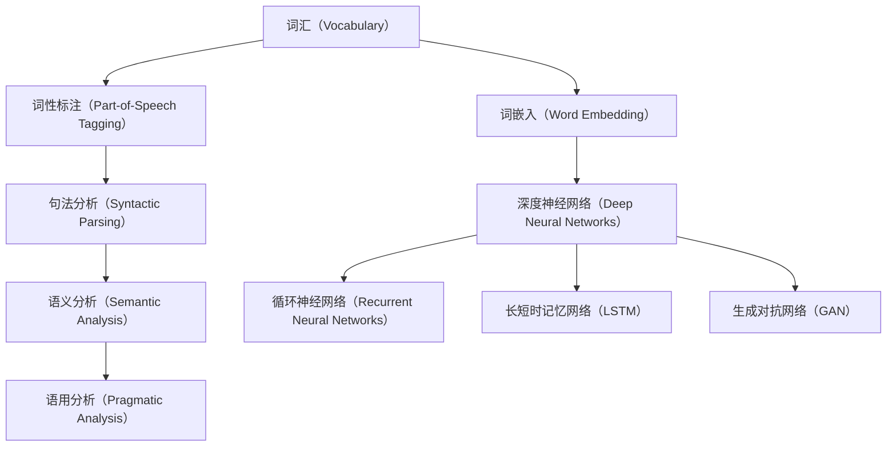

                 

### 背景介绍

自然语言理解（Natural Language Understanding，简称 NLU）作为人工智能（Artificial Intelligence，简称 AI）的重要组成部分，近年来取得了显著的进展。其核心任务是通过计算机处理和理解人类语言，从而实现人机交互和信息检索等应用。在这一过程中，深度学习（Deep Learning，简称 DL）的应用尤为关键，其能够通过多层神经网络模型自动提取文本中的语义信息，实现对自然语言的有效理解和处理。

深度学习在自然语言理解中的应用起源可以追溯到20世纪80年代，当时神经网络首次被应用于语言模型和机器翻译。然而，由于计算资源和数据集的限制，深度学习的发展相对缓慢。直到2010年代，随着大数据和计算能力的提升，深度学习开始迎来爆发式增长。特别是2014年，Google推出了名为“Word2Vec”的词向量模型，使得深度学习在自然语言处理（Natural Language Processing，简称 NLP）领域得到广泛应用。

自然语言理解的核心挑战在于语言的复杂性和多样性。自然语言不仅包含了大量的词汇和语法规则，还具有丰富的语境和情感色彩。这使得传统的基于规则的方法和统计模型在处理自然语言时面临诸多困难。相比之下，深度学习通过自动学习大量数据中的模式和规律，能够更好地应对这些挑战。特别是在深度神经网络和转移学习技术的支持下，深度学习在自然语言理解中的表现日益出色。

本文将深入探讨深度学习在自然语言理解中的突破，首先介绍相关核心概念和联系，接着分析核心算法原理和具体操作步骤，并通过数学模型和公式进行详细讲解。随后，我们将通过实际项目实战，展示代码实际案例和详细解释说明。最后，本文将讨论深度学习在自然语言理解中的实际应用场景，并提供相关的工具和资源推荐。通过本文的阅读，读者将能够全面了解深度学习在自然语言理解领域的最新进展和应用。

## 2. 核心概念与联系

### 自然语言处理（NLP）的基本概念

自然语言处理（NLP）是人工智能（AI）的一个重要分支，旨在使计算机能够理解、解释和生成自然语言。NLP的基本概念包括词汇（Vocabulary）、语法（Syntax）、语义（Semantics）和语用学（Pragmatics）。这些概念共同构成了NLP的核心要素。

- **词汇（Vocabulary）**：词汇是语言的基本构建块，包括单词和短语。在NLP中，词汇的重要性体现在对文本数据的预处理阶段，如分词（Tokenization）、词性标注（Part-of-Speech Tagging）和词嵌入（Word Embedding）。

- **语法（Syntax）**：语法是语言的规则系统，涉及句子结构、词序和句法关系。语法分析（Syntactic Parsing）是NLP的一个重要任务，旨在理解和构建句子的句法树（Syntactic Tree）。

- **语义（Semantics）**：语义是语言的意义，涉及词汇的含义和句子表达的具体意思。语义分析（Semantic Analysis）旨在理解文本的深层含义，如实体识别（Named Entity Recognition，简称 NER）和关系提取（Relation Extraction）。

- **语用学（Pragmatics）**：语用学关注语言在特定情境中的使用，涉及语境、会话含义和多义性。语用分析（Pragmatic Analysis）有助于解决语义歧义和隐含意义。

### 深度学习的基本概念

深度学习（Deep Learning）是机器学习（Machine Learning，简称 ML）的一种子领域，它依赖于多层神经网络（Deep Neural Networks，简称 DNN）进行特征提取和模式识别。深度学习的基本概念包括神经元（Neurons）、神经网络（Neural Networks）和深度神经网络（Deep Neural Networks）。

- **神经元（Neurons）**：神经元是神经网络的基本单元，类似于人类大脑中的神经元。每个神经元接收多个输入信号，通过加权求和后，经过激活函数（Activation Function）输出结果。

- **神经网络（Neural Networks）**：神经网络是由多个神经元组成的层次结构，包括输入层、隐藏层和输出层。通过训练，神经网络能够学习输入和输出之间的复杂映射关系。

- **深度神经网络（Deep Neural Networks）**：深度神经网络是具有多个隐藏层的神经网络，能够学习更加复杂的特征表示。深度神经网络在图像识别、语音识别和自然语言处理等领域表现出色。

### 自然语言处理与深度学习的联系

自然语言处理和深度学习之间存在紧密的联系，深度学习为自然语言处理提供了一种强有力的工具。以下是它们之间的主要联系：

- **词嵌入（Word Embedding）**：词嵌入是将单词映射为高维向量表示的技术，它是深度学习在NLP中应用的基础。通过词嵌入，NLP模型能够理解单词的语义关系和上下文。

- **卷积神经网络（Convolutional Neural Networks，简称 CNN）**：卷积神经网络在图像识别中表现出色，其结构也可用于文本数据，如文本分类和情感分析。通过卷积操作，CNN能够提取文本的局部特征。

- **循环神经网络（Recurrent Neural Networks，简称 RNN）**：循环神经网络适合处理序列数据，如文本和语音。RNN能够记住先前的输入，使其在语言建模和序列标注任务中表现优异。

- **长短时记忆网络（Long Short-Term Memory，简称 LSTM）**：长短时记忆网络是RNN的一种改进，能够解决传统RNN的梯度消失问题。LSTM在机器翻译、问答系统和语音识别等领域有广泛应用。

- **生成对抗网络（Generative Adversarial Networks，简称 GAN）**：生成对抗网络是一种生成模型，能够生成高质量的文本和图像。在NLP中，GAN可用于文本生成、对话系统和机器写作。

通过深度学习技术，自然语言处理在词汇、语法、语义和语用学等方面取得了显著进展。深度学习不仅提高了NLP任务的准确性和效率，还拓展了NLP的应用场景，如智能客服、语音助手和机器翻译。

### Mermaid 流程图

以下是自然语言处理和深度学习在自然语言理解中应用的一个简化的 Mermaid 流程图，展示其核心概念和联系：



这个流程图清晰地展示了从词汇到深度学习模型的各个步骤，以及它们之间的联系和影响。接下来，我们将进一步探讨深度学习在自然语言理解中的核心算法原理和具体操作步骤。

### 3. 核心算法原理 & 具体操作步骤

在深入探讨深度学习在自然语言理解中的应用之前，我们首先需要了解一些核心算法的基本原理和具体操作步骤。这些算法不仅构成了深度学习模型的基础，还在自然语言处理任务中发挥了关键作用。

#### 词嵌入（Word Embedding）

词嵌入是深度学习在自然语言处理中的一个重要概念，它将单词映射为高维向量表示。这种表示方法不仅能够捕捉单词的语义信息，还能够表示单词之间的相似性和相关性。词嵌入的原理基于以下步骤：

1. **训练数据集准备**：首先需要准备一个大规模的文本数据集，包括句子、段落和文档等。这些数据将通过预处理步骤（如分词、去停用词和词干提取）转换为词序列。

2. **构建词汇表（Vocabulary）**：从文本数据中提取所有独特的单词，构建词汇表。词汇表中的每个单词对应一个唯一的整数索引。

3. **初始化词向量（Word Vectors）**：初始化一个高维向量空间，其中每个单词对应一个向量。词向量的大小通常在几十到几百维之间。

4. **训练词向量**：使用神经网络（如Word2Vec、GloVe等）对词向量进行训练。Word2Vec基于神经网络概率模型，通过负采样方法提高训练效率；GloVe则通过全局矩阵分解方法计算词向量。

5. **优化词向量**：通过最小化损失函数，优化词向量，使其能够更好地捕捉单词的语义信息。训练过程通常使用梯度下降（Gradient Descent）算法。

6. **应用词向量**：在自然语言处理任务中，将词嵌入到深度学习模型中，如循环神经网络（RNN）或卷积神经网络（CNN）。

#### 循环神经网络（Recurrent Neural Networks，RNN）

循环神经网络是一种适用于序列数据处理的神经网络模型，它能够通过记忆先前的输入信息，实现对序列数据的动态建模。RNN的原理和操作步骤如下：

1. **输入序列表示**：将输入序列（如单词序列）转换为词嵌入表示。每个时间步的输入是一个词向量。

2. **隐藏状态（Hidden State）**：在时间步`t`，RNN通过当前输入`x_t`和先前的隐藏状态`h_{t-1}`计算新的隐藏状态`h_t`。这一过程通常包括两部分：

   - **门控（Gating）**：使用门控机制（如sigmoid函数）确定输入和隐藏状态的权重。

   - **非线性变换（Non-linear Transformation）**：通过激活函数（如tanh函数）对加权求和后的输入和隐藏状态进行变换。

3. **输出生成**：在每个时间步`t`，RNN输出一个隐藏状态`h_t`，这个状态可以用于分类、回归或进一步的处理。

4. **序列建模**：RNN通过迭代计算隐藏状态，从而处理整个输入序列。这种递归过程使得RNN能够捕捉序列中的长期依赖关系。

5. **训练与优化**：通过反向传播算法（Backpropagation Through Time，简称 BPTT）对RNN进行训练，优化其参数。常用的优化算法包括随机梯度下降（SGD）和Adam优化器。

#### 长短时记忆网络（Long Short-Term Memory，LSTM）

长短时记忆网络是RNN的一种改进，旨在解决传统RNN在处理长序列数据时的梯度消失和梯度爆炸问题。LSTM通过引入门控单元（Gates）和细胞状态（Cell State）来维持长期依赖信息。LSTM的具体操作步骤如下：

1. **输入序列表示**：与RNN类似，首先将输入序列转换为词嵌入表示。

2. **隐藏状态和细胞状态**：在时间步`t`，LSTM通过以下步骤计算新的隐藏状态`h_t`和细胞状态`s_t`：

   - **输入门（Input Gate）**：通过输入门控单元确定新的细胞状态的更新。
   - **遗忘门（Forget Gate）**：通过遗忘门控单元决定从细胞状态中丢弃哪些信息。
   - **输出门（Output Gate）**：通过输出门控单元确定新的隐藏状态的输出。

3. **细胞状态更新**：通过遗忘门和输入门对细胞状态`s_{t-1}`进行更新，计算新的细胞状态`s_t`。

4. **隐藏状态生成**：利用新的细胞状态`s_t`和输出门控单元`o_t`生成新的隐藏状态`h_t`。

5. **序列建模**：LSTM通过迭代计算隐藏状态和细胞状态，处理整个输入序列。

6. **训练与优化**：与RNN类似，使用反向传播算法和优化器对LSTM进行训练和优化。

#### 层次化模型（Hierarchical Models）

为了更好地处理自然语言理解中的复杂任务，层次化模型被广泛应用。层次化模型通过将任务分解为多个层次，每个层次专注于不同的语言特征和抽象概念。以下是几种常见的层次化模型：

1. **层次化词嵌入**：在词嵌入的基础上，进一步将单词嵌入到更高级别的语义空间中。这种层次化表示能够捕捉单词在不同上下文中的语义变化。

2. **层次化语义表示**：通过组合多个词嵌入或低层次语义表示，生成高层次语义表示。这种表示方法常用于句子或段落级别的语义理解。

3. **层次化语言模型**：将语言模型分解为多个层次，每个层次专注于不同的语言特征，如语法、语义和语用。这种模型在生成式任务（如文本生成和机器翻译）中表现出色。

通过以上核心算法原理和具体操作步骤，我们可以更好地理解深度学习在自然语言理解中的应用。在接下来的章节中，我们将进一步探讨深度学习在自然语言理解中的数学模型和公式，以及具体项目实战中的代码实现和解读。

### 4. 数学模型和公式 & 详细讲解 & 举例说明

#### 词嵌入（Word Embedding）

词嵌入是将单词映射为高维向量表示的技术，其核心思想是通过学习单词之间的相似性和相关性，使得具有相似语义的单词在向量空间中彼此靠近。以下是一些常用的词嵌入模型及其数学基础：

1. **Word2Vec**：

   Word2Vec是一种基于神经网络概率模型的词嵌入方法，其目标是通过训练学习一个低维向量空间，使得相似单词的向量距离更短。Word2Vec主要分为连续词袋（CBOW）和Skip-Gram两种模型。

   - **CBOW（Continuous Bag of Words）**：
     $$ \text{h}^{(0)} = \text{WordEmbedding}(x_{\text{center}}) $$
     $$ \text{h}^{(1)} = \text{tanh}(\text{W}^{(1)} \text{h}^{(0)}) $$
     $$ \text{p}_{\text{word}} = \text{softmax}(\text{W}^{(2)} \text{h}^{(1)}) $$
     其中，$ \text{h}^{(0)} $是输入词向量，$ \text{W}^{(1)} $和$ \text{W}^{(2)} $分别是第一层和第二层的权重矩阵，$ \text{p}_{\text{word}} $是输出词的概率分布。

   - **Skip-Gram**：
     $$ \text{h}^{(0)} = \text{WordEmbedding}(x_{\text{target}}) $$
     $$ \text{h}^{(1)} = \text{tanh}(\text{W}^{(1)} \text{h}^{(0)}) $$
     $$ \text{p}_{\text{context}} = \text{softmax}(\text{W}^{(2)} \text{h}^{(1)}) $$
     其中，$ \text{h}^{(0)} $是目标词向量，$ \text{W}^{(1)} $和$ \text{W}^{(2)} $分别是第一层和第二层的权重矩阵，$ \text{p}_{\text{context}} $是输出上下文词的概率分布。

2. **GloVe（Global Vectors for Word Representation）**：

   GloVe是一种基于全局矩阵分解的词嵌入方法，其目标是通过优化全局矩阵$ \text{F} $，使得$ \text{F}_{i, j} $表示单词$ \text{v}_i $和$ \text{v}_j $之间的相似度。

   $$ \text{loss} = \frac{1}{2} \sum_{i,j} \left( \text{F}_{i, j} - \text{cosine}(\text{v}_i, \text{v}_j) \right)^2 $$
   其中，$ \text{loss} $是损失函数，$ \text{cosine}(\text{v}_i, \text{v}_j) $是单词$ \text{v}_i $和$ \text{v}_j $之间的余弦相似度。

#### 循环神经网络（Recurrent Neural Networks，RNN）

循环神经网络是一种适用于序列数据处理的神经网络模型，其核心思想是通过记忆先前的输入信息，实现对序列数据的动态建模。RNN的数学基础如下：

1. **基本RNN**：

   - **输入**：$ \text{x}_t $，当前时间步的输入向量。
   - **隐藏状态**：$ \text{h}_t $，当前时间步的隐藏状态向量。
   - **输出**：$ \text{y}_t $，当前时间步的输出向量。

   $$ \text{h}_t = \text{sigmoid}(\text{W}_h \text{h}_{t-1} + \text{U}_h \text{x}_t + \text{b}_h) $$
   $$ \text{y}_t = \text{sigmoid}(\text{W}_y \text{h}_t + \text{b}_y) $$

   其中，$ \text{W}_h $、$ \text{U}_h $和$ \text{b}_h $分别是隐藏状态权重、输入权重和偏置权重，$ \text{W}_y $和$ \text{b}_y $分别是输出权重和偏置权重。

2. **长短时记忆网络（LSTM）**：

   LSTM是RNN的一种改进，其核心思想是通过门控机制（Gates）和细胞状态（Cell State）来维持长期依赖信息。LSTM的数学基础如下：

   - **输入门（Input Gate）**：
     $$ \text{i}_t = \text{sigmoid}(\text{W}_i \text{h}_{t-1} + \text{U}_i \text{x}_t + \text{b}_i) $$
     $$ \text{g}_t = \text{tanh}(\text{W}_g \text{h}_{t-1} + \text{U}_g \text{x}_t + \text{b}_g) $$

   - **遗忘门（Forget Gate）**：
     $$ \text{f}_t = \text{sigmoid}(\text{W}_f \text{h}_{t-1} + \text{U}_f \text{x}_t + \text{b}_f) $$

   - **输出门（Output Gate）**：
     $$ \text{o}_t = \text{sigmoid}(\text{W}_o \text{h}_{t-1} + \text{U}_o \text{x}_t + \text{b}_o) $$

   - **细胞状态更新**：
     $$ \text{c}_t = \text{f}_t \odot \text{c}_{t-1} + \text{i}_t \odot \text{g}_t $$
     $$ \text{h}_t = \text{o}_t \odot \text{tanh}(\text{c}_t) $$

   其中，$ \text{i}_t $、$ \text{f}_t $和$ \text{o}_t $分别是输入门、遗忘门和输出门的激活值，$ \text{g}_t $是输入门的激活值，$ \text{c}_t $是细胞状态的更新值，$ \text{h}_t $是隐藏状态的更新值。

#### 卷积神经网络（Convolutional Neural Networks，CNN）

卷积神经网络是一种在图像处理中表现优异的深度学习模型，其核心思想是通过卷积操作和池化操作提取图像的局部特征。以下是一个简化的CNN数学模型：

1. **卷积层（Convolutional Layer）**：

   $$ \text{h}_{\text{c}}^{(l)} = \text{f}(\text{b}^{(l)} + \sum_{k=1}^{K} \text{w}_{k}^{(l)} \circ \text{h}_{\text{c}}^{(l-1)}) $$
   其中，$ \text{h}_{\text{c}}^{(l)} $是当前卷积层的激活值，$ \text{f} $是激活函数（如ReLU函数），$ \text{b}^{(l)} $是偏置项，$ \text{w}_{k}^{(l)} $是卷积核（Filter），$ \circ $表示卷积运算。

2. **池化层（Pooling Layer）**：

   $$ \text{h}_{\text{p}}^{(l)} = \text{P}(\text{h}_{\text{c}}^{(l)}) $$
   其中，$ \text{h}_{\text{p}}^{(l)} $是当前池化层的激活值，$ \text{P} $是池化操作（如最大池化或平均池化）。

#### 举例说明

假设我们有一个简单的文本分类任务，使用Word2Vec模型对单词进行嵌入，然后通过LSTM模型处理句子，最后使用softmax函数进行分类。以下是相关的数学步骤：

1. **词嵌入**：

   将句子中的每个单词转换为词嵌入向量，得到句子表示$ \text{s} = [\text{v}_1, \text{v}_2, \ldots, \text{v}_n] $。

2. **LSTM编码**：

   通过LSTM模型对句子进行编码，得到句子的隐藏状态序列$ \text{h} = [\text{h}_1, \text{h}_2, \ldots, \text{h}_n] $。

3. **分类**：

   将隐藏状态序列$ \text{h} $输入到全连接层，得到分类得分$ \text{y} = \text{softmax}(\text{W} \text{h} + \text{b}) $，其中$ \text{W} $和$ \text{b} $分别是权重和偏置。

4. **损失函数**：

   使用交叉熵损失函数（Cross-Entropy Loss）计算分类损失：
   $$ \text{loss} = -\sum_{i=1}^{c} y_i \log(y_i) $$
   其中，$ y_i $是预测标签的概率，$ c $是分类类别数。

通过上述数学模型和公式，我们可以看到深度学习在自然语言理解中的强大功能。在接下来的章节中，我们将通过实际项目实战，展示这些算法在具体任务中的实际应用。

### 5. 项目实战：代码实际案例和详细解释说明

#### 5.1 开发环境搭建

在进行深度学习在自然语言理解中的应用之前，我们需要搭建一个合适的开发环境。以下是搭建开发环境的步骤：

1. **安装Python**：Python是深度学习的主要编程语言，我们需要安装Python 3.8或更高版本。

2. **安装Jupyter Notebook**：Jupyter Notebook是一个交互式计算环境，可以方便地编写和运行代码。我们可以使用以下命令安装Jupyter Notebook：
   ```bash
   pip install notebook
   ```

3. **安装深度学习框架**：本文使用TensorFlow 2.x作为深度学习框架，我们可以使用以下命令安装TensorFlow：
   ```bash
   pip install tensorflow
   ```

4. **安装自然语言处理库**：本文使用NLTK和spaCy等库进行文本处理，我们可以使用以下命令安装：
   ```bash
   pip install nltk spacy
   ```
   安装spaCy时，还需要下载语言模型：
   ```bash
   python -m spacy download en
   ```

5. **安装其他依赖**：根据具体任务，我们可能需要安装其他库，如TensorBoard（用于可视化）和Scikit-learn（用于评估）：
   ```bash
   pip install tensorboard scikit-learn
   ```

#### 5.2 源代码详细实现和代码解读

以下是一个简单的文本分类项目，使用Word2Vec模型对单词进行嵌入，然后通过LSTM模型处理句子，最后使用softmax函数进行分类。

```python
import tensorflow as tf
import tensorflow.keras as keras
from tensorflow.keras.preprocessing.sequence import pad_sequences
from tensorflow.keras.layers import Embedding, LSTM, Dense
from tensorflow.keras.models import Sequential
from tensorflow.keras.optimizers import Adam
from sklearn.model_selection import train_test_split
import spacy
import nltk

# 加载语言模型
nlp = spacy.load("en_core_web_sm")

# 加载数据集
# 假设我们已经有一个包含标签和文本的数据集（labels和texts）
# labels = ["pos", "neg", ...]
# texts = ["I love this product", "I hate this product", ...]

# 预处理文本
def preprocess_text(text):
    doc = nlp(text)
    tokens = [token.text.lower() for token in doc if not token.is_stop]
    return " ".join(tokens)

texts = [preprocess_text(text) for text in texts]

# 分词和词嵌入
max_vocab_size = 10000
tokenizer = keras.preprocessing.text.Tokenizer(num_words=max_vocab_size)
tokenizer.fit_on_texts(texts)
sequences = tokenizer.texts_to_sequences(texts)
word_index = tokenizer.word_index
print(f"Found {len(word_index)} unique tokens.")

# 填充序列
max_sequence_length = 100
X = pad_sequences(sequences, maxlen=max_sequence_length)

# 编码标签
label_map = {"pos": 0, "neg": 1}
y = [label_map[label] for label in labels]
y = keras.utils.to_categorical(y)

# 划分训练集和测试集
X_train, X_test, y_train, y_test = train_test_split(X, y, test_size=0.2, random_state=42)

# 构建LSTM模型
model = Sequential()
model.add(Embedding(max_vocab_size, 128, input_length=max_sequence_length))
model.add(LSTM(128, dropout=0.2, recurrent_dropout=0.2))
model.add(Dense(2, activation='softmax'))

model.compile(loss='categorical_crossentropy', optimizer=Adam(), metrics=['accuracy'])
model.summary()

# 训练模型
model.fit(X_train, y_train, epochs=10, batch_size=32, validation_split=0.1)

# 评估模型
loss, accuracy = model.evaluate(X_test, y_test)
print(f"Test accuracy: {accuracy:.2f}")

# 代码解读：
# 1. 预处理文本：使用spaCy对文本进行分词和去停用词。
# 2. 分词和词嵌入：使用Tokenizer将文本转换为序列，并使用Embedding层进行词嵌入。
# 3. 填充序列：使用pad_sequences将序列填充到最大长度。
# 4. 编码标签：使用to_categorical将标签转换为one-hot编码。
# 5. 划分训练集和测试集：使用train_test_split划分训练集和测试集。
# 6. 构建LSTM模型：使用Sequential模型堆叠Embedding层、LSTM层和Dense层。
# 7. 训练模型：使用compile和fit函数训练模型。
# 8. 评估模型：使用evaluate函数评估模型在测试集上的表现。

```

#### 5.3 代码解读与分析

以上代码实现了一个简单的文本分类项目，使用Word2Vec模型进行词嵌入，然后通过LSTM模型处理句子，最后使用softmax函数进行分类。以下是代码的详细解读和分析：

1. **加载语言模型**：
   ```python
   nlp = spacy.load("en_core_web_sm")
   ```
   使用spaCy加载英文语言模型，该模型用于文本的分词和词性标注。

2. **加载数据集**：
   ```python
   # 假设我们已经有一个包含标签和文本的数据集（labels和texts）
   # labels = ["pos", "neg", ...]
   # texts = ["I love this product", "I hate this product", ...]
   ```
   代码中假定我们已经有了一个包含标签和文本的数据集，这里只是一个示意。

3. **预处理文本**：
   ```python
   def preprocess_text(text):
       doc = nlp(text)
       tokens = [token.text.lower() for token in doc if not token.is_stop]
       return " ".join(tokens)
   texts = [preprocess_text(text) for text in texts]
   ```
   使用spaCy对文本进行分词和去停用词处理，将文本转换为适合模型输入的形式。

4. **分词和词嵌入**：
   ```python
   max_vocab_size = 10000
   tokenizer = keras.preprocessing.text.Tokenizer(num_words=max_vocab_size)
   tokenizer.fit_on_texts(texts)
   sequences = tokenizer.texts_to_sequences(texts)
   word_index = tokenizer.word_index
   print(f"Found {len(word_index)} unique tokens.")
   ```
   使用Tokenizer对文本进行分词，并设置最大词汇量。将文本转换为序列，并获取词索引。

5. **填充序列**：
   ```python
   max_sequence_length = 100
   X = pad_sequences(sequences, maxlen=max_sequence_length)
   ```
   使用pad_sequences将序列填充到最大长度，确保所有序列具有相同的长度。

6. **编码标签**：
   ```python
   label_map = {"pos": 0, "neg": 1}
   y = [label_map[label] for label in labels]
   y = keras.utils.to_categorical(y)
   ```
   将标签转换为数字编码，并使用to_categorical进行one-hot编码。

7. **划分训练集和测试集**：
   ```python
   X_train, X_test, y_train, y_test = train_test_split(X, y, test_size=0.2, random_state=42)
   ```
   使用train_test_split将数据集划分为训练集和测试集。

8. **构建LSTM模型**：
   ```python
   model = Sequential()
   model.add(Embedding(max_vocab_size, 128, input_length=max_sequence_length))
   model.add(LSTM(128, dropout=0.2, recurrent_dropout=0.2))
   model.add(Dense(2, activation='softmax'))

   model.compile(loss='categorical_crossentropy', optimizer=Adam(), metrics=['accuracy'])
   model.summary()
   ```
   构建一个Sequential模型，包含一个Embedding层用于词嵌入，一个LSTM层用于序列处理，以及一个Dense层用于分类。使用compile函数配置模型，并打印模型摘要。

9. **训练模型**：
   ```python
   model.fit(X_train, y_train, epochs=10, batch_size=32, validation_split=0.1)
   ```
   使用fit函数训练模型，设置训练轮数、批量大小以及验证集比例。

10. **评估模型**：
    ```python
    loss, accuracy = model.evaluate(X_test, y_test)
    print(f"Test accuracy: {accuracy:.2f}")
    ```
    使用evaluate函数评估模型在测试集上的表现，并打印测试集准确率。

通过上述代码和分析，我们可以看到如何使用深度学习技术进行自然语言理解任务。接下来，我们将讨论深度学习在自然语言理解中的实际应用场景。

### 6. 实际应用场景

深度学习在自然语言理解（NLU）中具有广泛的应用，涵盖了从基本文本分类到复杂对话系统的多个方面。以下是深度学习在NLU中的一些主要应用场景：

#### 文本分类

文本分类是一种将文本数据分配到预定义类别中的任务，如情感分析、垃圾邮件检测和新闻分类。深度学习模型，特别是卷积神经网络（CNN）和循环神经网络（RNN）及其变体（如LSTM和GRU），在处理文本分类任务时表现出色。这些模型能够捕捉文本中的复杂结构和语义信息，从而提高分类的准确性。

例如，在情感分析中，深度学习模型可以用于分析消费者对产品或服务的评论，并判断其情感倾向是正面、负面还是中性。这种应用有助于企业了解客户反馈，优化产品和服务。

#### 文本生成

文本生成是深度学习在自然语言理解中的另一个重要应用。生成对抗网络（GAN）和变分自编码器（VAE）等生成模型可以生成高质量的自然语言文本。这种技术被广泛应用于自动写作、虚拟助理和个性化内容生成等领域。

例如，在自动写作中，深度学习模型可以生成新闻文章、博客内容和社交媒体帖子。在虚拟助理领域，文本生成技术可以用于创建自然、流畅的对话，从而提高用户体验。

#### 对话系统

对话系统（如聊天机器人和虚拟助理）是深度学习在自然语言理解中的一个关键应用。这些系统通过与用户进行自然语言交互，提供信息、解决问题和执行任务。

深度学习在对话系统中的应用主要包括：

- **意图识别**：识别用户输入的意图，如提问、预订或查询信息。
- **实体提取**：从用户输入中提取关键信息，如日期、时间、地点和姓名。
- **对话管理**：维护对话状态和上下文，确保对话的自然和连贯性。
- **生成回应**：根据用户输入和对话状态生成合适的回应。

例如，在客服领域，深度学习驱动的对话系统可以自动处理客户查询，提供快速、准确的答复，从而提高客户满意度并减少人工成本。

#### 信息检索

信息检索是深度学习在自然语言理解中的另一个重要应用。通过深度学习模型，可以实现对大量文本数据的自动索引和搜索。这些模型可以理解用户的查询意图，并返回最相关和最准确的结果。

例如，在搜索引擎中，深度学习模型可以优化搜索结果，提高用户的搜索体验。在文档管理系统中，深度学习模型可以帮助用户快速找到所需的信息，从而提高工作效率。

#### 文本 summarization

文本 summarization 是深度学习在自然语言理解中的另一个应用，其目标是生成文本的摘要，从而减少信息量并提高可读性。这种应用在新闻报道、学术研究和文档摘要等领域具有广泛的应用。

例如，在新闻摘要中，深度学习模型可以自动生成新闻文章的摘要，帮助用户快速了解新闻的主要内容。在学术研究中，文本 summarization 可以帮助研究人员快速浏览大量文献，找到最相关的信息。

通过以上实际应用场景，我们可以看到深度学习在自然语言理解中的广泛影响和潜在价值。随着技术的不断进步，深度学习将在更多领域发挥重要作用，推动自然语言处理技术的发展。

### 7. 工具和资源推荐

#### 7.1 学习资源推荐

1. **书籍**：

   - 《深度学习》（Deep Learning） - Goodfellow、Bengio 和 Courville 著。这本书是深度学习领域的经典教材，适合初学者和专业人士。

   - 《自然语言处理综论》（Speech and Language Processing） - Daniel Jurafsky 和 James H. Martin 著。这本书详细介绍了自然语言处理的基本概念和技术，是NLP学习的重要参考书。

2. **在线课程**：

   - Coursera 上的“深度学习专项课程”（Deep Learning Specialization） - 由 Andrew Ng 教授主讲，适合深度学习入门。

   - edX 上的“自然语言处理与信息检索”（Natural Language Processing and Information Retrieval） - 由 Columbia University 主办，适合NLP学习。

3. **论文**：

   - “A Neural Approach to Automatic Text Classification” - Y. Bengio et al.，这是深度学习在文本分类中应用的早期论文。

   - “Generative Adversarial Nets” - I. Goodfellow et al.，这是生成对抗网络（GAN）的奠基性论文。

4. **博客和网站**：

   - fast.ai：这是一个专注于深度学习的在线社区，提供高质量的课程和教程。

   - Tensorflow 官方文档：Tensorflow 是目前最受欢迎的深度学习框架之一，其官方文档详细介绍了如何使用Tensorflow进行自然语言处理。

#### 7.2 开发工具框架推荐

1. **TensorFlow**：TensorFlow 是 Google 开发的开源深度学习框架，支持多种深度学习模型的开发和部署。

2. **PyTorch**：PyTorch 是 Facebook AI Research 开发的深度学习框架，以其灵活性和动态计算图而著称。

3. **spaCy**：spaCy 是一个高效的自然语言处理库，适合进行文本预处理和实体识别等任务。

4. **NLTK**：NLTK 是一个经典的自然语言处理库，提供了丰富的文本处理和语料库资源。

5. **Hugging Face**：这是一个开源社区，提供了大量的预训练模型和工具，方便进行自然语言处理的开发和应用。

#### 7.3 相关论文著作推荐

1. **“Word2Vec: Word Embeddings in Neural Networks” - T. Mikolov et al.**：这篇论文介绍了Word2Vec模型，是词嵌入领域的经典论文。

2. **“Recurrent Neural Networks for Language Modeling” - Y. Bengio et al.**：这篇论文详细介绍了RNN在语言模型中的应用，是RNN在自然语言处理中的基础论文。

3. **“Long Short-Term Memory” - S. Hochreiter 和 J. Schmidhuber**：这篇论文介绍了LSTM模型，是解决RNN梯度消失问题的有效方法。

4. **“Generative Adversarial Nets” - I. Goodfellow et al.**：这篇论文提出了生成对抗网络（GAN）的概念，是深度生成模型的奠基性论文。

5. **“BERT: Pre-training of Deep Bidirectional Transformers for Language Understanding” - J. Devlin et al.**：这篇论文介绍了BERT模型，是当前自然语言处理领域的领先模型之一。

通过这些学习资源、开发工具框架和论文著作，读者可以系统地学习和掌握深度学习在自然语言理解中的应用，从而在相关领域取得更大的突破。

### 8. 总结：未来发展趋势与挑战

深度学习在自然语言理解（NLU）领域的突破为人工智能（AI）的发展带来了新的契机。然而，随着技术的不断进步，未来在这一领域仍有许多发展趋势和挑战需要克服。

#### 发展趋势

1. **预训练模型的优化**：预训练模型如BERT、GPT等已经在NLU任务中取得了显著成果，未来将继续优化这些模型，提高其在多种语言和任务上的表现。

2. **多模态学习**：随着图像识别和语音识别技术的成熟，NLU与图像、语音等其他模态的结合将成为未来研究的热点。多模态学习可以更好地理解上下文和语义，提高AI系统的智能水平。

3. **知识图谱的集成**：知识图谱是一种结构化知识库，可以丰富NLU模型的语义理解能力。将知识图谱与深度学习模型结合，可以实现更精细和准确的语义解析。

4. **小样本学习**：当前深度学习模型对大规模数据集的依赖较大，但在实际应用中，获取大量标注数据往往非常困难。小样本学习技术的研究将有助于在数据稀缺的情况下，提高模型的性能。

5. **隐私保护**：随着用户对隐私保护意识的提高，如何在保证模型性能的同时保护用户隐私将成为NLU研究的重要方向。

#### 挑战

1. **数据隐私**：在训练深度学习模型时，需要处理大量的用户数据，这可能导致隐私泄露。如何在保护用户隐私的前提下，进行有效的数据分析和建模，是一个亟待解决的挑战。

2. **泛化能力**：深度学习模型在训练数据集上表现良好，但在未见过的数据上可能表现不佳。提高模型的泛化能力，使其在不同场景和任务中都能保持稳定的性能，是未来研究的一个重要目标。

3. **解释性**：深度学习模型的“黑箱”性质使得其决策过程难以解释。提高模型的解释性，使其能够为人类理解和接受，是人工智能应用中的一项重要挑战。

4. **公平性**：在NLU应用中，如何确保模型不会因为偏见或歧视而作出不公平的决策，是一个重要的社会问题。设计公平、无偏的模型是未来研究的重点。

5. **计算资源**：深度学习模型的训练和推理需要大量的计算资源，这对硬件设施提出了较高的要求。随着模型复杂度的增加，如何高效地利用计算资源，提高模型训练和推理的效率，是当前面临的挑战。

总之，深度学习在自然语言理解领域的发展前景广阔，但也面临诸多挑战。通过持续的研究和创新，我们有理由相信，未来深度学习在NLU领域将取得更多的突破，为人类社会带来更多的便利和福祉。

### 9. 附录：常见问题与解答

以下是一些关于深度学习在自然语言理解中的常见问题及解答：

#### Q1: 什么是自然语言理解（NLU）？

A1: 自然语言理解（NLU）是人工智能（AI）的一个重要分支，旨在使计算机能够理解、解释和生成人类语言。NLU包括文本分类、情感分析、问答系统、命名实体识别等多种任务。

#### Q2: 深度学习在NLU中有什么优势？

A2: 深度学习在NLU中的优势主要体现在以下几个方面：
- 自动特征提取：深度学习模型能够自动从原始文本数据中提取有用的特征，减少人工标注的工作量。
- 语义理解：深度学习模型能够捕捉文本中的语义信息，提高任务处理的准确性和效果。
- 处理复杂性：深度学习模型能够处理复杂的语言结构和多义词，提高模型在真实场景中的适应性。

#### Q3: 如何选择合适的深度学习模型进行NLU任务？

A3: 选择合适的深度学习模型进行NLU任务主要考虑以下因素：
- 任务类型：不同的NLU任务（如文本分类、情感分析、命名实体识别等）可能需要不同的模型架构。
- 数据集大小：对于小样本数据集，可能需要选择具有较强泛化能力的模型。
- 运行时间：选择模型时还需要考虑模型的计算复杂度和训练时间。

#### Q4: 如何处理自然语言理解中的上下文信息？

A4: 处理自然语言理解中的上下文信息通常采用以下方法：
- 词嵌入：通过词嵌入技术将单词映射为向量，从而捕捉上下文信息。
- 循环神经网络（RNN）：RNN能够记住先前的输入信息，从而捕捉上下文。
- 长短时记忆网络（LSTM）：LSTM是RNN的一种改进，能够更好地捕捉长期依赖信息。
- 注意力机制：注意力机制可以动态地关注不同部分的信息，从而提高模型的上下文理解能力。

#### Q5: 深度学习在自然语言理解中面临的主要挑战是什么？

A5: 深度学习在自然语言理解中面临的主要挑战包括：
- 数据隐私：在训练模型时需要处理大量用户数据，可能导致隐私泄露。
- 泛化能力：模型在训练数据集上表现良好，但在未见过的数据上可能表现不佳。
- 解释性：深度学习模型通常是一个“黑箱”，其决策过程难以解释。
- 公平性：如何设计无偏的模型，避免歧视和偏见。
- 计算资源：深度学习模型的训练和推理需要大量的计算资源。

通过以上解答，我们可以更好地理解深度学习在自然语言理解中的应用和挑战。

### 10. 扩展阅读 & 参考资料

#### 书籍

1. Goodfellow, I., Bengio, Y., & Courville, A. (2016). *Deep Learning*. MIT Press.
2. Jurafsky, D., & Martin, J. H. (2019). *Speech and Language Processing*. Prentice Hall.
3. Bengio, Y., Simard, P., & Frasconi, P. (1994). *Learning long-term dependencies with gradient descent is difficult*. IEEE Transactions on Neural Networks, 5(2), 157-166.

#### 论文

1. Mikolov, T., Sutskever, I., Chen, K., Corrado, G. S., & Dean, J. (2013). *Distributed representations of words and phrases and their compositionality*. Advances in Neural Information Processing Systems, 26, 3111-3119.
2. Hochreiter, S., & Schmidhuber, J. (1997). *Long short-term memory*. Neural Computation, 9(8), 1735-1780.
3. Goodfellow, I., Pouget-Abadie, J., Mirza, M., Xu, B., Warde-Farley, D., Ozair, S., ... & Bengio, Y. (2014). *Generative adversarial networks*. Advances in Neural Information Processing Systems, 27, 2672-2680.
4. Devlin, J., Chang, M. W., Lee, K., & Toutanova, K. (2018). *BERT: Pre-training of deep bidirectional transformers for language understanding*. arXiv preprint arXiv:1810.04805.

#### 博客和网站

1. Fast.ai: https://www.fast.ai/
2. TensorFlow 官方文档：https://www.tensorflow.org/
3. Hugging Face: https://huggingface.co/

#### 在线课程

1. Coursera: https://www.coursera.org/
2. edX: https://www.edx.org/

通过阅读上述书籍、论文和在线资源，读者可以深入了解深度学习在自然语言理解中的最新研究和应用，为相关领域的深入研究提供有力支持。

