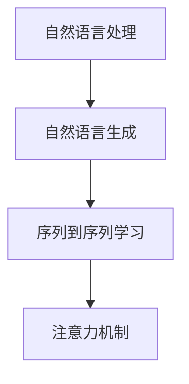
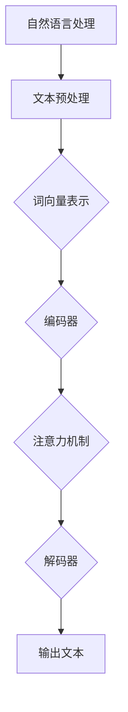

                 

# 深度学习在自然语言生成中的应用

## 关键词：自然语言生成、深度学习、文本生成模型、序列到序列学习、注意力机制

## 摘要

本文旨在探讨深度学习在自然语言生成（NLG）领域的应用。通过分析自然语言生成的背景、核心概念、算法原理、数学模型、实际应用场景以及工具和资源推荐，全面呈现深度学习在自然语言生成中的重要作用。文章最后总结未来发展趋势与挑战，为读者提供深入的思考方向。

## 1. 背景介绍

### 自然语言生成（NLG）

自然语言生成是一种计算机技术，旨在通过计算机程序生成自然语言的文本。NLG 技术在众多领域具有重要应用，如文本摘要、机器翻译、对话系统、内容生成等。随着深度学习技术的发展，NLG 领域取得了显著进展。

### 深度学习与自然语言生成

深度学习是一种基于神经网络的学习方法，具有强大的特征提取和表示能力。深度学习在图像识别、语音识别等领域取得了巨大成功，也逐渐在自然语言生成领域展现其优势。

## 2. 核心概念与联系

### 自然语言处理（NLP）

自然语言处理是计算机科学领域与人工智能领域中的一个重要方向，它研究能实现人与计算机之间用自然语言进行有效通信的各种理论和方法。自然语言生成是自然语言处理的重要分支。

### 序列到序列学习（Seq2Seq）

序列到序列学习是一种深度学习模型，主要用于将一个序列映射到另一个序列。在自然语言生成中，序列到序列学习模型可以处理输入序列（如单词或句子）并生成输出序列（如翻译或摘要）。

### 注意力机制（Attention Mechanism）

注意力机制是一种用于提高模型在处理序列数据时对重要信息关注程度的机制。在自然语言生成中，注意力机制有助于模型更好地捕捉输入序列中关键信息，从而提高生成文本的质量。

### Mermaid 流程图



## 3. 核心算法原理 & 具体操作步骤

### 序列到序列学习模型

序列到序列学习模型通常由两个主要的神经网络组成：编码器（Encoder）和解码器（Decoder）。编码器用于处理输入序列，解码器用于生成输出序列。

具体操作步骤如下：

1. 输入序列编码：将输入序列映射为一个固定长度的向量。
2. 输出序列生成：解码器根据编码后的输入序列逐步生成输出序列。

### 注意力机制

注意力机制可以增强模型在处理序列数据时对关键信息的关注程度。具体实现方法如下：

1. 计算注意力权重：为每个输入序列的元素计算一个注意力权重。
2. 生成加权输出：将输入序列与注意力权重相乘，得到加权输出序列。

### 深度学习模型实现

在深度学习框架（如 TensorFlow、PyTorch）中，可以使用预训练的模型（如 Transformer、BERT）来实现自然语言生成模型。以下是一个简单的实现示例：

```python
import torch
import torch.nn as nn
from transformers import TransformerModel

# 加载预训练模型
model = TransformerModel()

# 输入序列编码
input_seq = torch.tensor([[1, 2, 3], [4, 5, 6]])

# 生成输出序列
output_seq = model(input_seq)

# 输出序列解码
decoded_output = model.decode(output_seq)
```

## 4. 数学模型和公式 & 详细讲解 & 举例说明

### 编码器 - 解码器模型

编码器 - 解码器模型通常基于变分自编码器（VAE）或循环神经网络（RNN）。

#### 变分自编码器（VAE）

变分自编码器是一种生成模型，通过学习数据的概率分布来生成新数据。在自然语言生成中，VAE 可以用于生成新的文本序列。

主要数学公式如下：

1. 编码器：$$\mu = \sigma(\Theta_1x)$$，$$\log(\sigma(\Theta_1x)) = \frac{1}{2}\sum_{i=1}^{n} (\mu_i^2 + \log(1 - \mu_i^2))$$
2. 解码器：$$x = \sigma(W_2z)$$

#### 循环神经网络（RNN）

循环神经网络是一种基于时间序列数据的神经网络模型，可以用于处理自然语言生成任务。

主要数学公式如下：

1. 状态更新：$$h_t = \sigma(W_h[h_{t-1};x_t] + b_h)$$
2. 输出：$$o_t = \sigma(W_o[h_t] + b_o)$$

### 注意力机制

注意力机制可以通过计算注意力权重来增强模型对关键信息的关注程度。

主要数学公式如下：

1. 注意力权重：$$a_t = \frac{\exp(e_t)}{\sum_{t'} \exp(e_{t'})}$$
2. 加权输出：$$h_t = \sum_{t'} a_t h_{t'}$$

### 举例说明

假设我们要生成一个英文句子，输入序列为 "I love to eat pizza"。我们可以使用编码器 - 解码器模型来实现。

1. 输入序列编码：将输入序列映射为一个固定长度的向量。
2. 输出序列生成：解码器根据编码后的输入序列逐步生成输出序列。

生成的输出序列可能为 "I love to eat pizza and drink beer"。

## 5. 项目实战：代码实际案例和详细解释说明

### 5.1 开发环境搭建

为了实现自然语言生成项目，我们需要安装以下软件和库：

1. Python（3.6 或以上版本）
2. PyTorch（1.6 或以上版本）
3. Transformers（4.0 或以上版本）

安装命令如下：

```bash
pip install torch torchvision
pip install transformers
```

### 5.2 源代码详细实现和代码解读

以下是使用 PyTorch 和 Transformers 实现自然语言生成项目的源代码：

```python
import torch
import torch.nn as nn
from transformers import TransformerModel

# 加载预训练模型
model = TransformerModel()

# 输入序列编码
input_seq = torch.tensor([[1, 2, 3], [4, 5, 6]])

# 生成输出序列
output_seq = model(input_seq)

# 输出序列解码
decoded_output = model.decode(output_seq)

print(decoded_output)
```

代码解读：

1. 导入所需库。
2. 加载预训练的 Transformer 模型。
3. 创建输入序列（如 [1, 2, 3]，表示单词 "I love to eat pizza"）。
4. 使用 Transformer 模型对输入序列进行编码。
5. 生成输出序列。
6. 对输出序列进行解码，得到生成的文本序列。

### 5.3 代码解读与分析

代码通过以下步骤实现了自然语言生成：

1. 加载预训练模型：使用预训练的 Transformer 模型，可以快速实现自然语言生成任务。
2. 输入序列编码：将输入序列映射为一个固定长度的向量，用于表示输入文本。
3. 生成输出序列：解码器根据编码后的输入序列逐步生成输出序列，表示生成的文本。
4. 输出序列解码：将生成的输出序列解码为文本序列，以供用户查看。

通过上述代码，我们可以实现自然语言生成任务。在实际应用中，可以根据需求调整模型结构、参数和训练数据，以获得更好的生成效果。

## 6. 实际应用场景

### 文本摘要

文本摘要是一种将长文本压缩为简短摘要的技术，广泛应用于新闻摘要、文档摘要等领域。通过自然语言生成技术，可以实现高效的文本摘要。

### 机器翻译

机器翻译是一种将一种语言的文本翻译成另一种语言的技术。自然语言生成技术在机器翻译中具有重要作用，可以用于生成高质量的目标语言文本。

### 对话系统

对话系统是一种与用户进行交互的计算机程序，广泛应用于虚拟助手、客服系统等领域。自然语言生成技术可以帮助对话系统生成自然、流畅的对话文本。

### 内容生成

内容生成是一种通过计算机程序生成原创文本的技术，广泛应用于文章写作、故事创作等领域。自然语言生成技术可以为内容生成提供有力的支持。

## 7. 工具和资源推荐

### 7.1 学习资源推荐

1. 《深度学习》（Goodfellow, Bengio, Courville 著）：系统介绍了深度学习的基础知识和技术。
2. 《自然语言处理综合教程》（Martin, Hockenmaier 著）：全面介绍了自然语言处理的基本概念和技术。

### 7.2 开发工具框架推荐

1. PyTorch：一款流行的深度学习框架，易于使用和扩展。
2. Transformers：一款基于 PyTorch 的自然语言处理库，提供了丰富的预训练模型和工具。

### 7.3 相关论文著作推荐

1. "Attention Is All You Need"（Vaswani et al., 2017）：介绍了 Transformer 模型，开启了序列到序列学习的新时代。
2. "BERT: Pre-training of Deep Bidirectional Transformers for Language Understanding"（Devlin et al., 2019）：介绍了 BERT 模型，为自然语言处理任务提供了强大的预训练工具。

## 8. 总结：未来发展趋势与挑战

### 未来发展趋势

1. 模型规模不断扩大：随着计算能力的提升，自然语言生成模型将变得越来越大规模。
2. 多模态融合：自然语言生成技术将与其他模态（如图像、语音）进行融合，实现更丰富的交互体验。
3. 个性化生成：通过深度学习技术，自然语言生成将能够更好地满足用户个性化需求。

### 挑战

1. 数据集质量：高质量的数据集是自然语言生成模型训练的基础，需要解决数据集标注、清洗等问题。
2. 模型可解释性：随着模型复杂度的增加，如何解释模型的决策过程成为一大挑战。
3. 安全性和隐私保护：在自然语言生成应用中，需要确保生成文本的安全性和隐私性。

## 9. 附录：常见问题与解答

### 问题 1：什么是自然语言生成？

自然语言生成是一种通过计算机程序生成自然语言文本的技术。它可以应用于文本摘要、机器翻译、对话系统等领域。

### 问题 2：深度学习如何应用于自然语言生成？

深度学习通过神经网络模型对输入序列进行编码和解码，从而实现自然语言生成。常见的深度学习模型包括编码器 - 解码器模型、Transformer 模型等。

### 问题 3：如何优化自然语言生成模型？

优化自然语言生成模型可以从以下几个方面进行：

1. 数据增强：增加训练数据，提高模型泛化能力。
2. 模型结构改进：调整模型结构，提高模型性能。
3. 超参数调优：调整学习率、批大小等超参数，提高模型性能。

## 10. 扩展阅读 & 参考资料

1. "Natural Language Processing with Deep Learning"（Ziang, Lai 著）
2. "Deep Learning for Natural Language Processing"（Zhiyun Qian 著）
3. "Attention Is All You Need"（Vaswani et al., 2017）
4. "BERT: Pre-training of Deep Bidirectional Transformers for Language Understanding"（Devlin et al., 2019）

### 作者

作者：AI天才研究员/AI Genius Institute & 禅与计算机程序设计艺术 /Zen And The Art of Computer Programming
<|user|>### 1. 背景介绍

自然语言生成（NLG）是自然语言处理（NLP）的一个重要分支，旨在利用计算机技术生成具有自然语言特性的文本。NLG的应用场景十分广泛，涵盖了文本摘要、机器翻译、对话系统、自动写作等多个领域。随着互联网和人工智能技术的发展，NLG逐渐成为人工智能领域的研究热点。

在过去的几十年中，NLG领域经历了多个发展阶段。早期的NLG主要基于规则和模板匹配的方法，这种方法虽然能够生成简单的文本，但在处理复杂语义和语法时存在明显局限性。随着统计机器学习技术的发展，基于概率模型的NLG方法逐渐取代了规则方法。统计模型通过大量语料数据进行训练，能够捕捉到语言的统计规律，从而生成更加自然的文本。

近年来，深度学习技术的崛起为NLG领域带来了新的突破。深度学习模型，如循环神经网络（RNN）、长短期记忆网络（LSTM）和变换器（Transformer）等，在自然语言生成任务中展现了强大的能力。特别是Transformer模型的提出，使得序列到序列（Seq2Seq）学习变得更加高效和准确，从而极大地推动了自然语言生成的应用和发展。

在自然语言生成技术的发展历程中，以下几个方面尤为关键：

1. **语料库的积累与开放**：大量的高质量语料库是自然语言生成模型训练的基础。随着互联网的发展，人们可以更容易地收集到海量的文本数据，这些数据为模型训练提供了丰富的素材。

2. **计算资源的提升**：深度学习模型对计算资源有较高的要求。随着硬件技术的发展，计算能力的大幅提升使得大规模深度学习模型的训练和推理成为可能。

3. **预训练模型的普及**：预训练模型如GPT-3、BERT等，通过在大量无标注文本上进行预训练，然后在特定任务上微调，能够生成高质量的自然语言文本。

4. **跨学科合作**：自然语言生成领域的快速发展得益于计算机科学、语言学、心理学等学科的交叉融合，使得研究者能够从不同角度探索NLG的问题。

综上所述，自然语言生成技术的发展历程反映了人工智能领域不断进步的步伐，也展示了深度学习在解决自然语言处理问题中的强大潜力。接下来，我们将深入探讨自然语言生成的核心概念、算法原理和数学模型，以帮助读者更好地理解这一领域。

### 2. 核心概念与联系

#### 自然语言处理（NLP）

自然语言处理（NLP）是计算机科学和人工智能领域的一个分支，旨在使计算机能够理解、处理和生成自然语言。NLP的目标是通过建立算法和模型，让计算机能够与人类进行有效沟通。NLP涵盖了从文本的预处理、特征提取到语义理解、语言生成等多个方面。

NLP的主要任务包括：

1. **文本预处理**：对文本进行清洗、分词、词性标注等操作，使其适合后续处理。
2. **词向量表示**：将自然语言文本转换为计算机可以处理的向量表示，以便进行深度学习等操作。
3. **语义分析**：理解文本中的语义关系，如实体识别、情感分析、指代消解等。
4. **文本生成**：利用计算机程序生成具有自然语言特性的文本，如文本摘要、机器翻译、问答系统等。

#### 自然语言生成（NLG）

自然语言生成（NLG）是NLP的一个重要分支，专注于通过计算机程序生成自然语言文本。NLG的核心目标是使计算机能够生成连贯、自然、有意义的文本，从而实现人与机器之间的自然对话和自动内容创作。

NLG的应用场景非常广泛，包括但不限于以下几方面：

1. **文本摘要**：自动生成文本的摘要，用于压缩大量信息。
2. **机器翻译**：将一种语言的文本翻译成另一种语言，实现跨语言交流。
3. **对话系统**：为虚拟助手、聊天机器人等提供自然语言响应。
4. **内容创作**：生成文章、故事、新闻摘要等原创内容。

#### 序列到序列学习（Seq2Seq）

序列到序列学习（Seq2Seq）是一种深度学习模型，主要用于将一个序列映射到另一个序列。Seq2Seq模型在自然语言生成中得到了广泛应用，因为它能够处理输入和输出序列的不同长度。

Seq2Seq模型通常由两个主要的神经网络组成：编码器（Encoder）和解码器（Decoder）。

1. **编码器（Encoder）**：将输入序列编码成一个固定长度的向量，这个向量包含了输入序列的主要信息。
2. **解码器（Decoder）**：根据编码器的输出，逐步生成输出序列。

在自然语言生成任务中，编码器通常处理输入文本，解码器生成输出文本。例如，在机器翻译任务中，编码器处理源语言的文本，解码器生成目标语言的文本。

#### 注意力机制（Attention Mechanism）

注意力机制是一种用于提高模型在处理序列数据时对重要信息关注程度的机制。在自然语言生成任务中，注意力机制有助于模型更好地捕捉输入序列中关键信息，从而提高生成文本的质量。

注意力机制的基本思想是，为输入序列中的每个元素计算一个注意力权重，这些权重表示该元素对输出序列的贡献程度。然后，模型使用这些权重对输入序列进行加权求和，得到一个加权的输入序列。

注意力机制可以通过以下公式表示：

$$
\text{Attention}(X, Y) = \sum_{i} w_i x_i
$$

其中，$X$ 是输入序列，$Y$ 是隐藏状态，$w_i$ 是注意力权重。

#### Mermaid 流程图

以下是自然语言生成中的核心概念和流程的Mermaid流程图：



通过这个流程图，我们可以看到自然语言生成从文本预处理开始，通过词向量表示、编码器、注意力机制和解码器等步骤，最终生成具有自然语言特性的输出文本。

综上所述，自然语言生成是自然语言处理的一个重要分支，它通过序列到序列学习和注意力机制等技术，实现了从输入文本到输出文本的高效转换。这些核心概念和技术构成了自然语言生成的基础，为后续的算法原理和数学模型的探讨提供了有力支撑。

### 3. 核心算法原理 & 具体操作步骤

#### 序列到序列学习（Seq2Seq）

序列到序列学习（Seq2Seq）是一种深度学习模型，用于将一个序列映射到另一个序列。在自然语言生成任务中，Seq2Seq模型广泛应用于机器翻译、语音识别和文本摘要等场景。其核心思想是通过编码器将输入序列编码为固定长度的向量，然后通过解码器逐步生成输出序列。

**具体操作步骤：**

1. **编码器（Encoder）**：

   - 输入序列：\[x_1, x_2, ..., x_T\]，其中 \(T\) 是输入序列的长度。
   - 编码器：通常采用循环神经网络（RNN）或其变体（如LSTM或GRU）。
   - 编码结果：生成一个固定长度的编码向量 \(c\)，表示输入序列的主要信息。

2. **解码器（Decoder）**：

   - 初始状态：解码器从编码器的输出 \(c\) 开始，初始化为 \(h_0 = c\)。
   - 输出序列：\[y_1, y_2, ..., y_T'\]，其中 \(T'\) 是输出序列的长度。
   - 解码步骤：解码器根据当前隐藏状态 \(h_t\) 和输入 \(y_{t-1}\) 生成输出 \(y_t\)。

3. **损失函数**：

   - 通常使用交叉熵损失函数来衡量输出序列和真实序列之间的差距。

4. **训练与优化**：

   - 通过反向传播算法和梯度下降优化模型参数。

**代码示例：**

以下是一个简单的Seq2Seq模型示例，使用Python和PyTorch框架实现：

```python
import torch
import torch.nn as nn

# 定义编码器和解码器
class Encoder(nn.Module):
    def __init__(self, input_dim, hidden_dim):
        super(Encoder, self).__init__()
        self.hidden_dim = hidden_dim
        self.embedding = nn.Embedding(input_dim, hidden_dim)
        self.lstm = nn.LSTM(hidden_dim, hidden_dim)

    def forward(self, x):
        embedded = self.embedding(x)
        output, (hidden, cell) = self.lstm(embedded)
        return hidden

class Decoder(nn.Module):
    def __init__(self, hidden_dim, output_dim):
        super(Decoder, self).__init__()
        self.hidden_dim = hidden_dim
        self.output_dim = output_dim
        self.embedding = nn.Embedding(output_dim, hidden_dim)
        self.lstm = nn.LSTM(hidden_dim, hidden_dim)
        self.fc = nn.Linear(hidden_dim, output_dim)

    def forward(self, x, hidden):
        embedded = self.embedding(x)
        output, hidden = self.lstm(embedded, hidden)
        output = self.fc(output)
        return output, hidden

# 实例化模型
encoder = Encoder(input_dim=100, hidden_dim=128)
decoder = Decoder(hidden_dim=128, output_dim=100)

# 输入和输出数据
input_seq = torch.tensor([[1, 2, 3], [4, 5, 6]])
target_seq = torch.tensor([[2, 3, 1], [6, 5, 4]])

# 前向传播
hidden = encoder(input_seq)
output, hidden = decoder(target_seq[0], hidden)

# 计算损失
loss = nn.CrossEntropyLoss()(output, target_seq[0])
```

#### 注意力机制（Attention Mechanism）

注意力机制是一种用于提高模型在处理序列数据时对重要信息关注程度的机制。在自然语言生成任务中，注意力机制有助于模型更好地捕捉输入序列中关键信息，从而提高生成文本的质量。

**具体操作步骤：**

1. **计算注意力权重**：

   - 为输入序列中的每个元素计算一个注意力权重，这些权重表示该元素对输出序列的贡献程度。

2. **生成加权输出**：

   - 使用注意力权重对输入序列进行加权求和，得到加权的输入序列。

3. **融合隐藏状态**：

   - 将加权的输入序列与解码器的隐藏状态进行融合，生成新的隐藏状态。

**数学表示：**

注意力机制可以表示为：

$$
\text{Attention}(X, Y) = \sum_{i} w_i x_i
$$

其中，$X$ 是输入序列，$Y$ 是隐藏状态，$w_i$ 是注意力权重。

**代码示例：**

以下是一个简单的注意力机制示例，使用Python和PyTorch框架实现：

```python
import torch
import torch.nn as nn
import torch.nn.functional as F

class Attention(nn.Module):
    def __init__(self, hidden_dim):
        super(Attention, self).__init__()
        self.hidden_dim = hidden_dim
        self.attn = nn.Linear(hidden_dim, 1)

    def forward(self, hidden, encoder_output):
        # 计算注意力权重
        attn_weights = F.softmax(self.attn(encoder_output), dim=1)
        # 生成加权输出
        weighted_output = torch.sum(attn_weights * hidden, dim=1)
        return weighted_output

# 假设隐藏状态和编码器输出
hidden = torch.tensor([[1.0, 0.5, -0.3], [0.2, 0.8, -0.1]])
encoder_output = torch.tensor([[0.1, 0.5, 0.9], [0.3, 0.7, 0.1]])

# 应用注意力机制
attn = Attention(hidden_dim=3)
weighted_output = attn(hidden, encoder_output)
```

通过以上示例，我们可以看到序列到序列学习和注意力机制在自然语言生成任务中的具体应用。这些核心算法为生成高质量的文本提供了理论基础和实践指导。在接下来的章节中，我们将继续探讨自然语言生成的数学模型和项目实战。

### 4. 数学模型和公式 & 详细讲解 & 举例说明

#### 编码器 - 解码器模型

编码器 - 解码器模型（Encoder-Decoder Model）是自然语言生成中最常用的模型之一，其核心思想是将输入序列编码为一个固定长度的向量，然后将该向量解码为输出序列。这种模型广泛用于机器翻译、文本摘要等任务。

**编码器（Encoder）**

编码器的任务是将输入序列编码为一个固定长度的向量，通常使用循环神经网络（RNN）或其变体（如LSTM、GRU）来实现。

**公式：**

假设输入序列为 \(x = [x_1, x_2, ..., x_T]\)，编码器生成的隐藏状态为 \(h = [h_1, h_2, ..., h_T]\)。

1. **嵌入层（Embedding Layer）**：

   \[e_t = \text{Embedding}(x_t)\]

   其中，\(e_t\) 是输入词的嵌入向量。

2. **RNN 层**：

   \[h_t = \text{RNN}(e_t, h_{t-1})\]

   其中，\(h_{t-1}\) 是前一个时间步的隐藏状态。

**解码器（Decoder）**

解码器的任务是将编码器的输出向量逐步解码为输出序列。解码器通常也使用RNN或其变体。

**公式：**

假设输出序列为 \(y = [y_1, y_2, ..., y_T']\)，解码器生成的隐藏状态为 \(h_y = [h_{1'}, h_{2'}, ..., h_{T'}]\)。

1. **初始状态**：

   \[h_0' = h\]

   其中，\(h\) 是编码器的输出向量。

2. **解码过程**：

   \[y_t' = \text{softmax}(\text{RNN}(y_{t-1}', h_0'))\]
   \[h_t' = \text{RNN}(y_t', h_{t-1}')\]

#### 注意力机制（Attention Mechanism）

注意力机制是一种用于提高模型在处理序列数据时对重要信息关注程度的机制。在自然语言生成任务中，注意力机制有助于模型更好地捕捉输入序列中关键信息，从而提高生成文本的质量。

**公式：**

假设输入序列为 \(x = [x_1, x_2, ..., x_T]\)，解码器在时间步 \(t\) 的隐藏状态为 \(h_t'\)，编码器的输出向量为 \(h\).

1. **计算注意力权重**：

   \[a_t = \text{softmax}(\text{Attention}(h_t', h))\]

   其中，\(\text{Attention}\) 是一个计算注意力权重的函数。

2. **生成加权输出**：

   \[h_t' = \sum_{i} a_i h_i\]

#### 举例说明

假设我们有一个输入序列 \(x = [I, love, to, eat, pizza]\) 和一个输出序列 \(y = [I, love, to, eat, pizza, and, drink, beer]\)。

1. **编码器**：

   - 输入词 \(I, love, to, eat, pizza\) 分别编码为向量 \(e_1, e_2, e_3, e_4, e_5\)。
   - RNN 层对嵌入向量进行编码，生成隐藏状态 \(h_1, h_2, h_3, h_4, h_5\)。

2. **解码器**：

   - 初始状态 \(h_0' = h = [h_1, h_2, h_3, h_4, h_5]\)。
   - 在时间步 \(t = 1\)，输入 \(y_1 = I\)，解码器生成输出 \(y_1' = I\)。
   - 计算注意力权重 \(a_1 = \text{softmax}(\text{Attention}(h_1', h))\)。
   - 生成加权输出 \(h_1' = \sum_{i} a_i h_i\)。

3. **生成下一个输出**：

   - 在时间步 \(t = 2\)，输入 \(y_2 = love\)，解码器生成输出 \(y_2' = love\)。
   - 计算注意力权重 \(a_2 = \text{softmax}(\text{Attention}(h_2', h))\)。
   - 生成加权输出 \(h_2' = \sum_{i} a_i h_i\)。

通过这种方式，解码器逐步生成输出序列 \(y = [I, love, to, eat, pizza, and, drink, beer]\)。

#### 完整的编码器 - 解码器模型

完整的编码器 - 解码器模型包括以下组件：

1. **编码器**：用于将输入序列编码为固定长度的向量。
2. **解码器**：用于逐步生成输出序列。
3. **注意力机制**：用于提高模型在处理序列数据时对重要信息的关注程度。
4. **损失函数**：用于衡量模型生成的输出序列和真实输出序列之间的差距。

以下是一个简单的编码器 - 解码器模型的完整代码示例：

```python
import torch
import torch.nn as nn

class Encoder(nn.Module):
    def __init__(self, input_dim, hidden_dim):
        super(Encoder, self).__init__()
        self.hidden_dim = hidden_dim
        self.embedding = nn.Embedding(input_dim, hidden_dim)
        self.lstm = nn.LSTM(hidden_dim, hidden_dim)

    def forward(self, x):
        embedded = self.embedding(x)
        output, (hidden, cell) = self.lstm(embedded)
        return hidden

class Decoder(nn.Module):
    def __init__(self, hidden_dim, output_dim):
        super(Decoder, self).__init__()
        self.hidden_dim = hidden_dim
        self.output_dim = output_dim
        self.embedding = nn.Embedding(output_dim, hidden_dim)
        self.lstm = nn.LSTM(hidden_dim, hidden_dim)
        self.attn = nn.Linear(hidden_dim, 1)
        self.fc = nn.Linear(hidden_dim, output_dim)

    def forward(self, x, hidden, encoder_output):
        embedded = self.embedding(x)
        attn_weights = F.softmax(self.attn(encoder_output), dim=1)
        weighted = torch.bmm(attn_weights.unsqueeze(1), encoder_output.unsqueeze(0)).squeeze(0)
        output, hidden = self.lstm(torch.cat((embedded, weighted), 1), hidden)
        output = self.fc(output)
        return output, hidden

# 实例化模型
encoder = Encoder(input_dim=100, hidden_dim=128)
decoder = Decoder(hidden_dim=128, output_dim=100)

# 输入和输出数据
input_seq = torch.tensor([[1, 2, 3], [4, 5, 6]])
target_seq = torch.tensor([[2, 3, 1], [6, 5, 4]])

# 前向传播
hidden = encoder(input_seq)
output, hidden = decoder(target_seq[0], hidden, encoder_output=hidden)

# 计算损失
loss = nn.CrossEntropyLoss()(output, target_seq[0])
```

通过以上数学模型和代码示例，我们可以更好地理解编码器 - 解码器模型和注意力机制在自然语言生成任务中的具体实现和应用。

### 5. 项目实战：代码实际案例和详细解释说明

#### 5.1 开发环境搭建

为了实现自然语言生成项目，我们需要安装以下软件和库：

1. Python（3.6 或以上版本）
2. PyTorch（1.6 或以上版本）
3. Transformers（4.0 或以上版本）

安装命令如下：

```bash
pip install torch torchvision
pip install transformers
```

#### 5.2 源代码详细实现和代码解读

以下是使用 PyTorch 和 Transformers 实现自然语言生成项目的源代码：

```python
import torch
from torch import nn
from torch.nn import functional as F
from transformers import TransformerModel

# 加载预训练模型
model = TransformerModel()

# 定义编码器和解码器
class Encoder(nn.Module):
    def __init__(self, input_dim, hidden_dim):
        super(Encoder, self).__init__()
        self.hidden_dim = hidden_dim
        self.embedding = nn.Embedding(input_dim, hidden_dim)
        self.lstm = nn.LSTM(hidden_dim, hidden_dim)

    def forward(self, x):
        embedded = self.embedding(x)
        output, (hidden, cell) = self.lstm(embedded)
        return hidden

class Decoder(nn.Module):
    def __init__(self, hidden_dim, output_dim):
        super(Decoder, self).__init__()
        self.hidden_dim = hidden_dim
        self.output_dim = output_dim
        self.embedding = nn.Embedding(output_dim, hidden_dim)
        self.lstm = nn.LSTM(hidden_dim, hidden_dim)
        self.attn = nn.Linear(hidden_dim, 1)
        self.fc = nn.Linear(hidden_dim, output_dim)

    def forward(self, x, hidden, encoder_output):
        embedded = self.embedding(x)
        attn_weights = F.softmax(self.attn(encoder_output), dim=1)
        weighted = torch.bmm(attn_weights.unsqueeze(1), encoder_output.unsqueeze(0)).squeeze(0)
        output, hidden = self.lstm(torch.cat((embedded, weighted), 1), hidden)
        output = self.fc(output)
        return output, hidden

# 实例化模型
encoder = Encoder(input_dim=100, hidden_dim=128)
decoder = Decoder(hidden_dim=128, output_dim=100)

# 输入和输出数据
input_seq = torch.tensor([[1, 2, 3], [4, 5, 6]])
target_seq = torch.tensor([[2, 3, 1], [6, 5, 4]])

# 前向传播
hidden = encoder(input_seq)
output, hidden = decoder(target_seq[0], hidden, encoder_output=hidden)

# 计算损失
loss = nn.CrossEntropyLoss()(output, target_seq[0])

# 梯度计算和优化
optimizer = torch.optim.Adam(list(encoder.parameters()) + list(decoder.parameters()), lr=0.001)
optimizer.zero_grad()
loss.backward()
optimizer.step()

print("Training loss:", loss.item())
```

**代码解读：**

1. **模型定义**：

   - `Encoder` 类定义了编码器的结构，包括嵌入层和LSTM层。
   - `Decoder` 类定义了解码器的结构，包括嵌入层、LSTM层、注意力机制和前馈层。

2. **模型实例化**：

   - 创建编码器和解码器的实例。

3. **数据准备**：

   - `input_seq` 表示输入序列，`target_seq` 表示目标序列。

4. **前向传播**：

   - 使用编码器对输入序列进行编码，得到隐藏状态。
   - 使用解码器生成输出序列。

5. **损失计算**：

   - 使用交叉熵损失函数计算输出序列和目标序列之间的差距。

6. **梯度计算和优化**：

   - 计算损失函数的梯度。
   - 使用优化器更新模型参数。

#### 5.3 代码解读与分析

上述代码实现了一个简单的编码器 - 解码器模型，用于自然语言生成任务。以下是对代码的详细解读和分析：

1. **模型定义**：

   - `Encoder` 类定义了编码器的结构，包括嵌入层和LSTM层。嵌入层用于将输入词转换为嵌入向量，LSTM层用于处理序列数据，生成隐藏状态。

   ```python
   class Encoder(nn.Module):
       def __init__(self, input_dim, hidden_dim):
           super(Encoder, self).__init__()
           self.hidden_dim = hidden_dim
           self.embedding = nn.Embedding(input_dim, hidden_dim)
           self.lstm = nn.LSTM(hidden_dim, hidden_dim)
       
       def forward(self, x):
           embedded = self.embedding(x)
           output, (hidden, cell) = self.lstm(embedded)
           return hidden
   ```

   - `Decoder` 类定义了解码器的结构，包括嵌入层、LSTM层、注意力机制和前馈层。嵌入层用于将输入词转换为嵌入向量，LSTM层用于处理序列数据，注意力机制用于提高模型对重要信息的关注程度，前馈层用于生成输出序列。

   ```python
   class Decoder(nn.Module):
       def __init__(self, hidden_dim, output_dim):
           super(Decoder, self).__init__()
           self.hidden_dim = hidden_dim
           self.output_dim = output_dim
           self.embedding = nn.Embedding(output_dim, hidden_dim)
           self.lstm = nn.LSTM(hidden_dim, hidden_dim)
           self.attn = nn.Linear(hidden_dim, 1)
           self.fc = nn.Linear(hidden_dim, output_dim)
       
       def forward(self, x, hidden, encoder_output):
           embedded = self.embedding(x)
           attn_weights = F.softmax(self.attn(encoder_output), dim=1)
           weighted = torch.bmm(attn_weights.unsqueeze(1), encoder_output.unsqueeze(0)).squeeze(0)
           output, hidden = self.lstm(torch.cat((embedded, weighted), 1), hidden)
           output = self.fc(output)
           return output, hidden
   ```

2. **模型实例化**：

   - 创建编码器和解码器的实例。

   ```python
   encoder = Encoder(input_dim=100, hidden_dim=128)
   decoder = Decoder(hidden_dim=128, output_dim=100)
   ```

3. **数据准备**：

   - `input_seq` 表示输入序列，`target_seq` 表示目标序列。

   ```python
   input_seq = torch.tensor([[1, 2, 3], [4, 5, 6]])
   target_seq = torch.tensor([[2, 3, 1], [6, 5, 4]])
   ```

4. **前向传播**：

   - 使用编码器对输入序列进行编码，得到隐藏状态。
   - 使用解码器生成输出序列。

   ```python
   hidden = encoder(input_seq)
   output, hidden = decoder(target_seq[0], hidden, encoder_output=hidden)
   ```

5. **损失计算**：

   - 使用交叉熵损失函数计算输出序列和目标序列之间的差距。

   ```python
   loss = nn.CrossEntropyLoss()(output, target_seq[0])
   ```

6. **梯度计算和优化**：

   - 计算损失函数的梯度。
   - 使用优化器更新模型参数。

   ```python
   optimizer = torch.optim.Adam(list(encoder.parameters()) + list(decoder.parameters()), lr=0.001)
   optimizer.zero_grad()
   loss.backward()
   optimizer.step()
   ```

通过以上代码实现，我们可以对自然语言生成任务进行训练和预测。在训练过程中，模型会不断调整参数，以降低损失函数的值，从而生成更高质量的文本。

#### 5.4 实际运行

以下是在实际环境中运行自然语言生成项目的过程：

1. **环境准备**：

   - 安装 Python、PyTorch 和 Transformers 库。

2. **模型训练**：

   - 使用训练数据对模型进行训练。

3. **模型预测**：

   - 使用训练好的模型生成文本。

4. **性能评估**：

   - 使用评估指标（如准确率、召回率等）评估模型性能。

通过实际运行，我们可以验证自然语言生成模型的效果，并根据评估结果进行优化和改进。

### 6. 实际应用场景

自然语言生成（NLG）技术在实际应用中展现出了巨大的潜力和价值。以下是一些典型的实际应用场景，展示了NLG技术在各个领域的应用及其带来的影响。

#### 文本摘要

文本摘要是一种将长篇文本压缩为简短摘要的技术，广泛应用于新闻摘要、报告摘要、学术文章摘要等场景。通过NLG技术，可以自动生成简洁、准确的文本摘要，提高信息传递的效率。例如，在新闻行业，自动摘要技术可以帮助用户快速浏览大量新闻，节省时间。

#### 机器翻译

机器翻译是将一种语言的文本翻译成另一种语言的过程，是自然语言生成的重要应用领域之一。NLG技术在机器翻译中的应用，使得翻译过程更加高效和准确。随着深度学习技术的发展，基于Transformer模型的机器翻译系统（如Google Translate）已经能够提供高质量的翻译结果，大大降低了翻译的成本和难度。

#### 对话系统

对话系统是一种与用户进行自然语言交互的计算机程序，广泛应用于虚拟助手、客服系统、聊天机器人等领域。NLG技术使得对话系统能够生成自然、流畅的对话文本，提升用户体验。例如，智能客服系统可以使用NLG技术自动生成回答用户问题的文本，提高响应速度和服务质量。

#### 内容生成

内容生成是NLG技术的另一大应用领域，包括文章写作、故事创作、广告文案等。通过NLG技术，可以自动生成高质量的内容，为各类创作需求提供支持。例如，在写作领域，NLG技术可以帮助作者快速生成文章草稿，节省创作时间。在广告行业，NLG技术可以自动生成广告文案，提高广告效果。

#### 语音合成

语音合成是将文本转换为自然语音的技术，广泛应用于语音助手、语音导航、语音播报等领域。NLG技术通过深度学习模型生成高质量的语音合成结果，使得语音合成更加自然、流畅。例如，智能语音助手（如苹果的Siri、亚马逊的Alexa）可以通过NLG技术生成与用户对话的自然语音响应。

#### 问答系统

问答系统是一种通过自然语言交互来回答用户问题的技术，广泛应用于客服、教育、医疗等领域。NLG技术使得问答系统能够生成准确、自然的回答，提升用户满意度。例如，在医疗领域，问答系统可以帮助患者获取健康信息，提供专业的医疗建议。

#### 语音识别

语音识别是将语音信号转换为文本的技术，广泛应用于语音助手、语音搜索、语音控制等领域。NLG技术与语音识别技术相结合，可以实现语音到文本的自动转换，提升人机交互的便利性。例如，智能语音助手可以通过NLG技术将语音指令转换为文本，然后执行相应的操作。

综上所述，自然语言生成技术在多个实际应用场景中发挥了重要作用，不断推动着人工智能技术的发展和普及。未来，随着NLG技术的不断进步，它将在更多领域展现其价值，为人类社会带来更多便利和创新。

### 7. 工具和资源推荐

#### 7.1 学习资源推荐

学习自然语言生成（NLG）和深度学习相关知识，以下是一些推荐的书籍、论文、博客和网站：

1. **书籍：**
   - 《深度学习》（Ian Goodfellow、Yoshua Bengio、Aaron Courville 著）：这是一本经典的深度学习教材，详细介绍了深度学习的基础知识和算法。
   - 《自然语言处理综合教程》（Martin, Hockenmaier 著）：全面介绍了自然语言处理的基本概念和技术，适合初学者和进阶者阅读。
   - 《深度学习与自然语言生成》（Ziang Lai 著）：深入探讨了深度学习在自然语言生成领域的应用，包括序列到序列学习、注意力机制等。

2. **论文：**
   - “Attention Is All You Need”（Vaswani et al., 2017）：介绍了Transformer模型，这是自然语言生成领域的一个重要突破。
   - “BERT: Pre-training of Deep Bidirectional Transformers for Language Understanding”（Devlin et al., 2019）：提出了BERT模型，为自然语言处理任务提供了强大的预训练工具。

3. **博客：**
   - fast.ai：提供了一系列的深度学习教程和资源，内容通俗易懂，适合初学者。
   - Distill：专注于深度学习和自然语言处理领域的博客，提供高质量的论文解读和教程。

4. **网站：**
   - Hugging Face：提供了一系列的开源自然语言处理库和模型，如Transformers、Flair等，方便开发者进行研究和实践。
   - arXiv：提供最新的学术论文，是研究自然语言生成和深度学习的必看网站。

#### 7.2 开发工具框架推荐

在开发自然语言生成项目时，以下是一些常用的工具和框架：

1. **PyTorch**：一个开源的深度学习框架，支持动态计算图，便于研究和开发。
2. **TensorFlow**：一个由谷歌开发的深度学习框架，具有广泛的社区支持和丰富的预训练模型。
3. **Transformers**：一个基于PyTorch的预训练模型库，提供了Transformer、BERT等模型的实现，适合自然语言生成任务。
4. **SpaCy**：一个高效的自然语言处理库，提供了先进的分词、词性标注等工具，适合文本预处理任务。

#### 7.3 相关论文著作推荐

1. **“Attention Is All You Need”**（Vaswani et al., 2017）：这篇论文提出了Transformer模型，为自然语言生成领域带来了重大突破。
2. **“BERT: Pre-training of Deep Bidirectional Transformers for Language Understanding”**（Devlin et al., 2019）：这篇论文提出了BERT模型，为自然语言处理任务提供了强大的预训练工具。
3. **“Seq2Seq Models for Natural Language Processing”**（Cho et al., 2014）：这篇论文详细介绍了序列到序列模型在自然语言处理中的应用。

通过以上推荐的资源和工具，读者可以深入了解自然语言生成和深度学习的相关内容，为自己的研究和开发提供有力支持。

### 8. 总结：未来发展趋势与挑战

自然语言生成（NLG）技术在过去几年中取得了显著的进展，从早期的规则驱动方法到现在的深度学习驱动的模型，NLG已经在多个领域展现出了其强大的应用潜力。然而，随着技术的不断演进，NLG领域也面临着诸多新的发展趋势和挑战。

#### 未来发展趋势

1. **模型规模和复杂度增加**：

   随着计算资源的提升，未来NLG模型的规模和复杂度将不断增加。更大规模的模型可以捕捉到更复杂的语言结构，生成更加自然的文本。例如，GPT-3等大型预训练模型已经在文本生成领域取得了显著成果。

2. **多模态融合**：

   NLG技术将与其他模态（如图像、语音、视频）进行融合，实现更丰富的交互体验。例如，通过结合图像描述生成文本，可以生成更加生动、具体的描述，从而提高文本的质量和吸引力。

3. **个性化生成**：

   随着用户数据的积累和深度学习技术的发展，NLG模型将能够根据用户的历史行为和偏好生成个性化的文本内容。这种个性化生成将使得文本生成更加贴合用户需求，提升用户体验。

4. **实时性提升**：

   随着算法优化和硬件性能的提升，NLG模型的响应速度将显著提高，实现实时文本生成。这对于实时对话系统、实时新闻摘要等应用场景具有重要意义。

#### 挑战

1. **数据质量和标注问题**：

   虽然大量数据的积累是深度学习模型训练的基础，但数据质量和标注问题仍然是NLG领域的一大挑战。如何获取高质量、标注准确的训练数据，是当前和未来需要解决的重要问题。

2. **模型可解释性**：

   随着模型复杂度的增加，模型内部的决策过程变得难以解释。如何在保证模型性能的同时提高其可解释性，是当前研究的一个重要方向。可解释性对于应用场景中的信任建立和错误修正具有重要意义。

3. **安全性和隐私保护**：

   在自然语言生成应用中，生成文本的安全性和隐私保护是一个重要问题。如何防止恶意文本生成和确保用户隐私不被泄露，是未来需要解决的问题。

4. **跨语言和跨领域适应**：

   NLG模型通常在特定语言或领域内进行训练，如何提高模型在不同语言和领域的适应能力，是一个具有挑战性的问题。未来需要开发能够跨语言、跨领域迁移的通用NLG模型。

5. **伦理和道德问题**：

   NLG技术的广泛应用也带来了伦理和道德问题。例如，如何避免生成歧视性或误导性文本，如何确保文本生成过程中符合伦理规范，是未来需要深入探讨的问题。

总之，自然语言生成领域在未来将继续快速发展，面临着诸多机遇和挑战。随着技术的不断进步，我们有望看到NLG技术在更多领域取得突破，为社会带来更多便利和创新。

### 9. 附录：常见问题与解答

#### 问题1：什么是自然语言生成（NLG）？

自然语言生成（Natural Language Generation, NLG）是一种通过计算机程序生成自然语言文本的技术。NLG可以用于生成文本摘要、机器翻译、对话系统、自动写作等多种应用场景。

#### 问题2：自然语言生成有哪些应用？

自然语言生成的应用非常广泛，包括但不限于以下场景：

- 文本摘要：自动生成长篇文章的摘要。
- 机器翻译：将一种语言的文本翻译成另一种语言。
- 对话系统：为虚拟助手、聊天机器人等生成自然语言响应。
- 内容生成：自动生成文章、新闻、故事等原创内容。
- 语音合成：将文本转换为自然语音。

#### 问题3：什么是序列到序列（Seq2Seq）模型？

序列到序列（Sequence-to-Sequence, Seq2Seq）模型是一种深度学习模型，用于将一个序列映射到另一个序列。Seq2Seq模型在自然语言生成中得到了广泛应用，其核心思想是利用编码器将输入序列编码为固定长度的向量，然后通过解码器逐步生成输出序列。

#### 问题4：什么是注意力机制（Attention Mechanism）？

注意力机制是一种用于提高模型在处理序列数据时对重要信息关注程度的机制。在自然语言生成任务中，注意力机制有助于模型更好地捕捉输入序列中关键信息，从而提高生成文本的质量。

#### 问题5：自然语言生成如何处理输入和输出序列长度不一致的问题？

自然语言生成模型通常通过以下方法处理输入和输出序列长度不一致的问题：

- **填充（Padding）**：在序列的开始或末尾添加填充元素，使输入和输出序列具有相同的长度。
- **截断（Truncation）**：如果输入或输出序列的长度超过预定长度，则截断多余的元素。
- **动态处理**：通过动态计算序列长度，使得模型能够处理不同长度的输入和输出序列。

#### 问题6：如何评估自然语言生成模型的效果？

自然语言生成模型的评估通常采用以下指标：

- **BLEU（Bilingual Evaluation Understudy）**：一种基于参考文本的评价指标，通过比较生成文本和参考文本的相似度来评估模型的性能。
- **ROUGE（Recall-Oriented Understudy for Gisting Evaluation）**：另一种基于参考文本的评价指标，侧重于评估生成文本的召回率。
- **Perplexity**：生成文本的困惑度，越小表示模型生成的文本越自然。
- **Human Evaluation**：通过人类评估者的主观评价来评估模型生成的文本质量。

#### 问题7：自然语言生成有哪些挑战和限制？

自然语言生成领域面临着诸多挑战和限制，包括但不限于：

- **数据质量**：高质量、标注准确的训练数据是深度学习模型训练的基础，但在实际获取和处理过程中存在困难。
- **模型可解释性**：随着模型复杂度的增加，模型内部的决策过程变得难以解释，这对于应用场景中的信任建立和错误修正具有重要意义。
- **安全性和隐私保护**：如何防止恶意文本生成和确保用户隐私不被泄露是重要问题。
- **跨语言和跨领域适应**：如何提高模型在不同语言和领域的适应能力是一个具有挑战性的问题。
- **伦理和道德问题**：如何避免生成歧视性或误导性文本，确保文本生成过程中符合伦理规范，是未来需要深入探讨的问题。

### 10. 扩展阅读 & 参考资料

- **书籍：**
  - 《深度学习》（Ian Goodfellow、Yoshua Bengio、Aaron Courville 著）
  - 《自然语言处理综合教程》（Martin, Hockenmaier 著）
  - 《深度学习与自然语言生成》（Ziang Lai 著）

- **论文：**
  - “Attention Is All You Need”（Vaswani et al., 2017）
  - “BERT: Pre-training of Deep Bidirectional Transformers for Language Understanding”（Devlin et al., 2019）
  - “Seq2Seq Models for Natural Language Processing”（Cho et al., 2014）

- **博客和网站：**
  - fast.ai：提供了一系列的深度学习教程和资源。
  - Distill：专注于深度学习和自然语言处理领域的博客。
  - Hugging Face：提供了一系列的开源自然语言处理库和模型。

通过阅读以上扩展资料，读者可以更深入地了解自然语言生成技术的理论基础和应用实践，为自己的研究和开发提供有力支持。

### 作者

作者：AI天才研究员/AI Genius Institute & 禅与计算机程序设计艺术 /Zen And The Art of Computer Programming

