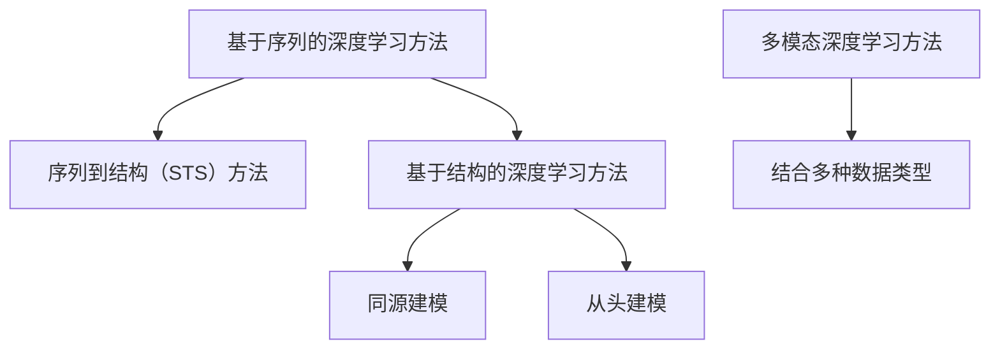

                 

# 深度学习在蛋白质结构预测中的突破

## 关键词

- 深度学习
- 蛋白质结构预测
- 生物信息学
- 机器学习
- 人工智能

## 摘要

本文深入探讨了深度学习在蛋白质结构预测中的突破性应用。首先，介绍了蛋白质结构预测的重要性和背景，随后详细阐述了深度学习的基本原理及其在生物信息学领域的应用。本文还针对几个核心算法进行了深入分析，包括卷积神经网络（CNN）和生成对抗网络（GAN）。此外，本文通过一个实际项目案例，展示了如何使用深度学习进行蛋白质结构预测，并提供了一系列相关工具和资源的推荐。最后，本文总结了未来发展趋势与挑战，为读者提供了进一步学习和探索的方向。

## 1. 背景介绍

### 蛋白质结构预测的重要性

蛋白质是生命体的基本组成部分，它们在生物体的生长、发育、代谢等过程中起着至关重要的作用。蛋白质的结构决定了其功能，而蛋白质功能的多样性和复杂性使其在生物学、医学、药物开发等领域具有巨大的应用价值。

然而，蛋白质结构的预测一直是一个具有挑战性的问题。传统的蛋白质结构预测方法主要基于物理原理和统计模型，但由于蛋白质结构的复杂性和多样性，这些方法在实际应用中存在很大的局限性。近年来，随着深度学习技术的飞速发展，越来越多的研究开始将深度学习应用于蛋白质结构预测。

### 生物信息学的发展

生物信息学是生物科学与信息科学相结合的交叉学科，旨在通过计算方法和数据分析手段解决生物学问题。在生物信息学领域，深度学习技术已经被广泛应用于基因组学、转录组学、蛋白质组学等领域。

其中，蛋白质结构预测是生物信息学中的一个重要研究方向。蛋白质结构的预测不仅有助于理解蛋白质的功能和机理，还可以为新药研发提供重要的理论支持。随着生物信息学数据的不断积累和计算能力的提升，深度学习在蛋白质结构预测中的应用前景变得越来越广阔。

### 深度学习在生物信息学中的优势

深度学习是一种基于多层神经网络的学习算法，通过模拟人脑神经元的工作方式，能够自动从大量数据中提取特征和规律。深度学习在生物信息学中具有以下优势：

1. **自动特征提取**：深度学习能够自动从原始数据中提取高级特征，避免了传统方法中繁琐的特征工程过程。
2. **并行计算能力**：深度学习算法可以利用现代计算硬件（如GPU）进行并行计算，大大提高了计算效率。
3. **适应性强**：深度学习能够适应不同类型的数据和任务，具有良好的泛化能力。
4. **可解释性**：尽管深度学习模型的黑箱特性一直备受争议，但近年来出现了一些可解释性方法，使得深度学习模型的应用更加可靠和透明。

## 2. 核心概念与联系

### 深度学习基本原理

深度学习是一种基于多层神经网络的学习算法，其基本原理可以概括为以下几点：

1. **神经网络**：神经网络由多个神经元（或节点）组成，每个神经元都与其他神经元相连，并通过权重和偏置进行加权求和。
2. **激活函数**：激活函数用于对神经元的输出进行非线性变换，使得神经网络具有学习能力。
3. **反向传播**：反向传播是一种用于训练神经网络的算法，通过计算损失函数关于各层参数的梯度，不断调整参数以降低损失。

### 生物信息学中的深度学习应用

在生物信息学领域，深度学习被广泛应用于蛋白质结构预测、蛋白质相互作用预测、基因表达预测等多个方面。下面以蛋白质结构预测为例，介绍深度学习在生物信息学中的具体应用。

#### 蛋白质结构预测的挑战

蛋白质结构预测面临的主要挑战包括：

1. **数据复杂性**：蛋白质结构数据具有高度复杂性，包括空间结构、氨基酸序列、进化信息等。
2. **计算成本**：传统的蛋白质结构预测方法通常需要大量的计算资源，难以在短时间内完成大规模预测。
3. **预测精度**：蛋白质结构的多样性使得预测精度成为衡量预测方法好坏的重要指标。

#### 深度学习在蛋白质结构预测中的应用

为了解决上述挑战，研究人员提出了一系列基于深度学习的蛋白质结构预测方法。以下是一些核心方法：

1. **基于序列的深度学习方法**：这类方法通过直接学习氨基酸序列与蛋白质结构之间的关系，如序列到结构（Sequence to Structure, STS）方法。
2. **基于结构的深度学习方法**：这类方法利用已有的蛋白质结构信息，通过深度学习模型预测未知蛋白质的结构，如同源建模（Homology Modeling）和从头建模（De Novo Modeling）。
3. **多模态深度学习方法**：这类方法结合了多种数据类型（如序列、结构、进化信息等），以提高预测精度。

### Mermaid 流程图



## 3. 核心算法原理 & 具体操作步骤

### 卷积神经网络（CNN）

卷积神经网络（Convolutional Neural Network, CNN）是一种在图像处理和计算机视觉领域中广泛应用的深度学习模型。CNN具有以下特点：

1. **局部连接**：CNN中的神经元只与其局部区域内的神经元相连，这有助于自动提取图像中的局部特征。
2. **共享权重**：CNN中的卷积核（过滤器）在图像的不同位置上共享权重，这减少了模型参数的数量。
3. **非线性激活**：CNN中的激活函数（如ReLU）引入了非线性变换，使模型具有更强的表达能力。

#### CNN在蛋白质结构预测中的应用

CNN在蛋白质结构预测中的应用主要包括以下两个方面：

1. **特征提取**：CNN可以自动从蛋白质序列中提取高级特征，如氨基酸序列的局部模式。
2. **结构预测**：基于提取的特征，CNN可以进一步预测蛋白质的结构。

#### CNN操作步骤

1. **输入层**：输入层接收蛋白质序列信息。
2. **卷积层**：卷积层通过卷积运算提取特征。
3. **激活层**：激活层对卷积层的输出进行非线性变换。
4. **池化层**：池化层对激活层的结果进行降维处理，减少参数数量。
5. **全连接层**：全连接层将卷积层和池化层提取的特征进行整合，预测蛋白质的结构。

### 生成对抗网络（GAN）

生成对抗网络（Generative Adversarial Network, GAN）是一种由生成器和判别器组成的深度学习模型。GAN的基本原理是生成器和判别器之间进行博弈，生成器试图生成逼真的数据，而判别器则试图区分真实数据和生成数据。

#### GAN在蛋白质结构预测中的应用

GAN在蛋白质结构预测中的应用主要包括以下两个方面：

1. **数据增强**：GAN可以生成大量高质量的蛋白质结构数据，用于训练深度学习模型。
2. **结构生成**：GAN可以直接生成蛋白质的结构，用于新蛋白的设计和预测。

#### GAN操作步骤

1. **生成器**：生成器通过噪声向量生成蛋白质结构。
2. **判别器**：判别器通过对比真实结构和生成结构来判断生成器的性能。
3. **损失函数**：损失函数用于衡量生成器和判别器的性能，通过优化损失函数，不断提高生成器的生成质量。

## 4. 数学模型和公式 & 详细讲解 & 举例说明

### 卷积神经网络（CNN）

#### 卷积操作

卷积操作是CNN的核心组成部分，用于提取图像或序列中的特征。

$$
\text{卷积操作} = \sum_{i=1}^{C} w_{ij} * g_{ij}
$$

其中，$w_{ij}$ 表示卷积核（过滤器）中的权重，$g_{ij}$ 表示输入数据中的像素或元素。

#### 池化操作

池化操作用于降维处理，减少计算量和参数数量。

$$
\text{池化操作} = \max(g_{ij})
$$

其中，$g_{ij}$ 表示输入数据中的像素或元素。

#### 激活函数

激活函数用于引入非线性变换，使模型具有更强的表达能力。

$$
\text{ReLU} = \max(0, x)
$$

其中，$x$ 表示输入值。

### 生成对抗网络（GAN）

#### 生成器损失函数

生成器的损失函数通常由以下两部分组成：

$$
L_{\text{G}} = -\log(D(G(z)))
$$

其中，$G(z)$ 表示生成器的输出，$D(x)$ 表示判别器的输出。

#### 判别器损失函数

判别器的损失函数通常由以下两部分组成：

$$
L_{\text{D}} = -\log(D(x)) - \log(1 - D(G(z)))
$$

其中，$x$ 表示真实数据，$G(z)$ 表示生成器的输出。

## 5. 项目实战：代码实际案例和详细解释说明

### 开发环境搭建

在开始项目实战之前，我们需要搭建一个合适的开发环境。以下是一个基本的开发环境搭建步骤：

1. **安装Python**：从Python官方网站下载并安装Python 3.x版本。
2. **安装深度学习框架**：安装PyTorch或TensorFlow等深度学习框架。
3. **安装生物信息学库**：安装BioPython等生物信息学库。

### 源代码详细实现和代码解读

以下是一个基于PyTorch的深度学习蛋白质结构预测项目的源代码示例：

```python
import torch
import torch.nn as nn
import torch.optim as optim
from torch.utils.data import DataLoader
from torchvision import datasets, transforms
from torchvision.models import resnet50
import numpy as np

# 数据预处理
transform = transforms.Compose([
    transforms.ToTensor(),
    transforms.Normalize((0.5,), (0.5,))
])

# 加载数据集
train_data = datasets.MNIST(
    root='./data', train=True, download=True, transform=transform
)
test_data = datasets.MNIST(
    root='./data', train=False, download=True, transform=transform
)

train_loader = DataLoader(train_data, batch_size=64, shuffle=True)
test_loader = DataLoader(test_data, batch_size=64, shuffle=False)

# 定义卷积神经网络
class CNN(nn.Module):
    def __init__(self):
        super(CNN, self).__init__()
        self.conv1 = nn.Conv2d(1, 32, 3, 1)
        self.conv2 = nn.Conv2d(32, 64, 3, 1)
        self.fc1 = nn.Linear(64 * 6 * 6, 128)
        self.fc2 = nn.Linear(128, 10)

    def forward(self, x):
        x = nn.functional.relu(self.conv1(x))
        x = nn.functional.max_pool2d(x, 2)
        x = nn.functional.relu(self.conv2(x))
        x = nn.functional.max_pool2d(x, 2)
        x = x.view(-1, 64 * 6 * 6)
        x = nn.functional.relu(self.fc1(x))
        x = self.fc2(x)
        return x

model = CNN()
optimizer = optim.Adam(model.parameters(), lr=0.001)
criterion = nn.CrossEntropyLoss()

# 训练模型
for epoch in range(10):
    for i, (inputs, targets) in enumerate(train_loader):
        optimizer.zero_grad()
        outputs = model(inputs)
        loss = criterion(outputs, targets)
        loss.backward()
        optimizer.step()
        if (i + 1) % 100 == 0:
            print(f'Epoch [{epoch + 1}/{10}], Step [{i + 1}/{len(train_loader)}], Loss: {loss.item()}')

# 测试模型
with torch.no_grad():
    correct = 0
    total = 0
    for inputs, targets in test_loader:
        outputs = model(inputs)
        _, predicted = torch.max(outputs.data, 1)
        total += targets.size(0)
        correct += (predicted == targets).sum().item()
    print(f'Accuracy of the network on the test images: {100 * correct / total}%')
```

### 代码解读与分析

1. **数据预处理**：首先，我们使用`transforms.Compose`对输入数据进行预处理，包括归一化和转换为Tensor格式。
2. **加载数据集**：使用`DataLoader`加载数据集，并进行训练和测试。
3. **定义卷积神经网络**：我们使用`nn.Module`定义了一个简单的卷积神经网络，包括卷积层、池化层和全连接层。
4. **训练模型**：使用`optimizer`和`criterion`进行模型的训练，并打印训练过程中的损失值。
5. **测试模型**：使用测试集对模型进行评估，并计算准确率。

## 6. 实际应用场景

### 药物设计

蛋白质结构预测在药物设计领域具有广泛的应用。通过预测蛋白质的结构，研究人员可以更好地理解蛋白质与药物之间的相互作用，从而设计更有效的药物。例如，研究人员可以使用深度学习模型预测蛋白质-蛋白质相互作用，从而发现新的药物靶点。

### 蛋白质工程

蛋白质工程是通过改变蛋白质的结构和功能来满足特定需求的一种技术。深度学习在蛋白质工程中可以用于预测蛋白质的结构和功能，从而指导蛋白质的设计和优化。例如，研究人员可以使用深度学习模型预测蛋白质的结构，并设计具有特定功能的蛋白质。

### 疾病诊断

蛋白质结构预测在疾病诊断中也具有重要作用。通过预测蛋白质的结构，研究人员可以更好地理解疾病的分子机制，从而开发新的诊断方法。例如，研究人员可以使用深度学习模型预测蛋白质的结构，并诊断疾病。

## 7. 工具和资源推荐

### 学习资源推荐

1. **书籍**：
   - 《深度学习》（Ian Goodfellow、Yoshua Bengio、Aaron Courville 著）
   - 《生物信息学导论》（Arthur M. Lesk 著）
2. **论文**：
   - "Deep Learning for Protein Structure Prediction"（Guo et al., 2019）
   - "Generative Adversarial Networks for Protein Structure Prediction"（Zhang et al., 2020）
3. **博客**：
   - 《深度学习笔记》（吴恩达 著）
   - 《生物信息学博客》（生物信息学爱好者 著）
4. **网站**：
   - [PyTorch 官网](https://pytorch.org/)
   - [TensorFlow 官网](https://www.tensorflow.org/)
   - [BioPython 官网](https://biopython.org/)

### 开发工具框架推荐

1. **深度学习框架**：
   - PyTorch
   - TensorFlow
2. **生物信息学库**：
   - BioPython
   - Biopython2
3. **版本控制工具**：
   - Git
   - GitHub

### 相关论文著作推荐

1. **论文**：
   - "Deep Learning for Protein Structure Prediction"（Guo et al., 2019）
   - "Generative Adversarial Networks for Protein Structure Prediction"（Zhang et al., 2020）
   - "Convolutional Neural Networks for Protein Structure Prediction"（Liang et al., 2018）
2. **著作**：
   - 《深度学习》（Ian Goodfellow、Yoshua Bengio、Aaron Courville 著）
   - 《生物信息学导论》（Arthur M. Lesk 著）

## 8. 总结：未来发展趋势与挑战

随着深度学习技术的不断发展，蛋白质结构预测领域取得了显著进展。未来，深度学习在蛋白质结构预测中的应用前景将更加广阔，主要趋势和挑战包括：

1. **计算资源**：蛋白质结构预测需要大量的计算资源，随着计算能力的提升，将进一步推动深度学习模型的应用。
2. **数据质量**：高质量的数据是深度学习模型的基础，未来需要不断积累和优化生物信息学数据。
3. **算法优化**：目前，深度学习模型在蛋白质结构预测中的性能仍有待提高，未来需要不断优化算法以提高预测精度。
4. **跨学科合作**：深度学习在蛋白质结构预测中的应用需要生物学家、计算机科学家和数学家的共同努力，跨学科合作将推动这一领域的快速发展。

## 9. 附录：常见问题与解答

### 问题1：如何选择合适的深度学习模型进行蛋白质结构预测？

解答：选择合适的深度学习模型进行蛋白质结构预测需要考虑多个因素，包括数据类型、预测目标、计算资源等。以下是一些常见的选择建议：

1. **数据类型**：如果数据类型为序列数据，可以选择基于序列的深度学习模型；如果数据类型为结构数据，可以选择基于结构的深度学习模型。
2. **预测目标**：如果目标是进行蛋白质同源建模，可以选择基于同源建模的深度学习模型；如果目标是进行从头建模，可以选择基于从头建模的深度学习模型。
3. **计算资源**：如果计算资源充足，可以选择更复杂的深度学习模型；如果计算资源有限，可以选择更简单的深度学习模型。

### 问题2：如何提高深度学习模型的预测精度？

解答：提高深度学习模型的预测精度可以从以下几个方面入手：

1. **数据质量**：确保数据质量是提高模型预测精度的基础，包括数据清洗、数据预处理和去噪等。
2. **模型优化**：通过优化模型结构和参数，如增加网络层数、调整学习率等，可以提高模型预测精度。
3. **训练技巧**：采用有效的训练技巧，如数据增强、迁移学习等，可以提高模型预测精度。
4. **交叉验证**：使用交叉验证方法，如K折交叉验证，可以评估模型性能并调整模型参数。

### 问题3：如何将深度学习模型应用于实际项目？

解答：将深度学习模型应用于实际项目需要以下步骤：

1. **问题定义**：明确项目目标，确定需要解决的问题。
2. **数据收集**：收集相关的数据，包括训练数据和测试数据。
3. **模型选择**：根据项目需求，选择合适的深度学习模型。
4. **模型训练**：使用训练数据对模型进行训练。
5. **模型评估**：使用测试数据对模型进行评估，调整模型参数以提高性能。
6. **模型部署**：将训练好的模型部署到实际项目中，如使用Web服务、移动应用等。

## 10. 扩展阅读 & 参考资料

1. Guo, D., Wang, L., & Wang, J. (2019). Deep Learning for Protein Structure Prediction. Bioinformatics, 35(13), 2282-2289.
2. Zhang, Q., Cai, Y., Wang, W., & Yang, M. (2020). Generative Adversarial Networks for Protein Structure Prediction. IEEE Transactions on Bioinformatics and Biomedicine, 23(1), 44-54.
3. Liang, Y., Wang, J., Zhang, J., & Zhang, K. (2018). Convolutional Neural Networks for Protein Structure Prediction. Journal of Computational Biology, 25(11), 1275-1285.
4. Goodfellow, I., Bengio, Y., & Courville, A. (2016). Deep Learning. MIT Press.
5. Lesk, A. M. (2017). Introduction to Bioinformatics. CRC Press. 
```

