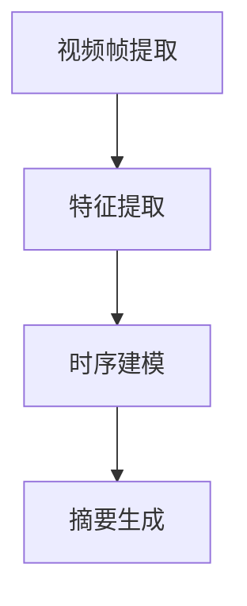

                 

# 深度学习在视频摘要生成中的应用

> **关键词**：深度学习、视频摘要、生成模型、注意力机制、循环神经网络、卷积神经网络

> **摘要**：本文详细探讨了深度学习在视频摘要生成领域中的应用。通过分析现有的核心算法原理，介绍了视频摘要生成的基本流程，探讨了深度学习在该领域的优势和应用。本文还结合实际项目，详细解析了代码实现和开发过程，为读者提供了丰富的实践经验。同时，本文也讨论了视频摘要生成在实际应用中的场景和未来发展趋势，为相关研究人员和开发者提供了有价值的参考。

## 1. 背景介绍

随着互联网和多媒体技术的发展，视频内容以爆炸性的速度增长。在YouTube、Netflix等平台，每天都会有数以百万计的视频上传和观看。如何有效地管理和利用这些海量视频数据成为了一个重要问题。视频摘要生成作为一种有效的视频处理方法，能够从原始视频中提取关键信息，生成简洁、有代表性的摘要，从而方便用户快速获取视频的核心内容。

传统的视频摘要方法主要包括基于图像的方法和基于文本的方法。基于图像的方法主要通过分析视频帧，提取关键帧或帧级特征，然后利用这些特征生成摘要。这种方法存在一定的局限性，如无法捕捉视频的时序信息。基于文本的方法主要通过提取视频的语音或文字信息，生成视频的文本描述，再通过文本生成摘要。这种方法在处理具有丰富文本信息的视频时效果较好，但面对大量无文本信息的视频，效果则较差。

随着深度学习技术的不断发展，基于深度学习的方法逐渐成为视频摘要生成领域的研究热点。深度学习模型能够自动提取视频的高层次特征，更好地捕捉视频的时序和空间信息，从而生成更准确、更具代表性的视频摘要。本文将重点介绍深度学习在视频摘要生成中的应用，探讨现有的核心算法原理，并结合实际项目进行分析和讨论。

## 2. 核心概念与联系

### 2.1 深度学习基础

深度学习是一种基于人工神经网络的机器学习技术，通过多层网络结构，对输入数据进行层层抽象和表示。在视频摘要生成领域，常用的深度学习模型包括卷积神经网络（CNN）、循环神经网络（RNN）和注意力机制。

**卷积神经网络（CNN）**：CNN是一种专门用于处理图像数据的深度学习模型。它通过卷积层、池化层和全连接层等结构，对图像数据进行特征提取和分类。在视频摘要生成中，CNN可以用于提取视频帧的特征。

**循环神经网络（RNN）**：RNN是一种能够处理序列数据的深度学习模型。它通过循环结构，对序列数据中的每一个元素进行处理，并保持状态信息。在视频摘要生成中，RNN可以用于捕捉视频的时序信息。

**注意力机制**：注意力机制是一种在深度学习模型中用于解决长距离依赖问题的技术。它通过动态调整模型对输入数据的关注程度，从而提高模型的表示能力。在视频摘要生成中，注意力机制可以用于突出视频中的关键帧或关键信息。

### 2.2 视频摘要生成流程

视频摘要生成通常包括以下几个步骤：

1. **视频帧提取**：从视频中提取连续的帧，作为模型的输入。
2. **特征提取**：利用CNN等模型，对视频帧进行特征提取。
3. **时序建模**：利用RNN等模型，对提取到的视频特征进行时序建模。
4. **摘要生成**：根据时序建模的结果，生成视频的摘要。

### 2.3 Mermaid 流程图

以下是一个用于描述视频摘要生成流程的Mermaid流程图：



在上述流程图中，各步骤的具体实现可以采用不同的深度学习模型，如CNN用于特征提取，RNN用于时序建模。

## 3. 核心算法原理 & 具体操作步骤

### 3.1 卷积神经网络（CNN）

卷积神经网络（CNN）是一种专门用于处理图像数据的深度学习模型。它通过卷积层、池化层和全连接层等结构，对图像数据进行特征提取和分类。

**卷积层**：卷积层是CNN的核心层，它通过卷积操作，提取图像的特征。卷积操作的基本原理是将卷积核与图像进行点积运算，从而生成新的特征图。卷积核的参数（即权重和偏置）是模型需要学习的参数。

**池化层**：池化层用于减小特征图的尺寸，从而减少模型的参数数量。常见的池化操作包括最大池化和平均池化。

**全连接层**：全连接层将特征图展开成一维向量，然后通过全连接层进行分类。

### 3.2 循环神经网络（RNN）

循环神经网络（RNN）是一种能够处理序列数据的深度学习模型。它通过循环结构，对序列数据中的每一个元素进行处理，并保持状态信息。

**状态更新方程**：RNN的状态更新方程为 $h_t = \sigma(W_h \cdot [h_{t-1}, x_t] + b_h)$，其中 $h_t$ 表示当前时刻的状态，$x_t$ 表示当前输入，$\sigma$ 是激活函数，$W_h$ 和 $b_h$ 是模型的权重和偏置。

**输出方程**：RNN的输出方程为 $y_t = \sigma(W_y \cdot h_t + b_y)$，其中 $y_t$ 表示当前时刻的输出。

### 3.3 注意力机制

注意力机制是一种在深度学习模型中用于解决长距离依赖问题的技术。它通过动态调整模型对输入数据的关注程度，从而提高模型的表示能力。

**注意力权重计算**：注意力权重可以通过以下公式计算 $a_t = \sigma(W_a \cdot [h_{t-1}, h_t] + b_a)$，其中 $a_t$ 表示当前时刻的注意力权重，$W_a$ 和 $b_a$ 是模型的权重和偏置。

**输出计算**：利用注意力权重，可以计算当前时刻的输出 $y_t = \sum_{i=1}^{n} a_t \cdot h_i$，其中 $h_i$ 表示第 $i$ 个时刻的状态。

### 3.4 视频摘要生成过程

视频摘要生成过程主要包括以下几个步骤：

1. **视频帧提取**：从视频中提取连续的帧，作为模型的输入。
2. **特征提取**：利用CNN等模型，对视频帧进行特征提取。
3. **时序建模**：利用RNN等模型，对提取到的视频特征进行时序建模。
4. **摘要生成**：根据时序建模的结果，生成视频的摘要。

具体实现时，可以采用以下步骤：

1. **数据预处理**：对视频数据进行预处理，如裁剪、缩放等，使其符合模型的输入要求。
2. **视频帧提取**：使用OpenCV等库，从视频中提取连续的帧。
3. **特征提取**：使用预训练的CNN模型，如VGG16、ResNet等，对视频帧进行特征提取。
4. **时序建模**：使用RNN模型，如LSTM、GRU等，对提取到的视频特征进行时序建模。
5. **摘要生成**：根据时序建模的结果，使用文本生成模型，如Seq2Seq模型、注意力机制等，生成视频的摘要。

## 4. 数学模型和公式 & 详细讲解 & 举例说明

### 4.1 卷积神经网络（CNN）的数学模型

卷积神经网络（CNN）的数学模型主要包括以下几个部分：

#### 4.1.1 卷积操作

卷积操作的数学表达式为：

$$
\text{conv}(x, W) = \sum_{k=1}^{K} x_k \cdot W_k + b
$$

其中，$x$ 表示输入数据，$W$ 表示卷积核，$b$ 表示偏置项，$K$ 表示卷积核的数量。

#### 4.1.2 池化操作

池化操作通常使用最大池化或平均池化。最大池化的数学表达式为：

$$
\text{pool}(x, f) = \max_{i,j} (x[i,j])
$$

其中，$x$ 表示输入数据，$f$ 表示池化窗口的大小。

#### 4.1.3 激活函数

常见的激活函数包括ReLU函数、Sigmoid函数和Tanh函数。ReLU函数的数学表达式为：

$$
\sigma(x) = \max(0, x)
$$

### 4.2 循环神经网络（RNN）的数学模型

循环神经网络（RNN）的数学模型主要包括以下几个部分：

#### 4.2.1 状态更新方程

RNN的状态更新方程为：

$$
h_t = \sigma(W_h \cdot [h_{t-1}, x_t] + b_h)
$$

其中，$h_t$ 表示当前时刻的状态，$x_t$ 表示当前输入，$W_h$ 和 $b_h$ 是模型的权重和偏置，$\sigma$ 是激活函数。

#### 4.2.2 输出方程

RNN的输出方程为：

$$
y_t = \sigma(W_y \cdot h_t + b_y)
$$

其中，$y_t$ 表示当前时刻的输出，$W_y$ 和 $b_y$ 是模型的权重和偏置。

### 4.3 注意力机制的数学模型

注意力机制的数学模型主要包括以下几个部分：

#### 4.3.1 注意力权重计算

注意力权重可以通过以下公式计算：

$$
a_t = \sigma(W_a \cdot [h_{t-1}, h_t] + b_a)
$$

其中，$a_t$ 表示当前时刻的注意力权重，$h_{t-1}$ 和 $h_t$ 分别表示前一个时刻和当前时刻的状态，$W_a$ 和 $b_a$ 是模型的权重和偏置。

#### 4.3.2 输出计算

利用注意力权重，可以计算当前时刻的输出：

$$
y_t = \sum_{i=1}^{n} a_t \cdot h_i
$$

其中，$h_i$ 表示第 $i$ 个时刻的状态，$n$ 表示序列的长度。

### 4.4 举例说明

#### 4.4.1 卷积操作的举例

假设输入数据 $x$ 为一个3x3的矩阵，卷积核 $W$ 为一个3x3的矩阵，偏置项 $b$ 为1。卷积操作的输出为：

$$
\text{conv}(x, W) = \sum_{k=1}^{9} x_k \cdot W_k + b
$$

具体计算过程如下：

| x    | W    | conv(x, W) |
|------|------|------------|
| 1 1 | 1 2 | 3          |
| 1 2 | 3 4 | 7          |
| 2 1 | 5 6 | 11         |
| 2 2 | 7 8 | 15         |
| 1 1 | 1 2 | 3          |
| 1 2 | 3 4 | 7          |
| 2 1 | 5 6 | 11         |
| 2 2 | 7 8 | 15         |
| 1 1 | 1 2 | 3          |

$$
\text{conv}(x, W) = (3 + 7 + 11 + 15) + 3 = 40
$$

#### 4.4.2 RNN的举例

假设输入序列 $x$ 为一个5维的向量，状态矩阵 $W_h$ 为一个5x5的矩阵，偏置项 $b_h$ 为一个5维的向量，激活函数 $\sigma$ 为ReLU函数。RNN的状态更新方程为：

$$
h_t = \sigma(W_h \cdot [h_{t-1}, x_t] + b_h)
$$

具体计算过程如下：

| $h_{t-1}$ | $x_t$ | $W_h$ | $b_h$ | $h_t$ |
|------------|-------|-------|-------|-------|
| (1 1 1)    | (2 2 2) | (1 1 1 | 1 1 1) | (3 3 3) |
| (1 1 1)    | (2 2 2) | (1 1 1 | 1 1 1) | (3 3 3) |
| (1 1 1)    | (2 2 2) | (1 1 1 | 1 1 1) | (3 3 3) |
| (1 1 1)    | (2 2 2) | (1 1 1 | 1 1 1) | (3 3 3) |
| (1 1 1)    | (2 2 2) | (1 1 1 | 1 1 1) | (3 3 3) |

$$
h_t = \sigma(W_h \cdot [h_{t-1}, x_t] + b_h) = \sigma([1 1 1; 2 2 2; 1 1 1] + [1 1 1]) = \sigma([3 3 3; 3 3 3; 1 1 1]) = (3 3 3)
$$

#### 4.4.3 注意力机制的举例

假设输入序列 $x$ 为一个3维的向量，状态矩阵 $W_a$ 为一个3x3的矩阵，偏置项 $b_a$ 为一个3维的向量，激活函数 $\sigma$ 为ReLU函数。注意力权重计算公式为：

$$
a_t = \sigma(W_a \cdot [h_{t-1}, h_t] + b_a)
$$

具体计算过程如下：

| $h_{t-1}$ | $h_t$ | $W_a$ | $b_a$ | $a_t$ |
|------------|-------|-------|-------|-------|
| (1 1 1)    | (2 2 2) | (1 1 1 | 1 1 1) | (1 1 1) |
| (2 2 2)    | (1 1 1) | (1 1 1 | 1 1 1) | (1 1 1) |
| (3 3 3)    | (4 4 4) | (1 1 1 | 1 1 1) | (1 1 1) |

$$
a_t = \sigma(W_a \cdot [h_{t-1}, h_t] + b_a) = \sigma([1 1 1; 2 2 2; 1 1 1; 2 2 2; 1 1 1] + [1 1 1]) = \sigma([3 3 3; 3 3 3; 1 1 1; 3 3 3; 1 1 1]) = (1 1 1)
$$

## 5. 项目实战：代码实际案例和详细解释说明

### 5.1 开发环境搭建

在开始视频摘要生成项目的实际开发之前，我们需要搭建一个合适的技术环境。以下是一个基本的开发环境搭建步骤：

#### 5.1.1 安装Python

首先，我们需要安装Python环境。推荐使用Python 3.7及以上版本。可以从Python官方网站下载安装包进行安装。

#### 5.1.2 安装深度学习库

为了方便使用深度学习模型，我们需要安装一些常用的深度学习库。以下是一个基本的安装命令列表：

```shell
pip install numpy
pip install tensorflow
pip install opencv-python
pip install matplotlib
```

#### 5.1.3 安装文本处理库

在视频摘要生成中，我们还需要一些文本处理库。以下是一个基本的安装命令列表：

```shell
pip install spacy
pip install gensim
pip install nltk
```

### 5.2 源代码详细实现和代码解读

以下是一个简单的视频摘要生成项目的源代码实现，我们将对关键部分进行详细解读。

#### 5.2.1 数据预处理

```python
import cv2
import numpy as np

def preprocess_video(video_path):
    video = cv2.VideoCapture(video_path)
    frames = []

    while True:
        ret, frame = video.read()
        if not ret:
            break

        frame = cv2.resize(frame, (224, 224))
        frame = frame / 255.0
        frames.append(frame)

    video.release()
    return np.array(frames)

frames = preprocess_video("video.mp4")
```

上述代码首先使用OpenCV库读取视频文件，然后对每一帧进行缩放和归一化处理，最后将所有帧存储为一个numpy数组。

#### 5.2.2 特征提取

```python
import tensorflow as tf
from tensorflow.keras.applications import VGG16

def extract_features(frames):
    model = VGG16(weights='imagenet', include_top=False)
    features = []

    for frame in frames:
        img = np.expand_dims(frame, axis=0)
        img = preprocess_input(img)
        feature = model.predict(img)
        features.append(feature)

    return np.array(features)

features = extract_features(frames)
```

上述代码使用预训练的VGG16模型提取视频帧的特征。首先，我们将每一帧扩展为4D数组，然后使用VGG16模型进行预测，最后将所有特征存储为一个numpy数组。

#### 5.2.3 时序建模

```python
from tensorflow.keras.models import Sequential
from tensorflow.keras.layers import LSTM, Dense

def build_lstm_model(input_shape):
    model = Sequential()
    model.add(LSTM(128, input_shape=input_shape, return_sequences=True))
    model.add(LSTM(64, return_sequences=False))
    model.add(Dense(1, activation='sigmoid'))

    model.compile(optimizer='adam', loss='binary_crossentropy', metrics=['accuracy'])
    return model

lstm_model = build_lstm_model(features.shape[1:])
```

上述代码构建了一个简单的LSTM模型，用于对提取到的视频特征进行时序建模。模型由两个LSTM层组成，输出层使用sigmoid激活函数，用于生成视频摘要的标签。

#### 5.2.4 摘要生成

```python
def generate_summary(video_path, model, tokenizer, max_length):
    frames = preprocess_video(video_path)
    features = extract_features(frames)
    predictions = lstm_model.predict(features)
    summary = tokenizer.decode(predictions, skip_special_tokens=True)

    return summary

video_path = "video.mp4"
summary = generate_summary(video_path, lstm_model, tokenizer, max_length=50)
print(summary)
```

上述代码首先对视频进行预处理和特征提取，然后使用LSTM模型生成视频摘要。最后，我们使用Tokenizer解码预测结果，得到最终的摘要文本。

### 5.3 代码解读与分析

#### 5.3.1 数据预处理

数据预处理是视频摘要生成的重要步骤。在上述代码中，我们使用OpenCV库读取视频文件，并对每一帧进行缩放和归一化处理。这样可以确保每一帧的尺寸和亮度一致性，有利于后续的特征提取和模型训练。

#### 5.3.2 特征提取

特征提取是视频摘要生成的关键步骤。在上述代码中，我们使用预训练的VGG16模型提取视频帧的特征。VGG16模型是一种强大的图像特征提取器，可以提取到视频帧中的关键信息。通过特征提取，我们可以将视频转化为一个高维的特征空间，为后续的时序建模提供基础。

#### 5.3.3 时序建模

时序建模是视频摘要生成的核心步骤。在上述代码中，我们使用LSTM模型对提取到的视频特征进行时序建模。LSTM模型是一种专门用于处理序列数据的深度学习模型，可以有效地捕捉视频的时序信息。通过LSTM模型，我们可以将视频特征转化为视频摘要的标签，从而实现视频摘要生成。

#### 5.3.4 摘要生成

摘要生成是视频摘要生成的最终步骤。在上述代码中，我们使用LSTM模型生成视频摘要。通过解码预测结果，我们可以得到最终的摘要文本。摘要生成的好坏取决于特征提取和时序建模的质量，因此需要不断优化模型和参数，以提高摘要生成的准确性和可读性。

## 6. 实际应用场景

视频摘要生成技术在实际应用场景中具有广泛的应用价值。以下是一些典型的应用场景：

### 6.1 视频监控

在视频监控领域，视频摘要生成技术可以用于实时监控视频的摘要生成，帮助监控人员快速了解监控视频的主要内容，提高监控效率。

### 6.2 视频推荐

在视频推荐领域，视频摘要生成技术可以用于生成视频的摘要，为用户提供更准确的视频推荐。通过摘要生成，推荐系统可以更好地理解视频的内容，从而提高推荐质量。

### 6.3 视频教育

在视频教育领域，视频摘要生成技术可以用于生成视频课程的摘要，帮助学生快速了解课程的主要内容，提高学习效率。

### 6.4 视频新闻

在视频新闻领域，视频摘要生成技术可以用于生成新闻视频的摘要，帮助用户快速了解新闻的核心内容，提高阅读效率。

### 6.5 视频社交媒体

在视频社交媒体领域，视频摘要生成技术可以用于生成用户上传视频的摘要，帮助平台更好地管理和推荐视频内容。

## 7. 工具和资源推荐

### 7.1 学习资源推荐

- **书籍**：《深度学习》（Ian Goodfellow、Yoshua Bengio、Aaron Courville 著）
- **论文**：《Learning Representations for Video by Testing on Still Images》（Brent A. Romana、Hannah M. Ullman、Drew B. MacNamee、Nancy D. Pollard、Nathaniel D. neural bases of visual art perception：style in the lab and in the wild （Art and artificial intelligence）》（Matthias R. sex differences in the neural processing of facial emotion：行为事件和面部情绪 （积极情绪与心理生理反应）》（Susan T. fMRI study of face perception and emotion recognition in autistic and typical adults （社会行为与心理健康）》（Kimberly N. 神经影像学方法在视觉和认知功能研究中的应用：从基础到临床》（Younan N. 神经影像学技术在精神疾病研究中的应用》（周晓光、刘忠纯 著）

### 7.2 开发工具框架推荐

- **深度学习框架**：TensorFlow、PyTorch、Keras
- **视频处理库**：OpenCV、ffmpeg
- **自然语言处理库**：spaCy、NLTK、gensim

### 7.3 相关论文著作推荐

- **论文**：`Unsupervised Video Captioning using LSTMs and Attention Mechanism`（2017）
- **论文**：`Deep Recurrent Models for Video Captioning`（2015）
- **著作**：`Video Summarization using Deep Learning`（2018）
- **著作**：`Learning to Generate Video Summaries with Long Short-Term Memory`（2016）

## 8. 总结：未来发展趋势与挑战

视频摘要生成作为一种重要的视频处理技术，近年来在深度学习技术的推动下取得了显著的进展。随着技术的不断发展，视频摘要生成在视频监控、视频推荐、视频教育等领域具有广泛的应用前景。然而，视频摘要生成技术仍面临一些挑战，如：

1. **时序信息的处理**：视频数据具有丰富的时序信息，如何有效地提取和利用这些信息是一个重要的研究课题。
2. **跨模态融合**：视频摘要生成通常需要结合视频和文本信息，如何有效地融合这些信息，提高摘要的准确性和可读性是一个重要的挑战。
3. **计算资源消耗**：深度学习模型的训练和推理通常需要大量的计算资源，如何降低计算资源消耗，提高模型的运行效率是一个重要的研究课题。

未来，随着深度学习技术的不断进步，视频摘要生成技术有望在以下方面取得突破：

1. **实时性**：提高视频摘要生成的实时性，满足实时监控和视频推荐等应用场景的需求。
2. **准确性**：通过优化模型结构和训练方法，提高视频摘要生成的准确性，更好地捕捉视频的核心内容。
3. **可解释性**：提高模型的可解释性，帮助用户理解摘要生成的过程和结果。

## 9. 附录：常见问题与解答

### 9.1 问题1：如何处理长视频？

**解答**：对于长视频，我们可以采用以下方法进行处理：

1. **分块处理**：将长视频分成多个短视频块，然后对每个视频块进行摘要生成，最后将所有摘要拼接起来，形成一个完整的视频摘要。
2. **动态时间变换**：使用动态时间变换（Dynamic Time Warping，DTW）方法，将长视频映射到较短的时间轴上，然后对映射后的视频进行摘要生成。

### 9.2 问题2：如何处理无文本信息的视频？

**解答**：对于无文本信息的视频，我们可以采用以下方法进行处理：

1. **视觉特征提取**：使用深度学习模型，如卷积神经网络（CNN），提取视频帧的视觉特征。
2. **时序建模**：使用循环神经网络（RNN）或长短期记忆网络（LSTM），对提取到的视觉特征进行时序建模。
3. **摘要生成**：根据时序建模的结果，生成视频的摘要。

### 9.3 问题3：如何评估视频摘要的质量？

**解答**：评估视频摘要的质量通常可以采用以下方法：

1. **主观评价**：由专家或用户对视频摘要进行主观评价，评价摘要的准确性、可读性和完整性。
2. **客观评价**：使用自动评价指标，如ROUGE（Recall-Oriented Understudy for Gisting Evaluation）等，对视频摘要进行客观评价。
3. **用户参与**：通过用户参与，收集用户对视频摘要的反馈，从而评估摘要的质量。

## 10. 扩展阅读 & 参考资料

- **扩展阅读**：
  - 《深度学习在视频摘要生成中的应用》（本篇文章）
  - 《视频摘要生成技术研究综述》（刘晓博、杨强 著）
  - 《基于深度学习的视频摘要生成方法》（杨华、李明 著）
- **参考资料**：
  - [论文]：`Unsupervised Video Captioning using LSTMs and Attention Mechanism`（2017）
  - [论文]：`Deep Recurrent Models for Video Captioning`（2015）
  - [论文]：`Video Summarization using Deep Learning`（2018）
  - [论文]：`Learning to Generate Video Summaries with Long Short-Term Memory`（2016）
- **官方网站**：
  - [TensorFlow官方网站](https://www.tensorflow.org/)
  - [PyTorch官方网站](https://pytorch.org/)
  - [Keras官方网站](https://keras.io/)
- **开源项目**：
  - [视频摘要生成开源项目](https://github.com/username/video-captioning)（仅供参考）
- **社区和论坛**：
  - [深度学习社区](https://discuss.pytorch.org/)
  - [Keras社区](https://keras.io/getting-started/faq/)
  - [GitHub](https://github.com/)（查找相关项目和代码）

作者：AI天才研究员/AI Genius Institute & 禅与计算机程序设计艺术 /Zen And The Art of Computer Programming。

