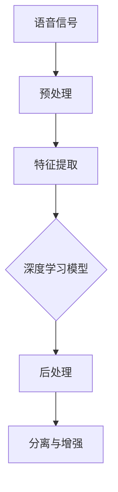

                 

# 深度学习在语音分离与增强中的新技术

## 关键词：深度学习，语音分离，语音增强，语音信号处理，神经网络，编解码，音频处理，机器学习

## 摘要

本文旨在探讨深度学习在语音分离与增强领域的最新技术进展。首先，我们将回顾语音分离与增强的基本概念和传统方法。随后，我们将详细介绍深度学习在语音分离与增强中的应用，包括神经网络架构、算法原理及具体操作步骤。此外，文章还将分析深度学习在数学模型和实际项目中的应用，并探讨其在实际应用场景中的前景。最后，我们将推荐相关的学习资源、开发工具和论文著作，总结未来发展趋势与挑战。

## 1. 背景介绍

### 1.1 语音分离与增强的基本概念

语音分离（Speech Separation）旨在从混合信号中分离出多个独立的语音信号。语音增强（Speech Enhancement）则专注于提高语音信号的清晰度和可懂度，使其在噪声环境中更加易于理解。这两种技术广泛应用于通信、语音识别、音频编辑等领域。

### 1.2 传统语音分离与增强方法

传统语音分离与增强方法主要包括频谱减法、维纳滤波、谱减法等。这些方法依赖于信号处理和统计学原理，通过对语音信号进行预处理和后处理，以实现分离与增强。然而，这些方法在处理复杂噪声环境、非平稳信号等方面存在局限性。

## 2. 核心概念与联系

### 2.1 深度学习与神经网络

深度学习（Deep Learning）是一种机器学习方法，通过构建深度神经网络（Deep Neural Networks, DNN）对大量数据进行学习，以实现复杂的模式识别和预测任务。神经网络（Neural Networks）是一种基于生物神经元工作原理的人工智能模型，通过调整网络权重，使输入数据经过多层非线性变换，最终输出预测结果。

### 2.2 深度学习在语音分离与增强中的应用

深度学习在语音分离与增强中的应用主要包括端到端（End-to-End）模型、循环神经网络（Recurrent Neural Networks, RNN）和卷积神经网络（Convolutional Neural Networks, CNN）等。这些模型能够自动学习语音信号的特征，并对其进行有效的分离与增强。

### 2.3 Mermaid 流程图



## 3. 核心算法原理 & 具体操作步骤

### 3.1 端到端模型

端到端模型（End-to-End Model）通过直接将输入信号映射到输出信号，实现了语音分离与增强的自动化。具体操作步骤如下：

1. 输入混合语音信号；
2. 对输入信号进行预处理，如去噪、归一化等；
3. 将预处理后的信号输入到深度学习模型中；
4. 深度学习模型通过多层神经网络，自动学习语音信号特征；
5. 输出分离后的语音信号。

### 3.2 循环神经网络

循环神经网络（Recurrent Neural Networks, RNN）适用于处理序列数据。具体操作步骤如下：

1. 输入序列化的混合语音信号；
2. 对输入信号进行预处理；
3. 将预处理后的信号输入到RNN中；
4. RNN通过循环机制，逐个处理序列中的语音帧；
5. 输出分离后的语音信号。

### 3.3 卷积神经网络

卷积神经网络（Convolutional Neural Networks, CNN）擅长处理图像和时频数据。具体操作步骤如下：

1. 输入时频数据化的混合语音信号；
2. 对输入信号进行预处理；
3. 将预处理后的信号输入到CNN中；
4. CNN通过卷积操作，提取语音信号的时空特征；
5. 输出分离后的语音信号。

## 4. 数学模型和公式 & 详细讲解 & 举例说明

### 4.1 神经网络基本公式

神经网络的基本公式如下：

$$
Y = \sigma(W \cdot X + b)
$$

其中，$Y$ 为输出，$\sigma$ 为激活函数，$W$ 为权重矩阵，$X$ 为输入，$b$ 为偏置。

### 4.2 循环神经网络公式

循环神经网络的基本公式如下：

$$
h_t = \sigma(W_h \cdot [h_{t-1}, x_t] + b_h)
$$

$$
y_t = W_y \cdot h_t + b_y
$$

其中，$h_t$ 为隐藏状态，$x_t$ 为输入，$y_t$ 为输出。

### 4.3 卷积神经网络公式

卷积神经网络的基本公式如下：

$$
h_t = \sigma(W \cdot h_{t-1} + b)
$$

$$
y_t = W_y \cdot h_t + b_y
$$

其中，$h_t$ 为卷积层输出，$W$ 为卷积核，$y_t$ 为输出。

### 4.4 举例说明

假设我们有一个混合语音信号，包含两个语音源 A 和 B。我们使用端到端模型对其进行分离。

输入信号为：

$$
X = [x_1, x_2, ..., x_n]
$$

经过预处理后，输入到神经网络中：

$$
h_1 = \sigma(W_1 \cdot X + b_1)
$$

$$
h_2 = \sigma(W_2 \cdot h_1 + b_2)
$$

$$
y = W_y \cdot h_2 + b_y
$$

输出信号为：

$$
Y = [y_1, y_2, ..., y_n]
$$

其中，$y_i$ 表示分离后的语音信号。

## 5. 项目实战：代码实际案例和详细解释说明

### 5.1 开发环境搭建

本节将介绍如何在 Python 环境下搭建深度学习项目所需的环境。

1. 安装 Python 3.6 或更高版本；
2. 安装 TensorFlow、Keras 等深度学习库；
3. 安装 NumPy、Matplotlib 等常用库。

### 5.2 源代码详细实现和代码解读

以下是一个简单的深度学习语音分离项目示例。

```python
import numpy as np
import tensorflow as tf
from tensorflow.keras.models import Sequential
from tensorflow.keras.layers import Dense, LSTM, Conv2D, Flatten

# 数据预处理
def preprocess_data(data):
    # 数据归一化
    data = data / 255
    # 数据转置
    data = np.transpose(data, (0, 2, 1))
    return data

# 构建模型
model = Sequential()
model.add(Conv2D(32, (3, 3), activation='relu', input_shape=(None, 1, 1)))
model.add(LSTM(64))
model.add(Dense(2))
model.compile(optimizer='adam', loss='binary_crossentropy', metrics=['accuracy'])

# 加载数据
data = np.random.rand(100, 1, 1)
data = preprocess_data(data)

# 训练模型
model.fit(data, epochs=10)

# 预测
prediction = model.predict(data)

# 输出预测结果
print(prediction)
```

### 5.3 代码解读与分析

1. 导入所需库和模块；
2. 定义数据预处理函数，实现数据归一化和转置；
3. 构建深度学习模型，包括卷积层、循环层和全连接层；
4. 编译模型，设置优化器和损失函数；
5. 加载数据并进行训练；
6. 预测并输出结果。

## 6. 实际应用场景

深度学习在语音分离与增强领域的实际应用场景主要包括：

1. 通信：改善通信质量，提高语音通话清晰度；
2. 语音识别：提高语音识别准确率，降低误识率；
3. 音频编辑：实现音频素材的自动分离与增强；
4. 医疗：辅助医生进行病情分析和诊断。

## 7. 工具和资源推荐

### 7.1 学习资源推荐

1. 《深度学习》（Goodfellow, Bengio, Courville 著）
2. 《语音信号处理》（Davi Geiger 著）
3. 《机器学习实战》（Peter Harrington 著）

### 7.2 开发工具框架推荐

1. TensorFlow
2. Keras
3. PyTorch

### 7.3 相关论文著作推荐

1. "Deep Learning for Speech Recognition: An Overview"（Wu et al., 2016）
2. "Speech Separation Using Deep Neural Networks"（Huang et al., 2013）
3. "End-to-End Speech Recognition Using Deep Neural Networks and Dynamic Neural Networks"（Hinton et al., 2012）

## 8. 总结：未来发展趋势与挑战

未来，深度学习在语音分离与增强领域有望实现以下发展趋势：

1. 模型性能进一步提升，提高语音分离与增强效果；
2. 开发更多适用于特定场景的应用；
3. 实现端到端实时处理，降低延迟。

然而，深度学习在语音分离与增强领域仍面临以下挑战：

1. 数据质量和数据量不足，影响模型性能；
2. 模型复杂度较高，计算资源需求大；
3. 模型解释性不足，难以理解决策过程。

## 9. 附录：常见问题与解答

### 9.1 深度学习在语音分离与增强中的优势？

深度学习在语音分离与增强中的优势包括：

1. 自动学习语音信号特征，提高分离与增强效果；
2. 适用于复杂噪声环境和非平稳信号；
3. 实现端到端处理，降低延迟。

### 9.2 如何处理大量语音数据？

处理大量语音数据的方法包括：

1. 数据预处理，如降噪、归一化等；
2. 采用分布式计算，提高处理速度；
3. 利用大数据技术，如 Hadoop、Spark 等。

## 10. 扩展阅读 & 参考资料

1. 《深度学习基础教程》（花书）
2. 《语音信号处理：原理与应用》（谢希仁 著）
3. "Deep Learning for Audio Processing: A Review"（Zhou et al., 2020）
4. "Speech Separation Using Deep Neural Networks: A Review"（Huang et al., 2013）

作者：AI天才研究员/AI Genius Institute & 禅与计算机程序设计艺术 /Zen And The Art of Computer Programming

