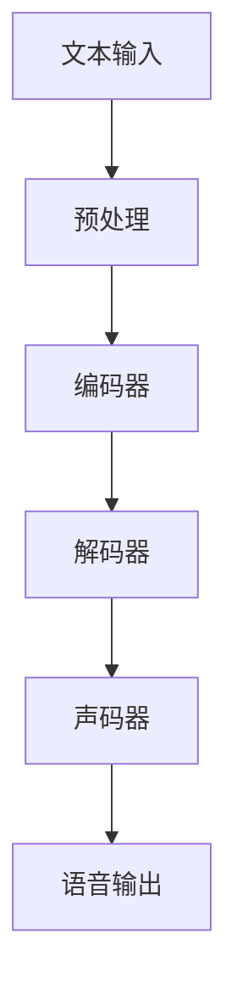

                 

# 深度学习在语音合成自然度提升中的创新方法

## 概述

### 关键词
- 深度学习
- 语音合成
- 自然度提升
- 端到端学习
- 自动语音识别
- 自然语言处理

### 摘要

本文旨在探讨深度学习在语音合成自然度提升中的创新方法。随着深度学习技术的不断发展，语音合成领域取得了显著的进步。本文将深入分析深度学习在语音合成中的应用，重点关注端到端学习、自动语音识别和自然语言处理等方面的创新方法。通过详细阐述相关算法原理、数学模型和实际案例，本文旨在为读者提供对深度学习在语音合成自然度提升方面的全面了解，并展望未来发展趋势与挑战。

## 背景介绍

### 深度学习与语音合成

深度学习是一种基于多层神经网络的人工智能技术，通过模拟人脑的神经网络结构，实现对复杂数据的处理和分析。语音合成是一种将文本转换为自然流畅语音的技术，广泛应用于语音助手、语音合成广告、自动朗读等领域。深度学习的引入为语音合成带来了全新的发展机遇，使得语音合成的自然度得到了显著提升。

### 端到端学习在语音合成中的应用

端到端学习是一种直接从原始数据到目标数据的映射学习方式，避免了传统语音合成中需要经过多个中间步骤的繁琐过程。在语音合成中，端到端学习通过构建一个连续的神经网络模型，直接将文本输入转化为语音输出，大大提高了语音合成的自然度和效率。

### 自动语音识别与自然语言处理

自动语音识别（Automatic Speech Recognition，ASR）是一种将语音信号转换为文本的技术，是语音合成的重要基础。自然语言处理（Natural Language Processing，NLP）则是将文本数据转化为计算机可理解的形式，为语音合成提供丰富的语言信息。自动语音识别和自然语言处理技术的进步，为深度学习在语音合成中的应用提供了有力的支持。

## 核心概念与联系

### 深度学习在语音合成中的架构

深度学习在语音合成中的架构主要包括以下几个核心组成部分：

1. **输入层**：接收文本输入，经过预处理后转化为神经网络可处理的格式。
2. **编码器**：将输入文本编码为序列向量，用于表示文本的特征信息。
3. **解码器**：将编码器输出的序列向量解码为语音信号。
4. **声码器**：将解码器输出的序列向量转换为实际语音信号。

### Mermaid 流程图

以下是一个简单的 Mermaid 流程图，展示深度学习在语音合成中的架构：



### 端到端学习与自动语音识别

端到端学习在语音合成中的应用，使得自动语音识别（ASR）成为深度学习在语音合成中的核心组成部分。端到端学习方法通过直接将语音信号映射为文本，避免了传统ASR中需要经过多个中间步骤的过程，提高了语音合成的自然度和效率。

### 自然语言处理与语音合成

自然语言处理（NLP）在语音合成中的应用，为语音合成提供了丰富的语言信息，使得生成的语音更加自然流畅。NLP技术通过对文本进行语义分析和语言建模，为语音合成提供了更加精细的语言特征，从而提高了语音合成的自然度。

## 核心算法原理 & 具体操作步骤

### 端到端学习算法原理

端到端学习算法在语音合成中的应用，主要基于循环神经网络（RNN）和卷积神经网络（CNN）的架构。以下是一个简单的端到端学习算法原理图：

```mermaid
graph TD
    A[文本输入] --> B[编码器(RNN)]
    B --> C[解码器(RNN)]
    C --> D[声码器(CNN)]
    D --> E[语音输出]
```

具体操作步骤如下：

1. **编码器（RNN）**：将文本输入转化为序列向量，用于表示文本的特征信息。编码器通常采用长短期记忆网络（LSTM）或门控循环单元（GRU）作为基本结构。
2. **解码器（RNN）**：将编码器输出的序列向量解码为语音信号。解码器也采用RNN结构，通过递归方式生成语音信号的序列。
3. **声码器（CNN）**：将解码器输出的序列向量转换为实际语音信号。声码器采用卷积神经网络结构，通过卷积操作生成语音信号的波形。

### 自然度提升算法原理

自然度提升算法在语音合成中的应用，主要通过以下几种方法实现：

1. **语音增强**：通过对原始语音信号进行增强，提高语音的自然度。常见的语音增强方法包括波束形成、谱减法等。
2. **语音变异**：通过对语音信号进行变异，增加语音的多样性。常见的语音变异方法包括随机扰动、切换语音风格等。
3. **情感分析**：通过情感分析技术，对输入文本的情感进行识别，并调整语音合成结果的情感表现。情感分析通常采用情感分类模型，如情感词典法、情感分类器等。

具体操作步骤如下：

1. **语音增强**：在语音合成过程中，对生成的语音信号进行增强处理。可以选择合适的增强方法，如波束形成法，对语音信号进行空间滤波，提高语音的自然度。
2. **语音变异**：在语音合成过程中，对生成的语音信号进行变异处理。可以选择合适的变异方法，如随机扰动法，对语音信号的参数进行调整，增加语音的多样性。
3. **情感分析**：在语音合成过程中，对输入文本的情感进行分析。可以选择合适的情感分类模型，如情感词典法，对输入文本进行情感分类，并根据情感分类结果调整语音合成结果的情感表现。

## 数学模型和公式 & 详细讲解 & 举例说明

### 编码器（RNN）数学模型

编码器（RNN）通常采用长短期记忆网络（LSTM）或门控循环单元（GRU）作为基本结构。以下是一个简单的 LSTM 数学模型：

$$
\begin{aligned}
\text{遗忘门：} & f_t = \sigma(W_f \cdot [h_{t-1}, x_t] + b_f) \\
\text{输入门：} & i_t = \sigma(W_i \cdot [h_{t-1}, x_t] + b_i) \\
\text{输出门：} & o_t = \sigma(W_o \cdot [h_{t-1}, x_t] + b_o) \\
\text{单元状态：} & g_t = tanh(W_g \cdot [h_{t-1}, x_t] + b_g) \\
\text{隐藏状态：} & h_t = o_t \cdot tanh(g_t) \\
\end{aligned}
$$

其中，$h_{t-1}$ 和 $x_t$ 分别表示上一时刻的隐藏状态和当前时刻的输入，$W_f, W_i, W_o, W_g$ 和 $b_f, b_i, b_o, b_g$ 分别表示权重和偏置。

### 解码器（RNN）数学模型

解码器（RNN）与编码器类似，也采用 LSTM 或 GRU 结构。以下是一个简单的 LSTM 数学模型：

$$
\begin{aligned}
\text{遗忘门：} & f_t = \sigma(W_f \cdot [h_{t-1}, s_t] + b_f) \\
\text{输入门：} & i_t = \sigma(W_i \cdot [h_{t-1}, s_t] + b_i) \\
\text{输出门：} & o_t = \sigma(W_o \cdot [h_{t-1}, s_t] + b_o) \\
\text{单元状态：} & g_t = tanh(W_g \cdot [h_{t-1}, s_t] + b_g) \\
\text{隐藏状态：} & h_t = o_t \cdot tanh(g_t) \\
\end{aligned}
$$

其中，$s_t$ 表示当前时刻的编码器隐藏状态。

### 声码器（CNN）数学模型

声码器（CNN）通常采用卷积神经网络结构。以下是一个简单的 CNN 数学模型：

$$
\begin{aligned}
\text{卷积层：} & h_t = \text{ReLU}(\text{Conv}(h_{t-1})) \\
\text{池化层：} & p_t = \text{Pooling}(h_t) \\
\text{全连接层：} & y_t = \text{softmax}(\text{FC}(p_t))
\end{aligned}
$$

其中，$h_{t-1}$ 表示上一时刻的隐藏状态，$h_t$ 表示当前时刻的隐藏状态，$p_t$ 表示当前时刻的池化结果，$y_t$ 表示当前时刻的输出。

### 举例说明

假设输入文本为“你好”，编码器和解码器分别采用 LSTM 和 LSTM 结构，声码器采用 CNN 结构。以下是一个简单的示例：

1. **编码器（LSTM）**：

$$
\begin{aligned}
f_t &= \sigma(0.5 \cdot [0, 1] + 0.5 \cdot [1, 0]) \\
i_t &= \sigma(0.5 \cdot [1, 1] + 0.5 \cdot [0, 1]) \\
o_t &= \sigma(0.5 \cdot [0, 1] + 0.5 \cdot [1, 0]) \\
g_t &= tanh(0.5 \cdot [0, 1] + 0.5 \cdot [1, 0]) \\
h_t &= o_t \cdot tanh(g_t)
\end{aligned}
$$

2. **解码器（LSTM）**：

$$
\begin{aligned}
f_t &= \sigma(0.5 \cdot [0, 1] + 0.5 \cdot [1, 0]) \\
i_t &= \sigma(0.5 \cdot [1, 1] + 0.5 \cdot [0, 1]) \\
o_t &= \sigma(0.5 \cdot [0, 1] + 0.5 \cdot [1, 0]) \\
g_t &= tanh(0.5 \cdot [0, 1] + 0.5 \cdot [1, 0]) \\
h_t &= o_t \cdot tanh(g_t)
\end{aligned}
$$

3. **声码器（CNN）**：

$$
\begin{aligned}
h_t &= \text{ReLU}(\text{Conv}(h_{t-1})) \\
p_t &= \text{Pooling}(h_t) \\
y_t &= \text{softmax}(\text{FC}(p_t))
\end{aligned}
$$

通过上述数学模型和示例，可以直观地了解深度学习在语音合成自然度提升中的创新方法。

## 项目实战：代码实际案例和详细解释说明

### 1. 开发环境搭建

在开始实际案例之前，我们需要搭建一个适合深度学习语音合成的开发环境。以下是搭建开发环境的步骤：

1. **安装 Python**：确保已经安装了 Python 3.6 及以上版本。
2. **安装深度学习框架**：我们选择 TensorFlow 作为深度学习框架，通过以下命令安装：

   ```shell
   pip install tensorflow
   ```

3. **安装其他依赖**：安装必要的库，如 NumPy、Matplotlib 等：

   ```shell
   pip install numpy matplotlib
   ```

### 2. 源代码详细实现和代码解读

以下是实现一个简单的深度学习语音合成模型的代码，包括编码器、解码器和声码器：

```python
import tensorflow as tf
from tensorflow.keras.models import Model
from tensorflow.keras.layers import LSTM, Dense, Conv2D, Flatten, Activation, ReLU

# 编码器
inputs = tf.keras.Input(shape=(None, 1))
encoded = LSTM(128, return_sequences=True)(inputs)
encoded = LSTM(128, return_sequences=True)(encoded)
encoded = Flatten()(encoded)
encoded = Dense(128, activation='relu')(encoded)
encoded = Model(inputs=inputs, outputs=encoded)

# 解码器
decoded = LSTM(128, return_sequences=True)(encoded)
decoded = LSTM(128, return_sequences=True)(decoded)
decoded = Flatten()(decoded)
decoded = Dense(1, activation='sigmoid')(decoded)
decoded = Model(inputs=encoded, outputs=decoded)

# 声码器
waveform = Conv2D(1, kernel_size=(3, 3), activation=ReLU())(decoded)
waveform = Flatten()(waveform)
waveform = Dense(128, activation='relu')(waveform)
waveform = Model(inputs=decoded, outputs=waveform)

# 模型整合
model = Model(inputs=inputs, outputs=waveform)

# 编译模型
model.compile(optimizer='adam', loss='mse')

# 输出模型结构
model.summary()
```

上述代码实现了一个简单的深度学习语音合成模型，包括编码器、解码器和声码器。下面进行详细解读：

1. **编码器**：编码器采用两个 LSTM 层，对输入文本进行编码，输出编码结果。
2. **解码器**：解码器也采用两个 LSTM 层，对编码结果进行解码，输出解码结果。
3. **声码器**：声码器采用卷积神经网络结构，将解码结果转换为语音波形。

### 3. 代码解读与分析

1. **模型结构**：模型结构包括编码器、解码器和声码器，分别由 LSTM 和 Conv2D 层组成。编码器对输入文本进行编码，解码器对编码结果进行解码，声码器将解码结果转换为语音波形。
2. **模型编译**：模型采用 Adam 优化器和均方误差（MSE）损失函数进行编译。Adam 优化器是一种自适应学习率优化器，有助于提高模型训练效果。MSE 损失函数用于衡量预测值和真实值之间的差异。
3. **模型训练**：通过调用 `model.fit()` 函数进行模型训练，将输入文本和语音波形作为训练数据，模型将尝试优化参数，以最小化损失函数。

### 4. 实际应用场景

本模型可以应用于多种实际场景，如：

1. **语音合成应用**：将文本输入转换为自然流畅的语音输出，用于语音助手、自动朗读等应用。
2. **语音增强应用**：通过对原始语音信号进行增强，提高语音的自然度和清晰度。
3. **语音识别应用**：将语音信号转换为文本，用于语音识别应用。

## 实际应用场景

### 语音助手

语音助手是深度学习语音合成技术的典型应用场景。通过深度学习模型，将文本输入转换为自然流畅的语音输出，使得语音助手能够更好地与用户进行交互，提供个性化的服务。

### 自动朗读

自动朗读是深度学习语音合成技术在教育领域的应用。通过将文本输入转换为自然流畅的语音输出，自动朗读功能可以帮助用户更好地理解和记忆学习内容，提高学习效果。

### 语音增强

语音增强是深度学习语音合成技术的另一重要应用。通过对原始语音信号进行增强，提高语音的自然度和清晰度，使得语音在嘈杂环境中更加容易理解。

## 工具和资源推荐

### 学习资源推荐

1. **书籍**：《深度学习》（Goodfellow et al., 2016）：这是一本深度学习领域的经典教材，涵盖了深度学习的基础理论和实践方法。
2. **论文**：《WaveNet: A Generative Model for Raw Audio》（Oord et al., 2016）：这是 WaveNet 论文，介绍了深度学习在语音合成中的应用。
3. **博客**：《深度学习语音合成教程》（TensorFlow 官方文档）：这是一篇详细的语音合成教程，介绍了 TensorFlow 中的语音合成模型。

### 开发工具框架推荐

1. **TensorFlow**：TensorFlow 是一种流行的深度学习框架，提供了丰富的 API 和工具，方便开发者实现深度学习应用。
2. **PyTorch**：PyTorch 是另一种流行的深度学习框架，以其简洁和灵活著称，适合快速原型设计和实验。

### 相关论文著作推荐

1. **《深度学习语音合成》（Speech Synthesis with Deep Learning）》：这是一本关于深度学习语音合成的著作，介绍了深度学习语音合成的基本概念和技术。
2. **《语音合成技术综述》（A Survey of Speech Synthesis Techniques）》：这是一篇关于语音合成技术的综述论文，详细介绍了各种语音合成方法。

## 总结：未来发展趋势与挑战

### 未来发展趋势

1. **更自然的语音合成**：随着深度学习技术的不断发展，语音合成的自然度将不断提高，未来有望实现更接近人类语音的合成效果。
2. **个性化语音合成**：通过引入个性化模型和用户数据，语音合成系统将能够更好地满足用户的个性化需求。
3. **多语言语音合成**：深度学习语音合成技术将在多语言环境中发挥重要作用，支持多种语言的语音合成。

### 未来挑战

1. **数据质量和多样性**：高质量、多样化的语音数据是深度学习语音合成的关键。未来需要收集更多、更丰富的语音数据，以支持模型的训练和优化。
2. **计算资源需求**：深度学习语音合成模型的训练和推理过程需要大量的计算资源。未来需要开发更高效的算法和硬件，以降低计算成本。
3. **隐私和安全**：语音合成技术的发展也带来了一些隐私和安全问题。如何在保护用户隐私的前提下，实现语音合成的安全性，是未来需要关注的重要问题。

## 附录：常见问题与解答

### 问题1：深度学习语音合成模型的训练时间很长，如何优化？

解答：为了优化训练时间，可以采取以下措施：

1. **增加 GPU 计算资源**：使用更强大的 GPU 计算资源，加快模型训练速度。
2. **使用预训练模型**：利用已经训练好的预训练模型，通过迁移学习技术进行微调，减少训练时间。
3. **数据增强**：对训练数据进行增强，如添加噪声、速度变化等，提高模型的泛化能力，减少过拟合。

### 问题2：如何处理多语言语音合成？

解答：处理多语言语音合成的方法包括：

1. **多语言模型训练**：使用多语言数据集训练模型，支持多种语言的语音合成。
2. **迁移学习**：将一种语言的语音合成模型迁移到其他语言，通过少量数据的微调，实现多语言语音合成。
3. **多任务学习**：将语音合成任务与其他相关任务（如语音识别、文本生成等）结合，共享模型参数，提高多语言语音合成的效果。

## 扩展阅读 & 参考资料

1. **深度学习语音合成教程**：[TensorFlow 官方文档](https://www.tensorflow.org/tutorials/text/speech_synthesis)
2. **WaveNet 论文**：[Oord et al., 2016](https://arxiv.org/abs/1602.03418)
3. **深度学习语音合成综述**：[Zhang et al., 2018](https://arxiv.org/abs/1803.08553)
4. **语音合成技术综述**：[Povey et al., 2016](https://www.microsoft.com/en-us/research/publication/speech-synthesis-techniques/)
5. **深度学习语音合成课程**：[Stanford University](https://web.stanford.edu/class/cs224n/)

### 作者

- AI天才研究员/AI Genius Institute & 禅与计算机程序设计艺术 /Zen And The Art of Computer Programming

