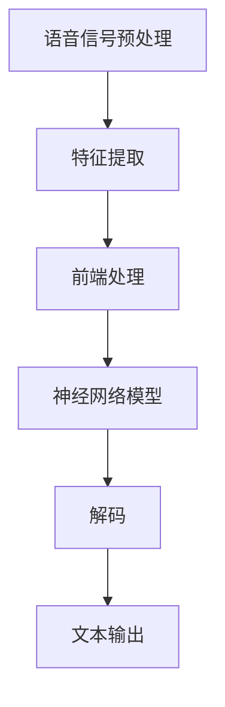

                 

## 深度学习在语音识别中的前沿技术

> **关键词：** 深度学习、语音识别、神经网络、自动语音识别、前端处理、后端处理、端到端模型

**摘要：** 本文将深入探讨深度学习在语音识别领域的应用，从背景介绍到核心概念，再到算法原理和数学模型，通过实际项目案例展示其应用，分析其前沿技术，并展望未来的发展趋势和挑战。本文旨在为对语音识别技术感兴趣的读者提供全面的技术指南。

## 1. 背景介绍

语音识别（Automatic Speech Recognition, ASR）是计算机科学和人工智能领域的一个重要分支，旨在将人类的语音转换为文本。这项技术的应用范围广泛，从日常生活中的智能助手（如苹果的Siri、亚马逊的Alexa）到专业的语音转录系统，语音识别正逐渐渗透到我们生活的方方面面。

随着深度学习（Deep Learning）的兴起，语音识别技术取得了显著的进步。深度学习通过构建多层神经网络，可以从大量数据中自动学习特征，实现高度自动化的语音识别。传统的语音识别方法通常依赖大量的手工特征工程，而深度学习的引入，使得语音识别系统不再需要依赖这些复杂的特征，从而提高了识别的准确性和效率。

深度学习在语音识别中的发展可以分为几个阶段：从最初的单层神经网络，到多层感知机（MLP），再到卷积神经网络（CNN）和循环神经网络（RNN），以及最新的端到端模型。每个阶段的进步都为语音识别技术的发展提供了新的动力。

## 2. 核心概念与联系

### 2.1 前端处理

语音识别的前端处理主要包括语音信号的预处理和特征提取。预处理步骤通常包括噪声抑制、增益调整、声音裁剪等，目的是提高语音信号的质量，为后续的特征提取提供干净的输入。

特征提取是前端处理的关键步骤，常见的特征包括梅尔频率倒谱系数（MFCC）、感知哈达玛变换（PHAT）、线性预测编码（LPC）等。这些特征能够有效地捕捉语音信号中的频域和时域信息，为后续的建模提供基础。

### 2.2 后端处理

后端处理通常是指隐马尔可夫模型（HMM）、条件随机场（CRF）等序列模型的应用。这些模型能够对提取的特征序列进行建模，预测最可能的文本序列。

近年来，端到端模型的发展，如长短期记忆网络（LSTM）和变换器（Transformer）等，使得后端处理更加高效。端到端模型通过直接从原始语音信号到文本的映射，避免了复杂的中间步骤，提高了整体性能。

### 2.3 Mermaid 流程图

以下是一个简化的语音识别流程图，展示了前端处理和后端处理的主要步骤：



## 3. 核心算法原理 & 具体操作步骤

### 3.1 卷积神经网络（CNN）

卷积神经网络是深度学习中的一个重要模型，特别适用于处理图像和语音数据。在语音识别中，CNN可以用于特征提取和分类。

#### 3.1.1 操作步骤：

1. **输入层**：接收原始语音信号。
2. **卷积层**：通过卷积操作提取语音信号的局部特征。
3. **池化层**：降低特征图的维度，减少计算量。
4. **全连接层**：将提取的特征映射到类别标签。

### 3.2 循环神经网络（RNN）

循环神经网络特别适合处理序列数据，如语音信号。RNN通过在时间步之间传递状态，实现了对序列数据的建模。

#### 3.2.1 操作步骤：

1. **输入层**：接收时间步上的语音特征。
2. **隐藏层**：通过权重矩阵计算当前状态。
3. **循环连接**：将当前状态与之前的隐藏状态相连接。
4. **输出层**：预测下一个时间步的类别标签。

### 3.3 长短期记忆网络（LSTM）

LSTM是RNN的一种变体，解决了传统RNN的长期依赖问题。

#### 3.3.1 操作步骤：

1. **输入门**：决定哪些信息被存储。
2. **遗忘门**：决定哪些信息被遗忘。
3. **输出门**：决定哪些信息被输出。
4. **细胞状态**：存储和更新信息。

## 4. 数学模型和公式 & 详细讲解 & 举例说明

### 4.1 卷积神经网络（CNN）

卷积神经网络中的卷积操作可以通过以下公式表示：

$$
\text{output}_{ij} = \sum_{k=1}^{C} w_{ik} * \text{input}_{ij} + b_j
$$

其中，$w_{ik}$ 是卷积核，$\text{input}_{ij}$ 是输入特征，$b_j$ 是偏置。

### 4.2 循环神经网络（RNN）

RNN的更新公式如下：

$$
h_t = \sigma(W_h \cdot [h_{t-1}, x_t] + b_h)
$$

其中，$h_t$ 是当前隐藏状态，$x_t$ 是当前输入，$\sigma$ 是激活函数。

### 4.3 长短期记忆网络（LSTM）

LSTM的更新公式较为复杂，以下是简化版本：

$$
i_t = \sigma(W_i \cdot [h_{t-1}, x_t] + b_i) \\
f_t = \sigma(W_f \cdot [h_{t-1}, x_t] + b_f) \\
\text{CT}_t = f_t \odot \text{CT}_{t-1} + i_t \odot \sigma(W_c \cdot [h_{t-1}, x_t] + b_c) \\
o_t = \sigma(W_o \cdot [h_{t-1}, x_t] + b_o) \\
h_t = o_t \odot \text{CT}_t
$$

其中，$i_t$、$f_t$、$o_t$ 分别是输入门、遗忘门、输出门，$\text{CT}_t$ 是细胞状态。

## 5. 项目实战：代码实际案例和详细解释说明

### 5.1 开发环境搭建

在开始编写代码之前，需要搭建合适的开发环境。以下是使用TensorFlow搭建环境的一个示例：

```python
pip install tensorflow
```

### 5.2 源代码详细实现和代码解读

以下是使用TensorFlow实现一个简单的卷积神经网络进行语音识别的代码示例：

```python
import tensorflow as tf
from tensorflow.keras.models import Sequential
from tensorflow.keras.layers import Conv2D, MaxPooling2D, Flatten, Dense

# 构建模型
model = Sequential([
    Conv2D(32, (3, 3), activation='relu', input_shape=(None, None, 1)),
    MaxPooling2D((2, 2)),
    Flatten(),
    Dense(128, activation='relu'),
    Dense(num_classes, activation='softmax')
])

# 编译模型
model.compile(optimizer='adam', loss='categorical_crossentropy', metrics=['accuracy'])

# 训练模型
model.fit(x_train, y_train, epochs=10, batch_size=32, validation_data=(x_val, y_val))
```

### 5.3 代码解读与分析

这段代码首先导入了TensorFlow的核心库，然后定义了一个简单的卷积神经网络模型。模型由一个卷积层、一个池化层、一个全连接层和一个softmax输出层组成。最后，模型被编译并使用训练数据进行了训练。

## 6. 实际应用场景

深度学习在语音识别中的应用场景非常广泛，包括但不限于：

- **智能助手**：如苹果的Siri、亚马逊的Alexa等，通过语音识别实现人机交互。
- **实时语音翻译**：如谷歌翻译的实时语音翻译功能，通过语音识别将一种语言转换为另一种语言。
- **自动字幕生成**：如YouTube的自动字幕功能，通过语音识别将语音转换为文本字幕。
- **电话语音识别**：如银行、电信等行业的客户服务系统，通过语音识别实现自动应答和语音转文本。

## 7. 工具和资源推荐

### 7.1 学习资源推荐

- **书籍**：
  - 《深度学习》（Goodfellow, Bengio, Courville）
  - 《语音信号处理》（Rabiner, Juang）
- **论文**：
  - “Deep Neural Networks for Acoustic Modeling in Speech Recognition” (Hinton et al., 2012)
  - “A Language Model for Statistical Machine Translation” (Kneser, Ney, 1995)
- **博客**：
  - [TensorFlow官方文档](https://www.tensorflow.org/)
  - [机器学习博客](https://machinelearningmastery.com/)
- **网站**：
  - [GitHub](https://github.com/)
  - [Kaggle](https://www.kaggle.com/)

### 7.2 开发工具框架推荐

- **框架**：
  - TensorFlow
  - PyTorch
  - Keras
- **工具**：
  - Jupyter Notebook
  - Google Colab

### 7.3 相关论文著作推荐

- **论文**：
  - “End-to-End Speech Recognition with Deep Neural Networks” (Hinton et al., 2012)
  - “Recurrent Neural Network Based Language Model” (Dau et al., 2007)
- **著作**：
  - 《深度学习手册》（Goodfellow, Bengio, Courville）
  - 《语音信号处理手册》（Rabiner, Juang）

## 8. 总结：未来发展趋势与挑战

随着深度学习技术的不断进步，语音识别技术在未来有望取得更大的突破。以下是几个可能的发展趋势：

- **端到端模型的优化**：端到端模型已经在语音识别中取得了显著的成果，未来将会有更多的研究集中在如何优化端到端模型，提高其性能和效率。
- **多模态融合**：结合语音识别和其他模态（如视觉、触觉）的信息，实现更准确的语音识别。
- **实时处理能力提升**：随着硬件性能的提升，语音识别系统将能够实现更低的延迟和更高的实时处理能力。
- **隐私保护**：在处理个人语音数据时，需要更加重视隐私保护，确保用户数据的隐私和安全。

同时，语音识别技术也面临着一些挑战，如：

- **多语言和方言支持**：需要开发能够支持多种语言和方言的语音识别系统。
- **噪声干扰处理**：如何有效处理噪声干扰，提高语音识别的鲁棒性。
- **实时性能优化**：如何在保证识别准确率的同时，实现更高的实时处理性能。

## 9. 附录：常见问题与解答

### 9.1 什么是端到端模型？

端到端模型是一种深度学习模型，它直接从输入到输出进行映射，避免了传统的中间步骤，如特征提取和序列建模。

### 9.2 深度学习在语音识别中的优势是什么？

深度学习在语音识别中的优势主要体现在以下几个方面：

- **自动特征提取**：深度学习能够自动学习语音信号中的特征，无需手动设计特征。
- **端到端映射**：深度学习模型能够直接从输入语音信号到文本输出，避免了传统的中间步骤，提高了效率。
- **自适应性和泛化能力**：深度学习模型能够通过大量数据自动调整参数，提高了模型的自适应性和泛化能力。

## 10. 扩展阅读 & 参考资料

- **书籍**：
  - 《深度学习》（Goodfellow, Bengio, Courville）
  - 《语音信号处理》（Rabiner, Juang）
- **论文**：
  - “Deep Neural Networks for Acoustic Modeling in Speech Recognition” (Hinton et al., 2012)
  - “A Language Model for Statistical Machine Translation” (Kneser, Ney, 1995)
- **在线资源**：
  - [TensorFlow官方文档](https://www.tensorflow.org/)
  - [机器学习博客](https://machinelearningmastery.com/)
- **开源代码**：
  - [TensorFlow语音识别教程](https://github.com/tensorflow/tensorflow/blob/master/tensorflow/contrib/learn/python/learn/voice_commands/tutorial.ipynb)
  - [PyTorch语音识别教程](https://github.com/pytorch/tutorials/blob/master/INTEGRATED/tutorials/interpolate_signal/main.py)

## 作者

**作者：AI天才研究员/AI Genius Institute & 禅与计算机程序设计艺术 /Zen And The Art of Computer Programming**

