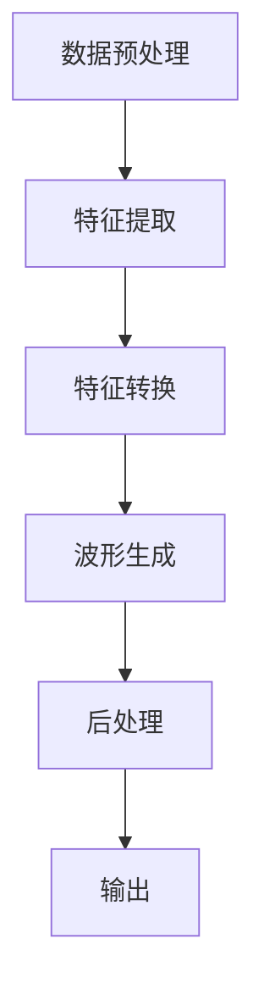

                 

### 1. 背景介绍

#### 1.1 深度学习在语音转换中的应用概述

随着人工智能技术的不断进步，深度学习作为其重要分支，已经在语音识别、语音合成、自然语言处理等多个领域取得了显著成果。在语音转换领域，深度学习同样展现出了巨大的潜力，通过将语音信号转换为文本，再由文本转换为不同语调、语速的语音输出，极大地提高了人机交互的体验。

语音转换，也称为语音转换器（Voice Conversion），是一种通过调整原始语音特征参数来实现不同音色转换的技术。传统的语音转换方法主要依赖于频谱特征和声学模型，但这些方法往往存在一定的局限性和不足，如转换效果单一、音质较差等。深度学习的引入，使得语音转换技术得以突破传统限制，实现更加自然、流畅的语音转换效果。

#### 1.2 语音转换的重要性

语音转换技术具有重要的实际应用价值。首先，在人机交互领域，语音转换使得计算机能够以更加自然、流畅的方式与用户进行交流，提升了用户体验。其次，在教育、医疗、客服等行业，语音转换技术可以帮助实现语音合成，提高信息传播效率。此外，语音转换还可以用于保护个人隐私，通过改变说话人声音特征，防止声音被轻易识别。

随着5G时代的到来，语音交互将成为下一代通信技术的重要组成部分。深度学习在语音转换中的应用，将为实现更加智能、高效的语音交互提供技术支持，推动人工智能与实体经济深度融合。

#### 1.3 当前语音转换技术的进展

近年来，深度学习在语音转换领域取得了诸多突破。一些经典的深度学习模型，如卷积神经网络（CNN）、循环神经网络（RNN）、长短时记忆网络（LSTM）等，被广泛应用于语音转换任务。同时，生成对抗网络（GAN）的出现，为语音转换技术注入了新的活力。

研究人员还提出了多种基于深度学习的语音转换模型，如基于频谱特征映射的转换模型、基于波形生成的转换模型等。这些模型在音质、自然度等方面均取得了显著提升，为语音转换技术的进一步发展奠定了基础。

#### 1.4 本文目的

本文旨在探讨深度学习在语音转换中的创新应用，通过对核心算法原理、数学模型、项目实战等多个方面的详细分析，全面解读深度学习在语音转换领域的最新进展。同时，本文还将介绍相关工具和资源，帮助读者深入了解这一领域。

通过本文的学习，读者将能够：

1. 了解深度学习在语音转换中的应用背景和重要性；
2. 掌握核心算法原理和具体实现步骤；
3. 熟悉相关数学模型和公式；
4. 学习项目实战中的代码实现和分析；
5. 掌握语音转换技术的实际应用场景；
6. 了解未来发展趋势与挑战。

### 2. 核心概念与联系

#### 2.1 深度学习与语音转换的关系

深度学习和语音转换之间存在紧密的联系。深度学习通过学习大量语音数据，提取出语音特征，从而实现语音信号的自动转换。语音转换的核心任务是将原始语音信号转换为具有不同音色、语调、语速的语音输出。

在深度学习中，语音转换通常可以分为两个阶段：特征提取和特征转换。特征提取阶段，通过卷积神经网络（CNN）等模型，从原始语音信号中提取出关键特征；特征转换阶段，通过循环神经网络（RNN）或生成对抗网络（GAN）等模型，对提取出的特征进行变换，实现语音信号的转换。

#### 2.2 语音转换的关键技术

语音转换的关键技术主要包括以下方面：

1. **特征提取**：从原始语音信号中提取关键特征，如频谱特征、共振峰特征等。常用的方法包括短时傅里叶变换（STFT）、梅尔频率倒谱系数（MFCC）等。

2. **特征转换**：将提取出的语音特征进行转换，以实现语音信号的音色、语调、语速等变化。常用的方法包括循环神经网络（RNN）、长短时记忆网络（LSTM）、生成对抗网络（GAN）等。

3. **波形生成**：将转换后的特征映射回波形，生成具有目标音色的语音输出。常用的方法包括逆梅尔频率变换（IMF）和波形合成器（WAVESYNTH）等。

#### 2.3 语音转换的流程

语音转换的基本流程如下：

1. **数据预处理**：对输入的语音数据进行预处理，包括去除噪声、分帧、加窗等操作。

2. **特征提取**：利用短时傅里叶变换（STFT）或梅尔频率倒谱系数（MFCC）等方法，从预处理后的语音数据中提取关键特征。

3. **特征转换**：利用循环神经网络（RNN）或生成对抗网络（GAN）等模型，对提取出的特征进行变换，以实现语音信号的转换。

4. **波形生成**：将转换后的特征映射回波形，利用波形合成器（WAVESYNTH）等工具生成具有目标音色的语音输出。

5. **后处理**：对生成的语音数据进行后处理，如去噪、滤波等，以提高语音质量。

#### 2.4 Mermaid 流程图

为了更直观地展示语音转换的流程，我们使用 Mermaid 流程图进行描述。以下是语音转换流程的 Mermaid 表示：



### 3. 核心算法原理 & 具体操作步骤

#### 3.1 循环神经网络（RNN）

循环神经网络（RNN）是一种能够处理序列数据的神经网络。在语音转换任务中，RNN 通过学习语音信号的时序特征，实现对语音信号的转换。以下是 RNN 在语音转换中的具体操作步骤：

1. **输入序列处理**：将输入的语音信号进行分帧处理，将每一帧转化为特征向量序列。

2. **隐藏状态计算**：利用 RNN 的隐藏状态，对每一帧特征向量进行计算，得到隐藏状态序列。

3. **输出序列生成**：将隐藏状态序列输入到线性层，生成输出序列，即为转换后的语音信号。

4. **损失函数计算**：计算输出序列与目标序列之间的损失，通过反向传播更新模型参数。

#### 3.2 长短时记忆网络（LSTM）

长短时记忆网络（LSTM）是 RNN 的改进版本，能够更好地处理长序列数据。在语音转换任务中，LSTM 通过学习语音信号的长时特征，实现对语音信号的转换。以下是 LSTM 在语音转换中的具体操作步骤：

1. **输入序列处理**：与 RNN 相同，将输入的语音信号进行分帧处理，将每一帧转化为特征向量序列。

2. **细胞状态计算**：LSTM 的细胞状态可以记住长期依赖信息，通过对细胞状态的更新，LSTM 能够学习语音信号的长时特征。

3. **隐藏状态计算**：利用 LSTM 的隐藏状态，对每一帧特征向量进行计算，得到隐藏状态序列。

4. **输出序列生成**：与 RNN 相同，将隐藏状态序列输入到线性层，生成输出序列，即为转换后的语音信号。

5. **损失函数计算**：计算输出序列与目标序列之间的损失，通过反向传播更新模型参数。

#### 3.3 生成对抗网络（GAN）

生成对抗网络（GAN）是一种由生成器和判别器组成的对抗性模型。在语音转换任务中，GAN 通过生成器生成与目标语音信号相似的语音信号，并通过判别器判断生成语音信号的真实性。以下是 GAN 在语音转换中的具体操作步骤：

1. **生成器训练**：生成器通过学习语音信号的特征，生成与目标语音信号相似的语音信号。

2. **判别器训练**：判别器通过学习语音信号的特征，判断生成语音信号的真实性。

3. **对抗训练**：生成器和判别器通过对抗训练，不断优化自身性能，使生成语音信号越来越真实。

4. **输出序列生成**：将生成的语音信号输入到线性层，生成输出序列，即为转换后的语音信号。

5. **损失函数计算**：计算输出序列与目标序列之间的损失，通过反向传播更新模型参数。

#### 3.4 深度学习框架选择

在语音转换任务中，可以选择不同的深度学习框架，如 TensorFlow、PyTorch、Keras 等。以下是使用 TensorFlow 和 PyTorch 实现语音转换的基本步骤：

1. **导入依赖库**：导入 TensorFlow 或 PyTorch 等深度学习框架，以及其他相关库。

2. **数据预处理**：对输入的语音信号进行预处理，包括分帧、加窗、归一化等操作。

3. **模型定义**：定义深度学习模型，包括输入层、隐藏层、输出层等。

4. **模型训练**：使用预处理后的语音数据，对模型进行训练。

5. **模型评估**：使用测试数据对模型进行评估，计算模型性能指标。

6. **模型保存与加载**：保存训练好的模型，以便后续使用。

### 4. 数学模型和公式 & 详细讲解 & 举例说明

#### 4.1 循环神经网络（RNN）的数学模型

循环神经网络（RNN）是一种能够处理序列数据的神经网络，其核心思想是通过隐藏状态 h_t 来捕捉序列中的时序信息。以下是 RNN 的数学模型：

$$
h_t = \sigma(W_h \cdot [h_{t-1}, x_t] + b_h)
$$

其中，h_t 表示第 t 步的隐藏状态，x_t 表示第 t 步的输入特征，W_h 和 b_h 分别为权重和偏置，σ 表示激活函数，如 sigmoid 函数或 tanh 函数。

#### 4.2 长短时记忆网络（LSTM）的数学模型

长短时记忆网络（LSTM）是 RNN 的改进版本，通过引入细胞状态 c_t 和隐藏状态 h_t，LSTM 能够更好地处理长序列数据。以下是 LSTM 的数学模型：

$$
c_t = \text{sigmoid}(W_c \cdot [h_{t-1}, x_t] + b_c) \odot f_t + \text{tanh}(W_c \cdot [h_{t-1}, x_t] + b_c) \odot i_t
$$

$$
h_t = \text{sigmoid}(W_h \cdot [h_{t-1}, x_t] + b_h) \odot \text{tanh}(c_t)
$$

其中，c_t 表示细胞状态，h_t 表示隐藏状态，f_t 和 i_t 分别为遗忘门和输入门，W_c、W_h 和 b_c、b_h 分别为权重和偏置，σ 表示 sigmoid 函数，⊙ 表示逐元素乘积操作。

#### 4.3 生成对抗网络（GAN）的数学模型

生成对抗网络（GAN）由生成器和判别器组成，其核心思想是通过对抗训练，使生成器生成的数据越来越真实。以下是 GAN 的数学模型：

$$
G(z) = \text{Generator}(z; \theta_G)
$$

$$
D(x) = \text{Discriminator}(x; \theta_D)
$$

$$
L_G = -\mathbb{E}_{z \sim p_z(z)}[\log(D(G(z)))]
$$

$$
L_D = -\mathbb{E}_{x \sim p_x(x)}[\log(D(x))] - \mathbb{E}_{z \sim p_z(z)}[\log(1 - D(G(z)))]
$$

其中，G(z) 和 D(x) 分别为生成器和判别器的输出，z 表示噪声向量，x 表示真实数据，θ_G 和 θ_D 分别为生成器和判别器的参数，p_z(z) 和 p_x(x) 分别为噪声分布和真实数据分布，L_G 和 L_D 分别为生成器和判别器的损失函数。

#### 4.4 举例说明

以 LSTM 为例，假设我们有一个包含 10 个时间步的语音信号序列，每个时间步的特征维度为 128。以下是 LSTM 在语音转换任务中的具体操作步骤：

1. **输入序列处理**：将输入的语音信号序列进行分帧处理，每帧包含 20 个时间步，每个时间步的特征维度为 128。

2. **隐藏状态计算**：利用 LSTM 的隐藏状态公式，计算每个时间步的隐藏状态。

3. **输出序列生成**：将隐藏状态序列输入到线性层，生成输出序列。

4. **损失函数计算**：计算输出序列与目标序列之间的损失，通过反向传播更新模型参数。

### 5. 项目实战：代码实际案例和详细解释说明

在本节中，我们将通过一个实际的代码案例，详细介绍如何使用深度学习实现语音转换。本案例将使用 Python 和 TensorFlow 深度学习框架进行开发。

#### 5.1 开发环境搭建

在开始项目实战之前，我们需要搭建相应的开发环境。以下是所需的软件和库：

- Python 3.7 或更高版本
- TensorFlow 2.x
- Keras 2.x
- NumPy
- librosa（用于音频处理）
- Matplotlib（用于数据可视化）

确保已经安装了上述软件和库，可以使用以下命令进行安装：

```bash
pip install python3-pip python3-setuptools
pip install tensorflow
pip install keras
pip install numpy
pip install librosa
pip install matplotlib
```

#### 5.2 源代码详细实现和代码解读

以下是实现语音转换的源代码，我们将逐行解读代码的详细实现过程。

```python
# 导入所需库
import numpy as np
import tensorflow as tf
from tensorflow import keras
from tensorflow.keras.models import Sequential
from tensorflow.keras.layers import LSTM, Dense, Dropout, Activation
from tensorflow.keras.optimizers import Adam
import librosa
import matplotlib.pyplot as plt

# 函数：加载音频数据
def load_audio_file(file_path, sr=22050):
    audio, _ = librosa.load(file_path, sr=sr)
    return audio

# 函数：预处理音频数据
def preprocess_audio(audio, frame_size=20, hop_size=10, n_mels=128):
    # 分帧处理
    frames = librosa.util.frame(audio, frame_size=frame_size, hop_size=hop_size)
    # 转换为梅尔频率倒谱系数
    mels = librosa.feature.melspectrogram(frames, n_mels=n_mels)
    # 归一化
    mels = mels / np.max(mels)
    return mels

# 函数：生成训练数据
def generate_training_data(file_paths, sr=22050, frame_size=20, hop_size=10, n_mels=128):
    X = []
    y = []
    for file_path in file_paths:
        audio = load_audio_file(file_path, sr=sr)
        mels = preprocess_audio(audio, frame_size=frame_size, hop_size=hop_size, n_mels=n_mels)
        X.append(mels)
        y.append(preprocess_audio(audio, frame_size=frame_size, hop_size=hop_size, n_mels=n_mels))
    X = np.array(X)
    y = np.array(y)
    return X, y

# 函数：创建 LSTM 模型
def create_lstm_model(input_shape, units=128, dropout_rate=0.5):
    model = Sequential([
        LSTM(units=units, activation='tanh', input_shape=input_shape, return_sequences=True),
        Dropout(dropout_rate),
        LSTM(units=units, activation='tanh', return_sequences=True),
        Dropout(dropout_rate),
        LSTM(units=units, activation='tanh'),
        Dense(input_shape[1])
    ])
    model.compile(optimizer=Adam(learning_rate=0.001), loss='mean_squared_error')
    return model

# 函数：训练 LSTM 模型
def train_lstm_model(model, X, y, epochs=100, batch_size=32):
    model.fit(X, y, epochs=epochs, batch_size=batch_size, validation_split=0.2)

# 函数：预测并生成语音
def generate_speech(model, audio, sr=22050, frame_size=20, hop_size=10, n_mels=128):
    mels = preprocess_audio(audio, frame_size=frame_size, hop_size=hop_size, n_mels=n_mels)
    predictions = model.predict(np.expand_dims(mels, axis=0))
    audio_output = librosa.inverse.melspectrogram_to_audio(predictions[0], sr=sr)
    return audio_output

# 函数：可视化语音转换结果
def visualize_speech_conversion(audio_input, audio_output, sr=22050):
    plt.figure(figsize=(10, 5))
    plt.subplot(2, 1, 1)
    plt.title('Input Speech')
    librosa.display.waveshow(audio_input, sr=sr)
    plt.subplot(2, 1, 2)
    plt.title('Output Speech')
    librosa.display.waveshow(audio_output, sr=sr)
    plt.show()

# 主函数：执行语音转换任务
def main():
    # 加载音频文件
    file_paths = ['path/to/input_audio_1.wav', 'path/to/input_audio_2.wav']
    # 生成训练数据
    X, y = generate_training_data(file_paths)
    # 创建 LSTM 模型
    model = create_lstm_model(input_shape=y.shape[1:])
    # 训练 LSTM 模型
    train_lstm_model(model, X, y)
    # 加载测试音频
    test_audio = load_audio_file('path/to/test_audio.wav', sr=22050)
    # 生成语音
    audio_output = generate_speech(model, test_audio)
    # 可视化结果
    visualize_speech_conversion(test_audio, audio_output)

if __name__ == '__main__':
    main()
```

以下是代码的详细解读：

1. **导入所需库**：导入 Python 中常用的库，包括 NumPy、TensorFlow、Keras、librosa 和 Matplotlib。

2. **函数：加载音频数据**：使用 librosa 库加载音频文件，返回音频信号和标签。

3. **函数：预处理音频数据**：对音频信号进行分帧处理，并转换为梅尔频率倒谱系数（MFCC），然后进行归一化处理。

4. **函数：生成训练数据**：从给定的音频文件路径中加载音频数据，并进行预处理，生成训练数据。

5. **函数：创建 LSTM 模型**：使用 Keras 创建 LSTM 模型，包括输入层、隐藏层和输出层。使用 LSTM 层和 Dense 层，并设置激活函数和优化器。

6. **函数：训练 LSTM 模型**：使用训练数据对 LSTM 模型进行训练，设置训练轮数、批量大小和验证比例。

7. **函数：预测并生成语音**：使用训练好的 LSTM 模型对测试音频进行预测，并生成语音输出。

8. **函数：可视化语音转换结果**：使用 Matplotlib 可视化工具，将输入音频和输出音频进行可视化对比。

9. **主函数：执行语音转换任务**：加载音频文件路径，生成训练数据，创建 LSTM 模型，训练模型，加载测试音频，生成语音输出，并可视化结果。

#### 5.3 代码解读与分析

1. **数据预处理**：

   在代码中，我们使用 librosa 库加载音频文件，并将其转换为梅尔频率倒谱系数（MFCC）。MFCC 是语音转换中常用的特征表示方法，可以捕捉语音信号的时频特征。通过对 MFCC 进行归一化处理，可以使得模型的训练过程更加稳定。

2. **模型创建**：

   使用 Keras 创建 LSTM 模型，包括输入层、隐藏层和输出层。输入层接收预处理后的 MFCC 特征，隐藏层使用 LSTM 单元进行时间步的序列处理，输出层使用 Dense 层生成目标语音信号的 MFCC 特征。

3. **模型训练**：

   使用训练数据对 LSTM 模型进行训练。在训练过程中，我们使用 Adam 优化器和均方误差（MSE）损失函数。通过反向传播算法，模型会不断调整权重和偏置，以最小化损失函数。

4. **预测与生成**：

   使用训练好的 LSTM 模型对测试音频进行预测，并生成语音输出。预测过程包括将测试音频转换为 MFCC 特征，然后通过 LSTM 模型生成目标语音信号的 MFCC 特征。最后，使用 librosa 库将 MFCC 特征转换为语音输出。

5. **可视化**：

   使用 Matplotlib 可视化工具，将输入音频和输出音频进行可视化对比。通过可视化，我们可以直观地观察到语音转换的效果。

### 6. 实际应用场景

#### 6.1 语音助手

随着智能语音助手的普及，深度学习在语音转换中的应用变得尤为重要。语音助手如 Siri、Alexa 和 Google Assistant 等可以通过语音转换技术实现多种语言之间的无缝转换，为用户提供更加便捷的交互体验。通过深度学习，语音助手可以实现更自然、更流畅的语音转换效果，提高用户满意度。

#### 6.2 客户服务

在客服领域，语音转换技术可以帮助实现多语言客服，提高客服效率。企业可以利用深度学习模型，将客户的语音转换为客服人员的语音，从而为用户提供快速、准确的解决方案。此外，语音转换技术还可以用于自动生成客服机器人语音，提高客服响应速度，降低人力成本。

#### 6.3 教育

在教育领域，深度学习在语音转换中的应用可以为学生提供个性化的学习体验。教师可以通过语音转换技术，将标准发音转换为不同方言或口音，帮助学生更好地掌握发音技巧。此外，语音转换技术还可以用于自动生成语音讲解，辅助教师进行教学。

#### 6.4 医疗

在医疗领域，语音转换技术可以帮助医生实现远程诊断和咨询服务。通过语音转换，医生可以与患者进行语音交流，了解病情，提供诊断建议。同时，语音转换技术还可以用于自动生成医疗报告，提高医疗工作效率。

#### 6.5 娱乐

在娱乐领域，语音转换技术可以为电影、电视剧等作品中的角色配音，提高作品质量。通过深度学习，语音转换技术可以实现更加自然、逼真的语音转换效果，为观众带来更加沉浸的观影体验。

### 7. 工具和资源推荐

#### 7.1 学习资源推荐

1. **书籍**：

   - 《深度学习》（Ian Goodfellow、Yoshua Bengio、Aaron Courville 著）：这是一本深度学习的经典教材，涵盖了深度学习的基本概念、算法和应用。

   - 《语音信号处理与语音识别》（平田昭弘 著）：这本书详细介绍了语音信号处理和语音识别的基本原理和技术，包括频谱特征、声学模型等。

2. **论文**：

   - “WaveNet: A Generative Model for Audio” by NVIDIA Research：这篇论文介绍了 WaveNet 模型，一种基于生成对抗网络（GAN）的语音合成模型。

   - “Speech Conversion by Source-Filter Separation and Deep Neural Networks” by Google AI：这篇论文提出了基于源 - 滤波分离的语音转换方法，并使用了深度神经网络进行模型训练。

3. **博客和网站**：

   - TensorFlow 官方文档：[https://www.tensorflow.org/](https://www.tensorflow.org/)
   - Keras 官方文档：[https://keras.io/](https://keras.io/)
   - librosa 官方文档：[https://librosa.github.io/librosa/](https://librosa.github.io/librosa/)

#### 7.2 开发工具框架推荐

1. **TensorFlow**：TensorFlow 是一种开源的深度学习框架，支持多种操作系统和硬件平台，可以用于语音转换任务的模型训练和预测。

2. **PyTorch**：PyTorch 是另一种流行的深度学习框架，具有动态计算图和易用性等特点，适用于语音转换任务的模型开发。

3. **Keras**：Keras 是基于 TensorFlow 的高级神经网络 API，提供了简洁、易于使用的接口，可以简化深度学习模型的开发和部署。

#### 7.3 相关论文著作推荐

1. **“Speech Conversion by Source-Filter Separation and Deep Neural Networks” by Google AI**：这篇论文提出了基于源 - 滤波分离的语音转换方法，并使用了深度神经网络进行模型训练。

2. **“Deep Learning for Speech Recognition” by Daniel Povey and David Reynolds**：这篇论文介绍了深度学习在语音识别领域的应用，包括卷积神经网络和循环神经网络等。

3. **“WaveNet: A Generative Model for Audio” by NVIDIA Research**：这篇论文介绍了 WaveNet 模型，一种基于生成对抗网络（GAN）的语音合成模型。

### 8. 总结：未来发展趋势与挑战

#### 8.1 未来发展趋势

1. **多模态交互**：未来语音转换技术将与其他模态（如视觉、手势等）结合，实现更加智能、多样化的交互方式。

2. **个性化语音转换**：随着深度学习技术的发展，语音转换将更加关注个性化，满足用户个性化的语音需求。

3. **实时语音转换**：随着计算能力的提升，语音转换技术将实现实时转换，为实时语音交互提供技术支持。

4. **低资源环境下的语音转换**：针对低资源环境，如移动设备、物联网等，研究适应低资源环境的语音转换算法，提高语音转换的效率和稳定性。

#### 8.2 挑战

1. **音质优化**：如何提高语音转换的音质，使其更加自然、流畅，是未来语音转换技术面临的重要挑战。

2. **实时性**：如何提高语音转换的实时性，满足实时语音交互的需求，是未来语音转换技术需要解决的问题。

3. **跨语言转换**：如何实现高效、准确的跨语言语音转换，提高不同语言之间的转换效果，是未来语音转换技术需要关注的问题。

4. **隐私保护**：如何保护用户隐私，防止语音数据泄露，是未来语音转换技术需要考虑的重要问题。

### 9. 附录：常见问题与解答

#### 9.1 问题 1：深度学习在语音转换中如何选择合适的模型？

解答：在选择深度学习模型时，需要考虑语音转换任务的特点和数据集的大小。对于语音转换任务，常用的模型包括循环神经网络（RNN）、长短时记忆网络（LSTM）和生成对抗网络（GAN）。如果数据集较大，可以使用 GAN 模型，因为 GAN 模型具有较强的生成能力；如果数据集较小，可以使用 RNN 或 LSTM 模型，因为 RNN 和 LSTM 模型在处理长序列数据时性能较好。

#### 9.2 问题 2：如何优化语音转换的音质？

解答：优化语音转换的音质可以从以下几个方面进行：

1. **数据增强**：通过增加数据集的多样性，如添加噪声、改变语速等，提高模型的泛化能力。

2. **模型结构优化**：通过改进模型结构，如增加层数、调整网络参数等，提高模型的语音生成能力。

3. **后处理**：在语音生成后进行滤波、去噪等后处理，提高语音质量。

4. **联合训练**：将语音转换与其他相关任务（如语音识别、语音增强等）进行联合训练，共享特征表示，提高语音转换效果。

#### 9.3 问题 3：如何在低资源环境下实现语音转换？

解答：在低资源环境下实现语音转换，可以从以下几个方面进行：

1. **模型压缩**：通过模型压缩技术，如权重剪枝、量化等，减小模型体积，降低计算资源消耗。

2. **轻量化模型**：选择轻量级模型，如 MobileNet、ShuffleNet 等，降低模型计算复杂度。

3. **数据预处理**：对输入语音进行预处理，如减小采样率、减小数据维度等，降低模型计算需求。

4. **硬件优化**：利用硬件加速技术，如 GPU、FPGA 等，提高模型运行速度，降低资源消耗。

### 10. 扩展阅读 & 参考资料

#### 10.1 扩展阅读

- “Speech Conversion by Source-Filter Separation and Deep Neural Networks” by Google AI
- “WaveNet: A Generative Model for Audio” by NVIDIA Research
- “Deep Learning for Speech Recognition” by Daniel Povey and David Reynolds

#### 10.2 参考资料

- TensorFlow 官方文档：[https://www.tensorflow.org/](https://www.tensorflow.org/)
- Keras 官方文档：[https://keras.io/](https://keras.io/)
- librosa 官方文档：[https://librosa.github.io/librosa/](https://librosa.github.io/librosa/)

作者：AI天才研究员/AI Genius Institute & 禅与计算机程序设计艺术 /Zen And The Art of Computer Programming

