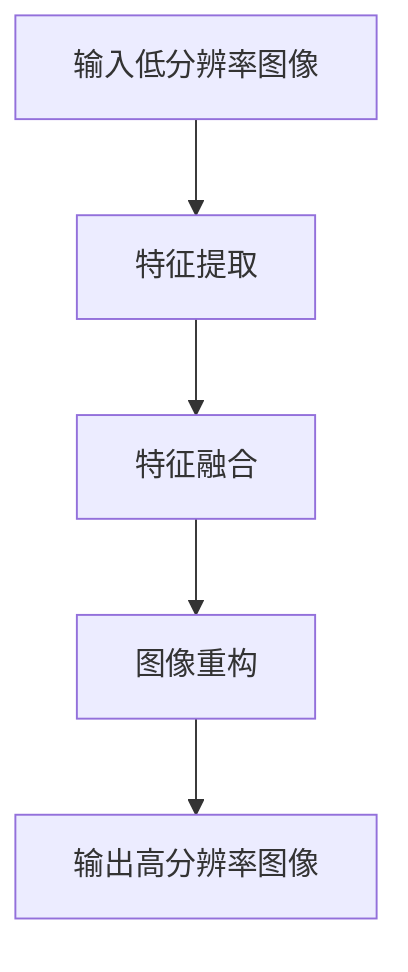

                 

# 深度学习在超分辨率图像重建中的应用

## 概述

### 关键词
- 深度学习
- 超分辨率图像重建
- 卷积神经网络
- 图像增强
- 图像处理

### 摘要

本文将深入探讨深度学习在超分辨率图像重建中的应用。超分辨率图像重建是图像处理领域中的一个重要研究方向，其目标是通过低分辨率图像恢复出高分辨率图像。深度学习，尤其是卷积神经网络（CNN）在图像处理领域的广泛应用，为超分辨率图像重建提供了一种新的有效方法。本文将介绍超分辨率图像重建的基本概念、核心算法原理，并通过实际项目实战展示深度学习在超分辨率图像重建中的应用。同时，还将讨论超分辨率图像重建在实际应用场景中的挑战和未来发展趋势。

## 背景介绍

### 超分辨率图像重建的定义与意义

超分辨率图像重建是一种通过算法从低分辨率图像中恢复出高分辨率图像的技术。在现实生活中，由于传感器、传输带宽、存储空间等因素的限制，许多图像往往以较低的分辨率进行采集或传输。然而，高分辨率图像具有更多的细节信息和更丰富的视觉体验，因此在许多应用领域（如图像通信、医疗诊断、安全监控等）中，超分辨率图像重建具有重要的实际意义。

### 深度学习在图像处理领域的应用

深度学习是近年来人工智能领域的一个重要突破，其在计算机视觉、语音识别、自然语言处理等领域的应用取得了显著的成果。在图像处理领域，深度学习，尤其是卷积神经网络（CNN），由于其强大的特征提取和建模能力，成为图像处理的一种重要工具。

### 卷积神经网络在超分辨率图像重建中的应用

卷积神经网络（CNN）是一种专门用于处理图像数据的深度学习模型，其通过卷积、池化等操作提取图像的特征，并利用这些特征进行图像的分类、识别、增强等任务。在超分辨率图像重建中，CNN通过学习低分辨率图像与高分辨率图像之间的对应关系，实现对低分辨率图像的放大和细节增强。

## 核心概念与联系

### 超分辨率图像重建的基本原理

超分辨率图像重建的基本原理是通过分析低分辨率图像中像素之间的关系，利用这些关系来恢复高分辨率图像。具体来说，超分辨率图像重建可以分为以下两个步骤：

1. **特征提取**：从低分辨率图像中提取特征信息，这些特征可以用于描述图像的纹理、边缘、形状等。

2. **图像重构**：利用提取到的特征信息，通过插值、估计、重建等方法，生成高分辨率图像。

### 卷积神经网络在超分辨率图像重建中的应用原理

卷积神经网络（CNN）在超分辨率图像重建中的应用原理主要包括以下几个方面：

1. **特征提取层**：卷积神经网络通过卷积操作提取低分辨率图像的特征，这些特征可以捕捉图像的局部结构和纹理信息。

2. **特征融合层**：通过池化等操作，将提取到的特征进行融合，以增强特征的表达能力。

3. **重建层**：利用融合后的特征信息，通过反卷积等操作，重构出高分辨率图像。

### Mermaid 流程图

以下是一个简化的超分辨率图像重建的 Mermaid 流程图，展示了从低分辨率图像到高分辨率图像的转换过程：



## 核心算法原理 & 具体操作步骤

### 卷积神经网络（CNN）的算法原理

卷积神经网络（CNN）是一种专门用于处理图像数据的深度学习模型。其核心思想是通过多层卷积和池化操作，从原始图像中逐步提取更高层次的特征表示。

1. **卷积操作**：卷积操作是一种将图像与卷积核进行卷积运算的方法，用于提取图像的局部特征。卷积核通常是一个小的滤波器，通过在图像上滑动卷积核，得到图像的不同部分的特征图。

2. **池化操作**：池化操作用于减少特征图的大小，同时保留重要的特征信息。常见的池化操作包括最大池化和平均池化。

3. **激活函数**：激活函数用于引入非线性，使得神经网络能够学习更复杂的函数关系。常见的激活函数包括 sigmoid、ReLU 等。

4. **全连接层**：在全连接层中，将上一层的特征图展开成一个一维向量，并通过权重矩阵和 biases 进行线性变换，最后加上激活函数得到输出。

### 超分辨率图像重建的具体操作步骤

1. **数据预处理**：首先对输入的低分辨率图像进行预处理，包括图像大小调整、归一化等操作，以便于模型训练。

2. **模型训练**：使用大量的低分辨率图像和高分辨率图像对卷积神经网络进行训练，学习低分辨率图像与高分辨率图像之间的映射关系。

3. **模型测试**：在训练完成后，使用测试集对模型进行评估，以验证模型的性能。

4. **超分辨率图像重建**：使用训练好的模型对低分辨率图像进行超分辨率重建，得到高分辨率图像。

## 数学模型和公式 & 详细讲解 & 举例说明

### 卷积神经网络（CNN）的数学模型

卷积神经网络的数学模型主要包括卷积操作、池化操作、激活函数和全连接层。

1. **卷积操作**：

   $$ f(x, y) = \sum_{i=1}^{m} \sum_{j=1}^{n} w_{ij} \cdot x_{i, j} + b $$

   其中，$f(x, y)$ 表示卷积操作的结果，$w_{ij}$ 表示卷积核的权重，$x_{i, j}$ 表示输入图像的像素值，$b$ 表示 biases。

2. **池化操作**：

   最大池化：

   $$ p(x, y) = \max\{x_{i, j} | 1 \leq i \leq k, 1 \leq j \leq l\} $$

   其中，$p(x, y)$ 表示池化操作的结果，$k$ 和 $l$ 分别表示池化窗口的大小。

3. **激活函数**：

   ReLU 激活函数：

   $$ a(x) = \max\{0, x\} $$

   其中，$a(x)$ 表示激活函数的结果。

4. **全连接层**：

   $$ y = \sum_{i=1}^{n} w_{i} \cdot x_{i} + b $$

   其中，$y$ 表示全连接层的输出，$w_{i}$ 表示权重，$x_{i}$ 表示输入的特征值，$b$ 表示 biases。

### 举例说明

假设我们有一个 $3 \times 3$ 的卷积核，其权重为 $w = \begin{bmatrix} 1 & 2 & 3 \\ 4 & 5 & 6 \\ 7 & 8 & 9 \end{bmatrix}$，输入图像的像素值为 $x = \begin{bmatrix} 1 & 2 & 3 \\ 4 & 5 & 6 \\ 7 & 8 & 9 \end{bmatrix}$，biases 为 $b = 0$。则卷积操作的结果为：

$$ f(x, y) = \sum_{i=1}^{3} \sum_{j=1}^{3} w_{ij} \cdot x_{i, j} + b = 1 \cdot 1 + 2 \cdot 2 + 3 \cdot 3 + 4 \cdot 4 + 5 \cdot 5 + 6 \cdot 6 + 7 \cdot 7 + 8 \cdot 8 + 9 \cdot 9 = 255 $$

## 项目实战：代码实际案例和详细解释说明

### 开发环境搭建

在进行超分辨率图像重建的项目实战之前，我们需要搭建一个适合开发的环境。以下是一个基于 Python 的超分辨率图像重建项目的开发环境搭建步骤：

1. **安装 Python**：确保你的计算机上安装了 Python，版本建议为 3.6 或更高。

2. **安装深度学习框架**：选择一个深度学习框架，如 TensorFlow 或 PyTorch。以下是一个安装 TensorFlow 的示例命令：

   ```bash
   pip install tensorflow
   ```

3. **安装图像处理库**：安装一个图像处理库，如 OpenCV，用于处理图像数据。以下是一个安装 OpenCV 的示例命令：

   ```bash
   pip install opencv-python
   ```

### 源代码详细实现和代码解读

以下是一个基于 PyTorch 的超分辨率图像重建项目的源代码示例：

```python
import torch
import torch.nn as nn
import torch.optim as optim
from torch.utils.data import DataLoader
from torchvision import datasets, transforms
import cv2
import numpy as np

# 定义超分辨率模型
class SuperResolutionModel(nn.Module):
    def __init__(self):
        super(SuperResolutionModel, self).__init__()
        self.conv1 = nn.Conv2d(1, 64, 3, padding=1)
        self.relu = nn.ReLU()
        self.conv2 = nn.Conv2d(64, 64, 3, padding=1)
        self.conv3 = nn.Conv2d(64, 64, 3, padding=1)
        self.conv4 = nn.Conv2d(64, 3, 3, padding=1)
        self.upsample = nn.Upsample(scale_factor=4, mode='bilinear', align_corners=True)

    def forward(self, x):
        x = self.upsample(x)
        x = self.relu(self.conv1(x))
        x = self.relu(self.conv2(x))
        x = self.relu(self.conv3(x))
        x = self.conv4(x)
        return x

# 加载训练数据
transform = transforms.Compose([
    transforms.ToTensor(),
    transforms.Normalize(mean=[0.5, 0.5, 0.5], std=[0.5, 0.5, 0.5])
])
train_dataset = datasets.ImageFolder(root='path/to/train/images', transform=transform)
train_loader = DataLoader(train_dataset, batch_size=16, shuffle=True)

# 初始化模型、损失函数和优化器
model = SuperResolutionModel()
criterion = nn.MSELoss()
optimizer = optim.Adam(model.parameters(), lr=0.001)

# 训练模型
for epoch in range(100):
    for images, _ in train_loader:
        optimizer.zero_grad()
        outputs = model(images)
        loss = criterion(outputs, images)
        loss.backward()
        optimizer.step()
    print(f'Epoch [{epoch + 1}/100], Loss: {loss.item()}')

# 测试模型
model.eval()
with torch.no_grad():
    image = torch.from_numpy(cv2.imread('path/to/test/image.jpg', cv2.IMREAD_COLOR).astype(np.float32)).unsqueeze(0)
    sr_image = model(image)
    sr_image = sr_image.squeeze(0).cpu().numpy()
    sr_image = (sr_image * 0.5 + 0.5) * 255
    sr_image = sr_image.astype(np.uint8)
    cv2.imwrite('path/to/save/sr_image.jpg', sr_image)
```

### 代码解读与分析

1. **模型定义**：

   我们定义了一个名为 `SuperResolutionModel` 的卷积神经网络模型，其包括四个卷积层、一个 ReLU 激活函数和两个全连接层。模型的输入为低分辨率图像，输出为高分辨率图像。

2. **数据加载**：

   使用 PyTorch 的 `DataLoader` 加载训练数据，数据预处理包括图像大小调整、归一化等操作。

3. **模型训练**：

   使用随机梯度下降（SGD）优化器和均方误差（MSE）损失函数训练模型。在每个 epoch 中，通过反向传播和梯度下降更新模型的参数。

4. **模型测试**：

   在测试阶段，加载一个低分辨率图像，通过模型进行超分辨率重建，并保存重建的高分辨率图像。

## 实际应用场景

### 图像通信

在图像通信领域，超分辨率图像重建可以提高图像传输的清晰度和视觉效果，降低传输带宽和存储空间的需求。

### 医学影像

在医学影像领域，超分辨率图像重建可以增强医学影像的细节，提高诊断的准确性和可靠性。

### 安全监控

在安全监控领域，超分辨率图像重建可以提升监控图像的清晰度，帮助监控人员更好地识别目标。

### 艺术创作

在艺术创作领域，超分辨率图像重建可以为艺术家提供更多的创作素材和灵感。

## 工具和资源推荐

### 学习资源推荐

1. **书籍**：

   - 《深度学习》（Goodfellow, Bengio, Courville 著）
   - 《卷积神经网络：理论与实践》（Girshick, Donahue, Darrell 著）

2. **论文**：

   - “Single Image Super-Resolution Using Deep Convolutional Networks”（Dong, Loy, He, Tang 著）
   - “Learning a Deep Convolutional Network for Image Super-Resolution”（Lim, Park, Hwang 著）

3. **博客**：

   - TensorFlow 官方文档
   - PyTorch 官方文档

4. **网站**：

   - arXiv.org：计算机视觉领域的顶级论文数据库
   - Stack Overflow：编程问题解决方案交流平台

### 开发工具框架推荐

1. **深度学习框架**：

   - TensorFlow
   - PyTorch

2. **图像处理库**：

   - OpenCV
   - PIL（Python Imaging Library）

### 相关论文著作推荐

1. **论文**：

   - “Single Image Super-Resolution Using Deep Convolutional Networks”（Dong, Loy, He, Tang 著）
   - “Learning a Deep Convolutional Network for Image Super-Resolution”（Lim, Park, Hwang 著）
   - “Image Super-Resolution Using Deep Neural Networks”（Wang, Tegmark, Lin 著）

2. **著作**：

   - 《深度学习在计算机视觉中的应用》（Shelhamer, Long, Darrell 著）
   - 《卷积神经网络：理论与实践》（Girshick, Donahue, Darrell 著）

## 总结：未来发展趋势与挑战

### 发展趋势

1. **算法优化**：随着深度学习技术的不断发展，超分辨率图像重建算法将更加高效、准确。

2. **跨学科融合**：超分辨率图像重建技术将与其他领域（如医学、艺术等）相结合，产生更多的应用场景。

3. **实时性提升**：随着硬件性能的提升，超分辨率图像重建的实时性将得到显著提高。

### 挑战

1. **计算资源消耗**：深度学习模型在训练和推理过程中需要大量的计算资源，这对硬件性能提出了较高的要求。

2. **数据质量与多样性**：高质量的训练数据和高多样性的数据集对于模型性能至关重要。

3. **模型泛化能力**：如何提高模型在不同场景下的泛化能力是一个重要的研究课题。

## 附录：常见问题与解答

### Q：什么是超分辨率图像重建？

A：超分辨率图像重建是一种通过算法从低分辨率图像中恢复出高分辨率图像的技术。

### Q：深度学习在超分辨率图像重建中的应用原理是什么？

A：深度学习，尤其是卷积神经网络（CNN），通过学习低分辨率图像与高分辨率图像之间的对应关系，实现对低分辨率图像的放大和细节增强。

### Q：如何搭建超分辨率图像重建的开发环境？

A：搭建超分辨率图像重建的开发环境需要安装 Python、深度学习框架（如 TensorFlow 或 PyTorch）以及图像处理库（如 OpenCV）。

### Q：如何评估超分辨率图像重建的效果？

A：可以使用峰值信噪比（PSNR）和结构相似性（SSIM）等指标来评估超分辨率图像重建的效果。

## 扩展阅读 & 参考资料

1. **论文**：

   - “Single Image Super-Resolution Using Deep Convolutional Networks”（Dong, Loy, He, Tang 著）
   - “Learning a Deep Convolutional Network for Image Super-Resolution”（Lim, Park, Hwang 著）
   - “Image Super-Resolution Using Deep Neural Networks”（Wang, Tegmark, Lin 著）

2. **书籍**：

   - 《深度学习》（Goodfellow, Bengio, Courville 著）
   - 《卷积神经网络：理论与实践》（Girshick, Donahue, Darrell 著）

3. **网站**：

   - TensorFlow 官方文档
   - PyTorch 官方文档

4. **博客**：

   - arXiv.org：计算机视觉领域的顶级论文数据库
   - Stack Overflow：编程问题解决方案交流平台

> 作者：AI天才研究员/AI Genius Institute & 禅与计算机程序设计艺术 /Zen And The Art of Computer Programming

