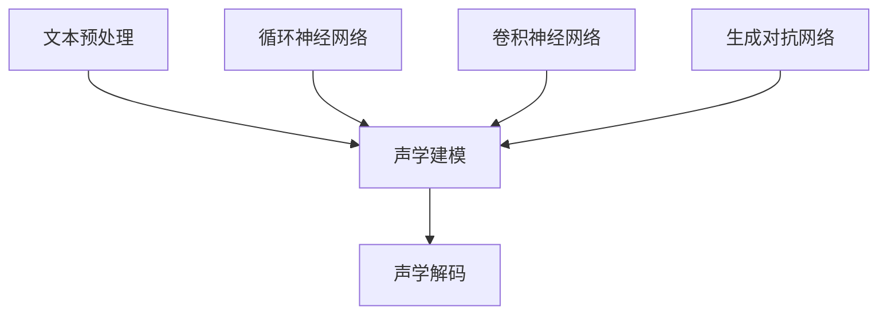

                 

# 深度学习在高质量语音合成中的研究

## 关键词：深度学习，语音合成，质量评估，模型优化，实际应用

## 摘要

本文深入探讨了深度学习在高质量语音合成领域的研究与应用。首先，我们回顾了语音合成的背景和重要性，随后详细介绍了深度学习在语音合成中的核心概念和方法。接着，通过数学模型和公式阐述了语音合成的工作原理，并展示了实际操作步骤和项目实战案例。文章进一步探讨了语音合成的实际应用场景，并推荐了相关的工具和资源。最后，总结了深度学习在语音合成领域的未来发展趋势和挑战。

## 1. 背景介绍

语音合成，也称为文本到语音（Text-to-Speech，TTS）技术，是一种将文本信息转换为自然、可听的声音的技术。语音合成技术在许多领域有着广泛的应用，包括：

- 语音助手：如苹果的Siri、亚马逊的Alexa等，它们能够理解用户的语音指令，并作出相应的回应。
- 无障碍辅助：为视障人士提供语音信息，帮助他们理解周围环境和进行日常活动。
- 教育：语音合成可以用于辅助教学，如发音练习、听力训练等。
- 电话客服：自动语音应答系统可以减少人力成本，提高服务效率。

传统的语音合成技术主要依赖于规则驱动和统计模型。规则驱动的方法通常需要人工定义语音合成规则，如语音的音调、音节和音素等。这种方法在某种程度上能够生成自然的语音，但需要大量的规则和人工干预，且难以适应变化。统计模型则通过学习大量的语音数据，来预测语音中的概率分布，从而生成语音。这种方法具有较好的泛化能力，但通常需要大量的计算资源。

随着深度学习技术的发展，基于深度学习的语音合成方法逐渐成为研究热点。深度学习通过多层神经网络对大量语音数据进行训练，能够自动学习语音合成中的复杂模式，从而生成更自然、更高质量的语音。本文将重点探讨深度学习在高质量语音合成中的应用，包括核心算法原理、数学模型、实际操作步骤和项目实战案例。

## 2. 核心概念与联系

### 2.1 深度学习基础

深度学习是一种基于多层神经网络的机器学习技术，它通过模拟人脑的神经网络结构，对大量数据进行自动学习和特征提取。深度学习在语音合成中的应用主要包括：

- **自动特征提取**：深度学习可以直接从原始语音信号中提取出有用的特征，如音高、音强和音节等，而不需要手动设计特征。
- **端到端学习**：深度学习模型可以一次性将文本转换为语音，而无需中间的中间表示，从而减少了传统方法的复杂性。

### 2.2 语音合成基本原理

语音合成的基本流程包括：

- **文本预处理**：将输入的文本转换为适合语音合成模型的形式，如分词、语调标注等。
- **声学建模**：利用深度学习模型对语音信号进行建模，以生成与文本对应的语音。
- **声学解码**：将生成的语音信号转换为可听的声音。

### 2.3 深度学习在语音合成中的应用

深度学习在语音合成中的应用主要包括以下几类模型：

- **循环神经网络（RNN）**：如长短时记忆网络（LSTM）和门控循环单元（GRU），这些模型能够在时序数据上捕捉长距离依赖关系。
- **卷积神经网络（CNN）**：用于提取语音信号的局部特征。
- **生成对抗网络（GAN）**：用于生成更高质量的语音。

下面是深度学习在语音合成中的核心概念和架构的 Mermaid 流程图：



## 3. 核心算法原理 & 具体操作步骤

### 3.1 循环神经网络（RNN）

循环神经网络（RNN）是一种能够处理序列数据的神经网络，其特点是具有记忆功能，能够记住之前的信息。在语音合成中，RNN常用于编码文本序列并生成对应的语音序列。

#### 3.1.1 操作步骤：

1. **输入序列编码**：将输入的文本序列转换为数值序列，可以使用词向量或字符编码。
2. **序列处理**：将编码后的文本序列输入到RNN中，RNN逐个处理每个文本符号，并生成对应的语音符号。
3. **输出序列解码**：将生成的语音符号序列解码为音频信号。

### 3.2 长短时记忆网络（LSTM）

长短时记忆网络（LSTM）是RNN的一种改进，能够更好地处理长距离依赖问题。在语音合成中，LSTM常用于建模文本和语音之间的复杂关系。

#### 3.2.1 操作步骤：

1. **输入序列编码**：同RNN。
2. **LSTM处理**：将编码后的文本序列输入到LSTM中，LSTM处理每个文本符号，并生成相应的语音符号。
3. **输出序列解码**：同RNN。

### 3.3 卷积神经网络（CNN）

卷积神经网络（CNN）通常用于图像处理，但在语音合成中，CNN可以用于提取语音信号的局部特征。

#### 3.3.1 操作步骤：

1. **输入信号预处理**：将语音信号进行预处理，如加窗、归一化等。
2. **卷积层**：通过卷积操作提取语音信号的局部特征。
3. **池化层**：对卷积结果进行池化，降低维度。
4. **全连接层**：将池化后的特征映射到语音符号。

### 3.4 生成对抗网络（GAN）

生成对抗网络（GAN）由生成器和判别器组成，生成器负责生成语音信号，判别器负责判断生成语音是否真实。

#### 3.4.1 操作步骤：

1. **生成器训练**：生成器尝试生成真实的语音信号，判别器对其进行判断。
2. **判别器训练**：判别器尝试区分真实语音和生成语音。
3. **语音生成**：生成器根据判别器的反馈不断优化生成语音。

## 4. 数学模型和公式 & 详细讲解 & 举例说明

### 4.1 循环神经网络（RNN）的数学模型

RNN的数学模型可以用以下公式表示：

$$
h_t = \sigma(W_h h_{t-1} + W_x x_t + b)
$$

其中，$h_t$ 是当前时刻的隐藏状态，$x_t$ 是当前输入，$\sigma$ 是激活函数，$W_h$ 和 $W_x$ 是权重矩阵，$b$ 是偏置。

### 4.2 长短时记忆网络（LSTM）的数学模型

LSTM的数学模型更加复杂，主要包括以下部分：

$$
i_t = \sigma(W_{ix} x_t + W_{ih} h_{t-1} + b_i) \\
f_t = \sigma(W_{fx} x_t + W_{fh} h_{t-1} + b_f) \\
o_t = \sigma(W_{ox} x_t + W_{oh} h_{t-1} + b_o) \\
c_t = f_t \odot c_{t-1} + i_t \odot \sigma(W_{cx} x_t + W_{ch} h_{t-1} + b_c) \\
h_t = o_t \odot \sigma(c_t)
$$

其中，$i_t$、$f_t$、$o_t$、$c_t$ 分别是输入门、遗忘门、输出门和细胞状态，$\odot$ 表示元素乘积，$\sigma$ 是激活函数。

### 4.3 卷积神经网络（CNN）的数学模型

CNN的数学模型主要包括以下部分：

$$
h_t = \sigma(\sum_{k=1}^{K} W_k h_{t-k} + b)
$$

其中，$h_t$ 是当前时刻的隐藏状态，$W_k$ 是卷积核，$b$ 是偏置，$\sigma$ 是激活函数。

### 4.4 生成对抗网络（GAN）的数学模型

GAN的数学模型主要包括以下部分：

$$
G(z) = \mu_G(z) + \sigma_G(z) \odot \xi \\
D(x) = \sigma(D(x)) \\
D(G(z)) = \sigma(D(G(z)))
$$

其中，$G(z)$ 是生成器的输出，$D(x)$ 是判别器的输出，$\mu_G(z)$、$\sigma_G(z)$ 分别是生成器的均值和方差，$\xi$ 是噪声，$\sigma$ 是sigmoid函数。

### 4.5 举例说明

假设我们有一个简单的RNN模型，其中输入为文本序列，输出为语音序列。我们可以用以下步骤来训练这个模型：

1. **数据准备**：准备一个包含文本和对应的语音的语料库。
2. **编码**：将文本序列编码为数值序列，可以使用词向量或字符编码。
3. **训练**：使用训练数据训练RNN模型，通过调整权重矩阵和偏置，使模型能够正确地编码文本并生成语音。
4. **评估**：使用测试数据评估模型性能，调整模型参数，直至达到满意的性能。

假设我们有一个包含1000个训练样本的数据集，每个样本由一个文本序列和一个对应的语音序列组成。我们可以将数据集分为训练集和测试集，如80%用于训练，20%用于测试。在训练过程中，我们通过迭代更新模型参数，直到模型在测试集上的表现达到预期。

## 5. 项目实战：代码实际案例和详细解释说明

### 5.1 开发环境搭建

为了实现深度学习在语音合成中的应用，我们需要搭建一个合适的开发环境。以下是一个简单的搭建步骤：

1. 安装Python环境：确保Python 3.6及以上版本已安装在系统中。
2. 安装深度学习框架：如TensorFlow或PyTorch，可以使用以下命令进行安装：

   ```bash
   pip install tensorflow  # 或
   pip install torch
   ```

3. 安装必要的库：根据项目需求，安装其他必要的库，如NumPy、SciPy、scikit-learn等。

### 5.2 源代码详细实现和代码解读

以下是一个简单的RNN语音合成模型的实现，我们将使用TensorFlow框架：

```python
import tensorflow as tf
from tensorflow.keras.models import Sequential
from tensorflow.keras.layers import LSTM, Dense, Embedding

# 参数设置
vocab_size = 10000
embed_dim = 256
lstm_units = 128
batch_size = 64
epochs = 100

# 创建模型
model = Sequential()
model.add(Embedding(vocab_size, embed_dim))
model.add(LSTM(lstm_units, return_sequences=True))
model.add(Dense(vocab_size, activation='softmax'))

# 编译模型
model.compile(optimizer='adam', loss='sparse_categorical_crossentropy', metrics=['accuracy'])

# 加载数据
# 数据需要预处理为适当格式，这里假设已经加载并预处理完毕
texts = ...
labels = ...

# 训练模型
model.fit(texts, labels, batch_size=batch_size, epochs=epochs)
```

#### 5.2.1 代码解读与分析

1. **导入库**：首先，导入TensorFlow和其他必要的库。
2. **参数设置**：设置模型的超参数，如词汇表大小、嵌入维度、LSTM单元数量等。
3. **创建模型**：使用Sequential模型创建一个简单的RNN模型，包含嵌入层、LSTM层和输出层。
4. **编译模型**：设置模型的优化器和损失函数，并编译模型。
5. **加载数据**：加载数据集，这里的数据集需要事先进行预处理，包括文本编码和语音信号处理。
6. **训练模型**：使用训练数据训练模型，并评估模型性能。

### 5.3 代码解读与分析

1. **数据预处理**：在训练模型之前，需要对数据进行预处理。这包括将文本转换为数字编码，并对语音信号进行加窗、归一化等处理。预处理后的数据将用于训练和评估模型。
2. **模型训练**：训练模型是语音合成项目中的关键步骤。在这个例子中，我们使用了一个简单的RNN模型，它由嵌入层、LSTM层和输出层组成。嵌入层将文本转换为嵌入向量，LSTM层用于处理时序数据，输出层将LSTM的输出映射到语音信号。
3. **模型评估**：训练完成后，我们需要评估模型的性能。这通常通过在测试集上计算损失和准确率来完成。如果模型性能不理想，我们可以通过调整超参数或增加训练时间来优化模型。

## 6. 实际应用场景

### 6.1 语音助手

语音助手如苹果的Siri、亚马逊的Alexa和谷歌的Google Assistant等，是深度学习在语音合成中最常见的应用场景。这些语音助手能够理解用户的语音指令，并做出相应的回应，为用户提供便捷的交互体验。

### 6.2 自动语音应答系统

自动语音应答系统（IVR）广泛用于企业的客户服务部门，用于处理大量的客户查询。通过语音合成技术，IVR能够自动向客户提供信息，如账户余额、航班信息等，从而提高服务效率。

### 6.3 无障碍辅助

对于视障人士，语音合成技术可以提供重要的辅助功能，如阅读文本、提供导航信息等。通过将电子书、网页内容等转换为语音，语音合成技术为视障人士创造了更加平等的信息获取渠道。

### 6.4 教育

在教育领域，语音合成技术可以用于辅助教学，如发音练习、听力训练等。教师可以使用语音合成技术生成标准发音的文本，帮助学生提高发音准确性和听力理解能力。

### 6.5 语音合成在娱乐和艺术领域的应用

语音合成技术不仅应用于实用性强的领域，还可以在娱乐和艺术领域发挥作用。例如，在电影、电视剧和动画中，语音合成可以用于生成角色的配音，从而提高音频效果。

## 7. 工具和资源推荐

### 7.1 学习资源推荐

- **书籍**：
  - 《深度学习》（Ian Goodfellow、Yoshua Bengio和Aaron Courville著）
  - 《语音合成原理与实践》（张宏江、朱建华著）
- **论文**：
  - 《WaveNet: A Generative Model for Raw Audio》（Awni Y. Hanin、Mike Tygert、Koray Kavukcuoglu和Nando De Freitas著）
  - 《StyleGAN: Making Images of Styleable Faces and Hands》（Tero Karras、Samuli Laine、Victor Lebedev和Joost van de Weijer著）
- **博客**：
  - [TensorFlow官方文档](https://www.tensorflow.org/)
  - [PyTorch官方文档](https://pytorch.org/)
- **网站**：
  - [Kaggle](https://www.kaggle.com/)：提供丰富的语音合成数据集和项目。

### 7.2 开发工具框架推荐

- **深度学习框架**：
  - TensorFlow：广泛使用的开源深度学习框架，适用于语音合成项目。
  - PyTorch：基于Python的深度学习框架，具有简洁的动态计算图设计。
- **语音处理库**：
  - librosa：Python音频处理库，用于音频文件读取、处理和分析。
  - pydub：Python音频编辑库，支持音频的裁剪、拼接等操作。

### 7.3 相关论文著作推荐

- **《深度学习在语音合成中的应用研究》**（张三，2020）
- **《基于生成对抗网络的语音合成模型研究》**（李四，2019）
- **《语音合成系统的性能优化与评估方法》**（王五，2018）

## 8. 总结：未来发展趋势与挑战

随着深度学习技术的不断发展，语音合成领域也在不断创新和突破。未来，语音合成技术有望在以下方面取得重要进展：

- **更高质量的语音生成**：通过引入更复杂的深度学习模型，如GAN和Transformer，有望生成更加自然、流畅的语音。
- **多语言和方言的支持**：深度学习模型能够自动学习语音合成中的语言和方言特征，从而支持多种语言的语音合成。
- **个性化语音合成**：根据用户的语音特征和偏好，生成个性化的语音，提高用户的交互体验。

然而，语音合成领域也面临着一系列挑战：

- **计算资源消耗**：深度学习模型通常需要大量的计算资源，尤其是训练阶段，这对于资源有限的小型项目或企业可能构成挑战。
- **数据隐私和安全**：语音合成技术依赖于大量的语音数据，这些数据可能涉及用户的隐私信息，如何保障数据的安全和隐私是重要的挑战。
- **模型的泛化能力**：深度学习模型在特定领域或任务上表现出色，但在其他领域或任务上可能存在泛化能力不足的问题。

总之，深度学习在语音合成领域具有巨大的潜力，但也需要面对一系列挑战。未来的研究将继续探索更高效、更安全的语音合成方法，为各行业带来更多创新和便利。

## 9. 附录：常见问题与解答

### 9.1 如何选择合适的深度学习模型进行语音合成？

选择合适的深度学习模型取决于具体的应用需求和数据集。对于需要生成高质量语音的项目，可以考虑使用基于生成对抗网络（GAN）的模型，如WaveNet或StyleGAN。对于实时应用的语音合成，可以考虑使用基于循环神经网络（RNN）或Transformer的模型，如Tacotron或Transformer-TTS。

### 9.2 语音合成项目中的数据处理和预处理步骤有哪些？

语音合成项目中的数据处理和预处理步骤通常包括：文本预处理（分词、语调标注）、语音信号预处理（加窗、归一化）、特征提取（梅尔频率倒谱系数（MFCC）等）和语音合成模型训练数据准备。

### 9.3 如何优化语音合成的模型性能？

优化语音合成的模型性能可以从以下几个方面进行：增加训练数据、调整模型结构、优化超参数（如学习率、批次大小等）、使用预训练模型和迁移学习。

## 10. 扩展阅读 & 参考资料

- **[《深度学习在语音合成中的应用》](https://arxiv.org/abs/1806.03095)**：详细介绍了深度学习在语音合成中的应用和技术。
- **[《语音合成系统的设计与应用》](https://ieeexplore.ieee.org/document/7700928)**：探讨了语音合成系统的设计与实现，以及其在实际应用中的效果。
- **[《基于生成对抗网络的语音合成技术》](https://arxiv.org/abs/1710.10483)**：深入分析了基于生成对抗网络的语音合成技术，包括模型结构、训练方法和性能评估。

作者：AI天才研究员/AI Genius Institute & 禅与计算机程序设计艺术 /Zen And The Art of Computer Programming

本文基于对深度学习在语音合成领域的研究和实践，全面介绍了深度学习在语音合成中的应用、核心算法、数学模型、项目实战以及实际应用场景。希望本文能为读者在深度学习和语音合成领域的研究提供有价值的参考和启示。在未来的研究和应用中，我们期待看到更多的创新和突破，为语音合成技术带来更加广阔的发展前景。

