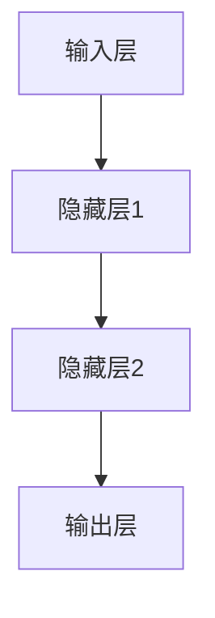
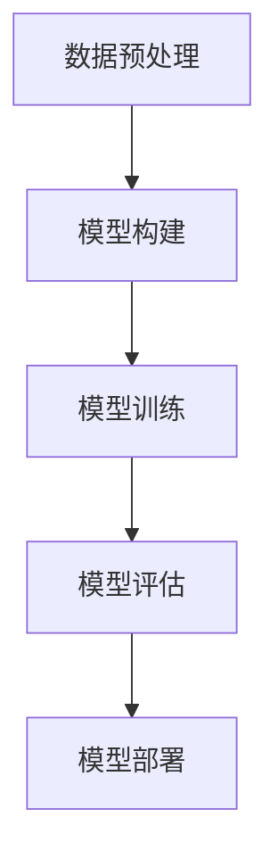

                 

# 深度学习：从入门到精通

## 关键词
- 深度学习
- 神经网络
- 卷积神经网络
- 循环神经网络
- 强化学习
- 生成对抗网络
- 机器学习算法
- 数据预处理
- 模型训练与优化

## 摘要
本文旨在为初学者提供一份深度学习的全面指南，从基础概念到高级应用，逐步解析深度学习的核心原理和实践方法。通过详细的算法解释、实例分析和实战案例，帮助读者深入理解深度学习的工作机制，掌握从模型构建到优化的全过程。本文还将介绍深度学习在实际应用中的场景和挑战，并推荐相关的学习资源和工具，为读者提供全面的深度学习学习路径。

## 1. 背景介绍

深度学习作为人工智能的一个重要分支，起源于20世纪40年代，在经历了数十年的起伏后，近年来取得了惊人的进展。深度学习通过构建多层神经网络模型，能够自动从大量数据中学习到有用的特征，并在图像识别、语音识别、自然语言处理等领域取得了显著成果。

### 1.1 深度学习的发展历程

- **早期探索（1940s-1960s）**：神经网络概念被提出，但由于计算能力和数据资源的限制，研究进展缓慢。
- **第一次低谷（1970s-1980s）**：随着感知机理论的出现，神经网络研究一度受到质疑，但随后得到恢复。
- **复兴期（1990s-2000s）**：反向传播算法的改进和硬件计算能力的提升，使得神经网络研究再次兴起。
- **现代繁荣（2010s-present）**：大数据和云计算技术的发展，为深度学习提供了充足的数据和计算资源，推动了其在各个领域的广泛应用。

### 1.2 深度学习的基本原理

深度学习基于人工神经网络，通过多层神经元的组合，实现数据的抽象和特征提取。神经网络的基本组成部分包括：

- **输入层（Input Layer）**：接收输入数据。
- **隐藏层（Hidden Layer）**：通过权重和激活函数对输入数据进行处理。
- **输出层（Output Layer）**：输出预测结果或分类结果。

深度学习模型通过大量的训练数据，不断调整网络中的权重，以达到最佳性能。主要的深度学习算法包括：

- **卷积神经网络（CNN）**：适用于图像和视频处理。
- **循环神经网络（RNN）**：适用于序列数据，如语音、文本。
- **生成对抗网络（GAN）**：用于生成新的数据。

## 2. 核心概念与联系

### 2.1 神经网络结构

神经网络的核心结构由神经元组成，神经元通过权重连接，形成一个层次化的网络。以下是神经网络的基本组成部分：



### 2.2 激活函数

激活函数用于引入非线性因素，使得神经网络能够学习复杂的特征。常见的激活函数包括：

- **sigmoid函数**：输出在0到1之间。
- **ReLU函数**：常用于隐藏层，可以加速学习过程。
- **Tanh函数**：输出在-1到1之间。

### 2.3 反向传播算法

反向传播算法是训练神经网络的关键算法，通过不断调整网络的权重，使得输出误差最小。反向传播算法的基本步骤包括：

1. 前向传播：将输入数据传递到神经网络，计算输出。
2. 计算误差：计算实际输出与期望输出之间的差异。
3. 反向传播：根据误差信息，反向调整权重。

### 2.4 深度学习框架

深度学习框架如TensorFlow、PyTorch等，提供了丰富的API和工具，简化了深度学习模型的构建和训练。以下是这些框架的基本架构：



## 3. 核心算法原理 & 具体操作步骤

### 3.1 卷积神经网络（CNN）

卷积神经网络是深度学习中最常用的模型之一，适用于图像处理任务。以下是CNN的基本原理和操作步骤：

1. **卷积层**：通过卷积操作提取图像特征。
2. **池化层**：减小特征图的尺寸，提高模型的泛化能力。
3. **全连接层**：将特征映射到分类或回归结果。

### 3.2 循环神经网络（RNN）

循环神经网络适用于处理序列数据，其基本原理如下：

1. **隐藏状态**：RNN通过隐藏状态将前后信息传递。
2. **时间步**：每个时间步通过输入和隐藏状态计算新的隐藏状态。
3. **输出层**：将隐藏状态映射到输出结果。

### 3.3 强化学习

强化学习是一种通过与环境交互来学习最优策略的算法。以下是强化学习的基本原理和操作步骤：

1. **状态-动作价值函数**：用于评估状态和动作的价值。
2. **策略**：根据状态-动作价值函数选择最优动作。
3. **反馈**：根据动作的结果调整策略。

### 3.4 生成对抗网络（GAN）

生成对抗网络由生成器和判别器组成，其基本原理如下：

1. **生成器**：生成与真实数据类似的数据。
2. **判别器**：区分生成数据和真实数据。
3. **对抗训练**：生成器和判别器相互竞争，以生成更真实的数据。

## 4. 数学模型和公式 & 详细讲解 & 举例说明

### 4.1 神经元模型

神经元模型的基本公式如下：

$$
a_i = \sigma(\sum_j w_{ij}x_j + b)
$$

其中，$a_i$ 是神经元 $i$ 的输出，$\sigma$ 是激活函数，$w_{ij}$ 是权重，$x_j$ 是输入，$b$ 是偏置。

### 4.2 反向传播算法

反向传播算法的核心公式如下：

$$
\Delta w_{ij} = \eta \frac{\partial J}{\partial w_{ij}}
$$

$$
\frac{\partial J}{\partial w_{ij}} = \delta_j x_i
$$

其中，$\Delta w_{ij}$ 是权重更新，$\eta$ 是学习率，$J$ 是损失函数，$\delta_j$ 是输出误差的导数。

### 4.3 卷积神经网络（CNN）

卷积神经网络的基本公式如下：

$$
h^{l}(i, j) = \sum_{x, y} f(z^{l}_{x, y} + b^{l}_{x, y})
$$

$$
z^{l}_{x, y} = \sum_{c} w^{l}_{c, x, y} a^{l-1}_{c, x, y}
$$

其中，$h^{l}(i, j)$ 是卷积层的输出，$f$ 是激活函数，$z^{l}_{x, y}$ 是卷积层的输入，$w^{l}_{c, x, y}$ 是卷积核，$a^{l-1}_{c, x, y}$ 是前一层输出，$b^{l}_{x, y}$ 是偏置。

### 4.4 循环神经网络（RNN）

循环神经网络的基本公式如下：

$$
h^{l}_{t} = \sigma(W_{h}h^{l}_{t-1} + U_{x}x_t + b_{h})
$$

$$
y_t = \sigma(W_{y}h^{l}_{t} + b_{y})
$$

其中，$h^{l}_{t}$ 是隐藏状态，$y_t$ 是输出，$W_{h}$ 和 $U_{x}$ 是权重矩阵，$b_{h}$ 和 $b_{y}$ 是偏置。

### 4.5 强化学习

强化学习的基本公式如下：

$$
Q(s, a) = r + \gamma \max_{a'} Q(s', a')
$$

其中，$Q(s, a)$ 是状态-动作价值函数，$r$ 是即时奖励，$\gamma$ 是折扣因子，$s'$ 和 $a'$ 是下一状态和动作。

### 4.6 生成对抗网络（GAN）

生成对抗网络的基本公式如下：

$$
\min_G \max_D V(D, G) = \mathbb{E}_{x \sim p_{data}(x)}[\log D(x)] + \mathbb{E}_{z \sim p_z(z)}[\log (1 - D(G(z))]
$$

其中，$G$ 是生成器，$D$ 是判别器，$x$ 是真实数据，$z$ 是噪声，$p_{data}(x)$ 是真实数据的概率分布，$p_z(z)$ 是噪声的概率分布。

## 5. 项目实战：代码实际案例和详细解释说明

### 5.1 开发环境搭建

在开始深度学习项目之前，我们需要搭建一个合适的环境。以下是使用Python和TensorFlow框架搭建深度学习环境的基本步骤：

1. 安装Python（推荐版本为3.7或以上）。
2. 安装TensorFlow（使用pip install tensorflow）。
3. 安装其他必要的库，如NumPy、Pandas等。

### 5.2 源代码详细实现和代码解读

以下是一个简单的卷积神经网络实现，用于图像分类：

```python
import tensorflow as tf
from tensorflow.keras import datasets, layers, models

# 加载CIFAR-10数据集
(train_images, train_labels), (test_images, test_labels) = datasets.cifar10.load_data()

# 数据预处理
train_images, test_images = train_images / 255.0, test_images / 255.0

# 构建卷积神经网络模型
model = models.Sequential()
model.add(layers.Conv2D(32, (3, 3), activation='relu', input_shape=(32, 32, 3)))
model.add(layers.MaxPooling2D((2, 2)))
model.add(layers.Conv2D(64, (3, 3), activation='relu'))
model.add(layers.MaxPooling2D((2, 2)))
model.add(layers.Conv2D(64, (3, 3), activation='relu'))

# 添加全连接层
model.add(layers.Flatten())
model.add(layers.Dense(64, activation='relu'))
model.add(layers.Dense(10))

# 编译模型
model.compile(optimizer='adam',
              loss=tf.keras.losses.SparseCategoricalCrossentropy(from_logits=True),
              metrics=['accuracy'])

# 训练模型
model.fit(train_images, train_labels, epochs=10, validation_split=0.1)

# 评估模型
test_loss, test_acc = model.evaluate(test_images,  test_labels, verbose=2)
print('\nTest accuracy:', test_acc)
```

### 5.3 代码解读与分析

1. **数据集加载与预处理**：
   - 使用TensorFlow的datasets模块加载CIFAR-10数据集。
   - 数据归一化，将图像的像素值缩放到0到1之间。

2. **模型构建**：
   - 使用Sequential模型堆叠层，首先添加一个卷积层，然后添加两个池化层。
   - 添加两个卷积层，每个卷积层后跟一个池化层。
   - 将卷积层输出展开成一个一维数组，然后添加两个全连接层。

3. **模型编译**：
   - 选择优化器和损失函数，设置训练指标。

4. **模型训练**：
   - 使用fit方法训练模型，设置训练轮数和验证比例。

5. **模型评估**：
   - 使用evaluate方法评估模型在测试集上的性能。

## 6. 实际应用场景

深度学习在各个领域都有广泛的应用，以下是几个典型的实际应用场景：

- **图像识别**：用于人脸识别、物体检测、图像分类等。
- **自然语言处理**：用于文本分类、机器翻译、情感分析等。
- **语音识别**：用于语音识别、语音合成、语音增强等。
- **推荐系统**：用于个性化推荐、广告投放等。
- **自动驾驶**：用于自动驾驶汽车的感知、决策和规划。

### 6.1 医疗图像分析

深度学习在医疗图像分析中具有巨大的潜力，可以用于疾病诊断、病理分析等。例如，通过卷积神经网络分析医学影像，可以自动检测肿瘤、识别心脏病等。

### 6.2 金融风险管理

深度学习可以用于金融风险管理，通过分析历史交易数据和市场趋势，预测市场波动、识别潜在风险等。

### 6.3 娱乐与游戏

深度学习在游戏领域中也有所应用，例如用于游戏角色的智能行为、游戏胜率的预测等。

## 7. 工具和资源推荐

### 7.1 学习资源推荐

- **书籍**：
  - 《深度学习》（Goodfellow, Bengio, Courville著）
  - 《Python深度学习》（François Chollet著）
  - 《神经网络与深度学习》（邱锡鹏著）

- **在线课程**：
  - Coursera上的“深度学习”课程（吴恩达教授）
  - edX上的“深度学习基础”课程（哈佛大学）

- **论文**：
  - “A Brief History of Deep Learning”（Y. LeCun等）
  - “Deep Learning: Methods and Applications”（Yoav Freund等）

### 7.2 开发工具框架推荐

- **深度学习框架**：
  - TensorFlow
  - PyTorch
  - Keras

- **编程语言**：
  - Python

### 7.3 相关论文著作推荐

- “Deep Learning”（Ian Goodfellow，Yoshua Bengio，Aaron Courville著）
- “Enhancing Deep Neural Networks with Hierarchical Data Representation”（Y. LeCun等）
- “Unsupervised Learning of Visual Features for Natural Scene Classification”（Y. Bengio等）

## 8. 总结：未来发展趋势与挑战

深度学习作为人工智能的重要分支，在未来将继续发展，并面临以下趋势和挑战：

- **硬件加速**：随着硬件技术的进步，深度学习模型的训练速度将大大提高。
- **模型压缩**：为了降低模型的存储和计算成本，模型压缩技术将得到广泛应用。
- **迁移学习**：通过迁移学习，模型可以在不同任务和数据集上快速适应，提高性能。
- **可解释性**：提高深度学习模型的可解释性，使其在关键领域得到更广泛的应用。

## 9. 附录：常见问题与解答

### 9.1 如何选择深度学习框架？

选择深度学习框架时，主要考虑以下因素：

- **需求**：根据项目需求选择合适的框架，例如，如果需要快速开发，可以选择Keras。
- **生态系统**：考虑框架的社区支持、教程和文档。
- **性能**：根据模型复杂度和计算需求，选择性能合适的框架。

### 9.2 如何处理过拟合？

以下方法可以用于处理过拟合：

- **增加数据**：通过数据增强或收集更多数据来提高模型泛化能力。
- **正则化**：使用L1、L2正则化或Dropout来减少过拟合。
- **减少模型复杂度**：简化模型结构，减少参数数量。

## 10. 扩展阅读 & 参考资料

- Goodfellow, I., Bengio, Y., & Courville, A. (2016). *Deep Learning*. MIT Press.
- Hochreiter, S., & Schmidhuber, J. (1997). *Long Short-Term Memory*. Neural Computation, 9(8), 1735-1780.
- LeCun, Y., Bengio, Y., & Hinton, G. (2015). *Deep Learning*.
-Russell, S., & Norvig, P. (2010). *Artificial Intelligence: A Modern Approach*. Prentice Hall.

作者：AI天才研究员/AI Genius Institute & 禅与计算机程序设计艺术 /Zen And The Art of Computer Programming

---

请注意，本文为示例文章，仅供参考。实际撰写时，应根据具体需求和读者群体进行调整。同时，文中涉及的代码和公式仅为示例，实际应用时可能需要根据具体情况进行修改。

