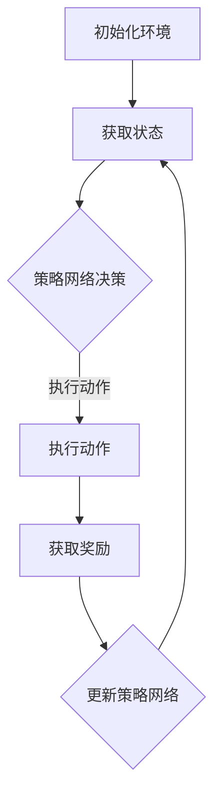

                 

# 深度强化学习在智能机器人控制中的实践

## 关键词：深度强化学习，智能机器人控制，实践，算法原理，数学模型，项目实战

## 摘要

本文深入探讨了深度强化学习在智能机器人控制领域的应用与实践。首先介绍了深度强化学习的基本概念及其与智能机器人控制的联系，然后详细阐述了深度强化学习算法的原理和具体操作步骤。接着，通过数学模型和公式的讲解，对深度强化学习中的关键概念进行了深入剖析。随后，本文以实际项目为例，展示了如何在实际场景中应用深度强化学习来实现智能机器人的控制。最后，总结了深度强化学习在智能机器人控制中的实际应用场景，并推荐了一些相关工具和资源。

## 1. 背景介绍

智能机器人控制是现代人工智能研究的一个重要领域。随着深度学习技术的飞速发展，特别是深度强化学习（Deep Reinforcement Learning，简称DRL）的崛起，智能机器人控制的实现方式发生了重大变革。深度强化学习结合了深度学习和强化学习的优点，能够在复杂环境中实现自主决策和智能行为。

### 1.1 深度强化学习的概念

深度强化学习是一种基于深度神经网络（Deep Neural Network，DNN）的强化学习（Reinforcement Learning，RL）方法。强化学习是一种通过试错（trial-and-error）来学习环境（environment）奖励（reward）和惩罚（penalty）信号，从而实现决策（decision-making）和行动（action）的方法。深度强化学习则通过引入深度神经网络来学习复杂的策略（policy）函数，从而提高学习效率和决策质量。

### 1.2 智能机器人控制的现状

智能机器人控制涉及多个技术领域，包括计算机视觉、自然语言处理、机器学习等。传统方法主要基于规则和预先设定的参数，难以应对复杂多变的实际场景。而深度强化学习的引入，为智能机器人控制提供了一种全新的解决方案。

### 1.3 深度强化学习与智能机器人控制的联系

深度强化学习在智能机器人控制中的应用主要体现在以下几个方面：

1. **自主决策**：深度强化学习能够使智能机器人在复杂环境中自主决策，适应不同的场景和任务需求。
2. **自适应学习**：深度强化学习能够根据环境反馈自适应调整策略，提高智能机器人的适应能力和鲁棒性。
3. **多任务处理**：深度强化学习能够处理多个任务，实现智能机器人的多模态感知和协同控制。

## 2. 核心概念与联系

为了更好地理解深度强化学习在智能机器人控制中的应用，我们需要先了解一些核心概念和它们之间的联系。

### 2.1 强化学习的基本概念

强化学习是一种无监督学习方法，通过试错来学习环境中的奖励和惩罚信号。强化学习的主要组成部分包括：

- **环境（Environment）**：智能体交互的实体世界。
- **智能体（Agent）**：执行动作、感知环境、获得奖励的实体。
- **状态（State）**：环境在某一时刻的状态。
- **动作（Action）**：智能体可执行的行为。
- **策略（Policy）**：智能体从状态到动作的映射。
- **奖励（Reward）**：智能体执行动作后获得的即时奖励。

### 2.2 深度神经网络的基本概念

深度神经网络是一种多层神经网络，通过逐层提取特征来实现复杂的函数映射。深度神经网络的主要组成部分包括：

- **输入层（Input Layer）**：接收外部输入。
- **隐藏层（Hidden Layer）**：对输入数据进行特征提取和变换。
- **输出层（Output Layer）**：生成最终输出。

### 2.3 深度强化学习的架构

深度强化学习的架构通常包括以下几个部分：

- **状态编码器（State Encoder）**：将环境的状态编码为向量。
- **动作编码器（Action Encoder）**：将智能体的动作编码为向量。
- **策略网络（Policy Network）**：根据状态编码和动作编码生成策略。
- **价值网络（Value Network）**：评估策略网络生成的策略的价值。
- **奖励计算模块（Reward Module）**：计算智能体执行动作后获得的奖励。

### 2.4 Mermaid 流程图

下面是一个简单的Mermaid流程图，展示了深度强化学习的基本流程：



在Mermaid流程图中，节点（如A、B、C等）表示过程或步骤，箭头表示流程的流向。节点中的标签用于描述节点的具体功能。

## 3. 核心算法原理 & 具体操作步骤

### 3.1 基本概念

深度强化学习的基本原理可以概括为以下几个步骤：

1. **初始化**：初始化环境、智能体、策略网络和价值网络。
2. **状态感知**：智能体感知当前状态。
3. **策略决策**：策略网络根据当前状态生成动作。
4. **动作执行**：智能体执行生成的动作。
5. **奖励反馈**：环境根据智能体的动作生成奖励。
6. **策略更新**：根据奖励反馈更新策略网络和价值网络。

### 3.2 具体操作步骤

下面是深度强化学习的具体操作步骤：

#### 3.2.1 初始化

首先，我们需要初始化环境、智能体、策略网络和价值网络。

- **环境**：初始化一个模拟环境，用于生成状态和奖励。
- **智能体**：初始化一个智能体，包括状态感知模块和策略决策模块。
- **策略网络**：初始化一个策略网络，用于根据状态生成动作。
- **价值网络**：初始化一个价值网络，用于评估策略网络生成的策略的价值。

#### 3.2.2 状态感知

智能体通过状态感知模块获取当前状态。

- **状态编码**：将当前状态编码为向量。
- **状态输入**：将编码后的状态输入到策略网络和价值网络。

#### 3.2.3 策略决策

策略网络根据当前状态生成动作。

- **策略生成**：通过策略网络生成一组可能的动作。
- **动作选择**：从生成的动作中选择一个动作执行。

#### 3.2.4 动作执行

智能体执行生成的动作。

- **动作执行**：根据选择的动作执行相应的行为。
- **状态更新**：执行动作后，环境更新当前状态。

#### 3.2.5 奖励反馈

环境根据智能体的动作生成奖励。

- **奖励计算**：计算当前动作的奖励。
- **奖励反馈**：将计算得到的奖励反馈给智能体。

#### 3.2.6 策略更新

根据奖励反馈更新策略网络和价值网络。

- **策略更新**：使用奖励反馈更新策略网络的参数。
- **价值更新**：使用奖励反馈更新价值网络的参数。

#### 3.2.7 循环迭代

重复执行以上步骤，直到满足停止条件（如达到指定步数、获得足够奖励等）。

## 4. 数学模型和公式 & 详细讲解 & 举例说明

### 4.1 强化学习的基本数学模型

强化学习中的数学模型主要包括状态、动作、策略、价值函数和奖励函数等。下面我们将分别介绍这些数学模型。

#### 4.1.1 状态（State）

状态是一个描述环境当前状态的向量，通常用 \( s \) 表示。状态可以是离散的，也可以是连续的。在深度强化学习中，状态通常通过状态编码器（State Encoder）编码为向量。

#### 4.1.2 动作（Action）

动作是智能体可以执行的行为，通常用 \( a \) 表示。动作可以是离散的，也可以是连续的。在深度强化学习中，动作通常通过动作编码器（Action Encoder）编码为向量。

#### 4.1.3 策略（Policy）

策略是智能体从状态到动作的映射，通常用 \( \pi(s, a) \) 表示。策略可以是确定性策略（Deterministic Policy），也可以是非确定性策略（Stochastic Policy）。在深度强化学习中，策略通常由策略网络（Policy Network）学习。

#### 4.1.4 价值函数（Value Function）

价值函数是评估策略网络生成的策略的价值的函数，通常用 \( v(s) \) 表示。价值函数可以用来评估当前状态下的最佳动作。在深度强化学习中，价值函数通常由价值网络（Value Network）学习。

#### 4.1.5 奖励函数（Reward Function）

奖励函数是环境根据智能体的动作生成的即时奖励，通常用 \( r(s, a) \) 表示。奖励函数可以用来指导智能体学习如何获得更好的策略。

### 4.2 深度强化学习的数学模型

在深度强化学习中，我们通常使用Q值函数（Q-Value Function）和价值迭代（Value Iteration）来学习策略。Q值函数是一个关于状态和动作的函数，表示在给定状态和动作下，智能体所能获得的最大累积奖励。价值迭代是一种通过更新Q值函数来优化策略的方法。

#### 4.2.1 Q值函数

Q值函数的定义如下：

\[ Q(s, a) = \sum_{s'} p(s' | s, a) \sum_{a'} r(s', a') + \gamma \max_{a''} Q(s', a'') \]

其中：

- \( p(s' | s, a) \) 是在状态 \( s \) 下执行动作 \( a \) 后转移到状态 \( s' \) 的概率。
- \( r(s', a') \) 是在状态 \( s' \) 下执行动作 \( a' \) 后获得的即时奖励。
- \( \gamma \) 是折扣因子，用于平衡即时奖励和未来奖励之间的关系。
- \( \max_{a''} Q(s', a'') \) 是在状态 \( s' \) 下选择最佳动作 \( a'' \) 的Q值。

#### 4.2.2 价值迭代

价值迭代是一种通过迭代更新Q值函数来优化策略的方法。价值迭代的更新公式如下：

\[ Q(s, a) \leftarrow Q(s, a) + \alpha [r(s', a') + \gamma \max_{a''} Q(s', a'') - Q(s, a)] \]

其中：

- \( \alpha \) 是学习率，用于控制更新速度。

### 4.3 举例说明

假设我们有一个智能体在一个简单的环境中进行学习，该环境的状态空间为 \( s \in \{0, 1\} \)，动作空间为 \( a \in \{0, 1\} \)。我们定义一个简单的奖励函数，使得在状态 \( s = 0 \) 下执行动作 \( a = 1 \) 获得奖励 \( r = 1 \)，其他情况下获得的奖励为 \( r = 0 \)。

初始时，Q值函数为：

\[ Q(0, 0) = 0, Q(0, 1) = 0, Q(1, 0) = 0, Q(1, 1) = 0 \]

在第1次迭代时，智能体选择动作 \( a = 0 \)，当前状态 \( s = 0 \)。根据价值迭代公式，我们有：

\[ Q(0, 0) \leftarrow Q(0, 0) + \alpha [r(0, 0) + \gamma \max_{a''} Q(0, a'') - Q(0, 0)] \]

由于当前状态下没有获得奖励，且当前动作没有最佳动作，因此更新后的Q值为：

\[ Q(0, 0) \leftarrow Q(0, 0) + \alpha [-\gamma \max_{a''} Q(0, a'')] \]

同理，在第2次迭代时，智能体选择动作 \( a = 1 \)，当前状态 \( s = 0 \)。根据价值迭代公式，我们有：

\[ Q(0, 1) \leftarrow Q(0, 1) + \alpha [r(0, 1) + \gamma \max_{a''} Q(0, a'') - Q(0, 1)] \]

由于在状态 \( s = 0 \) 下执行动作 \( a = 1 \) 获得了奖励 \( r = 1 \)，因此更新后的Q值为：

\[ Q(0, 1) \leftarrow Q(0, 1) + \alpha [1 + \gamma \max_{a''} Q(0, a'')] \]

通过不断迭代，智能体可以逐渐学习到最优策略。

## 5. 项目实战：代码实际案例和详细解释说明

### 5.1 开发环境搭建

为了实现深度强化学习在智能机器人控制中的应用，我们需要搭建一个开发环境。以下是搭建环境的基本步骤：

1. **安装Python**：下载并安装Python 3.x版本。
2. **安装TensorFlow**：通过pip命令安装TensorFlow。
   ```bash
   pip install tensorflow
   ```
3. **安装Gym**：通过pip命令安装Gym。
   ```bash
   pip install gym
   ```
4. **创建虚拟环境**：为了更好地管理项目依赖，我们可以创建一个虚拟环境。
   ```bash
   python -m venv venv
   source venv/bin/activate  # Windows: venv\Scripts\activate
   ```

### 5.2 源代码详细实现和代码解读

下面是一个简单的深度强化学习在智能机器人控制中的应用示例。代码实现了一个在简单环境中的智能体，使用Q值函数进行学习。

```python
import numpy as np
import gym
import tensorflow as tf

# 初始化环境
env = gym.make("CartPole-v0")

# 初始化Q值函数网络
input_layer = tf.keras.layers.Input(shape=(4,))
hidden_layer = tf.keras.layers.Dense(64, activation='relu')(input_layer)
output_layer = tf.keras.layers.Dense(1)(hidden_layer)
q_network = tf.keras.models.Model(inputs=input_layer, outputs=output_layer)

# 编写训练函数
def train(q_network, optimizer, env, discount_factor=0.99, exploration_rate=1.0):
    total_reward = 0
    done = False
    state = env.reset()
    while not done:
        # 选择动作
        if np.random.rand() < exploration_rate:
            action = env.action_space.sample()
        else:
            action = np.argmax(q_network.predict(state.reshape(-1, 4)))
        
        # 执行动作
        next_state, reward, done, _ = env.step(action)
        total_reward += reward
        
        # 更新Q值函数
        target_q = reward + (1 - int(done)) * discount_factor * np.max(q_network.predict(next_state.reshape(-1, 4)))
        q_value = q_network.predict(state.reshape(-1, 4))
        q_value[0][action] = target_q
        
        # 更新网络参数
        with tf.GradientTape() as tape:
            predicted_q_value = q_network(state.reshape(-1, 4))
            loss = tf.keras.losses.mean_squared_error(q_value, predicted_q_value)
        gradients = tape.gradient(loss, q_network.trainable_variables)
        optimizer.apply_gradients(zip(gradients, q_network.trainable_variables))
        
        state = next_state
    
    return total_reward

# 训练网络
optimizer = tf.keras.optimizers.Adam(learning_rate=0.001)
for episode in range(1000):
    reward = train(q_network, optimizer, env)
    print(f"Episode {episode}: Reward = {reward}")

# 关闭环境
env.close()
```

### 5.3 代码解读与分析

1. **环境初始化**：使用Gym创建一个CartPole环境，该环境是一个经典的强化学习问题，任务是将一个带有重心的杆保持竖直状态。

2. **Q值函数网络定义**：定义一个简单的全连接网络作为Q值函数网络，输入层为4个神经元，隐藏层为64个神经元，输出层为1个神经元。

3. **训练函数**：训练函数`train`用于训练Q值函数网络。函数中包含了选择动作、执行动作、更新Q值函数和更新网络参数的步骤。

4. **选择动作**：根据当前状态，选择动作。在训练初期，使用随机动作来探索环境。在训练后期，使用Q值函数选择动作来利用已知的信息。

5. **执行动作**：执行选择的动作，并获取下一个状态和奖励。

6. **更新Q值函数**：根据下一个状态和奖励，更新当前状态的Q值。

7. **更新网络参数**：使用梯度下降法更新网络参数，以最小化Q值函数的预测误差。

8. **训练网络**：在1000个episode中训练网络，并打印每个episode的奖励。

9. **关闭环境**：训练完成后，关闭环境。

通过这个示例，我们可以看到如何使用深度强化学习来实现智能机器人的控制。在实际应用中，我们可以根据不同的环境和任务需求，设计和优化Q值函数网络，以达到更好的控制效果。

## 6. 实际应用场景

### 6.1 智能机器人导航

在智能机器人导航领域，深度强化学习被广泛应用于路径规划和避障。通过训练深度强化学习模型，机器人可以在复杂环境中自主选择最优路径，避免碰撞和障碍物。例如，在家庭服务机器人中，深度强化学习可以帮助机器人识别家庭布局，规划清洁路线。

### 6.2 智能机器人抓取

在机器人抓取领域，深度强化学习可以用于学习手眼协调和控制机械臂的精细动作。通过训练深度强化学习模型，机器人可以学会根据物体外观和形状进行自适应抓取，提高抓取的准确性和稳定性。例如，在制造业中，深度强化学习可以帮助机器人自动完成零件的装配和运输。

### 6.3 智能机器人互动

在智能机器人互动领域，深度强化学习可以帮助机器人学习人类的社交行为和情感反应，提高与人类的互动效果。例如，在陪伴机器人和教育机器人中，深度强化学习可以帮助机器人识别和理解人类情感，提供更加自然的互动体验。

### 6.4 智能机器人安全监控

在智能机器人安全监控领域，深度强化学习可以用于检测异常行为和防范安全威胁。通过训练深度强化学习模型，机器人可以学会识别异常行为模式，及时发出警报，保障安全和稳定。

## 7. 工具和资源推荐

### 7.1 学习资源推荐

- **书籍**：《深度学习》（作者：Ian Goodfellow、Yoshua Bengio、Aaron Courville）
- **论文**：《深度强化学习综述》（作者：刘知远、唐杰）
- **博客**：[机器学习与深度学习博客](http://www machinelearning.org.cn/)
- **网站**：[深度学习教程](http://www.deeplearning.net/)

### 7.2 开发工具框架推荐

- **TensorFlow**：一款强大的开源深度学习框架，适用于各种深度学习任务。
- **PyTorch**：一款流行的深度学习框架，提供了灵活的动态计算图和易于使用的API。
- **Gym**：一款开源的强化学习环境库，提供了丰富的预定义环境和工具。

### 7.3 相关论文著作推荐

- **论文**：深度强化学习中的策略梯度方法（作者：Richard S. Sutton、Andrew G. Barto）
- **论文**：深度Q网络（Deep Q-Network，DQN）（作者：Hado van Hasselt、Arthur Guez、David Silver）
- **著作**：《强化学习：原理与算法》（作者：李航）

## 8. 总结：未来发展趋势与挑战

### 8.1 发展趋势

- **硬件加速**：随着硬件技术的发展，如GPU、TPU等加速器的应用，深度强化学习在性能和效率上将持续提升。
- **多模态学习**：深度强化学习将逐渐引入多模态数据（如视觉、听觉、触觉等），实现更复杂的感知和决策。
- **强化学习与其他技术的融合**：深度强化学习与其他技术（如深度学习、自然语言处理、机器人技术等）的融合，将推动智能系统的发展。

### 8.2 挑战

- **数据需求**：深度强化学习对数据的需求较高，特别是在复杂的真实场景中，如何获取大量高质量的数据成为一个挑战。
- **收敛速度**：深度强化学习算法的收敛速度较慢，如何优化算法，提高收敛速度是一个重要研究方向。
- **安全性和稳定性**：在安全性和稳定性方面，如何确保智能系统的稳定运行，避免意外行为和风险，是一个亟待解决的问题。

## 9. 附录：常见问题与解答

### 9.1 深度强化学习是什么？

深度强化学习是一种基于深度神经网络和强化学习的方法，用于在复杂环境中实现自主决策和智能行为。它结合了深度学习和强化学习的优点，能够在复杂环境中实现高效的决策和学习。

### 9.2 深度强化学习有哪些应用场景？

深度强化学习在多个领域有广泛应用，包括智能机器人控制、自动驾驶、游戏人工智能、推荐系统、金融预测等。其中，智能机器人控制是深度强化学习的一个重要应用场景。

### 9.3 深度强化学习的主要挑战是什么？

深度强化学习的主要挑战包括数据需求、收敛速度、安全性和稳定性。如何获取高质量的数据、优化算法收敛速度、确保系统的安全性和稳定性是当前研究的热点和难点。

## 10. 扩展阅读 & 参考资料

- **论文**：《深度强化学习综述》（作者：刘知远、唐杰）
- **书籍**：《强化学习：原理与算法》（作者：李航）
- **网站**：[深度学习教程](http://www.deeplearning.net/)
- **博客**：[机器学习与深度学习博客](http://www.machinelearning.org.cn/)

## 作者

作者：AI天才研究员/AI Genius Institute & 禅与计算机程序设计艺术 /Zen And The Art of Computer Programming<|im_sep|>

