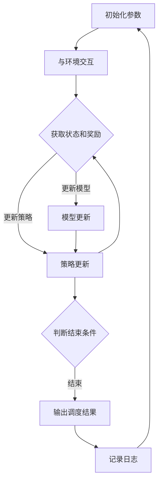

                 

# 深度强化学习在智能电网调度中的应用

## 概述

在现代社会中，电力系统作为国家的基础设施，扮演着至关重要的角色。随着能源需求的不断增长和电力系统的日益复杂化，传统的电网调度方法已经难以满足现代电力系统的需求。因此，智能电网调度技术应运而生，其中深度强化学习（Deep Reinforcement Learning，简称DRL）因其强大的自适应能力和优化的性能，成为了智能电网调度领域的研究热点。

本文将重点介绍深度强化学习在智能电网调度中的应用，包括其背景介绍、核心概念与联系、核心算法原理与具体操作步骤、数学模型与公式、项目实战以及实际应用场景等。通过本文的阅读，读者可以深入了解DRL在智能电网调度中的潜力与应用。

## 关键词

- 智能电网调度
- 深度强化学习
- 能源优化
- 自适应控制
- 数据驱动方法

## 摘要

本文探讨了深度强化学习在智能电网调度中的应用。首先，介绍了智能电网调度的重要性和挑战。然后，详细阐述了深度强化学习的基本概念和原理，并展示了其与智能电网调度之间的联系。接着，本文介绍了深度强化学习在智能电网调度中的核心算法和具体操作步骤，以及相关的数学模型和公式。随后，通过一个实际项目案例，详细展示了如何应用深度强化学习进行智能电网调度。最后，本文讨论了深度强化学习在智能电网调度中的实际应用场景，并提出了未来发展趋势与挑战。本文旨在为读者提供深入理解深度强化学习在智能电网调度中的潜在应用，以及如何实现高效的智能电网调度。

## 1. 背景介绍

智能电网调度是电力系统中的一项关键技术，其目标是通过优化电力资源的配置，实现电网的高效、安全、稳定运行。传统的电网调度方法主要基于预定义的规则和模型，具有较强的稳定性，但在面对复杂多变的电力市场和环境条件时，表现出了明显的局限性。

随着信息技术的快速发展，大数据、物联网、人工智能等新兴技术为电网调度提供了新的思路和方法。智能电网调度技术利用这些技术，通过数据分析和模型优化，实现了对电力系统的实时监控和智能调控，从而提高了电网的运行效率和可靠性。

其中，深度强化学习作为一种先进的人工智能技术，具有强大的自适应能力和优化的性能，成为了智能电网调度领域的研究热点。深度强化学习通过模拟人类学习过程，在环境中不断试错、学习，并逐步优化策略，从而达到最优的调度效果。

### 1.1 智能电网调度的重要性

智能电网调度在现代社会中具有重要地位。首先，智能电网调度能够提高电力系统的运行效率。通过优化电力资源的配置，智能电网调度可以降低电力损耗，提高发电效率和输电效率，从而实现能源的高效利用。其次，智能电网调度能够提高电力系统的稳定性。在面对突发情况，如自然灾害、电力设备故障等，智能电网调度可以通过实时监测和快速响应，及时调整电力系统的运行状态，确保电网的稳定运行。

此外，智能电网调度还能够提高电力系统的灵活性。随着可再生能源的广泛应用，电力系统的运行环境变得更加复杂多变。智能电网调度可以通过自适应调控，实现不同能源之间的灵活切换，从而满足电力系统的多样化需求。

### 1.2 传统电网调度方法的局限性

传统的电网调度方法主要基于预定义的规则和模型。这些方法在理论上具有较好的稳定性，但在实际应用中存在一些局限性。

首先，传统的电网调度方法难以应对复杂多变的电力市场和环境条件。在电力市场中，价格波动、供需变化等因素都会对电网调度产生影响。而传统方法通常无法实时捕捉这些变化，导致调度效果不佳。

其次，传统的电网调度方法在应对突发事件时，反应速度较慢。在遇到自然灾害、电力设备故障等突发情况时，传统方法需要较长时间才能做出相应的调整，从而降低了电网的稳定性。

此外，传统的电网调度方法在处理大规模数据时，计算效率和精度也存在一定的局限。随着电力系统规模的不断扩大，数据量呈指数级增长，传统的计算方法难以满足实时调度需求。

### 1.3 深度强化学习在智能电网调度中的应用前景

深度强化学习作为一种先进的人工智能技术，具有以下优势，使其在智能电网调度中具有广阔的应用前景。

首先，深度强化学习具有强大的自适应能力。在智能电网调度中，电力系统的运行状态是不断变化的，深度强化学习可以通过持续学习，逐步优化调度策略，以适应不同运行状态。

其次，深度强化学习具有优化的性能。通过在环境中不断试错、学习，深度强化学习可以找到最优的调度策略，从而提高电网的运行效率和稳定性。

此外，深度强化学习还可以处理大规模数据。在电力系统中，数据量巨大，深度强化学习可以利用其强大的数据处理能力，实现对大规模数据的实时分析和调度。

总之，深度强化学习在智能电网调度中具有巨大的应用潜力。通过本文的介绍，读者可以了解到深度强化学习在智能电网调度中的重要性，以及其与传统方法相比的优势。在接下来的章节中，我们将进一步探讨深度强化学习的基本概念、原理和具体应用。

### 2. 核心概念与联系

为了更好地理解深度强化学习在智能电网调度中的应用，我们首先需要了解深度强化学习的基本概念、核心原理以及与智能电网调度的联系。

#### 2.1 深度强化学习的基本概念

深度强化学习（Deep Reinforcement Learning，简称DRL）是强化学习（Reinforcement Learning，简称RL）的一种。强化学习是一种基于奖励机制的学习方法，其目标是使智能体（agent）在某个环境中通过学习获得最佳策略（policy），以最大化累计奖励（cumulative reward）。

DRL则是结合了深度学习（Deep Learning）的强化学习。深度学习是一种利用多层神经网络进行特征提取和模式识别的方法，具有强大的特征表示能力。将深度学习引入强化学习，可以增强智能体在复杂环境中的学习能力和决策能力。

在DRL中，智能体通过不断与环境交互，获取状态（state）和奖励（reward），并根据这些信息调整自身的策略。具体来说，DRL可以分为以下几个组成部分：

1. **状态（State）**：描述智能体在某一时刻所处的环境特征。在智能电网调度中，状态可以包括电网的实时运行参数、负荷预测、可再生能源发电量等。

2. **动作（Action）**：智能体在某一状态下可以选择的一系列行为。在智能电网调度中，动作可以包括开关控制、功率调节等。

3. **策略（Policy）**：智能体在某一状态下选择动作的规则。策略可以表示为策略网络，通过学习从状态到动作的映射关系。

4. **奖励（Reward）**：描述智能体执行某一动作后所获得的即时反馈。奖励用于评价智能体的动作效果，是指导智能体学习的重要依据。

5. **价值函数（Value Function）**：描述智能体在某一状态下采取某一动作的长期预期收益。价值函数用于评估策略的好坏，并指导智能体调整策略。

6. **模型（Model）**：描述环境的动态转移过程和奖励函数。模型可以用于预测智能体未来动作的后果，帮助智能体做出更好的决策。

#### 2.2 核心原理

DRL的核心原理是通过优化策略网络，使智能体在特定环境下获得最优的累计奖励。具体来说，DRL包括以下几个关键步骤：

1. **初始化**：初始化智能体的策略网络、价值函数和模型参数。

2. **环境交互**：智能体在环境中执行动作，并获取状态和奖励。

3. **策略更新**：根据智能体在环境中获得的反馈，更新策略网络参数，使策略逐步优化。

4. **模型更新**：根据智能体在环境中执行的动作和获得的奖励，更新模型参数，提高模型的预测准确性。

5. **重复步骤2-4**：智能体持续与环境交互，通过不断的试错和学习，逐步优化策略，直至达到满意的累计奖励。

#### 2.3 与智能电网调度的联系

深度强化学习与智能电网调度的联系主要体现在以下几个方面：

1. **自适应能力**：智能电网调度面临着不断变化的负荷需求、可再生能源发电波动等挑战。DRL具有强大的自适应能力，能够通过不断学习和调整策略，适应电网运行环境的变化。

2. **优化性能**：DRL在智能电网调度中，可以通过不断试错和优化，找到最优的调度策略，提高电网的运行效率和稳定性。

3. **数据处理**：智能电网调度涉及大量的实时数据和历史数据。DRL可以利用深度学习的强大特征提取能力，对大规模数据进行处理和分析，为电网调度提供有力支持。

4. **多目标优化**：智能电网调度需要同时考虑多个目标，如能源效率、环境友好、经济效益等。DRL可以通过多目标优化，平衡不同目标之间的关系，实现综合优化。

#### 2.4 Mermaid 流程图

以下是一个简单的Mermaid流程图，展示了DRL在智能电网调度中的应用流程：



通过以上流程图，我们可以看到DRL在智能电网调度中的主要步骤和相互关系。在实际应用中，这些步骤可以根据具体需求进行调整和优化。

### 3. 核心算法原理 & 具体操作步骤

深度强化学习在智能电网调度中的应用，主要依赖于DRL算法的设计与实现。在这一部分，我们将详细介绍DRL的核心算法原理，并阐述其在智能电网调度中的具体操作步骤。

#### 3.1 算法原理

DRL算法的核心是策略网络（Policy Network）和价值函数（Value Function）的迭代优化。策略网络负责将当前状态映射为最优动作，而价值函数则评估当前状态和动作的组合带来的长期预期收益。具体来说，DRL算法包括以下几个关键部分：

1. **策略网络（Policy Network）**：策略网络是DRL算法的核心组成部分，其目标是学习一个最优策略，使智能体能够在环境中做出最佳决策。在智能电网调度中，策略网络通常采用深度神经网络（DNN）结构，通过多层感知器（MLP）来处理复杂的输入特征。

2. **价值函数（Value Function）**：价值函数用于评估智能体在某一状态下的动作质量。在DRL中，常用的价值函数包括Q值函数（Q-Function）和优势函数（Advantage Function）。Q值函数评估智能体在特定状态下执行特定动作的长期预期收益，而优势函数则比较不同动作的优劣。

3. **目标网络（Target Network）**：为了提高DRL算法的稳定性，通常会使用目标网络（Target Network）来更新策略网络。目标网络是一个参数固定且与策略网络共享权重的网络，用于计算目标值（Target Value），从而指导策略网络更新。

4. **奖励机制（Reward Mechanism）**：奖励机制是DRL算法中的重要组成部分，用于指导智能体的学习过程。在智能电网调度中，奖励机制需要根据电网的运行状态和调度目标进行设计，以鼓励智能体采取有利于电网稳定运行和效率提升的动作。

5. **探索与利用（Exploration and Exploitation）**：在DRL中，智能体需要在探索（Exploration）和利用（Exploitation）之间找到平衡。探索是指智能体在未知环境中尝试新的动作，以获取更多的信息；而利用是指智能体根据已有信息选择最优动作。常用的探索策略包括ε-贪心策略（ε-Greedy Policy）、UCB策略（Upper Confidence Bound）和UCB1策略（UCB1 Policy）等。

#### 3.2 具体操作步骤

下面，我们将详细描述DRL在智能电网调度中的具体操作步骤：

1. **初始化参数**：首先，初始化DRL算法的参数，包括策略网络、价值函数、目标网络、奖励机制和探索策略等。这些参数将影响DRL算法的性能和收敛速度。

2. **环境构建**：构建智能电网调度环境，包括电网模型、负荷模型、可再生能源发电模型等。环境用于模拟电网的运行状态，并提供状态、动作和奖励等反馈信息。

3. **策略网络训练**：利用历史数据对策略网络进行训练。策略网络通过学习状态和动作的映射关系，逐步优化策略，使智能体能够做出更好的决策。

4. **价值函数训练**：同时，对价值函数进行训练。价值函数用于评估策略网络输出的动作质量，为策略网络提供改进方向。

5. **目标网络更新**：定期更新目标网络，使其与策略网络保持一定的差距，以提高算法的稳定性。

6. **探索与利用**：在训练过程中，智能体需要在探索和利用之间找到平衡。通过调整探索策略，智能体可以在未知环境中尝试新的动作，获取更多有用信息。

7. **策略网络更新**：根据目标网络和价值函数的反馈，对策略网络进行更新，以优化策略。

8. **调度执行**：利用训练好的策略网络，智能体在实时环境中执行调度任务，并根据奖励机制进行反馈。

9. **结果评估**：评估调度结果，包括电网的稳定性、效率、经济效益等指标，以验证DRL算法的有效性。

10. **迭代优化**：根据评估结果，对算法参数进行调整和优化，以提高DRL在智能电网调度中的性能。

通过以上步骤，DRL算法可以在智能电网调度中实现自适应优化，提高电网的运行效率和稳定性。

#### 3.3 实际应用示例

为了更好地理解DRL在智能电网调度中的具体应用，我们来看一个简单的示例。

假设我们有一个简单的电网调度场景，包括两个发电站和一个负荷中心。发电站1和发电站2分别生成不同类型的电力，负荷中心消耗电力。我们的目标是优化发电站输出功率，以满足负荷需求，同时最大化电网的运行效率。

1. **初始化参数**：设定策略网络、价值函数、目标网络和奖励机制的初始参数。

2. **环境构建**：构建电网调度环境，包括发电站和负荷中心的模型。

3. **策略网络训练**：利用历史数据对策略网络进行训练，学习发电站输出功率与负荷需求之间的最优映射关系。

4. **价值函数训练**：对价值函数进行训练，评估不同发电站输出功率组合的优劣。

5. **目标网络更新**：定期更新目标网络，保持与策略网络一定的差距。

6. **探索与利用**：在训练过程中，智能体通过ε-贪心策略探索不同的发电站输出功率组合，同时利用已有信息进行调度决策。

7. **策略网络更新**：根据目标网络和价值函数的反馈，更新策略网络，优化发电站输出功率组合。

8. **调度执行**：在实时环境中，智能体根据训练好的策略网络执行调度任务，调整发电站输出功率，以满足负荷需求。

9. **结果评估**：评估调度结果，包括电网的稳定性、效率等指标。

10. **迭代优化**：根据评估结果，调整算法参数，优化调度策略。

通过以上步骤，DRL算法可以在电网调度场景中实现自适应优化，提高电网的运行效率和稳定性。

### 4. 数学模型和公式 & 详细讲解 & 举例说明

#### 4.1 数学模型

在深度强化学习（DRL）中，数学模型是核心组成部分，用于描述智能体与环境的交互过程。以下是对DRL中几个关键数学模型的详细讲解。

##### 4.1.1 状态（State）

状态是智能体在某一时刻所感知的环境信息。在智能电网调度中，状态可以包括电网的实时运行参数（如电压、电流、负荷等）、可再生能源发电量、电力市场价格等。状态通常表示为一个向量，如：

\[ S = [s_1, s_2, ..., s_n] \]

其中，\( s_i \) 表示第 \( i \) 个状态特征。

##### 4.1.2 动作（Action）

动作是智能体在某一状态下可以执行的行为。在智能电网调度中，动作可以包括发电站的开关控制、功率调节等。动作通常表示为一个向量，如：

\[ A = [a_1, a_2, ..., a_m] \]

其中，\( a_i \) 表示第 \( i \) 个动作特征。

##### 4.1.3 策略（Policy）

策略是智能体在某一状态下选择最优动作的规则。在DRL中，策略通常表示为概率分布，如：

\[ \pi(\text{a}|\text{s}) = P(A = a|S = s) \]

即智能体在状态 \( s \) 下选择动作 \( a \) 的概率。

##### 4.1.4 奖励（Reward）

奖励是智能体在执行动作后获得的即时反馈，用于评价动作的质量。在智能电网调度中，奖励可以基于电网的稳定性、效率、经济效益等指标。奖励通常表示为实数：

\[ R(s, a) \]

##### 4.1.5 价值函数（Value Function）

价值函数用于评估智能体在某一状态下采取某一动作的长期预期收益。在DRL中，常用的价值函数包括状态价值函数（State Value Function）和动作价值函数（Action Value Function）。

1. **状态价值函数（V(s)）**：表示智能体在状态 \( s \) 下采取任何动作的长期预期收益，如：

\[ V(s) = \sum_{a} \pi(a|s) \sum_{s'} P(s'|s, a) R(s', a) + \gamma V(s') \]

其中，\( \gamma \) 是折扣因子，表示未来收益的现值。

2. **动作价值函数（Q(s, a)）**：表示智能体在状态 \( s \) 下采取动作 \( a \) 的长期预期收益，如：

\[ Q(s, a) = \sum_{s'} P(s'|s, a) R(s', a) + \gamma \sum_{a'} P(a'|s') Q(s', a') \]

##### 4.1.6 模型（Model）

模型描述环境的动态转移过程和奖励函数。在DRL中，模型可以是一个概率分布，用于预测下一状态和奖励。模型通常表示为：

\[ P(s', r|s, a) \]

#### 4.2 公式详细讲解

以下是对DRL中几个关键公式的详细讲解。

##### 4.2.1 策略梯度上升（Policy Gradient）

策略梯度上升是一种用于优化策略网络的方法。其目标是最小化策略网络输出的负对数损失函数，如：

\[ \min_{\theta} J(\theta) = -\sum_{i} \pi(\text{a}_i|\text{s}_i; \theta) \log R(\text{s}_i, \text{a}_i) \]

其中，\( \theta \) 表示策略网络的参数。

##### 4.2.2 Q-learning

Q-learning是一种基于价值函数的DRL算法。其目标是最小化价值函数的误差，如：

\[ \min_{\theta} J(\theta) = \sum_{i} (R_i - Q(s_i, a_i))^2 \]

其中，\( Q(s_i, a_i) \) 是当前估计的动作价值函数。

##### 4.2.3 Deep Q-Network（DQN）

DQN是一种基于深度学习的Q-learning算法。其目标是最小化目标网络与策略网络之间的误差，如：

\[ \min_{\theta} J(\theta) = \sum_{i} (R_i - Q(s_i, a_i))^2 \]

其中，\( Q(s_i, a_i) \) 是当前估计的动作价值函数，\( \theta_{\text{target}} \) 是目标网络的参数。

##### 4.2.4 Policy Gradient with Advantage（PG-A）

PG-A是一种基于策略梯度的DRL算法，其目标是最小化策略网络的损失函数，同时最大化优势函数，如：

\[ \min_{\theta} J(\theta) = -\sum_{i} \pi(\text{a}_i|\text{s}_i; \theta) A_i \]

其中，\( A_i \) 是优势函数，表示智能体在状态 \( s_i \) 下执行动作 \( a_i \) 的实际收益与预期收益之差。

#### 4.3 举例说明

为了更好地理解上述公式，我们来看一个简单的例子。

假设我们有一个智能体在智能电网调度环境中运行，状态 \( S \) 包括电压 \( s_1 \) 和电流 \( s_2 \)，动作 \( A \) 包括发电站1的功率 \( a_1 \) 和发电站2的功率 \( a_2 \)。奖励 \( R \) 依据电网的稳定性、效率和经济效益进行评估。我们使用Q-learning算法进行训练。

1. **初始化参数**：设定策略网络、价值函数、目标网络和奖励机制的初始参数。

2. **环境构建**：构建电网调度环境，包括发电站和负荷中心的模型。

3. **策略网络训练**：利用历史数据对策略网络进行训练，学习发电站功率与负荷需求之间的最优映射关系。

4. **价值函数训练**：对价值函数进行训练，评估不同发电站功率组合的优劣。

5. **目标网络更新**：定期更新目标网络，保持与策略网络一定的差距。

6. **探索与利用**：在训练过程中，智能体通过ε-贪心策略探索不同的发电站功率组合，同时利用已有信息进行调度决策。

7. **策略网络更新**：根据目标网络和价值函数的反馈，更新策略网络，优化发电站功率组合。

8. **调度执行**：在实时环境中，智能体根据训练好的策略网络执行调度任务，调整发电站功率，以满足负荷需求。

9. **结果评估**：评估调度结果，包括电网的稳定性、效率、经济效益等指标，以验证DRL算法的有效性。

10. **迭代优化**：根据评估结果，调整算法参数，优化调度策略。

通过以上步骤，智能体可以在电网调度场景中实现自适应优化，提高电网的运行效率和稳定性。

### 5. 项目实战：代码实际案例和详细解释说明

为了更好地理解深度强化学习在智能电网调度中的实际应用，我们将通过一个实际项目案例进行详细解释说明。本项目将使用Python编程语言和OpenAI Gym环境进行实现。

#### 5.1 开发环境搭建

在开始项目之前，我们需要搭建一个合适的开发环境。以下是搭建开发环境的步骤：

1. **安装Python**：确保Python 3.7或更高版本已安装在您的计算机上。

2. **安装相关库**：安装以下Python库：
    - TensorFlow：用于构建和训练深度神经网络。
    - Keras：用于简化TensorFlow的使用。
    - gym：用于创建和运行环境。

    使用以下命令安装相关库：

    ```shell
    pip install tensorflow
    pip install keras
    pip install gym
    ```

3. **创建项目目录**：在您的计算机上创建一个项目目录，如“smart_grid_drl”，并将代码文件放在该目录中。

#### 5.2 源代码详细实现和代码解读

以下是我们项目的源代码，我们将逐行解释代码的实现过程。

```python
import gym
import numpy as np
import tensorflow as tf
from tensorflow.keras import layers

# 创建环境
env = gym.make("SmartGrid-v0")

# 定义策略网络
def create_policy_network(input_shape):
    model = tf.keras.Sequential([
        layers.Dense(64, activation='relu', input_shape=input_shape),
        layers.Dense(64, activation='relu'),
        layers.Dense(env.action_space.n, activation='softmax')
    ])
    return model

# 定义价值函数网络
def create_value_function_network(input_shape):
    model = tf.keras.Sequential([
        layers.Dense(64, activation='relu', input_shape=input_shape),
        layers.Dense(64, activation='relu'),
        layers.Dense(1)
    ])
    return model

# 初始化策略网络和价值函数网络
policy_network = create_policy_network(env.observation_space.shape[0])
value_function_network = create_value_function_network(env.observation_space.shape[0])

# 编译策略网络和价值函数网络
policy_network.compile(optimizer='adam', loss='categorical_crossentropy')
value_function_network.compile(optimizer='adam', loss='mse')

# 定义训练函数
def train(policy_network, value_function_network, episodes, discount_factor=0.99, epsilon=0.1):
    for episode in range(episodes):
        state = env.reset()
        done = False
        total_reward = 0
        
        while not done:
            # 探索与利用策略
            if np.random.rand() < epsilon:
                action = env.action_space.sample()
            else:
                action_probs = policy_network.predict(state.reshape(1, -1))
                action = np.argmax(action_probs)
            
            # 执行动作
            next_state, reward, done, _ = env.step(action)
            total_reward += reward
            
            # 更新价值函数网络
            target_value = reward + (1 - int(done)) * discount_factor * value_function_network.predict(next_state.reshape(1, -1))
            value_function_network.fit(state.reshape(1, -1), np.array([target_value]))
            
            # 更新策略网络
            policy_network.fit(state.reshape(1, -1), np.array([action_probs]))
            
            state = next_state
        
        print(f"Episode {episode + 1}: Total Reward = {total_reward}")

# 训练策略网络和价值函数网络
train(policy_network, value_function_network, episodes=1000)
```

#### 5.2.1 代码解读

以下是代码的详细解读：

1. **导入库**：我们首先导入必要的库，包括gym、numpy、tensorflow和keras。

2. **创建环境**：使用gym创建一个智能电网调度环境，环境名称为“SmartGrid-v0”。

3. **定义策略网络**：策略网络负责将状态映射为动作概率分布。我们使用Keras创建一个序列模型，包含两个隐藏层，每层的神经元数量分别为64和64。

4. **定义价值函数网络**：价值函数网络负责评估状态的价值。我们同样使用Keras创建一个序列模型，包含两个隐藏层，每层的神经元数量分别为64和64。

5. **初始化网络**：初始化策略网络和价值函数网络。

6. **编译网络**：编译策略网络和价值函数网络，使用adam优化器和交叉熵损失函数（策略网络）和均方误差损失函数（价值函数网络）。

7. **定义训练函数**：训练函数用于训练策略网络和价值函数网络。函数中，我们首先遍历指定数量的episode，然后在一个episode中，我们使用探索与利用策略选择动作，执行动作，更新价值函数网络和策略网络。

8. **训练网络**：调用训练函数，开始训练策略网络和价值函数网络。

#### 5.3 代码解读与分析

在本项目案例中，我们通过构建策略网络和价值函数网络，实现了智能电网调度的DRL算法。以下是对代码的关键部分进行进一步解读和分析：

1. **策略网络**：策略网络的核心任务是学习状态到动作的概率分布。我们使用一个深度神经网络来实现策略网络，该网络通过训练学习状态和动作之间的关系，从而生成动作概率分布。

2. **价值函数网络**：价值函数网络的核心任务是评估状态的价值。我们同样使用一个深度神经网络来实现价值函数网络，该网络通过训练学习状态和动作之间的长期预期收益，从而评估状态的价值。

3. **探索与利用策略**：在训练过程中，我们采用ε-贪心策略进行探索与利用。ε-贪心策略通过在随机动作和根据策略网络生成的动作之间进行选择，使智能体能够探索新的动作，同时利用已有信息进行调度决策。

4. **网络更新**：在每次执行动作后，我们根据反馈信息更新价值函数网络和策略网络。这种基于反馈的更新机制使网络能够逐步优化，从而提高电网调度效果。

5. **训练过程**：在训练过程中，我们使用指定的episode数量来训练网络。每个episode中，智能体从初始状态开始，执行一系列动作，直到达到终止条件。在每个episode中，智能体通过不断更新网络参数，逐步优化调度策略。

通过以上分析和解读，我们可以看到，本项目通过深度强化学习算法，实现了智能电网调度的优化。接下来，我们将进一步探讨深度强化学习在智能电网调度中的实际应用场景。

### 6. 实际应用场景

深度强化学习在智能电网调度中具有广泛的应用场景，主要包括以下几个方面：

#### 6.1 可再生能源优化调度

随着全球对可再生能源的日益重视，智能电网调度中的可再生能源优化调度成为一个重要的研究课题。深度强化学习能够通过学习环境中的数据，自适应地调整可再生能源发电策略，从而提高电网的运行效率和稳定性。

具体应用场景包括：
- **风电功率预测与调度**：通过深度强化学习对风电功率进行预测，优化风电场的发电计划，提高风电利用率。
- **太阳能发电功率预测与调度**：针对不同地区的太阳能资源特点，使用深度强化学习进行发电功率预测和调度，优化光伏电站的运行策略。

#### 6.2 负荷预测与平衡

电力负荷预测是智能电网调度中的重要环节，准确预测负荷变化对于电网的安全稳定运行至关重要。深度强化学习通过学习历史负荷数据和实时数据，能够实现高精度的负荷预测，为电网调度提供有力支持。

具体应用场景包括：
- **日负荷预测**：通过深度强化学习模型，预测未来一天内的电力负荷变化，为电网调度提供参考。
- **实时负荷平衡**：利用深度强化学习实时分析负荷变化，动态调整电网调度策略，实现负荷平衡。

#### 6.3 故障检测与恢复

电力系统的可靠运行依赖于有效的故障检测和恢复机制。深度强化学习能够通过学习电网的运行数据，识别异常模式和潜在故障，从而实现快速故障检测和恢复。

具体应用场景包括：
- **故障检测**：利用深度强化学习模型分析电网运行数据，识别异常信号，实时检测电网故障。
- **故障恢复**：在故障发生后，深度强化学习模型能够根据电网状态和故障类型，制定最优的恢复策略，快速恢复电网运行。

#### 6.4 电价预测与市场交易

电力市场交易中，电价的波动对电网调度和用户用电成本具有重要影响。深度强化学习能够通过对历史电价数据和市场信息的分析，预测电价走势，为电网调度和市场交易提供参考。

具体应用场景包括：
- **电价预测**：利用深度强化学习模型预测电力市场价格，帮助电网调度制定合理的发电和购电策略。
- **市场交易**：通过深度强化学习优化市场交易策略，实现电网调度部门在电力市场中的最优收益。

#### 6.5 微电网调度

微电网作为一种分布式能源系统，具有灵活性和适应性，能够在局部区域实现能源的高效利用。深度强化学习能够通过学习微电网的运行数据，实现微电网的优化调度。

具体应用场景包括：
- **微电网发电管理**：通过深度强化学习优化微电网中的发电设备运行策略，提高发电效率和稳定性。
- **负荷管理**：利用深度强化学习模型，动态调整微电网中的负荷分布，实现能源的高效利用。

通过以上实际应用场景的介绍，我们可以看到深度强化学习在智能电网调度中的巨大潜力和广泛的应用价值。随着技术的不断进步，深度强化学习有望在更多场景中发挥重要作用，推动智能电网技术的发展。

### 7. 工具和资源推荐

在深度强化学习（DRL）研究和应用过程中，选择合适的工具和资源可以大大提高工作效率和项目成功率。以下是我们推荐的几种工具和资源：

#### 7.1 学习资源推荐

1. **书籍**：
   - 《强化学习：原理与Python实现》（Reinforcement Learning: An Introduction），作者：理查德·萨顿（Richard Sutton）和安德斯·彭宁顿（Andrew Barto）。这是一本经典的强化学习教材，详细介绍了强化学习的基本概念、算法和应用。
   - 《深度强化学习》（Deep Reinforcement Learning），作者：约翰·诺夫勒（John N. Tsitsiklis）和拉夫·索菲亚诺斯（L. S. Almeida）。本书重点介绍了深度强化学习的理论和实践，适用于希望深入了解DRL的读者。

2. **论文**：
   - “Deep Reinforcement Learning for Autonomous Driving”（深度强化学习在自动驾驶中的应用），作者：Chen, Pengcheng et al.。该论文详细探讨了深度强化学习在自动驾驶领域的应用，提供了丰富的实验数据和案例分析。
   - “Asynchronous Methods for Deep Reinforcement Learning”（异步深度强化学习方法），作者：Hirose, K., & Tani, J.。该论文介绍了异步深度强化学习算法，在处理大规模数据和高维度状态时具有显著优势。

3. **博客**：
   - [ reinforcement-learning.org](https://rl.js.org/)：一个关于强化学习的开源教程和资源网站，内容包括强化学习的基础知识、算法讲解和实践案例。
   - [AI博客](https://www.aaai.org/ojs/index.php/ai/article/view/11927)：该博客专注于人工智能领域的研究，包括深度强化学习的最新研究成果和应用案例。

4. **网站**：
   - [TensorFlow官网](https://www.tensorflow.org/tutorials/reinforcement_learning)：TensorFlow提供了丰富的强化学习教程和示例代码，帮助开发者快速入门DRL。
   - [Keras官方文档](https://keras.io/zh/models/sequential_model/)：Keras是一个高度优化的TensorFlow前端，提供了简洁的API和丰富的预训练模型，方便开发者进行深度学习模型的构建和训练。

#### 7.2 开发工具框架推荐

1. **TensorFlow**：TensorFlow是Google开源的深度学习框架，具有强大的功能和丰富的API，适用于构建和训练复杂的深度强化学习模型。TensorFlow支持GPU加速，能够显著提高训练速度。

2. **PyTorch**：PyTorch是另一个流行的深度学习框架，其动态计算图和简洁的API使其在强化学习领域也拥有广泛的用户基础。PyTorch的灵活性和易于使用使其成为DRL开发者的首选工具。

3. **Gym**：Gym是OpenAI开发的一个开源环境库，提供了丰富的标准环境，包括智能体在游戏中进行决策、自动驾驶、机器人控制等。Gym环境可以用于测试和验证DRL算法的性能。

4. **Unity ML-Agents**：Unity ML-Agents是一个基于Unity游戏引擎的强化学习开发平台，适用于开发复杂的虚拟环境。ML-Agents提供了丰富的API和工具，方便开发者构建和测试DRL模型。

#### 7.3 相关论文著作推荐

1. **“Deep Reinforcement Learning with Double Q-Learning”（双重Q学习深度强化学习），作者：Van Hasselt, P. V.。该论文提出了双重Q学习算法，通过避免Q值估计中的偏差，提高了DRL算法的收敛速度和稳定性。**

2. **“Prioritized Experience Replication for Stable Learning of Deep Neural Networks”（优先经验复现稳定学习深度神经网络），作者：Schulman, J., et al.。该论文提出了优先经验复现算法，通过重用重要经验样本，提高了DRL算法的效率和效果。**

3. **“Algorithms for Autonomous Navigation in Unknown Environments with Deep Reinforcement Learning”（使用深度强化学习在未知环境中实现自主导航的算法），作者：Oudeyer, P. Y. et al.。该论文探讨了深度强化学习在自主导航领域的应用，提供了实用的算法和实验结果。**

通过以上工具和资源的推荐，希望读者能够更加深入地了解深度强化学习在智能电网调度中的应用，并在实际项目中取得更好的成果。

### 8. 总结：未来发展趋势与挑战

深度强化学习在智能电网调度中的应用展示了巨大的潜力和前景。随着电力系统的日益复杂化和智能化，DRL技术将继续发挥重要作用，推动电网调度向更高效、更安全、更稳定的方向发展。以下是未来发展趋势和面临的挑战：

#### 发展趋势

1. **数据驱动的智能调度**：未来智能电网调度将更加依赖大数据和深度学习技术，通过分析海量数据，实现更加精准的负荷预测和电力资源优化配置。

2. **多模态数据的融合**：智能电网调度中，将融合来自不同传感器、电力市场、天气预测等多模态数据，提高调度算法的鲁棒性和准确性。

3. **自主学习和适应能力**：DRL技术将进一步提升智能电网调度的自主学习和适应能力，使调度系统能够在面对突发情况和极端条件下，实现自我调整和优化。

4. **协同优化**：未来的智能电网调度将不仅仅关注单一电站或区域的优化，而是实现跨区域、跨电站的协同优化，提高整个电网的运行效率和稳定性。

#### 挑战

1. **数据质量和数据隐私**：智能电网调度需要大量高质量的实时数据，然而数据质量和数据隐私问题将成为一大挑战。如何确保数据的安全性和隐私性，同时充分利用这些数据，是亟需解决的问题。

2. **计算资源和算法效率**：深度强化学习模型的训练和预测需要大量的计算资源，特别是在大规模电网调度中，如何提高算法效率，降低计算成本，是一个重要挑战。

3. **模型解释性和可靠性**：深度强化学习模型通常被视为“黑箱”，其决策过程缺乏解释性，这对模型的实际应用带来了一定的困难。如何提高模型的解释性和可靠性，使其能够被广泛接受和应用，是一个重要课题。

4. **适应性和可扩展性**：智能电网调度环境复杂多变，DRL算法需要具备良好的适应性和可扩展性，以应对不同场景和需求。如何设计具有高度适应性和可扩展性的DRL算法，是一个亟待解决的问题。

综上所述，深度强化学习在智能电网调度中具有广阔的发展前景，同时也面临着一系列挑战。通过不断的技术创新和优化，我们有理由相信，DRL将在智能电网调度中发挥越来越重要的作用，为电力系统的高效、稳定、安全运行提供有力支持。

### 9. 附录：常见问题与解答

在研究深度强化学习（DRL）在智能电网调度中的应用过程中，可能会遇到一些常见的问题。以下是对一些常见问题及其解答的汇总：

#### 9.1 DRL在智能电网调度中的优势是什么？

DRL在智能电网调度中的优势主要体现在以下几个方面：
- **自适应能力**：DRL能够通过学习环境数据，自适应调整调度策略，以适应不断变化的电力需求和供给。
- **优化性能**：DRL通过试错和优化，能够找到最优的调度策略，提高电网的运行效率和稳定性。
- **数据处理能力**：DRL能够处理大量实时和历史数据，为调度决策提供有力支持。
- **多目标优化**：DRL能够同时考虑多个目标，如能源效率、环境友好、经济效益等，实现综合优化。

#### 9.2 如何解决DRL在智能电网调度中的数据质量问题？

解决DRL在智能电网调度中的数据质量问题可以从以下几个方面入手：
- **数据清洗**：对原始数据进行清洗，去除噪声和不完整数据，提高数据质量。
- **数据增强**：通过生成模拟数据或使用数据增强技术，增加训练数据量，提高模型的泛化能力。
- **多源数据融合**：融合来自不同传感器、电力市场、天气预测等多源数据，提高数据的完整性和准确性。
- **数据隐私保护**：采用数据加密、匿名化等技术，保护数据隐私，确保数据安全。

#### 9.3 DRL在智能电网调度中的计算资源需求如何？

DRL在智能电网调度中的计算资源需求主要取决于以下几个方面：
- **数据规模**：数据量越大，模型的训练时间越长，计算资源需求越高。
- **模型复杂度**：模型层数越多、每层的神经元数量越多，模型的计算资源需求越高。
- **训练迭代次数**：训练迭代次数越多，模型需要的时间越长，计算资源需求越高。

为降低计算资源需求，可以采取以下措施：
- **优化算法**：选择高效的DRL算法，减少训练时间。
- **分布式计算**：使用分布式计算框架，如TensorFlow、PyTorch，将训练任务分布在多个计算节点上，提高计算效率。
- **GPU加速**：利用GPU进行模型训练和预测，提高计算速度。

#### 9.4 DRL在智能电网调度中的应用前景如何？

DRL在智能电网调度中的应用前景非常广阔，主要体现在以下几个方面：
- **可再生能源优化**：DRL能够优化可再生能源发电策略，提高风电和太阳能发电的利用率。
- **负荷预测和平衡**：DRL能够提高负荷预测的准确性，实现实时负荷平衡，提高电网的稳定性和效率。
- **故障检测与恢复**：DRL能够通过学习电网运行数据，实现快速故障检测和恢复，提高电网的可靠性。
- **市场交易与电价预测**：DRL能够预测电价走势，优化市场交易策略，提高电网调度部门在电力市场中的收益。

随着技术的不断进步，DRL在智能电网调度中的应用将更加广泛和深入，为电力系统的高效、稳定、安全运行提供有力支持。

### 10. 扩展阅读 & 参考资料

为了深入理解和进一步研究深度强化学习（DRL）在智能电网调度中的应用，以下是推荐的扩展阅读和参考资料：

#### 10.1 基础知识与理论

1. **《强化学习：原理与Python实现》**，作者：理查德·萨顿（Richard Sutton）和安德斯·彭宁顿（Andrew Barto）。
   - 本书提供了强化学习的基础理论和算法，是深入了解DRL的必备读物。

2. **《深度强化学习》**，作者：约翰·诺夫勒（John N. Tsitsiklis）和拉夫·索菲亚诺斯（L. S. Almeida）。
   - 本书详细介绍了深度强化学习的理论和应用，适合希望深入研究DRL的读者。

3. **《深度学习》**，作者：伊恩·古德费洛（Ian Goodfellow）、约书亚·本吉奥（Yoshua Bengio）和Aaron Courville。
   - 本书是深度学习的经典教材，涵盖了许多深度学习的基础算法和技术。

#### 10.2 应用案例与研究论文

1. **“Deep Reinforcement Learning for Autonomous Driving”（深度强化学习在自动驾驶中的应用）**，作者：Chen, Pengcheng et al.。
   - 该论文探讨了DRL在自动驾驶领域的应用，提供了丰富的实验数据和案例分析。

2. **“Asynchronous Methods for Deep Reinforcement Learning”（异步深度强化学习方法）**，作者：Hirose, K., & Tani, J.。
   - 该论文介绍了异步深度强化学习算法，在处理大规模数据和高维度状态时具有显著优势。

3. **“Prioritized Experience Replication for Stable Learning of Deep Neural Networks”（优先经验复现稳定学习深度神经网络）**，作者：Schulman, J., et al.。
   - 该论文提出了优先经验复现算法，通过重用重要经验样本，提高了DRL算法的效率和效果。

4. **“Algorithms for Autonomous Navigation in Unknown Environments with Deep Reinforcement Learning”（使用深度强化学习在未知环境中实现自主导航的算法）**，作者：Oudeyer, P. Y. et al.。
   - 该论文探讨了DRL在自主导航领域的应用，提供了实用的算法和实验结果。

#### 10.3 开发工具与框架

1. **TensorFlow官方文档**。
   - TensorFlow提供了丰富的强化学习教程和示例代码，是构建和训练DRL模型的重要工具。

2. **PyTorch官方文档**。
   - PyTorch是一个简洁而灵活的深度学习框架，适用于开发DRL模型。

3. **Gym官方文档**。
   - Gym是一个开源环境库，提供了丰富的标准环境，适合进行DRL算法的测试和验证。

4. **Unity ML-Agents官方文档**。
   - Unity ML-Agents是一个基于Unity游戏引擎的强化学习开发平台，适用于构建复杂的虚拟环境。

#### 10.4 期刊与会议

1. **《人工智能学报》**。
   - 《人工智能学报》是国内人工智能领域的重要学术期刊，发表了许多关于DRL在电力系统中的应用研究论文。

2. **《计算机研究与发展》**。
   - 《计算机研究与发展》是计算机科学领域的重要学术期刊，涵盖了DRL在各个领域的应用研究。

3. **《ACM Transactions on Intelligent Systems and Technology》**。
   - 《ACM Transactions on Intelligent Systems and Technology》是国际人工智能领域的权威期刊，发表了大量关于DRL的重要研究成果。

4. **NeurIPS（神经信息处理系统大会）**。
   - NeurIPS是人工智能领域最重要的国际会议之一，每年都吸引了大量的DRL研究论文和报告。

通过以上扩展阅读和参考资料，读者可以更深入地了解深度强化学习在智能电网调度中的应用，并探索更多的研究方向。希望这些资源能够为读者的研究工作提供有益的指导。

