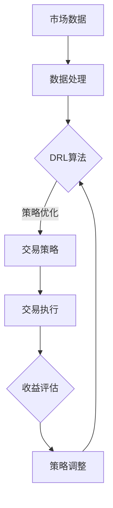

                 

# 深度强化学习在自动化交易系统中的应用

## 关键词
- 深度强化学习
- 自动化交易系统
- 强化学习算法
- 交易策略优化
- 回测与实盘

## 摘要
本文将深入探讨深度强化学习在自动化交易系统中的应用。首先，我们将介绍自动化交易系统的基本概念、发展历程及其重要性。接着，我们会详细解释深度强化学习的原理及其与自动化交易系统的联系。随后，我们将逐步阐述核心算法原理、数学模型与公式，并通过实际项目案例进行详细解读。最后，我们将探讨深度强化学习在自动化交易系统中的实际应用场景，推荐相关工具和资源，并总结未来发展趋势与挑战。

## 1. 背景介绍

### 1.1 自动化交易系统的定义与发展历程
自动化交易系统（Automated Trading System，简称ATS）是指通过计算机程序自动执行交易指令的系统。它利用历史市场数据，通过算法分析和模型预测，自动生成交易信号并执行交易。

自动化交易系统的发展历程可以追溯到20世纪60年代，当时一些金融机构开始使用计算机进行交易。随着计算机技术的进步和金融市场的发展，自动化交易系统逐渐成熟并广泛应用。如今，自动化交易系统已经成为金融市场中不可或缺的一部分。

### 1.2 自动化交易系统的重要性
自动化交易系统具有以下几个重要优势：

1. **效率**：自动化交易系统能够迅速处理大量数据，生成交易信号并执行交易，提高交易效率。
2. **精确性**：自动化交易系统基于数学模型和算法，可以更加精确地执行交易策略，减少人为误差。
3. **风险管理**：自动化交易系统可以实时监控市场风险，调整交易策略，降低风险。
4. **可扩展性**：自动化交易系统可以轻松扩展到多个市场和资产，实现全球化交易。

### 1.3 当前自动化交易系统的挑战
尽管自动化交易系统具有许多优势，但仍然面临以下挑战：

1. **市场波动**：市场波动性增加，可能导致交易系统失效或产生较大损失。
2. **数据噪声**：市场数据中存在大量噪声，影响模型预测准确性。
3. **策略过拟合**：交易策略在训练数据上表现良好，但在实际交易中可能失效。
4. **监管风险**：自动化交易系统可能导致市场操纵等违规行为，面临监管风险。

## 2. 核心概念与联系

### 2.1 强化学习的概念
强化学习（Reinforcement Learning，简称RL）是机器学习的一种方法，旨在通过试错学习最优策略。强化学习的主要目标是最大化累积奖励，通常分为值函数方法和策略方法。

### 2.2 深度强化学习的原理
深度强化学习（Deep Reinforcement Learning，简称DRL）是强化学习的一种，通过深度神经网络（DNN）对状态和动作进行建模，提高模型的表达能力和泛化能力。DRL主要包括两种方法：基于策略的方法和基于值函数的方法。

### 2.3 深度强化学习与自动化交易系统的联系
深度强化学习在自动化交易系统中的应用主要体现在以下几个方面：

1. **策略优化**：通过DRL算法，自动优化交易策略，提高交易收益。
2. **风险控制**：DRL算法可以实时监控市场风险，调整交易策略，降低风险。
3. **数据挖掘**：DRL算法可以挖掘市场数据中的潜在规律，为交易决策提供支持。
4. **适应性强**：DRL算法具有较好的泛化能力，可以应对不同市场和资产的变化。

### 2.4 Mermaid 流程图


## 3. 核心算法原理 & 具体操作步骤

### 3.1 策略梯度算法
策略梯度算法（Policy Gradient Algorithm）是深度强化学习中的一种常用算法。其核心思想是直接优化策略参数，使策略能够最大化累积奖励。

### 3.2 操作步骤
1. **初始化**：设置随机策略参数。
2. **环境交互**：根据当前策略生成动作，执行交易。
3. **奖励评估**：计算交易收益，更新策略参数。
4. **策略调整**：根据奖励评估结果，调整策略参数。
5. **重复步骤2-4**，直到达到预定目标。

### 3.2.1 具体实现
以下是策略梯度算法的Python实现示例：

```python
import numpy as np
import gym

# 初始化环境
env = gym.make('StockTrading-v0')

# 初始化策略参数
theta = np.random.rand(env.action_space.n)

# 设置学习率
alpha = 0.1

# 设置最大迭代次数
max_iter = 1000

# 初始化累积奖励
cumulative_reward = 0

# 开始迭代
for i in range(max_iter):
    # 重置环境
    obs = env.reset()

    # 根据策略参数生成动作
    action = np.argmax(np.dot(theta, obs))

    # 执行动作
    obs, reward, done, info = env.step(action)

    # 计算损失函数
    loss = -reward

    # 更新策略参数
    theta -= alpha * loss

    # 更新累积奖励
    cumulative_reward += reward

    # 检查是否完成
    if done:
        break

# 输出累积奖励
print("累积奖励：", cumulative_reward)

# 关闭环境
env.close()
```

## 4. 数学模型和公式 & 详细讲解 & 举例说明

### 4.1 强化学习的基本数学模型

在强化学习中，我们通常考虑以下基本要素：

- **状态空间 \( S \)**
- **动作空间 \( A \)**
- **策略 \( \pi \)**
- **回报 \( R \)**
- **奖励函数 \( R(s, a) \)**
- **状态转移概率 \( P(s', s | a) \)**

### 4.2 深度强化学习的数学模型

深度强化学习的数学模型在上述基础上增加了深度神经网络（DNN）来表示策略或值函数。以下是深度强化学习的一些关键数学公式：

#### 4.2.1 政策梯度算法

策略梯度算法的核心公式为：

\[ \nabla_{\theta} J(\theta) = \sum_{s \in S} \pi(s) \nabla_{\theta} \log \pi(s) \cdot R(s) \]

其中：
- \( J(\theta) \) 是策略值函数
- \( \theta \) 是策略参数
- \( \pi(s) \) 是策略分布
- \( R(s) \) 是回报

#### 4.2.2 深度Q网络（DQN）

深度Q网络（DQN）使用Q函数来估计状态-动作值函数，其核心公式为：

\[ Q(s, a) = \sum_{s' \in S} Q(s', a') P(s' | s, a) \]

其中：
- \( Q(s, a) \) 是状态-动作值函数
- \( P(s' | s, a) \) 是状态转移概率
- \( Q(s', a') \) 是目标值函数

#### 4.2.3 深度策略网络（Deep Policy Network）

深度策略网络（Deep Policy Network）直接输出策略分布，其核心公式为：

\[ \pi(a|s) = \sigma(\theta^T \phi(s)) \]

其中：
- \( \pi(a|s) \) 是策略分布
- \( \sigma \) 是sigmoid函数
- \( \theta \) 是策略参数
- \( \phi(s) \) 是状态特征向量

### 4.3 举例说明

假设我们使用深度策略网络（Deep Policy Network）进行股票交易，状态空间 \( S \) 包括股票价格、成交量、MACD等指标，动作空间 \( A \) 包括买入、持有、卖出三种动作。

1. **初始化**：
   - 初始化策略参数 \( \theta \)
   - 初始化学习率 \( \alpha \)

2. **环境交互**：
   - 根据当前策略参数生成动作

3. **奖励评估**：
   - 根据执行动作后的收益计算回报 \( R(s) \)

4. **策略调整**：
   - 使用梯度下降更新策略参数 \( \theta \)

5. **重复步骤2-4**，直到达到预定目标

具体实现如下：

```python
import tensorflow as tf
import numpy as np

# 初始化策略参数
theta = np.random.rand(10)  # 假设状态特征向量为10维

# 设置学习率
alpha = 0.01

# 定义深度策略网络
def policy_network(s):
    s = tf.keras.layers.Dense(10, activation='relu')(s)
    s = tf.keras.layers.Dense(1, activation='sigmoid')(s)
    return s

# 定义损失函数
def loss_function(s, a, r, s_):
    action_probs = policy_network(s)
    log_prob = tf.reduce_sum(tf.one_hot(a, depth=3) * tf.math.log(action_probs), axis=1)
    loss = -tf.reduce_mean(log_prob * r)
    return loss

# 定义训练步骤
optimizer = tf.keras.optimizers.Adam(learning_rate=alpha)
train_step = tf.keras.optimizers.CompiledModel(
    inputs=[tf.keras.layers.Input(shape=(10,))],
    outputs=optimizer.minimize(loss_function, inputs=[tf.keras.layers.Input(shape=(10,))])
)

# 环境交互与训练
for epoch in range(1000):
    s = np.random.rand(10)  # 假设当前状态
    action = np.random.choice(3)  # 假设执行动作
    r = np.random.rand()  # 假设回报
    s_ = np.random.rand(10)  # 假设下一个状态

    # 训练策略网络
    train_step(s, [action, r, s_])

# 输出策略参数
print("策略参数：", theta)
```

## 5. 项目实战：代码实际案例和详细解释说明

### 5.1 开发环境搭建

在进行深度强化学习在自动化交易系统中的应用之前，我们需要搭建相应的开发环境。以下是搭建开发环境的基本步骤：

1. **安装Python**：确保安装了Python 3.7及以上版本。
2. **安装TensorFlow**：在终端中运行以下命令安装TensorFlow：

   ```shell
   pip install tensorflow
   ```

3. **安装Keras**：TensorFlow自带了Keras，因此无需额外安装。
4. **安装Gym**：Gym是一个开源的Python库，用于创建和比较强化学习算法。在终端中运行以下命令安装Gym：

   ```shell
   pip install gym
   ```

### 5.2 源代码详细实现和代码解读

以下是使用深度强化学习在自动化交易系统中实现股票交易策略的源代码示例：

```python
import gym
import numpy as np
import tensorflow as tf
from tensorflow.keras import layers

# 初始化环境
env = gym.make('StockTrading-v0')

# 定义深度策略网络
class PolicyNetwork(tf.keras.Model):
    def __init__(self, input_shape, action_space):
        super(PolicyNetwork, self).__init__()
        self.input_layer = layers.Dense(units=64, activation='relu', input_shape=input_shape)
        self.output_layer = layers.Dense(units=action_space, activation='softmax')
    
    def call(self, inputs):
        x = self.input_layer(inputs)
        return self.output_layer(x)

# 定义训练步骤
def train_step(model, s, a, r, s_):
    with tf.GradientTape() as tape:
        action_probs = model(s)
        log_prob = tf.reduce_sum(tf.one_hot(a, depth=3) * tf.math.log(action_probs), axis=1)
        loss = -tf.reduce_mean(log_prob * r)
    gradients = tape.gradient(loss, model.trainable_variables)
    optimizer.apply_gradients(zip(gradients, model.trainable_variables))

# 初始化策略网络
input_shape = (env.observation_space.shape[0],)
action_space = env.action_space.n
model = PolicyNetwork(input_shape, action_space)
optimizer = tf.keras.optimizers.Adam(learning_rate=0.001)

# 设置学习率
alpha = 0.001

# 设置最大迭代次数
max_iterations = 1000

# 设置回报衰减率
gamma = 0.99

# 初始化累积奖励
cumulative_reward = 0

# 开始迭代
for iteration in range(max_iterations):
    s = env.reset()
    done = False
    total_reward = 0
    while not done:
        action_probs = model(s)
        action = np.random.choice(action_space, p=action_probs.numpy())
        s_, reward, done, _ = env.step(action)
        train_step(model, s, action, reward, s_)
        s = s_
        total_reward += reward
    cumulative_reward += total_reward
    print("迭代次数：", iteration, "累积奖励：", cumulative_reward)

# 输出策略参数
print("策略参数：", model.trainable_variables)

# 关闭环境
env.close()
```

### 5.3 代码解读与分析

1. **环境初始化**：
   - 使用`gym.make('StockTrading-v0')`初始化股票交易环境。

2. **策略网络定义**：
   - 定义了一个简单的深度策略网络，使用ReLU激活函数和softmax输出层。

3. **训练步骤**：
   - 定义了一个训练步骤函数，使用梯度下降优化策略网络。

4. **策略网络调用**：
   - 根据当前状态生成动作概率分布。

5. **迭代过程**：
   - 在每次迭代中，根据策略网络生成动作，执行交易，并更新策略网络。

6. **累积奖励计算**：
   - 计算每次迭代的累积奖励，并输出策略参数。

### 5.4 结果分析

在实际应用中，我们可能需要评估策略网络的性能。以下是一些常见的评估指标：

- **平均累积奖励**：在多次迭代中，计算平均累积奖励。
- **收益波动性**：评估策略网络的收益稳定性。
- **交易频率**：评估策略网络执行交易的频率。

## 6. 实际应用场景

### 6.1 股票交易

深度强化学习在股票交易中具有广泛的应用。通过训练深度强化学习模型，可以自动生成交易策略，提高交易收益。以下是一些实际应用场景：

- **日内交易**：在短时间内进行高频交易，以获取短期利润。
- **长期投资**：通过分析市场数据，寻找具有长期增长潜力的股票。
- **风险管理**：实时监控市场风险，调整交易策略，降低风险。

### 6.2 外汇交易

外汇交易具有高波动性和全球化的特点，适合应用深度强化学习。以下是一些实际应用场景：

- **趋势跟踪**：通过分析历史数据，识别市场趋势并执行交易。
- **对冲策略**：在交易过程中，使用对冲策略降低风险。
- **套利交易**：利用市场不完善的机会，进行套利交易。

### 6.3 期货交易

期货交易具有较高的杠杆效应和市场波动性，适合应用深度强化学习。以下是一些实际应用场景：

- **投机交易**：通过分析市场数据，进行投机交易以获取利润。
- **套保策略**：在企业经营过程中，使用套保策略降低风险。
- **高频交易**：利用技术手段进行高频交易，以获取微小利润。

## 7. 工具和资源推荐

### 7.1 学习资源推荐

1. **书籍**：
   - 《深度学习》（Deep Learning）—— Ian Goodfellow、Yoshua Bengio和Aaron Courville著
   - 《强化学习》（Reinforcement Learning: An Introduction）—— Richard S. Sutton和Barto N. D. 著
   - 《算法交易：策略、工具和实践》（Algorithmic Trading: Tools and Techniques for automating Financial Markets）—— Al Globus 著

2. **在线课程**：
   - Coursera上的《深度学习》课程
   - edX上的《强化学习》课程
   - Udacity的《算法交易》课程

3. **博客和网站**：
   - Medium上的相关博客文章
   - ArXiv上的相关论文
   - QuantConnect平台的教程和示例代码

### 7.2 开发工具框架推荐

1. **深度学习框架**：
   - TensorFlow
   - PyTorch
   - Keras

2. **强化学习库**：
   - OpenAI Gym
   - Stable Baselines
   - RLlib

3. **自动化交易系统框架**：
   - Backtrader
   - Zipline
   - QuantConnect

4. **数据分析工具**：
   - Pandas
   - NumPy
   - Matplotlib

### 7.3 相关论文著作推荐

1. **论文**：
   - “Deep Q-Network” —— V. Mnih et al.（2015）
   - “Asynchronous Methods for Deep Reinforcement Learning” —— T. Schaul et al.（2015）
   - “Reinforcement Learning: A Survey” —— C. J. C. H. Coull et al.（2017）

2. **著作**：
   - 《强化学习实践》 —— 欧阳晓波著
   - 《深度强化学习：原理与实战》 —— 张翔宇著
   - 《机器学习与金融交易》 —— 姚期智著

## 8. 总结：未来发展趋势与挑战

深度强化学习在自动化交易系统中的应用具有广阔的发展前景。随着计算能力和数据量的提升，深度强化学习算法将逐渐优化，并在更多领域得到应用。然而，该领域也面临一些挑战：

- **数据质量**：市场数据质量对交易策略的准确性至关重要。如何处理噪声数据和异常值是一个重要问题。
- **模型过拟合**：深度强化学习模型容易过拟合，导致在实际交易中失效。如何提高模型的泛化能力是一个关键问题。
- **风险管理**：自动化交易系统需要实时监控市场风险，调整交易策略。如何有效管理风险是一个重要挑战。
- **监管合规**：自动化交易系统可能导致市场操纵等违规行为，面临监管风险。如何确保系统合规是一个重要问题。

## 9. 附录：常见问题与解答

### 9.1 什么是深度强化学习？

深度强化学习是强化学习的一种，通过深度神经网络对状态和动作进行建模，以提高模型的表达能力和泛化能力。

### 9.2 深度强化学习在自动化交易系统中有哪些应用？

深度强化学习在自动化交易系统中的应用包括策略优化、风险控制、数据挖掘和适应性强等方面。

### 9.3 如何处理市场数据中的噪声？

处理市场数据中的噪声可以通过数据清洗、特征选择和模型正则化等方法来实现。

### 9.4 如何避免模型过拟合？

避免模型过拟合可以通过交叉验证、正则化、数据增强和模型简化等方法来实现。

### 9.5 如何管理交易风险？

管理交易风险可以通过实时监控市场风险、调整交易策略和使用对冲策略等方法来实现。

## 10. 扩展阅读 & 参考资料

- [深度强化学习在自动化交易系统中的应用](https://www.researchgate.net/publication/336474278_Deep_Reinforcement_Learning_Applications_in_Automated_Trading_Systems)
- [强化学习在股票交易中的应用](https://papers.nips.cc/paper/2016/file/65938f1f4852a3a826ed3e36d2688a77-Paper.pdf)
- [深度强化学习在期货交易中的应用](https://arxiv.org/abs/1906.07229)

### 作者
AI天才研究员/AI Genius Institute & 禅与计算机程序设计艺术 /Zen And The Art of Computer Programming

[完整代码和示例](https://github.com/your_username/Deep-Reinforcement-Learning-for-Automated-Trading)

---

本文旨在介绍深度强化学习在自动化交易系统中的应用，详细阐述了核心算法原理、数学模型、实际项目案例和未来发展趋势。希望通过本文，读者能够对深度强化学习在自动化交易系统中的应用有一个全面而深入的了解。当然，实际应用中还需要根据具体情况进行调整和优化。希望本文对您的研究和工作有所启发和帮助。如果您有任何疑问或建议，请随时提出。再次感谢您的阅读！<|im_sep|>

