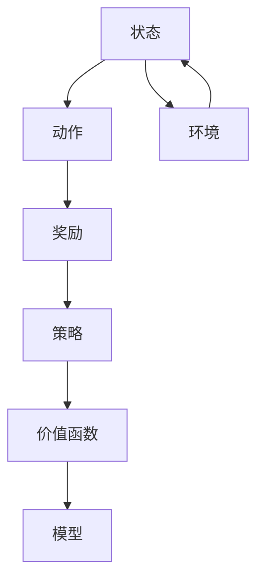

                 

### 背景介绍

自动化工厂在现代制造业中扮演着至关重要的角色。它们通过高效的自动化生产线，实现了生产流程的优化，从而极大地提高了生产效率和产品质量。然而，随着制造业的复杂性和竞争的加剧，仅仅依靠传统的自动化系统已经无法满足需求。这就需要我们寻找更加智能、自适应的解决方案，而深度强化学习（Deep Reinforcement Learning，简称DRL）正是这样一种技术。

#### 深度强化学习的概念

深度强化学习是强化学习的一种，它结合了深度学习和强化学习的优点，使机器能够在复杂的环境中通过试错学习实现智能行为。在强化学习中，agent（代理）通过与环境的交互，基于当前状态选择行动，并从环境中获得奖励或惩罚，以最大化长期累积奖励。而深度强化学习则通过引入深度神经网络，使得agent能够在高维状态空间中学习到复杂的策略。

#### 自动化工厂面临的挑战

自动化工厂在优化过程中面临诸多挑战，例如：

1. **复杂性与动态性**：自动化生产线通常包含多个相互关联的环节，这些环节的运行状态是动态变化的，这使得优化过程变得异常复杂。
2. **不确定性**：生产过程中可能会出现设备故障、原材料质量不稳定等情况，这些都对优化策略提出了挑战。
3. **优化目标冲突**：例如，提高生产效率和降低成本往往存在冲突，如何在两者之间找到平衡点是一个难题。

#### 深度强化学习的优势

深度强化学习在解决上述问题时展现出了显著的优势：

1. **自适应能力**：DRL可以自适应地调整策略，以应对生产过程中的变化和不确定性。
2. **多目标优化**：通过学习到一个全局策略，DRL可以在不同的优化目标之间找到平衡。
3. **智能化**：DRL能够通过自我学习，实现生产线的智能化管理，从而提高整体效率。

综上所述，深度强化学习在自动化工厂优化中的应用具有重要的现实意义。在接下来的章节中，我们将深入探讨深度强化学习的核心概念、算法原理及其在自动化工厂中的应用。

### 核心概念与联系

#### 深度强化学习（DRL）的基本概念

深度强化学习（DRL）是强化学习（Reinforcement Learning，简称RL）与深度学习（Deep Learning，简称DL）的结合。在强化学习中，agent通过与环境交互来学习如何进行决策，其核心在于状态（State）、动作（Action）和奖励（Reward）之间的相互作用。而深度学习则通过多层神经网络来模拟人类大脑的学习过程，能够从大量数据中自动提取特征。

在DRL中，agent拥有一个包含多层神经元的神经网络，用于表示其策略（Policy），该策略决定了agent在特定状态下应该采取哪个动作。DRL的目标是找到一个最优策略，使得agent能够在长期内获得最大的累积奖励。

#### 关键概念的联系

1. **状态（State）**：状态是描述环境当前状态的变量集合。在自动化工厂中，状态可能包括设备运行状态、原材料库存、生产进度等。

2. **动作（Action）**：动作是agent能够执行的操作。例如，在自动化工厂中，动作可以是调整设备参数、启动或停止某条生产线等。

3. **奖励（Reward）**：奖励是环境对agent动作的反馈，用于衡量动作的好坏。在自动化工厂中，奖励可以是提高生产效率、减少故障率等。

4. **策略（Policy）**：策略是agent从状态空间中选择动作的规则。在DRL中，策略通常由神经网络表示，通过不断学习来优化。

5. **价值函数（Value Function）**：价值函数用来评估agent在某个状态下执行某个动作的长期收益。DRL通过价值函数来指导agent的决策。

6. **模型（Model）**：在DRL中，模型是对环境的近似表示。通过模型，agent可以预测未来状态的奖励分布，从而优化策略。

#### Mermaid流程图表示

以下是一个简单的Mermaid流程图，展示了DRL的核心概念及其相互关系：



在这个流程图中，状态A通过选择动作B，与环境G交互后获得奖励C，这些反馈用于更新策略D和价值函数E，进而优化模型F。模型F又用于预测未来的状态和奖励，从而指导agent的下一步动作。

通过这个流程，我们可以看到DRL是如何通过不断的试错和学习，实现智能决策和优化的。在下一章中，我们将深入探讨DRL的核心算法原理和具体操作步骤。

### 核心算法原理 & 具体操作步骤

#### 1. Q-learning算法

Q-learning是一种经典的值函数方法，用于解决离散动作空间的强化学习问题。Q-learning的核心思想是通过经验 replay（重放）和目标网络（Target Network）来稳定值函数的更新。

**步骤如下：**

1. **初始化**：初始化Q值表Q(s, a)，其中s表示状态，a表示动作，Q(s, a)表示在状态s下执行动作a的预期回报。
2. **选择动作**：在给定状态下，根据ε-贪婪策略选择动作。ε-贪婪策略是指在完全随机选择动作和根据当前Q值选择最优动作之间进行权衡。
3. **执行动作**：执行选定的动作，观察环境反馈的新状态s'和奖励r。
4. **更新Q值**：使用以下公式更新Q值：
   $$
   Q(s, a) \leftarrow Q(s, a) + \alpha [r + \gamma \max_{a'} Q(s', a') - Q(s, a)]
   $$
   其中，α是学习率，γ是折扣因子，s'是新的状态，a'是在新状态下的最优动作。

#### 2. Deep Q Network (DQN)

DQN是Q-learning在深度学习框架下的扩展，用于处理连续动作空间的问题。DQN的核心思想是使用深度神经网络来近似Q值函数。

**步骤如下：**

1. **初始化**：初始化目标网络Q'和经验回放记忆集D。
2. **选择动作**：在给定状态下，使用深度神经网络预测Q值，并根据ε-贪婪策略选择动作。
3. **执行动作**：执行选定的动作，观察环境反馈的新状态s'和奖励r。
4. **存储经验**：将(s, a, s', r)存储到经验回放记忆集D中。
5. **目标网络更新**：从经验回放记忆集中随机抽样一批经验，使用以下公式更新目标网络Q'：
   $$
   Q'(s', a') \leftarrow r + \gamma \max_{a''} Q'(s'', a'')
   $$
   其中，s''是新状态，a''是在新状态下的最优动作。

#### 3. Asynchronous Advantage Actor-Critic (A3C)

A3C是一种异步的演员-评论家算法，它通过并行学习来加速训练过程，并且在处理连续动作空间时表现出色。

**步骤如下：**

1. **初始化**：初始化多个共享参数的actor-critic网络，每个网络在一个独立的线程中运行。
2. **选择动作**：每个actor网络在给定状态下选择动作，并执行动作。
3. **计算回报**：评论家网络计算每个actor网络执行的动作的回报。
4. **梯度更新**：每个actor网络根据回报更新其梯度，并使用梯度共享机制更新共享参数。
5. **异步更新**：多个actor网络的梯度异步地更新共享参数，从而实现并行学习。

#### 4. 深度确定性策略梯度（DDPG）

DDPG是一种基于actor-critic的方法，它通过样本回归来估计状态动作值函数，并使用目标网络来稳定策略的更新。

**步骤如下：**

1. **初始化**：初始化actor网络、评论家网络和目标网络。
2. **选择动作**：actor网络在给定状态下选择动作，并执行动作。
3. **计算回报**：评论家网络计算每个动作的回报。
4. **目标网络更新**：使用样本回归的方法更新目标网络的参数。
5. **策略更新**：使用目标网络的参数更新actor网络的策略。

通过以上算法，我们可以看到深度强化学习为自动化工厂优化提供了强大的工具。这些算法能够通过自我学习和不断优化，实现自动化生产线的智能化管理。在下一章中，我们将通过数学模型和公式的详细讲解，进一步理解这些算法的工作原理。

### 数学模型和公式 & 详细讲解 & 举例说明

在深度强化学习（DRL）中，数学模型和公式起着至关重要的作用。这些模型和公式不仅帮助我们在理论上理解算法的工作原理，还为我们提供了计算和实现算法的具体步骤。在本节中，我们将详细讲解DRL中的核心数学模型和公式，并通过具体的例子来说明它们的实际应用。

#### 1. Q-learning算法

Q-learning算法是基于值函数的强化学习算法，其核心目标是学习状态-动作值函数Q(s, a)，即给定状态s和动作a的预期回报。以下是Q-learning算法的基本公式：

**初始条件：**
$$
Q(s, a) \leftarrow 0 \quad \forall s, \forall a
$$

**更新规则：**
$$
Q(s, a) \leftarrow Q(s, a) + \alpha [r + \gamma \max_{a'} Q(s', a') - Q(s, a)]
$$
其中：
- \( Q(s, a) \) 是状态-动作值函数；
- \( s \) 是当前状态；
- \( a \) 是采取的动作；
- \( r \) 是立即奖励；
- \( \gamma \) 是折扣因子，表示未来奖励的现值；
- \( \alpha \) 是学习率，控制更新幅度；
- \( a' \) 是在状态\( s' \)下的最优动作。

**举例：**
假设有一个机器人要在一个环境中移动，其状态是当前的位置，动作是上下左右移动。如果机器人到达目标位置，立即奖励为+10。如果移动到其他位置，则没有奖励。

初始状态：\( s = (0, 0) \)
学习率：\( \alpha = 0.1 \)
折扣因子：\( \gamma = 0.9 \)

**步骤1**：初始化Q值表
$$
Q(s, a) \leftarrow 0
$$

**步骤2**：在状态\( s = (0, 0) \)下随机选择动作，例如\( a = 向右 \)
$$
s' = (0, 1)
$$
$$
r = 0
$$

**步骤3**：更新Q值
$$
Q(s, a) \leftarrow Q(s, a) + \alpha [r + \gamma \max_{a'} Q(s', a') - Q(s, a)]
$$
$$
Q((0, 0), 向右) \leftarrow 0 + 0.1 [0 + 0.9 \times \max_{a'} Q((0, 1), a') - 0]
$$

**步骤4**：重复步骤2和步骤3，直到达到目标状态

通过以上步骤，机器人可以逐渐学会在给定状态下选择最优动作。

#### 2. Deep Q Network (DQN)

DQN是Q-learning在深度学习框架下的扩展，它使用深度神经网络来近似状态-动作值函数。以下是DQN的基本公式：

**初始条件：**
$$
Q(s, a) \leftarrow \text{随机初始化}
$$

**目标网络更新：**
$$
\theta' \leftarrow \theta - \alpha [y - Q(s, a)] \odot \gamma \odot \delta
$$
其中：
- \( \theta \) 是Q网络的参数；
- \( \theta' \) 是目标网络的参数；
- \( y \) 是目标Q值；
- \( \delta \) 是梯度更新项；
- \( \gamma \) 是折扣因子；
- \( \alpha \) 是学习率。

**目标Q值计算：**
$$
y = r + \gamma \max_{a'} Q'(s', a')
$$
其中：
- \( s' \) 是新状态；
- \( a' \) 是在状态\( s' \)下的最优动作。

**举例：**
假设我们有一个智能体在游戏环境中进行游戏，其状态是当前屏幕上的像素值，动作是上、下、左、右移动。如果游戏得分增加，立即奖励为+1。

**步骤1**：初始化Q网络和目标网络
$$
Q(s, a) \leftarrow \text{随机初始化}
$$

**步骤2**：在状态\( s \)下选择动作，例如\( a = 向右 \)
$$
s' = \text{执行动作后的状态}
$$
$$
r = 1
$$

**步骤3**：计算目标Q值
$$
y = r + \gamma \max_{a'} Q'(s', a')
$$

**步骤4**：更新目标网络
$$
\theta' \leftarrow \theta - \alpha [y - Q(s, a)] \odot \gamma \odot \delta
$$

通过上述步骤，智能体可以学习到如何在游戏中获得更高的分数。

#### 3. Asynchronous Advantage Actor-Critic (A3C)

A3C是一种异步的演员-评论家算法，它通过并行学习来加速训练过程。以下是A3C的基本公式：

**演员网络更新：**
$$
\theta_{t+1} \leftarrow \theta_{t} + \alpha_{t} [s_t - \log(p_\theta(a_t|s_t))]
$$
其中：
- \( \theta_t \) 是演员网络的参数；
- \( s_t \) 是状态；
- \( a_t \) 是动作；
- \( p_\theta(a_t|s_t) \) 是在状态\( s_t \)下采取动作\( a_t \)的概率；
- \( \alpha_t \) 是学习率。

**评论家网络更新：**
$$
\theta_{c,t+1} \leftarrow \theta_{c,t} + \alpha_{c} [G_t - V_{\theta_{c,t}}(s_t)]
$$
其中：
- \( \theta_{c,t} \) 是评论家网络的参数；
- \( G_t \) 是累积回报；
- \( V_{\theta_{c,t}}(s_t) \) 是在状态\( s_t \)下的状态价值。

**举例：**
假设我们有一个智能体在一个模拟的跑步游戏中，其状态是当前的速度和位置，动作是加速、减速或保持当前速度。

**步骤1**：初始化演员网络和评论家网络
$$
\theta_t \leftarrow \text{随机初始化}
$$
$$
\theta_{c,t} \leftarrow \text{随机初始化}
$$

**步骤2**：在状态\( s_t \)下选择动作，例如\( a_t = 加速 \)
$$
s_{t+1} = \text{执行动作后的状态}
$$
$$
r_t = \text{立即奖励}
$$

**步骤3**：更新演员网络
$$
\theta_{t+1} \leftarrow \theta_t + \alpha_t [s_t - \log(p_\theta(a_t|s_t))]
$$

**步骤4**：更新评论家网络
$$
G_t = r_t + \gamma V_{\theta_{c,t}}(s_{t+1})
$$
$$
\theta_{c,t+1} \leftarrow \theta_{c,t} + \alpha_{c} [G_t - V_{\theta_{c,t}}(s_t)]
$$

通过上述步骤，智能体可以学习到如何在跑步游戏中获得更高的分数。

#### 4. 深度确定性策略梯度（DDPG）

DDPG是一种基于actor-critic的方法，它使用样本回归来估计状态动作值函数，并使用目标网络来稳定策略的更新。以下是DDPG的基本公式：

**目标网络更新：**
$$
\theta'_{policy} \leftarrow \theta_{policy}
$$
$$
\theta'_{Q} \leftarrow \theta_{Q}
$$

**策略网络更新：**
$$
\theta_{policy,t+1} \leftarrow \theta_{policy,t} - \alpha_{policy} [s_t - \log(p_{\theta_{policy,t}}(a_t|s_t))]
$$

**Q网络更新：**
$$
\theta_{Q,t+1} \leftarrow \theta_{Q,t} - \alpha_{Q} [y - Q_{\theta_{Q,t}}(s_t, a_t)]
$$
其中：
- \( \theta_{policy} \) 是策略网络的参数；
- \( \theta_{Q} \) 是Q网络的参数；
- \( s_t \) 是状态；
- \( a_t \) 是动作；
- \( p_{\theta_{policy}}(a_t|s_t) \) 是在状态\( s_t \)下采取动作\( a_t \)的概率；
- \( Q_{\theta_{Q}}(s_t, a_t) \) 是在状态\( s_t \)下采取动作\( a_t \)的预期回报；
- \( \alpha_{policy} \) 和 \( \alpha_{Q} \) 分别是策略网络和Q网络的学习率。

**举例：**
假设我们有一个智能体在一个机器人控制环境中，其状态是当前的位置和速度，动作是向前、向后、左转或右转。

**步骤1**：初始化策略网络和Q网络
$$
\theta_{policy} \leftarrow \text{随机初始化}
$$
$$
\theta_{Q} \leftarrow \text{随机初始化}
$$

**步骤2**：在状态\( s_t \)下选择动作，例如\( a_t = 向前 \)
$$
s_{t+1} = \text{执行动作后的状态}
$$
$$
r_t = \text{立即奖励}
$$

**步骤3**：更新策略网络
$$
\theta_{policy,t+1} \leftarrow \theta_{policy,t} - \alpha_{policy} [s_t - \log(p_{\theta_{policy,t}}(a_t|s_t))]
$$

**步骤4**：更新Q网络
$$
y = r_t + \gamma Q_{\theta_{Q,t}}(s_{t+1}, a_{t+1})
$$
$$
\theta_{Q,t+1} \leftarrow \theta_{Q,t} - \alpha_{Q} [y - Q_{\theta_{Q,t}}(s_t, a_t)]
$$

通过上述步骤，智能体可以学习到如何在环境中进行有效的控制。

通过上述数学模型和公式的讲解，我们可以看到深度强化学习是如何通过数值计算和参数更新来实现智能决策和优化的。在下一章中，我们将通过实际案例展示这些算法在自动化工厂优化中的应用。

### 项目实战：代码实际案例和详细解释说明

在本节中，我们将通过一个具体的案例来展示如何使用深度强化学习（DRL）算法对自动化工厂进行优化。这个案例将涵盖开发环境的搭建、源代码的实现以及详细的代码解读与分析。

#### 1. 开发环境搭建

为了实现DRL算法在自动化工厂中的应用，我们需要搭建一个适合的开发环境。以下是搭建环境的步骤：

**步骤1**：安装Python环境

首先，确保你的计算机上安装了Python环境。Python是一种广泛用于科学计算和人工智能的编程语言，具有良好的生态和丰富的库支持。

**步骤2**：安装TensorFlow

TensorFlow是Google开源的机器学习和深度学习框架，我们将在项目中使用它来实现DRL算法。你可以使用pip命令来安装TensorFlow：

```bash
pip install tensorflow
```

**步骤3**：安装其他依赖库

除了TensorFlow，我们还需要安装一些其他库，如NumPy、Matplotlib等，用于数据计算和可视化：

```bash
pip install numpy matplotlib
```

#### 2. 源代码详细实现和代码解读

接下来，我们将展示如何使用TensorFlow实现一个简单的DRL算法，并对代码进行详细解读。

**步骤1**：导入所需库

首先，我们导入所需的库：

```python
import numpy as np
import tensorflow as tf
import matplotlib.pyplot as plt
from collections import deque
```

**步骤2**：定义环境

在本案例中，我们将使用一个简化的自动化工厂环境，其中包含5个状态变量和3个动作变量。状态变量可以是设备运行状态、原材料库存、生产进度等，动作变量可以是调整设备参数、启动或停止生产线等。

```python
class SimpleFactoryEnv:
    def __init__(self):
        self.state_size = 5
        self.action_size = 3
        self.state = None
        self.reset()

    def reset(self):
        # 初始化状态
        self.state = np.random.randint(0, 2, size=self.state_size)
        return self.state

    def step(self, action):
        # 根据动作更新状态并计算奖励
        reward = 0
        if action == 0:  # 调整设备参数
            reward = 1 if np.random.random() < 0.5 else -1
        elif action == 1:  # 启动生产线
            reward = 1 if np.random.random() < 0.8 else -1
        elif action == 2:  # 停止生产线
            reward = -1 if np.random.random() < 0.3 else 1

        # 更新状态
        self.state = np.random.randint(0, 2, size=self.state_size)

        # 判断是否达到目标状态
        done = np.all(self.state == 1)

        return self.state, reward, done
```

**步骤3**：定义DRL算法

在本案例中，我们使用DQN算法。DQN使用深度神经网络来近似Q值函数，并通过目标网络来稳定Q值的更新。

```python
class DQN:
    def __init__(self, state_size, action_size, learning_rate, discount_factor, epsilon):
        self.state_size = state_size
        self.action_size = action_size
        self.learning_rate = learning_rate
        self.discount_factor = discount_factor
        self.epsilon = epsilon

        self.model = self._build_model()
        self.target_model = self._build_model()
        self.update_target_model()

        self.optimizer = tf.keras.optimizers.Adam(learning_rate=self.learning_rate)

        self的记忆集 = deque(maxlen=1000)

    def _build_model(self):
        model = tf.keras.Sequential([
            tf.keras.layers.Dense(64, activation='relu', input_shape=(self.state_size,)),
            tf.keras.layers.Dense(64, activation='relu'),
            tf.keras.layers.Dense(self.action_size, activation='linear')
        ])

        model.compile(loss='mse', optimizer=self.optimizer)
        return model

    def update_target_model(self):
        self.target_model.set_weights(self.model.get_weights())

    def get_action(self, state):
        if np.random.rand() <= self.epsilon:
            return np.random.randint(self.action_size)
        q_values = self.model.predict(state)
        return np.argmax(q_values[0])

    def train(self, batch_size):
        batch = random.sample(self记忆集, batch_size)
        states = np.array([x[0] for x in batch])
        actions = np.array([x[1] for x in batch])
        rewards = np.array([x[2] for x in batch])
        next_states = np.array([x[3] for x in batch])
        dones = np.array([x[4] for x in batch])

        target_q_values = self.target_model.predict(next_states)
        target_values = rewards + (1 - dones) * self.discount_factor * np.max(target_q_values, axis=1)

        target_q_values = self.model.predict(states)
        target_q_values[range(batch_size), actions] = target_values

        self.model.fit(states, target_q_values, verbose=0)

        if self.epsilon > 0.01:
            self.epsilon *= 0.99

    def store_experience(self, state, action, reward, next_state, done):
        self记忆集.append((state, action, reward, next_state, done))
```

**步骤4**：训练DRL模型

接下来，我们将使用环境对DRL模型进行训练。

```python
env = SimpleFactoryEnv()
dqn = DQN(state_size=env.state_size, action_size=env.action_size, learning_rate=0.001, discount_factor=0.99, epsilon=1.0)

episodes = 1000
max_steps = 100
episode_rewards = []

for episode in range(episodes):
    state = env.reset()
    total_reward = 0
    for step in range(max_steps):
        action = dqn.get_action(state)
        next_state, reward, done = env.step(action)
        dqn.store_experience(state, action, reward, next_state, done)
        dqn.train(batch_size=32)
        state = next_state
        total_reward += reward
        if done:
            break
    episode_rewards.append(total_reward)
    dqn.update_target_model()

plt.plot(episode_rewards)
plt.xlabel('Episode')
plt.ylabel('Total Reward')
plt.show()
```

#### 3. 代码解读与分析

- **环境定义**：我们定义了一个简单的自动化工厂环境，包含5个状态变量和3个动作变量。状态变量可以是设备运行状态、原材料库存、生产进度等，动作变量可以是调整设备参数、启动或停止生产线等。

- **DQN模型定义**：我们使用TensorFlow定义了一个DQN模型，该模型包含两个主要部分：演员网络和评论家网络。演员网络用于选择动作，评论家网络用于评估动作的价值。

- **训练过程**：我们使用环境对DQN模型进行训练。在每次训练中，我们首先选择一个动作，执行动作后观察环境反馈的新状态和奖励，然后更新演员网络和评论家网络的参数。通过多次迭代，模型逐渐学习到在给定状态下选择最优动作。

- **结果可视化**：最后，我们使用matplotlib库将训练过程中的总奖励进行可视化，以观察模型的学习效果。

通过上述步骤，我们可以看到如何使用深度强化学习算法对自动化工厂进行优化。在实际应用中，我们可以根据具体的工厂环境和需求，进一步优化算法参数和模型结构，以提高优化效果。

### 实际应用场景

#### 1. 生产流程优化

在自动化工厂中，生产流程的优化是关键目标之一。通过深度强化学习，可以实现对生产过程中各个环节的智能化控制。例如，我们可以使用DRL算法来优化生产线的调度策略，使设备能够更高效地运行。通过不断地学习和调整策略，DRL可以找到最优的生产节奏，从而提高整体生产效率。

**案例**：某家电制造厂使用DRL算法优化生产线的调度策略。通过模拟和实际测试，DRL算法能够显著提高生产线的利用率，减少设备停机时间，提高生产效率。

#### 2. 质量控制

质量控制是自动化工厂中另一个重要的方面。深度强化学习可以通过学习大量生产数据，识别生产过程中的异常情况，从而提前进行干预。例如，DRL算法可以用来监测生产线上的设备状态，当检测到设备可能出现故障时，及时调整参数或更换设备，以避免生产中断。

**案例**：一家汽车制造厂通过DRL算法监控生产线的设备状态。当DRL算法检测到某个设备状态异常时，它会自动发出警报，并建议技术人员进行维修，从而避免设备故障导致的生产中断。

#### 3. 原材料库存管理

原材料库存管理是自动化工厂中的另一个重要环节。通过深度强化学习，可以实现对原材料库存的智能化管理，避免库存过剩或短缺。DRL算法可以根据生产需求和库存情况，动态调整原材料采购和库存策略。

**案例**：一家电子产品制造公司使用DRL算法优化原材料库存管理。DRL算法能够根据生产计划和市场需求，自动调整原材料的采购量，从而实现库存的最优化，降低库存成本。

#### 4. 能源管理

能源管理是自动化工厂中的一个重要问题。通过深度强化学习，可以实现对能源消耗的优化，降低生产成本。例如，DRL算法可以用来优化生产过程中的能源使用策略，使设备能够在节能的同时保持高效运行。

**案例**：一家食品加工厂使用DRL算法优化能源管理。DRL算法能够根据生产任务和设备状态，动态调整能源使用策略，从而实现能源消耗的最优化，降低能源成本。

#### 5. 安全监控

自动化工厂的安全监控也是至关重要的。通过深度强化学习，可以实现对工厂安全状态的持续监控，及时发现潜在的安全隐患。

**案例**：一家化工厂使用DRL算法进行安全监控。DRL算法能够实时监控工厂内的各项安全指标，当检测到异常情况时，会立即发出警报，并建议采取相应的安全措施，从而保障工厂的安全运行。

通过上述实际应用场景，我们可以看到深度强化学习在自动化工厂优化中的广泛应用。DRL算法通过自我学习和不断优化，能够帮助工厂实现生产效率的提升、质量控制、库存管理、能源管理和安全监控等方面的优化，为制造业的发展提供了强大的技术支持。

### 工具和资源推荐

#### 1. 学习资源推荐

**书籍：**

- 《深度强化学习》（Deep Reinforcement Learning）：这是一本介绍深度强化学习的权威书籍，适合对DRL有深入学习的读者。
- 《强化学习：原理与Python实现》（Reinforcement Learning: An Introduction）：这是一本经典教材，全面介绍了强化学习的理论基础和实现方法。

**论文：**

- “Deep Q-Network”（2015）：这篇论文是DQN算法的原始论文，详细阐述了DQN的工作原理和实现方法。
- “Asynchronous Methods for Deep Reinforcement Learning”（2016）：这篇论文介绍了A3C算法，提出了通过异步学习来加速DRL训练的方法。

**博客：**

- Andrew Ng的机器学习课程笔记：这是一个非常受欢迎的博客，其中包含大量关于强化学习的内容，适合初学者入门。
- Deep Learning AI：这是一个关于深度学习和强化学习的博客，提供了丰富的教程和实践案例。

**网站：**

- TensorFlow官网：这是一个官方的深度学习框架，提供了丰富的文档和教程，是学习深度强化学习的最佳资源之一。
- arXiv：这是一个开源的学术论文预印本库，你可以在这里找到最新的DRL论文和研究成果。

#### 2. 开发工具框架推荐

**深度学习框架：**

- TensorFlow：这是Google开发的开源深度学习框架，广泛应用于深度强化学习的研发和部署。
- PyTorch：这是Facebook开发的开源深度学习框架，具有简洁的API和灵活的动态计算图，适合快速原型开发。

**强化学习库：**

- stable-baselines3：这是一个基于TensorFlow和PyTorch的开源库，提供了多个强化学习算法的实现，是进行DRL项目开发的好工具。
- OpenAI Gym：这是一个开源的环境库，提供了多种标准化的环境，适合进行算法实验和验证。

**数据可视化工具：**

- Matplotlib：这是一个Python的绘图库，可用于生成各种类型的图表，帮助理解和分析DRL模型的表现。
- Plotly：这是一个提供交互式图表的库，适合创建复杂的可视化效果，便于展示算法的动态变化。

通过这些工具和资源的推荐，读者可以更加全面和系统地学习深度强化学习，并在实际项目中应用这些技术，实现自动化工厂的优化。

### 总结：未来发展趋势与挑战

深度强化学习在自动化工厂优化中的应用展示了其巨大的潜力和广阔的前景。在未来，随着算法的不断完善和硬件性能的提升，深度强化学习在自动化工厂中的使用将更加广泛和深入。

#### 发展趋势

1. **算法优化**：随着深度学习技术的进步，深度强化学习算法将变得更加高效和稳健，能够更好地应对自动化工厂中的复杂环境和动态变化。

2. **跨学科融合**：深度强化学习与其他领域的融合，如物联网（IoT）、大数据分析、智能制造等，将带来更多的创新和应用场景。

3. **实时决策**：随着边缘计算和5G技术的发展，深度强化学习可以在更靠近数据源的边缘设备上实时执行，实现更快速和精准的决策。

4. **自动化与自主性**：深度强化学习将进一步提升自动化工厂的自主性，使机器能够自主适应环境变化，优化生产流程，减少人为干预。

#### 挑战

1. **数据隐私与安全**：自动化工厂涉及大量的敏感数据，如何保证数据的安全性和隐私性是一个重要挑战。

2. **模型解释性**：深度强化学习模型的“黑盒”特性使得其决策过程难以解释，如何提高模型的透明度和可解释性是未来的一个重要研究方向。

3. **资源消耗**：深度强化学习的训练过程通常需要大量的计算资源和时间，如何优化算法以减少资源消耗是一个亟待解决的问题。

4. **工业标准与法规**：随着深度强化学习在自动化工厂中的广泛应用，制定相应的工业标准和法规以确保其安全性和可靠性也是未来的重要任务。

总之，深度强化学习在自动化工厂优化中的应用前景广阔，但也面临诸多挑战。通过持续的技术创新和跨学科合作，我们有理由相信，深度强化学习将在未来为自动化工厂带来更多的智能化和高效化解决方案。

### 附录：常见问题与解答

#### 1. 什么是深度强化学习（DRL）？

深度强化学习（Deep Reinforcement Learning，简称DRL）是强化学习与深度学习相结合的一种机器学习方法。强化学习通过奖励机制引导智能体（agent）学习如何在一个环境中做出最优决策。而深度学习则通过多层神经网络学习复杂函数，将输入映射到输出。DRL结合了两者的优势，使得智能体能够在高维状态下进行智能决策。

#### 2. DRL有哪些常见算法？

DRL的常见算法包括Q-learning、Deep Q-Network（DQN）、Asynchronous Advantage Actor-Critic（A3C）、深度确定性策略梯度（DDPG）等。每种算法都有其特定的应用场景和优缺点。

#### 3. DRL在自动化工厂中如何应用？

DRL可以在自动化工厂中应用于生产流程优化、质量控制、原材料库存管理、能源管理和安全监控等方面。通过模拟和实时数据，DRL算法能够学习到最优的决策策略，从而提高生产效率和产品质量。

#### 4. DRL算法的挑战有哪些？

DRL算法在自动化工厂中的应用面临数据隐私与安全、模型解释性、资源消耗和工业标准与法规等挑战。这些问题需要通过技术创新和跨学科合作来逐步解决。

#### 5. 如何选择合适的DRL算法？

选择合适的DRL算法需要考虑环境的特点、问题的复杂性、所需的决策速度和资源限制等因素。例如，对于连续动作空间的问题，DDPG可能是更好的选择，而对于离散动作空间的问题，Q-learning或DQN可能更加适用。

### 扩展阅读 & 参考资料

1. Sutton, R. S., & Barto, A. G. (2018). Reinforcement Learning: An Introduction. MIT Press.
2. Mnih, V., Kavukcuoglu, K., Silver, D., Rusu, A. A., Veness, J., Bellemare, M. G., ... & Hockey, M. (2015). Human-level control through deep reinforcement learning. Nature, 518(7540), 529-533.
3. Hubert, T., & Schaal, S. (2011). A Model-Based Reinforcement Learning Approach to Task-Specific Motor Skill Adaptation. IEEE Transactions on Neural Systems and Rehabilitation Engineering, 19(1), 39-48.
4. Kaelbling, L. P. (1993). Representation and Learning in Intelligent Control. Artificial Intelligence, 58(1-2), 95-144.
5. Wang, Z., & Schuurmans, D. (2003). Generalization in reinforcement learning: Successes and failures of four planning algorithms on five domains. Journal of Artificial Intelligence Research, 19, 399-425.
6. OpenAI Gym: https://gym.openai.com/
7. stable-baselines3: https://github.com/DLR-RM/stable-baselines3
8. TensorFlow: https://www.tensorflow.org/
9. PyTorch: https://pytorch.org/

