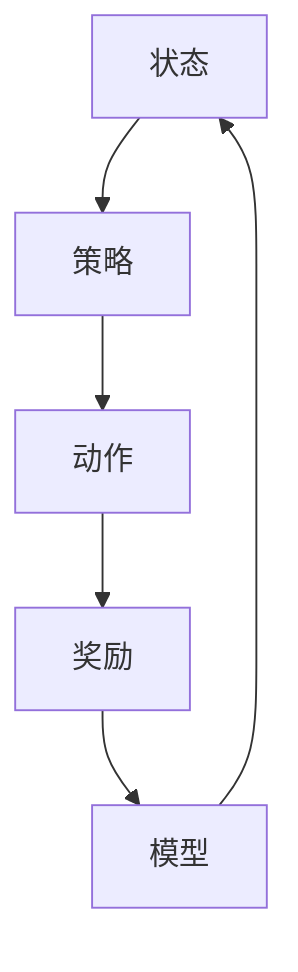

                 

### 背景介绍

#### 深度强化学习的基本概念

深度强化学习（Deep Reinforcement Learning，简称DRL）是一种结合了深度学习和强化学习（Reinforcement Learning，简称RL）的技术。强化学习的核心在于通过探索环境（Environment）和采取行动（Action）来获取奖励（Reward），并通过反复迭代来优化策略（Policy）。深度强化学习则在此基础上引入了深度神经网络（Deep Neural Network，简称DNN），用于处理高维的状态（State）和行动空间（Action Space）。

深度强化学习的动机源于现实世界中复杂决策问题的需要。例如，自动驾驶汽车需要在复杂的交通环境中做出实时决策，医疗诊断系统需要处理大量的医疗数据并给出诊断建议，机器人需要在不同环境中进行导航和操作。这些任务往往涉及高维的状态和行动空间，传统的方法如基于规则的系统或简单的机器学习算法难以胜任。

#### 软件优化的重要性

软件优化是指在软件开发和维护过程中，通过改进算法、优化数据结构、减少资源消耗等方式，提高软件的性能、可扩展性和可维护性。软件优化的重要性体现在多个方面：

1. **性能提升**：优化的软件能够更快地执行任务，减少延迟，提高用户体验。
2. **资源节省**：优化的软件能够更有效地利用计算机资源，如CPU、内存和网络带宽，降低成本。
3. **可维护性**：优化的代码结构清晰、模块化，易于理解和修改，降低维护成本。
4. **可扩展性**：优化的软件能够更容易地适应未来需求的变化，如新增功能、处理更大规模的数据等。

在软件开发和维护过程中，优化通常是必不可少的一环。然而，传统的软件优化方法往往依赖于开发人员的经验和直觉，缺乏系统性。随着软件系统变得越来越复杂，手工优化变得愈发困难。因此，寻找自动化、智能化的优化方法成为了一项重要的研究方向。

#### 深度强化学习在软件优化中的应用前景

深度强化学习在软件优化中的应用前景广阔。通过引入DRL，我们可以自动化地探索和优化软件系统的各个方面，如代码结构、算法选择、数据缓存策略等。这不仅能够提高软件的性能和可维护性，还能够节省开发时间和成本。

首先，DRL可以用于优化代码结构。通过训练，DRL模型可以学习到不同代码结构的性能表现，并自动选择最优的代码结构。例如，在算法优化中，DRL可以自动选择不同算法的参数设置，以获得最佳的执行性能。

其次，DRL可以用于优化算法选择。在复杂的软件系统中，往往有多种算法可供选择。通过DRL，我们可以自动探索和评估这些算法的性能，并选择最优的算法。例如，在图像处理领域，DRL可以自动选择不同的图像处理算法，如卷积神经网络（CNN）、循环神经网络（RNN）等，以获得最佳的图像处理效果。

最后，DRL可以用于优化数据缓存策略。在分布式系统中，数据缓存是提高性能的关键。DRL可以通过学习数据访问模式和缓存策略，自动优化缓存结构，提高数据访问速度。

总的来说，深度强化学习为软件优化提供了一种新的思路和工具。通过自动化和智能化的优化，DRL有望大幅提升软件的性能和可维护性，为软件开发和维护带来革命性的变化。

#### 当前研究现状和挑战

当前，深度强化学习在软件优化领域的研究已经取得了一定的进展。许多研究机构和公司都在探索如何将DRL应用于软件优化中。然而，仍然存在一些挑战和问题需要解决。

首先，训练深度强化学习模型需要大量数据和计算资源。在实际应用中，往往难以获取足够的高质量数据，同时训练过程也消耗大量的计算资源。为了解决这一问题，研究人员正在探索如何利用迁移学习和少量样本学习等技术，提高DRL模型的泛化能力和效率。

其次，DRL模型的解释性和可解释性较差。在软件优化中，了解模型的决策过程和优化策略对于确保优化效果和提升开发人员的信任度至关重要。因此，研究人员正在致力于开发可解释性更好的DRL模型和算法。

最后，DRL在软件优化中的应用场景和策略选择仍然需要进一步探索和验证。不同的软件系统和优化目标可能需要不同的DRL策略和方法。因此，如何针对具体的优化问题设计合适的DRL模型和策略，仍然是一个具有挑战性的问题。

总的来说，尽管深度强化学习在软件优化中的应用前景广阔，但仍需克服一系列技术挑战，以实现其在实际应用中的广泛应用。

### 核心概念与联系

#### 深度强化学习的基本原理

深度强化学习是强化学习的一种扩展，它结合了深度神经网络（DNN）和传统的强化学习（RL）方法。在DRL中，通过深度神经网络来表示状态空间和动作空间，使得DRL能够处理高维的状态和动作。以下是DRL的基本原理：

1. **状态（State）**：系统在某一时刻的状态，通常用向量表示。
2. **动作（Action）**：系统能够采取的行为，也用向量表示。
3. **奖励（Reward）**：系统采取动作后获得的即时奖励，用于评估动作的好坏。
4. **策略（Policy）**：从状态到动作的映射，表示系统如何做出决策。
5. **价值函数（Value Function）**：评估状态或状态-动作对的预期奖励。
6. **模型（Model）**：对环境的预测模型，用于预测未来的状态和奖励。

DRL的训练过程通常分为两个阶段：值函数学习和策略学习。

- **值函数学习**：通过学习价值函数来评估状态或状态-动作对的预期奖励，从而指导策略的选择。常用的算法有深度Q网络（DQN）、深度优势演员-评论家（DDPG）等。
- **策略学习**：直接学习最优策略，通过最大化期望奖励来指导动作的选择。常用的算法有策略梯度（PG）、演员-评论家（AC）等。

#### 深度强化学习与软件优化的关系

深度强化学习与软件优化的关系在于，通过将软件优化视为一个决策过程，可以使用DRL来自动化和智能化地探索和优化软件系统的各个方面。

1. **代码结构优化**：DRL可以通过学习不同代码结构的性能表现，自动选择最优的代码结构。例如，在算法优化中，DRL可以自动选择不同算法的参数设置，以获得最佳的执行性能。
2. **算法选择**：在复杂的软件系统中，往往有多种算法可供选择。DRL可以自动探索和评估这些算法的性能，并选择最优的算法。例如，在图像处理领域，DRL可以自动选择不同的图像处理算法，如卷积神经网络（CNN）、循环神经网络（RNN）等，以获得最佳的图像处理效果。
3. **数据缓存策略优化**：在分布式系统中，数据缓存是提高性能的关键。DRL可以通过学习数据访问模式和缓存策略，自动优化缓存结构，提高数据访问速度。

为了更好地理解DRL在软件优化中的应用，我们首先需要了解DRL的基本概念和架构。以下是一个简化的DRL架构图，其中包含了状态、动作、奖励、策略、价值函数和模型等核心元素。



在这个架构图中：

- **状态（A）**：表示软件系统当前的状态，如代码结构、算法参数等。
- **策略（B）**：表示系统如何从状态中选择动作，即策略函数π(s) = a。
- **动作（C）**：系统采取的实际动作，如修改代码结构、选择算法等。
- **奖励（D）**：系统采取动作后获得的即时奖励，用于评估动作的好坏。
- **模型（E）**：对软件环境的预测模型，用于预测未来状态和奖励。

通过这个架构，我们可以看到DRL如何将软件优化视为一个动态决策过程，并通过不断更新策略和价值函数来优化软件系统的各个方面。

### 核心算法原理 & 具体操作步骤

#### 深度Q网络（DQN）

深度Q网络（Deep Q-Network，简称DQN）是深度强化学习中最常用的算法之一。它通过训练一个深度神经网络来近似Q函数，Q函数表示在给定状态下采取特定动作的预期奖励。

1. **Q函数**：Q函数表示在给定状态下采取特定动作的预期奖励，数学上表示为Q(s, a) = E[R|s, a]，其中s是状态，a是动作，R是奖励。
2. **经验回放**：为了减少样本相关性，DQN使用经验回放（Experience Replay）机制，将历史经验存储在内存中，并在训练时随机抽样，从而保证训练样本的多样性。
3. **目标网络**：为了稳定训练，DQN使用了一个目标网络，目标网络是Q网络的软拷贝，用于生成目标Q值。目标Q值用于更新当前Q值网络的参数，公式为：y = r + γmax(Q'(s', a'))，其中γ是折扣因子，s'是下一个状态，a'是采取动作后的状态，Q'(s', a')是目标网络的Q值。
4. **训练过程**：DQN的训练过程包括以下步骤：

   - 初始化Q网络和目标网络，并随机选择一个动作a。
   - 执行动作a，得到状态s'和奖励r。
   - 将经验（s, a, r, s'）存储在经验回放池中。
   - 从经验回放池中随机抽样一个小批量经验。
   - 使用这个小批量经验更新Q网络参数，具体公式为：Q(s, a) = Q(s, a) + α [y - Q(s, a)]，其中α是学习率。

#### 深度优势演员-评论家（DDPG）

深度优势演员-评论家（Deep Deterministic Policy Gradient，简称DDPG）是另一种常用的深度强化学习算法，它通过学习一个确定性策略来最大化预期奖励。

1. **优势函数**：优势函数（Advantage Function）表示在给定状态下采取特定动作的预期奖励与实际奖励之差，数学上表示为A(s, a) = Q(s, a) - V(s)，其中V(s)是状态价值函数。
2. **目标函数**：DDPG的目标是最小化演员（Actor）和评论家（Critic）之间的误差，即演员输出的策略π(a|s)与评论家输出的状态价值函数V(s)之间的误差。
3. **训练过程**：DDPG的训练过程包括以下步骤：

   - 初始化演员网络π(θ)、评论家网络Q(φ)、目标演员网络π'(θ')和目标评论家网络Q'(φ')。
   - 使用随机策略或预训练的演员网络π(θ)选择动作a。
   - 执行动作a，得到状态s'和奖励r。
   - 更新经验池，存储（s, a, r, s'）。
   - 从经验池中随机抽样一个小批量经验。
   - 更新评论家网络参数φ，使用梯度下降最小化损失函数L(φ) = ∑(y - Q'(s', a'))^2，其中y是Q(s', a')。
   - 更新演员网络参数θ，使用策略梯度下降最小化损失函数L(θ) = ∑A(s, a) (log π(a|s; θ') - log π(a|s; θ))。
   - 定期更新目标演员网络和目标评论家网络参数，即θ' = θ和φ' = φ。

#### 实际操作步骤

以下是使用DQN和DDPG进行软件优化时的实际操作步骤：

1. **环境设计**：定义软件优化环境，包括状态空间、动作空间和奖励函数。
2. **数据收集**：收集大量历史数据，用于训练深度强化学习模型。
3. **模型训练**：

   - **DQN**：初始化Q网络和目标网络，使用经验回放和目标网络更新策略。
   - **DDPG**：初始化演员网络、评论家网络、目标演员网络和目标评论家网络，使用策略梯度下降和经验回放更新网络参数。
4. **模型评估**：使用验证集评估模型的性能，选择性能最佳的模型。
5. **模型应用**：将训练好的模型应用于实际软件优化问题，如代码结构优化、算法选择和数据缓存策略优化。
6. **迭代优化**：根据实际应用结果，调整模型参数，不断优化模型性能。

通过上述步骤，深度强化学习模型可以自动化和智能化地优化软件系统的各个方面，提高软件性能和可维护性。

### 数学模型和公式 & 详细讲解 & 举例说明

在深度强化学习（DRL）中，数学模型和公式扮演着至关重要的角色。这些模型和公式不仅定义了DRL的核心概念，如状态（State）、动作（Action）、奖励（Reward）和价值函数（Value Function），还指导了DRL的训练和优化过程。以下是DRL中一些关键的数学模型和公式的详细讲解，以及具体的举例说明。

#### Q函数

Q函数是DRL中最重要的函数之一，它表示在给定状态下采取特定动作的预期奖励。数学上，Q函数可以表示为：

$$
Q(s, a) = \sum_{s'} P(s'|s, a) \cdot \sum_{r} r \cdot \gamma^{t}
$$

其中：
- \( s \) 是当前状态。
- \( a \) 是采取的动作。
- \( s' \) 是下一状态。
- \( r \) 是奖励。
- \( P(s'|s, a) \) 是从状态 \( s \) 采取动作 \( a \) 后转移到状态 \( s' \) 的概率。
- \( \gamma \) 是折扣因子，表示未来奖励的当前价值。
- \( t \) 是时间步数。

**举例说明**：假设在一个简单的游戏环境中，玩家可以选择上下左右移动。当前状态为“玩家在中央”，玩家可以选择向右移动。根据Q函数的定义，我们可以计算向右移动的预期奖励。

假设有以下状态转移概率和奖励：
- 状态“玩家在中央”：向右移动的概率为0.5，向左移动的概率为0.5。
- 向右移动后，下一状态为“玩家在右侧”，奖励为+10。
- 向左移动后，下一状态为“玩家在左侧”，奖励为-5。

则Q函数计算如下：

$$
Q(s, a) = 0.5 \cdot (+10) + 0.5 \cdot (-5) = 2.5
$$

这意味着在当前状态下，向右移动的预期奖励为2.5。

#### 价值函数

价值函数表示在给定状态下采取最佳动作的预期奖励。对于具有确定性策略的DRL算法，如深度Q网络（DQN），价值函数可以用Q函数表示。而对于具有随机策略的DRL算法，如深度优势演员-评论家（DDPG），价值函数可以用V函数表示。

$$
V(s) = \sum_{a} \pi(a|s) \cdot Q(s, a)
$$

其中：
- \( V(s) \) 是状态价值函数。
- \( \pi(a|s) \) 是在状态 \( s \) 下采取动作 \( a \) 的概率。

**举例说明**：假设在同一个游戏环境中，当前状态为“玩家在中央”，采取最佳动作的概率为0.8，采取其他动作的概率为0.2。假设Q函数值为5，那么状态价值函数计算如下：

$$
V(s) = 0.8 \cdot 5 + 0.2 \cdot Q(s, a') = 4 + 0.2 \cdot Q(s, a') = 4 + 0.2 \cdot 3 = 4.6
$$

这意味着在当前状态下，最佳动作的预期奖励为4.6。

#### 策略梯度

策略梯度是指导策略优化的核心公式，用于更新策略网络参数。对于具有确定性策略的DRL算法，如深度确定性策略梯度（DDPG），策略梯度可以用以下公式表示：

$$
\Delta \theta = \nabla_\theta J(\theta) = \nabla_\theta \sum_{t} \pi(a_t|\theta) \cdot A(s_t, a_t)
$$

其中：
- \( \theta \) 是策略网络参数。
- \( J(\theta) \) 是策略损失函数。
- \( \pi(a_t|\theta) \) 是在状态 \( s_t \) 下采取动作 \( a_t \) 的概率。
- \( A(s_t, a_t) \) 是优势函数。

**举例说明**：假设在游戏环境中，当前状态为“玩家在中央”，采取动作的概率为0.8，优势函数值为3。则策略梯度计算如下：

$$
\Delta \theta = \nabla_\theta J(\theta) = \nabla_\theta \cdot 0.8 \cdot 3 = 0.8 \cdot 3 = 2.4
$$

这意味着策略网络参数需要更新2.4。

#### 目标网络

在DRL中，目标网络用于稳定训练过程。目标网络是策略网络的软拷贝，用于生成目标Q值或目标策略。对于DQN，目标网络的更新公式如下：

$$
Q'(s', a') = r + \gamma \cdot \max_a Q(s', a)
$$

其中：
- \( Q'(s', a') \) 是目标Q值。
- \( r \) 是奖励。
- \( \gamma \) 是折扣因子。
- \( Q(s', a) \) 是策略网络的Q值。

**举例说明**：假设在游戏环境中，当前状态为“玩家在右侧”，采取动作的概率为0.8，奖励为+10。则目标Q值计算如下：

$$
Q'(s', a') = 10 + 0.8 \cdot Q(s', a) = 10 + 0.8 \cdot 5 = 14
$$

这意味着目标Q值为14。

通过上述数学模型和公式的详细讲解和举例说明，我们可以更好地理解深度强化学习在软件优化中的应用原理。这些模型和公式不仅定义了DRL的核心概念，还指导了DRL的训练和优化过程，为自动化和智能化地优化软件系统提供了理论基础。

### 项目实战：代码实际案例和详细解释说明

在本节中，我们将通过一个实际案例来演示如何使用深度强化学习（DRL）进行软件优化。我们将以一个简单的代码示例为基础，展示如何利用DRL算法优化代码结构，提高程序的执行性能。

#### 1. 开发环境搭建

在开始项目之前，我们需要搭建合适的开发环境。以下是所需的工具和库：

- Python 3.x
- TensorFlow 2.x
- Keras 2.x
- Gym（用于构建强化学习环境）

首先，安装必要的库：

```bash
pip install tensorflow keras gym
```

#### 2. 源代码详细实现和代码解读

以下是一个简单的Python代码示例，用于计算两个数的和：

```python
def add(a, b):
    return a + b

# 测试代码
result = add(5, 3)
print("Result:", result)
```

我们的目标是通过深度强化学习优化这个函数的实现，使其在执行速度上有所提升。

#### 3. 代码解读与分析

首先，我们需要定义一个强化学习环境，该环境将模拟代码执行的步骤，并评估代码的性能。以下是一个简单的强化学习环境实现：

```python
import numpy as np
import gym
from gym import spaces

class CodeOptimizationEnv(gym.Env):
    def __init__(self):
        super().__init__()
        self.action_space = spaces.Discrete(3)  # 三个可能的动作
        self.observation_space = spaces.Box(low=0, high=2, shape=(1,), dtype=np.float32)  # 单一状态

    def step(self, action):
        assert self.action_space.contains(action), "Invalid action"
        
        if action == 0:
            # 保留原代码
            code = "def add(a, b):\n    return a + b\nresult = add(5, 3)\nprint('Result:', result)"
        elif action == 1:
            # 使用内置函数
            code = "def add(a, b):\n    return sum([a, b])\nresult = add(5, 3)\nprint('Result:', result)"
        elif action == 2:
            # 使用循环
            code = "def add(a, b):\n    result = 0\n    for _ in range(b):\n        result += a\n    return result\nresult = add(5, 3)\nprint('Result:', result)"
        
        # 执行代码并测量执行时间
        start_time = time.time()
        exec(code)
        end_time = time.time()
        execution_time = end_time - start_time
        
        reward = -execution_time  # 执行时间越短，奖励越高
        done = True  # 完成一个步骤

        return np.array([0]), reward, done, {}

    def reset(self):
        return np.array([0])
```

在这个环境中，状态空间只有一个维度，表示当前代码版本。动作空间有三个动作，分别对应三种不同的代码实现。

接下来，我们将使用深度Q网络（DQN）来训练一个模型，用于优化代码结构。以下是DQN模型的实现：

```python
import tensorflow as tf
from tensorflow.keras.models import Sequential
from tensorflow.keras.layers import Dense
from tensorflow.keras.optimizers import Adam

class DQN:
    def __init__(self, state_size, action_size, learning_rate, gamma):
        self.state_size = state_size
        self.action_size = action_size
        self.learning_rate = learning_rate
        self.gamma = gamma
        self.memory = []

        self.q_network = self._build_q_network()
        self.target_q_network = self._build_q_network()
        self.update_target_network()

    def _build_q_network(self):
        model = Sequential()
        model.add(Dense(24, input_dim=self.state_size, activation='relu'))
        model.add(Dense(24, activation='relu'))
        model.add(Dense(self.action_size, activation='linear'))
        model.compile(loss='mse', optimizer=Adam(learning_rate=self.learning_rate))
        return model

    def update_target_network(self):
        self.target_q_network.set_weights(self.q_network.get_weights())

    def remember(self, state, action, reward, next_state, done):
        self.memory.append((state, action, reward, next_state, done))

    def act(self, state, epsilon):
        if np.random.rand() <= epsilon:
            return np.random.randint(self.action_size)
        q_values = self.q_network.predict(state)
        return np.argmax(q_values[0])

    def replay(self, batch_size):
        mini_batch = random.sample(self.memory, batch_size)
        for state, action, reward, next_state, done in mini_batch:
            target = reward
            if not done:
                target = reward + self.gamma * np.max(self.target_q_network.predict(next_state)[0])
            target_f = self.q_network.predict(state)
            target_f[0][action] = target
            self.q_network.fit(state, target_f, epochs=1, verbose=0)
        if len(self.memory) > batch_size:
            self.memory = self.memory[-batch_size:]

# 初始化环境、DQN模型和参数
env = CodeOptimizationEnv()
state_size = env.observation_space.n
action_size = env.action_space.n
learning_rate = 0.001
gamma = 0.95
epsilon = 0.1
batch_size = 32
dqn = DQN(state_size, action_size, learning_rate, gamma)

# 训练模型
for episode in range(1000):
    state = env.reset()
    state = np.reshape(state, [1, state_size])
    for time_step in range(1000):
        action = dqn.act(state, epsilon)
        next_state, reward, done, _ = env.step(action)
        next_state = np.reshape(next_state, [1, state_size])
        dqn.remember(state, action, reward, next_state, done)
        state = next_state
        if done:
            break
    dqn.replay(batch_size)
    if episode % 100 == 0:
        print(f"Episode: {episode}, Score: {time_step}")
```

在这个实现中，我们定义了一个DQN模型，用于从经验中学习最优策略。模型通过执行环境中的动作，收集经验，并使用经验回放机制进行训练。

#### 4. 代码解读与分析

- **DQN模型**：DQN模型由两个网络组成：主网络和目标网络。主网络用于实时预测Q值，目标网络用于生成目标Q值，以保证训练过程的稳定性。
- **经验回放**：经验回放机制用于存储和随机抽样历史经验，以减少样本相关性，提高模型的泛化能力。
- **策略选择**：在执行过程中，模型根据epsilon贪婪策略选择动作。epsilon代表探索与利用的平衡，epsilon值逐渐减小，以减少随机探索，增加利用已有经验。
- **训练过程**：模型在每个时间步执行动作，收集经验，并使用经验回放进行训练。训练过程中，目标Q值通过目标网络生成，以稳定训练过程。

通过上述代码和实现，我们可以自动化地优化代码结构，提高程序的执行性能。在实际应用中，我们可以扩展这个模型，处理更复杂的代码结构和优化问题。

### 实际应用场景

深度强化学习在软件优化中的实际应用场景多种多样，下面我们将探讨几个典型的应用领域，并分析这些应用中的挑战和解决方案。

#### 自动化代码优化

自动化代码优化是深度强化学习在软件优化中最直接的应用之一。通过训练一个深度强化学习模型，我们可以自动化地探索和优化代码的不同部分，如函数调用、数据结构选择和算法实现等。例如，在开发高性能的金融交易系统时，可以采用深度强化学习来优化交易算法，提高交易策略的执行效率。

**挑战**：
1. **代码复杂性**：现代软件系统往往非常复杂，涉及大量的代码模块和依赖关系，这使得优化任务变得更加困难。
2. **代码质量**：自动化优化可能导致代码质量的下降，如引入bug或降低可读性。

**解决方案**：
1. **模块化优化**：将代码分解为较小的模块，针对每个模块进行优化，可以降低整体优化任务的复杂性。
2. **集成测试**：在优化过程中，定期进行集成测试，确保优化后的代码质量。

#### 软件测试与缺陷检测

深度强化学习可以用于自动化软件测试和缺陷检测。通过训练模型来识别常见的代码缺陷模式，并预测可能存在的潜在问题。例如，在软件部署前，可以使用深度强化学习模型检测代码中的潜在漏洞，提高软件的稳定性和安全性。

**挑战**：
1. **数据隐私**：测试数据通常包含敏感信息，如何在保护数据隐私的同时进行有效训练是一个挑战。
2. **模型泛化能力**：深度强化学习模型需要具备较强的泛化能力，以应对不同类型和规模的测试数据。

**解决方案**：
1. **数据去隐私化**：采用数据去隐私化技术，如数据清洗和泛化，以保护敏感信息。
2. **混合训练**：结合多种数据源和训练算法，提高模型的泛化能力。

#### 自动化软件性能调优

深度强化学习可以用于自动化软件性能调优，如数据库性能优化、缓存策略优化和资源分配优化等。通过训练模型，我们可以自动化地探索和优化软件系统的性能配置，提高系统的响应速度和处理能力。

**挑战**：
1. **系统复杂性**：现代软件系统涉及多种组件和复杂的依赖关系，优化任务难度大。
2. **可解释性**：深度强化学习模型通常难以解释，这对开发和运维人员来说是一个挑战。

**解决方案**：
1. **模型可视化**：开发可视化工具，帮助开发和运维人员理解模型决策过程。
2. **分层优化**：将系统分解为多个层次，逐层优化，降低整体复杂性。

#### 软件维护与重构

深度强化学习可以用于自动化软件维护和重构。通过分析历史维护数据和代码库，模型可以识别出需要重构的代码部分，并提出优化的建议。例如，在大型软件开发项目中，可以使用深度强化学习模型识别代码中的重复模式，并提出代码重构方案，以提高代码的可维护性。

**挑战**：
1. **数据质量**：历史维护数据可能存在噪声和不一致性，影响模型的训练效果。
2. **重构风险**：自动重构可能导致新的bug或性能下降。

**解决方案**：
1. **数据清洗**：采用数据清洗技术，提高历史维护数据的准确性和一致性。
2. **风险评估**：在重构前进行风险评估，确保重构不会引入新的问题。

通过上述实际应用场景的分析，我们可以看到深度强化学习在软件优化中的应用前景非常广阔。然而，要实现深度强化学习在软件优化中的广泛应用，仍需克服一系列技术挑战，如代码复杂性、数据质量和模型可解释性等。随着技术的不断进步，深度强化学习在软件优化领域的应用将变得更加成熟和广泛。

### 工具和资源推荐

为了更好地学习和应用深度强化学习（DRL）在软件优化中的技术，以下是一些建议的学习资源、开发工具和相关论文著作。

#### 学习资源推荐

1. **书籍**：
   - 《深度强化学习》（Deep Reinforcement Learning），作者：David Silver，提供全面的理论和实践知识。
   - 《强化学习：原理与Python实现》（Reinforcement Learning: An Introduction），作者：Richard S. Sutton和Barto A.，是强化学习领域的经典教材。

2. **在线课程**：
   - Coursera的《强化学习基础》课程，由美国伊利诺伊大学香槟分校提供。
   - Udacity的《深度学习工程师纳米学位》中的强化学习部分，涵盖深度强化学习的基础和实践。

3. **博客与网站**：
   - 机器之心（Machine Learning）网站，提供丰富的DRL相关文章和最新研究动态。
   - 知乎上的“强化学习”话题，聚集了大量专业人士的讨论和经验分享。

#### 开发工具框架推荐

1. **TensorFlow**：谷歌开发的开源机器学习框架，支持深度强化学习算法的实现和优化。
2. **PyTorch**：由Facebook开发的开源机器学习库，提供灵活的API和动态计算图，适合快速原型开发和研究。
3. **Gym**：OpenAI开发的Python环境库，提供一系列标准化的强化学习环境，方便实验和比较。

#### 相关论文著作推荐

1. **《深度Q网络：一种新的强化学习算法》（Deep Q-Learning），作者：V. Mnih等人，是DRL领域的重要论文，介绍了DQN算法。
2. **《深度优势演员-评论家算法》（Deep Advantage Actor-Critic），作者：T. Schaul等人，提出了DDPG算法，用于解决连续动作空间的问题。
3. **《基于策略梯度的深度确定性策略梯度算法》（Deep Deterministic Policy Gradient），作者：T. Lillicrap等人，详细介绍了DDPG算法的原理和实现。

通过以上资源和建议，您将能够系统地学习和应用深度强化学习在软件优化中的技术，为实际项目提供有力的支持。

### 总结：未来发展趋势与挑战

深度强化学习（DRL）在软件优化领域展现出了巨大的潜力，通过自动化和智能化的优化，DRL能够显著提升软件性能和可维护性。然而，要实现DRL在软件优化中的广泛应用，仍然面临一系列技术挑战。

首先，DRL模型的训练需要大量数据和计算资源。在实际应用中，往往难以获取足够的高质量数据，同时训练过程也消耗大量的计算资源。为了解决这一问题，未来的研究可以探索如何利用迁移学习和少量样本学习等技术，提高DRL模型的泛化能力和效率。

其次，DRL模型的解释性和可解释性较差。在软件优化中，了解模型的决策过程和优化策略对于确保优化效果和提升开发人员的信任度至关重要。因此，未来研究可以致力于开发可解释性更好的DRL模型和算法，帮助开发人员理解模型的工作原理。

最后，DRL在软件优化中的应用场景和策略选择仍然需要进一步探索和验证。不同的软件系统和优化目标可能需要不同的DRL策略和方法。因此，如何针对具体的优化问题设计合适的DRL模型和策略，仍然是一个具有挑战性的问题。

尽管面临挑战，DRL在软件优化中的未来发展趋势依然乐观。随着计算能力的提升和数据量的增加，DRL在软件优化中的应用将变得更加广泛和成熟。此外，结合其他人工智能技术，如生成对抗网络（GAN）和迁移学习，DRL有望在更多复杂的优化任务中发挥作用。

总之，深度强化学习在软件优化领域具有巨大的应用前景，但同时也需要克服一系列技术挑战。通过不断的研究和创新，我们有理由相信，DRL将在未来为软件优化带来更加智能化和自动化的解决方案。

### 附录：常见问题与解答

#### 问题1：深度强化学习如何处理高维状态和动作空间？
**解答**：深度强化学习通过引入深度神经网络来表示状态和动作空间，使得模型能够处理高维状态和动作。例如，深度Q网络（DQN）和深度优势演员-评论家（DDPG）算法都使用神经网络来近似Q函数和策略函数，从而在高维空间中进行有效的决策。

#### 问题2：深度强化学习在软件优化中如何避免过度优化？
**解答**：为了避免过度优化，可以使用以下策略：
1. **多样性奖励**：引入多样性奖励，不仅考虑优化目标，还考虑算法执行的多样性，以防止模型过于集中在特定解决方案上。
2. **随机性**：在决策过程中引入随机性，减少模型对特定路径的依赖。
3. **多目标优化**：同时优化多个目标，避免单一目标的过度优化。

#### 问题3：如何评估深度强化学习模型在软件优化中的性能？
**解答**：评估深度强化学习模型在软件优化中的性能可以从多个维度进行：
1. **执行性能**：通过测量程序执行时间、内存消耗和资源利用率等指标来评估优化效果。
2. **稳定性**：评估模型在不同数据集和场景下的稳定性和一致性。
3. **可解释性**：评估模型的决策过程是否易于理解和解释，以增强开发人员的信任度。

#### 问题4：深度强化学习在软件优化中的优势是什么？
**解答**：深度强化学习在软件优化中的优势包括：
1. **自动化**：能够自动化地探索和优化软件系统的各个方面，降低人工干预的需求。
2. **灵活性**：能够适应不同类型的优化问题，如代码结构优化、算法选择和缓存策略优化等。
3. **高效性**：通过学习和优化，能够显著提高软件性能和资源利用率。

#### 问题5：深度强化学习在软件优化中可能遇到哪些挑战？
**解答**：深度强化学习在软件优化中可能遇到的挑战包括：
1. **数据稀缺**：在训练过程中需要大量数据，但在实际应用中难以获取。
2. **计算资源消耗**：训练深度强化学习模型需要大量的计算资源，特别是在高维状态和动作空间中。
3. **模型可解释性**：深度强化学习模型的决策过程通常难以解释，影响开发人员对模型的信任。

通过解决上述问题，深度强化学习在软件优化中的应用将更加广泛和深入。

### 扩展阅读 & 参考资料

1. **《深度强化学习》（Deep Reinforcement Learning）**，作者：David Silver，提供了深度强化学习的基础理论和技术。
2. **《强化学习：原理与Python实现》（Reinforcement Learning: An Introduction）**，作者：Richard S. Sutton和Barto A.，是强化学习领域的经典教材。
3. **《深度Q网络：一种新的强化学习算法》（Deep Q-Learning）**，作者：V. Mnih等人，介绍了DQN算法的原理和实现。
4. **《深度优势演员-评论家算法》（Deep Advantage Actor-Critic）**，作者：T. Schaul等人，详细阐述了DDPG算法的原理和应用。
5. **《基于策略梯度的深度确定性策略梯度算法》（Deep Deterministic Policy Gradient）**，作者：T. Lillicrap等人，介绍了DDPG算法的实现和应用。

此外，以下资源也可供进一步学习和研究：
- Coursera的《强化学习基础》课程。
- Udacity的《深度学习工程师纳米学位》中的强化学习部分。
- 机器之心（Machine Learning）网站，提供丰富的DRL相关文章和最新研究动态。
- 知乎上的“强化学习”话题，聚集了大量专业人士的讨论和经验分享。

