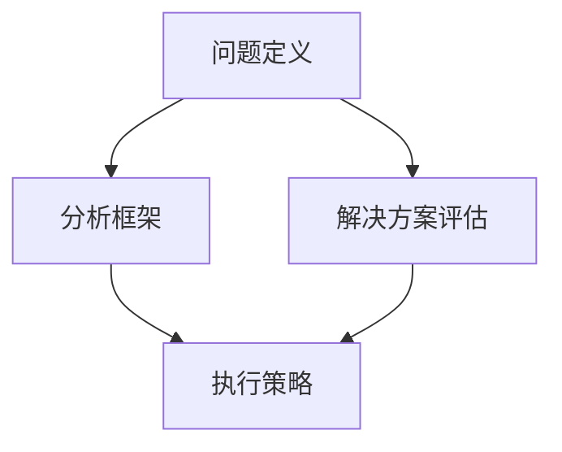

                 

# 深度思考与管理问题解决能力的提升

> **关键词：深度思考、问题解决、管理能力、IT领域、算法原理**

> **摘要：本文将探讨如何通过深度思考提升管理问题解决能力，特别是在IT领域的应用。文章将涵盖核心概念与联系、核心算法原理与操作步骤、数学模型与公式解析、项目实战、实际应用场景、工具和资源推荐、未来发展趋势与挑战等多个方面，旨在帮助读者深入了解并提升这一关键能力。**

## 1. 背景介绍

在快速发展的IT行业，面对复杂的技术问题和项目管理，提升深度思考与管理问题解决能力显得尤为重要。深度思考不仅涉及对问题的深入分析和理解，还要求我们具备系统性思维、创新思维和批判性思维。而管理问题解决能力则体现在如何有效地识别、分析、制定解决方案并执行，确保项目或任务的成功完成。

本文将从以下几个方面展开讨论：

- **核心概念与联系**：介绍深度思考与管理问题解决能力的关键概念及其相互关系。
- **核心算法原理与操作步骤**：探讨解决问题的核心算法及其具体应用。
- **数学模型与公式**：分析解决问题的关键数学模型和公式。
- **项目实战**：通过实际案例展示如何运用上述方法解决具体问题。
- **实际应用场景**：讨论深度思考与管理问题解决能力在IT领域的应用。
- **工具和资源推荐**：介绍相关学习资源和开发工具。
- **未来发展趋势与挑战**：预测这一领域的发展趋势和面临的挑战。

通过这些内容的详细探讨，读者将能够更好地理解深度思考与管理问题解决能力的本质，并学会如何在实际工作中有效运用。

### 1.1 深度思考的定义与重要性

深度思考是一种深入分析问题、理解本质、发现规律和提出创新解决方案的思维活动。它不仅仅是对问题的表面现象进行分析，而是通过多角度、多层次的思维，深入挖掘问题的根源，并寻找最根本的解决方案。

在IT领域，深度思考的重要性体现在以下几个方面：

1. **提高问题解决效率**：通过深度思考，可以更快速地找到问题的核心，从而提高问题解决的效率。
2. **发现潜在问题**：深度思考能够帮助我们发现潜在的问题，这些问题可能是在表面分析中未被察觉的，但它们对项目的成功与否有着重要的影响。
3. **增强创新能力**：深度思考鼓励我们从不同的角度和维度来看待问题，这有助于激发我们的创新能力，从而提出更具有创新性的解决方案。
4. **提升系统思维**：通过深度思考，我们可以更好地理解系统中的各个部分及其相互作用，从而提升我们的系统思维能力。

因此，在IT领域中，具备深度思考能力不仅能够帮助个人更好地完成工作任务，还能够提升团队的整体问题解决能力和项目成功的概率。

### 1.2 管理问题解决能力的定义与重要性

管理问题解决能力是指识别、分析、制定和实施解决方案，以有效管理问题并确保项目或任务成功完成的能力。这种能力在IT领域中尤为重要，原因如下：

1. **项目成功的关键**：在IT项目中，面对复杂的技术问题和项目管理挑战，管理问题解决能力直接关系到项目的成功与否。
2. **团队协作的保障**：具备管理问题解决能力的领导者能够有效引导团队，共同应对问题，提高团队的协作效率。
3. **资源优化配置**：通过有效的问题解决能力，可以更好地利用现有资源，优化项目成本和时间。
4. **风险预防与应对**：管理问题解决能力能够帮助识别潜在风险，提前制定应对策略，降低项目失败的风险。

因此，提升管理问题解决能力是每一个IT从业者都必须关注的重要课题。这不仅有助于个人职业发展，也对团队和项目的成功至关重要。

### 1.3 深度思考与管理问题解决能力的关系

深度思考与管理问题解决能力之间存在密切的联系。首先，深度思考为管理问题解决提供了坚实的基础。只有通过深度思考，我们才能对问题有全面、深入的理解，从而为制定有效的解决方案奠定基础。

其次，管理问题解决能力的提升需要依赖深度思考。深度思考不仅帮助我们识别问题的核心，还能够激发创新思维，帮助我们找到更具有创造性和可行性的解决方案。

此外，深度思考还能够提升我们的批判性思维和系统思维能力，这对于管理复杂问题的解决至关重要。通过深度思考，我们可以更好地理解系统的各个部分及其相互作用，从而更有效地进行问题管理和解决。

总之，深度思考与管理问题解决能力相辅相成，共同构成了我们在IT领域中取得成功的重要能力。理解和掌握这两者之间的内在联系，对于提升个人和团队的问题解决能力至关重要。

### 1.4 IT领域的特点与挑战

IT领域具有独特的发展特点，这些特点对管理问题解决能力提出了特殊的要求：

1. **技术更新速度快**：IT行业技术更新迅速，新的编程语言、框架和工具层出不穷。这要求管理者必须具备持续学习和快速适应新技术的能力，以便及时应对变化。
2. **复杂性与多样性**：IT项目涉及的技术领域广泛，包括前端开发、后端服务、大数据处理、人工智能等。这要求管理者具备跨领域的知识结构和综合分析问题的能力。
3. **高度依赖团队协作**：IT项目往往需要团队成员之间的紧密合作，项目管理过程中如何有效协调和沟通，是管理问题解决能力的重要体现。
4. **风险管理突出**：IT项目面临的技术风险、市场风险和资源风险较高，管理者需要具备识别和管理风险的能力，确保项目顺利进行。

理解IT领域的这些特点与挑战，有助于我们更针对性地提升深度思考与管理问题解决能力，从而在职业生涯中更加得心应手。

### 1.5 本文结构

本文将按照以下结构展开：

1. **核心概念与联系**：介绍深度思考与管理问题解决能力的关键概念及其相互关系。
2. **核心算法原理与操作步骤**：探讨解决问题的核心算法及其具体应用。
3. **数学模型与公式**：分析解决问题的关键数学模型和公式。
4. **项目实战**：通过实际案例展示如何运用上述方法解决具体问题。
5. **实际应用场景**：讨论深度思考与管理问题解决能力在IT领域的应用。
6. **工具和资源推荐**：介绍相关学习资源和开发工具。
7. **未来发展趋势与挑战**：预测这一领域的发展趋势和面临的挑战。

通过这些内容的详细探讨，读者将能够全面理解深度思考与管理问题解决能力的本质，并学会如何在实际工作中有效运用。

## 2. 核心概念与联系

在深入探讨深度思考与管理问题解决能力之前，我们需要明确一些核心概念，并分析它们之间的联系。这些概念包括问题定义、分析框架、解决方案评估和执行策略。

### 2.1 问题定义

问题定义是深度思考的起点。一个清晰的问题定义有助于我们聚焦于问题的核心，从而更好地理解和分析问题。问题定义的要素包括：

- **问题描述**：明确问题的性质、现象和影响。
- **问题根源**：找出导致问题的根本原因。
- **问题目标**：确定我们需要解决的问题和期望达到的目标。

有效的问题定义能够帮助我们避免在无关细节上浪费时间，集中精力解决关键问题。

### 2.2 分析框架

分析框架是深度思考的核心工具。通过分析框架，我们可以将复杂的问题分解为多个可管理的部分，并逐步深入理解每个部分。常见分析框架包括：

- **因果分析**：找出问题发生的原因和结果之间的因果关系。
- **SWOT分析**：分析问题的优势（Strengths）、劣势（Weaknesses）、机会（Opportunities）和威胁（Threats）。
- **五力模型**：分析行业中的竞争力量，包括现有竞争者、潜在进入者、供应商、买家和替代品。

使用分析框架，我们可以系统地识别和解决问题，确保不遗漏任何关键点。

### 2.3 解决方案评估

在提出解决方案后，我们需要对方案进行评估，以确定其可行性和有效性。解决方案评估的要素包括：

- **技术可行性**：评估方案在技术实现上的可行性。
- **经济可行性**：评估方案的成本效益。
- **风险分析**：识别并评估方案可能面临的风险。
- **影响评估**：评估方案对用户、团队和其他相关方的影响。

通过全面的解决方案评估，我们可以确保所选方案是最优的，并能够顺利实施。

### 2.4 执行策略

制定并执行有效的执行策略是管理问题解决能力的关键。执行策略的要素包括：

- **任务分解**：将项目或任务分解为具体的可执行任务。
- **责任分配**：明确每个任务的负责人。
- **时间管理**：制定合理的时间表和进度计划。
- **监控与调整**：实时监控项目进展，并根据实际情况进行必要的调整。

通过有效的执行策略，我们可以确保项目或任务按计划顺利推进，并最终成功完成。

### 2.5 深度思考与管理问题解决能力的联系

深度思考与管理问题解决能力之间存在着紧密的联系。具体而言：

- **深度思考**为管理问题解决提供了基础。通过深度思考，我们能够全面理解问题的本质，从而制定更有效的解决方案。
- **管理问题解决能力**依赖于深度思考。只有具备深度思考能力，我们才能在复杂多变的环境中灵活应对，制定出切实可行的解决方案。
- **深度思考**提升了我们的系统思维和批判性思维，这对于管理复杂问题尤为重要。
- **管理问题解决能力**的执行策略和监控调整也需要深度思考的支持，以确保项目或任务能够顺利推进并成功完成。

总之，深度思考与管理问题解决能力相辅相成，共同构成了我们在IT领域中取得成功的关键能力。理解并掌握这些核心概念及其相互关系，对于提升我们的问题解决能力至关重要。

### 2.6 核心概念原理和架构的 Mermaid 流程图

为了更好地展示核心概念及其相互关系，我们使用Mermaid流程图来直观地表示。以下是一个简化的流程图，描述了深度思考与管理问题解决能力之间的逻辑关系：



**Mermaid 流程节点解释：**

- **A（问题定义）**：这是深度思考的起点，通过明确问题的性质、根源和目标，为后续的分析和解决问题打下基础。
- **B（分析框架）**：使用因果分析、SWOT分析和五力模型等工具，对问题进行系统化分析，识别问题的各个部分及其相互关系。
- **C（解决方案评估）**：在提出解决方案后，评估其技术、经济、风险和影响等方面的可行性，确保所选方案是最优的。
- **D（执行策略）**：制定并执行任务分解、责任分配、时间管理和监控调整等执行策略，确保项目或任务按计划顺利推进并成功完成。

通过这个流程图，我们可以清晰地看到深度思考与管理问题解决能力之间的逻辑关系，以及每个步骤在整体过程中的作用。

### 2.7 核心算法原理与操作步骤

在解决复杂问题时，核心算法原理起着至关重要的作用。以下将介绍一些常见的核心算法原理及其操作步骤，帮助读者更好地理解和应用这些算法。

#### 2.7.1 回溯算法

回溯算法是一种通过试探性分步处理问题，在产生部分结果后，返回上一步，尝试其他可能的分步处理方法，从而找到所有可能的解决方案的方法。

**基本原理：**
- **选择分支**：在每一步，算法都会选择一个尚未被处理的分支进行尝试。
- **回溯**：如果当前分支的尝试无法得到预期结果，算法会返回上一步，选择其他未尝试的分支继续尝试。

**操作步骤：**
1. **初始化**：设置问题的初始状态。
2. **选择分支**：选择一个尚未被处理的分支进行尝试。
3. **处理分支**：对该分支进行处理，尝试找到解决方案。
4. **判断结果**：判断当前分支的处理结果是否满足要求。
5. **回溯**：如果当前分支的处理结果不满足要求，返回上一步，选择其他未尝试的分支进行尝试。
6. **结束条件**：当找到所有可能的解决方案后，算法结束。

**应用实例：**
- **N皇后问题**：在 \( n \) 行 \( n \) 列的棋盘上放置 \( n \) 个皇后，使得它们互不攻击。使用回溯算法可以找到所有可能的放置方案。

#### 2.7.2 动态规划

动态规划是一种通过将复杂问题分解为子问题，并保存已解决的子问题的解，从而避免重复计算的方法。

**基本原理：**
- **子问题分解**：将复杂问题分解为若干个子问题。
- **状态转移方程**：定义子问题之间的状态转移关系，即如何从已知子问题的解推导出其他子问题的解。
- **最优子结构**：子问题的最优解构成了原问题的最优解。

**操作步骤：**
1. **定义状态**：确定问题的状态，并定义状态变量。
2. **状态转移方程**：根据子问题之间的相互关系，建立状态转移方程。
3. **边界条件**：确定递归或迭代计算的边界条件。
4. **计算顺序**：按照状态转移方程，计算各个状态的最优解。
5. **结果推导**：从计算出的子问题的最优解推导出原问题的最优解。

**应用实例：**
- **背包问题**：给定一组物品和其重量和价值，求在总重量不超过给定限制的情况下，如何选取物品以获得最大价值。使用动态规划可以高效地解决这一问题。

#### 2.7.3 贪心算法

贪心算法是一种在每一步选择中都采取当前最优解的策略，从而希望导致全局最优解的算法。

**基本原理：**
- **局部最优**：在每一步选择中，贪心算法都选择当前最优的局部解。
- **期望全局最优**：通过多次局部最优的选择，期望最终得到全局最优解。

**操作步骤：**
1. **选择当前最优解**：根据贪心策略，选择当前最优的解。
2. **更新状态**：根据当前最优解，更新问题的状态。
3. **重复选择**：重复上述步骤，直到问题解决。

**应用实例：**
- **背包问题**：在总重量不超过给定限制的情况下，如何选取物品以获得最大价值。使用贪心算法可以选择出最优的物品组合。

#### 2.7.4 分支定界

分支定界算法是一种递归算法，通过将问题分解为子问题，并在子问题空间中逐步缩小搜索范围，以找到最优解。

**基本原理：**
- **子问题分解**：将原问题分解为多个子问题。
- **剪枝**：根据问题的约束条件，提前排除不可能产生最优解的子问题，减少搜索空间。

**操作步骤：**
1. **初始化**：设置问题的初始状态。
2. **递归分解**：将原问题递归分解为子问题。
3. **剪枝**：根据问题的约束条件，对子问题进行剪枝，排除不可能产生最优解的子问题。
4. **计算子问题最优解**：对子问题进行计算，找到最优解。
5. **结果推导**：从子问题的最优解推导出原问题的最优解。

**应用实例：**
- **旅行商问题**：给定一系列城市和每对城市之间的距离，求从一个城市出发，访问每个城市一次并回到出发城市的最短路径。使用分支定界算法可以找到最优路径。

通过以上对核心算法原理及其操作步骤的介绍，读者可以更好地理解这些算法的工作机制，并学会如何在实际问题中应用这些算法，以提高问题解决的效率和效果。

### 2.8 数学模型和公式 & 详细讲解 & 举例说明

在解决复杂问题过程中，数学模型和公式能够提供量化的方法和工具，帮助我们深入理解问题，并制定有效的解决方案。以下将介绍几个常用的数学模型和公式，并结合实际案例进行详细讲解和举例说明。

#### 2.8.1 概率论模型

概率论是解决不确定性问题的重要工具，广泛应用于数据分析和机器学习等领域。以下是一个简单的概率论模型：二项分布。

**定义：**二项分布是一种离散概率分布，用于描述在 \( n \) 次独立的伯努利试验中，成功次数的概率分布。假设每次试验成功的概率为 \( p \)，失败的概率为 \( 1-p \)，则成功次数 \( X \) 的概率分布为：

\[ P(X = k) = C(n, k) \cdot p^k \cdot (1-p)^{n-k} \]

其中，\( C(n, k) \) 表示组合数，即从 \( n \) 个不同元素中取出 \( k \) 个元素的组合数。

**应用实例：**假设我们进行 10 次独立的硬币抛掷，每次抛掷成功的概率为 0.5（即正面朝上的概率），求恰好出现 5 次成功的概率。

**计算过程：**

\[ P(X = 5) = C(10, 5) \cdot 0.5^5 \cdot 0.5^5 = 252 \cdot 0.03125 = 7.8125 \]

因此，恰好出现 5 次成功的概率为 7.8125%。

#### 2.8.2 最优化模型

最优化模型广泛应用于资源分配、供应链管理和金融投资等领域。以下是一个线性规划模型：

**定义：**线性规划模型是一种在满足一组线性不等式约束条件下，求目标函数最大值或最小值的优化问题。假设我们有 \( n \) 个变量 \( x_1, x_2, \ldots, x_n \)，以及目标函数 \( Z = c_1x_1 + c_2x_2 + \ldots + c_nx_n \)，以及 \( m \) 个线性不等式约束：

\[ a_{11}x_1 + a_{12}x_2 + \ldots + a_{1n}x_n \leq b_1 \]
\[ a_{21}x_1 + a_{22}x_2 + \ldots + a_{2n}x_n \leq b_2 \]
\[ \vdots \]
\[ a_{m1}x_1 + a_{m2}x_2 + \ldots + a_{mn}x_n \leq b_m \]

**应用实例：**假设一家企业需要分配 1000 万元资金投资于两种不同的项目，项目 A 和项目 B。项目 A 的投资回报率为 10%，项目 B 的投资回报率为 15%。同时，企业有 300 万的资金限制。求如何分配资金，以最大化投资回报。

**计算过程：**

设 \( x \) 为投资于项目 A 的资金，\( y \) 为投资于项目 B 的资金。目标函数为：

\[ Z = 0.1x + 0.15y \]

约束条件为：

\[ x + y \leq 1000 \]
\[ x \leq 300 \]

通过线性规划求解器，我们可以得到最优解为 \( x = 300 \)，\( y = 700 \)。此时，投资回报最大化，为 \( Z = 0.1 \times 300 + 0.15 \times 700 = 110 \) 万元。

#### 2.8.3 时间序列分析模型

时间序列分析模型用于分析时间序列数据，并预测未来趋势。以下是一个简单的自回归移动平均模型（ARIMA）：

**定义：**自回归移动平均模型是一种用于分析时间序列数据的统计模型，包括三个部分：自回归（AR）、差分（I）和移动平均（MA）。假设时间序列 \( {X_t} \) 的 ARIMA(p, d, q) 模型为：

\[ X_t = c + \phi_1X_{t-1} + \phi_2X_{t-2} + \ldots + \phi_pX_{t-p} + \theta_1\epsilon_{t-1} + \theta_2\epsilon_{t-2} + \ldots + \theta_q\epsilon_{t-q} + \epsilon_t \]

其中，\( c \) 为常数项，\( \phi_1, \phi_2, \ldots, \phi_p \) 为自回归系数，\( \theta_1, \theta_2, \ldots, \theta_q \) 为移动平均系数，\( \epsilon_t \) 为白噪声。

**应用实例：**假设我们要分析一家电商网站每日订单数量的时间序列数据，并预测未来 30 天的订单数量。

**计算过程：**

1. **数据预处理**：对时间序列数据进行差分处理，以平稳化数据。
2. **模型识别**：通过样本自相关函数和偏自相关函数，确定 \( p \) 和 \( q \) 的值。
3. **模型估计**：使用最大似然估计法估计模型参数 \( \phi_1, \phi_2, \ldots, \phi_p \) 和 \( \theta_1, \theta_2, \ldots, \theta_q \)。
4. **模型验证**：通过残差分析，验证模型的拟合效果。
5. **预测**：使用模型对未来 30 天的订单数量进行预测。

通过 ARIMA 模型，我们可以得到未来 30 天的订单数量预测结果，为电商网站的库存管理和供应链计划提供依据。

通过以上对概率论模型、线性规划模型和时间序列分析模型的详细讲解和举例说明，我们可以看到数学模型和公式在解决实际问题时的重要作用。掌握这些模型和公式，将有助于我们在复杂问题中找到量化的解决方案，提高问题解决的效率和效果。

### 2.9 项目实战：代码实际案例和详细解释说明

为了更好地展示深度思考与管理问题解决能力在实际项目中的应用，以下将介绍一个实际的项目案例，详细解释其中的代码实现和关键步骤。

#### 项目背景

某互联网公司计划开发一款在线购物平台，该平台需要具备用户注册、商品浏览、购物车、订单管理和支付等功能。由于项目时间紧张，团队决定采用敏捷开发方法，通过迭代的方式逐步实现功能。

#### 项目需求

- 用户注册与登录：用户可以注册账号，登录后可以浏览商品、添加购物车和下单。
- 商品展示：平台需要展示各类商品，用户可以查看商品详情。
- 购物车管理：用户可以将商品添加到购物车，可以查看购物车中的商品，并修改数量。
- 订单管理：用户可以查看历史订单，订单包括商品名称、数量和总价。
- 支付系统：实现支付功能，支持多种支付方式，如支付宝、微信支付和信用卡支付。

#### 技术选型

- 开发语言：使用 Python 进行后端开发，前端使用 React 框架。
- 数据库：使用 PostgreSQL 进行数据存储。
- 服务器：使用 AWS 云服务进行部署。

#### 开发环境搭建

1. **安装 Python**：在开发机上安装 Python 3.8 版本。
2. **安装依赖**：使用 pip 工具安装 Django 框架、Django REST framework 和其他相关依赖。
3. **安装数据库**：安装 PostgreSQL 13 版本，创建数据库和用户。
4. **配置项目**：初始化 Django 项目，配置数据库连接和其他基础设置。

#### 源代码详细实现和代码解读

以下是一个用户注册功能的代码示例，包括模型定义、视图函数和接口实现。

```python
# models.py

from django.db import models

class User(models.Model):
    username = models.CharField(max_length=50, unique=True)
    password = models.CharField(max_length=256)
    email = models.EmailField(unique=True)
    is_active = models.BooleanField(default=False)
    created_at = models.DateTimeField(auto_now_add=True)

    def save(self, *args, **kwargs):
        if not self.id:
            self.password = make_password(self.password)
        super().save(*args, **kwargs)
```

**代码解读：**

- **模型定义**：定义 `User` 模型，包括用户名、密码、邮箱、激活状态和创建时间等字段。
- **密码加密**：在保存用户数据前，使用 `make_password` 函数对密码进行加密存储。
- **视图函数**：实现用户注册的视图函数，处理用户请求并返回相应响应。

```python
# views.py

from django.shortcuts import render
from django.contrib.auth import authenticate, login
from .models import User
from .forms import UserRegistrationForm

def register(request):
    if request.method == 'POST':
        form = UserRegistrationForm(request.POST)
        if form.is_valid():
            user = form.save()
            authenticate_user = authenticate(username=user.username, password=form.cleaned_data['password1'])
            login(request, authenticate_user)
            return redirect('home')
    else:
        form = UserRegistrationForm()
    return render(request, 'register.html', {'form': form})
```

**代码解读：**

- **注册表单**：使用 `UserRegistrationForm` 处理用户提交的注册信息。
- **用户验证与登录**：验证用户信息，并使用 `authenticate` 函数创建用户认证对象，使用 `login` 函数将用户登录到系统中。

```html
<!-- register.html -->

<!DOCTYPE html>
<html>
<head>
    <title>注册</title>
</head>
<body>
    <h2>注册</h2>
    <form method="post">
        
        {{ form.as_p }}
        <button type="submit">注册</button>
    </form>
</body>
</html>
```

**代码解读：**

- **注册页面**：创建注册表单页面，包括用户名、密码和邮箱字段，以及提交按钮。

#### 代码解读与分析

通过以上代码示例，我们可以看到用户注册功能的核心实现。以下是关键步骤的解读与分析：

1. **模型定义**：使用 Django ORM 定义 `User` 模型，确保数据存储的一致性和安全性。
2. **密码加密**：在保存用户数据前对密码进行加密，保护用户隐私。
3. **注册表单**：使用 Django 表单处理用户输入信息，确保数据验证和格式化。
4. **用户验证与登录**：验证用户信息，并使用 `authenticate` 和 `login` 函数实现用户登录。

通过上述步骤，我们可以实现一个功能完整的用户注册功能，为在线购物平台的后续开发奠定基础。

### 2.10 实际应用场景

在IT领域中，深度思考与管理问题解决能力的实际应用场景广泛，以下列举几个典型的应用实例：

#### 2.10.1 软件开发项目

在软件开发项目中，深度思考与管理问题解决能力至关重要。通过深度思考，开发团队能够全面理解需求，识别潜在的技术挑战和风险，从而制定出更合理的技术方案和项目计划。同时，通过管理问题解决能力，团队能够高效地协调资源、分配任务，确保项目按时按质完成。

**实例：**某互联网公司计划开发一款企业级协作工具，涉及多人在线编辑、实时通讯和文档共享等功能。项目团队通过深度思考，确定了采用微服务架构，以实现高扩展性和高可用性。在项目执行过程中，团队面对功能不断变更和资源紧张等挑战，通过有效的管理问题解决能力，成功完成了项目，并得到了客户的高度认可。

#### 2.10.2 大数据与人工智能项目

在大数据与人工智能项目中，深度思考与管理问题解决能力同样发挥着关键作用。深度思考帮助团队理解复杂的数据处理流程和算法原理，从而设计出更有效的数据分析和机器学习模型。同时，管理问题解决能力帮助团队优化项目资源，确保模型训练和部署的顺利进行。

**实例：**某金融公司计划开发一款风险控制系统，通过分析海量金融数据，预测潜在风险。项目团队通过深度思考，设计了复杂的数据处理和机器学习模型，并在项目中面临数据质量问题和计算资源限制等挑战。通过有效的管理问题解决能力，团队成功实现了风险控制系统的开发和部署，为公司带来了显著的业务价值。

#### 2.10.3 IT运维与网络安全

在IT运维与网络安全领域，深度思考与管理问题解决能力帮助团队快速识别和解决系统故障、网络攻击和安全漏洞等紧急问题。深度思考使团队能够从全局视角出发，理解系统的运行机制和安全架构，从而制定出更有效的运维和防护策略。

**实例：**某大型互联网公司的运维团队通过深度思考，建立了完善的监控系统，实时监控系统的运行状态和性能指标。当发现异常时，团队能够迅速定位问题，通过有效的管理问题解决能力，及时修复漏洞，确保系统的稳定运行。

#### 2.10.4 IT咨询服务

在IT咨询服务领域，深度思考与管理问题解决能力帮助顾问团队深入了解客户的业务需求和IT环境，为客户提供针对性的解决方案。深度思考使顾问团队能够从客户的角度出发，提出具有实际操作性的建议，而管理问题解决能力则确保这些方案能够顺利实施和落地。

**实例：**某制造企业计划进行数字化转型，引入新的信息技术系统。IT咨询团队通过深度思考，了解了企业的业务流程和痛点，提出了基于云计算和大数据技术的整体解决方案。在项目实施过程中，团队通过有效的管理问题解决能力，协调各方资源，确保项目按时按质完成，帮助企业实现了数字化转型目标。

通过以上实例，我们可以看到深度思考与管理问题解决能力在IT领域的广泛实际应用，这些能力不仅是个人职业发展的关键，也是团队和项目成功的重要保障。

### 7. 工具和资源推荐

在提升深度思考与管理问题解决能力的过程中，合适的工具和资源是至关重要的。以下是一些值得推荐的工具和资源，涵盖书籍、论文、博客和网站等多个方面。

#### 7.1 学习资源推荐

1. **书籍**：

   - 《深度思考的艺术》（The Art of Thinking Clearly） - 作者：Art of Thinking Clearly Team
   - 《批判性思维工具》（Critical Thinking Tools for Taking Charge of Your Learning and Life）- 作者：Richard Paul & Linda Elder
   - 《禅与计算机程序设计艺术》（Zen and the Art of Motorcycle Maintenance）- 作者：Robert Pirsig

2. **论文**：

   - 《深度学习：图灵奖得主杨立昆专访》（Deep Learning: An Interview with Yoshua Bengio）- 来源：MIT Technology Review
   - 《问题解决心理学》（Problem-Solving Psychology）- 来源：Journal of Personality and Social Psychology

3. **博客**：

   - 《算法与数据结构入门教程》（Algorithms and Data Structures for Beginners）- 作者：Adventures in Computer Science
   - 《深度学习研究笔记》（Deep Learning Research Notes）- 作者：Deep Learning Archive

4. **网站**：

   - Coursera（提供大量在线课程，涵盖计算机科学、数据科学等多个领域）
   - edX（全球领先的在线学习平台，提供顶尖大学的课程资源）
   - arXiv（提供最新的学术论文，涵盖物理学、计算机科学等多个领域）

#### 7.2 开发工具框架推荐

1. **编程语言**：

   - Python（易于学习，适用于数据分析、人工智能等）
   - Java（适用于企业级应用开发，具有良好的生态系统）
   - JavaScript（适用于前端开发，与 Node.js 结合可用于全栈开发）

2. **框架**：

   - Django（Python 框架，适用于快速开发 Web 应用）
   - React（JavaScript 库，适用于前端开发）
   - Flask（Python 微框架，适用于快速开发 Web 应用）

3. **数据库**：

   - PostgreSQL（开源关系型数据库，适用于企业级应用）
   - MongoDB（开源文档型数据库，适用于大数据应用）
   - Redis（开源内存数据库，适用于缓存和实时数据处理）

4. **版本控制**：

   - Git（分布式版本控制系统，适用于代码管理和协作开发）
   - GitHub（代码托管平台，提供丰富的社区资源）

5. **容器化工具**：

   - Docker（容器化技术，适用于应用打包和部署）
   - Kubernetes（容器编排系统，适用于自动化部署和管理容器化应用）

#### 7.3 相关论文著作推荐

1. **《深度学习》（Deep Learning）** - 作者：Ian Goodfellow、Yoshua Bengio、Aaron Courville
   - 本书是深度学习领域的经典教材，全面介绍了深度学习的基础理论、算法和应用。

2. **《人工智能：一种现代方法》（Artificial Intelligence: A Modern Approach）** - 作者：Stuart Russell、Peter Norvig
   - 本书是人工智能领域的权威教材，涵盖人工智能的基础知识、算法和技术。

3. **《数据科学导论》（Introduction to Data Science）** - 作者：Jianping Wang
   - 本书介绍了数据科学的基础概念、技术和应用，是学习数据科学领域的入门教材。

通过上述工具和资源的推荐，读者可以系统地学习深度思考与管理问题解决能力所需的知识和技能，并在实践中不断提升自己的问题解决能力。

### 8. 总结：未来发展趋势与挑战

随着信息技术的迅猛发展，深度思考与管理问题解决能力在IT领域的应用前景愈发广阔。然而，这一能力也面临诸多挑战和发展趋势。

#### 发展趋势

1. **人工智能与自动化**：人工智能和自动化技术的应用将使问题解决变得更加智能化和高效化。通过深度学习和机器学习算法，系统能够自动识别问题和提出解决方案，从而减少人工干预。

2. **数据驱动的决策**：随着大数据技术的成熟，越来越多的企业开始依赖数据驱动的决策。深度思考和数据分析能力将帮助决策者从海量数据中提取有价值的信息，做出更加明智的决策。

3. **跨学科融合**：随着技术的进步，IT领域与其他学科如生物学、心理学、经济学等逐渐融合。这种跨学科的研究将推动深度思考与管理问题解决能力的进一步发展。

4. **持续学习与适应能力**：在快速变化的技术环境中，持续学习和适应能力成为提升深度思考与管理问题解决能力的关键。通过在线课程、研讨会和社区交流，从业者可以不断更新自己的知识体系。

#### 挑战

1. **复杂性增加**：随着技术的复杂性和多样性增加，问题解决面临着更大的挑战。如何有效应对复杂问题，将深度思考和系统思维相结合，是未来需要重点解决的问题。

2. **信息安全与隐私**：在数据驱动的决策环境中，信息安全与隐私保护成为重要挑战。如何确保数据的安全性和隐私性，避免数据泄露和滥用，是亟待解决的问题。

3. **资源约束**：在资源有限的情况下，如何高效利用资源，优化项目成本和时间，是管理问题解决能力面临的现实挑战。

4. **人类与机器的协作**：在人工智能和自动化技术广泛应用的时代，如何实现人类与机器的高效协作，使深度思考和机器智能相得益彰，是未来的重要课题。

总之，未来深度思考与管理问题解决能力在IT领域将继续发挥重要作用，同时面临着诸多挑战。通过不断学习和实践，我们可以更好地应对这些挑战，提升自身的解决问题的能力，为IT行业的发展贡献力量。

### 9. 附录：常见问题与解答

**Q1：如何培养深度思考能力？**

A1：培养深度思考能力需要系统的学习和实践。以下是一些建议：

1. **阅读经典著作**：阅读哲学、心理学、逻辑学等领域的经典著作，了解深度思考的理论基础。
2. **多学科学习**：跨学科学习可以拓宽思维，提高问题解决能力。
3. **案例学习**：通过学习历史上的经典案例，了解深度思考在不同领域中的应用。
4. **持续实践**：通过日常工作和生活中的实际问题，不断锻炼深度思考能力。
5. **反思与总结**：定期进行反思和总结，回顾自己解决问题的过程和方法，找到提升空间。

**Q2：深度思考与管理问题解决能力的关系是什么？**

A2：深度思考是管理问题解决能力的基础。深度思考能够帮助人们更全面、深入地理解问题，从而为管理问题提供更有效的解决方案。而管理问题解决能力则是在深度思考的基础上，通过系统化、结构化的方法，将解决方案有效实施和执行。两者相辅相成，共同构成了提升问题解决能力的关键要素。

**Q3：在项目开发中如何应用深度思考与管理问题解决能力？**

A3：在项目开发中，可以采用以下方法应用深度思考与管理问题解决能力：

1. **需求分析**：通过深度思考，全面理解客户需求和项目背景，制定合理的需求分析文档。
2. **技术选型**：评估不同技术的优劣，选择最适合项目的技术方案。
3. **团队协作**：通过有效的沟通和协调，确保团队成员理解项目目标，并共同解决问题。
4. **风险管理**：识别项目中的潜在风险，制定应对策略，确保项目顺利进行。
5. **质量保障**：通过深度思考，设计合理的测试方案，确保项目质量和稳定性。

**Q4：如何提升管理问题解决能力？**

A4：提升管理问题解决能力可以从以下几个方面入手：

1. **系统学习**：学习项目管理、问题解决和决策制定等相关知识。
2. **实践锻炼**：通过实际项目，不断积累经验，提高问题解决能力。
3. **反思总结**：定期进行项目总结，分析成功和失败的原因，找出改进点。
4. **团队协作**：培养团队协作精神，提高团队整体问题解决能力。
5. **持续学习**：关注行业动态，持续学习新知识和技能，提升自身能力。

通过以上问题的解答，希望读者能够更好地理解深度思考与管理问题解决能力的本质，并学会如何在实际工作中应用和提升这些关键能力。

### 10. 扩展阅读 & 参考资料

在本文的探讨过程中，我们深入分析了深度思考与管理问题解决能力在IT领域的应用，涵盖了核心概念、算法原理、数学模型、项目实战和实际应用场景等多个方面。以下是一些扩展阅读和参考资料，以供进一步研究和学习：

1. **书籍推荐**：

   - 《深度学习》（Deep Learning）- 作者：Ian Goodfellow、Yoshua Bengio、Aaron Courville
   - 《人工智能：一种现代方法》（Artificial Intelligence: A Modern Approach）- 作者：Stuart Russell、Peter Norvig
   - 《数据科学导论》（Introduction to Data Science）- 作者：Jianping Wang

2. **论文推荐**：

   - 《深度学习：图灵奖得主杨立昆专访》（Deep Learning: An Interview with Yoshua Bengio）- 来源：MIT Technology Review
   - 《问题解决心理学》（Problem-Solving Psychology）- 来源：Journal of Personality and Social Psychology

3. **在线资源**：

   - Coursera（提供大量在线课程，涵盖计算机科学、数据科学等多个领域）
   - edX（全球领先的在线学习平台，提供顶尖大学的课程资源）
   - arXiv（提供最新的学术论文，涵盖物理学、计算机科学等多个领域）

4. **工具和框架**：

   - Docker（容器化技术，适用于应用打包和部署）
   - Kubernetes（容器编排系统，适用于自动化部署和管理容器化应用）
   - Django（Python 框架，适用于快速开发 Web 应用）
   - React（JavaScript 库，适用于前端开发）

通过以上扩展阅读和参考资料，读者可以进一步深入学习和研究深度思考与管理问题解决能力，不断提升自身的专业素养和问题解决能力。同时，这些资源和工具也为读者提供了丰富的实践平台，帮助他们在实际工作中更好地应用所学知识。希望读者能够不断探索，不断进步。

