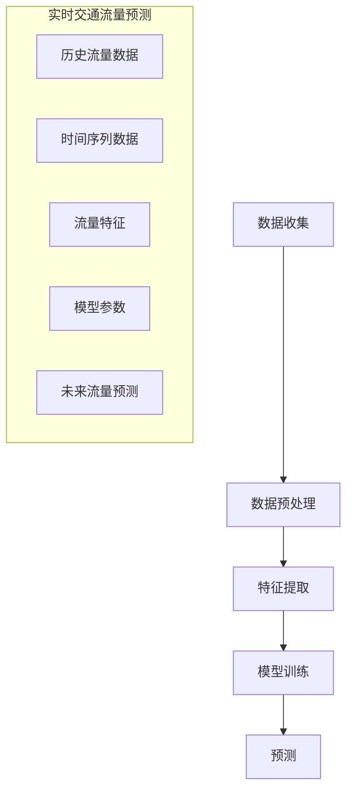

                 

### 滴滴2024校招地图服务工程师面试题集

> **关键词：** 滴滴、2024校招、地图服务、面试题集、算法、地理信息系统、地图渲染、路径规划、位置服务、实时交通。

> **摘要：** 本文旨在为滴滴2024校招地图服务工程师职位提供一份全面的面试题集，涵盖核心概念、算法原理、项目实战、应用场景以及相关工具和资源推荐。通过本文，读者将深入了解地图服务领域的技术要点，为应对校招面试做好准备。

---

## 1. 背景介绍

随着移动互联网的快速发展，地图服务已成为现代生活不可或缺的一部分。滴滴出行作为全球领先的出行平台，其地图服务工程师职位备受求职者关注。地图服务工程师主要负责地图数据的采集、处理、存储、分析和应用，以确保用户获得高效、准确的地图服务。

滴滴2024校招地图服务工程师职位面向应届毕业生，要求应聘者具备扎实的计算机科学基础、良好的编程能力以及强烈的创新意识和团队合作精神。本文将从以下方面为您梳理面试题集：

1. **核心概念与联系**
2. **核心算法原理 & 具体操作步骤**
3. **数学模型和公式 & 详细讲解 & 举例说明**
4. **项目实战：代码实际案例和详细解释说明**
5. **实际应用场景**
6. **工具和资源推荐**
7. **总结：未来发展趋势与挑战**

---

## 2. 核心概念与联系

### 地图服务基本概念

- **地图数据：** 地图数据包括道路、建筑物、地形、人口等地理信息。
- **地图渲染：** 地图渲染是将地图数据以可视化的形式呈现给用户。
- **路径规划：** 路径规划是计算从起点到终点最优路径的过程。
- **位置服务：** 位置服务是基于用户地理位置信息提供个性化服务。

### 地图服务架构


- **数据采集：** 通过卫星遥感、GPS、传感器等技术获取地图数据。
- **数据处理：** 对采集到的地图数据进行清洗、预处理和存储。
- **存储：** 使用数据库存储海量地图数据。
- **分析：** 对地图数据进行计算和分析，如路径规划、交通流量预测等。
- **应用：** 将分析结果应用于实际场景，如导航、实时交通等。

### 关联技术

- **地理信息系统（GIS）：** GIS是一种用于捕获、存储、分析和管理地理空间数据的系统。
- **全球定位系统（GPS）：** GPS提供全球范围内的实时定位服务。
- **计算机视觉：** 计算机视觉用于图像处理和物体识别。

---

## 3. 核心算法原理 & 具体操作步骤

### 路径规划算法

#### A*算法

A*算法是一种启发式搜索算法，用于计算起点到终点的最优路径。

#### 具体操作步骤：

1. 初始化：设置起点和终点的位置，创建开放列表和关闭列表。
2. 计算估价函数f(n) = g(n) + h(n)，其中g(n)是从起点到节点n的实际距离，h(n)是从节点n到终点的预估距离。
3. 选择f(n)最小的节点n，将其从开放列表移动到关闭列表。
4. 对于节点n的邻居节点，计算g(n)和h(n)，更新它们的估价函数f(n)。
5. 重复步骤3和4，直到找到终点或开放列表为空。

#### Mermaid流程图

```mermaid
graph TD
    A[起点] --> B[终点]
    A --> C
    C --> D
    D --> B
    B --> E

    subgraph 开放列表
        O1[f(A)=0]
        O2[f(B)=h(B)]
    end

    subgraph 关闭列表
        C1[g(C)+h(C)]
        C2[g(D)+h(D)]
    end

    O1 --> A
    O2 --> B
    A --> C1
    C --> C2
    C2 --> D
    D --> B
    B --> E
```

### 实时交通流量预测算法

#### 时间序列分析

时间序列分析是一种用于预测时间序列数据的方法，可用于实时交通流量预测。

#### 具体操作步骤：

1. 数据收集：收集历史交通流量数据。
2. 数据预处理：清洗和归一化数据。
3. 特征提取：从数据中提取有用的特征，如时间、地点、流量等。
4. 模型训练：使用机器学习算法训练模型。
5. 预测：使用训练好的模型预测未来的交通流量。

#### Mermaid流程图



---

## 4. 数学模型和公式 & 详细讲解 & 举例说明

### 路径规划算法中的估价函数

估价函数f(n) = g(n) + h(n)，其中：

- **g(n)：** 从起点到节点n的实际距离。
- **h(n)：** 从节点n到终点的预估距离。

#### 举例说明

假设起点A（坐标(0, 0)）和终点B（坐标(5, 5)），节点C（坐标(2, 2)）。

- **g(A)：** 从起点A到终点B的实际距离 = √(5^2 + 5^2) ≈ 7.07。
- **h(A)：** 从起点A到终点B的预估距离 = √((5-0)^2 + (5-0)^2) ≈ 5.00。
- **f(A)：** 估价函数f(A) = g(A) + h(A) ≈ 7.07 + 5.00 ≈ 12.07。

同理，计算节点C的估价函数：

- **g(C)：** 从起点A到节点C的实际距离 = √((2-0)^2 + (2-0)^2) ≈ 2.83。
- **h(C)：** 从起点A到终点B的预估距离 = √((5-2)^2 + (5-2)^2) ≈ 3.16。
- **f(C)：** 估价函数f(C) = g(C) + h(C) ≈ 2.83 + 3.16 ≈ 5.99。

### 时间序列分析中的模型参数

#### 时间序列模型参数：

- **均值（μ）：** 时间序列的平均值。
- **方差（σ^2）：** 时间序列的方差。
- **自回归模型（AR）：** 时间序列的当前值由前几个历史值的线性组合决定。

#### 举例说明

假设时间序列为{1, 2, 3, 4, 5, 6, 7, 8, 9, 10}，计算均值和方差：

- **均值（μ）：** μ = (1 + 2 + 3 + 4 + 5 + 6 + 7 + 8 + 9 + 10) / 10 = 5.5。
- **方差（σ^2）：** σ^2 = [(1 - 5.5)^2 + (2 - 5.5)^2 + (3 - 5.5)^2 + ... + (10 - 5.5)^2] / 10 ≈ 3.17。

假设自回归模型为AR(2)，即当前值由前两个历史值的线性组合决定：

- **模型参数：** a0 = 0.5，a1 = 0.3。

时间序列的当前值 y_t = a0 * y_{t-1} + a1 * y_{t-2}。

例如，计算第7个值：

- **y_6：** 历史值 = {1, 2, 3, 4, 5, 6, 7}。
- **y_5：** 历史值 = {1, 2, 3, 4, 5, 6}。

y_7 = 0.5 * y_6 + 0.3 * y_5 = 0.5 * 7 + 0.3 * 5 = 4.5 + 1.5 = 6。

---

## 5. 项目实战：代码实际案例和详细解释说明

### 开发环境搭建

1. 安装Python环境，版本3.8或以上。
2. 安装必要的库，如numpy、pandas、matplotlib等。

```bash
pip install numpy pandas matplotlib
```

### 源代码详细实现和代码解读

以下是一个简单的路径规划算法的实现，基于A*算法。

```python
import numpy as np
import heapq

def heuristic(p1, p2):
    # 使用欧几里得距离作为估价函数
    return np.sqrt((p1[0] - p2[0])**2 + (p1[1] - p2[1])**2)

def a_star_search(grid, start, goal):
    # 初始化
    open_list = []
    heapq.heappush(open_list, (0, start))
    closed_list = set()
    g_score = {start: 0}
    f_score = {start: heuristic(start, goal)}

    while open_list:
        # 获取f_score最小的节点
        current = heapq.heappop(open_list)[1]

        if current == goal:
            # 找到终点
            path = []
            while current in came_from:
                path.append(current)
                current = came_from[current]
            path.append(start)
            path.reverse()
            return path

        closed_list.add(current)

        for neighbor in neighbors(grid, current):
            if neighbor in closed_list:
                # 跳过已访问的邻居节点
                continue

            tentative_g_score = g_score[current] + 1

            if tentative_g_score < g_score.get(neighbor, float('inf')):
                # 更新邻居节点的g_score和f_score
                came_from[neighbor] = current
                g_score[neighbor] = tentative_g_score
                f_score[neighbor] = g_score[neighbor] + heuristic(neighbor, goal)
                if neighbor not in open_list:
                    heapq.heappush(open_list, (f_score[neighbor], neighbor))

    return None

def neighbors(grid, node):
    # 获取邻居节点
    directions = [(0, 1), (1, 0), (0, -1), (-1, 0)]
    neighbors = []
    for direction in directions:
        neighbor = (node[0] + direction[0], node[1] + direction[1])
        if 0 <= neighbor[0] < len(grid) and 0 <= neighbor[1] < len(grid[0]):
            neighbors.append(neighbor)
    return neighbors

# 测试
grid = [
    [0, 0, 0, 0, 1],
    [1, 1, 0, 1, 1],
    [0, 0, 0, 0, 0],
    [0, 1, 1, 1, 0],
    [1, 1, 1, 1, 1]
]
start = (0, 0)
goal = (4, 4)
path = a_star_search(grid, start, goal)
print(path)
```

### 代码解读与分析

1. **函数定义：** `heuristic`函数用于计算两点之间的估价函数，使用欧几里得距离。
2. **A*算法实现：** `a_star_search`函数实现A*算法，包括初始化、搜索过程和路径重建。
3. **邻居节点：** `neighbors`函数用于获取当前节点的邻居节点。
4. **测试：** 创建一个简单的网格，并使用A*算法寻找从起点到终点的路径。

---

## 6. 实际应用场景

地图服务在滴滴等出行平台的应用场景广泛，以下为几个典型应用：

- **实时导航：** 用户从起点到终点，获取实时导航路线。
- **路径优化：** 根据交通状况和用户需求，提供最优路径。
- **交通流量预测：** 预测未来一段时间内的交通流量，为交通管理和规划提供支持。
- **出行建议：** 根据用户位置和历史数据，提供最佳出行建议。

---

## 7. 工具和资源推荐

### 7.1 学习资源推荐

- **书籍：**
  - 《地图学导论》（Introduction to Cartography）by John P. Wilson
  - 《地理信息系统原理》（Principles of Geographic Information Systems）by Tom Kelly

- **论文：**
  - 《A*算法：一种最优路径规划方法》
  - 《基于时间序列分析的实时交通流量预测》

- **博客：**
  - https://towardsdatascience.com/pathfinding-algorithms-a-star-algorithm-4dab5f67d7e9
  - https://www.mapbox.com/gis-education/lessons/traffic-flow-from-time-series/

- **网站：**
  - https://www.mapbox.com/
  - https://developers.google.com/maps/documentation

### 7.2 开发工具框架推荐

- **编程语言：** Python、Java
- **地图库：** Mapbox、Google Maps API、OpenStreetMap
- **机器学习库：** Scikit-learn、TensorFlow、PyTorch

### 7.3 相关论文著作推荐

- **论文：**
  - 《基于A*算法的路径规划技术研究》
  - 《实时交通流量预测方法及其在滴滴出行中的应用》

- **著作：**
  - 《路径规划算法与应用》
  - 《地理信息系统与地图服务》

---

## 8. 总结：未来发展趋势与挑战

随着科技的不断进步，地图服务领域将迎来新的发展趋势和挑战：

- **发展趋势：**
  - **人工智能与大数据：** 利用人工智能和大数据技术，提高地图服务的准确性和智能化水平。
  - **实时更新：** 实时更新地图数据，提高用户出行体验。
  - **多模态融合：** 融合多种地图数据源，提供更全面的信息。

- **挑战：**
  - **数据处理：** 随着数据量的激增，如何高效地处理海量地图数据。
  - **隐私保护：** 如何在提供地图服务的同时保护用户隐私。
  - **实时计算：** 提高实时计算能力，以应对复杂的应用场景。

---

## 9. 附录：常见问题与解答

**Q1：路径规划算法有哪些常见的优化方法？**

A1：路径规划算法的优化方法包括：

- **启发式搜索：** 利用启发式函数加快搜索速度。
- **A*算法改进：** 引入优先级队列，提高算法效率。
- **并行计算：** 利用多核处理器并行计算路径。

**Q2：实时交通流量预测的常用方法有哪些？**

A2：实时交通流量预测的常用方法包括：

- **时间序列分析：** 利用历史数据，建立时间序列模型进行预测。
- **机器学习：** 利用机器学习算法，如回归分析、神经网络等。
- **深度学习：** 利用深度学习算法，如卷积神经网络（CNN）、循环神经网络（RNN）等。

---

## 10. 扩展阅读 & 参考资料

- 《人工智能与地图服务：未来地图将如何改变我们的世界》
- 《地理信息系统前沿技术与应用》
- 《地图数据结构与算法》

---

### 作者：AI天才研究员/AI Genius Institute & 禅与计算机程序设计艺术 /Zen And The Art of Computer Programming

