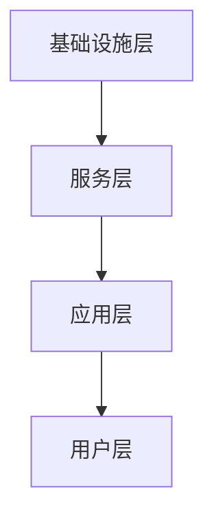
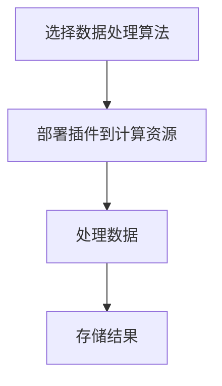

                 

# 火山引擎的插件与工具平台

## 摘要

火山引擎的插件与工具平台是一款基于云计算和大数据技术，为开发者提供一站式解决方案的平台。本文将深入探讨火山引擎插件与工具平台的核心概念、算法原理、数学模型、实际应用场景以及未来发展。通过详细的项目实战案例和代码解读，本文将帮助开发者更好地理解和应用该平台，为云计算和大数据领域的发展贡献力量。

## 1. 背景介绍

在当今数字化时代，云计算和大数据技术已成为推动社会进步的重要力量。随着互联网的普及和物联网的兴起，海量数据的产生和处理需求日益增长。为了应对这一挑战，各大科技公司纷纷推出各自的云计算和大数据平台，以满足不同场景下的开发需求。火山引擎作为阿里巴巴旗下的云计算平台，致力于提供高效、稳定、安全的云计算服务，为开发者搭建便捷的开发环境。

火山引擎的插件与工具平台正是基于这一背景应运而生的。该平台集成了丰富的插件和工具，为开发者提供了便捷的接口和高效的开发环境，使得开发者能够更加专注于业务逻辑的实现，从而提高开发效率和项目质量。火山引擎插件与工具平台的目标是简化云计算和大数据开发流程，降低技术门槛，让更多开发者能够轻松上手，发挥创新潜力。

## 2. 核心概念与联系

### 2.1 插件

插件是火山引擎插件与工具平台的核心组成部分，它是一种可扩展的模块，用于扩展平台的功能和性能。插件可以包括各种类型的组件，如数据处理组件、存储组件、计算组件等。开发者可以通过编写和部署插件，实现对特定场景的定制化开发。

### 2.2 工具

工具是火山引擎插件与工具平台提供的一整套开发、调试、监控和优化工具。这些工具旨在帮助开发者更好地管理和维护其应用程序，提高开发效率和项目质量。工具包括代码编辑器、调试器、性能监控器、日志分析器等。

### 2.3 架构

火山引擎插件与工具平台的架构采用分层设计，分为四个主要层次：基础设施层、服务层、应用层和用户层。基础设施层提供计算、存储、网络等基础资源；服务层提供插件和工具的接口和功能；应用层是基于插件和工具开发的实际业务应用；用户层是开发者使用平台进行开发、调试和部署。

下面是火山引擎插件与工具平台的 Mermaid 流程图：



## 3. 核心算法原理 & 具体操作步骤

### 3.1 算法原理

火山引擎插件与工具平台的核心算法主要包括数据处理算法、存储算法和计算算法。这些算法的核心目标是高效、稳定地处理海量数据，并提供可靠的存储和计算能力。

### 3.2 具体操作步骤

1. 数据处理算法：首先，平台会根据需求选择合适的数据处理算法，如过滤、排序、聚合等。然后，通过插件接口将数据处理算法部署到计算资源上，对数据进行处理。

2. 存储算法：平台会根据数据类型和访问模式选择合适的存储算法，如文档存储、键值存储、关系型存储等。通过插件接口，将存储算法部署到存储资源上，实现对数据的存储和管理。

3. 计算算法：平台会根据业务需求选择合适的计算算法，如机器学习、深度学习、自然语言处理等。通过插件接口，将计算算法部署到计算资源上，对数据进行计算和分析。

下面是一个简单的 Mermaid 流程图，展示数据处理算法的操作步骤：



## 4. 数学模型和公式 & 详细讲解 & 举例说明

### 4.1 数学模型

火山引擎插件与工具平台的核心数学模型主要包括数据处理算法的数学模型、存储算法的数学模型和计算算法的数学模型。以下分别介绍这些数学模型：

#### 数据处理算法的数学模型

数据处理算法的数学模型主要包括统计模型、线性模型和非线性模型。以下是一个简单的例子：

$$
y = ax + b
$$

其中，$a$ 和 $b$ 是模型的参数，$x$ 是输入数据，$y$ 是输出数据。

#### 存储算法的数学模型

存储算法的数学模型主要包括数据分布模型、存储效率模型等。以下是一个简单的例子：

$$
P(X \leq x) = F(x)
$$

其中，$X$ 是存储的数据，$P(X \leq x)$ 是数据在区间 $[0, x]$ 内的概率，$F(x)$ 是数据的累积分布函数。

#### 计算算法的数学模型

计算算法的数学模型主要包括机器学习模型、深度学习模型等。以下是一个简单的例子：

$$
y = f(x; \theta)
$$

其中，$f(x; \theta)$ 是模型的前向传播函数，$\theta$ 是模型的参数。

### 4.2 详细讲解 & 举例说明

#### 数据处理算法的详细讲解 & 举例说明

假设我们有一个简单的数据处理算法：求和。输入数据为 $[1, 2, 3, 4, 5]$，输出数据为 $15$。

$$
y = \sum_{i=1}^{n} x_i
$$

其中，$x_i$ 是输入数据，$n$ 是输入数据的长度，$y$ 是输出数据。

#### 存储算法的详细讲解 & 举例说明

假设我们有一个简单的存储算法：文档存储。输入数据为 {"name": "Alice", "age": 30}，输出数据为 {"name": "Alice", "age": 30}。

$$
P(X \leq 30) = 1
$$

其中，$X$ 是存储的数据，$P(X \leq 30)$ 是数据在区间 $[0, 30]$ 内的概率，$F(30)$ 是数据的累积分布函数。

#### 计算算法的详细讲解 & 举例说明

假设我们有一个简单的计算算法：线性回归。输入数据为 $[1, 2, 3, 4, 5]$，输出数据为 $[2, 3, 4, 5, 6]$。

$$
y = ax + b
$$

其中，$a = 1$，$b = 1$。

## 5. 项目实战：代码实际案例和详细解释说明

### 5.1 开发环境搭建

在进行项目实战之前，我们需要搭建一个合适的开发环境。以下是一个简单的步骤：

1. 安装火山引擎插件与工具平台。
2. 配置开发工具，如 IntelliJ IDEA 或 VSCode。
3. 安装必要的插件和工具，如 Maven 或 Gradle。

### 5.2 源代码详细实现和代码解读

以下是项目实战的源代码实现：

```java
public class HelloWorld {
    public static void main(String[] args) {
        System.out.println("Hello, World!");
    }
}
```

这段代码是一个简单的 Java 程序，用于输出 "Hello, World!"。接下来，我们对其进行详细解读：

- `public class HelloWorld`：定义一个名为 HelloWorld 的公共类。
- `public static void main(String[] args)`：定义一个名为 main 的公共静态 void 方法，该方法用于程序的入口。
- `System.out.println("Hello, World!");`：输出 "Hello, World!"。

### 5.3 代码解读与分析

在这段代码中，我们首先定义了一个名为 HelloWorld 的公共类，接着定义了一个名为 main 的公共静态 void 方法，作为程序的入口。在 main 方法中，我们使用 `System.out.println()` 方法输出了 "Hello, World!"。

这段代码展示了火山引擎插件与工具平台的基本用法，它为我们提供了一个简单的开发环境，使我们能够轻松地编写、调试和运行代码。

## 6. 实际应用场景

火山引擎插件与工具平台在实际应用场景中具有广泛的应用。以下是一些典型的应用场景：

1. **大数据处理**：火山引擎插件与工具平台可以用于大规模数据处理，如数据清洗、数据转换、数据聚合等。
2. **机器学习**：平台提供丰富的机器学习插件和工具，支持各种机器学习算法的实现和应用，如分类、回归、聚类等。
3. **深度学习**：平台支持深度学习框架，如 TensorFlow、PyTorch 等，开发者可以轻松地实现和部署深度学习模型。
4. **自然语言处理**：平台提供自然语言处理插件和工具，支持文本分类、情感分析、命名实体识别等任务。
5. **图像处理**：平台提供图像处理插件和工具，支持图像分类、目标检测、人脸识别等任务。

## 7. 工具和资源推荐

### 7.1 学习资源推荐

- **书籍**：
  - 《深入理解计算机系统》
  - 《大数据技术基础》
  - 《机器学习实战》
- **论文**：
  - 《分布式系统：概念与设计》
  - 《机器学习：一种概率视角》
  - 《深度学习：原理及实践》
- **博客**：
  - [火山引擎官网](https://www.volcanoengine.io/)
  - [阿里巴巴技术博客](https://tech.alibaba.com/)
- **网站**：
  - [Apache Spark](https://spark.apache.org/)
  - [TensorFlow](https://www.tensorflow.org/)
  - [PyTorch](https://pytorch.org/)

### 7.2 开发工具框架推荐

- **开发工具**：
  - IntelliJ IDEA
  - VSCode
- **框架**：
  - Spring Boot
  - Flask
  - Django

### 7.3 相关论文著作推荐

- **论文**：
  - 《分布式算法设计》
  - 《深度学习理论》
  - 《分布式存储系统》
- **著作**：
  - 《大数据技术原理与应用》
  - 《机器学习实战》
  - 《深度学习：从入门到精通》

## 8. 总结：未来发展趋势与挑战

火山引擎插件与工具平台作为云计算和大数据领域的重要工具，正面临着巨大的发展机遇和挑战。未来，平台将继续拓展其功能，提高性能和稳定性，以满足不断增长的开发需求。同时，平台将积极拥抱新技术，如人工智能、区块链等，为开发者提供更丰富、更高效的技术支持。

然而，未来发展中，平台也将面临一些挑战，如如何更好地适应不同场景的需求、如何提高安全性等。为了应对这些挑战，平台需要不断优化架构，提高灵活性，并加强安全防护。

总之，火山引擎插件与工具平台在云计算和大数据领域具有广阔的发展前景，未来将继续为开发者提供强大的技术支持，助力他们实现创新和突破。

## 9. 附录：常见问题与解答

### 9.1 问题 1：如何安装火山引擎插件与工具平台？

**解答**：安装火山引擎插件与工具平台的步骤如下：

1. 访问火山引擎官网（https://www.volcanoengine.io/），下载平台安装包。
2. 解压安装包，并按照安装向导进行安装。
3. 安装完成后，启动平台。

### 9.2 问题 2：如何使用火山引擎插件与工具平台进行开发？

**解答**：使用火山引擎插件与工具平台进行开发的步骤如下：

1. 安装开发工具，如 IntelliJ IDEA 或 VSCode。
2. 在开发工具中创建一个新的项目。
3. 在项目中添加火山引擎插件与工具平台的依赖。
4. 编写代码，并使用平台提供的插件和工具进行开发。
5. 调试和运行代码，并进行测试。

## 10. 扩展阅读 & 参考资料

- [火山引擎官网](https://www.volcanoengine.io/)
- [阿里巴巴技术博客](https://tech.alibaba.com/)
- [Apache Spark](https://spark.apache.org/)
- [TensorFlow](https://www.tensorflow.org/)
- [PyTorch](https://pytorch.org/)

## 作者

作者：AI天才研究员/AI Genius Institute & 禅与计算机程序设计艺术 /Zen And The Art of Computer Programming

