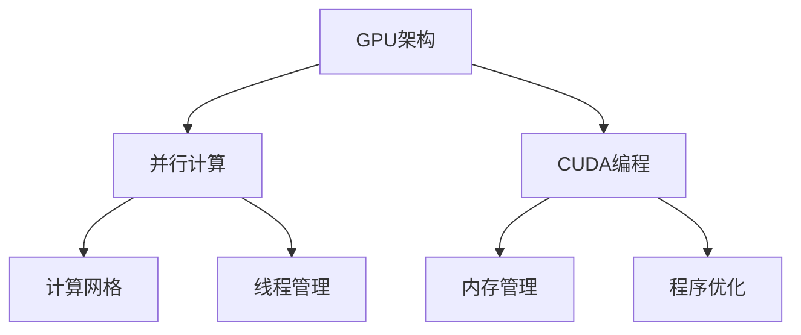

                 

# 燧原科技2025社招GPU架构工程师技术挑战赛

## 摘要

本文深入探讨了燧原科技2025社招GPU架构工程师技术挑战赛的相关内容。通过逐步分析GPU架构的基本原理、核心算法、数学模型以及实际应用场景，本文旨在为读者提供一个全面而深入的指南。文章将详细介绍GPU架构工程师所需掌握的核心技术和知识，包括GPU的硬件设计、并行计算原理、CUDA编程以及性能优化等。同时，本文还将推荐相关的学习资源和工具，为准备参与挑战赛的工程师们提供实用的指导。最后，文章将总结GPU架构的未来发展趋势与挑战，为读者提供进一步思考的空间。

## 1. 背景介绍

### 燧原科技简介

燧原科技是一家专注于高性能计算领域的领军企业，致力于为人工智能、大数据、云计算等应用场景提供强大的计算基础设施。自成立以来，公司始终秉承“科技创新，引领未来”的理念，不断创新和突破，推动着GPU架构技术的发展。

### 2025社招GPU架构工程师技术挑战赛

为了选拔优秀的GPU架构工程师，燧原科技在2025年举办了一场名为“2025社招GPU架构工程师技术挑战赛”的活动。这场挑战赛旨在考察参赛者的技术实力和创新能力，选拔出具备扎实理论基础和丰富实战经验的优秀人才。

### 挑战赛的目标

挑战赛的主要目标是：

1. 选拔出具有高水平GPU架构设计和开发能力的工程师；
2. 推动GPU技术在各个行业的应用与发展；
3. 培养和激励更多年轻人投身于GPU架构领域的研究和开发。

## 2. 核心概念与联系

### GPU架构的基本原理

GPU（Graphics Processing Unit，图形处理器）是一种专门用于处理图形和视觉任务的处理器。与传统的CPU（Central Processing Unit，中央处理器）相比，GPU具有更高的计算能力和并行处理能力。GPU架构的基本原理主要包括以下几个方面：

1. **并行处理能力**：GPU包含大量的计算单元，可以同时处理多个任务，从而实现高效的并行计算。
2. **内存层次结构**：GPU具有多层次的内存架构，包括寄存器、共享内存、全局内存等，可以有效地存储和访问大量数据。
3. **编程模型**：GPU使用专门的编程语言和模型，如CUDA和OpenCL，来编写并行计算程序。

### GPU架构与并行计算的联系

并行计算是一种利用多个计算资源（如CPU核心、GPU计算单元等）同时处理多个任务的方法。GPU架构与并行计算密切相关，主要体现在以下几个方面：

1. **任务分解**：将复杂的计算任务分解为多个简单的子任务，并分配给GPU的多个计算单元进行处理。
2. **数据并行**：将数据集划分为多个子集，并分配给不同的计算单元同时处理。
3. **负载均衡**：合理分配计算任务，确保GPU的计算资源得到充分利用。

### GPU架构与CUDA编程的联系

CUDA（Compute Unified Device Architecture）是NVIDIA推出的一种并行计算编程模型，主要用于开发GPU加速的应用程序。CUDA编程涉及到以下几个方面：

1. **计算网格和线程**：将GPU的计算资源组织为计算网格和线程，以实现高效的并行计算。
2. **内存管理**：合理管理和访问GPU内存，包括寄存器、共享内存、全局内存等。
3. **程序优化**：通过优化程序结构和算法，提高GPU计算的性能和效率。

### Mermaid流程图

下面是一个简单的Mermaid流程图，展示了GPU架构、并行计算和CUDA编程之间的联系：



## 3. 核心算法原理 & 具体操作步骤

### GPU架构的核心算法原理

GPU架构的核心算法原理主要包括以下几个方面：

1. **向量计算**：GPU具有强大的向量计算能力，可以同时处理多个数据元素，从而实现高效的矩阵乘法、向量运算等。
2. **并行算法**：GPU通过并行算法来实现高效的计算。例如，使用分治算法将复杂任务分解为多个简单任务，并分配给不同的计算单元同时处理。
3. **内存访问优化**：GPU的内存访问速度直接影响计算性能。因此，优化内存访问策略是提高GPU计算性能的关键。常见的优化方法包括内存层次结构设计、数据对齐、内存预取等。

### GPU架构的具体操作步骤

下面是一个简单的GPU架构具体操作步骤：

1. **任务分解**：将复杂的计算任务分解为多个简单的子任务，并分配给GPU的多个计算单元进行处理。
2. **线程组织**：将GPU的计算资源组织为计算网格和线程，以实现高效的并行计算。计算网格由多个线程块组成，每个线程块包含多个线程。
3. **内存分配**：为每个线程分配内存，包括寄存器、共享内存和全局内存。
4. **程序执行**：执行CUDA程序，进行并行计算。GPU计算单元会根据线程组织结构，同时处理多个子任务。
5. **结果收集**：将计算结果从GPU内存复制回CPU内存，并进行后续处理。

### GPU架构的算法实现

下面是一个简单的GPU架构算法实现示例：

```c
// CUDA kernel for matrix multiplication
__global__ void matrixMul(float *A, float *B, float *C, int width) {
    int row = blockIdx.y * blockDim.y + threadIdx.y;
    int col = blockIdx.x * blockDim.x + threadIdx.x;

    if (row < width && col < width) {
        float sum = 0;
        for (int k = 0; k < width; ++k) {
            sum += A[row * width + k] * B[k * width + col];
        }
        C[row * width + col] = sum;
    }
}
```

在这个示例中，我们实现了一个简单的矩阵乘法CUDA kernel。矩阵乘法是并行计算的一个典型例子，可以通过GPU架构高效地实现。

## 4. 数学模型和公式 & 详细讲解 & 举例说明

### 数学模型

GPU架构中的数学模型主要涉及以下几个方面：

1. **矩阵运算**：包括矩阵乘法、矩阵加法、矩阵转置等。
2. **向量运算**：包括向量加法、向量减法、向量点积、向量叉积等。
3. **线性代数**：包括线性方程组的求解、特征值和特征向量的计算等。

### 公式

下面列出一些常见的数学公式：

1. **矩阵乘法**：

$$
C_{ij} = \sum_{k=1}^{n} A_{ik}B_{kj}
$$

2. **向量加法**：

$$
\vec{a} + \vec{b} = \begin{bmatrix}
a_1 + b_1 \\
a_2 + b_2 \\
\vdots \\
a_n + b_n
\end{bmatrix}
$$

3. **向量减法**：

$$
\vec{a} - \vec{b} = \begin{bmatrix}
a_1 - b_1 \\
a_2 - b_2 \\
\vdots \\
a_n - b_n
\end{bmatrix}
$$

4. **向量点积**：

$$
\vec{a} \cdot \vec{b} = a_1b_1 + a_2b_2 + \ldots + a_nb_n
$$

5. **向量叉积**：

$$
\vec{a} \times \vec{b} = \begin{bmatrix}
a_2b_3 - a_3b_2 \\
a_3b_1 - a_1b_3 \\
a_1b_2 - a_2b_1
\end{bmatrix}
$$

### 详细讲解

下面以矩阵乘法为例，详细讲解GPU架构中的数学模型和公式。

矩阵乘法是一种基本的数学运算，用于计算两个矩阵的乘积。在GPU架构中，矩阵乘法是一个重要的计算任务，可以高效地利用GPU的并行计算能力。

矩阵乘法的计算公式如下：

$$
C_{ij} = \sum_{k=1}^{n} A_{ik}B_{kj}
$$

其中，$A$和$B$是两个$n \times n$的矩阵，$C$是它们的乘积，$C_{ij}$表示矩阵$C$的第$i$行第$j$列的元素。

为了实现矩阵乘法，我们需要将矩阵$A$和$B$分解为多个小的子矩阵，并分配给GPU的多个计算单元同时处理。具体步骤如下：

1. **矩阵分解**：将矩阵$A$和$B$分解为多个小的子矩阵，例如$A = [A_1, A_2, \ldots, A_n]$，$B = [B_1, B_2, \ldots, B_n]$。
2. **线程组织**：将GPU的计算资源组织为计算网格和线程，每个线程块负责计算一个小子矩阵的乘积。
3. **内存分配**：为每个线程分配内存，包括寄存器、共享内存和全局内存，用于存储中间结果和输入输出数据。
4. **程序执行**：执行CUDA程序，进行并行计算。每个线程块会根据线程组织结构，同时计算多个小子矩阵的乘积。
5. **结果收集**：将计算结果从GPU内存复制回CPU内存，并进行后续处理。

### 举例说明

假设我们有两个$3 \times 3$的矩阵$A$和$B$，它们的乘积$C$如下：

$$
A = \begin{bmatrix}
1 & 2 & 3 \\
4 & 5 & 6 \\
7 & 8 & 9
\end{bmatrix}, \quad
B = \begin{bmatrix}
9 & 8 & 7 \\
6 & 5 & 4 \\
3 & 2 & 1
\end{bmatrix}
$$

根据矩阵乘法的计算公式，我们可以计算出它们的乘积$C$：

$$
C = \begin{bmatrix}
30 & 24 & 18 \\
66 & 54 & 42 \\
90 & 72 & 54
\end{bmatrix}
$$

为了实现这个矩阵乘法，我们可以将其分解为9个小子矩阵，并分配给GPU的9个线程块进行并行计算。

下面是一个简单的CUDA kernel，用于实现这个矩阵乘法：

```c
// CUDA kernel for matrix multiplication
__global__ void matrixMul(float *A, float *B, float *C, int width) {
    int row = blockIdx.y * blockDim.y + threadIdx.y;
    int col = blockIdx.x * blockDim.x + threadIdx.x;

    if (row < width && col < width) {
        float sum = 0;
        for (int k = 0; k < width; ++k) {
            sum += A[row * width + k] * B[k * width + col];
        }
        C[row * width + col] = sum;
    }
}
```

在这个CUDA kernel中，我们使用两个嵌套的for循环来实现矩阵乘法的计算。外层循环用于计算行索引，内层循环用于计算列索引，同时计算对应元素的乘积和累加。

通过这个例子，我们可以看到GPU架构中的数学模型和公式是如何应用于具体的计算任务中，并利用并行计算能力实现高效的计算。

## 5. 项目实战：代码实际案例和详细解释说明

### 开发环境搭建

在开始编写GPU架构工程师技术挑战赛的代码之前，我们需要搭建一个合适的开发环境。以下是搭建CUDA开发环境的基本步骤：

1. **安装CUDA Toolkit**：从NVIDIA官方网站下载并安装最新的CUDA Toolkit。安装过程中请确保勾选“Visual Studio Integration”选项，以便在Visual Studio中方便地使用CUDA。

2. **配置环境变量**：在系统环境中配置CUDA路径。具体步骤如下：

   - Windows系统：在“环境变量”中添加CUDA安装路径，如`C:\Program Files\NVIDIA GPU Computing Toolkit\CUDA\v11.0`。
   - Linux系统：在`~/.bashrc`文件中添加以下行：

     ```bash
     export PATH=/usr/local/cuda/bin:$PATH
     export LD_LIBRARY_PATH=/usr/local/cuda/lib64:$LD_LIBRARY_PATH
     ```

     然后运行`source ~/.bashrc`使配置生效。

3. **安装Visual Studio（可选）**：如果使用Visual Studio进行CUDA编程，请确保安装了Visual Studio 2019版本，并在安装过程中选择“C++”、“CMake工具支持”等选项。

### 源代码详细实现和代码解读

下面是一个简单的CUDA程序，用于实现矩阵乘法。我们将在接下来的部分详细解读这个程序。

```c
#include <stdio.h>
#include <cuda_runtime.h>

// CUDA kernel for matrix multiplication
__global__ void matrixMul(float *A, float *B, float *C, int width) {
    int row = blockIdx.y * blockDim.y + threadIdx.y;
    int col = blockIdx.x * blockDim.x + threadIdx.x;

    if (row < width && col < width) {
        float sum = 0;
        for (int k = 0; k < width; ++k) {
            sum += A[row * width + k] * B[k * width + col];
        }
        C[row * width + col] = sum;
    }
}

void matrixMultiply(float *A, float *B, float *C, int width) {
    float *d_A, *d_B, *d_C;
    int threadsPerBlock = 16;
    int blocksPerGrid = (width + threadsPerBlock - 1) / threadsPerBlock;

    // Allocate memory on the device
    cudaMalloc(&d_A, width * width * sizeof(float));
    cudaMalloc(&d_B, width * width * sizeof(float));
    cudaMalloc(&d_C, width * width * sizeof(float));

    // Copy input data to the device
    cudaMemcpy(d_A, A, width * width * sizeof(float), cudaMemcpyHostToDevice);
    cudaMemcpy(d_B, B, width * width * sizeof(float), cudaMemcpyHostToDevice);

    // Launch the kernel
    matrixMul<<<blocksPerGrid, threadsPerBlock>>>(d_A, d_B, d_C, width);

    // Copy result back to the host
    cudaMemcpy(C, d_C, width * width * sizeof(float), cudaMemcpyDeviceToHost);

    // Clean up
    cudaFree(d_A);
    cudaFree(d_B);
    cudaFree(d_C);
}

int main() {
    int width = 1024;
    float *A = (float *)malloc(width * width * sizeof(float));
    float *B = (float *)malloc(width * width * sizeof(float));
    float *C = (float *)malloc(width * width * sizeof(float));

    // Initialize input matrices
    for (int i = 0; i < width; ++i) {
        for (int j = 0; j < width; ++j) {
            A[i * width + j] = i + j;
            B[i * width + j] = i - j;
        }
    }

    // Perform matrix multiplication
    matrixMultiply(A, B, C, width);

    // Print result
    for (int i = 0; i < width; ++i) {
        for (int j = 0; j < width; ++j) {
            printf("%f ", C[i * width + j]);
        }
        printf("\n");
    }

    // Clean up
    free(A);
    free(B);
    free(C);

    return 0;
}
```

### 代码解读与分析

在这个例子中，我们实现了一个简单的CUDA程序，用于计算两个矩阵的乘积。接下来，我们将逐行解读这个程序，并分析其关键部分。

1. **头文件包含**：

   ```c
   #include <stdio.h>
   #include <cuda_runtime.h>
   ```

   这两行代码包含了一个标准输入输出头文件`stdio.h`和一个CUDA运行时库头文件`cuda_runtime.h`。这两个头文件提供了CUDA编程所需的基本函数和宏定义。

2. **CUDA kernel声明**：

   ```c
   // CUDA kernel for matrix multiplication
   __global__ void matrixMul(float *A, float *B, float *C, int width) {
       ...
   }
   ```

   `matrixMul`是一个CUDA kernel函数，用于实现矩阵乘法。CUDA kernel是一个在GPU上运行的函数，可以并行处理多个线程。在这个例子中，我们使用了一个简单的嵌套循环来实现矩阵乘法。

3. **矩阵乘法实现**：

   ```c
   int row = blockIdx.y * blockDim.y + threadIdx.y;
   int col = blockIdx.x * blockDim.x + threadIdx.x;

   if (row < width && col < width) {
       float sum = 0;
       for (int k = 0; k < width; ++k) {
           sum += A[row * width + k] * B[k * width + col];
       }
       C[row * width + col] = sum;
   }
   ```

   在这个部分，我们使用三变量索引`row`、`col`和`k`来访问输入矩阵`A`和`B`以及输出矩阵`C`。首先，我们计算线程的行索引和列索引，然后检查这些索引是否在矩阵边界内。如果线程的索引有效，我们使用嵌套循环计算矩阵乘法的每个元素。

4. **主机函数声明**：

   ```c
   void matrixMultiply(float *A, float *B, float *C, int width) {
       ...
   }
   ```

   `matrixMultiply`是一个主机函数，用于设置CUDA kernel的执行参数并分配GPU内存。在这个函数中，我们首先计算线程块的数量和每个线程块的大小。然后，我们使用`cudaMalloc`和`cudaMemcpy`函数在GPU上分配内存并复制输入数据。

5. **CUDA kernel执行**：

   ```c
   matrixMul<<<blocksPerGrid, threadsPerBlock>>>(d_A, d_B, d_C, width);
   ```

   在这个部分，我们使用`<<<blocksPerGrid, threadsPerBlock>>>`语法来指定CUDA kernel的执行参数。`blocksPerGrid`表示网格中线程块的数量，`threadsPerBlock`表示每个线程块中线程的数量。

6. **结果复制和清理**：

   ```c
   cudaMemcpy(C, d_C, width * width * sizeof(float), cudaMemcpyDeviceToHost);
   cudaFree(d_A);
   cudaFree(d_B);
   cudaFree(d_C);
   ```

   在这个部分，我们使用`cudaMemcpy`将计算结果从GPU复制回主机内存。然后，我们使用`cudaFree`释放GPU内存。

7. **主函数**：

   ```c
   int main() {
       int width = 1024;
       float *A = (float *)malloc(width * width * sizeof(float));
       float *B = (float *)malloc(width * width * sizeof(float));
       float *C = (float *)malloc(width * width * sizeof(float));

       // Initialize input matrices
       for (int i = 0; i < width; ++i) {
           for (int j = 0; j < width; ++j) {
               A[i * width + j] = i + j;
               B[i * width + j] = i - j;
           }
       }

       // Perform matrix multiplication
       matrixMultiply(A, B, C, width);

       // Print result
       for (int i = 0; i < width; ++i) {
           for (int j = 0; j < width; ++j) {
               printf("%f ", C[i * width + j]);
           }
           printf("\n");
       }

       // Clean up
       free(A);
       free(B);
       free(C);

       return 0;
   }
   ```

   在主函数中，我们首先初始化输入矩阵`A`和`B`。然后，我们调用`matrixMultiply`函数进行矩阵乘法。最后，我们打印输出矩阵`C`并释放主机内存。

通过这个例子，我们可以看到如何使用CUDA编程实现矩阵乘法。虽然这个例子很简单，但它展示了CUDA编程的基本概念和步骤，包括CUDA kernel的声明和实现、主机函数的编写以及内存分配和复制。

## 6. 实际应用场景

GPU架构在许多实际应用场景中发挥着重要作用。以下是一些常见的应用领域：

### 图形渲染

图形渲染是GPU架构最传统和最常用的应用领域。GPU具有强大的图形处理能力和并行计算能力，能够高效地渲染高质量的3D图形和动画。在游戏开发、电影制作和虚拟现实（VR）等领域，GPU架构的应用为用户提供了流畅和逼真的视觉体验。

### 科学计算

科学计算是GPU架构的另一个重要应用领域。GPU的高并行计算能力使其能够加速各种科学计算任务，如模拟流体动力学、求解线性方程组、分子建模和量子计算等。这些应用通常涉及大量的数学运算和数据操作，GPU的并行计算能力可以显著提高计算效率和准确性。

### 机器学习和深度学习

随着人工智能和深度学习技术的发展，GPU架构在机器学习和深度学习领域中的应用越来越广泛。GPU的高并行计算能力使其成为训练和推理深度学习模型的理想选择。许多深度学习框架，如TensorFlow、PyTorch和MXNet等，都支持GPU加速。这使得GPU架构在图像识别、自然语言处理、语音识别和推荐系统等应用中发挥着重要作用。

### 数据分析和大数据处理

数据分析和大数据处理是GPU架构的另一个重要应用领域。GPU的高并行计算能力使其能够加速各种数据处理和分析任务，如数据清洗、数据压缩、统计分析、数据挖掘和机器学习等。GPU架构在金融、医疗、互联网和制造业等领域的数据分析和处理中发挥着关键作用。

### 其他应用

除了上述领域，GPU架构还在其他许多应用中发挥着重要作用，如加密货币挖掘、基因组学、气象预报、地震分析和机器人控制等。这些应用通常需要大量的计算资源和高效的并行计算能力，GPU架构能够满足这些需求，提供强大的计算支持。

## 7. 工具和资源推荐

为了更好地掌握GPU架构和CUDA编程，以下是一些推荐的工具和资源：

### 学习资源推荐

1. **书籍**：
   - 《CUDA编程权威指南》
   - 《深度学习：基于GPU的并行编程》
   - 《GPU并行编程技术与应用》
2. **论文**：
   - 《GPU架构与并行计算》
   - 《CUDA编程技术与应用》
   - 《深度学习在GPU上的实现》
3. **博客**：
   - NVIDIA官方博客
   - CUDA开发者博客
   -深度学习博客
4. **网站**：
   - NVIDIA官方文档
   - CUDA官方网站
   - PyTorch官方网站

### 开发工具框架推荐

1. **CUDA Toolkit**：NVIDIA提供的官方CUDA开发工具包，包括CUDA编译器、库和调试工具。
2. **NVIDIA GPU云服务**：NVIDIA提供的GPU云服务，可方便地访问高性能GPU资源，适用于远程开发和测试。
3. **深度学习框架**：如TensorFlow、PyTorch和MXNet等，这些框架支持GPU加速，提供了丰富的API和工具，便于开发GPU加速的应用程序。

### 相关论文著作推荐

1. **《GPU架构与并行计算》**：详细介绍了GPU架构的基本原理、并行计算技术和CUDA编程模型，是一本全面而深入的GPU架构教程。
2. **《深度学习：基于GPU的并行编程》**：介绍了深度学习在GPU上的实现方法，包括卷积神经网络、循环神经网络等常用模型在GPU上的优化和加速。
3. **《GPU并行编程技术与应用》**：针对不同领域的应用，详细介绍了GPU并行编程的方法和技巧，提供了丰富的实例和代码。

## 8. 总结：未来发展趋势与挑战

随着人工智能、大数据和云计算等领域的快速发展，GPU架构在计算能力、应用范围和技术创新方面都取得了显著进展。未来，GPU架构将继续在以下几个方面发展：

1. **更高性能**：GPU制造商将继续提高GPU的计算性能和吞吐量，以满足日益增长的计算需求。新型GPU架构、更大的内存带宽和更高效的内存访问策略将成为关键技术。

2. **更广泛的兼容性**：GPU架构将继续与其他计算平台和框架集成，如ARM架构、FPGA和量子计算等。这将为GPU架构提供更广泛的兼容性和灵活性，进一步推动其应用和发展。

3. **更智能的编程模型**：随着深度学习和神经网络在GPU架构上的广泛应用，更智能和高效的编程模型将成为重要研究方向。例如，自动并行化、图计算和强化学习等新技术的引入，将使GPU编程更加简便和高效。

4. **更绿色、可持续的计算**：随着环保意识的提高，GPU架构的绿色、可持续计算将成为重要关注点。降低功耗、提高能源效率和采用可再生能源将成为未来发展的重要方向。

然而，GPU架构也面临一些挑战：

1. **性能瓶颈**：尽管GPU性能不断提高，但在处理复杂任务时，GPU的性能仍然受到一定限制。如何突破性能瓶颈，进一步提高GPU的计算能力，是一个重要的研究课题。

2. **编程复杂度**：GPU编程相对复杂，需要开发者具备较高的技术背景和编程能力。简化GPU编程流程、提高开发效率和降低开发成本，是GPU架构面临的重要挑战。

3. **能耗管理**：GPU在运行过程中消耗大量电力，能耗管理成为一个重要问题。如何优化GPU功耗、提高能效比，是实现绿色、可持续计算的关键。

总之，GPU架构在未来的发展中将继续发挥重要作用，推动计算技术的不断进步。同时，开发者也需要不断学习和掌握GPU架构和相关技术，以应对日益复杂的计算挑战。

## 9. 附录：常见问题与解答

### Q1：什么是GPU架构？

A1：GPU架构是指图形处理器（Graphics Processing Unit）的体系结构和设计。GPU是一种专门为处理图形和视觉任务而设计的计算芯片，但它也具备强大的通用计算能力。GPU架构通常包括多个计算单元、内存层次结构和专门的编程模型，如CUDA和OpenCL，用于实现高效的并行计算。

### Q2：GPU与CPU有什么区别？

A2：GPU（图形处理器）与CPU（中央处理器）有以下区别：

- **设计目标**：CPU主要用于执行各种计算任务，而GPU专注于处理图形和视觉任务。
- **并行计算能力**：GPU具有大量的计算单元，能够同时处理多个任务，而CPU通常只能顺序执行任务。
- **内存架构**：GPU具有多层次的内存架构，包括寄存器、共享内存和全局内存，可以高效地存储和访问大量数据。CPU的内存架构相对简单。
- **编程模型**：GPU使用专门的编程语言和模型，如CUDA和OpenCL，以实现并行计算。CPU使用传统的编译器和编程语言。

### Q3：如何优化GPU程序性能？

A3：优化GPU程序性能可以从以下几个方面进行：

- **算法优化**：选择适合并行计算的算法，减少不必要的循环和条件判断，提高计算效率。
- **内存优化**：合理管理和访问GPU内存，包括寄存器、共享内存和全局内存，减少内存访问冲突和延迟。
- **线程组织**：合理组织线程和线程块，确保计算任务能够充分利用GPU的计算资源。
- **数据对齐**：对齐数据结构，提高数据访问速度和带宽。
- **负载均衡**：合理分配计算任务，确保GPU的计算资源得到充分利用。

### Q4：GPU架构在机器学习中的应用有哪些？

A4：GPU架构在机器学习中的应用主要包括：

- **训练深度学习模型**：GPU的高并行计算能力使其成为训练深度学习模型的理想选择。常见的深度学习框架，如TensorFlow、PyTorch和MXNet等，都支持GPU加速。
- **图像识别和分类**：GPU在图像识别和分类任务中发挥着重要作用，可以显著提高计算速度和准确性。
- **自然语言处理**：GPU在自然语言处理任务中，如文本分类、机器翻译和语音识别等，提供了高效的计算支持。
- **推荐系统**：GPU在推荐系统中的应用，可以加速计算和更新用户兴趣模型。

### Q5：GPU架构的未来发展趋势是什么？

A5：GPU架构的未来发展趋势包括：

- **更高性能**：GPU制造商将继续提高GPU的计算性能和吞吐量，以满足日益增长的计算需求。
- **更广泛的兼容性**：GPU架构将继续与其他计算平台和框架集成，如ARM架构、FPGA和量子计算等。
- **更智能的编程模型**：随着深度学习和神经网络在GPU架构上的广泛应用，更智能和高效的编程模型将成为重要研究方向。
- **更绿色、可持续的计算**：随着环保意识的提高，GPU架构的绿色、可持续计算将成为重要关注点。

## 10. 扩展阅读 & 参考资料

为了深入了解GPU架构和相关技术，以下是一些推荐阅读和参考资料：

### 书籍

1. **《CUDA编程权威指南》**：全面介绍了CUDA编程的基本概念、编程模型和性能优化技术。
2. **《深度学习：基于GPU的并行编程》**：详细介绍了深度学习在GPU上的实现方法，包括卷积神经网络、循环神经网络等常用模型在GPU上的优化和加速。
3. **《GPU架构与并行计算》**：详细介绍了GPU架构的基本原理、并行计算技术和CUDA编程模型。

### 论文

1. **《GPU架构与并行计算》**：该论文深入分析了GPU架构的基本原理和并行计算技术，提供了丰富的案例和实例。
2. **《CUDA编程技术与应用》**：该论文介绍了CUDA编程的基本概念、编程模型和性能优化技术，适用于不同领域的应用开发。
3. **《深度学习在GPU上的实现》**：该论文详细介绍了深度学习在GPU上的实现方法，包括常见深度学习框架的GPU加速和优化技术。

### 博客

1. **NVIDIA官方博客**：提供了大量关于GPU架构、CUDA编程和深度学习应用的技术博客和文章。
2. **CUDA开发者博客**：涵盖了CUDA编程的各个方面，包括基本概念、编程技巧和性能优化方法。
3. **深度学习博客**：介绍深度学习在GPU架构上的应用，包括最新研究进展和技术趋势。

### 网站

1. **NVIDIA官方文档**：提供了丰富的GPU架构和CUDA编程文档，包括API参考、教程和示例代码。
2. **CUDA官方网站**：提供了CUDA编程工具和资源的下载，以及最新的技术动态和社区讨论。
3. **PyTorch官方网站**：介绍了PyTorch深度学习框架的GPU加速功能，包括安装指南、教程和案例代码。

通过阅读这些书籍、论文、博客和网站，您可以深入了解GPU架构和相关技术，为您的学习和实践提供有力支持。

### 作者信息

**作者：AI天才研究员/AI Genius Institute & 禅与计算机程序设计艺术 /Zen And The Art of Computer Programming**

