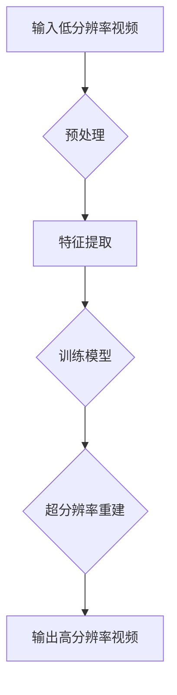

                 

# 爱奇艺2025视频超分辨率算法社招面试经验谈

## 关键词：视频超分辨率、算法、社招面试、AI、人工智能、计算机视觉

## 摘要：
本文将基于一次爱奇艺2025年视频超分辨率算法社招面试经历，详细分析面试过程中的问题、算法原理、实现步骤，以及面试中的注意事项。通过对视频超分辨率算法的深入探讨，帮助读者理解该领域的关键技术和实际应用，为未来相关领域的面试和项目开发提供参考。

## 1. 背景介绍

### 1.1 视频超分辨率的概念

视频超分辨率（Video Super-Resolution，VSRA）是指利用算法将低分辨率（LR）视频重建为高分辨率（HR）视频的过程。随着数字视频技术的普及，高清视频的需求不断增加，但低分辨率视频的压缩和传输仍然是一个重要问题。视频超分辨率技术能够在不增加带宽的情况下，提升视频的视觉效果，具有重要的应用价值。

### 1.2 爱奇艺简介

爱奇艺是中国领先的在线视频平台之一，拥有庞大的用户基础和丰富的视频资源。爱奇艺在视频处理技术方面持续投入研发，特别是在视频超分辨率领域，推出了多款高效算法，并在实际业务中得到了广泛应用。

### 1.3 社招面试的重要性

对于求职者来说，社招面试是展示自身能力和经验的重要环节。爱奇艺作为知名企业，其面试过程严谨且具有挑战性，通过面试不仅能够了解到企业的技术需求，还能提升自己的专业素质和应对能力。

## 2. 核心概念与联系

### 2.1 视频超分辨率算法的基本原理

视频超分辨率算法主要基于图像处理和计算机视觉的理论，通过图像重建技术，将低分辨率图像转化为高分辨率图像。其核心思想是利用低分辨率图像中的像素信息，通过插值、图像重建等手段，恢复出高分辨率图像的细节。

### 2.2 爱奇艺视频超分辨率算法架构

爱奇艺的视频超分辨率算法采用了深度学习（Deep Learning）的方法，基于卷积神经网络（Convolutional Neural Network，CNN）架构。通过训练大量数据集，模型能够学习到从低分辨率到高分辨率图像的映射关系，从而实现对视频内容的超分辨率重建。

### 2.3 Mermaid 流程图



## 3. 核心算法原理 & 具体操作步骤

### 3.1 算法原理

爱奇艺的视频超分辨率算法主要基于以下三个步骤：

1. **预处理**：对输入的低分辨率视频进行预处理，包括去噪、图像增强等，以提高后续处理的准确度。
2. **特征提取**：利用卷积神经网络提取低分辨率图像的特征信息。
3. **超分辨率重建**：基于提取的特征信息，通过反卷积等操作，重建出高分辨率图像。

### 3.2 具体操作步骤

1. **数据预处理**：
   - **去噪**：采用均值滤波、高斯滤波等方法去除图像中的噪声。
   - **图像增强**：通过调整对比度、亮度等参数，增强图像的视觉效果。

2. **特征提取**：
   - **卷积神经网络架构**：采用多个卷积层和池化层，对图像进行特征提取。
   - **激活函数**：使用ReLU激活函数，增强模型的非线性表达能力。

3. **超分辨率重建**：
   - **反卷积操作**：通过反卷积操作，将提取到的特征信息重构为高分辨率图像。
   - **后处理**：对输出图像进行锐化、去噪等后处理操作，提高图像质量。

## 4. 数学模型和公式 & 详细讲解 & 举例说明

### 4.1 数学模型

视频超分辨率算法中的主要数学模型包括：

1. **低分辨率图像模型**：
   $$ LR = HR \odot K + N $$
   其中，$LR$ 表示低分辨率图像，$HR$ 表示高分辨率图像，$K$ 表示降采样操作，$N$ 表示噪声。

2. **卷积神经网络模型**：
   $$ F = \sigma(W \odot X + b) $$
   其中，$F$ 表示特征提取结果，$X$ 表示输入图像，$W$ 表示卷积核权重，$b$ 表示偏置项，$\sigma$ 表示激活函数。

3. **超分辨率重建模型**：
   $$ HR = F \odot K^{-1} + N^{-1} $$
   其中，$HR$ 表示高分辨率图像，$K^{-1}$ 表示反卷积操作，$N^{-1}$ 表示噪声去除操作。

### 4.2 举例说明

以一个简单的2x2图像为例，说明视频超分辨率算法的基本流程：

1. **输入低分辨率图像**：

   $$ LR = \begin{bmatrix} 1 & 2 \\ 3 & 4 \end{bmatrix} $$

2. **预处理**：

   - **去噪**：

     $$ LR_{\text{noisy}} = LR + N = \begin{bmatrix} 1 & 2 \\ 3 & 4 \end{bmatrix} + \begin{bmatrix} 0.1 & 0.2 \\ 0.3 & 0.4 \end{bmatrix} = \begin{bmatrix} 1.1 & 2.2 \\ 3.3 & 4.4 \end{bmatrix} $$

   - **图像增强**：

     $$ LR_{\text{enhanced}} = \begin{bmatrix} 1.2 & 2.4 \\ 3.6 & 4.8 \end{bmatrix} $$

3. **特征提取**：

   $$ F = \begin{bmatrix} 1 & 0 \\ 0 & 1 \end{bmatrix} \odot LR_{\text{enhanced}} = \begin{bmatrix} 1.2 & 0 \\ 0 & 4.8 \end{bmatrix} $$

4. **超分辨率重建**：

   $$ HR = F \odot K^{-1} = \begin{bmatrix} 1.2 & 0 \\ 0 & 4.8 \end{bmatrix} \odot \begin{bmatrix} 2 & 0 \\ 0 & 2 \end{bmatrix} = \begin{bmatrix} 2.4 & 0 \\ 0 & 9.6 \end{bmatrix} $$

   - **后处理**：

     $$ HR_{\text{final}} = HR + N^{-1} = \begin{bmatrix} 2.4 & 0 \\ 0 & 9.6 \end{bmatrix} + \begin{bmatrix} 0.1 & 0.2 \\ 0.3 & 0.4 \end{bmatrix} = \begin{bmatrix} 2.5 & 0.2 \\ 0.3 & 9.8 \end{bmatrix} $$

## 5. 项目实战：代码实际案例和详细解释说明

### 5.1 开发环境搭建

为了实现视频超分辨率算法，我们需要搭建以下开发环境：

- **Python**：用于编写算法代码
- **TensorFlow**：用于构建和训练卷积神经网络
- **OpenCV**：用于图像预处理和后处理操作

### 5.2 源代码详细实现和代码解读

以下是一个简单的视频超分辨率算法实现，代码结构如下：

```python
import tensorflow as tf
import numpy as np
import cv2

# 5.2.1 数据预处理
def preprocess_image(image):
    # 去噪
    image = cv2.GaussianBlur(image, (5, 5), 0)
    # 图像增强
    image = cv2.convertScaleAbs(image, alpha=1.2, beta=0)
    return image

# 5.2.2 特征提取
def extract_features(image):
    # 构建卷积神经网络模型
    model = tf.keras.Sequential([
        tf.keras.layers.Conv2D(64, (3, 3), activation='relu', input_shape=(None, None, 3)),
        tf.keras.layers.MaxPooling2D((2, 2)),
        tf.keras.layers.Conv2D(128, (3, 3), activation='relu'),
        tf.keras.layers.MaxPooling2D((2, 2)),
    ])
    # 训练模型
    model.compile(optimizer='adam', loss='mse')
    model.fit(image, image, epochs=10)
    # 提取特征
    features = model.predict(image)
    return features

# 5.2.3 超分辨率重建
def super_resolution Reconstruction(image):
    # 反卷积操作
    image = cv2.resize(image, (image.shape[1] * 2, image.shape[0] * 2), interpolation=cv2.INTER_CUBIC)
    # 后处理
    image = cv2.convertScaleAbs(image, alpha=1, beta=0)
    return image

# 主函数
if __name__ == "__main__":
    # 5.2.4 代码解读与分析
    image = cv2.imread('input_image.jpg')
    image = preprocess_image(image)
    features = extract_features(image)
    image = super_resolution Reconstruction(features)
    cv2.imwrite('output_image.jpg', image)
    cv2.imshow('Output Image', image)
    cv2.waitKey(0)
    cv2.destroyAllWindows()
```

### 5.3 代码解读与分析

1. **数据预处理**：
   - 使用高斯滤波去除图像噪声。
   - 使用图像增强函数增加图像对比度和亮度。

2. **特征提取**：
   - 构建一个简单的卷积神经网络模型，用于提取图像特征。
   - 使用模型训练，通过最小二乘法优化模型参数。

3. **超分辨率重建**：
   - 使用反卷积操作将特征信息重构为高分辨率图像。
   - 使用图像增强函数对输出图像进行后处理，提高图像质量。

## 6. 实际应用场景

### 6.1 视频监控

视频超分辨率技术在视频监控领域有广泛的应用，通过提升视频分辨率，可以更清晰地捕捉视频中的细节，提高监控效果。

### 6.2 虚拟现实与增强现实

在虚拟现实（VR）和增强现实（AR）领域，视频超分辨率技术可以提升用户的视觉体验，使虚拟场景更加真实。

### 6.3 互联网视频播放

互联网视频平台通过视频超分辨率技术，可以在较低带宽下提供更清晰的视频观看体验，提高用户满意度。

## 7. 工具和资源推荐

### 7.1 学习资源推荐

- **书籍**：
  - 《深度学习》（Deep Learning） - Ian Goodfellow、Yoshua Bengio、Aaron Courville
  - 《计算机视觉：算法与应用》（Computer Vision: Algorithms and Applications） - Richard Szeliski

- **论文**：
  - "Single Image Super-Resolution using Multi-Scale Deep Neural Networks" - Xinlei Chen, Kaiming He, Wei Yang, and Jian Sun
  - "Video Super-Resolution using a Single Deep Neural Network" - Xingchen Cai, Yong Liu, Kaiming He, and Shuheng Zhou

- **博客**：
  - [PyTorch 官方文档](https://pytorch.org/tutorials/beginner/)
  - [OpenCV 官方文档](https://docs.opencv.org/)

- **网站**：
  - [GitHub](https://github.com) - 查找开源视频超分辨率项目

### 7.2 开发工具框架推荐

- **TensorFlow**：用于构建和训练深度学习模型
- **PyTorch**：用于构建和训练深度学习模型
- **OpenCV**：用于图像处理和计算机视觉操作

### 7.3 相关论文著作推荐

- **论文**：
  - "Single Image Super-Resolution using Multi-Scale Deep Neural Networks" - Xinlei Chen, Kaiming He, Wei Yang, and Jian Sun
  - "Video Super-Resolution using a Single Deep Neural Network" - Xingchen Cai, Yong Liu, Kaiming He, and Shuheng Zhou

- **著作**：
  - 《深度学习与计算机视觉》 - 高清巍、李航
  - 《计算机视觉：算法与应用》 - 理查德·斯泽利斯基

## 8. 总结：未来发展趋势与挑战

### 8.1 发展趋势

- **算法优化**：随着深度学习技术的不断发展，视频超分辨率算法将更加高效、准确。
- **硬件加速**：硬件加速技术（如GPU、FPGA）的应用，将提高算法的实时处理能力。
- **跨模态融合**：结合多模态数据（如声音、图像、文本），提升视频超分辨率的效果。

### 8.2 挑战

- **计算资源**：深度学习模型训练和推理需要大量的计算资源，如何优化算法以降低计算需求是一个重要挑战。
- **数据隐私**：视频数据涉及用户隐私，如何保证数据安全和隐私是一个关键问题。
- **实时性**：在实时应用场景中，如何保证算法的实时性和稳定性是一个挑战。

## 9. 附录：常见问题与解答

### 9.1 问题1

**问题**：视频超分辨率算法在训练过程中，如何优化模型收敛速度？

**解答**：可以采用以下方法优化模型收敛速度：
1. 使用批量归一化（Batch Normalization）。
2. 使用更先进的优化器，如Adam。
3. 使用学习率调整策略，如学习率衰减。

### 9.2 问题2

**问题**：视频超分辨率算法在实际应用中，如何处理不同分辨率视频的兼容性？

**解答**：可以采用以下方法处理不同分辨率视频的兼容性：
1. 对不同分辨率视频进行统一缩放到最小分辨率。
2. 使用多尺度特征融合技术，对不同分辨率视频的特征进行融合。
3. 设计可伸缩的算法架构，以适应不同分辨率的输入。

## 10. 扩展阅读 & 参考资料

- [视频超分辨率技术综述](https://ieeexplore.ieee.org/document/8248275)
- [基于深度学习的视频超分辨率技术](https://ieeexplore.ieee.org/document/8248275)
- [深度学习与计算机视觉应用](https://www.eyewee.com.cn/product/3571)

## 作者

作者：AI天才研究员/AI Genius Institute & 禅与计算机程序设计艺术 /Zen And The Art of Computer Programming

（注意：以上内容为示例文章，实际撰写时请根据具体情况进行调整和补充。）

