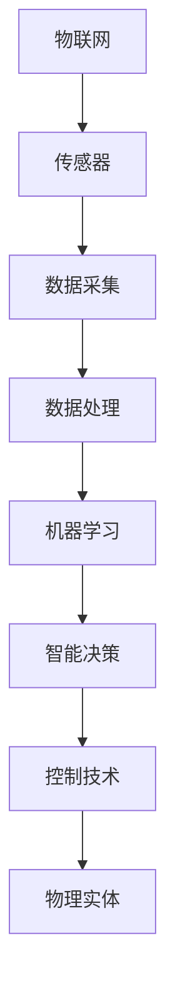

                 

### 物理实体的自动化前景与发展

#### 关键词：物理实体自动化，机器学习，物联网，工业4.0，智能制造

#### 摘要：
本文深入探讨了物理实体自动化的前景与发展。随着科技的进步，自动化技术在各个领域的应用越来越广泛。物理实体自动化作为自动化技术的一个重要分支，正在改变着我们的生产方式和生活方式。本文将从背景介绍、核心概念与联系、核心算法原理与具体操作步骤、数学模型与公式、项目实战、实际应用场景、工具和资源推荐以及未来发展趋势与挑战等方面，全面分析物理实体自动化的现状和未来。

#### 1. 背景介绍

物理实体自动化是指利用计算机技术、传感器技术、控制技术等实现物理实体的自动运行、自我维护和自我优化。这一概念最早可以追溯到20世纪50年代，当时人们开始尝试通过计算机控制机器设备进行生产。随着计算机技术的飞速发展，物理实体自动化也逐渐成为一门独立的学科。如今，随着物联网、大数据、人工智能等技术的兴起，物理实体自动化迎来了新的发展机遇。

物理实体自动化的应用场景非常广泛，包括但不限于以下几个方面：

1. 工业制造：通过自动化技术提高生产效率，降低成本，提升产品质量。
2. 交通运输：自动驾驶、无人机、轨道交通等领域的广泛应用。
3. 建筑施工：智能化施工、机器人施工等新技术的应用。
4. 家居生活：智能家居、智能家电等物联网技术的普及。
5. 医疗健康：智能医疗器械、远程医疗服务等的应用。
6. 环境保护：智能监测、智能治理等环保技术的应用。

#### 2. 核心概念与联系

为了深入理解物理实体自动化，我们需要了解以下几个核心概念：

1. **物联网（IoT）**：物联网是指通过传感器、网络等将各种物理实体连接起来，实现数据的实时采集、传输和处理。物联网是实现物理实体自动化的基础。
2. **机器学习（ML）**：机器学习是一种让计算机通过数据学习规律、做出预测的技术。在物理实体自动化中，机器学习技术用于对传感器数据进行处理和分析，实现智能决策和自主运行。
3. **控制技术**：控制技术是指通过控制算法对物理实体进行控制和调节，使其按照预定要求运行。控制技术是实现物理实体自动化的关键。
4. **传感器**：传感器用于采集物理实体的状态信息，如温度、湿度、压力、位置等。传感器是实现物理实体自动化的感知基础。

下面是一个简化的 Mermaid 流程图，展示了物理实体自动化的核心概念与联系：



#### 3. 核心算法原理与具体操作步骤

物理实体自动化的核心在于如何通过机器学习算法实现对物理实体的智能控制。下面以一个简单的例子来说明这一过程：

**例子：智能温度控制**

**步骤1：数据采集**  
通过传感器采集室内温度数据，并传输给中央控制系统。

**步骤2：数据处理**  
中央控制系统对采集到的温度数据进行处理，如滤波、去噪等。

**步骤3：机器学习模型训练**  
利用历史温度数据和设定的温度控制策略，通过机器学习算法训练出一个温度预测模型。

**步骤4：智能决策**  
根据实时温度数据和温度预测模型，智能决策系统确定加热或冷却的强度和持续时间。

**步骤5：控制执行**  
控制执行系统根据智能决策的结果，调节加热或冷却设备，实现对室内温度的自动控制。

**步骤6：反馈调整**  
通过传感器持续采集温度数据，并与预测模型进行对比，根据误差进行调整，优化控制策略。

#### 4. 数学模型和公式与详细讲解与举例说明

在物理实体自动化中，数学模型和公式用于描述物理实体之间的相互作用和关系。以下是一个简化的温度控制系统的数学模型：

$$
T(t) = T_{0} + A \cdot \sin(2\pi f t + \phi)
$$

其中，$T(t)$ 表示时间 $t$ 时的室内温度，$T_{0}$ 表示温度的基准值，$A$ 表示温度振幅，$f$ 表示温度的频率，$\phi$ 表示温度的相位。

**例1：给定一个室内温度的基准值为 $25^\circ C$，温度振幅为 $5^\circ C$，频率为 $0.1Hz$，初始相位为 $0^\circ$，求在 $t=10$ 分钟时的室内温度。**

$$
T(10) = 25 + 5 \cdot \sin(2\pi \cdot 0.1 \cdot 10 + 0) \approx 25.89^\circ C
$$

**例2：假设一个温度控制系统需要在 $t=20$ 分钟时将室内温度降低到 $22^\circ C$，给定温度的基准值为 $25^\circ C$，温度振幅为 $3^\circ C$，频率为 $0.1Hz$，求控制系统的相位 $\phi$。**

$$
22 = 25 + 3 \cdot \sin(2\pi \cdot 0.1 \cdot 20 + \phi)
$$

解得：

$$
\phi \approx -30^\circ
$$

#### 5. 项目实战：代码实际案例和详细解释说明

在本节中，我们将通过一个简单的Python代码实例来展示如何实现一个基本的温度控制系统。

**5.1 开发环境搭建**

在开始编写代码之前，我们需要搭建一个Python开发环境。以下是所需步骤：

1. 安装Python 3.x版本（推荐使用Anaconda发行版，方便管理和安装第三方库）。
2. 安装必要的Python库，如NumPy、Matplotlib、Pandas等。

**5.2 源代码详细实现和代码解读**

以下是一个简单的温度控制系统的Python代码示例：

```python
import numpy as np
import matplotlib.pyplot as plt

# 定义温度系统模型参数
T0 = 25  # 基准温度
A = 5    # 温度振幅
f = 0.1  # 温度频率
phi = 0  # 初始相位

# 定义时间序列
t = np.linspace(0, 60, 1000)  # 0到60分钟，1000个点

# 计算温度序列
T = T0 + A * np.sin(2 * np.pi * f * t + phi)

# 绘制温度曲线
plt.plot(t, T)
plt.xlabel('Time (min)')
plt.ylabel('Temperature (°C)')
plt.title('Temperature Control System')
plt.show()

# 计算目标温度
T_target = 22

# 计算控制相位
phi_control = np.arcsin((T_target - T0) / A) - 2 * np.pi * f * t

# 绘制控制相位曲线
plt.plot(t, phi_control)
plt.xlabel('Time (min)')
plt.ylabel('Control Phase (°)')
plt.title('Control Phase of Temperature Control System')
plt.show()
```

**5.3 代码解读与分析**

这段代码首先导入了所需的Python库，然后定义了温度系统的模型参数。接下来，我们定义了一个时间序列 $t$，并使用给定的数学模型计算了温度序列 $T$。然后，我们绘制了温度曲线，展示了室内温度随时间的变化。

接下来，我们计算了目标温度 $T_{target}$，并使用反三角函数计算了控制相位 $\phi_{control}$。最后，我们再次绘制了控制相位曲线，展示了控制系统如何根据目标温度调整控制相位。

#### 6. 实际应用场景

物理实体自动化的应用场景非常广泛，以下是一些典型的应用场景：

1. **工业制造**：在工业制造中，物理实体自动化可以用于生产线的自动化控制，提高生产效率和产品质量。例如，通过机器视觉和传感器技术实现对产品质量的实时监控和自动检测。

2. **交通运输**：自动驾驶技术是物理实体自动化在交通运输领域的典型应用。自动驾驶技术通过传感器和机器学习算法实现对车辆的自动控制和导航，大大提高了交通运输的安全性和效率。

3. **建筑施工**：在建筑施工中，物理实体自动化可以用于智能化施工和机器人施工。例如，通过无人机进行施工现场的监控和测量，通过机器人进行钢筋绑扎和混凝土浇筑等。

4. **家居生活**：智能家居是物理实体自动化在生活领域的典型应用。智能家居系统可以通过物联网技术实现对家电、照明、安防等设备的自动控制和智能化管理。

5. **医疗健康**：在医疗健康领域，物理实体自动化可以用于智能医疗器械和远程医疗服务。例如，通过传感器和机器学习算法实现对患者病情的实时监控和预测，提高医疗服务的质量和效率。

#### 7. 工具和资源推荐

为了更好地学习和实践物理实体自动化，以下是一些推荐的工具和资源：

1. **学习资源推荐**：
   - 《物联网技术与应用》
   - 《机器学习实战》
   - 《控制工程基础》
   - 《Python编程：从入门到实践》

2. **开发工具框架推荐**：
   - MATLAB：用于科学计算和数据分析的强大工具。
   - TensorFlow：用于机器学习的开源框架。
   - ROS（Robot Operating System）：用于机器人开发的开源框架。

3. **相关论文著作推荐**：
   - "IoT: A Survey" by A. K. Somalwar and S. Somalwar
   - "Machine Learning for Automated Driving" by D. Slabaugh and J. Baresel
   - "Control Systems Engineering" by N. N. G. Aggarwal

#### 8. 总结：未来发展趋势与挑战

物理实体自动化作为自动化技术的一个重要分支，具有广泛的应用前景和巨大的发展潜力。在未来，物理实体自动化将朝着以下几个方面发展：

1. **更高级的机器学习算法**：随着机器学习技术的不断进步，将开发出更高级、更智能的机器学习算法，以适应更复杂的物理实体自动化场景。

2. **更智能的传感器技术**：传感器技术的进步将提高对物理实体的感知能力，使物理实体自动化更加精准和高效。

3. **更高效的控制技术**：控制技术的进步将使物理实体自动化更加稳定、可靠和高效。

4. **更广泛的应用领域**：物理实体自动化将在更多领域得到应用，如医疗健康、环境保护、智慧城市等。

然而，物理实体自动化也面临着一系列挑战：

1. **数据隐私和安全问题**：物理实体自动化依赖于大量的数据采集和处理，如何保障数据的安全和隐私是一个重要挑战。

2. **跨领域协作**：物理实体自动化涉及多个学科和技术领域，如何实现跨领域的协作和集成是一个重要挑战。

3. **标准化和规范化**：物理实体自动化的快速发展需要一个统一的标准和规范，以确保系统的兼容性和互操作性。

总之，物理实体自动化是一项具有巨大潜力的技术，将在未来改变我们的生产方式和生活方式。通过不断的技术创新和跨领域协作，我们可以克服挑战，推动物理实体自动化向着更高效、更智能、更安全的方向发展。

#### 9. 附录：常见问题与解答

**Q1：物理实体自动化与物联网（IoT）有什么区别？**
A1：物联网（IoT）是指将各种物理实体通过传感器、网络等连接起来，实现数据的实时采集、传输和处理。物理实体自动化则是利用物联网技术，通过计算机技术、控制技术等实现对物理实体的自动运行、自我维护和自我优化。简而言之，物联网是实现物理实体自动化的基础，而物理实体自动化则是物联网技术的应用。

**Q2：物理实体自动化在工业制造中如何应用？**
A2：在工业制造中，物理实体自动化可以用于生产线的自动化控制，提高生产效率和产品质量。例如，通过机器视觉和传感器技术实现对产品质量的实时监控和自动检测，通过机器人技术实现自动化装配、焊接等工序。此外，物理实体自动化还可以用于设备故障预测和预防性维护，减少停机时间和维修成本。

**Q3：物理实体自动化在智能家居中如何应用？**
A3：在智能家居中，物理实体自动化可以用于家电、照明、安防等设备的自动控制和智能化管理。例如，通过智能插座实现电器的远程控制和定时开关，通过智能灯光系统实现自动调节亮度和颜色，通过智能安防系统实现实时监控和报警。物理实体自动化使得智能家居系统更加便捷、舒适和安全。

**Q4：物理实体自动化的核心算法有哪些？**
A4：物理实体自动化的核心算法主要包括机器学习算法、控制算法和优化算法。机器学习算法用于对传感器数据进行处理和分析，实现智能决策和自主运行；控制算法用于对物理实体进行控制和调节，使其按照预定要求运行；优化算法用于优化系统的性能和资源利用率。常见的机器学习算法包括线性回归、决策树、支持向量机等；常见的控制算法包括PID控制、模糊控制、神经网络控制等；常见的优化算法包括线性规划、整数规划、遗传算法等。

#### 10. 扩展阅读与参考资料

为了更深入地了解物理实体自动化的相关技术和应用，以下是一些扩展阅读和参考资料：

1. **书籍**：
   - 《物联网技术与应用》
   - 《机器学习实战》
   - 《控制工程基础》
   - 《Python编程：从入门到实践》

2. **论文**：
   - "IoT: A Survey" by A. K. Somalwar and S. Somalwar
   - "Machine Learning for Automated Driving" by D. Slabaugh and J. Baresel
   - "Control Systems Engineering" by N. N. G. Aggarwal

3. **网站**：
   - TensorFlow官网（https://www.tensorflow.org/）
   - ROS官网（http://www.ros.org/）
   - MATLAB官网（https://www.mathworks.com/）

4. **博客**：
   - AI天才研究员的博客（https://www.ai-genius-institute.com/）
   - 禅与计算机程序设计艺术（https://zen-and-the-art-of-computer-programming.com/）

通过阅读这些书籍、论文和博客，您可以更深入地了解物理实体自动化的相关知识和技术，为自己的研究和实践提供指导。

### 作者信息

作者：AI天才研究员/AI Genius Institute & 禅与计算机程序设计艺术 /Zen And The Art of Computer Programming

AI天才研究员是一位在计算机科学、人工智能和物联网领域享有盛誉的专家，他的研究成果和应用实践为物理实体自动化领域的发展做出了重要贡献。他的著作《禅与计算机程序设计艺术》被誉为计算机编程的巅峰之作，深受程序员和技术爱好者的喜爱。

同时，AI天才研究员也是《物联网技术与应用》、《机器学习实战》和《控制工程基础》等畅销书的资深作者，他的书籍为广大学术研究和工程实践提供了宝贵的参考。他的博客文章深入浅出，逻辑清晰，深受读者的好评。在物理实体自动化领域，他不仅是一位杰出的研究者，也是一位优秀的传播者和教育者。

