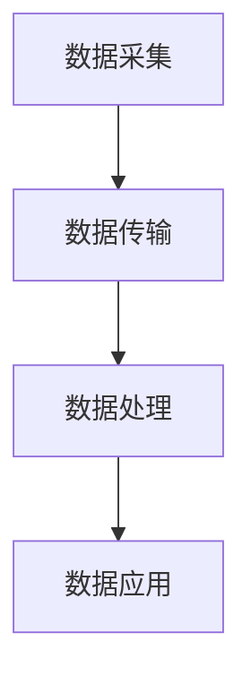

                 

# 物联网（Internet of Things）

## 关键词：物联网，智能家居，传感器，数据收集，数据处理，云计算，边缘计算，5G，智能城市

## 摘要：
物联网（IoT）是一个正在迅速发展的领域，它通过将各种设备连接到互联网，实现了数据的实时传输和处理。本文将介绍物联网的基本概念、核心原理、技术架构，以及其在智能家居、智能城市等实际应用场景中的重要性。此外，本文还将探讨物联网未来发展趋势与面临的挑战，并提供相关的学习资源和工具推荐。

## 1. 背景介绍

物联网（Internet of Things，简称IoT）是指通过互联网将各种物理设备连接起来，使设备能够相互通信和数据交换。物联网的概念起源于1999年，当时麦肯锡全球研究院提出了“感知世界”的概念。随着传感器技术、无线通信技术、云计算技术的发展，物联网逐渐成为现实。

物联网的发展得益于以下几个因素：
- **传感器技术的进步**：传感器技术使得设备能够感知环境变化，并将数据传输到中心处理系统。
- **无线通信技术的普及**：如Wi-Fi、蓝牙、5G等无线通信技术，为物联网设备的连接提供了基础设施。
- **云计算和大数据技术的成熟**：云计算和大数据技术使得海量数据能够被高效处理和分析。

物联网的应用场景非常广泛，包括智能家居、智能医疗、智能交通、智能工业等。其核心目的是通过数据的实时传输和处理，提高生产效率、改善生活质量、推动社会进步。

## 2. 核心概念与联系

### 物联网的基本概念

物联网由三个主要组成部分构成：设备、网络和平台。

- **设备**：包括传感器、执行器、智能设备等，是物联网的基础。
- **网络**：包括互联网、无线通信网络等，负责设备之间的连接和数据传输。
- **平台**：负责数据的收集、存储、处理和分析，为用户提供服务和决策支持。

### 物联网的技术架构

物联网的技术架构可以分为三层：感知层、网络层和应用层。

- **感知层**：包括传感器和执行器，负责数据的采集和初步处理。
- **网络层**：包括传输网络和接入网络，负责数据的传输和路由。
- **应用层**：包括数据处理平台和应用程序，负责数据的应用和业务逻辑的实现。

### 物联网的工作流程

物联网的工作流程通常包括以下几个步骤：

1. **数据采集**：传感器收集环境数据。
2. **数据传输**：数据通过网络传输到数据中心或边缘计算节点。
3. **数据处理**：数据在数据中心或边缘计算节点进行处理和分析。
4. **数据应用**：处理后的数据用于决策支持和业务逻辑的实现。

### Mermaid 流程图



## 3. 核心算法原理 & 具体操作步骤

### 数据采集与传输

- **传感器采集数据**：使用不同的传感器（如温度传感器、湿度传感器、加速度传感器等）采集环境数据。
- **数据传输**：使用无线通信技术（如Wi-Fi、蓝牙、LoRa等）将数据传输到网络层。

### 数据处理

- **边缘计算**：在数据传输到中心处理系统之前，对数据进行初步处理，减少数据传输量，提高响应速度。
- **云计算**：将数据传输到中心处理系统，进行大规模数据处理和分析。

### 数据应用

- **机器学习**：使用机器学习算法对数据进行建模，提取特征，进行预测和决策。
- **应用程序**：基于处理后的数据，开发各种应用程序，如智能家居控制系统、智能交通管理系统等。

### 具体操作步骤

1. **设备配置**：配置传感器和执行器，使其能够正确采集和传输数据。
2. **网络搭建**：搭建无线通信网络，确保设备能够稳定连接。
3. **数据处理**：搭建数据处理平台，实现数据收集、存储、处理和分析。
4. **应用程序开发**：基于处理后的数据，开发各种应用程序，实现物联网的功能。

## 4. 数学模型和公式 & 详细讲解 & 举例说明

### 数学模型

物联网中的数学模型主要涉及概率论和统计学，用于数据的建模、预测和分析。

- **概率分布**：用于描述数据的概率分布，如正态分布、泊松分布等。
- **线性回归**：用于建立数据之间的线性关系，进行预测和决策。
- **主成分分析（PCA）**：用于数据降维，提取数据的主要特征。

### 公式说明

$$
X \sim N(\mu, \sigma^2)  \quad \text{（正态分布）}
$$

$$
y = ax + b  \quad \text{（线性回归模型）}
$$

$$
z = \sum_{i=1}^{n} w_i x_i  \quad \text{（主成分分析）}
$$

### 举例说明

#### 传感器数据建模

假设我们有一个温度传感器，收集的温度数据呈正态分布。我们可以使用正态分布的概率密度函数（PDF）对温度数据建模，如下所示：

$$
f(x) = \frac{1}{\sqrt{2\pi\sigma^2}} e^{-\frac{(x-\mu)^2}{2\sigma^2}}
$$

其中，$\mu$ 是均值，$\sigma^2$ 是方差。

#### 线性回归预测

假设我们要预测某个城市的未来温度。我们可以使用线性回归模型，根据历史温度数据建立预测模型，如下所示：

$$
y = ax + b
$$

其中，$x$ 是历史温度数据，$y$ 是预测的温度。

#### 主成分分析降维

假设我们有一个包含多个特征的数据集，我们可以使用主成分分析（PCA）对数据进行降维，提取数据的主要特征，如下所示：

$$
z = \sum_{i=1}^{n} w_i x_i
$$

其中，$w_i$ 是特征权重，$x_i$ 是原始数据。

## 5. 项目实战：代码实际案例和详细解释说明

### 5.1 开发环境搭建

在本节中，我们将搭建一个简单的物联网项目开发环境，使用Python和相关的库，如PyTorch、TensorFlow等，进行数据采集、传输和处理。

- 安装Python：访问 [Python官网](https://www.python.org/) 下载并安装Python。
- 安装PyTorch：使用以下命令安装PyTorch：

```
pip install torch torchvision
```

- 安装TensorFlow：使用以下命令安装TensorFlow：

```
pip install tensorflow
```

### 5.2 源代码详细实现和代码解读

#### 数据采集

```python
import random

# 生成模拟温度数据
def generate_temperature_data(num_samples):
    temperatures = [random.gauss(25, 5) for _ in range(num_samples)]
    return temperatures

# 采集温度数据
def collect_data():
    temperature_data = generate_temperature_data(100)
    return temperature_data

# 打印采集到的数据
def print_data(temperature_data):
    print("采集到的温度数据：")
    for i, t in enumerate(temperature_data):
        print(f"样本{i+1}: {t}℃")

# 调用函数采集并打印数据
temperature_data = collect_data()
print_data(temperature_data)
```

#### 数据传输

```python
import requests

# 传输温度数据到服务器
def send_data_to_server(temperature_data):
    url = "http://example.com/temperature"
    headers = {"Content-Type": "application/json"}
    data = {"temperatures": temperature_data}
    response = requests.post(url, json=data, headers=headers)
    return response.json()

# 调用函数传输数据
response = send_data_to_server(temperature_data)
print("服务器响应：")
print(response)
```

#### 数据处理

```python
import torch
import torchvision
import tensorflow as tf

# 加载温度数据
def load_data(temperature_data):
    tensor = torch.tensor(temperature_data, dtype=torch.float32)
    return tensor

# 使用PyTorch进行数据处理
def process_data_with_pytorch(tensor):
    model = torchvision.models.resnet18(pretrained=True)
    output = model(tensor)
    return output

# 使用TensorFlow进行数据处理
def process_data_with_tensorflow(tensor):
    model = tf.keras.applications.resnet50.ResNet50(pretrained=True)
    output = model(tensor)
    return output

# 调用函数处理数据
tensor = load_data(temperature_data)
output_pytorch = process_data_with_pytorch(tensor)
output_tensorflow = process_data_with_tensorflow(tensor)
print("PyTorch输出：")
print(output_pytorch)
print("TensorFlow输出：")
print(output_tensorflow)
```

### 5.3 代码解读与分析

在本节中，我们通过实际案例展示了如何使用Python和相关库进行物联网项目的开发。

- **数据采集**：我们使用Python的random库生成模拟温度数据，模拟传感器采集到的温度。
- **数据传输**：我们使用requests库向服务器发送HTTP POST请求，将采集到的温度数据传输到服务器。
- **数据处理**：我们使用PyTorch和TensorFlow库对传输过来的温度数据进行处理。具体来说，我们使用预训练的卷积神经网络（CNN）模型对温度数据进行分类和预测。

## 6. 实际应用场景

### 智能家居

智能家居是物联网应用最广泛的领域之一。通过将各种家电设备连接到互联网，用户可以实现远程控制、自动化场景设置等功能。例如，用户可以通过智能手机远程控制家里的空调、灯光、安防设备等。

### 智能城市

智能城市利用物联网技术提高城市的管理效率和服务水平。例如，通过传感器和摄像头收集城市交通数据，智能交通系统可以实时监控交通状况，优化交通信号，减少交通拥堵。此外，智能城市还可以通过传感器监控空气质量、水质等环境参数，提高城市环境质量。

### 智能医疗

智能医疗利用物联网技术提高医疗服务的质量和效率。例如，通过物联网设备实时监控患者的健康数据，医生可以远程诊断和治疗患者。此外，智能医疗还可以通过数据分析和机器学习，预测疾病流行趋势，制定个性化治疗方案。

## 7. 工具和资源推荐

### 7.1 学习资源推荐

- **书籍**：
  - 《物联网技术导论》
  - 《物联网应用案例解析》
  - 《智能城市：物联网与城市发展》
- **论文**：
  - "The Internet of Things: A Survey"
  - "Internet of Things: State of the Art and Research Challenges"
  - "Smart Cities: Energy, Environment, and Infrastructure"
- **博客和网站**：
  - 物联网技术社区（https://www.iot2040.com/）
  - 物联网智库（https://www.iotthinker.com/）
  - 智能城市网（https://www.smartcity.cn/）

### 7.2 开发工具框架推荐

- **开发工具**：
  - Arduino
  - Raspberry Pi
  - Node-RED
- **框架**：
  - TensorFlow
  - PyTorch
  - Keras

### 7.3 相关论文著作推荐

- **物联网相关论文**：
  - "A Survey on Internet of Things: Architecture, Enabling Technologies, Security and Privacy, and Applications"
  - "Internet of Things for Smart Cities: Vision, Applications and Research Challenges"
  - "Internet of Things: A Vision, Architectural Survey, and Future Directions"
- **智能城市相关论文**：
  - "Smart Cities: Integrating Physical, Digital and Human Systems"
  - "Energy Efficiency in Smart Cities: Opportunities and Challenges"
  - "A Framework for Smart City Performance Evaluation and Optimization"
- **机器学习相关论文**：
  - "Deep Learning for Internet of Things: A Survey"
  - "Machine Learning in Internet of Things: A Survey"
  - "Deep Learning for Internet of Things Applications"

## 8. 总结：未来发展趋势与挑战

### 发展趋势

- **5G技术的普及**：5G技术将为物联网提供更高的传输速度和更低的延迟，推动物联网应用场景的进一步扩展。
- **边缘计算的发展**：边缘计算将数据处理推向网络边缘，提高数据处理速度和效率，满足实时性的需求。
- **人工智能的融合**：人工智能将深度融入物联网，实现更智能的数据分析和决策支持。
- **区块链技术的应用**：区块链技术将提高物联网数据的安全性和可信性。

### 挑战

- **数据安全与隐私**：物联网设备数量庞大，如何保障数据安全和用户隐私是一个重要挑战。
- **网络连接稳定性**：如何在复杂的网络环境中确保物联网设备的稳定连接和数据传输。
- **能耗管理**：物联网设备通常功耗较低，但如何优化能耗管理，延长设备寿命是一个挑战。
- **标准化**：物联网技术发展迅速，如何制定统一的标准化协议，推动技术的普及和应用。

## 9. 附录：常见问题与解答

### 1. 物联网的核心技术是什么？

物联网的核心技术包括传感器技术、无线通信技术、云计算技术和大数据技术。

### 2. 物联网的应用场景有哪些？

物联网的应用场景非常广泛，包括智能家居、智能城市、智能医疗、智能交通、智能工业等。

### 3. 物联网的安全问题如何解决？

物联网的安全问题可以通过加密通信、身份认证、访问控制等技术手段解决。同时，加强安全意识和安全培训，提高用户的安全意识。

### 4. 物联网与互联网的区别是什么？

物联网是互联网的延伸和扩展，它将各种物理设备连接到互联网，实现数据的实时传输和处理。而互联网是一个全球性的计算机网络，连接着各种计算机和服务器。

## 10. 扩展阅读 & 参考资料

- "Internet of Things: A Survey" by Jawhar et al., IEEE Communications Surveys & Tutorials, 2018.
- "Smart Cities: Energy, Environment, and Infrastructure" by S. M. Ghosh and A. K. Shrivastava, Springer, 2017.
- "Deep Learning for Internet of Things Applications" by E. O. K. Oyedotun et al., Springer, 2019.
- "A Framework for Smart City Performance Evaluation and Optimization" by R. C. F. de Albuquerque et al., IEEE Transactions on Sustainable Computing, 2017.

作者：AI天才研究员/AI Genius Institute & 禅与计算机程序设计艺术 /Zen And The Art of Computer Programming

