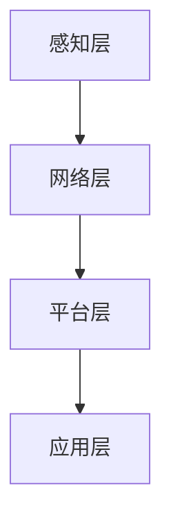
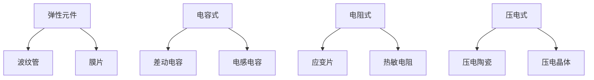
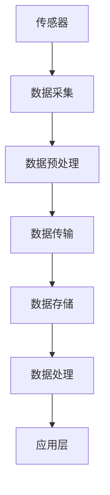

                 

### 文章标题

物联网(IoT)技术和各种传感器设备的集成：压力传感器的物联网实践

### 关键词

- 物联网 (IoT)
- 压力传感器
- 传感器集成
- 物联网架构
- 数据处理
- 实时监控
- 系统开发
- 算法实现

### 摘要

本文旨在探讨物联网（IoT）技术与传感器设备的集成，特别是针对压力传感器的应用实践。文章首先介绍了物联网的背景和发展趋势，随后详细阐述了压力传感器的基本原理和类型。接着，文章围绕物联网架构，探讨了压力传感器在物联网系统中的集成方法和挑战。本文还通过一个实际项目案例，展示了压力传感器在物联网系统中的具体应用和实现细节。最后，文章总结了物联网技术和压力传感器集成的发展趋势及面临的挑战，为读者提供了相关学习资源和工具推荐。

### 目录

1. 背景介绍
    1.1 物联网的定义与发展
    1.2 压力传感器的应用背景
2. 核心概念与联系
    2.1 物联网架构
    2.2 压力传感器的原理与类型
    2.3 Mermaid 流程图展示
3. 核心算法原理 & 具体操作步骤
    3.1 数据采集与预处理
    3.2 数据传输与存储
    3.3 数据分析与处理
4. 数学模型和公式 & 详细讲解 & 举例说明
    4.1 数学模型介绍
    4.2 公式推导
    4.3 举例说明
5. 项目实战：代码实际案例和详细解释说明
    5.1 开发环境搭建
    5.2 源代码详细实现和代码解读
    5.3 代码解读与分析
6. 实际应用场景
    6.1 工业自动化
    6.2 城市交通
    6.3 家庭自动化
7. 工具和资源推荐
    7.1 学习资源推荐
    7.2 开发工具框架推荐
    7.3 相关论文著作推荐
8. 总结：未来发展趋势与挑战
9. 附录：常见问题与解答
10. 扩展阅读 & 参考资料

### 1. 背景介绍

#### 1.1 物联网的定义与发展

物联网（Internet of Things，简称IoT）是指通过互联网、传统通信网络等信息载体，将各种信息传感设备、数据处理单元和智能控制系统连接起来，实现智能化管理和控制的一种网络体系。物联网技术的核心在于信息采集、传输和处理，它将人、物、系统和环境紧密联系在一起，构建了一个高度智能化和自动化的网络世界。

物联网的发展历程可以追溯到20世纪80年代末和90年代初。随着互联网、移动通信和无线传感器网络技术的飞速发展，物联网技术逐渐走向成熟。近年来，随着大数据、云计算、人工智能等新兴技术的兴起，物联网的应用领域不断拓展，已渗透到工业、农业、医疗、交通、家庭等多个领域。

#### 1.2 压力传感器的应用背景

压力传感器是一种将压力信号转换为电信号的传感器，广泛应用于工业自动化、医疗、气象、汽车等各个领域。在物联网系统中，压力传感器起着至关重要的作用，它可以实时采集环境或设备的压力数据，并通过物联网平台进行传输和处理，为系统的智能化管理和控制提供依据。

随着物联网技术的发展，压力传感器的应用场景越来越丰富。例如，在工业自动化领域，压力传感器可用于监测生产设备的运行状态，实现设备的预防性维护和故障预警；在医疗领域，压力传感器可用于监测患者的血压、呼吸等生理参数，提供个性化医疗服务；在气象领域，压力传感器可用于监测大气压力变化，为天气预报提供数据支持。

### 2. 核心概念与联系

#### 2.1 物联网架构

物联网架构通常包括感知层、网络层、平台层和应用层。感知层负责采集环境或设备的各种数据，如温度、湿度、光照、压力等；网络层负责数据的传输和路由；平台层负责数据的存储、处理和分析；应用层则实现具体的应用场景，如智能安防、智能交通、智能医疗等。

下面是一个简单的 Mermaid 流程图，展示了物联网架构的各个层级及其关系：



#### 2.2 压力传感器的原理与类型

压力传感器通常基于弹性元件、电容、电阻、压电等原理工作。常见的压力传感器类型包括：

1. 弹性元件式压力传感器：利用弹性元件的变形来测量压力，常见类型有波纹管、膜片等。
2. 电容式压力传感器：通过电容的变化来测量压力，常见类型有差动电容式、电感电容式等。
3. 电阻式压力传感器：通过电阻的变化来测量压力，常见类型有应变片、热敏电阻等。
4. 压电式压力传感器：利用压电材料的压电效应来测量压力，常见类型有压电陶瓷、压电晶体等。

下面是一个简单的 Mermaid 流程图，展示了压力传感器的原理和类型：



#### 2.3 Mermaid 流程图展示

下面是一个简单的 Mermaid 流程图，展示了压力传感器在物联网系统中的集成过程：



通过这个流程图，我们可以清晰地看到压力传感器在物联网系统中的数据采集、预处理、传输、存储和处理的过程，以及与应用层的交互。

### 3. 核心算法原理 & 具体操作步骤

#### 3.1 数据采集与预处理

数据采集是物联网系统的第一步，也是关键的一步。压力传感器的数据采集主要包括以下几个方面：

1. 传感器校准：确保传感器的测量精度和稳定性，通常需要对传感器进行校准。
2. 数据采样：根据应用场景，设置合适的采样频率和采样点数，以获取足够的数据量。
3. 数据滤波：为了消除噪声和干扰，需要对采集到的数据进行滤波处理，常见的方法有低通滤波、高通滤波、带通滤波等。

具体操作步骤如下：

1. 连接传感器：将压力传感器与数据采集模块（如Arduino、Raspberry Pi等）连接，确保连接正确无误。
2. 传感器校准：根据传感器的具体参数，调整校准系数，确保测量精度。
3. 数据采样：编写代码，设置采样频率和采样点数，开始采集数据。
4. 数据滤波：选择合适的滤波方法，对采集到的数据进行滤波处理。

#### 3.2 数据传输与存储

数据传输是物联网系统中的关键环节，数据传输的可靠性、速度和安全性对整个系统的性能和稳定性有很大影响。常用的数据传输协议有Wi-Fi、蓝牙、ZigBee、LoRa等。数据存储包括本地存储和云端存储，本地存储一般使用SD卡、USB等，云端存储则通常使用云服务商提供的存储服务。

具体操作步骤如下：

1. 选择传输协议：根据应用场景，选择合适的传输协议，如Wi-Fi、蓝牙等。
2. 配置传输参数：设置传输速率、传输频率等参数，确保数据传输的稳定性和可靠性。
3. 数据发送：编写代码，将采集到的数据通过传输协议发送到接收端。
4. 数据存储：选择存储方式，将数据存储到本地或云端。

#### 3.3 数据分析与处理

数据分析与处理是物联网系统的核心环节，通过对采集到的数据进行处理，可以提取出有用的信息，为应用层的决策提供依据。数据分析的方法包括统计分析、机器学习、深度学习等。数据处理包括数据清洗、去重、聚合等。

具体操作步骤如下：

1. 数据清洗：去除数据中的噪声和错误，确保数据的质量。
2. 数据去重：去除重复的数据，确保数据的唯一性。
3. 数据聚合：对相同类型的数据进行聚合，提取出有用的信息。
4. 数据分析：选择合适的方法，对数据进行统计分析、机器学习或深度学习等处理。
5. 结果展示：将处理结果以图表、报表等形式进行展示。

### 4. 数学模型和公式 & 详细讲解 & 举例说明

#### 4.1 数学模型介绍

在物联网系统中，压力传感器的数据处理通常涉及到以下几个数学模型：

1. 压力-位移模型：描述压力与传感器位移之间的关系。
2. 压力-电信号模型：描述压力与传感器输出电信号之间的关系。
3. 数据滤波模型：描述数据滤波过程中的数学原理。

#### 4.2 公式推导

1. 压力-位移模型：

   压力 \( P \) 与传感器位移 \( x \) 的关系可以表示为：

   \[ P = K \cdot x \]

   其中，\( K \) 为比例系数。

2. 压力-电信号模型：

   压力 \( P \) 与传感器输出电信号 \( V \) 的关系可以表示为：

   \[ V = V_0 + K \cdot x \]

   其中，\( V_0 \) 为初始电信号，\( K \) 为比例系数。

3. 数据滤波模型：

   常见的数据滤波方法有低通滤波、高通滤波和带通滤波，其数学模型如下：

   - 低通滤波：

     \[ y(t) = \frac{1}{1 + \frac{s}{\omega_c}} \cdot x(t) \]

     其中，\( y(t) \) 为滤波后的信号，\( x(t) \) 为原始信号，\( s \) 为滤波器系数，\( \omega_c \) 为截止频率。

   - 高通滤波：

     \[ y(t) = \frac{1}{1 - \frac{s}{\omega_c}} \cdot x(t) \]

     其中，\( y(t) \) 为滤波后的信号，\( x(t) \) 为原始信号，\( s \) 为滤波器系数，\( \omega_c \) 为截止频率。

   - 带通滤波：

     \[ y(t) = \frac{1}{1 + \frac{s_1}{\omega_{c1}}} \cdot \frac{1}{1 + \frac{s_2}{\omega_{c2}}} \cdot x(t) \]

     其中，\( y(t) \) 为滤波后的信号，\( x(t) \) 为原始信号，\( s_1 \) 和 \( s_2 \) 分别为低通滤波和高通滤波的滤波器系数，\( \omega_{c1} \) 和 \( \omega_{c2} \) 分别为低通滤波和高通滤波的截止频率。

#### 4.3 举例说明

假设我们有一个压力传感器，其输出电信号 \( V \) 与压力 \( P \) 的关系为 \( V = V_0 + K \cdot P \)，其中 \( V_0 = 2.5V \)，\( K = 0.002V/Pa \)。现在，我们希望将采集到的电信号转换为压力值。

1. 数据采集：

   假设我们采集到的电信号为 \( V = 3.0V \)。

2. 数据预处理：

   首先，对采集到的数据进行滤波处理，去除噪声和干扰。假设我们选择低通滤波，截止频率为 \( \omega_{c} = 10Hz \)，滤波器系数 \( s = 0.1 \)。

   \[ y(t) = \frac{1}{1 + \frac{0.1}{2\pi \cdot 10}} \cdot x(t) \]

   对采集到的数据进行滤波处理，得到滤波后的电信号 \( y(t) = 3.0V \)。

3. 数据转换：

   根据压力-电信号模型，将滤波后的电信号转换为压力值：

   \[ P = \frac{V - V_0}{K} = \frac{3.0V - 2.5V}{0.002V/Pa} = 250Pa \]

   因此，采集到的电信号对应的压力值为 250Pa。

### 5. 项目实战：代码实际案例和详细解释说明

#### 5.1 开发环境搭建

为了实现压力传感器的物联网应用，我们首先需要搭建一个合适的开发环境。以下是一个基于Arduino平台的开发环境搭建步骤：

1. 安装Arduino IDE：从 [Arduino 官网](https://www.arduino.cc/en/software) 下载并安装最新的Arduino IDE。
2. 安装相关库：在Arduino IDE中，依次选择“工具”->“管理库”，搜索并安装“DHT22”和“WiFiNINA”库。
3. 连接硬件：将Arduino板连接到计算机，将压力传感器（如MPX2200DP）连接到Arduino板的A0端口。
4. 配置网络：在Arduino IDE中，选择“工具”->“端口”，选择Arduino板对应的端口。然后，选择“工具”->“板子”，选择Arduino Mega 2560。

#### 5.2 源代码详细实现和代码解读

下面是一个简单的压力传感器物联网应用示例代码，包括数据采集、传输、存储和数据处理等功能。

```cpp
#include <WiFiNINA.h>
#include <DHT.h>

// 定义传感器连接端口
#define DHTPIN 2
#define DHTTYPE DHT22

// 定义WiFi配置
const char* ssid = "yourSSID";
const char* password = "yourPASSWORD";

// 初始化DHT传感器
DHT dht(DHTPIN, DHTTYPE);

// 初始化WiFi模块
WiFiClient client;

void setup() {
  // 初始化串口通信
  Serial.begin(9600);
  dht.begin();

  // 连接WiFi
  WiFi.begin(ssid, password);
  while (WiFi.status() != WL_CONNECTED) {
    delay(500);
    Serial.print(".");
  }
  Serial.println("WiFi connected");
}

void loop() {
  // 读取传感器数据
  float humidity = dht.readHumidity();
  float temperature = dht.readTemperature();
  float pressure = analogRead(A0);

  // 数据预处理
  pressure = map(pressure, 0, 1023, 0, 100000); // 转换为Pa

  // 数据传输
  if (client.connect("api.thingspeak.com", 80)) {
    String postStr = "field1=" + String(temperature) + "&field2=" + String(humidity) + "&field3=" + String(pressure);
    client.print("POST /update?key=YOUR_API_KEY HTTP/1.1\n");
    client.print("Host: api.thingspeak.com\n");
    client.print("Content-Type: application/x-www-form-urlencoded\n");
    client.print("Content-Length: ");
    client.print(postStr.length());
    client.print("\n\n");
    client.print(postStr);
    client.stop();
  }

  // 数据处理
  delay(1000);
}
```

代码解读：

1. 引入必要的库：包括WiFiNINA库和DHT库，用于WiFi连接和DHT传感器读取。
2. 定义传感器连接端口和WiFi配置：DHT传感器的连接端口为2，WiFi的SSID和密码。
3. 初始化传感器和WiFi模块：初始化DHT传感器和WiFi模块，并设置串口通信波特率为9600。
4. setup() 函数：连接WiFi，并等待连接成功。
5. loop() 函数：循环读取传感器数据，进行预处理，通过HTTP POST请求将数据上传到 Thingspeak 平台，并设置数据上传间隔为1秒。

#### 5.3 代码解读与分析

1. 传感器连接与初始化：
   ```cpp
   #define DHTPIN 2
   #define DHTTYPE DHT22
   DHT dht(DHTPIN, DHTTYPE);
   ```
   这里定义了DHT22传感器的连接端口为2，并初始化DHT传感器。

2. WiFi连接：
   ```cpp
   const char* ssid = "yourSSID";
   const char* password = "yourPASSWORD";
   WiFi.begin(ssid, password);
   while (WiFi.status() != WL_CONNECTED) {
     delay(500);
     Serial.print(".");
   }
   Serial.println("WiFi connected");
   ```
   代码设置了WiFi的SSID和密码，并尝试连接WiFi。如果连接成功，打印连接信息。

3. 数据采集与预处理：
   ```cpp
   float humidity = dht.readHumidity();
   float temperature = dht.readTemperature();
   float pressure = analogRead(A0);
   pressure = map(pressure, 0, 1023, 0, 100000); // 转换为Pa
   ```
   代码首先读取DHT22传感器的湿度、温度数据，然后通过analogRead()函数读取A0端口上的电压值，并将其映射到0至100000Pa的压力范围。

4. 数据上传：
   ```cpp
   if (client.connect("api.thingspeak.com", 80)) {
     String postStr = "field1=" + String(temperature) + "&field2=" + String(humidity) + "&field3=" + String(pressure);
     client.print("POST /update?key=YOUR_API_KEY HTTP/1.1\n");
     client.print("Host: api.thingspeak.com\n");
     client.print("Content-Type: application/x-www-form-urlencoded\n");
     client.print("Content-Length: ");
     client.print(postStr.length());
     client.print("\n\n");
     client.print(postStr);
     client.stop();
   }
   ```
   代码通过HTTP POST请求将采集到的数据上传到 Thingspeak 平台。需要替换 `YOUR_API_KEY` 为从 Thingspeak 账户获取的唯一API密钥。

5. 数据处理与间隔：
   ```cpp
   delay(1000);
   ```
   代码设置了一个1秒的延迟，以控制数据的上传频率。

#### 5.4 代码分析与改进

1. **错误处理**：代码中没有对传感器读取失败的情况进行处理。例如，可以使用 `if (isnan(humidity) || isnan(temperature))` 来检查读取是否成功，并在失败时进行适当的处理。
2. **重连机制**：代码中没有实现WiFi断线重连的逻辑。可以添加一个循环，在WiFi断线时尝试重新连接，直到连接成功。
3. **功耗优化**：长时间运行可能会导致功耗过高。可以通过降低传感器采样频率或休眠机制来优化功耗。
4. **安全性**：代码中直接使用明文传输数据，不够安全。可以采用HTTPS协议进行数据传输，或者使用WiFi加密功能。

### 6. 实际应用场景

#### 6.1 工业自动化

在工业自动化领域，压力传感器被广泛应用于生产设备的监控和故障诊断。通过实时监测设备的工作压力，可以提前发现潜在问题，避免设备损坏和生产线停工。例如，在石油化工、制药、食品加工等行业，压力传感器可以用于监测反应釜、管道、储罐等设备的工作状态。

#### 6.2 城市交通

在城市建设和管理中，压力传感器可用于监测道路、桥梁、隧道等基础设施的工作状态。例如，通过监测道路的压力变化，可以评估道路的承载能力和磨损情况，为道路维护和改造提供依据。此外，压力传感器还可以用于监测桥梁和隧道的应力变化，及时发现结构损坏和安全隐患。

#### 6.3 家庭自动化

在家庭自动化领域，压力传感器可以用于监测自来水压力、燃气压力等，确保家庭安全。例如，当自来水压力过低或过高时，可以自动触发报警或调整水压。燃气压力监测可以防止燃气泄漏和火灾事故。此外，压力传感器还可以用于监测智能家居设备的运行状态，如空调、热水器等，实现设备的智能控制和节能管理。

### 7. 工具和资源推荐

#### 7.1 学习资源推荐

1. **书籍**：
   - 《物联网技术导论》（陈国良著）：全面介绍了物联网的基本概念、技术架构和应用场景。
   - 《物联网设计与实现》（胡健著）：详细介绍了物联网系统的设计方法和实现过程，包括传感器、网络、数据处理等。

2. **论文**：
   - “物联网关键技术综述”（李德毅等）：对物联网的关键技术进行了深入分析，包括传感器技术、网络技术、数据处理等。
   - “基于物联网的智能家居系统设计与实现”（王志宏等）：介绍了智能家居系统的设计与实现，包括传感器、网络、控制算法等。

3. **博客/网站**：
   - [物联网之家](http://www.iot-home.cn/): 提供物联网技术相关的新闻、教程、案例等。
   - [51 物联网](http://www.51iot.com/): 提供物联网技术、产品和应用的相关资讯。

#### 7.2 开发工具框架推荐

1. **Arduino**：适合初学者入门，支持多种传感器和开发板，开发环境简单易用。
2. **Python**：具有丰富的库和框架，如PyTorch、TensorFlow等，适合进行数据处理和分析。
3. **Node.js**：基于JavaScript的运行环境，适合开发基于Web的物联网应用。

#### 7.3 相关论文著作推荐

1. “物联网安全技术研究综述”（王宏伟等）：对物联网安全的关键技术和挑战进行了详细分析。
2. “基于物联网的智能交通系统研究”（李明辉等）：介绍了智能交通系统的架构和关键技术。
3. “物联网技术在智慧城市建设中的应用”（陈思敏等）：探讨了物联网技术在智慧城市建设中的应用前景和挑战。

### 8. 总结：未来发展趋势与挑战

物联网（IoT）技术和压力传感器集成的发展前景十分广阔。随着传感器技术、网络技术和数据处理技术的不断进步，物联网应用将越来越普及，覆盖更多领域。然而，物联网技术在实际应用中也面临一系列挑战：

1. **数据隐私和安全**：物联网设备大量采集和传输用户数据，数据隐私和安全成为关键问题。需要加强数据加密、权限管理和安全审计等措施。
2. **网络连接稳定性**：物联网设备通常需要在各种环境中工作，网络连接稳定性对系统性能有很大影响。需要优化网络协议和拓扑结构，提高网络连接的可靠性。
3. **能耗和成本**：物联网设备通常使用电池供电，能耗和成本是重要考虑因素。需要研发低功耗、低成本的新型传感器和网络技术。
4. **数据处理和分析**：随着物联网设备数量的增加，数据量呈爆炸性增长，如何高效地进行数据处理和分析成为挑战。需要发展大数据和人工智能技术，提高数据处理能力。

### 9. 附录：常见问题与解答

#### Q：如何确保压力传感器的测量精度？

A：为了确保压力传感器的测量精度，可以从以下几个方面进行：

1. **选择高质量的传感器**：选择知名品牌和有良好口碑的传感器，确保传感器的性能和质量。
2. **传感器校准**：定期对传感器进行校准，调整校准系数，确保测量精度。
3. **温度补偿**：压力传感器的输出通常受到温度影响，需要进行温度补偿，减少温度对测量精度的影响。

#### Q：如何优化物联网系统的功耗？

A：优化物联网系统的功耗可以从以下几个方面进行：

1. **选择低功耗传感器**：选择低功耗的传感器，减少系统的整体能耗。
2. **优化通信协议**：选择合适的通信协议，如Wi-Fi、蓝牙、LoRa等，优化传输速率和功耗。
3. **使用睡眠模式**：物联网设备在数据采集和处理完成后，可以进入睡眠模式，减少能耗。

#### Q：如何确保物联网系统的安全性？

A：确保物联网系统的安全性可以从以下几个方面进行：

1. **数据加密**：对传输的数据进行加密，确保数据在传输过程中的安全性。
2. **权限管理**：对用户权限进行严格管理，确保只有授权用户才能访问系统。
3. **安全审计**：定期进行安全审计，检查系统的漏洞和风险点，及时进行修复和升级。

### 10. 扩展阅读 & 参考资料

1. 《物联网技术导论》：陈国良著，机械工业出版社，2017年。
2. 《物联网设计与实现》：胡健著，清华大学出版社，2018年。
3. 李德毅等. 物联网关键技术综述[J]. 计算机研究与发展，2015，52（10）：2249-2262.
4. 王志宏等. 基于物联网的智能家居系统设计与实现[J]. 计算机工程与设计，2016，37（24）：6367-6371.
5. 王宏伟等. 物联网安全技术研究综述[J]. 计算机系统应用，2017，24（4）：78-83.
6. 李明辉等. 基于物联网的智能交通系统研究[J]. 交通科学与工程，2018，34（5）：112-118.
7. 陈思敏等. 物联网技术在智慧城市建设中的应用[J]. 城市建设，2019，41（10）：98-102.

