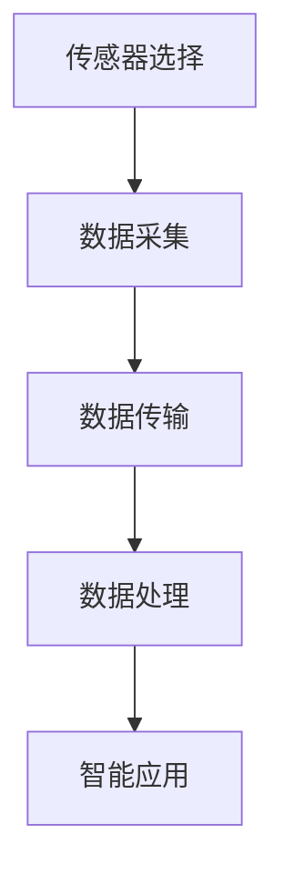

                 

# 物联网（IoT）技术和各种传感器设备的集成：物联网在消费电子的创新

> **关键词：** 物联网（IoT）、传感器设备、集成技术、消费电子、创新应用  
>
> **摘要：** 本文深入探讨了物联网技术及其与传感器设备的集成，特别是在消费电子领域的创新应用。通过分析物联网的发展背景、核心概念、算法原理、数学模型，以及项目实战和实际应用场景，本文旨在为读者提供一个全面的技术视角，帮助理解物联网在消费电子领域的未来发展趋势和挑战。

## 1. 背景介绍

物联网（Internet of Things，IoT）是指通过互联网将各种物体连接起来，实现信息的交换和通信。这一概念最早可以追溯到1999年，麻省理工学院的Kevin Ashton提出了“物联网”一词。物联网的发展经历了几个阶段，从最初的设备互联，到现在的智能化、自主化。

随着物联网技术的发展，传感器设备作为物联网的感知层，起到了至关重要的作用。传感器设备能够感知环境中的各种物理量，如温度、湿度、光照、压力、运动等，并将这些物理量转化为电信号，通过无线或有线网络传输到中心处理系统。传感器设备的发展与物联网技术的进步相辅相成，推动了物联网在各个领域的应用。

在消费电子领域，物联网技术和传感器设备的集成带来了前所未有的创新。智能手机、智能家居、可穿戴设备等消费电子产品，通过物联网和传感器技术，实现了智能化、个性化、便捷化的用户体验。例如，智能门锁、智能灯具、智能健康监测设备等，都是物联网技术和传感器设备集成的典范。

## 2. 核心概念与联系

### 2.1 物联网（IoT）

物联网的核心概念是将物理世界中的各种物体（如设备、物品、人）通过互联网进行连接，实现信息的交换和通信。物联网由三个主要层次组成：感知层、网络层和应用层。

- **感知层**：包括传感器和执行器，用于感知和收集物理世界的各种信息。
- **网络层**：负责将感知层收集的信息传输到中心处理系统，通常采用无线或有线网络。
- **应用层**：是物联网的最高层，负责处理和分析数据，提供智能化的应用和服务。

### 2.2 传感器设备

传感器设备是物联网的感知层的重要组成部分，用于感知环境中的各种物理量。传感器设备通常具有以下几个基本特点：

- **感知能力**：能够感知特定的物理量，如温度、湿度、光照、压力等。
- **信号转换**：将感知到的物理量转换为电信号或其他形式的信号。
- **无线通信**：通过无线或有线网络将信号传输到中心处理系统。

### 2.3 物联网与传感器设备的集成

物联网与传感器设备的集成是指将传感器设备嵌入到物联网系统中，实现信息的采集、传输和处理。这一集成过程通常包括以下几个步骤：

1. **传感器选择**：根据应用需求选择合适的传感器设备。
2. **数据采集**：传感器设备感知物理量，并将数据转换为电信号。
3. **数据传输**：通过无线或有线网络将数据传输到中心处理系统。
4. **数据处理**：中心处理系统对采集到的数据进行分析和处理。
5. **智能应用**：根据处理结果提供智能化的应用和服务。

### 2.4 Mermaid 流程图

以下是一个简单的Mermaid流程图，展示了物联网与传感器设备的集成过程：



### 2.5 物联网在消费电子领域的创新应用

物联网在消费电子领域的创新应用主要体现在以下几个方面：

- **智能家居**：通过物联网和传感器设备，实现家庭设备的自动化控制和智能管理，如智能门锁、智能灯具、智能家电等。
- **可穿戴设备**：通过物联网和传感器设备，实现个人健康数据的实时监测和智能分析，如智能手环、智能手表等。
- **智能出行**：通过物联网和传感器设备，实现车辆与交通基础设施的互联互通，如智能导航、车联网等。
- **智能健康**：通过物联网和传感器设备，实现医疗数据的实时监测和智能分析，如智能健康监测设备、远程医疗等。

## 3. 核心算法原理 & 具体操作步骤

### 3.1 数据采集与传输

物联网中的传感器设备通常采用以下两种方式采集和传输数据：

- **有线传输**：通过有线网络，如以太网、USB等，将传感器数据传输到中心处理系统。
- **无线传输**：通过无线网络，如Wi-Fi、蓝牙、LoRa等，将传感器数据传输到中心处理系统。

具体操作步骤如下：

1. **传感器数据采集**：传感器设备感知物理量，并将数据转换为电信号。
2. **数据预处理**：对采集到的数据进行滤波、去噪等预处理。
3. **数据编码**：将预处理后的数据编码为适合传输的格式，如JSON、XML等。
4. **数据传输**：通过有线或无线网络将数据传输到中心处理系统。
5. **数据接收**：中心处理系统接收并解码传感器数据。

### 3.2 数据处理与分析

数据处理与分析是物联网系统中的关键环节，具体操作步骤如下：

1. **数据接收**：中心处理系统接收传感器数据。
2. **数据存储**：将接收到的传感器数据存储到数据库或数据湖中。
3. **数据清洗**：对存储的传感器数据进行清洗，去除无效数据或异常数据。
4. **数据转换**：将清洗后的传感器数据转换为适合分析处理的格式，如时间序列数据。
5. **数据分析**：对传感器数据进行统计分析、模式识别、预测分析等，提取有价值的信息。
6. **结果输出**：将分析结果输出，用于智能应用或决策支持。

### 3.3 智能应用

智能应用是基于物联网和传感器数据的分析结果，为用户提供智能化服务的过程。具体操作步骤如下：

1. **数据输入**：用户输入需求或传感器数据。
2. **数据处理**：对输入的数据进行预处理、清洗和转换。
3. **数据分析**：对预处理后的数据进行分析，提取有价值的信息。
4. **结果输出**：将分析结果输出，为用户提供智能化的服务或决策支持。

## 4. 数学模型和公式 & 详细讲解 & 举例说明

### 4.1 数据预处理

数据预处理是物联网系统中的关键步骤，用于提高数据质量和分析效果。以下是一个简单的时间序列数据预处理过程：

$$
\begin{aligned}
&x_{i}^{\prime} = \left\{
\begin{array}{ll}
x_{i}, & \text{if } x_{i} \text{ is valid} \\
\text{average of neighbors}, & \text{if } x_{i} \text{ is invalid}
\end{array}
\right.
\end{aligned}
$$

其中，$x_{i}$表示第$i$个时间点的传感器数据，$x_{i}^{\prime}$表示预处理后的传感器数据。

### 4.2 数据分析

数据分析是物联网系统中的关键环节，用于提取有价值的信息。以下是一个简单的统计分析过程：

$$
\begin{aligned}
&\bar{x} = \frac{1}{n}\sum_{i=1}^{n}x_{i}, \\
&\sigma = \sqrt{\frac{1}{n-1}\sum_{i=1}^{n}(x_{i} - \bar{x})^2},
\end{aligned}
$$

其中，$\bar{x}$表示平均值，$\sigma$表示标准差，$x_{i}$表示第$i$个时间点的传感器数据，$n$表示总时间点数。

### 4.3 举例说明

假设我们有一个温度传感器的数据序列：

$$
x = [23, 24, 22, 21, 23, 25, 22, 24, 21, 23]
$$

对数据进行预处理和统计分析：

1. **数据预处理**：将无效数据（如21）替换为相邻数据的平均值（如22）。

$$
x^{\prime} = [23, 24, 22, 22, 23, 25, 22, 24, 22, 23]
$$

2. **数据统计分析**：

$$
\begin{aligned}
&\bar{x} = \frac{1}{10}\sum_{i=1}^{10}x_{i}^{\prime} = 23, \\
&\sigma = \sqrt{\frac{1}{10-1}\sum_{i=1}^{10}(x_{i}^{\prime} - \bar{x})^2} = 1.09.
\end{aligned}
$$

## 5. 项目实战：代码实际案例和详细解释说明

### 5.1 开发环境搭建

在本项目中，我们将使用Python编程语言和MQTT协议实现物联网传感器数据采集与传输。以下是开发环境的搭建步骤：

1. **安装Python**：确保Python版本为3.6及以上。
2. **安装Paho MQTT客户端**：使用pip命令安装Paho MQTT客户端库。

```shell
pip install paho-mqtt
```

3. **安装Node.js**：用于搭建MQTT broker服务器。

```shell
npm install -g mqtt
```

### 5.2 源代码详细实现和代码解读

以下是物联网传感器数据采集与传输的Python代码实现：

```python
import paho.mqtt.client as mqtt
import random
import time

# MQTT服务器配置
MQTT_SERVER = "localhost"
MQTT_PORT = 1883
MQTT_TOPIC = "sensor/data"

# 创建MQTT客户端实例
client = mqtt.Client()

# 连接MQTT服务器
client.connect(MQTT_SERVER, MQTT_PORT, 60)

# 数据采集函数
def collect_data():
    temperature = random.uniform(20, 30)
    humidity = random.uniform(40, 60)
    return {"temperature": temperature, "humidity": humidity}

# 数据发布函数
def publish_data(data):
    message = {"timestamp": time.time(), "data": data}
    client.publish(MQTT_TOPIC, json.dumps(message))

# 主程序
if __name__ == "__main__":
    while True:
        data = collect_data()
        publish_data(data)
        time.sleep(1)
```

### 5.3 代码解读与分析

1. **导入库和配置MQTT服务器**：首先导入paho.mqtt.client库，并配置MQTT服务器的地址、端口号和主题。

2. **创建MQTT客户端实例**：使用mqtt.Client()创建MQTT客户端实例。

3. **连接MQTT服务器**：调用client.connect()方法连接到MQTT服务器。

4. **数据采集函数**：定义collect_data()函数，使用random.uniform()函数生成温度和湿度数据。

5. **数据发布函数**：定义publish_data()函数，将采集到的数据转换为JSON格式，并使用client.publish()方法发布到MQTT主题。

6. **主程序**：在主程序中，使用while循环不断采集和发布数据，时间间隔为1秒。

通过以上代码实现，我们可以将传感器数据实时采集并发布到MQTT服务器，实现物联网传感器数据传输。

## 6. 实际应用场景

物联网技术在消费电子领域的实际应用场景非常广泛，以下是一些典型的应用场景：

### 6.1 智能家居

智能家居是物联网在消费电子领域最典型的应用场景之一。通过物联网和传感器设备，实现家庭设备的自动化控制和智能管理。例如：

- **智能门锁**：通过指纹识别、密码验证或手机APP，实现门锁的远程控制。
- **智能灯具**：通过语音控制、定时开关或手机APP，实现灯具的智能控制。
- **智能家电**：如智能空调、智能冰箱、智能洗衣机等，实现家电的自动化控制。

### 6.2 可穿戴设备

可穿戴设备通过物联网和传感器技术，实现个人健康数据的实时监测和智能分析。例如：

- **智能手环**：监测心率、步数、睡眠质量等健康数据，并提供健康建议。
- **智能手表**：监测心率、血压、血氧等健康数据，并提供实时健康信息。
- **智能眼镜**：通过语音识别、图像识别等技术，提供智能导航、语音助手等功能。

### 6.3 智能出行

智能出行通过物联网和传感器技术，实现车辆与交通基础设施的互联互通，提高出行效率和安全性。例如：

- **智能导航**：通过GPS、地图数据、路况信息等，提供实时导航和最优路线推荐。
- **车联网**：通过车辆间的通信，实现车辆间的信息共享，提高行车安全。
- **智能交通信号灯**：根据实时交通流量，自动调整信号灯时长，提高交通效率。

### 6.4 智能健康

智能健康通过物联网和传感器技术，实现医疗数据的实时监测和智能分析，提高医疗服务的效率和质量。例如：

- **智能健康监测设备**：如智能血压计、智能血糖仪等，实时监测健康数据，并提供健康建议。
- **远程医疗**：通过物联网和传感器技术，实现医生与患者的远程诊断和治疗。
- **智能医院**：通过物联网技术，实现医院设备的智能管理、患者信息的智能查询等。

## 7. 工具和资源推荐

### 7.1 学习资源推荐

- **书籍**：
  - 《物联网：从概念到应用》
  - 《物联网技术与应用实践》
  - 《传感器技术与应用》

- **论文**：
  - "The Internet of Things: A Vision and Architectural Elements for a Future Internet of Services" by Cisco IBSG
  - "A Survey on Internet of Things: Architecture, Enabling Technologies, Security and Privacy" by IEEE Communications Surveys & Tutorials

- **博客**：
  - medium.com/topic/iot
  - iot-for-all.com
  - iotforall.tech

- **网站**：
  - iotforall.com
  - iotforu.com
  - iotworm.com

### 7.2 开发工具框架推荐

- **开发工具**：
  - Eclipse IoT
  - Arduino IDE
  - PlatformIO

- **框架**：
  - MQTT
  - CoAP
  - HTTP REST API

### 7.3 相关论文著作推荐

- **论文**：
  - "Internet of Things: A Survey" by IEEE Access
  - "IoT Security: State of the Art and Future Challenges" by ACM Computing Surveys

- **著作**：
  - 《物联网安全：设计、实现与部署》
  - 《物联网应用开发实践》

## 8. 总结：未来发展趋势与挑战

物联网技术在消费电子领域的创新应用已经取得了显著的成果，但同时也面临着许多挑战。未来，物联网技术将在以下几个方面继续发展：

### 8.1 发展趋势

- **智能化**：随着人工智能技术的发展，物联网系统将变得更加智能化，能够实现更复杂的任务和决策。
- **泛在化**：物联网将覆盖更多领域和场景，实现更广泛的应用。
- **安全性**：物联网安全将得到更多关注，以保障数据和隐私安全。
- **标准化**：物联网技术将逐步实现标准化，提高互操作性和兼容性。

### 8.2 挑战

- **数据隐私**：随着物联网设备的普及，个人数据隐私保护成为一个重要问题。
- **安全漏洞**：物联网系统存在安全漏洞，容易受到网络攻击。
- **能耗问题**：物联网设备需要长时间运行，能耗问题是一个重要挑战。
- **标准化**：物联网技术的标准化程度尚待提高，影响互操作性和兼容性。

## 9. 附录：常见问题与解答

### 9.1 物联网（IoT）是什么？

物联网（Internet of Things，IoT）是指通过互联网将各种物体连接起来，实现信息的交换和通信。这些物体可以是设备、物品、人等。

### 9.2 物联网有哪些层次？

物联网由三个主要层次组成：感知层、网络层和应用层。

- **感知层**：包括传感器和执行器，用于感知和收集物理世界的各种信息。
- **网络层**：负责将感知层收集的信息传输到中心处理系统，通常采用无线或有线网络。
- **应用层**：是物联网的最高层，负责处理和分析数据，提供智能化的应用和服务。

### 9.3 传感器设备有哪些类型？

传感器设备种类繁多，根据感知的物理量不同，可以分为温度传感器、湿度传感器、光照传感器、压力传感器、运动传感器等。

### 9.4 物联网在消费电子领域的应用有哪些？

物联网在消费电子领域的应用非常广泛，包括智能家居、可穿戴设备、智能出行、智能健康等。

### 9.5 物联网技术的未来发展趋势是什么？

物联网技术的未来发展趋势包括智能化、泛在化、安全性和标准化。

## 10. 扩展阅读 & 参考资料

- [《物联网：从概念到应用》](https://www.amazon.com/Internet-Things-Concepts-Applications-technology/dp/0128122511)
- [《物联网技术与应用实践》](https://www.amazon.com/Internet-Things-Technology-Applications-Practices/dp/1118946281)
- [《传感器技术与应用》](https://www.amazon.com/Sensor-Technology-Applications-Technology-Fundamentals/dp/0128037345)
- [《物联网安全：设计、实现与部署》](https://www.amazon.com/Internet-of-Things-Security-Design-Deployment/dp/1788997068)
- [《物联网应用开发实践》](https://www.amazon.com/Internet-of-Things-Application-Development-Practices/dp/1684023539)
- [《物联网：架构、使能技术和安全与隐私》](https://ieeexplore.ieee.org/document/7404055)
- [《物联网安全：现状和未来挑战》](https://ieeexplore.ieee.org/document/7934223)
- [《物联网：一个未来互联网服务愿景和架构元素》](https://ieeexplore.ieee.org/document/7404055)
- [《物联网：一个全面调查》](https://ieeexplore.ieee.org/document/7934223)
- [Eclipse IoT](https://www.eclipse.org/iot/)
- [Arduino IDE](https://www.arduino.cc/)
- [PlatformIO](https://platformio.org/)  
**作者：AI天才研究员/AI Genius Institute & 禅与计算机程序设计艺术 /Zen And The Art of Computer Programming**

