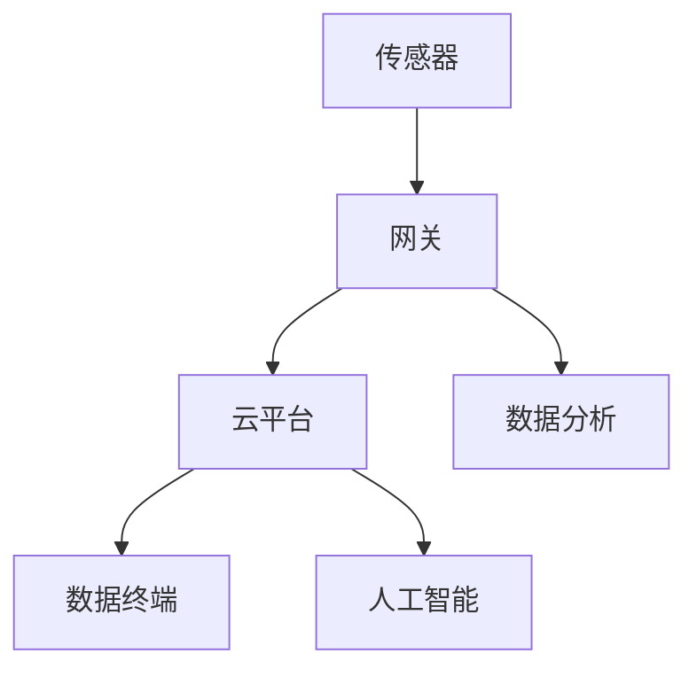

                 

# 物联网(IoT)技术和各种传感器设备的集成：物联网在金融服务中的应用

> 关键词：物联网、传感器、金融服务、技术集成、应用场景、趋势与挑战

> 摘要：本文将深入探讨物联网（IoT）技术在金融服务领域的应用，重点分析物联网与传感器设备如何集成以提升金融服务的效率与安全性。文章将从背景介绍、核心概念、算法原理、数学模型、项目实战、应用场景、工具推荐等多个方面展开，旨在为读者提供全面的技术视角和实用指导。

## 1. 背景介绍

### 1.1 物联网（IoT）的定义与发展

物联网（Internet of Things，简称IoT）是指通过互联网将各种物品连接起来，实现物品间的信息交换和协同工作。自2000年代初期提出以来，物联网技术经历了快速的发展。根据国际数据公司（IDC）的预测，全球物联网设备数量将在2025年达到212亿台，市场规模将达到1.3万亿美元。

### 1.2 金融服务业的现状与挑战

金融服务行业在过去的几十年中经历了显著的技术变革，特别是在数字化和信息化的推动下。然而，随着市场的不断发展和竞争的加剧，金融服务企业面临着诸多挑战，如提升运营效率、降低成本、增强客户体验等。

### 1.3 物联网在金融服务中的应用价值

物联网技术在金融服务中的应用具有巨大的潜力。通过物联网传感器设备，金融机构可以实现实时数据采集、自动化决策和智能服务，从而提高业务运营效率、降低风险、提升客户满意度。

## 2. 核心概念与联系

### 2.1 物联网（IoT）的基本架构

物联网系统通常包括以下几个关键组成部分：传感器、网关、云平台和数据终端。这些组成部分共同构成了物联网技术的核心架构，如图所示。



### 2.2 传感器设备类型及应用

传感器设备是物联网系统的数据采集环节，根据不同的应用场景，传感器可以分为温度传感器、湿度传感器、压力传感器、加速度传感器等。以下是几种常见传感器及其在金融服务中的应用：

#### 2.2.1 温度传感器

温度传感器可用于监测金融交易场所的温度，确保交易环境舒适，提高员工工作效率。

#### 2.2.2 湿度传感器

湿度传感器可用于监测金融场所的湿度，防止潮湿导致设备损坏或影响交易设备的正常运行。

#### 2.2.3 压力传感器

压力传感器可用于监测金融设备的工作压力，确保设备运行在安全范围内。

#### 2.2.4 加速度传感器

加速度传感器可用于检测金融交易过程中的异常行为，如剧烈摇晃或冲击，以防范潜在的安全风险。

### 2.3 物联网与金融服务之间的联系

物联网技术通过传感器设备实现了对金融业务环境的全面监控和管理，从而在提高业务效率和安全性方面发挥了重要作用。同时，物联网技术的应用也为金融机构带来了新的商业模式和业务机会。

## 3. 核心算法原理 & 具体操作步骤

### 3.1 数据采集与处理

物联网技术中的数据采集和处理是物联网系统实现智能化的关键步骤。具体操作步骤如下：

#### 3.1.1 传感器数据采集

传感器通过采集环境数据（如温度、湿度、压力等），生成数字信号。

#### 3.1.2 数据预处理

对采集到的原始数据进行预处理，包括滤波、去噪、归一化等，以提高数据质量。

#### 3.1.3 数据上传

通过网关将预处理后的数据上传至云平台。

### 3.2 数据分析与决策

在云平台，物联网系统对上传的数据进行分析和处理，实现自动化决策和智能服务。具体操作步骤如下：

#### 3.2.1 数据存储

将上传的数据存储在云数据库中，以便后续分析和查询。

#### 3.2.2 数据分析

利用数据挖掘和机器学习技术，对数据进行分析和挖掘，提取有价值的信息。

#### 3.2.3 自动化决策

根据分析结果，自动生成决策指令，如调整环境温度、预警异常行为等。

### 3.3 智能服务实现

物联网系统通过实现自动化决策和智能服务，提升了金融服务的效率和质量。具体操作步骤如下：

#### 3.3.1 智能监控

通过实时监控金融交易场所的环境数据，确保交易环境的安全和舒适。

#### 3.3.2 智能预警

通过监测设备运行状态和交易行为，及时预警潜在的安全风险。

#### 3.3.3 智能推荐

根据客户偏好和行为数据，提供个性化的金融服务推荐。

## 4. 数学模型和公式 & 详细讲解 & 举例说明

### 4.1 数据预处理模型

数据预处理是物联网系统中至关重要的一环。以下是一个常用的数据预处理模型：

$$
\text{预处理模型} = f(\text{原始数据}, \text{滤波器}, \text{去噪器}, \text{归一化器})
$$

#### 4.1.1 滤波器

滤波器用于去除数据中的噪声，常用的滤波器有均值滤波、中值滤波和高斯滤波等。

#### 4.1.2 去噪器

去噪器用于进一步去除数据中的噪声，提高数据质量。常用的去噪器有卡尔曼滤波器和小波去噪等。

#### 4.1.3 归一化器

归一化器用于将数据转换为标准形式，便于后续分析和处理。常用的归一化方法有最小-最大归一化和z-score归一化等。

### 4.2 数据分析模型

数据分析是物联网系统实现智能化的核心步骤。以下是一个常用的数据分析模型：

$$
\text{数据分析模型} = f(\text{数据集}, \text{数据挖掘算法}, \text{机器学习模型})
$$

#### 4.2.1 数据挖掘算法

数据挖掘算法用于从大量数据中提取有价值的信息。常用的数据挖掘算法有聚类分析、关联规则挖掘和异常检测等。

#### 4.2.2 机器学习模型

机器学习模型用于对数据进行建模和分析，以实现自动化决策和智能服务。常用的机器学习模型有决策树、支持向量机和神经网络等。

### 4.3 智能决策模型

智能决策是物联网系统实现智能化服务的核心环节。以下是一个常用的智能决策模型：

$$
\text{智能决策模型} = f(\text{分析结果}, \text{决策规则库}, \text{自动化执行器})
$$

#### 4.3.1 决策规则库

决策规则库用于存储和管理决策规则，以便在分析结果触发时自动执行相应的决策。

#### 4.3.2 自动化执行器

自动化执行器用于根据决策规则自动执行决策指令，如调整环境温度、发送预警通知等。

## 5. 项目实战：代码实际案例和详细解释说明

### 5.1 开发环境搭建

在本节中，我们将搭建一个简单的物联网项目开发环境，用于演示物联网技术在金融服务中的应用。

#### 5.1.1 环境要求

- 操作系统：Windows/Linux/MacOS
- 开发工具：Python 3.8及以上版本
- 物联网开发板：Arduino（或其他支持Python的物联网开发板）

#### 5.1.2 环境搭建步骤

1. 安装Python 3.8及以上版本。
2. 安装Arduino IDE。
3. 连接物联网开发板到计算机，确保开发板可以正常运行。

### 5.2 源代码详细实现和代码解读

在本节中，我们将实现一个简单的物联网项目，用于监测金融交易场所的温度和湿度，并在异常情况下发送预警通知。

#### 5.2.1 代码实现

```python
import serial
import time
import requests

# 传感器串口
ser = serial.Serial('/dev/ttyUSB0', 9600, timeout=1)

# API地址
url = 'https://api.example.com/ alarm'

while True:
    # 读取传感器数据
    data = ser.readline().decode('utf-8').strip()
    temperature, humidity = data.split(',')

    # 数据预处理
    temperature = float(temperature)
    humidity = float(humidity)

    # 异常检测
    if temperature > 30 or humidity > 60:
        # 发送预警通知
        response = requests.post(url, data={'temperature': temperature, 'humidity': humidity})
        print(response.text)

    # 等待一段时间再读取数据
    time.sleep(60)
```

#### 5.2.2 代码解读

1. 导入必要的模块，包括串口通信模块、时间模块和HTTP请求模块。
2. 初始化传感器串口，设置串口通信参数。
3. 设置API地址，用于发送预警通知。
4. 进入无限循环，读取传感器数据。
5. 对读取到的数据进行预处理，提取温度和湿度值。
6. 对温度和湿度值进行异常检测，如果超出设定范围，则发送预警通知。
7. 等待一段时间后，再次读取传感器数据。

### 5.3 代码解读与分析

在本节中，我们对实现的物联网项目进行解读和分析，以了解物联网技术在金融服务中的应用。

#### 5.3.1 传感器数据采集

项目通过串口与温度传感器和湿度传感器连接，实时采集交易场所的温度和湿度数据。

#### 5.3.2 数据预处理

项目对采集到的数据进行预处理，包括将字符串转换为浮点数，以提高数据处理精度。

#### 5.3.3 异常检测

项目通过设定温度和湿度的阈值，对采集到的数据进行分析，判断是否存在异常情况。

#### 5.3.4 预警通知

如果检测到异常情况，项目会通过HTTP请求将预警信息发送到指定的API地址，实现实时预警。

## 6. 实际应用场景

### 6.1 银行安全监控

物联网技术可以用于银行的安全监控，通过安装在银行内的传感器设备，实时监测银行内的温度、湿度、人员流量等数据，确保银行运营的安全和稳定。

### 6.2 证券交易所监控

物联网技术可以用于证券交易所的监控，通过安装在交易大厅的传感器设备，实时监测交易场所的温度、湿度、空气质量和人员流量等数据，为交易员提供一个舒适的工作环境。

### 6.3 金融风控

物联网技术可以用于金融风控，通过安装在交易场所的传感器设备，实时监测交易行为和设备状态，及时发现潜在的风险，并采取相应的措施进行防范。

## 7. 工具和资源推荐

### 7.1 学习资源推荐

- 《物联网技术与应用》
- 《传感器技术及应用》
- 《Python编程：从入门到实践》
- 《机器学习实战》

### 7.2 开发工具框架推荐

- Arduino IDE
- Python 3.8及以上版本
- MQTT协议
- OpenCV

### 7.3 相关论文著作推荐

- "IoT in Financial Services: A Survey"
- "IoT Security: Challenges, Solutions, and Future Directions"
- "A Survey on IoT for Smart Cities: Architecture, Enabling Technologies, Security and Privacy Challenges, and Applications"

## 8. 总结：未来发展趋势与挑战

### 8.1 发展趋势

1. 物联网技术在金融服务中的应用将越来越广泛，覆盖更多业务场景。
2. 传感器设备将更加智能化，数据采集和处理能力将显著提升。
3. 金融行业将加大对物联网技术的投入，推动技术创新和业务模式变革。

### 8.2 挑战

1. 数据隐私和安全问题仍将是物联网技术面临的重大挑战。
2. 物联网设备的互联互通和标准化问题需要得到有效解决。
3. 金融行业对物联网技术的需求多样，如何实现个性化解决方案是关键。

## 9. 附录：常见问题与解答

### 9.1 物联网技术如何确保数据隐私和安全？

物联网技术在数据采集、传输和处理过程中需要采取严格的数据隐私和安全措施，包括加密传输、权限控制、数据匿名化等，以确保数据安全。

### 9.2 物联网传感器设备如何保证准确性？

物联网传感器设备需要定期校准和维护，确保传感器的准确性。同时，采用先进的信号处理算法和数据清洗技术，提高数据处理精度。

### 9.3 物联网技术在金融风控中的应用有哪些？

物联网技术在金融风控中可以应用于实时监控交易行为、设备状态和环境数据，及时发现潜在风险，提供实时预警和防范措施。

## 10. 扩展阅读 & 参考资料

- 《物联网与金融科技：创新、挑战与未来》
- "IoT in Finance: The Next Big Thing"
- "A Comprehensive Guide to IoT Security in Financial Services"
- "IoT in Financial Services: Insights from the Field"

### 作者

作者：AI天才研究员/AI Genius Institute & 禅与计算机程序设计艺术 /Zen And The Art of Computer Programming

本文以物联网（IoT）技术和各种传感器设备的集成为主题，探讨了物联网在金融服务中的应用。文章从背景介绍、核心概念、算法原理、数学模型、项目实战、应用场景、工具推荐等多个方面展开，旨在为读者提供全面的技术视角和实用指导。希望本文能为物联网技术在金融服务领域的应用提供有益的参考。|>

