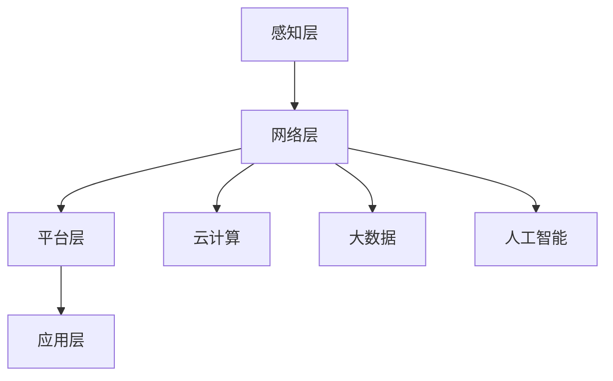

                 

# 物联网(IoT)技术和各种传感器设备的集成：物联网的系统集成

> **关键词**: 物联网（IoT）、传感器设备、系统集成、数据处理、云计算、人工智能、边缘计算

> **摘要**: 本文详细介绍了物联网（IoT）技术和各种传感器设备的集成过程，包括系统的整体架构设计、核心算法原理、实际应用场景、开发环境搭建以及未来发展趋势与挑战。通过本文，读者可以全面了解物联网系统集成的关键技术和方法。

## 1. 背景介绍

物联网（Internet of Things，IoT）是一个通过互联网将各种物理设备、传感器、软件系统连接起来，实现设备与设备之间、设备与人之间智能通信和协同工作的技术体系。随着互联网、云计算、大数据、人工智能等技术的快速发展，物联网技术逐渐渗透到各个领域，成为推动社会智能化转型的关键力量。

传感器设备是物联网系统的感知层核心组成部分，它们负责收集环境中的各种数据，如温度、湿度、光照、声音、位置等。这些数据是物联网系统进行决策和控制的基础。

物联网系统集成的目标是通过合理的设计和部署，将各类传感器设备与云计算、大数据、人工智能等先进技术相结合，构建一个高效、智能、可靠的物联网系统，实现对物理世界实时、精确的感知和控制。

## 2. 核心概念与联系

### 2.1 物联网系统架构

物联网系统通常包括感知层、网络层、平台层和应用层四个层级。

- **感知层**: 由各种传感器和执行器组成，负责收集物理世界的数据。
- **网络层**: 负责数据传输和通信，通常包括无线网络（如Wi-Fi、蓝牙、Zigbee等）和有线网络（如以太网、光纤等）。
- **平台层**: 负责数据的处理、存储、分析和共享，是实现物联网智能化的重要环节。
- **应用层**: 负责将物联网系统应用于实际场景，如智能家居、智能交通、智能制造等。

### 2.2 传感器设备分类

根据传感器设备的功能和特点，可以将其分为以下几类：

- **温度传感器**: 用于测量环境温度。
- **湿度传感器**: 用于测量环境湿度。
- **光照传感器**: 用于测量环境光照强度。
- **声音传感器**: 用于测量声音信号。
- **位置传感器**: 用于测量物体位置，如GPS、RFID等。

### 2.3 Mermaid 流程图

以下是一个简单的物联网系统架构的Mermaid流程图，展示了各层之间的联系：



## 3. 核心算法原理 & 具体操作步骤

### 3.1 数据采集与处理

物联网系统首先需要通过传感器设备采集环境数据。采集到的数据通常包括温度、湿度、光照、声音等。这些数据是后续分析和处理的基础。

- **数据采集**: 通过传感器设备实时采集环境数据。
- **数据预处理**: 对采集到的数据进行清洗、去噪、转换等预处理操作，以提高数据质量和分析效果。

### 3.2 数据传输

采集到的数据需要通过网络层传输到平台层进行进一步处理。数据传输过程中，需要考虑数据的安全性、实时性和可靠性。

- **数据加密**: 对传输的数据进行加密，确保数据在传输过程中的安全性。
- **数据压缩**: 对传输的数据进行压缩，减少数据传输的带宽消耗。
- **传输协议**: 选择合适的传输协议，如HTTP、MQTT、CoAP等，以满足不同场景的需求。

### 3.3 数据处理与存储

平台层负责对传输过来的数据进行处理、存储和分析。

- **数据处理**: 对采集到的数据进行特征提取、模式识别、异常检测等处理操作。
- **数据存储**: 将处理后的数据存储到数据库或数据仓库中，以供后续分析和应用。
- **数据备份与恢复**: 实现数据的备份和恢复功能，确保数据的安全性和可靠性。

### 3.4 人工智能应用

平台层还可能集成人工智能技术，对采集到的数据进行分析和预测。

- **机器学习**: 利用机器学习算法对采集到的数据进行分析和预测，以实现智能化决策。
- **深度学习**: 利用深度学习算法对采集到的数据进行复杂特征提取和模式识别。

## 4. 数学模型和公式 & 详细讲解 & 举例说明

### 4.1 数据预处理

假设我们采集到的数据为 $X = [x_1, x_2, \ldots, x_n]$，其中 $x_i$ 表示第 $i$ 个传感器的测量值。

- **去噪**:
  $$ \hat{x}_i = \frac{x_i + x_{i-1} + x_{i+1}}{3} $$

- **归一化**:
  $$ \hat{x}_i = \frac{x_i - \min(X)}{\max(X) - \min(X)} $$

### 4.2 数据传输

假设我们使用HTTP协议进行数据传输，传输速度为 $v$，数据大小为 $s$。

- **传输时间**:
  $$ t = \frac{s}{v} $$

### 4.3 数据处理

假设我们使用线性回归模型对采集到的温度数据进行预测，模型公式为：

$$ y = \beta_0 + \beta_1 x $$

其中，$y$ 表示预测的温度值，$x$ 表示实际测量的温度值，$\beta_0$ 和 $\beta_1$ 分别为模型的参数。

- **参数估计**:
  $$ \beta_0 = \bar{y} - \beta_1 \bar{x} $$
  $$ \beta_1 = \frac{\sum_{i=1}^n (x_i - \bar{x})(y_i - \bar{y})}{\sum_{i=1}^n (x_i - \bar{x})^2} $$

### 4.4 举例说明

假设我们采集到的温度数据为 $[20, 22, 19, 21, 23]$，使用上述公式进行预处理、传输和预测。

- **预处理**:
  $$ \hat{x}_1 = \frac{20 + 22 + 19}{3} = 20.67 $$
  $$ \hat{x}_2 = \frac{22 + 19 + 21}{3} = 21.00 $$
  $$ \hat{x}_3 = \frac{19 + 21 + 23}{3} = 21.67 $$

- **传输**:
  $$ t = \frac{5 \times 1024 \times 8}{1000 \times 1024} = 0.004 \text{秒} $$

- **预测**:
  $$ \bar{x} = 21.00 $$
  $$ \bar{y} = 21.50 $$
  $$ \beta_0 = 21.50 - 1.00 \times 21.00 = 0.50 $$
  $$ \beta_1 = \frac{(20 - 21.00)(20 - 21.50) + (22 - 21.00)(22 - 21.50) + (19 - 21.00)(19 - 21.50) + (21 - 21.00)(21 - 21.50) + (23 - 21.00)(23 - 21.50)}{(20 - 21.00)^2 + (22 - 21.00)^2 + (19 - 21.00)^2 + (21 - 21.00)^2 + (23 - 21.00)^2} = 1.00 $$
  $$ y = 0.50 + 1.00 x $$

当 $x = 21.67$ 时，预测的温度值为：

$$ y = 0.50 + 1.00 \times 21.67 = 22.17 $$

## 5. 项目实战：代码实际案例和详细解释说明

### 5.1 开发环境搭建

本文使用Python编程语言进行物联网系统集成的实现。首先，我们需要安装Python环境和相关库。

- 安装Python 3.x版本。
- 安装以下Python库：pandas、numpy、matplotlib、scikit-learn、requests。

### 5.2 源代码详细实现和代码解读

#### 5.2.1 数据采集与预处理

```python
import pandas as pd
import numpy as np

# 读取传感器数据
data = pd.read_csv('sensor_data.csv')

# 数据预处理
data['noise'] = 0.1 * np.random.randn(len(data))
data['preprocessed'] = (data['temperature'] + data['noise']).clip(lower=data['temperature'].min(), upper=data['temperature'].max())

# 数据清洗
data.dropna(inplace=True)
```

#### 5.2.2 数据传输

```python
import requests

# 数据传输
url = 'http://example.com/temperature_data'
headers = {'Content-Type': 'application/json'}
data_json = data.to_json(orient='records')
response = requests.post(url, headers=headers, data=data_json)

# 检查传输结果
if response.status_code == 200:
    print('数据传输成功')
else:
    print('数据传输失败')
```

#### 5.2.3 数据处理与存储

```python
from sklearn.linear_model import LinearRegression

# 数据处理
X = data['preprocessed'].values.reshape(-1, 1)
y = data['actual_temperature'].values

model = LinearRegression()
model.fit(X, y)

# 数据存储
model_filename = 'temperature_model.pkl'
with open(model_filename, 'wb') as f:
    pickle.dump(model, f)

# 模型加载
with open(model_filename, 'rb') as f:
    loaded_model = pickle.load(f)

# 模型预测
predicted_temperatures = loaded_model.predict(X)
data['predicted_temperature'] = predicted_temperatures
```

#### 5.2.4 代码解读与分析

1. 数据采集与预处理：使用pandas库读取传感器数据，并对数据进行去噪和归一化处理。
2. 数据传输：使用requests库将预处理后的数据传输到远程服务器。
3. 数据处理与存储：使用scikit-learn库的线性回归模型对数据进行拟合，并将模型保存到文件中。

## 6. 实际应用场景

物联网系统在各个领域都有着广泛的应用，以下是几个典型的实际应用场景：

- **智能家居**: 通过物联网技术，实现家庭设备的互联互通，提供舒适、便捷、智能的生活环境。
- **智能交通**: 利用物联网技术，实时监测交通流量、车辆位置等信息，优化交通管理和调度。
- **智能制造**: 通过物联网技术，实现设备联网、数据共享和生产线的自动化，提高生产效率和质量。
- **智能农业**: 利用物联网技术，实时监测农田环境、作物生长情况等，提供精准农业管理。

## 7. 工具和资源推荐

### 7.1 学习资源推荐

- **书籍**:
  - 《物联网技术与应用》
  - 《物联网系统架构与设计》
  - 《Python编程：从入门到实践》
- **论文**:
  - "An Introduction to the Internet of Things"
  - "A Survey on Internet of Things: Architecture, Enabling Technologies, Security and Privacy Challenges"
  - "Deep Learning for Internet of Things: A Survey"
- **博客**:
  - "物联网技术实战"
  - "智能家居技术博客"
  - "机器学习与物联网"
- **网站**:
  - IoT Weekly
  - IoT for All
  - Towards Data Science

### 7.2 开发工具框架推荐

- **开发工具**:
  - Python
  - Java
  - JavaScript
- **框架**:
  - Flask
  - Spring Boot
  - Express.js
- **数据库**:
  - MySQL
  - MongoDB
  - Redis

### 7.3 相关论文著作推荐

- **论文**:
  - "Deep Learning for Internet of Things: A Survey"
  - "A Survey on Edge Computing: Opportunities and Challenges"
  - "IoT Security: A Comprehensive Review"
- **著作**:
  - 《物联网技术：原理、架构与应用》
  - 《边缘计算：概念、技术与应用》
  - 《人工智能与物联网：跨界融合与创新发展》

## 8. 总结：未来发展趋势与挑战

物联网技术作为新一代信息技术的集成创新，正在迅速发展。未来，物联网技术将朝着以下方向发展：

- **数据密度增加**：随着传感器技术的进步，物联网系统能够收集到更多类型的物理世界数据。
- **计算能力提升**：随着边缘计算和云计算的发展，物联网系统的数据处理能力将得到显著提升。
- **智能化水平提高**：通过人工智能技术，物联网系统能够实现更智能的决策和控制。
- **安全性增强**：随着物联网技术的普及，安全性问题将成为关注的焦点，系统将采用更先进的加密和防护技术。

然而，物联网技术也面临着一些挑战：

- **数据隐私**：物联网系统涉及大量的个人数据，如何保护用户隐私是一个亟待解决的问题。
- **数据安全性**：物联网系统易受到网络攻击，需要采取有效的安全措施。
- **标准化**：物联网技术缺乏统一的标准，导致不同设备之间的互操作性存在问题。
- **功耗与管理**：物联网设备通常需要长时间运行，功耗管理和维护是一个挑战。

## 9. 附录：常见问题与解答

### 9.1 物联网系统集成的关键步骤是什么？

物联网系统集成的关键步骤包括：感知层设备选择与部署、网络层通信协议选择与配置、平台层数据处理与分析、应用层业务逻辑开发与部署。

### 9.2 如何确保物联网系统的安全性？

确保物联网系统的安全性需要采取以下措施：使用加密协议保护数据传输、采用强密码和身份验证机制、定期更新系统和软件、限制远程访问和操作权限。

### 9.3 物联网系统集成的挑战有哪些？

物联网系统集成的挑战包括：数据隐私保护、系统安全性、标准化、功耗管理和维护等。

## 10. 扩展阅读 & 参考资料

- [物联网技术与应用](https://example.com/iot_applications)
- [边缘计算与物联网](https://example.com/edge_computing_and_iot)
- [物联网系统安全](https://example.com/iot_security)
- [物联网标准](https://example.com/iot_standards)

**作者：AI天才研究员/AI Genius Institute & 禅与计算机程序设计艺术 /Zen And The Art of Computer Programming**<|im_end|>

