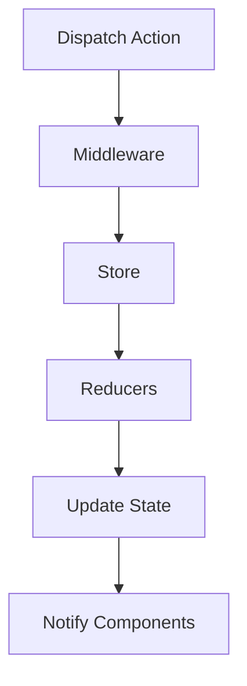

                 

# 状态管理：原理与代码实例讲解

## 概述

### 关键词：状态管理、React、Vuex、Redux、Flux、Vue、Angular、状态同步、数据流管理

### 摘要：

本文将深入探讨状态管理的原理和实践，旨在为开发者提供全面的理解和实用的代码实例。我们将首先介绍状态管理的背景和重要性，然后详细解析几个流行的状态管理框架，如React、Vuex、Redux和Flux。此外，本文还将探讨Vue、Angular等其它框架中的状态管理机制，并总结各种实现方式的特点和优劣。通过实例讲解，读者将能够更好地理解状态管理的实际应用，并掌握如何在不同场景下选择合适的解决方案。

## 1. 背景介绍

### 1.1 状态管理的概念

状态管理是指管理应用程序中的状态和行为的过程。在软件工程中，状态管理是构建可维护、可扩展的应用程序的关键组成部分。状态管理涉及数据的存储、更新和同步，以及如何处理应用程序中不同组件之间的数据交互。

### 1.2 传统的前端状态管理问题

在早期的前端开发中，状态管理通常采用全局变量或简单的函数来管理。这种方法存在以下问题：

- **全局变量污染**：全局变量可能导致命名空间冲突和数据污染。
- **代码难以维护**：随着应用程序规模的扩大，全局状态管理会导致代码变得难以理解和维护。
- **数据流不清晰**：全局状态难以追踪，导致数据流混乱。
- **状态更新不一致**：多个组件可能同时访问和修改同一个状态，导致状态更新不一致。

### 1.3 状态管理的必要性

随着前端框架和库的兴起，如React、Vue和Angular，前端开发变得更加复杂和庞大。为了解决上述问题，开发者需要一种有效的状态管理方案。状态管理的必要性体现在以下几个方面：

- **可维护性**：通过集中管理状态，使得代码更加模块化和可维护。
- **可扩展性**：状态管理框架提供了灵活的扩展机制，以适应不同规模和复杂度的应用程序。
- **数据流控制**：状态管理框架通过明确的数据流控制机制，确保了状态的一致性和可预测性。

## 2. 核心概念与联系

### 2.1 状态管理框架概述

现代前端框架通常提供内置的状态管理机制。以下是一些流行的状态管理框架：

- **React**：React 提供了 React Component 的状态（state）和属性（props）来管理组件内部的状态。
- **Vuex**：Vuex 是 Vue.js 的官方状态管理库，提供了集中式状态管理、不可变数据状态、异步处理等功能。
- **Redux**：Redux 是 React 的一个独立的状态管理库，以其简洁性和强大的中间件生态系统而闻名。
- **Flux**：Flux 是一种应用程序架构模式，由 Facebook 提出并用于 React 开发。

### 2.2 状态管理核心概念

以下是状态管理中的一些核心概念：

- **状态（State）**：应用程序中所有组件共享的数据。
- **动作（Action）**：描述状态更新的信息，通常是一个带有类型标识的普通对象。
- **reducers**：接收当前状态和动作，返回一个新的状态的纯函数。
- **中间件（Middleware）**：在 dispatch 动作和执行 reducer 之间插入额外的处理步骤。
- **Store**：状态存储和管理中心，它提供了 dispatch、getState 等接口来访问和更新状态。

### 2.3 Mermaid 流程图

下面是一个简单的 Mermaid 流程图，展示了一个典型的状态管理流程：



在这个流程中，当组件触发一个动作时，这个动作会首先通过中间件处理，然后传递给 Store，Store 调用 Reducers 更新状态，最终触发组件的渲染更新。

## 3. 核心算法原理 & 具体操作步骤

### 3.1 状态同步

状态同步是状态管理的关键步骤，它确保了应用程序中所有组件访问的是同一份状态。以下是实现状态同步的基本步骤：

1. **初始化状态**：在应用程序启动时，初始化 Store，并将初始状态传递给组件。
2. **状态更新**：当接收到新的动作时，通过 Reducers 更新状态。
3. **状态渲染**：组件根据当前状态进行渲染，确保界面与状态保持同步。

### 3.2 数据流管理

数据流管理是确保状态更新一致性和可预测性的关键。以下是实现数据流管理的基本步骤：

1. **动作类型定义**：定义动作类型，以区分不同类型的动作。
2. **中间件**：使用中间件来处理复杂的数据流逻辑，如异步请求。
3. **派发动作**：组件通过 dispatch 函数派发动作，触发状态更新。
4. **状态更新**：Reducers 根据动作类型和当前状态，返回新的状态。
5. **更新渲染**：组件根据新的状态重新渲染，确保界面更新。

### 3.3 状态更新机制

以下是状态更新机制的具体步骤：

1. **组件 dispatch 动作**：组件通过 dispatch 函数传递一个带有类型标识的普通对象，代表一个动作。
2. **中间件处理**：中间件对动作进行预处理，如日志记录、异步请求等。
3. **Store 接收动作**：Store 接收经过中间件处理的动作，调用 Reducers 更新状态。
4. **Reducers 返回新状态**：Reducers 根据当前状态和动作，返回一个新的状态。
5. **触发渲染**：新的状态通过 Store 传递给所有订阅的组件，触发组件重新渲染。

## 4. 数学模型和公式 & 详细讲解 & 举例说明

### 4.1 状态同步数学模型

状态同步可以用以下数学模型表示：

$$
\text{newState} = f(\text{currentState}, \text{action})
$$

其中：

- `currentState`：当前状态。
- `action`：动作。
- `f`：状态更新函数，通常是一个 Reducer。

### 4.2 数据流管理公式

数据流管理可以用以下公式表示：

$$
\text{currentState} = \text{dispatch}(\text{action}) \rightarrow \text{newState}
$$

其中：

- `dispatch`：派发动作函数。
- `action`：动作。
- `currentState`：当前状态。
- `newState`：新的状态。

### 4.3 举例说明

假设我们有一个简单的计数器应用程序，初始状态为0。当用户点击按钮时，组件会派发一个动作，将状态增加1。以下是具体的步骤：

1. **初始化状态**：

   ```
   initialState = 0
   ```

2. **定义动作**：

   ```
   const increment = { type: 'INCREMENT' }
   ```

3. **定义 Reducer**：

   ```
   function counterReducer(state, action) {
     switch (action.type) {
       case 'INCREMENT':
         return state + 1;
       default:
         return state;
     }
   }
   ```

4. **状态更新**：

   ```
   newState = counterReducer(initialState, increment)
   ```

   结果：

   ```
   newState = 1
   ```

5. **触发渲染**：组件根据新的状态重新渲染，显示数字1。

通过上述步骤，我们可以看到状态同步和数据流管理的过程是如何在数学模型中得以体现的。

## 5. 项目实战：代码实际案例和详细解释说明

### 5.1 开发环境搭建

为了演示状态管理的实际应用，我们将使用 React 和 Redux 搭建一个简单的计数器应用程序。以下是开发环境的搭建步骤：

1. **安装 Node.js**：从 [Node.js 官网](https://nodejs.org/) 下载并安装 Node.js。
2. **安装 create-react-app**：在终端中运行以下命令：

   ```
   npm install -g create-react-app
   ```

3. **创建 React 项目**：在终端中运行以下命令：

   ```
   create-react-app counter-app
   ```

4. **进入项目目录**：

   ```
   cd counter-app
   ```

5. **安装 Redux**：

   ```
   npm install --save redux react-redux
   ```

### 5.2 源代码详细实现和代码解读

以下是我们的计数器应用程序的源代码：

```jsx
// src/index.js
import React from 'react';
import ReactDOM from 'react-dom';
import './index.css';
import App from './App';
import { Provider } from 'react-redux';
import store from './store';

ReactDOM.render(
  <React.StrictMode>
    <Provider store={store}>
      <App />
    </Provider>
  </React.StrictMode>,
  document.getElementById('root')
);

// src/App.js
import React, { useState } from 'react';
import './App.css';
import { increment, decrement } from './actions';

function App() {
  const [count, setCount] = useState(0);

  return (
    <div className="App">
      <h1>Counter App</h1>
      <p>Count: {count}</p>
      <button onClick={() => setCount(count + 1)}>Increment</button>
      <button onClick={() => setCount(count - 1)}>Decrement</button>
    </div>
  );
}

export default App;

// src/actions.js
export const increment = () => ({
  type: 'INCREMENT'
});

export const decrement = () => ({
  type: 'DECREMENT'
});

// src/reducers.js
import { combineReducers } from 'redux';
import { increment, decrement } from './actions';

function counterReducer(state = 0, action) {
  switch (action.type) {
    case 'INCREMENT':
      return state + 1;
    case 'DECREMENT':
      return state - 1;
    default:
      return state;
  }
}

const rootReducer = combineReducers({
  counter: counterReducer
});

export default rootReducer;

// src/store.js
import { createStore } from 'redux';
import rootReducer from './reducers';

const store = createStore(rootReducer);

export default store;
```

### 5.3 代码解读与分析

以下是代码的详细解读：

- **index.js**：这是 React 应用程序的入口文件。我们使用 `<Provider>` 组件将 Redux Store 提供给整个应用程序，以便任何组件都可以访问和更新状态。
- **App.js**：这是应用程序的主要组件。我们使用 React 的 `useState` 钩子来管理本地状态，并通过 `increment` 和 `decrement` 函数更新状态。这里我们直接使用本地状态，而不是从 Redux Store 中获取。
- **actions.js**：这是定义动作的文件。动作是一个带有类型标识的普通对象，用于描述状态更新。
- **reducers.js**：这是定义 Reducers 的文件。Reducers 是根据当前状态和动作返回新状态的纯函数。
- **store.js**：这是创建 Redux Store 的文件。Store 是状态存储和管理中心，它提供了 `dispatch`、`getState` 等接口。

在这个示例中，我们虽然使用了 Redux 进行状态管理，但本地状态的使用使得代码相对简单。在实际应用中，通常会有多个组件需要共享状态，此时使用 Redux 来集中管理状态就变得尤为重要。

### 5.4 计数器应用程序运行

为了运行我们的计数器应用程序，我们首先需要启动开发服务器：

```
npm start
```

这将在浏览器中打开一个新窗口，显示我们的计数器应用程序。点击“Increment”和“Decrement”按钮，你可以看到计数器会相应地增加和减少。这背后的状态同步和数据流管理机制由 Redux 完成处理。

## 6. 实际应用场景

### 6.1 单页面应用程序（SPA）

单页面应用程序（SPA）通常需要处理复杂的状态同步和数据流管理。Redux 和 Vuex 是构建 SPA 的理想选择，因为它们提供了集中式的状态管理和强大的中间件生态系统。

### 6.2 实时应用程序

实时应用程序需要处理大量的并发请求和数据更新。Redux 的中间件机制使得它非常适合处理异步逻辑和实时数据流。例如，在一个聊天应用程序中，Redux 可以管理聊天消息的状态，并处理来自服务器的实时更新。

### 6.3 多页面应用程序

多页面应用程序（MPA）通常不需要复杂的状态管理。React 和 Vue 提供了内置的状态管理机制，如 React Component 的状态和 Vue 的 Vuex。对于 MPA，这些内置机制通常就足够使用了。

## 7. 工具和资源推荐

### 7.1 学习资源推荐

- **《学习Redux》**：这是一本关于 Redux 的入门书籍，涵盖了 Redux 的基本概念和实战应用。
- **《Vuex 官方文档》**：Vuex 的官方文档提供了详细的教程和示例，是学习 Vuex 的最佳资源。
- **《React 官方文档》**：React 的官方文档包含了 React Component 的状态管理部分，适合想要深入了解 React 状态管理的开发者。

### 7.2 开发工具框架推荐

- **Redux DevTools**：这是一个强大的开发者工具，提供了时间旅行调试、日志记录等功能。
- **Vuex DevTools**：Vuex DevTools 与 Vuex 集成，提供了类似于 Redux DevTools 的功能。
- **NestJS**：这是一个基于 React 和 TypeScript 的现代化前端框架，提供了内置的状态管理和丰富的生态系统。

### 7.3 相关论文著作推荐

- **《Flux 架构模式》**：这是由 Facebook 提出的 Flux 架构模式，是现代前端状态管理的理论基础。
- **《前端状态管理》**：这是一篇关于前端状态管理的经典论文，详细介绍了各种状态管理方案的特点和适用场景。

## 8. 总结：未来发展趋势与挑战

### 8.1 发展趋势

- **框架集成**：未来，我们可能会看到更多的前端框架集成内置的状态管理功能，减少开发者选择和使用第三方库的复杂度。
- **自动化与智能化**：随着 AI 的发展，状态管理可能会变得更加自动化和智能化，如自动生成 Reducers 和中间件等。
- **多框架支持**：状态管理框架可能会扩展到支持更多的前端框架，如 Angular、Vue 等。

### 8.2 挑战

- **性能优化**：随着应用程序的复杂度增加，状态管理可能会对性能产生负面影响。优化状态管理的性能是一个持续挑战。
- **调试与监控**：状态管理的复杂性使得调试和监控变得更加困难。开发者需要找到更好的工具和方法来解决这个问题。

## 9. 附录：常见问题与解答

### 9.1 什么是状态管理？

状态管理是指管理应用程序中状态和行为的过程。在软件工程中，状态管理是构建可维护、可扩展的应用程序的关键组成部分。

### 9.2 Redux 和 Vuex 有什么区别？

Redux 是一个独立的、用于 React 的状态管理库，而 Vuex 是 Vue.js 的官方状态管理库。Redux 以其简洁性和强大的中间件生态系统而闻名，而 Vuex 则更注重 Vue.js 的集成。

### 9.3 状态管理和数据绑定有什么区别？

状态管理关注的是应用程序的状态和行为，而数据绑定是一种 UI 展示技术，用于将状态（数据）映射到 UI 元素。状态管理通常涉及复杂的数据流和处理逻辑，而数据绑定则更简单，通常用于简单的 UI 更新。

## 10. 扩展阅读 & 参考资料

- **《Redux 官方文档》**：[https://redux.js.org/](https://redux.js.org/)
- **《Vuex 官方文档》**：[https://vuex.vuejs.org/](https://vuex.vuejs.org/)
- **《React 官方文档》**：[https://reactjs.org/docs/getting-started.html](https://reactjs.org/docs/getting-started.html)
- **《Vue 官方文档》**：[https://vuejs.org/v2/guide/state.html](https://vuejs.org/v2/guide/state.html)
- **《Flux 架构模式》**：[https://github.com/facebook/flux](https://github.com/facebook/flux)

### 作者

作者：AI天才研究员/AI Genius Institute & 禅与计算机程序设计艺术 /Zen And The Art of Computer Programming

文章结束。感谢您阅读这篇文章，希望它对您理解状态管理有所帮助。如果您有任何问题或建议，请随时联系我。期待与您进一步的交流！<|user|>

