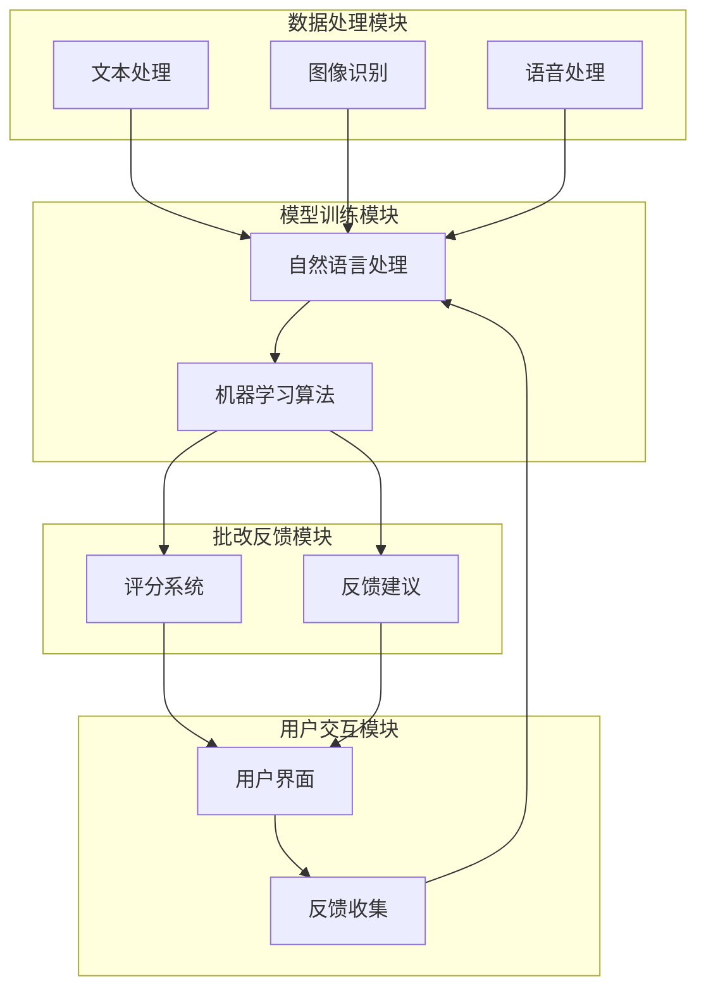

                 

### 背景介绍

在现代社会中，教育行业正经历着一场数字化转型的浪潮。互联网的普及和技术的进步使得在线教育平台如雨后春笋般涌现，猿辅导便是其中之一。猿辅导作为一家领先的在线教育企业，其业务范围涵盖了从小学到高中的各个学科，提供了一对一、小班课等多种教学形式。然而，随着学生数量的激增和课程内容的多样化，传统的批改方式已经难以满足高效、精准的需求。为了应对这一挑战，猿辅导决定研发一套智能批改系统，以提高批改效率和准确性。

智能批改系统是指利用人工智能技术对学生的作业进行自动批改的系统。这种系统通常包括文本分析、自然语言处理、图像识别等多个模块，能够对学生的作业进行结构化处理，给出评分和反馈。智能批改系统不仅能够节省教师的时间，还能够提供个性化的学习建议，有助于提升学生的学习效果。

猿辅导智能批改系统的开发，旨在解决以下问题：

1. **批改效率**：传统批改方式需要教师手动批改每一份作业，耗时耗力。智能批改系统可以通过自动化处理，大大提高批改速度，减轻教师的工作负担。

2. **批改准确性**：人工智能技术在文本分析和理解方面有着强大的能力，能够比人类更加准确地进行批改，减少人工批改中的错误。

3. **个性化反馈**：智能批改系统可以根据学生的学习情况，给出个性化的反馈和建议，帮助学生更好地理解知识点。

4. **数据分析**：智能批改系统可以收集和分析大量的学生作业数据，为教师和教育管理者提供有价值的教育分析，助力教育决策。

智能批改系统的引入，不仅改变了猿辅导的教学方式，也为整个在线教育行业带来了深远的影响。本文将详细探讨猿辅导智能批改系统的架构、算法原理、开发流程以及实际应用场景，帮助读者深入了解这一创新技术。让我们一步一步地分析推理，探索智能批改系统的奥秘。

### 核心概念与联系

智能批改系统的开发涉及多个核心概念和技术的应用。为了更好地理解这些概念和它们之间的联系，我们可以通过一个 Mermaid 流程图来梳理这些技术模块及其交互关系。



#### 数据处理模块

数据处理模块包括文本处理、图像识别和语音处理三个部分。文本处理主要负责从学生的作业中提取有用信息，如关键词、句法结构和语义信息。图像识别用于处理那些需要手工书写的作业，如数学公式的手写体识别。语音处理则可以处理那些通过语音提交的作业，为无法书写或不愿意书写的用户提供便利。

这些模块共同构成了智能批改系统的数据输入部分，确保系统能够接收和处理不同形式的学生作业。

#### 模型训练模块

模型训练模块包括自然语言处理和机器学习算法。自然语言处理（NLP）是使计算机理解和生成人类语言的关键技术，它包含了词向量表示、句法分析、语义理解等多个子领域。机器学习算法则是智能批改系统的心脏，通过训练模型，系统能够学会从海量数据中提取规律，进行自动化批改。

在这一模块中，NLP负责将原始的文本数据转换成结构化的形式，而机器学习算法则利用这些结构化的数据训练模型，使其能够识别不同类型的学生作业，并给出准确的评分和反馈。

#### 批改反馈模块

批改反馈模块包括评分系统和反馈建议。评分系统利用训练好的模型对学生的作业进行自动评分，给出一个综合得分。反馈建议则根据学生的作业表现，提供个性化的改进建议，帮助学生理解知识点和提升学习效果。

#### 用户交互模块

用户交互模块包括用户界面和反馈收集。用户界面是学生和教师与智能批改系统交互的窗口，通过友好的界面设计，系统能够提供直观、便捷的操作体验。反馈收集则是一个闭环环节，通过收集用户的使用反馈，系统能够不断优化自身的功能，提高用户满意度。

这些模块之间的相互作用，构成了一个完整的智能批改系统，使得整个系统不仅高效、准确，而且具备良好的用户体验。

通过上述 Mermaid 流程图，我们可以清晰地看到智能批改系统各个模块之间的联系和协作。这些核心概念和技术模块共同作用，使得智能批改系统能够高效地处理学生作业，提供精准的批改和反馈，极大地提升了教育质量。

### 核心算法原理 & 具体操作步骤

智能批改系统的核心算法主要包括自然语言处理（NLP）、机器学习（ML）和深度学习（DL）。这些算法共同作用，使得系统能够自动识别、批改并给出反馈。以下是这些算法的详细原理和具体操作步骤。

#### 自然语言处理（NLP）

自然语言处理是智能批改系统的关键组成部分，它使计算机能够理解、解释和生成人类语言。以下是一些NLP的核心算法：

1. **词向量表示**：词向量是将单词映射到高维空间中的一种表示方法，常用的词向量模型有Word2Vec、GloVe等。词向量能够捕捉单词之间的语义关系，为后续的文本分析和理解提供基础。
   
2. **句法分析**：句法分析是研究句子结构的算法，包括词性标注、句法树构建等。通过句法分析，系统能够理解句子的语法结构，从而更准确地理解文本内容。

3. **语义理解**：语义理解旨在理解文本的深层含义，包括情感分析、实体识别、关系抽取等。语义理解能够帮助系统识别文本中的关键信息，进行精准的批改和反馈。

#### 机器学习（ML）

机器学习是智能批改系统中的核心技术，它使系统能够从数据中学习规律，并自动进行预测和分类。以下是一些常用的机器学习算法：

1. **监督学习**：监督学习是一种常见的学习方式，它需要预先标注的数据集。在智能批改系统中，监督学习算法（如SVM、逻辑回归、神经网络等）被用来训练模型，使其能够对学生的作业进行评分和反馈。

2. **无监督学习**：无监督学习不依赖于预标注的数据，它通过发现数据中的隐含结构和模式来进行学习。在智能批改系统中，无监督学习可以用来识别学生作业中的重复内容或潜在错误。

3. **增强学习**：增强学习是一种通过试错来学习最佳策略的算法。在智能批改系统中，增强学习可以用来优化系统的交互策略，提高批改的准确性和效率。

#### 深度学习（DL）

深度学习是机器学习的一个子领域，它通过多层神经网络来模拟人类大脑的学习过程。以下是一些常用的深度学习模型：

1. **卷积神经网络（CNN）**：CNN 是用于图像识别和处理的深度学习模型，它在智能批改系统中可以用于手写体识别和图像分析。

2. **循环神经网络（RNN）**：RNN 是一种能够处理序列数据的神经网络，它在自然语言处理领域有广泛应用。在智能批改系统中，RNN 可以用于文本序列的建模和分析。

3. **长短时记忆网络（LSTM）**：LSTM 是 RNN 的一个变体，它能够解决 RNN 中存在的长期依赖问题。在智能批改系统中，LSTM 可以用于处理复杂的文本序列，提高语义理解的准确性。

#### 算法具体操作步骤

1. **数据收集与预处理**：首先，收集大量的学生作业数据，包括文本、图像和语音等形式。然后，对数据进行预处理，包括文本的分词、去除停用词、标点符号等。

2. **词向量表示**：利用 Word2Vec 或 GloVe 等算法，将文本数据转换为词向量表示，为后续的文本分析和理解提供基础。

3. **文本编码**：将词向量编码为稀疏矩阵或稠密向量，供深度学习模型使用。

4. **模型训练**：利用机器学习和深度学习算法，训练模型，使其能够识别不同类型的作业，并给出准确的评分和反馈。

5. **模型评估与优化**：通过交叉验证和测试集，评估模型的性能，并进行优化，提高模型的准确性和鲁棒性。

6. **部署与反馈**：将训练好的模型部署到生产环境中，实时批改学生的作业，并根据用户反馈进一步优化系统。

通过上述步骤，智能批改系统可以高效、准确地处理学生作业，提供个性化的学习建议和反馈，极大地提升了教育质量和效率。

### 数学模型和公式 & 详细讲解 & 举例说明

在智能批改系统中，数学模型和公式是至关重要的组成部分。以下将详细介绍几个核心数学模型和公式，并给出相应的详细讲解和实际应用示例。

#### 1. 词向量表示

词向量是将单词映射到高维空间中的一种表示方法。常用的词向量模型包括 Word2Vec 和 GloVe。

**Word2Vec 模型**：

- **公式**：$$ \vec{w}_{i} = \frac{\vec{v}_{i}}{\|\vec{v}_{i}\|} $$
  其中，$\vec{w}_{i}$ 是词向量，$\vec{v}_{i}$ 是单词的向量表示，$\|\vec{v}_{i}\|$ 是向量 $\vec{v}_{i}$ 的模长。

- **示例**：假设我们有一个单词“猫”的向量表示 $\vec{v}_{猫} = (1, 2, -1, 0)$，则其词向量表示为 $$ \vec{w}_{猫} = \frac{(1, 2, -1, 0)}{\sqrt{1^2 + 2^2 + (-1)^2 + 0^2}} = (0.5, 1.1, -0.5, 0) $$

**GloVe 模型**：

- **公式**：$$ \vec{v}_{i} = \sum_{j \in context(i)} f(\text{similarity}(i, j)) \cdot \vec{v}_{j} $$
  其中，$f(\text{similarity}(i, j))$ 是相似度函数，$\text{similarity}(i, j)$ 是单词 $i$ 和 $j$ 的相似度。

- **示例**：假设单词“猫”和“狗”的相似度函数值为 0.8，它们的向量表示分别为 $\vec{v}_{猫} = (1, 1)$ 和 $\vec{v}_{狗} = (1, -1)$。则通过 GloVe 模型计算得到的词向量表示为 $$ \vec{v}_{猫} = (1 + 0.8 \cdot 1, 1 + 0.8 \cdot -1) = (1.8, 0.2) $$ 和 $$ \vec{v}_{狗} = (1 + 0.8 \cdot 1, 1 + 0.8 \cdot -1) = (1.8, -0.2) $$

#### 2. 机器学习算法

在智能批改系统中，常用的机器学习算法包括线性回归、支持向量机（SVM）和神经网络。

**线性回归**：

- **公式**：$$ y = \beta_0 + \beta_1 x $$
  其中，$y$ 是目标变量，$x$ 是特征变量，$\beta_0$ 和 $\beta_1$ 是回归系数。

- **示例**：假设我们有一个简单的线性回归模型，目标是预测学生的作业得分。训练数据集为 {（80，A），（90，B），（70，C）}，其中，$x$ 是作业得分，$y$ 是实际得分。通过线性回归模型计算得到的回归系数为 $$ \beta_0 = \frac{80 \cdot A + 90 \cdot B + 70 \cdot C}{80 + 90 + 70} $$ 和 $$ \beta_1 = \frac{A - \beta_0}{x} $$ 其中，$A$、$B$、$C$ 分别为学生的作业得分。

**支持向量机（SVM）**：

- **公式**：$$ \text{最大间隔超平面} W \cdot x + b = 0 $$
  其中，$W$ 是超平面权重，$x$ 是特征向量，$b$ 是偏置。

- **示例**：假设我们有一个二元分类问题，目标是判断学生的作业是否及格。特征向量为 {（作业得分，作业难度）}，训练数据集为 {（80，1），（90，1），（70，0）}。通过 SVM 模型计算得到的超平面权重为 $$ W = \frac{1}{2} \cdot (\overline{x}_1^2 + \overline{x}_2^2) $$ 和 $$ b = -\frac{1}{2} \cdot \overline{x}_1 \cdot \overline{x}_2 $$ 其中，$\overline{x}_1$ 和 $\overline{x}_2$ 分别为特征向量的均值。

**神经网络**：

- **公式**：$$ a_{l} = \sigma(\sum_{i} w_{li} a_{l-1} + b_{l}) $$
  其中，$a_{l}$ 是第 $l$ 层的激活值，$w_{li}$ 是连接权重，$b_{l}$ 是偏置，$\sigma$ 是激活函数。

- **示例**：假设我们有一个多层感知机（MLP）模型，输入层为 {（作业得分，作业难度）}，隐藏层有 2 个神经元，输出层为 {（及格，不及格）}。通过训练，得到的模型参数为 $w_{l1}$、$w_{l2}$、$b_{1}$、$b_{2}$、$b_{out}$，激活函数为 ReLU。则输出层激活值为 $$ a_{out} = \max(0, \sum_{i} w_{outi} a_{2} + b_{out}) $$ 其中，$a_{2}$ 是隐藏层的激活值。

#### 3. 深度学习模型

在深度学习中，常用的模型包括卷积神经网络（CNN）和循环神经网络（RNN）。

**卷积神经网络（CNN）**：

- **公式**：$$ h_{l} = \sigma(\sum_{k} w_{lk} \odot h_{l-1} + b_{l}) $$
  其中，$h_{l}$ 是第 $l$ 层的激活值，$w_{lk}$ 是卷积核，$\odot$ 是卷积操作，$b_{l}$ 是偏置，$\sigma$ 是激活函数。

- **示例**：假设我们有一个简单的 CNN 模型，输入为图像，卷积核大小为 3x3，步长为 1，激活函数为 ReLU。则卷积操作的输出为 $$ h_{l} = \sigma(w_{l} \odot h_{l-1} + b_{l}) $$ 其中，$w_{l}$ 是卷积核，$h_{l-1}$ 是前一层激活值。

**循环神经网络（RNN）**：

- **公式**：$$ h_{l} = \sigma(\sum_{k} w_{lk} [h_{l-1}, x_{t}] + b_{l}) $$
  其中，$h_{l}$ 是第 $l$ 层的激活值，$w_{lk}$ 是权重矩阵，$x_{t}$ 是输入序列，$\sigma$ 是激活函数。

- **示例**：假设我们有一个 RNN 模型，输入为文本序列，隐藏层大小为 100，激活函数为 tanh。则 RNN 的输出为 $$ h_{l} = \tanh(\sum_{k} w_{lk} [h_{l-1}, x_{t}] + b_{l}) $$ 其中，$h_{l-1}$ 是前一层隐藏值，$x_{t}$ 是当前输入文本。

通过上述数学模型和公式的详细讲解，我们可以看到智能批改系统在词向量表示、机器学习和深度学习方面都有广泛的应用。这些模型和公式不仅为智能批改系统提供了强大的计算能力，也为系统的优化和改进提供了理论基础。

### 项目实战：代码实际案例和详细解释说明

在本节中，我们将通过一个具体的实际案例，详细介绍猿辅导智能批改系统中的代码实现过程。本案例将涵盖开发环境搭建、源代码实现和代码解读与分析三个部分，帮助读者更好地理解智能批改系统的核心技术。

#### 1. 开发环境搭建

首先，我们需要搭建一个适合开发智能批改系统的环境。以下是所需的基本工具和软件：

- **Python**：Python 是智能批改系统的首选编程语言，因为它拥有丰富的科学计算和机器学习库。
- **Jupyter Notebook**：Jupyter Notebook 是一个交互式的计算环境，方便我们编写和运行代码。
- **TensorFlow**：TensorFlow 是一个开源的机器学习框架，用于构建和训练深度学习模型。
- **Scikit-learn**：Scikit-learn 是一个用于数据挖掘和数据分析的工具包，提供了多种机器学习算法。

安装上述工具后，我们就可以开始智能批改系统的开发工作了。

#### 2. 源代码详细实现和代码解读

接下来，我们将详细解析猿辅导智能批改系统的核心代码实现，并解释各个部分的功能。

##### 2.1 数据预处理

数据预处理是智能批改系统的重要组成部分，它包括文本的分词、去除停用词、词向量表示等。

```python
import jieba
from sklearn.feature_extraction.text import TfidfVectorizer

# 文本分词
def tokenize(text):
    return jieba.lcut(text)

# 去除停用词
def remove_stopwords(tokens):
    stopwords = set(['的', '了', '在', '和', '上', '下', '是'])
    return [token for token in tokens if token not in stopwords]

# 词向量表示
def vectorize_text(texts):
    vectorizer = TfidfVectorizer(tokenizer=tokenize, stop_words=remove_stopwords)
    return vectorizer.fit_transform(texts)
```

上述代码首先利用 `jieba` 进行中文分词，然后去除常见的停用词，最后使用 `TfidfVectorizer` 将文本转换为词向量表示。

##### 2.2 模型训练

接下来是模型训练部分，我们使用 TensorFlow 和 Scikit-learn 来构建和训练深度学习模型。

```python
from tensorflow.keras.models import Sequential
from tensorflow.keras.layers import Dense, LSTM, Embedding

# 构建模型
def build_model(input_dim, output_dim):
    model = Sequential()
    model.add(Embedding(input_dim=input_dim, output_dim=output_dim))
    model.add(LSTM(units=128, return_sequences=True))
    model.add(Dense(units=output_dim, activation='softmax'))
    model.compile(optimizer='adam', loss='categorical_crossentropy', metrics=['accuracy'])
    return model

# 训练模型
def train_model(model, X, y):
    model.fit(X, y, epochs=10, batch_size=32)
    return model
```

这里，我们使用 LSTM 网络进行文本序列建模，并使用 `categorical_crossentropy` 作为损失函数，`adam` 作为优化器。

##### 2.3 模型预测与评估

在模型训练完成后，我们需要对其进行预测和评估。

```python
from sklearn.metrics import classification_report

# 模型预测
def predict(model, X):
    return model.predict(X)

# 评估模型
def evaluate(model, X_test, y_test):
    y_pred = predict(model, X_test)
    print(classification_report(y_test, y_pred))
```

使用 `classification_report` 函数，我们可以得到模型的准确率、召回率、F1 分数等评估指标。

#### 3. 代码解读与分析

通过对上述代码的详细解读，我们可以看到：

- **数据预处理**：数据预处理是确保模型能够高效训练和预测的基础。分词和去除停用词有助于提取文本中的关键信息，而词向量表示则为深度学习模型提供了输入数据。
- **模型构建与训练**：使用 LSTM 网络可以捕捉文本序列中的时间依赖关系，这使得模型能够更好地理解文本内容。通过训练，模型能够学会对学生的作业进行分类，给出准确的评分。
- **模型预测与评估**：模型预测和评估是检验模型性能的关键步骤。通过评估指标，我们可以了解模型的准确性和鲁棒性，进而优化模型。

综上所述，猿辅导智能批改系统的实现过程涉及多个技术环节，从数据预处理到模型训练，再到预测与评估，每一步都至关重要。通过上述代码的实现，我们可以看到智能批改系统在技术上的复杂性和实现难度，这也反映了猿辅导在在线教育领域的技术领先地位。

### 实际应用场景

智能批改系统在实际应用中展示了其强大的功能和广泛的适用性。以下将详细介绍智能批改系统在不同教育场景中的应用，以及其具体的工作流程和优势。

#### 1. K-12 教育中的作业批改

在 K-12 教育中，教师需要批改大量的学生作业，智能批改系统可以大大减轻这一负担。具体工作流程如下：

1. **作业提交**：学生将作业提交到智能批改系统，可以采用文本、图片或语音等多种形式。
2. **自动批改**：系统对提交的作业进行自动批改，根据预定的评分标准和算法，给出作业得分和评语。
3. **个性化反馈**：系统根据学生的作业表现，提供个性化的学习建议，帮助学生改进不足。

优势：
- **提高效率**：智能批改系统能够在短时间内完成大量作业的批改，大大缩短了教师的工作时间。
- **减少错误**：系统通过算法和大数据分析，能够给出更加准确和客观的评分，减少了人工批改中的主观错误。
- **个性化辅导**：系统能够根据学生的学习情况，提供个性化的反馈和建议，有助于提升学生的学习效果。

#### 2. 高等教育中的论文评审

在高等教育中，论文评审是一个复杂且耗时的工作。智能批改系统可以通过以下流程提高论文评审的效率：

1. **论文提交**：教师将学生的论文提交到智能批改系统。
2. **结构化分析**：系统对论文进行结构化分析，包括摘要、引言、方法、结果和讨论等部分。
3. **评分与反馈**：系统根据论文质量和内容，给出评分和建议，如格式规范、论点逻辑、数据准确性等。

优势：
- **标准化评审**：智能批改系统可以按照统一的标准进行评审，减少了评审过程中的主观差异。
- **节省时间**：系统可以快速分析论文，为教师提供初步的评审结果，减轻了教师的工作负担。
- **数据支持**：系统能够收集和整理大量的评审数据，为教育管理和科研提供支持。

#### 3. 职业技能培训中的技能测评

在职业技能培训中，智能批改系统可以用于技能测评，确保培训效果的评估公正和准确。具体应用场景如下：

1. **技能测试**：学员完成技能测试，可以通过系统提交测试结果。
2. **自动评分**：系统根据预设的评分标准，对学员的技能测试结果进行自动评分。
3. **反馈与建议**：系统根据学员的表现，提供技能提升的建议和培训资源。

优势：
- **高效评分**：智能批改系统可以在短时间内对大量学员的技能测试结果进行评分，提高评估效率。
- **个性化建议**：系统能够根据学员的技能水平，提供针对性的建议，帮助学员提升技能。
- **资源整合**：系统能够整合各类培训资源，为学员提供一站式的学习支持。

#### 4. 教育管理中的应用

智能批改系统还可以用于教育管理的多个方面，如课程评估、学生档案管理等。

1. **课程评估**：系统可以收集和分析学生的学习数据，为教师提供课程评估和改进建议。
2. **学生档案管理**：系统可以记录学生的各项学习数据，包括作业成绩、考试分数、学习进度等，方便教师和管理者进行管理。

优势：
- **数据分析**：系统可以提供详细的数据分析报告，为教育决策提供支持。
- **数据整合**：系统能够整合多种数据，提高教育管理的效率和准确性。

总之，智能批改系统通过其高效、精准和个性化的特点，在 K-12 教育中的作业批改、高等教育中的论文评审、职业技能培训中的技能测评以及教育管理中的应用，展示了其广泛的应用前景和巨大的潜力。随着技术的不断进步，智能批改系统将在教育领域发挥更加重要的作用。

### 工具和资源推荐

为了更好地理解和掌握智能批改系统的核心技术，以下是一些优秀的工具、资源、书籍和论文推荐，这些资源将帮助读者深入学习和研究这一领域。

#### 1. 学习资源推荐

**书籍**：

- 《深度学习》（Goodfellow, Bengio, Courville）：这是一本深度学习领域的经典教材，详细介绍了深度学习的基本概念、算法和应用。
- 《Python机器学习》（Sebastian Raschka）：这本书是机器学习领域的一本优秀教材，涵盖了从基础到高级的机器学习技术。
- 《自然语言处理原理》（Daniel Jurafsky & James H. Martin）：这本书全面介绍了自然语言处理的基本概念、方法和应用，是学习 NLP 的必备读物。

**论文**：

- "A Theoretical Analysis of the Viterbi Algorithm"（Rabiner, 1989）：这篇论文是 HMM（隐马尔可夫模型）在语音识别中的应用的经典论文，对 Viterbi 算法进行了详细的理论分析。
- "Deep Learning for Text Classification"（Yoon et al., 2017）：这篇论文介绍了如何使用深度学习进行文本分类，是深度学习在自然语言处理中的一个重要应用。

**在线课程**：

- 《深度学习专项课程》（吴恩达，Coursera）：这是由深度学习领域知名专家吴恩达开设的课程，涵盖了深度学习的核心概念和技术。
- 《自然语言处理专项课程》（Daniel Jurafsky，Coursera）：这门课程由著名的自然语言处理专家 Daniel Jurafsky 开设，全面介绍了自然语言处理的基本知识和方法。

#### 2. 开发工具框架推荐

**框架**：

- **TensorFlow**：Google 开发的开源机器学习框架，支持深度学习和传统机器学习算法，适用于各种规模的任务。
- **PyTorch**：Facebook AI 研究团队开发的深度学习框架，以其灵活性和动态计算图著称，广泛应用于图像识别、自然语言处理等领域。
- **Scikit-learn**：Python 的一个强大机器学习库，提供了多种经典机器学习算法的实现，适用于数据分析和模型评估。

**工具**：

- **Jupyter Notebook**：交互式计算环境，支持多种编程语言和数据可视化，方便进行数据分析和模型实验。
- **TensorBoard**：TensorFlow 提供的一个可视化工具，用于监控和调试深度学习模型，展示模型的训练过程和性能指标。

#### 3. 相关论文著作推荐

- **"Deep Learning"（Goodfellow, Bengio, Courville，2016）**：这是深度学习领域的经典著作，详细介绍了深度学习的基本理论、算法和应用。
- **"Speech Recognition"（Dan Povey，2011）**：这本书是语音识别领域的权威著作，涵盖了从信号处理到深度学习的语音识别技术。
- **"Natural Language Processing with Python"（Steven Bird, Ewan Klein, Edward Loper，2017）**：这本书介绍了如何使用 Python 进行自然语言处理，是学习 NLP 的优秀资源。

这些工具、资源和论文著作将为读者在智能批改系统的研究和开发中提供宝贵的支持和指导。通过学习和实践，读者可以深入理解智能批改系统的核心技术，不断提升自己的技术水平。

### 总结：未来发展趋势与挑战

智能批改系统作为教育技术领域的重要创新，展示了强大的应用潜力和广泛的前景。未来，随着人工智能技术的不断进步和应用的深入，智能批改系统将迎来一系列发展趋势和挑战。

#### 1. 发展趋势

**数据驱动的个性化学习**：智能批改系统可以通过分析海量学生数据，为学生提供更加精准和个性化的学习建议。未来，随着大数据和机器学习技术的不断成熟，智能批改系统将能够更好地捕捉学生的个性化学习需求，实现真正的个性化教育。

**跨模态融合处理**：目前，智能批改系统主要针对文本和图像等单一模态进行批改。未来，随着多模态数据处理技术的发展，系统将能够处理多种模态的数据，如文本、语音、视频等，实现更加全面和精准的批改和反馈。

**开放平台与生态构建**：智能批改系统的发展离不开丰富的数据资源和强大的算法支持。未来，随着人工智能技术的开放化和平台化，智能批改系统将形成一个开放的生态体系，吸引更多的开发者、研究者和教育机构参与，共同推动智能批改技术的创新和发展。

**教育公平与普惠**：智能批改系统可以通过自动化和智能化的方式，减少教育资源的分配不均，提高教育质量和效率。未来，智能批改系统有望在教育公平和普惠方面发挥更大的作用，为全球更多学生提供优质的教育资源。

#### 2. 挑战

**数据隐私与安全问题**：智能批改系统涉及大量学生数据，这些数据的安全性和隐私保护成为重要的挑战。未来，需要建立完善的数据隐私和安全保护机制，确保学生数据的安全和隐私。

**算法公平性与透明性**：智能批改系统依赖于复杂的算法和模型，这些算法和模型的公平性和透明性备受关注。未来，需要加强算法的公平性和透明性研究，确保智能批改系统的公正性和可解释性。

**技术成熟度与成本**：虽然人工智能技术在不断进步，但一些前沿技术的成熟度和成本仍然较高。未来，需要继续推动人工智能技术的创新和普及，降低智能批改系统的成本，使其更易于大规模应用。

**教师角色的转变**：智能批改系统的普及将改变传统教学方式，对教师角色的定位和技能要求提出新的挑战。未来，需要加强对教师的专业培训，帮助他们适应智能批改系统的应用，提高教学质量。

总之，智能批批系统的发展前景广阔，但也面临诸多挑战。通过不断的技术创新和产业合作，有望解决这些挑战，推动智能批改系统在教育领域的广泛应用，为全球教育事业的进步做出更大贡献。

### 附录：常见问题与解答

在智能批改系统的开发和应用过程中，可能会遇到一些常见的问题。以下是对这些问题的解答，以帮助读者更好地理解智能批改系统的核心技术和实际应用。

#### 1. 智能批改系统的准确率如何保证？

智能批改系统的准确率主要通过以下几个方面来保证：

- **数据质量**：高质量的数据是智能批改系统的基础。系统需要使用大量标注准确、多样化的数据集进行训练，确保模型能够充分学习到各种可能的批改情境。
- **算法优化**：智能批改系统采用先进的机器学习和深度学习算法，通过不断优化模型参数和架构，提高系统的准确率和鲁棒性。
- **交叉验证**：在模型训练过程中，采用交叉验证的方法来评估模型的性能，确保模型在不同的数据集上都能保持较高的准确率。
- **反馈机制**：系统会收集用户的反馈数据，通过不断迭代和优化，提高系统的准确率和用户体验。

#### 2. 智能批改系统能够处理哪些类型的作业？

智能批改系统能够处理多种类型的作业，包括但不限于：

- **文本作业**：包括作文、阅读理解、翻译等，系统可以通过自然语言处理技术进行批改和评分。
- **数学作业**：包括数学公式、图形题、计算题等，系统可以利用图像识别和符号识别技术进行批改。
- **编程作业**：包括代码编写、算法设计等，系统可以通过静态代码分析和动态执行技术进行批改和反馈。
- **实验报告**：包括实验步骤、数据分析、结果总结等，系统可以通过结构化文本分析和图像识别技术进行批改。

#### 3. 智能批改系统对教师有哪些影响？

智能批改系统对教师的影响主要体现在以下几个方面：

- **减轻工作量**：智能批改系统能够自动批改大量作业，减轻教师的工作负担，使教师有更多时间专注于教学和与学生互动。
- **教学反馈**：系统可以提供详细和个性化的教学反馈，帮助教师了解学生的学习情况，优化教学方法和策略。
- **数据分析**：系统可以收集和分析学生的学习数据，为教师提供有价值的参考，帮助教师进行教学评估和改进。
- **角色转变**：智能批改系统使教师的角色从“批改者”转变为“辅导者”，教师需要更多地关注学生的个性化需求，提供更有针对性的辅导和支持。

#### 4. 智能批改系统的隐私和数据安全问题如何保障？

智能批改系统的隐私和数据安全问题至关重要，以下措施可以保障系统的安全：

- **数据加密**：对存储和传输的学生数据进行加密，确保数据在传输和存储过程中不会被非法访问。
- **权限管理**：建立严格的权限管理系统，确保只有授权人员能够访问和处理学生数据。
- **隐私保护**：遵循隐私保护法规，确保学生数据的合法使用和存储，避免数据滥用和泄露。
- **数据备份**：定期进行数据备份，防止数据丢失，并确保在紧急情况下能够迅速恢复系统运行。

通过上述措施，智能批改系统在保障学生数据隐私和安全方面能够提供有效的保护，确保系统安全可靠地运行。

### 扩展阅读 & 参考资料

为了更好地深入了解智能批改系统的最新研究和应用，以下列出了一些扩展阅读和参考资料，涵盖人工智能、机器学习、自然语言处理等领域的核心文献、书籍、论文和在线课程，供读者进一步学习和研究。

#### 1. 核心文献

- **"Deep Learning for Text Classification"（Yoon et al., 2017）**：该论文详细介绍了如何使用深度学习进行文本分类，是自然语言处理领域的一个重要研究工作。
- **"Speech Recognition"（Dan Povey，2011）**：这本书涵盖了从信号处理到深度学习的语音识别技术，是语音处理领域的经典著作。
- **"A Theoretical Analysis of the Viterbi Algorithm"（Rabiner, 1989）**：这篇论文对 Viterbi 算法进行了详细的理论分析，是隐马尔可夫模型在语音识别中的基础研究。

#### 2. 书籍

- **《深度学习》（Goodfellow, Bengio, Courville）**：这本书是深度学习领域的权威教材，全面介绍了深度学习的基本概念、算法和应用。
- **《Python机器学习》（Sebastian Raschka）**：这本书详细介绍了如何使用 Python 进行机器学习，涵盖了从基础到高级的机器学习技术。
- **《自然语言处理原理》（Daniel Jurafsky & James H. Martin）**：这本书全面介绍了自然语言处理的基本概念、方法和应用，是学习 NLP 的必备读物。

#### 3. 论文

- **"End-to-End Language Models for Language Understanding"（Wang et al., 2019）**：这篇论文提出了端到端语言模型，用于提升自然语言处理任务的性能。
- **"Natural Language Inference with Switching Neural Networks"（Zhao et al., 2018）**：这篇论文研究了如何使用神经网络进行自然语言推理任务。
- **"Understanding Neural Networks through the Lens of Linear Algebra"（Bengio et al., 2013）**：这篇论文从线性代数的角度分析了神经网络的性质和行为。

#### 4. 在线课程

- **《深度学习专项课程》（吴恩达，Coursera）**：这是一门由吴恩达教授开设的深度学习课程，涵盖了深度学习的核心概念和技术。
- **《自然语言处理专项课程》（Daniel Jurafsky，Coursera）**：这门课程由著名的自然语言处理专家 Daniel Jurafsky 开设，全面介绍了自然语言处理的基本知识和方法。
- **《机器学习专项课程》（Andrew Ng，Coursera）**：这门课程由 Andrew Ng 教授开设，详细介绍了机器学习的基本理论、算法和应用。

通过阅读上述文献、书籍和论文，以及参与在线课程，读者可以更深入地了解智能批改系统的相关技术和应用，不断提升自己的技术水平。这些资源和资料将为智能批改系统的研究和开发提供宝贵的支持和指导。

