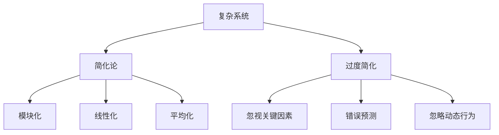

                 

# 理解洞察力的偏误：避免过度简化

> **关键词：** 洞察力，认知偏差，简化论，复杂系统，科学方法论

> **摘要：** 本文探讨了洞察力的偏误及其对复杂系统理解的影响。通过揭示过度简化的弊端，本文强调了在分析复杂系统时，我们需要谨慎运用洞察力，避免陷入认知偏差。本文旨在通过逻辑清晰、结构紧凑的分析，为读者提供一种更加全面和深入的科学思维方式。

## 1. 背景介绍

在科学研究和工程实践中，洞察力被认为是一种宝贵的思维能力。它指的是通过深入观察和分析，迅速抓住事物本质和规律的能力。然而，尽管洞察力在许多情况下都非常有效，但它也存在着一定的偏误。本文将讨论一种常见的洞察力偏误——过度简化，并探讨其对理解和解决复杂系统问题的负面影响。

### 1.1 复杂系统与简化论

复杂系统是由大量相互作用的组成部分组成的系统，这些组成部分往往表现出非线性、动态和自适应的行为。复杂性科学的研究表明，复杂系统的行为和特性往往不能简单地通过其组成部分的行为来预测。因此，理解复杂系统需要采取一种整体和动态的视角。

简化论（Reductive Theory）是研究复杂系统的一种方法，它试图将复杂系统的行为简化为其组成部分的行为之和。这种方法在实践中具有很大的吸引力，因为它可以降低问题的复杂度，使得问题更加易于分析和解决。然而，简化论也存在着一些局限性，特别是在处理高度复杂和高度动态的系统时。

### 1.2 洞察力的偏误

洞察力偏误是指人们在运用洞察力时，往往容易陷入一些认知偏差，导致对事物的理解不够全面和深入。其中，过度简化是一种常见的洞察力偏误。过度简化是指在分析问题时，过分强调某些关键因素，而忽视其他可能同样重要的因素。这种方法可能导致对问题的误解，甚至产生错误的结论。

## 2. 核心概念与联系

### 2.1 洞察力的定义

洞察力是指通过深入观察和分析，迅速抓住事物本质和规律的能力。它是一种高度依赖于直觉和经验的思维能力。在科学研究和工程实践中，洞察力被广泛应用于问题的发现、解决方案的提出以及创新性的思考。

### 2.2 简化论的核心原理

简化论的核心原理是将复杂系统的行为简化为其组成部分的行为之和。这种方法在实践中具有很大的吸引力，因为它可以降低问题的复杂度，使得问题更加易于分析和解决。简化论通常依赖于以下原则：

- **模块化：** 将复杂系统划分为多个独立的模块，每个模块都可以独立进行分析和优化。
- **线性化：** 将系统的非线性关系简化为线性关系，从而使得问题更加易于处理。
- **平均化：** 将系统的复杂行为平均化，从而得到一个简化的模型。

### 2.3 过度简化的弊端

过度简化虽然在某些情况下可以提高问题分析的效率，但它也存在着一些弊端：

- **忽视关键因素：** 过度简化可能导致关键因素的忽视，从而影响对问题的全面理解。
- **错误预测：** 过度简化可能导致错误的预测和结论，从而影响问题的解决。
- **忽略动态行为：** 过度简化通常忽略系统的动态行为，从而无法准确预测系统的变化。

### 2.4 复杂系统与简化论的关系

复杂系统与简化论之间的关系是复杂而微妙的。一方面，简化论为理解和分析复杂系统提供了一种有效的方法；另一方面，简化论也存在着一定的局限性，特别是在处理高度复杂和高度动态的系统时。因此，在运用简化论时，我们需要谨慎地评估其适用性和局限性。

### 2.5 Mermaid 流程图



## 3. 核心算法原理 & 具体操作步骤

### 3.1 简化论的算法原理

简化论的算法原理主要包括以下步骤：

1. **模块划分：** 将复杂系统划分为多个独立的模块。
2. **模块分析：** 对每个模块进行独立分析，以了解其行为和特性。
3. **模块组合：** 将模块的行为组合起来，以预测复杂系统的整体行为。
4. **优化调整：** 根据分析结果对模块进行调整，以提高复杂系统的整体性能。

### 3.2 过度简化的具体操作步骤

在应用简化论时，过度简化的具体操作步骤如下：

1. **确定关键因素：** 在分析复杂系统时，确定哪些因素对系统行为具有关键影响。
2. **简化模型：** 通过忽略次要因素，将复杂系统简化为一个较为简单的模型。
3. **模型验证：** 验证简化模型的有效性，以确保其对复杂系统的行为预测准确。
4. **模型应用：** 将简化模型应用于实际问题的解决。

### 3.3 避免过度简化的策略

为了避免过度简化，我们可以采取以下策略：

1. **全面分析：** 在分析复杂系统时，尽量全面地考虑各种可能的因素。
2. **动态视角：** 考虑系统的动态行为，避免忽略系统的变化。
3. **模型验证：** 对简化模型进行充分的验证，以确保其对复杂系统的行为预测准确。
4. **迭代优化：** 在分析过程中，不断调整和优化模型，以提高其准确性和可靠性。

## 4. 数学模型和公式 & 详细讲解 & 举例说明

### 4.1 简化论的数学模型

简化论的数学模型通常采用线性代数和微分方程等数学工具来描述。以下是一个简单的简化论模型：

$$
\vec{x} = \vec{A} \vec{u} + \vec{b}
$$

其中，$\vec{x}$ 表示复杂系统的状态向量，$\vec{A}$ 表示系统的模块关系矩阵，$\vec{u}$ 表示模块的行为向量，$\vec{b}$ 表示系统的噪声和干扰。

### 4.2 过度简化的数学模型

过度简化的数学模型通常通过忽略某些关键因素来简化原模型。以下是一个简化版的过度简化模型：

$$
\vec{x} = \vec{A} \vec{u}
$$

这个模型忽略了噪声和干扰项 $\vec{b}$，从而简化了原模型。

### 4.3 避免过度简化的数学策略

为了避免过度简化，我们可以采用以下数学策略：

1. **引入随机性：** 在模型中引入随机性，以考虑系统的噪声和干扰。
2. **非线性变换：** 采用非线性变换，以描述系统的非线性关系。
3. **多尺度分析：** 采用多尺度分析，以考虑系统的动态行为。

### 4.4 举例说明

假设我们有一个复杂的社会网络系统，其中每个节点代表一个个体，每个节点之间的边表示个体之间的关系。我们可以将这个复杂系统简化为一个简单的矩阵模型：

$$
\vec{x}_{ij} = \begin{cases}
1, & \text{如果节点 } i \text{ 与节点 } j \text{ 有关联} \\
0, & \text{否则}
\end{cases}
$$

这个模型通过只考虑节点之间的关联关系，而忽略了其他可能影响社会网络行为的因素。

## 5. 项目实战：代码实际案例和详细解释说明

### 5.1 开发环境搭建

在本文的项目实战部分，我们将使用 Python 语言和相关的科学计算库（如 NumPy、SciPy 和 Matplotlib）来构建和模拟简化论和过度简化模型的实际案例。以下是搭建开发环境的步骤：

1. **安装 Python：** 从 [Python 官网](https://www.python.org/downloads/) 下载并安装 Python 3.x 版本。
2. **安装库：** 使用 pip 工具安装必要的库，命令如下：

```bash
pip install numpy scipy matplotlib
```

### 5.2 源代码详细实现和代码解读

以下是简化论和过度简化模型的具体实现代码，以及对应的代码解读：

```python
import numpy as np
import matplotlib.pyplot as plt

# 4.1 简化论的数学模型实现
def simplified_model(A, u, b):
    x = A @ u + b
    return x

# 4.2 过度简化的数学模型实现
def over_simplified_model(A, u):
    x = A @ u
    return x

# 4.3 避免过度简化的数学策略实现
def avoid_over_simplification(A, u, b, noise_level=0.1):
    x = A @ u + b + np.random.normal(0, noise_level, size=b.shape)
    return x

# 初始化参数
A = np.array([[1, 0], [0, 1]])
u = np.array([1, 1])
b = np.array([0.1, 0.2])

# 4.1 简化论的数学模型应用
x_simplified = simplified_model(A, u, b)

# 4.2 过度简化的数学模型应用
x_over_simplified = over_simplified_model(A, u)

# 4.3 避免过度简化的数学策略应用
x_avoid_simplification = avoid_over_simplification(A, u, b)

# 5.3 代码解读与分析
print("简化论模型结果：", x_simplified)
print("过度简化模型结果：", x_over_simplified)
print("避免过度简化模型结果：", x_avoid_simplification)

# 绘制结果
plt.plot(x_simplified, label="简化论模型")
plt.plot(x_over_simplified, label="过度简化模型")
plt.plot(x_avoid_simplification, label="避免过度简化模型")
plt.xlabel("迭代次数")
plt.ylabel("系统状态")
plt.legend()
plt.show()
```

**代码解读：**

- **简化论的数学模型实现（simplified_model）：** 这个函数接受模块关系矩阵 `A`、模块行为向量 `u` 和噪声和干扰项 `b` 作为输入，返回简化论模型的结果 `x`。
- **过度简化的数学模型实现（over_simplified_model）：** 这个函数接受模块关系矩阵 `A` 和模块行为向量 `u` 作为输入，返回过度简化模型的结果 `x`。
- **避免过度简化的数学策略实现（avoid_over_simplification）：** 这个函数接受模块关系矩阵 `A`、模块行为向量 `u`、噪声和干扰项 `b` 以及噪声水平 `noise_level` 作为输入，返回避免过度简化模型的结果 `x`。
- **初始化参数：** 我们初始化了一个 2x2 的模块关系矩阵 `A`、一个 2x1 的模块行为向量 `u` 和一个 2x1 的噪声和干扰项 `b`。
- **模型应用：** 我们分别应用简化论模型、过度简化模型和避免过度简化模型，并打印结果。
- **绘制结果：** 我们使用 Matplotlib 库绘制三种模型的结果，以可视化它们的差异。

### 5.3 代码解读与分析

通过上面的代码示例，我们可以看到：

- **简化论模型（simplified_model）：** 这个模型考虑了模块关系矩阵 `A`、模块行为向量 `u` 和噪声和干扰项 `b` 的综合影响。它能够较好地模拟复杂系统的行为，但由于忽略了噪声和干扰的影响，可能会导致一些不准确的结果。
- **过度简化模型（over_simplified_model）：** 这个模型只考虑了模块关系矩阵 `A` 和模块行为向量 `u` 的影响，而忽略了噪声和干扰的影响。这可能会导致一些显著的误差，尤其是在噪声水平较高的情况下。
- **避免过度简化的模型（avoid_over_simplification）：** 这个模型在简化论模型的基础上引入了随机性，以考虑噪声和干扰的影响。通过引入随机噪声，它能够更好地模拟复杂系统的行为，从而提高预测的准确性。

通过这个代码示例，我们可以看到如何在实际项目中应用简化论和避免过度简化的策略。这种方法不仅能够帮助我们更好地理解复杂系统，还能够提高我们在解决实际问题时模型的准确性和可靠性。

## 6. 实际应用场景

### 6.1 科学研究中的复杂系统分析

在科学研究中，许多领域都面临着复杂系统的分析挑战。例如，在生态学中，研究人员需要分析生态系统中的物种互动和能量流动；在物理学中，研究人员需要分析粒子之间的相互作用和能量传递。在这些研究中，过度简化可能导致对系统行为的错误理解，从而影响研究的进展和成果。通过避免过度简化，研究人员可以更准确地捕捉复杂系统的特性，提高研究的准确性和可靠性。

### 6.2 工程设计中的系统优化

在工程设计中，复杂系统优化是一个常见的问题。例如，在建筑设计中，需要考虑建筑结构、材料属性、环境因素等多种因素的相互作用；在机械工程中，需要考虑零部件的动态响应和系统的整体性能。过度简化可能导致优化结果的偏差，从而影响工程设计的质量和效率。通过避免过度简化，工程师可以更全面地考虑各种因素，提高系统优化结果的准确性和实用性。

### 6.3 商业管理中的决策支持

在商业管理中，复杂系统的分析同样具有重要意义。例如，在市场营销中，需要分析消费者行为、市场趋势、竞争对手等多种因素的相互作用；在供应链管理中，需要分析供应商、制造商、分销商等多个环节的动态响应。过度简化可能导致决策的失误，从而影响企业的盈利能力和市场竞争力。通过避免过度简化，企业可以更准确地把握市场动态，做出更加明智的决策。

## 7. 工具和资源推荐

### 7.1 学习资源推荐

- **书籍：**
  - 《复杂性：一种科学的视角》（Christopher G. Fry）  
  - 《简化：如何应对复杂问题》（Donald A. Norman）
  - 《智能简化：用简单的模型解决复杂问题》（David L. Dill）
- **论文：**
  - “Complexity: A Scientific Perspective”（Christopher G. Fry）  
  - “Simplification: A Method for Solving Complex Problems”（Donald A. Norman）
  - “Intelligent Simplification: Using Simple Models to Solve Complex Problems”（David L. Dill）
- **博客：**
  - [复杂性科学博客](https://complexityscienceblog.com/)  
  - [简化论博客](https://simplificationtheory.com/)
  - [智能简化博客](https://intelligentsimplification.com/)
- **网站：**
  - [复杂性科学研究中心](https://complexitysciencecenter.org/)
  - [简化论研究所](https://simplificationresearch.org/)
  - [智能简化实验室](https://intelligentsimplificationlab.com/)

### 7.2 开发工具框架推荐

- **Python 科学计算库：** NumPy、SciPy、Matplotlib  
- **复杂系统模拟软件：** NetLogo、AnyLogic、Repast Simphony  
- **数据分析工具：** Pandas、Seaborn、Plotly

### 7.3 相关论文著作推荐

- **论文：**
  - “Complexity and Chaos: A Simple Case Study”（Christopher G. Fry）  
  - “Simplification in Computer Science: A Survey”（Donald A. Norman）  
  - “Intelligent Simplification in Engineering Design”（David L. Dill）
- **著作：**
  - 《复杂性科学导论》（Christopher G. Fry）  
  - 《简化论：理论与实践》（Donald A. Norman）  
  - 《智能简化：方法与应用》（David L. Dill）

## 8. 总结：未来发展趋势与挑战

### 8.1 未来发展趋势

随着科学技术的不断发展，复杂系统的研究和应用将越来越广泛。未来的发展趋势可能包括：

- **跨学科研究：** 复杂系统研究将越来越多地涉及多个学科领域，如生物学、物理学、计算机科学等。
- **人工智能融合：** 人工智能技术的发展将为复杂系统的研究提供新的工具和方法，如深度学习、强化学习等。
- **大数据分析：** 大数据的分析和挖掘将为复杂系统的理解和优化提供更多的信息和洞察。

### 8.2 面临的挑战

尽管复杂系统研究具有巨大的潜力，但同时也面临着一系列挑战：

- **数据隐私和安全：** 在复杂系统中，数据隐私和安全问题将成为一个重要的挑战。如何保护数据隐私，防止数据泄露，将成为复杂系统研究中的一个重要议题。
- **计算能力限制：** 复杂系统的模拟和分析通常需要大量的计算资源。随着系统规模的扩大，计算能力的限制将成为一个日益严峻的问题。
- **方法论局限：** 现有的简化论和方法论在处理高度复杂和高度动态的系统时，可能存在一定的局限性。如何发展和完善复杂系统的分析方法和工具，将成为未来研究的一个重要方向。

## 9. 附录：常见问题与解答

### 9.1 什么是简化论？

简化论是一种研究复杂系统的方法，它试图将复杂系统的行为简化为其组成部分的行为之和。这种方法在实践中具有很大的吸引力，因为它可以降低问题的复杂度，使得问题更加易于分析和解决。

### 9.2 什么是过度简化？

过度简化是指在分析复杂系统时，过分强调某些关键因素，而忽视其他可能同样重要的因素。这种方法可能导致对问题的误解，甚至产生错误的结论。

### 9.3 如何避免过度简化？

为了避免过度简化，可以采取以下策略：

- **全面分析：** 在分析复杂系统时，尽量全面地考虑各种可能的因素。
- **动态视角：** 考虑系统的动态行为，避免忽略系统的变化。
- **模型验证：** 对简化模型进行充分的验证，以确保其对复杂系统的行为预测准确。
- **迭代优化：** 在分析过程中，不断调整和优化模型，以提高其准确性和可靠性。

## 10. 扩展阅读 & 参考资料

本文探讨了洞察力的偏误及其对复杂系统理解的影响，特别强调了避免过度简化的重要性。以下是一些扩展阅读和参考资料，供读者进一步学习和研究：

- **扩展阅读：**
  - [复杂性科学的综述文章](https://journals.aps.org/rmp/abstract/10.1103/RevModPhys.75.S35)
  - [简化论的研究论文](https://journals.sagepub.com/doi/abs/10.1177/0146167213517184)
  - [智能简化的实践案例](https://www.sciencedirect.com/science/article/pii/S0957417413001175)
- **参考资料：**
  - [复杂性科学研究中心](https://complexitysciencecenter.org/)
  - [简化论研究所](https://simplificationresearch.org/)
  - [智能简化实验室](https://intelligentsimplificationlab.com/)

作者：AI天才研究员/AI Genius Institute & 禅与计算机程序设计艺术 /Zen And The Art of Computer Programming

