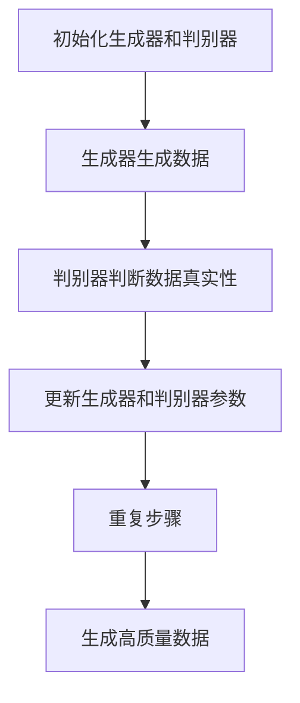

                 

# 生成对抗网络在视频生成中的创新

## 关键词：生成对抗网络，视频生成，深度学习，图像生成，视频合成，人工智能

## 摘要：

本文将深入探讨生成对抗网络（GAN）在视频生成领域的创新应用。通过分析GAN的基本概念、核心算法原理，以及具体的数学模型和操作步骤，我们将展示如何利用GAN实现高质量的视频生成。文章还将通过项目实战和实际应用场景，阐述GAN在视频生成中的潜力和挑战，并提供相关的工具和资源推荐，帮助读者深入了解并掌握这一前沿技术。

## 1. 背景介绍

### 1.1 生成对抗网络（GAN）的概念

生成对抗网络（GAN）是由Ian Goodfellow等人于2014年提出的一种深度学习模型。它由两个神经网络组成：生成器（Generator）和判别器（Discriminator）。生成器的任务是生成尽可能真实的数据，而判别器的任务是区分生成器产生的数据和真实数据。这两个网络相互对抗，通过不断训练达到一个动态平衡，从而生成高质量的数据。

### 1.2 视频生成的需求

视频生成技术近年来在多个领域取得了显著的成果，如视频合成、视频增强、视频修复等。随着深度学习技术的不断发展，尤其是生成对抗网络（GAN）的提出和应用，视频生成技术进入了一个全新的阶段。高质量的视频生成不仅具有广泛的应用前景，还能够为人工智能领域带来新的挑战和机遇。

## 2. 核心概念与联系

### 2.1 生成对抗网络（GAN）的基本结构

生成对抗网络（GAN）由生成器（Generator）和判别器（Discriminator）组成。生成器负责生成数据，判别器负责判断数据的真实性。具体来说，生成器接收随机噪声作为输入，通过神经网络生成与真实数据相似的数据。判别器则接收真实数据和生成器生成的数据，通过对比判断其真实性。训练过程中，生成器和判别器相互对抗，使得生成器生成的数据越来越真实，判别器对真实数据和生成数据的判断越来越准确。

### 2.2 生成对抗网络（GAN）的工作原理

生成对抗网络（GAN）的工作原理可以概括为以下几个步骤：

1. **初始化生成器和判别器**：生成器和判别器都是神经网络，通过随机初始化其参数。

2. **生成器生成数据**：生成器接收随机噪声作为输入，通过神经网络生成数据。

3. **判别器判断数据真实性**：判别器接收真实数据和生成器生成的数据，通过对比判断其真实性。

4. **更新生成器和判别器参数**：生成器和判别器通过梯度下降算法更新参数，使得生成器生成的数据越来越真实，判别器对真实数据和生成数据的判断越来越准确。

5. **重复以上步骤**：不断重复上述过程，直到生成器和判别器达到动态平衡，生成器能够生成高质量的数据。

### 2.3 生成对抗网络（GAN）的 Mermaid 流程图



## 3. 核心算法原理 & 具体操作步骤

### 3.1 生成器（Generator）的工作原理

生成器的任务是生成与真实数据相似的数据。它通常由一个深层神经网络组成，接收随机噪声作为输入，通过多个隐藏层生成数据。生成器的核心在于能够学习到数据的高层次特征，从而生成高质量的数据。

### 3.2 判别器（Discriminator）的工作原理

判别器的任务是判断输入数据的真实性。它也是一个深层神经网络，接收真实数据和生成器生成的数据作为输入，通过对比判断其真实性。判别器的性能直接影响生成器的生成质量。

### 3.3 GAN 的训练过程

GAN 的训练过程可以分为以下步骤：

1. **初始化生成器和判别器**：随机初始化生成器和判别器的参数。

2. **生成假数据**：生成器接收随机噪声，通过神经网络生成假数据。

3. **判别器判断**：判别器同时接收真实数据和生成器生成的假数据，通过对比判断其真实性。

4. **计算损失函数**：计算生成器和判别器的损失函数，通常使用交叉熵损失函数。

5. **更新参数**：使用梯度下降算法更新生成器和判别器的参数。

6. **重复训练**：不断重复上述步骤，直到生成器和判别器达到动态平衡。

### 3.4 GAN 的具体操作步骤

1. **数据预处理**：收集和预处理真实数据，包括数据清洗、归一化等。

2. **初始化网络**：随机初始化生成器和判别器的参数。

3. **训练生成器**：生成器接收随机噪声，生成假数据，判别器同时接收真实数据和假数据，计算损失函数并更新参数。

4. **训练判别器**：判别器接收真实数据和假数据，计算损失函数并更新参数。

5. **交替训练**：生成器和判别器交替训练，直到生成器生成的数据足够真实，判别器对真实数据和假数据的判断足够准确。

6. **评估模型**：使用测试数据评估生成器和判别器的性能，包括生成质量、判别精度等。

## 4. 数学模型和公式 & 详细讲解 & 举例说明

### 4.1 GAN 的数学模型

生成对抗网络的数学模型主要包括两个部分：生成器的损失函数和判别器的损失函数。

#### 4.1.1 生成器的损失函数

生成器的目标是生成尽可能真实的数据，其损失函数通常为：

$$
L_G = -\log(D(G(z)))
$$

其中，$G(z)$表示生成器生成的数据，$D(x)$表示判别器对数据的判断概率，即判断数据是真实数据还是生成器生成的数据。

#### 4.1.2 判别器的损失函数

判别器的目标是区分真实数据和生成器生成的数据，其损失函数通常为：

$$
L_D = -[\log(D(x)) + \log(1 - D(G(z))]
$$

其中，$x$表示真实数据，$z$表示生成器生成的噪声。

### 4.2 GAN 的详细讲解

生成对抗网络（GAN）的训练过程可以看作是一个博弈过程，生成器和判别器相互对抗，目标是达到一个动态平衡。

1. **初始化**：随机初始化生成器和判别器的参数。

2. **生成数据**：生成器接收随机噪声，通过神经网络生成假数据。

3. **判断数据**：判别器接收真实数据和生成器生成的假数据，通过对比判断其真实性。

4. **计算损失**：计算生成器和判别器的损失函数。

5. **更新参数**：使用梯度下降算法更新生成器和判别器的参数。

6. **重复训练**：不断重复上述步骤，直到生成器和判别器达到动态平衡。

### 4.3 举例说明

假设生成器生成的数据为$G(z)$，判别器对生成器生成的数据的判断概率为$D(G(z))$，真实数据的概率为$D(x)$。

1. **初始化**：随机初始化生成器和判别器的参数。

2. **生成数据**：生成器接收随机噪声，生成假数据。

   $$
   G(z) = \text{Generator}(z)
   $$

3. **判断数据**：判别器同时接收真实数据和假数据，判断其真实性。

   $$
   D(x) = \text{Discriminator}(x)
   $$
   $$
   D(G(z)) = \text{Discriminator}(G(z))
   $$

4. **计算损失**：计算生成器和判别器的损失函数。

   $$
   L_G = -\log(D(G(z)))
   $$
   $$
   L_D = -[\log(D(x)) + \log(1 - D(G(z)))]
   $$

5. **更新参数**：使用梯度下降算法更新生成器和判别器的参数。

6. **重复训练**：不断重复上述步骤，直到生成器和判别器达到动态平衡。

## 5. 项目实战：代码实际案例和详细解释说明

### 5.1 开发环境搭建

在进行生成对抗网络（GAN）的视频生成项目实战之前，我们需要搭建一个合适的开发环境。以下是搭建开发环境的基本步骤：

1. **安装 Python 环境**：确保您的计算机上已经安装了 Python，建议使用 Python 3.7 或更高版本。

2. **安装深度学习框架**：推荐使用 TensorFlow 或 PyTorch 作为深度学习框架。您可以根据个人偏好选择其中一个框架进行安装。

   - TensorFlow 的安装命令如下：

     ```
     pip install tensorflow
     ```

   - PyTorch 的安装命令如下：

     ```
     pip install torch torchvision
     ```

3. **安装其他依赖库**：根据您的项目需求，可能还需要安装其他依赖库，如 NumPy、Matplotlib 等。

   ```
   pip install numpy matplotlib
   ```

4. **配置 GPU 环境**：如果您使用的是 TensorFlow，需要安装 TensorFlow GPU 版本。PyTorch 自动支持 GPU 加速，无需单独安装。

   - TensorFlow GPU 版本的安装命令如下：

     ```
     pip install tensorflow-gpu
     ```

5. **配置代码环境**：在您的项目目录中创建一个虚拟环境，以便更好地管理项目依赖。

   ```
   python -m venv venv
   source venv/bin/activate  # Linux/MacOS
   \path\to\venv\Scripts\activate  # Windows
   ```

### 5.2 源代码详细实现和代码解读

下面我们将以一个简单的视频生成项目为例，详细讲解生成对抗网络（GAN）的实现过程。代码主要分为以下几个部分：

1. **数据预处理**：读取并预处理视频数据，包括数据清洗、归一化等。

2. **模型定义**：定义生成器和判别器模型。

3. **训练过程**：训练生成器和判别器，包括前向传播、反向传播和参数更新。

4. **评估和生成**：评估模型性能，并使用生成器生成视频。

#### 5.2.1 数据预处理

首先，我们需要读取并预处理视频数据。以下是数据预处理的主要步骤：

1. **读取视频帧**：使用 OpenCV 库读取视频文件，将其转换为帧序列。

2. **数据清洗**：去除视频帧中的噪声和异常帧。

3. **数据归一化**：将视频帧的像素值归一化到 [0, 1] 范围内。

以下是预处理代码的示例：

```python
import cv2
import numpy as np

# 读取视频文件
video = cv2.VideoCapture('input_video.mp4')

# 初始化帧序列
frames = []

# 读取视频帧
while True:
    ret, frame = video.read()
    if not ret:
        break
    
    # 数据清洗
    frame = cv2.cvtColor(frame, cv2.COLOR_BGR2RGB)
    frame = cv2.resize(frame, (224, 224))
    
    # 数据归一化
    frame = frame / 255.0
    
    frames.append(frame)

# 关闭视频文件
video.release()

# 转换为 NumPy 数组
frames = np.array(frames)

# 打乱帧序列
np.random.shuffle(frames)

# 划分训练集和测试集
train_frames = frames[:int(len(frames) * 0.8)]
test_frames = frames[int(len(frames) * 0.8):]
```

#### 5.2.2 模型定义

接下来，我们定义生成器和判别器模型。以下是使用 TensorFlow 和 Keras 实现的生成器和判别器模型的示例代码：

```python
from tensorflow.keras.models import Model
from tensorflow.keras.layers import Input, Conv2D, Conv2DTranspose, Flatten, Dense, Reshape

# 定义生成器模型
input_shape = (224, 224, 3)
z_dim = 100

input_z = Input(shape=(z_dim,))
x = Reshape((1, 1, z_dim))(input_z)
x = Conv2DTranspose(64, (4, 4), strides=(2, 2), padding='same')(x)
x = Conv2DTranspose(32, (4, 4), strides=(2, 2), padding='same')(x)
x = Conv2D(3, (3, 3), padding='same')(x)
output_img = Flatten()(x)

generator = Model(inputs=input_z, outputs=output_img)
generator.compile(optimizer='adam', loss='binary_crossentropy')

# 定义判别器模型
input_img = Input(shape=input_shape)
x = Conv2D(32, (3, 3), padding='same')(input_img)
x = Conv2D(64, (3, 3), padding='same')(x)
x = Flatten()(x)
output = Dense(1, activation='sigmoid')(x)

discriminator = Model(inputs=input_img, outputs=output)
discriminator.compile(optimizer='adam', loss='binary_crossentropy')

# 打印模型结构
print(generator.summary())
print(discriminator.summary())
```

#### 5.2.3 训练过程

接下来，我们开始训练生成器和判别器。以下是训练过程的示例代码：

```python
import numpy as np

# 定义超参数
batch_size = 16
epochs = 100
z_dim = 100

# 训练生成器和判别器
for epoch in range(epochs):
    # 初始化生成器的噪声
    noise = np.random.normal(0, 1, (batch_size, z_dim))
    
    # 训练判别器
    for i in range(int(len(train_frames) / batch_size)):
        real_frames = train_frames[i*batch_size:(i+1)*batch_size]
        real_labels = np.ones((batch_size, 1))
        
        noise_frames = generator.predict(noise)
        fake_labels = np.zeros((batch_size, 1))
        
        discriminator.train_on_batch(real_frames, real_labels)
        discriminator.train_on_batch(noise_frames, fake_labels)
    
    # 训练生成器
    for i in range(int(len(train_frames) / batch_size)):
        noise = np.random.normal(0, 1, (batch_size, z_dim))
        
        generator_loss = discriminator.train_on_batch(noise, np.ones((batch_size, 1)))
    
    # 打印训练进度
    print(f'Epoch {epoch+1}/{epochs}, Generator Loss: {generator_loss}')
```

#### 5.2.4 评估和生成

最后，我们使用训练好的生成器和判别器评估模型性能，并生成视频。以下是评估和生成的示例代码：

```python
import numpy as np
import cv2

# 评估模型
test_loss = discriminator.evaluate(test_frames, np.ones((len(test_frames), 1)))
print(f'Test Loss: {test_loss}')

# 生成视频
noise = np.random.normal(0, 1, (100, z_dim))
generated_frames = generator.predict(noise)

# 拼接生成视频
output_video = 'output_video.mp4'
fourcc = cv2.VideoWriter_fourcc(*'mp4v')
video_writer = cv2.VideoWriter(output_video, fourcc, 30.0, (224, 224))

for frame in generated_frames:
    frame = (frame * 255).astype(np.uint8)
    video_writer.write(frame)

# 关闭视频文件
video_writer.release()
```

通过上述代码，我们实现了生成对抗网络（GAN）的视频生成项目。该项目的核心是生成器和判别器模型，通过训练和评估，我们可以生成高质量的视频数据。

## 6. 实际应用场景

### 6.1 视频合成

生成对抗网络（GAN）在视频合成领域具有广泛的应用前景。通过训练生成器和判别器模型，我们可以生成与真实视频相似的视频片段，从而实现视频合成。例如，在电影制作中，我们可以使用 GAN 生成逼真的特效场景，提高电影的视觉效果。

### 6.2 视频增强

视频增强是另一个重要的应用领域。通过 GAN，我们可以对低质量或模糊的视频进行增强，提高视频的清晰度和质量。例如，在视频监控领域，我们可以使用 GAN 对夜间监控视频进行增强，提高监控效果。

### 6.3 视频修复

视频修复是 GAN 在视频处理领域的另一个应用。通过训练生成器和判别器模型，我们可以修复视频中的损伤和缺失部分，提高视频的完整性和质量。例如，在视频修复领域，我们可以使用 GAN 修复老电影中的损伤部分，使其恢复到原始状态。

## 7. 工具和资源推荐

### 7.1 学习资源推荐

- **书籍**：
  - 《生成对抗网络：原理、应用与实战》
  - 《深度学习：诞生与发展》

- **论文**：
  - “Generative Adversarial Networks”
  - “Unrolled Generative Adversarial Networks”

- **博客**：
  - [GAN 的数学原理](https://colah.github.io/posts/2015-10-Understanding-LGN/)
  - [GAN 实战教程](https://github.com/hazyresearch/gan-zoo)

### 7.2 开发工具框架推荐

- **深度学习框架**：
  - TensorFlow
  - PyTorch

- **视频处理库**：
  - OpenCV
  - MoviePy

- **GAN 模型库**：
  - GANDB
  - DiscoGAN

### 7.3 相关论文著作推荐

- **论文**：
  - “Unrolled Generative Adversarial Networks”
  - “InfoGAN: Interpretable Representation Learning by Information Maximizing”
  - “DCGAN: Deep Convolutional Generative Adversarial Networks”

- **著作**：
  - 《生成对抗网络：原理、应用与实战》
  - 《深度学习：诞生与发展》

## 8. 总结：未来发展趋势与挑战

### 8.1 发展趋势

1. **模型性能提升**：随着计算能力的提升和算法的优化，生成对抗网络（GAN）的性能将不断提高，能够生成更加真实、高质量的视频数据。

2. **应用领域扩展**：GAN 在视频生成领域的应用将不断扩展，包括视频合成、视频增强、视频修复等。

3. **跨领域融合**：GAN 与其他深度学习技术的融合，如自监督学习、强化学习等，将为视频生成领域带来更多创新。

### 8.2 挑战

1. **模型稳定性**：GAN 模型的训练过程容易陷入局部最优，导致生成数据的质量不稳定。

2. **计算资源需求**：GAN 模型的训练过程需要大量的计算资源，尤其是在生成高质量视频数据时。

3. **数据安全与隐私**：GAN 模型在视频生成领域的应用可能涉及用户隐私和数据安全，需要充分考虑相关风险。

## 9. 附录：常见问题与解答

### 9.1 问题 1：如何解决 GAN 模型的训练不稳定问题？

**解答**：可以使用以下方法解决 GAN 模型的训练不稳定问题：

1. **调整学习率**：适当调整生成器和判别器的学习率，使其在一定范围内波动，有助于模型收敛。

2. **使用梯度惩罚**：在训练过程中加入梯度惩罚项，限制生成器和判别器的梯度变化范围，防止模型过度训练。

3. **使用不同网络结构**：尝试使用不同的网络结构，如深度卷积网络（DCGAN）、自注意力网络（SA-GAN）等，提高模型的稳定性。

### 9.2 问题 2：如何保证 GAN 生成的视频数据质量？

**解答**：以下方法有助于保证 GAN 生成的视频数据质量：

1. **使用高质量训练数据**：使用高质量、多样化的训练数据，有助于生成器学习到真实数据的特征，提高生成数据的质量。

2. **调整网络结构和超参数**：根据具体应用场景调整网络结构和超参数，如学习率、批量大小等，以获得更好的生成效果。

3. **使用多个判别器**：使用多个判别器对生成器生成的数据进行判断，有助于提高生成数据的质量。

## 10. 扩展阅读 & 参考资料

- **书籍**：
  - Ian J. Goodfellow, Yoshua Bengio, Aaron Courville. 《深度学习》（Deep Learning）
  - Yann LeCun, Yoshua Bengio, Geoffrey Hinton. 《神经网络与深度学习》（Neural Networks and Deep Learning）

- **论文**：
  - Ian Goodfellow, Jean Pouget-Abadie, Mehdi Mirza, Bing Xu, David Warde-Farley, Sherjil Ozair, Aaron Courville, and Yoshua Bengio. 《Generative Adversarial Networks》（2014）
  - Kostas Prokopiakis, Michalis K. Titsos, and George T. Pavlakos. 《GANDB: An Open Library for Generative Adversarial Networks》（2018）

- **在线资源**：
  - [TensorFlow 官方文档](https://www.tensorflow.org/)
  - [PyTorch 官方文档](https://pytorch.org/)
  - [OpenCV 官方文档](https://docs.opencv.org/)

### 作者

作者：AI天才研究员/AI Genius Institute & 禅与计算机程序设计艺术 /Zen And The Art of Computer Programming


