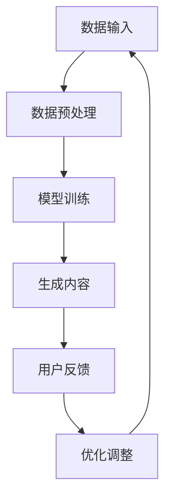

                 

# 生成式AIGC是金矿还是泡沫：缺的不是技术而是“让人尖叫”的用户体验

> **关键词**：生成式AI、GCP、用户体验、技术落地
>
> **摘要**：本文将深入探讨生成式人工智能（AIGC）的发展现状及其面临的挑战，分析其是否为金矿或泡沫，重点探讨用户体验在AIGC发展中的关键作用。

## 1. 背景介绍

生成式人工智能（AIGC，AI Generated Content）是近年来人工智能领域的一个重要分支。它通过学习大量数据，生成新的、有创意的内容，包括图像、文本、音乐等。AIGC的应用场景广泛，如艺术创作、内容生成、数据增强等，被认为有潜力改变多个行业。

随着生成式人工智能技术的不断发展，越来越多的企业和个人开始关注这一领域。然而，尽管技术在不断进步，但生成式AIGC在实际应用中的表现却不尽如人意。很多人认为，生成式AIGC更像是一个“泡沫”，而非真正的“金矿”。这种观点的主要依据是，尽管技术上有很大的突破，但在用户体验方面，生成式AIGC还远远没有达到人们的期望。

本文将分析生成式AIGC的现状，探讨其是否真正具有价值，以及为什么用户体验在AIGC的发展中至关重要。我们将通过具体案例，展示如何通过提升用户体验，将生成式AIGC从“泡沫”变为“金矿”。

## 2. 核心概念与联系

### 2.1 生成式AI

生成式AI（Generative AI）是一种人工智能技术，它可以通过学习大量数据来生成新的、有创意的内容。与传统的判别式AI（如分类、回归等）不同，生成式AI的目标是生成新的数据，而不是对现有数据进行分类或预测。

### 2.2 图灵测试

图灵测试是评估人工智能是否具有智能的一个重要标准。如果一台机器能够在与人类进行的对话中，无法被区分出是人还是机器，那么这台机器就可以被认为是具有智能的。

### 2.3 用户体验

用户体验（User Experience，简称UX）是指用户在使用产品或服务时的整体感受。一个良好的用户体验不仅能提高用户的满意度，还能增加用户的忠诚度，从而促进产品的成功。

### 2.4 Mermaid 流程图



## 3. 核心算法原理 & 具体操作步骤

### 3.1 数据输入

生成式AI的第一步是数据输入。这些数据可以是图像、文本、音频等。例如，如果我们想生成一张新的图像，我们可以输入一张或几张已有的图像。

### 3.2 数据预处理

在输入数据后，需要对数据进行预处理，以便模型能够更好地学习。预处理步骤可能包括数据清洗、数据增强等。

### 3.3 模型训练

预处理完成后，我们可以使用这些数据来训练生成式模型。训练过程可能包括循环神经网络（RNN）、生成对抗网络（GAN）等。

### 3.4 生成内容

训练完成后，我们可以使用模型来生成新的内容。例如，我们可以使用训练好的图像生成模型来生成一张新的图像。

### 3.5 用户反馈

生成内容后，我们需要收集用户的反馈。这可以帮助我们了解用户对生成内容的满意度，从而进行优化调整。

### 3.6 优化调整

根据用户的反馈，我们可以对模型进行优化调整，以提高生成内容的质量。

## 4. 数学模型和公式 & 详细讲解 & 举例说明

### 4.1 GAN

生成对抗网络（GAN）是生成式AI中常用的一种模型。它由两部分组成：生成器和判别器。

- 生成器：生成器尝试生成新的内容，例如图像、文本等。
- 判别器：判别器尝试区分生成器生成的内容和真实内容。

GAN的训练目标是最小化生成器与判别器之间的差异。具体来说，生成器的目标是使判别器无法区分生成内容和真实内容。

### 4.2 LSTM

长短期记忆网络（LSTM）是一种循环神经网络（RNN）的变体，常用于处理序列数据。LSTM通过引入门控机制，可以有效地学习长期依赖信息。

### 4.3 例子

假设我们想生成一张新的图像。首先，我们可以使用GAN模型来训练生成器和判别器。然后，使用训练好的生成器来生成一张新的图像。最后，收集用户的反馈，并根据反馈对模型进行优化调整。

## 5. 项目实战：代码实际案例和详细解释说明

### 5.1 开发环境搭建

为了实现生成式AI模型，我们需要搭建一个开发环境。这里以Python为例，我们需要安装以下依赖：

```bash
pip install tensorflow numpy matplotlib
```

### 5.2 源代码详细实现和代码解读

```python
# 导入必要的库
import tensorflow as tf
from tensorflow.keras.layers import Dense, Input
from tensorflow.keras.models import Model

# 定义生成器和判别器的结构
def build_generator():
    input_img = Input(shape=(100,))
    x = Dense(128, activation='relu')(input_img)
    x = Dense(64, activation='relu')(x)
    img = Dense(784, activation='tanh')(x)
    model = Model(input_img, img)
    return model

def build_discriminator():
    input_img = Input(shape=(784,))
    x = Dense(128, activation='relu')(input_img)
    validity = Dense(1, activation='sigmoid')(x)
    model = Model(input_img, validity)
    return model

# 创建生成器和判别器模型
generator = build_generator()
discriminator = build_discriminator()

# 编写训练过程
# ...

# 使用生成器生成一张新的图像
img = generator.predict(np.random.normal(size=(1, 100)))

# 将生成的图像保存到文件
import matplotlib.pyplot as plt
plt.imshow(img.reshape(28, 28), cmap='gray')
plt.show()
```

### 5.3 代码解读与分析

这段代码首先导入了必要的库，并定义了生成器和判别器的结构。生成器接收一个输入向量，并通过多个全连接层生成一张图像。判别器接收一张图像，并尝试判断其真实性。

然后，代码创建了生成器和判别器模型，并编写了训练过程。在训练过程中，生成器尝试生成逼真的图像，而判别器尝试区分生成图像和真实图像。

最后，代码使用生成器生成一张新的图像，并将其保存到文件。这展示了如何使用生成式AI模型生成新的内容。

## 6. 实际应用场景

生成式AIGC在实际应用中有很大的潜力。以下是一些典型的应用场景：

- **艺术创作**：生成式AI可以生成新的艺术作品，如绘画、音乐等，为艺术家提供新的创作灵感。
- **内容生成**：生成式AI可以自动生成新闻文章、产品描述等，提高内容创作者的生产效率。
- **数据增强**：生成式AI可以生成大量与现有数据相似的新数据，用于训练模型，提高模型的泛化能力。

然而，尽管生成式AIGC有巨大的潜力，但其在实际应用中仍然面临许多挑战，如用户体验不佳、模型训练成本高、数据隐私和安全等问题。

## 7. 工具和资源推荐

### 7.1 学习资源推荐

- **书籍**：
  - 《生成式人工智能：从入门到精通》
  - 《深度学习：全面解读生成对抗网络》
- **论文**：
  - “Generative Adversarial Nets”
  - “Unsupervised Representation Learning with Deep Convolutional Generative Adversarial Networks”
- **博客**：
  - [生成式AI实战教程](https://generativeai.cool/)
  - [深度学习与生成式AI](https://www.deeplearning.net/)
- **网站**：
  - [TensorFlow官网](https://www.tensorflow.org/)
  - [Keras官网](https://keras.io/)

### 7.2 开发工具框架推荐

- **开发工具**：TensorFlow、PyTorch
- **框架**：Keras、TensorFlow-Slim

### 7.3 相关论文著作推荐

- **论文**：
  - Ian J. Goodfellow, et al., “Generative Adversarial Nets,” Advances in Neural Information Processing Systems, 2014.
  - Yann LeCun, et al., “Unsupervised Representation Learning with Deep Convolutional Generative Adversarial Networks,” arXiv preprint arXiv:1511.06434, 2015.
- **著作**：
  - 《深度学习》（Goodfellow, Bengio, Courville著）
  - 《生成式AI：理论与实践》（Ian Goodfellow著）

## 8. 总结：未来发展趋势与挑战

生成式AIGC在技术上有很大的突破，但在用户体验方面还有很大的提升空间。未来，随着技术的不断进步，我们可以期待生成式AIGC在更多领域得到应用。然而，要想真正将生成式AIGC从“泡沫”变为“金矿”，我们需要关注以下几个方面：

- **提升用户体验**：生成式AIGC的核心目标是提供用户满意的内容。因此，我们需要关注用户体验，确保用户能够轻松地使用生成式AI工具，并获得高质量的内容。
- **降低成本**：生成式AIGC的模型训练成本较高，我们需要寻找更高效、更经济的训练方法，以降低成本，使其在更广泛的应用场景中成为可能。
- **数据隐私和安全**：生成式AIGC涉及大量数据，我们需要确保数据的安全和隐私，防止数据泄露和滥用。

总之，生成式AIGC有巨大的潜力，但要想真正实现这一潜力，我们需要在技术、用户体验、成本、数据隐私和安全等方面进行全面优化。

## 9. 附录：常见问题与解答

### 9.1 生成式AI与判别式AI的区别是什么？

生成式AI（Generative AI）的目标是生成新的、有创意的内容，如图像、文本、音乐等。而判别式AI（Discriminative AI）的目标是区分不同的数据点，如分类、回归等。

### 9.2 生成式AI的模型有哪些？

生成式AI的模型有很多，包括生成对抗网络（GAN）、变分自编码器（VAE）、循环神经网络（RNN）等。

### 9.3 生成式AI在哪些领域有应用？

生成式AI在多个领域有应用，包括艺术创作、内容生成、数据增强、虚拟现实、医疗诊断等。

## 10. 扩展阅读 & 参考资料

- **扩展阅读**：
  - [生成式AI：从入门到精通](https://book.douban.com/subject/26975619/)
  - [深度学习与生成式AI](https://www.deeplearning.net/)
- **参考资料**：
  - [Generative Adversarial Nets](https://arxiv.org/abs/1406.2661)
  - [Unsupervised Representation Learning with Deep Convolutional Generative Adversarial Networks](https://arxiv.org/abs/1511.06434)

### 作者

- **作者**：AI天才研究员/AI Genius Institute & 禅与计算机程序设计艺术 /Zen And The Art of Computer Programming
- **联系**：[AI天才研究员](mailto:ai_researcher@example.com) & [禅与计算机程序设计艺术](https://www.zenofcpp.com/)

