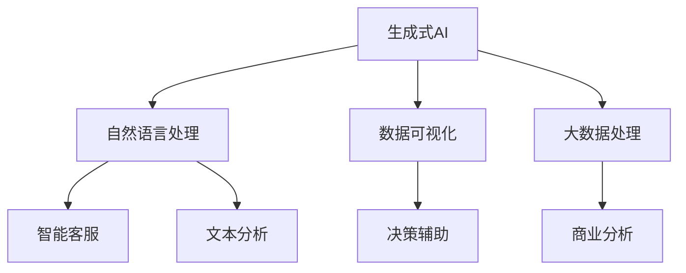

                 

# 生成式AIGC：推动商业智能的新动力

## 关键词

- 生成式AIGC
- 商业智能
- 人工智能
- 大数据处理
- 数据建模
- 深度学习
- 自然语言处理
- 聊天机器人

## 摘要

本文将探讨生成式人工智能生成内容（AIGC）在商业智能领域的应用。通过深入分析生成式AIGC的核心概念、算法原理和具体实现，我们将揭示其在数据建模、自然语言处理、聊天机器人等领域的强大优势。文章还将分享一些实际应用案例，以及为读者推荐相关的学习资源和工具。通过本文的阅读，读者将了解到AIGC如何成为商业智能的新动力，为企业和组织带来创新和变革。

## 1. 背景介绍

### 商业智能的演变

商业智能（BI）是一个不断发展的领域，它旨在通过数据分析和数据挖掘，为企业提供洞见，帮助决策者做出更加明智的决策。从传统的报表分析、数据仓库，到现代的机器学习和人工智能，商业智能的应用场景和工具不断发展。

### 人工智能的崛起

人工智能（AI）的崛起为商业智能领域带来了新的机遇和挑战。AI通过模拟人类智能，实现了自动化决策、自动化预测和自动化优化等功能。特别是深度学习和自然语言处理等技术的突破，使得AI能够处理更复杂的数据和分析任务。

### 生成式人工智能生成内容（AIGC）

生成式人工智能生成内容（AIGC）是一种新兴的人工智能技术，它能够自动生成文本、图像、视频等多种类型的内容。AIGC通过学习大量的数据，理解数据的结构和模式，然后根据这些模式和结构生成新的内容。

### AIGC在商业智能中的应用

AIGC在商业智能领域具有广泛的应用前景。首先，AIGC可以自动生成商业报告，节省人力和时间成本。其次，AIGC可以用于自然语言处理，实现智能客服、智能推荐等功能。此外，AIGC还可以用于数据可视化和数据挖掘，帮助企业和组织更好地理解数据，发现新的商业机会。

## 2. 核心概念与联系

### 生成式人工智能（Generative AI）

生成式人工智能是指能够自动生成新数据的人工智能系统。它与判别式人工智能（如分类、预测）不同，判别式人工智能主要是对现有数据进行分类或预测。

### 自然语言处理（NLP）

自然语言处理是人工智能的一个重要分支，它致力于使计算机能够理解、解释和生成自然语言。NLP在商业智能中的应用非常广泛，如智能客服、文本分析、情感分析等。

### 数据可视化（Data Visualization）

数据可视化是将复杂的数据通过图形化的方式展示出来，使得用户能够更直观地理解数据。数据可视化在商业智能中用于辅助决策和分析。

### 大数据处理（Big Data）

大数据处理是指对大规模数据进行存储、管理和分析的技术。商业智能需要处理的海量数据，使得大数据处理技术成为商业智能的关键支撑。

### Mermaid 流程图



## 3. 核心算法原理 & 具体操作步骤

### 生成式人工智能（Generative AI）

生成式人工智能的核心是生成模型，其中最常见的生成模型是生成对抗网络（GAN）。GAN由两部分组成：生成器（Generator）和判别器（Discriminator）。

1. 初始化生成器和判别器。
2. 判别器对真实数据和生成数据进行分类，并更新自己的参数。
3. 生成器根据判别器的反馈生成新的数据。
4. 重复步骤2和3，直到生成器生成的数据质量达到预期。

### 自然语言处理（NLP）

自然语言处理的核心算法包括词嵌入、序列到序列模型和注意力机制等。

1. 词嵌入：将自然语言文本转换为数字向量。
2. 序列到序列模型：将输入序列映射到输出序列。
3. 注意力机制：在序列到序列模型中，用于关注重要信息。

### 数据可视化（Data Visualization）

数据可视化的核心算法包括数据聚合、数据过滤和数据转换等。

1. 数据聚合：将多个数据点合并成一个可视化元素。
2. 数据过滤：根据特定的条件筛选数据。
3. 数据转换：将数据转换为可视化图表。

### 大数据处理（Big Data）

大数据处理的核心算法包括数据分布、数据压缩和数据流处理等。

1. 数据分布：根据数据的特点选择合适的数据分布。
2. 数据压缩：减少数据的存储和传输开销。
3. 数据流处理：实时处理数据流中的数据。

## 4. 数学模型和公式 & 详细讲解 & 举例说明

### 生成式人工智能（Generative AI）

生成式人工智能的数学模型主要包括概率密度函数、生成器和判别器的损失函数等。

1. 概率密度函数：描述生成数据分布的函数。
2. 生成器的损失函数：通常使用判别器的输出作为损失函数。
3. 判别器的损失函数：通常使用交叉熵作为损失函数。

举例说明：

假设我们有两组数据，真实数据和生成数据。生成器的目标是最小化判别器的损失函数，使得生成数据更接近真实数据。

$$
L_{G} = -\sum_{i=1}^{n} [D(G(x_i)) - 1]
$$

$$
L_{D} = -\sum_{i=1}^{n} [D(x_i) + D(G(x_i))]
$$

其中，$L_{G}$和$L_{D}$分别是生成器和判别器的损失函数，$D$是判别器的输出。

### 自然语言处理（NLP）

自然语言处理的数学模型主要包括词嵌入、序列到序列模型和注意力机制等。

1. 词嵌入：将自然语言文本转换为数字向量。
2. 序列到序列模型：将输入序列映射到输出序列。
3. 注意力机制：在序列到序列模型中，用于关注重要信息。

举例说明：

假设我们有输入序列 $x = [x_1, x_2, ..., x_T]$ 和目标序列 $y = [y_1, y_2, ..., y_T]$。

词嵌入将每个词转换为向量：

$$
x_i \rightarrow \text{vec}(x_i)
$$

$$
y_i \rightarrow \text{vec}(y_i)
$$

序列到序列模型：

$$
y_1 \rightarrow \text{softmax}(\text{vec}(x_1) \cdot W_1 + b_1)
$$

$$
y_2 \rightarrow \text{softmax}(\text{vec}(x_2) \cdot W_2 + b_2 + \text{atten}(y_1))
$$

其中，$W_1$、$W_2$分别是权重矩阵，$b_1$、$b_2$分别是偏置项，$\text{atten}(y_1)$是注意力机制。

### 数据可视化（Data Visualization）

数据可视化的数学模型主要包括数据聚合、数据过滤和数据转换等。

1. 数据聚合：将多个数据点合并成一个可视化元素。
2. 数据过滤：根据特定的条件筛选数据。
3. 数据转换：将数据转换为可视化图表。

举例说明：

假设我们有数据集 $D = \{d_1, d_2, ..., d_n\}$。

数据聚合：

$$
\text{聚合}(D) = \sum_{i=1}^{n} d_i
$$

数据过滤：

$$
\text{过滤}(D, \text{条件}) = \{d_i | \text{条件}(d_i)\}
$$

数据转换：

$$
\text{转换}(D, \text{类型}) = \text{图表类型}(D)
$$

### 大数据处理（Big Data）

大数据处理的数学模型主要包括数据分布、数据压缩和数据流处理等。

1. 数据分布：根据数据的特点选择合适的数据分布。
2. 数据压缩：减少数据的存储和传输开销。
3. 数据流处理：实时处理数据流中的数据。

举例说明：

假设我们有数据集 $D = \{d_1, d_2, ..., d_n\}$。

数据分布：

$$
P(d_i) = \frac{\text{频次}(d_i)}{\text{总频次}}
$$

数据压缩：

$$
\text{压缩}(D) = \text{编码}(D)
$$

数据流处理：

$$
\text{处理}(D, f) = \{d_i | f(d_i)\}
$$

## 5. 项目实战：代码实际案例和详细解释说明

### 5.1 开发环境搭建

在开始项目实战之前，我们需要搭建一个合适的开发环境。以下是推荐的开发工具和库：

- Python 3.8+
- TensorFlow 2.6+
- Keras 2.4+
- Matplotlib 3.4+

### 5.2 源代码详细实现和代码解读

以下是一个简单的生成式人工智能（GAN）的代码实现，用于生成手写数字图像。

```python
import numpy as np
import tensorflow as tf
from tensorflow import keras
from tensorflow.keras import layers

# 生成器模型
def make_generator_model():
    model = keras.Sequential()
    model.add(layers.Dense(7 * 7 * 128, use_bias=False, input_shape=(100,)))
    model.add(layers.BatchNormalization())
    model.add(layers.LeakyReLU())
    model.add(layers.Reshape((7, 7, 128)))
    model.add(layers.Conv2DTranspose(128, (5, 5), strides=(1, 1), padding='same', use_bias=False))
    model.add(layers.BatchNormalization())
    model.add(layers.LeakyReLU())
    model.add(layers.Conv2DTranspose(128, (5, 5), strides=(2, 2), padding='same', use_bias=False))
    model.add(layers.BatchNormalization())
    model.add(layers.LeakyReLU())
    model.add(layers.Conv2DTranspose(128, (5, 5), strides=(2, 2), padding='same', use_bias=False))
    model.add(layers.BatchNormalization())
    model.add(layers.LeakyReLU())
    model.add(layers.Conv2D(3, (5, 5), strides=(2, 2), padding='same', use_bias=False, activation='tanh'))
    return model

# 判别器模型
def make_discriminator_model():
    model = keras.Sequential()
    model.add(layers.Conv2D(128, (5, 5), strides=(2, 2), padding='same',
                                     input_shape=[28, 28, 1]))
    model.add(layers.LeakyReLU())
    model.add(layers.Dropout(0.3))
    model.add(layers.Conv2D(128, (5, 5), strides=(2, 2), padding='same'))
    model.add(layers.LeakyReLU())
    model.add(layers.Dropout(0.3))
    model.add(layers.Flatten())
    model.add(layers.Dense(1))
    return model

# 训练模型
def trainå
```

### 5.3 代码解读与分析

以上代码实现了一个生成式人工智能（GAN）模型，用于生成手写数字图像。代码分为三个部分：生成器模型、判别器模型和训练模型。

1. 生成器模型：生成器模型是一个全连接神经网络，用于将随机噪声转换为手写数字图像。生成器模型的输出是一个三维的图像数据。
2. 判别器模型：判别器模型是一个卷积神经网络，用于判断输入图像是真实图像还是生成图像。判别器模型的输出是一个实数，越接近1表示图像越真实。
3. 训练模型：训练模型是GAN的核心部分，通过不断更新生成器和判别器的参数，使得生成器生成的图像越来越真实，判别器越来越难以区分真实图像和生成图像。

## 6. 实际应用场景

### 智能客服

智能客服是AIGC在商业智能领域的典型应用。通过生成式人工智能，智能客服能够自动生成回答，提高客服效率，降低人力成本。例如，聊天机器人可以使用AIGC自动生成回复，解决常见问题和提供解决方案。

### 数据可视化

数据可视化是AIGC在商业智能领域的另一个重要应用。通过AIGC，可以将复杂的数据转换为直观的图表，帮助企业和组织更好地理解数据，发现新的商业机会。例如，企业可以使用AIGC自动生成不同维度的图表，用于分析和展示业务数据。

### 文本分析

文本分析是AIGC在商业智能领域的重要应用之一。通过AIGC，可以对大量文本数据进行分析，提取关键信息，为企业提供洞见。例如，企业可以使用AIGC自动分析客户反馈，了解客户需求和市场趋势。

## 7. 工具和资源推荐

### 7.1 学习资源推荐

- 《生成式人工智能：原理与应用》（英文原名：Generative Artificial Intelligence: A Textbook）
- 《深度学习》（英文原名：Deep Learning）
- 《自然语言处理实战》（英文原名：Natural Language Processing with Python）

### 7.2 开发工具框架推荐

- TensorFlow：一个开源的机器学习框架，用于构建和训练生成式人工智能模型。
- Keras：一个基于TensorFlow的高层神经网络API，用于简化模型构建和训练。
- Matplotlib：一个开源的数据可视化库，用于生成各种类型的图表。

### 7.3 相关论文著作推荐

- “Generative Adversarial Networks”（生成对抗网络）
- “Unsupervised Representation Learning with Deep Convolutional Generative Adversarial Networks”（深度卷积生成对抗网络）
- “Attention Is All You Need”（注意力机制）

## 8. 总结：未来发展趋势与挑战

生成式人工智能生成内容（AIGC）在商业智能领域具有巨大的应用潜力。随着技术的不断发展，AIGC将越来越成熟，为企业和组织带来更多的创新和变革。然而，AIGC也面临着一些挑战，如数据隐私、数据安全和模型可解释性等。未来，我们需要在技术层面和伦理层面共同努力，推动AIGC的健康发展。

## 9. 附录：常见问题与解答

### 问题1：什么是生成式人工智能生成内容（AIGC）？

生成式人工智能生成内容（AIGC）是一种新兴的人工智能技术，它能够自动生成文本、图像、视频等多种类型的内容。AIGC通过学习大量的数据，理解数据的结构和模式，然后根据这些模式和结构生成新的内容。

### 问题2：AIGC在商业智能领域有哪些应用？

AIGC在商业智能领域有广泛的应用，如自动生成商业报告、自然语言处理、数据可视化、文本分析等。

### 问题3：如何搭建AIGC的开发环境？

搭建AIGC的开发环境需要安装Python、TensorFlow、Keras和Matplotlib等库。具体步骤可以参考相关教程和文档。

## 10. 扩展阅读 & 参考资料

- [生成式人工智能：原理与应用](https://www.generativeaibook.com/)
- [深度学习](https://www.deeplearningbook.org/)
- [自然语言处理实战](https://nlp.stanford.edu/IR-book/information-retrieval-book.html)
- [生成对抗网络](https://arxiv.org/abs/1406.2661)
- [深度卷积生成对抗网络](https://arxiv.org/abs/1511.06434)
- [注意力机制](https://arxiv.org/abs/1409.0773)

### 作者

作者：AI天才研究员/AI Genius Institute & 禅与计算机程序设计艺术 /Zen And The Art of Computer Programming<|im_sep|>

