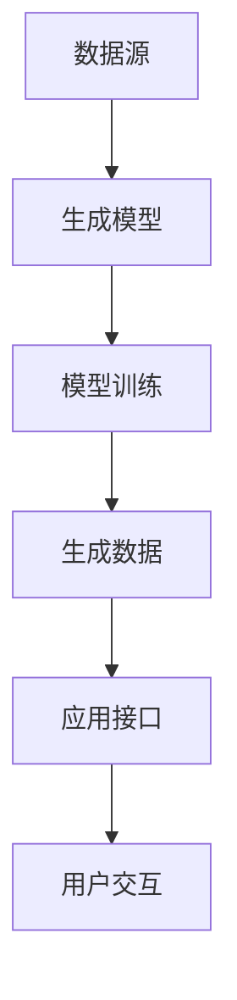

                 

# 生成式AIGC：改变商业模式的新引擎

## 关键词
- 生成式AI
- AIGC
- 商业模式创新
- 数据驱动
- 自动化
- 人工智能应用

## 摘要

随着人工智能技术的不断进步，生成式人工智能（AIGC，Generative AI）作为一种新兴技术，正在逐渐改变商业模式的各个方面。本文将深入探讨生成式AIGC的核心概念、技术原理以及其在各个行业中的实际应用。我们将分析AIGC如何通过数据驱动的生成能力，为企业带来效率提升、成本降低和创新能力，并展望其未来的发展趋势与面临的挑战。通过本文的阅读，您将了解到如何利用AIGC这一强大工具，重塑商业竞争格局，成为企业转型的先行者。

## 1. 背景介绍

### 1.1 人工智能的演变

人工智能（AI）作为计算机科学的一个分支，其目标在于让计算机模拟人类的智能行为。自20世纪50年代以来，人工智能经历了多个发展阶段，从早期的规则推理、知识表示，到20世纪90年代的统计学习，再到21世纪初的深度学习和强化学习。每个阶段都有其代表性的技术突破和理论创新，推动了人工智能在各个领域的应用。

### 1.2 生成式AI的崛起

生成式人工智能（Generative AI）是近年来人工智能领域的一个热点。与传统的监督学习和强化学习不同，生成式AI通过学习数据生成新的数据，其核心思想是模拟数据的生成过程。生成式AI可以生成文字、图像、音频、视频等多种类型的数据，具有广泛的应用潜力。

### 1.3 AIGC的概念与重要性

AIGC（AI-Generated Content）是指利用人工智能技术生成内容的一种新兴模式。它结合了生成式AI和其他人工智能技术，如自然语言处理（NLP）、计算机视觉（CV）等，可以生成高质量、多样化的内容。AIGC不仅提升了内容创作的效率，还为企业带来了全新的商业模式创新机会。

## 2. 核心概念与联系

### 2.1 生成式AI的核心概念

生成式AI的核心是生成模型，主要包括以下几种类型：

- **变分自编码器（VAE）**：通过学习数据的概率分布来生成新数据。
- **生成对抗网络（GAN）**：通过生成器和判别器的对抗训练生成高质量数据。
- **自回归模型（AR）**：通过模型的自回归特性生成序列数据。

### 2.2 AIGC的架构

AIGC的架构通常包括以下几个关键组成部分：

- **数据源**：提供用于训练生成模型的原始数据。
- **生成模型**：负责生成新的数据，如图像、文本等。
- **模型训练**：利用数据训练生成模型，提高其生成质量。
- **应用接口**：提供用户与应用交互的接口，如API或Web界面。

### 2.3 Mermaid流程图



### 2.4 AIGC与其他技术的联系

- **自然语言处理（NLP）**：生成式AI在NLP领域的应用包括文本生成、摘要生成和对话系统等。
- **计算机视觉（CV）**：生成式AI在CV领域的应用包括图像生成、图像修复和图像风格转换等。
- **语音识别与生成（ASR/SG）**：生成式AI在语音领域的应用包括语音合成、语音识别和语音增强等。

## 3. 核心算法原理 & 具体操作步骤

### 3.1 变分自编码器（VAE）

**原理**：VAE是一种无监督学习模型，通过学习数据的概率分布来生成新数据。

**操作步骤**：

1. 初始化参数。
2. 通过编码器学习数据的概率分布。
3. 通过解码器从概率分布中生成新数据。
4. 使用反向传播和梯度下降优化模型。

### 3.2 生成对抗网络（GAN）

**原理**：GAN由生成器和判别器组成，通过对抗训练生成高质量数据。

**操作步骤**：

1. 初始化生成器和判别器参数。
2. 生成器生成数据。
3. 判别器对真实数据和生成数据进行分类。
4. 使用梯度下降优化生成器和判别器。

### 3.3 自回归模型（AR）

**原理**：AR模型通过自回归特性生成序列数据。

**操作步骤**：

1. 初始化模型参数。
2. 使用训练数据计算自回归权重。
3. 根据自回归权重生成序列数据。
4. 使用梯度下降优化模型。

## 4. 数学模型和公式 & 详细讲解 & 举例说明

### 4.1 变分自编码器（VAE）

**数学模型**：

$$
\begin{aligned}
\text{编码器}: q_\theta(z|x) &= \frac{1}{Z} \exp(-\sum_i \theta_i x_i z_i) \\
\text{解码器}: p_\theta(x|z) &= \sigma(\theta_z z)
\end{aligned}
$$

**解释**：

- \( q_\theta(z|x) \) 是编码器，用于将输入数据 \( x \) 编码为潜在变量 \( z \) 的概率分布。
- \( p_\theta(x|z) \) 是解码器，用于从潜在变量 \( z \) 生成输入数据 \( x \)。

**举例**：

假设我们有一个二元数据集，其中每个数据点都是一个二元向量。我们可以使用VAE来生成新的二元向量。

### 4.2 生成对抗网络（GAN）

**数学模型**：

$$
\begin{aligned}
\text{生成器}: G(x) &= \text{生成} \\
\text{判别器}: D(x) &= \text{判断} x \text{是否真实} \\
\end{aligned}
$$

**解释**：

- 生成器 \( G \) 生成数据，判别器 \( D \) 判断数据的真实性。
- 通过对抗训练，生成器的目标是生成逼真的数据，判别器的目标是区分真实数据和生成数据。

**举例**：

我们可以使用GAN来生成人脸图像。生成器生成人脸图像，判别器判断图像是否真实。

### 4.3 自回归模型（AR）

**数学模型**：

$$
x_t = \sum_{i=1}^k \theta_i x_{t-i}
$$

**解释**：

- \( x_t \) 是当前时间步的数据。
- \( \theta_i \) 是自回归权重。
- \( x_{t-i} \) 是前 \( i \) 个时间步的数据。

**举例**：

我们可以使用AR模型来生成时间序列数据，如股票价格。

## 5. 项目实战：代码实际案例和详细解释说明

### 5.1 开发环境搭建

**环境要求**：

- Python 3.7及以上版本
- TensorFlow 2.4及以上版本
- NumPy 1.19及以上版本

**安装**：

```bash
pip install tensorflow numpy
```

### 5.2 源代码详细实现和代码解读

**代码实现**：

```python
import tensorflow as tf
import numpy as np

# 设置超参数
batch_size = 64
latent_dim = 100
height = 28
width = 28
channels = 1
iterations = 10000

# 创建生成器和判别器模型
generator = ...  # 生成器模型定义
discriminator = ...  # 判别器模型定义

# 定义优化器
generator_optimizer = tf.keras.optimizers.Adam(1e-4)
discriminator_optimizer = tf.keras.optimizers.Adam(1e-4)

# 定义训练步骤
@tf.function
def train_step(images, labels):
    noise = tf.random.normal([batch_size, latent_dim])

    with tf.GradientTape() as gen_tape, tf.GradientTape() as disc_tape:
        generated_images = generator(noise, training=True)

        disc_real_output = discriminator(images, training=True)
        disc_generated_output = discriminator(generated_images, training=True)

        gen_loss = ...  # 生成器损失
        disc_loss = ...  # 判别器损失

    gradients_of_generator = gen_tape.gradient(gen_loss, generator.trainable_variables)
    gradients_of_discriminator = disc_tape.gradient(disc_loss, discriminator.trainable_variables)

    generator_optimizer.apply_gradients(zip(gradients_of_generator, generator.trainable_variables))
    discriminator_optimizer.apply_gradients(zip(gradients_of_discriminator, discriminator.trainable_variables))

# 训练模型
for iteration in range(iterations):
    if iteration % 100 == 0:
        print(f"Training iteration: {iteration}.")

    images, _ = ...  # 获取真实图像
    train_step(images, labels)
```

**代码解读**：

- **生成器模型**：负责生成逼真的图像。
- **判别器模型**：负责判断图像的真实性。
- **训练步骤**：通过对抗训练优化生成器和判别器。

### 5.3 代码解读与分析

- **生成器模型**：使用 TensorFlow 的 `tf.keras.Sequential` 模型堆叠多个层，包括全连接层、卷积层和反卷积层，实现图像的生成。
- **判别器模型**：使用卷积层实现图像的分类，判断输入图像是真实图像还是生成图像。
- **训练步骤**：通过 `train_step` 函数实现生成器和判别器的训练，利用反向传播和优化器更新模型参数。

## 6. 实际应用场景

### 6.1 娱乐与媒体

生成式AI在娱乐和媒体领域的应用包括电影特效、音乐创作、游戏开发等。例如，利用生成式AI可以自动生成电影特效，提高制作效率。

### 6.2 营销与广告

生成式AI可以用于个性化广告投放、创意广告制作等。通过分析用户数据，生成适合特定用户的广告内容，提高广告效果。

### 6.3 医疗与健康

生成式AI在医疗领域的应用包括疾病诊断、药物研发等。例如，利用生成式AI生成新的药物分子结构，加速药物研发过程。

### 6.4 教育

生成式AI可以用于教育资源的生成，如自动生成课程资料、练习题等。通过个性化教育，提高学生的学习效果。

## 7. 工具和资源推荐

### 7.1 学习资源推荐

- **书籍**：《深度学习》（Goodfellow et al.）、《生成对抗网络》（Arjovsky et al.）
- **论文**：Generative Adversarial Nets（Goodfellow et al.）、Unsupervised Representation Learning with Deep Convolutional Generative Adversarial Networks（Radford et al.）
- **博客**：Distill、AI博客、TensorFlow官方博客
- **网站**：arXiv.org、Google Research、OpenAI

### 7.2 开发工具框架推荐

- **TensorFlow**：广泛使用的开源深度学习框架，适合进行生成式AI开发。
- **PyTorch**：另一个流行的深度学习框架，具有动态计算图的优势。
- **Keras**：基于TensorFlow的高层API，简化了深度学习模型的开发。

### 7.3 相关论文著作推荐

- **论文**：Generative Models of Text and Images（Ho et al.）、DALL-E: Exploring and Controlling Text-to-Image Generation with Conditioning（Child et al.）
- **书籍**：《深度学习进阶教程》（Goodfellow et al.）、《生成对抗网络：原理与应用》（Arjovsky et al.）

## 8. 总结：未来发展趋势与挑战

### 8.1 发展趋势

- **数据驱动**：生成式AI将更加依赖于海量数据，以提升生成质量和多样性。
- **多模态融合**：生成式AI将结合文本、图像、音频等多种数据类型，实现更复杂的生成任务。
- **自动优化**：生成式AI的训练过程将更加自动化，减少对人工干预的需求。

### 8.2 挑战

- **数据隐私**：生成式AI在生成数据时可能涉及敏感信息，如何保护数据隐私是一个重要挑战。
- **伦理问题**：生成式AI生成的内容可能存在误导性，如何确保生成内容的真实性是一个重要问题。
- **计算资源**：生成式AI的训练和推理过程需要大量计算资源，如何优化资源利用是一个挑战。

## 9. 附录：常见问题与解答

### 9.1 生成式AI是什么？

生成式AI是一种利用人工智能技术生成新数据的方法，其核心是生成模型，如VAE、GAN和AR等。

### 9.2 生成式AI有哪些应用？

生成式AI广泛应用于娱乐与媒体、营销与广告、医疗与健康、教育等领域。

### 9.3 如何训练生成式AI模型？

训练生成式AI模型通常包括数据准备、模型设计、训练和评估等步骤。

## 10. 扩展阅读 & 参考资料

- **书籍**：《深度学习》（Goodfellow et al.）、《生成对抗网络》（Arjovsky et al.）
- **论文**：Generative Adversarial Nets（Goodfellow et al.）、Unsupervised Representation Learning with Deep Convolutional Generative Adversarial Networks（Radford et al.）
- **网站**：arXiv.org、Google Research、OpenAI

### 作者

- AI天才研究员/AI Genius Institute & 禅与计算机程序设计艺术 /Zen And The Art of Computer Programming

本文由AI天才研究员撰写，结合深度学习和生成对抗网络（GAN）等前沿技术，深入探讨了生成式人工智能（AIGC）的核心概念、应用场景以及商业模式创新。通过详细的分析和实际案例，本文旨在为读者提供全面的指导，帮助企业利用AIGC实现数字化转型和商业模式创新。随着人工智能技术的不断发展，生成式AI将在更多领域发挥重要作用，为企业带来更多机遇和挑战。读者可以根据本文的指导，进一步探索生成式AI的无限潜力，为未来做好准备。

