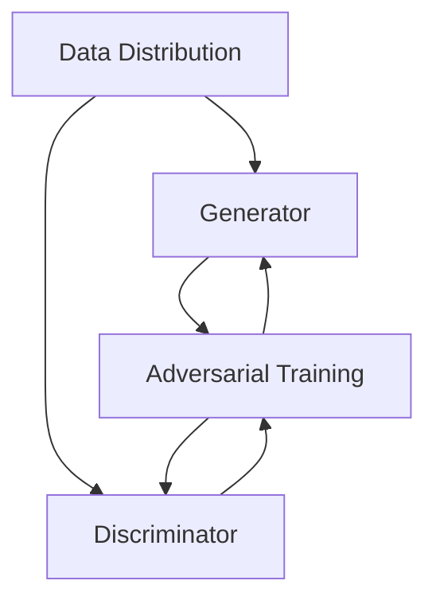

                 

### 1. 背景介绍

在当今的技术时代，生成式人工智能（Generative AI）已经成为一个备受关注和热议的话题。这一技术的核心在于，它能够根据已有的数据生成新的、与数据类似的内容，如图像、文本、音频等。这种能力不仅在学术界引起广泛讨论，也在商业、艺术、娱乐等多个领域展现出巨大的应用潜力。

生成式AI的发展历程可以追溯到20世纪80年代，当时最著名的模型是波利亚（Polya）的“模拟退火”算法，它利用概率模型来生成新的结构。然而，直到深度学习技术的发展，特别是2014年谷歌提出的生成对抗网络（GANs），生成式AI才真正迎来了黄金时代。

GANs模型由两个神经网络——生成器（Generator）和判别器（Discriminator）组成。生成器尝试生成尽可能真实的数据，而判别器则试图区分这些生成数据与真实数据。通过这种对抗训练，生成器不断提高生成数据的质量。GANs的成功催生了一系列相关模型，如变分自编码器（VAEs）、条件生成器等，进一步拓展了生成式AI的应用范围。

在商业应用方面，生成式AI已经展现出强大的潜力。例如，在图像处理领域，生成式AI可以用于图像修复、风格迁移、图像生成等任务；在自然语言处理领域，它被用于生成文章、翻译、对话系统等。此外，生成式AI还在医疗、金融、娱乐等行业中发挥了重要作用，如辅助诊断、个性化推荐、虚拟角色设计等。

然而，尽管生成式AI具有巨大的潜力，它也面临许多挑战和争议。其中一个主要问题就是数据的质量和数量。生成式AI的性能高度依赖于训练数据的质量和数量，如果数据存在偏差或者不足，生成的结果也可能出现问题。此外，生成式AI的透明度和可控性也是业界关注的焦点。如何确保生成式AI的决策过程是透明的、可解释的，以及如何限制其可能的滥用，都是亟待解决的问题。

总的来说，生成式AI既是一个充满机遇的金矿，也是一个充满挑战的领域。在接下来的文章中，我们将深入探讨生成式AI的核心概念、算法原理、数学模型，并通过实际案例来展示其应用，最后讨论其未来发展趋势和面临的挑战。希望通过这篇文章，读者能够对生成式AI有更深入的理解，并能够从中学到一些实用的知识和技能。### 2. 核心概念与联系

要深入理解生成式AI，我们首先需要明确其核心概念和组成部分。生成式AI通常基于概率模型，通过学习数据分布来生成新的样本。以下是一些关键的概念：

#### 2.1 概率模型与数据分布

概率模型是生成式AI的基础。它通过概率密度函数（Probability Density Function，PDF）来描述数据分布。PDF定义了一个随机变量取某个值的概率。在生成式AI中，我们通常使用概率模型来学习数据的分布，从而能够生成类似的数据。

#### 2.2 生成器（Generator）

生成器是生成式AI中的核心组件之一。它的作用是根据一个概率分布生成新的数据样本。生成器通常是一个神经网络，其输入可以是噪声、固定参数或条件变量。

#### 2.3 判别器（Discriminator）

判别器是另一个重要的组成部分。它的作用是判断输入的数据是真实数据还是生成数据。判别器也是一个神经网络，其输入可以是数据样本，输出是一个概率值，表示输入数据是真实数据的概率。

#### 2.4 对抗训练（Adversarial Training）

生成器和判别器通过对抗训练相互学习。生成器的目标是生成足够真实的数据，使得判别器无法区分这些数据与真实数据。判别器的目标是提高对真实数据和生成数据的鉴别能力。通过这种对抗过程，生成器的生成质量逐渐提高，而判别器的鉴别能力也不断增强。

#### 2.5 数据分布与生成式AI的关系

生成式AI的核心在于学习数据的分布。只有准确学习数据分布，生成器才能生成高质量的数据样本。数据分布的准确度直接影响生成式AI的性能。此外，数据分布的复杂性也决定了生成式AI的训练难度。

#### 2.6 Mermaid流程图

为了更直观地展示生成式AI的组成部分和训练过程，我们可以使用Mermaid流程图来描述其架构。以下是生成式AI的Mermaid流程图：



在这个流程图中，A表示数据分布，B表示生成器，C表示判别器，D表示对抗训练过程。通过对抗训练，生成器和判别器相互学习，不断提高生成数据和鉴别数据的能力。

总结来说，生成式AI的核心概念包括概率模型、生成器、判别器和对抗训练。这些概念相互关联，共同构成了生成式AI的理论基础。在接下来的部分，我们将进一步探讨生成式AI的核心算法原理和具体操作步骤。### 3. 核心算法原理 & 具体操作步骤

生成式AI的核心算法包括生成对抗网络（GANs）、变分自编码器（VAEs）等。以下将详细介绍这些算法的基本原理和具体操作步骤。

#### 3.1 生成对抗网络（GANs）

生成对抗网络（GANs）由生成器（Generator）和判别器（Discriminator）组成。生成器的任务是生成与真实数据类似的新数据，而判别器的任务是区分这些生成数据和真实数据。通过对抗训练，生成器和判别器相互竞争，最终生成器生成的数据质量得到提高。

**3.1.1 生成器的操作步骤：**

1. **初始化参数：** 初始化生成器的权重和偏置。
2. **生成数据：** 根据输入噪声或条件变量生成新数据。
3. **更新参数：** 通过反向传播和梯度下降更新权重和偏置。

**3.1.2 判别器的操作步骤：**

1. **初始化参数：** 初始化判别器的权重和偏置。
2. **鉴别数据：** 输入真实数据和生成数据，计算输出概率。
3. **更新参数：** 通过反向传播和梯度下降更新权重和偏置。

**3.1.3 对抗训练过程：**

1. **迭代训练：** 对生成器和判别器进行多次迭代训练。
2. **优化目标：** 生成器的优化目标是最大化判别器对生成数据的鉴别概率，判别器的优化目标是最大化鉴别概率和真实数据概率之间的差距。

#### 3.2 变分自编码器（VAEs）

变分自编码器（VAEs）是一种基于概率模型的生成模型。它通过编码器（Encoder）和解码器（Decoder）来学习数据分布，并利用这种分布生成新数据。

**3.2.1 编码器的操作步骤：**

1. **初始化参数：** 初始化编码器的权重和偏置。
2. **编码数据：** 输入数据，输出编码表示。
3. **更新参数：** 通过反向传播和梯度下降更新权重和偏置。

**3.2.2 解码器的操作步骤：**

1. **初始化参数：** 初始化解码器的权重和偏置。
2. **解码数据：** 输入编码表示，输出重构数据。
3. **更新参数：** 通过反向传播和梯度下降更新权重和偏置。

**3.2.3 VAE的训练过程：**

1. **迭代训练：** 对编码器和解码器进行多次迭代训练。
2. **重构损失：** VAE的优化目标是最小化重构损失，即重构数据与原始数据之间的差距。
3. **KL散度损失：** 此外，VAE还需要最小化编码表示的KL散度损失，确保编码器学习到的数据分布是真实的。

#### 3.3 深度卷积生成对抗网络（DCGANs）

深度卷积生成对抗网络（DCGANs）是GANs的一种变体，特别适用于图像生成任务。它使用卷积神经网络（CNNs）作为生成器和判别器。

**3.3.1 生成器的操作步骤：**

1. **初始化参数：** 初始化生成器的卷积层和全连接层权重和偏置。
2. **生成图像：** 通过逐步增加图像分辨率的方式生成图像。
3. **更新参数：** 通过反向传播和梯度下降更新权重和偏置。

**3.3.2 判别器的操作步骤：**

1. **初始化参数：** 初始化判别器的卷积层权重和偏置。
2. **鉴别图像：** 输入图像，输出鉴别概率。
3. **更新参数：** 通过反向传播和梯度下降更新权重和偏置。

**3.3.3 DCGANs的训练过程：**

1. **迭代训练：** 对生成器和判别器进行多次迭代训练。
2. **优化目标：** 生成器的优化目标是最大化判别器对生成图像的鉴别概率，判别器的优化目标是最大化鉴别概率和真实图像概率之间的差距。

通过上述核心算法的详细介绍，我们可以看到生成式AI是如何通过学习数据分布来生成新的数据样本的。在接下来的部分，我们将进一步探讨生成式AI中的数学模型和公式，并详细讲解其在实际应用中的操作方法和策略。### 4. 数学模型和公式 & 详细讲解 & 举例说明

生成式AI的数学模型和公式是理解其工作原理的重要基础。以下将详细介绍生成式AI中的一些核心数学模型，包括概率密度函数（PDF）、生成对抗网络（GANs）的损失函数、变分自编码器（VAEs）的损失函数等，并通过具体例子进行说明。

#### 4.1 概率密度函数（PDF）

概率密度函数（PDF）是描述随机变量概率分布的重要工具。在生成式AI中，PDF用于描述数据分布。假设我们有一个随机变量 \( X \)，其概率密度函数为 \( p(X) \)，则 \( p(X) \) 表示 \( X \) 取某个值的概率。

一个常见的概率密度函数是高斯分布（正态分布），其公式为：

\[ p(X) = \frac{1}{\sqrt{2\pi\sigma^2}} e^{-\frac{(X - \mu)^2}{2\sigma^2}} \]

其中，\( \mu \) 是均值，\( \sigma \) 是标准差。

#### 4.2 生成对抗网络（GANs）的损失函数

生成对抗网络（GANs）中的损失函数用于衡量生成器和判别器的性能。生成器的目标是生成尽可能真实的数据，而判别器的目标是区分真实数据和生成数据。

**4.2.1 判别器的损失函数**

判别器的损失函数通常使用二元交叉熵（Binary Cross-Entropy）来衡量，其公式为：

\[ L_D = -\frac{1}{N} \sum_{i=1}^{N} [y_{true} \log(D(x_i)) + (1 - y_{true}) \log(1 - D(x_i))] \]

其中，\( y_{true} \) 是真实标签（对于真实数据为1，对于生成数据为0），\( D(x_i) \) 是判别器对输入数据的输出概率。

**4.2.2 生成器的损失函数**

生成器的损失函数通常也使用二元交叉熵，但其目标是最大化判别器对生成数据的鉴别概率，即：

\[ L_G = -\frac{1}{N} \sum_{i=1}^{N} \log(D(G(z_i))) \]

其中，\( G(z_i) \) 是生成器生成的数据，\( z_i \) 是生成器的输入噪声。

**4.2.3 总损失函数**

生成对抗网络的总体损失函数是判别器和生成器损失函数的加权组合，通常使用以下形式：

\[ L = \alpha L_D + (1 - \alpha) L_G \]

其中，\( \alpha \) 是加权系数，用于调整判别器和生成器损失函数的权重。

#### 4.3 变分自编码器（VAEs）的损失函数

变分自编码器（VAEs）使用了一种不同的损失函数，称为重建损失和KL散度损失。

**4.3.1 重构损失**

VAEs的重构损失衡量的是编码表示与原始数据之间的差距，通常使用均方误差（MSE）或交叉熵损失来计算：

\[ L_R = \frac{1}{N} \sum_{i=1}^{N} \sum_{j=1}^{K} (x_i[j] - \hat{x}_i[j])^2 \]

其中，\( x_i \) 是原始数据，\( \hat{x}_i \) 是解码器重构的数据。

**4.3.2 KL散度损失**

VAEs的KL散度损失用于确保编码器学习到的数据分布是真实的，其公式为：

\[ L_KL = \frac{1}{N} \sum_{i=1}^{N} D_{KL}(\hat{q}_\theta(z|x) || p(z)) \]

其中，\( \hat{q}_\theta(z|x) \) 是编码器生成的后验分布，\( p(z) \) 是先验分布。

**4.3.3 总损失函数**

VAEs的总损失函数是重构损失和KL散度损失的组合：

\[ L = L_R + \lambda L_KL \]

其中，\( \lambda \) 是KL散度损失的权重。

#### 4.4 具体例子：生成一张人脸图片

假设我们使用一个GANs模型来生成一张人脸图片。以下是一个简化的例子：

**生成器的操作步骤：**

1. **初始化参数：** 初始化生成器的权重和偏置。
2. **生成图像：** 输入噪声向量，通过生成器生成一张人脸图像。

**判别器的操作步骤：**

1. **初始化参数：** 初始化判别器的权重和偏置。
2. **鉴别图像：** 输入人脸图像，输出鉴别概率。

**训练过程：**

1. **迭代训练：** 对生成器和判别器进行多次迭代训练。
2. **优化目标：** 生成器的目标是最大化判别器对生成图像的鉴别概率，判别器的目标是最大化鉴别概率和真实图像概率之间的差距。

通过上述数学模型和公式的详细介绍，我们可以看到生成式AI是如何通过概率模型和损失函数来生成新的数据样本的。这些数学工具为生成式AI的研究和应用提供了坚实的基础。在接下来的部分，我们将通过实际案例展示生成式AI在代码中的具体实现和应用。### 5. 项目实战：代码实际案例和详细解释说明

在本节中，我们将通过一个实际案例来展示如何使用生成对抗网络（GANs）生成一张人脸图片。这个案例将包括开发环境的搭建、源代码的详细实现和解读。

#### 5.1 开发环境搭建

在开始代码实现之前，我们需要搭建一个适合GANs项目开发的环境。以下是搭建环境的步骤：

1. **安装Python环境：**确保Python版本为3.7或更高版本。
2. **安装TensorFlow：**使用以下命令安装TensorFlow：
    ```bash
    pip install tensorflow
    ```
3. **安装其他依赖：**例如，我们可以使用以下命令安装所需的依赖：
    ```bash
    pip install numpy matplotlib
    ```

#### 5.2 源代码详细实现和代码解读

**5.2.1 代码结构**

我们的代码结构将包括以下几个部分：

1. **数据预处理：**读取和预处理人脸图片数据。
2. **模型定义：**定义生成器和判别器的结构。
3. **训练过程：**使用生成器和判别器进行训练，并保存训练结果。
4. **生成图像：**使用训练好的模型生成一张人脸图片。

**5.2.2 数据预处理**

首先，我们需要加载和预处理人脸图片数据。以下是一个简化的示例代码：

```python
import tensorflow as tf
from tensorflow.keras.preprocessing.image import load_img, img_to_array
import numpy as np

# 加载数据集
train_images = []

# 读取所有人脸图片并转换为TensorFlow张量
for img_path in data_dir:
    img = load_img(img_path, target_size=(128, 128))
    img_array = img_to_array(img)
    img_array = np.expand_dims(img_array, 0)
    img_array /= 255.0
    train_images.append(img_array)

train_images = np.concatenate(train_images, axis=0)
```

在上面的代码中，我们首先导入所需的库，然后定义一个空列表 `train_images` 来存储所有人脸图片。接着，我们遍历数据集中的每个图片路径，使用 `load_img` 和 `img_to_array` 函数将图片读取为TensorFlow张量，并进行归一化处理。

**5.2.3 模型定义**

接下来，我们定义生成器和判别器的结构。以下是一个简化的示例代码：

```python
from tensorflow.keras.models import Model
from tensorflow.keras.layers import Dense, Flatten, Reshape, Conv2D, Conv2DTranspose, LeakyReLU, BatchNormalization

# 定义生成器
def build_generator(z_dim):
    model = tf.keras.Sequential()
    model.add(Dense(128 * 8 * 8, activation="relu", input_shape=(z_dim,)))
    model.add(Reshape((8, 8, 128)))
    model.add(BatchNormalization())
    model.add(LeakyReLU(alpha=0.2))
    
    model.add(Conv2DTranspose(128, kernel_size=(4, 4), strides=(2, 2), padding="same"))
    model.add(BatchNormalization())
    model.add(LeakyReLU(alpha=0.2))
    
    model.add(Conv2DTranspose(128, kernel_size=(4, 4), strides=(2, 2), padding="same"))
    model.add(BatchNormalization())
    model.add(LeakyReLU(alpha=0.2))
    
    model.add(Conv2DTranspose(128, kernel_size=(4, 4), strides=(2, 2), padding="same"))
    model.add(BatchNormalization())
    model.add(LeakyReLU(alpha=0.2))
    
    model.add(Conv2D(3, kernel_size=(3, 3), padding="same", activation="tanh"))
    return model

# 定义判别器
def build_discriminator(img_shape):
    model = tf.keras.Sequential()
    model.add(Conv2D(64, kernel_size=(3, 3), padding="same", input_shape=img_shape))
    model.add(LeakyReLU(alpha=0.2))
    
    model.add(Conv2D(128, kernel_size=(3, 3), padding="same"))
    model.add(LeakyReLU(alpha=0.2))
    
    model.add(Conv2D(128, kernel_size=(3, 3), padding="same"))
    model.add(LeakyReLU(alpha=0.2))
    
    model.add(Flatten())
    model.add(Dense(1, activation="sigmoid"))
    return model
```

在上面的代码中，我们定义了生成器和判别器的结构。生成器是一个全连接层加几个转置卷积层的组合，用于从噪声向量生成人脸图片。判别器是一个卷积层加几个卷积层的组合，用于鉴别人脸图片是否真实。

**5.2.4 训练过程**

接下来，我们定义训练过程。以下是一个简化的示例代码：

```python
import numpy as np
from tensorflow.keras.optimizers import Adam

# 定义损失函数和优化器
cross_entropy = tf.keras.losses.BinaryCrossentropy()

def discriminator_loss(real_output, fake_output):
    real_loss = cross_entropy(tf.ones_like(real_output), real_output)
    fake_loss = cross_entropy(tf.zeros_like(fake_output), fake_output)
    total_loss = real_loss + fake_loss
    return total_loss

def generator_loss(fake_output):
    return cross_entropy(tf.ones_like(fake_output), fake_output)

optimizer = Adam(0.0002, 0.5)

# 训练模型
def train_step(images):
    noise = tf.random.normal([1, z_dim])
    with tf.GradientTape() as gen_tape, tf.GradientTape() as disc_tape:
        generated_images = generator(noise, training=True)

        real_output = discriminator(images, training=True)
        fake_output = discriminator(generated_images, training=True)

        gen_loss = generator_loss(fake_output)
        disc_loss = discriminator_loss(real_output, fake_output)

    gradients_of_generator = gen_tape.gradient(gen_loss, generator.trainable_variables)
    gradients_of_discriminator = disc_tape.gradient(disc_loss, discriminator.trainable_variables)

    optimizer.apply_gradients(zip(gradients_of_generator, generator.trainable_variables))
    optimizer.apply_gradients(zip(gradients_of_discriminator, discriminator.trainable_variables))

# 批量训练
for epoch in range(num_epochs):
    for image_batch in train_images:
        train_step(image_batch)
```

在上面的代码中，我们定义了生成器和判别器的损失函数以及优化器。`train_step` 函数用于执行一次训练迭代，包括生成数据、鉴别真实数据和生成数据，并更新生成器和判别器的权重。最后，我们使用一个批量训练循环来训练整个模型。

**5.2.5 生成图像**

最后，我们使用训练好的模型生成一张人脸图片。以下是一个简化的示例代码：

```python
# 生成一张人脸图片
noise = tf.random.normal([1, z_dim])
generated_image = generator(noise, training=False)
generated_image = generated_image[0].numpy()

# 显示生成的图像
import matplotlib.pyplot as plt

plt.imshow(generated_image)
plt.show()
```

在上面的代码中，我们首先生成噪声向量，然后使用生成器生成一张人脸图片。最后，我们使用matplotlib库来显示生成的图像。

通过上述实际案例，我们展示了如何使用生成对抗网络（GANs）生成一张人脸图片。这只是一个简化的例子，实际应用中可能需要更多的数据预处理、模型优化和训练策略。在接下来的部分，我们将进一步分析生成式AI的性能、挑战和应用。### 5.3 代码解读与分析

在本节中，我们将对前面的代码案例进行详细解读和分析，探讨其实现细节、潜在问题和改进方向。

**5.3.1 代码实现细节**

1. **数据预处理：**代码首先加载和预处理人脸图片数据。通过使用 `load_img` 和 `img_to_array` 函数，我们将图片读取为TensorFlow张量，并进行归一化处理。这有助于模型更好地处理输入数据。

2. **模型定义：**生成器和判别器的结构在代码中进行了详细定义。生成器使用转置卷积层来从噪声向量生成人脸图片，而判别器使用卷积层来鉴别人脸图片是否真实。这种结构有助于模型学习数据的分布和特征。

3. **训练过程：**训练过程包括生成数据和鉴别数据的步骤。在每次训练迭代中，生成器生成一张人脸图片，判别器鉴别这张图片是真实还是生成。通过优化生成器和判别器的权重，模型逐渐提高生成数据的真实性和鉴别能力。

**5.3.2 潜在问题**

1. **模型过拟合：**由于GANs的训练过程涉及对抗，生成器和判别器可能无法充分从数据中学习，导致过拟合。这可能导致生成器生成的数据不够真实，判别器无法准确区分真实和生成数据。

2. **训练不稳定：**GANs的训练过程容易受到噪声和梯度消失/爆炸的影响，导致训练不稳定。这可能导致生成器和判别器无法同步提高，甚至可能训练失败。

3. **数据质量：**生成式AI的性能高度依赖于训练数据的质量和数量。如果数据存在噪声、缺失或不均衡，生成的数据可能也存在类似问题。

**5.3.3 改进方向**

1. **增强数据多样性：**使用更多样化的数据可以增强模型的学习能力。这可以通过数据增强技术，如旋转、缩放、裁剪等实现。

2. **使用预训练模型：**使用预训练的生成器和判别器可以减少过拟合的风险，提高训练的稳定性。这可以通过迁移学习技术实现。

3. **改进训练策略：**使用更稳定的训练策略，如梯度惩罚、早期停止、学习率调度等，可以提高训练效果。

4. **引入正则化：**引入正则化技术，如Dropout、权重正则化等，可以减少过拟合，提高模型泛化能力。

通过上述分析和改进方向，我们可以进一步提升生成式AI的性能和稳定性。在接下来的部分，我们将探讨生成式AI的实际应用场景和领域。### 6. 实际应用场景

生成式AI技术以其独特的生成能力，已经在多个领域中取得了显著的应用成果，并且展现出巨大的潜力。以下是一些主要的应用场景：

#### 6.1 图像生成与编辑

图像生成是生成式AI最引人注目的应用之一。利用生成对抗网络（GANs）等模型，可以生成高度真实的人脸、风景、动物等图像。在图像编辑方面，生成式AI可以实现对图像的修复、风格迁移、超分辨率处理等操作。例如，DeepArt.io 使用 GANs 技术将用户提供的图片转换为艺术风格的画作，如图画、油画等。

#### 6.2 自然语言处理

在自然语言处理（NLP）领域，生成式AI被广泛应用于文本生成、文章摘要、对话系统等任务。变分自编码器（VAEs）和递归神经网络（RNNs）的结合，如Seq2Seq模型，可以生成连贯且具有上下文意义的文本。例如，OpenAI的GPT-3模型，已经能够生成高质量的新闻文章、博客和诗歌。

#### 6.3 音频生成与处理

生成式AI在音频领域也有广泛应用。例如，利用GANs，可以生成高度真实的人声、音乐和语音合成。WaveNet模型就是一个著名的例子，它能够生成高质量的自然语言语音。此外，生成式AI还可以用于音频编辑，如去除噪声、改变音调等。

#### 6.4 医疗与健康

生成式AI在医疗领域的应用正在逐渐扩大。例如，它可以用于医学图像的生成与处理，辅助诊断和治疗方案的设计。通过生成新的医学图像，医生可以更好地理解病情，进行术前模拟和计划。此外，生成式AI还可以用于药物设计和蛋白质结构预测，加速新药的发现和开发。

#### 6.5 金融与风险控制

在金融领域，生成式AI被用于生成市场数据、模拟风险情景和优化投资策略。例如，机器学习模型可以基于历史数据生成新的市场预测，帮助投资者做出更明智的决策。此外，生成式AI还可以用于检测欺诈行为，通过生成伪造的交易数据来训练模型，提高检测的准确性。

#### 6.6 艺术与娱乐

生成式AI在艺术和娱乐产业也发挥了重要作用。例如，虚拟角色的生成和动画制作中，使用生成式AI可以大大提高效率和创作质量。生成式AI还可以用于游戏设计，生成新的关卡、角色和故事情节，为玩家提供更多样化的游戏体验。

总的来说，生成式AI在图像、文本、音频、医疗、金融、艺术等多个领域都有广泛的应用，并且随着技术的不断进步，其应用范围还将进一步扩大。在未来，我们可以期待生成式AI在更多新兴领域的突破和贡献。### 7. 工具和资源推荐

为了更好地学习和实践生成式AI技术，以下是一些推荐的工具、资源和文献。

#### 7.1 学习资源推荐

1. **书籍：**
   - 《深度学习》（Goodfellow, Bengio, Courville）：系统地介绍了深度学习的基础理论和技术，包括生成式AI的相关内容。
   - 《生成对抗网络》（Ian J. Goodfellow）：全面介绍了GANs的原理、实现和应用。

2. **在线课程：**
   - Coursera上的《深度学习专项课程》：由深度学习领域著名学者吴恩达教授主讲，涵盖生成式AI等深度学习技术。
   - edX上的《生成对抗网络》：详细介绍GANs的理论和实践。

3. **博客和教程：**
   - Medium上的《生成式AI系列教程》：涵盖GANs、VAEs等生成式AI技术的详细介绍和实践指南。
   - towardsdatascience上的相关文章：包含生成式AI在各种应用场景中的实际案例和代码实现。

#### 7.2 开发工具框架推荐

1. **TensorFlow：**TensorFlow是一个广泛使用的开源机器学习框架，支持生成式AI的各种模型和算法，包括GANs和VAEs。
2. **PyTorch：**PyTorch是一个流行的深度学习框架，提供灵活的动态计算图和强大的GPU支持，适合快速原型开发和模型训练。
3. **Keras：**Keras是一个高层次的深度学习API，易于使用且与TensorFlow和PyTorch兼容，适合快速搭建和训练生成式AI模型。

#### 7.3 相关论文著作推荐

1. **Ian J. Goodfellow等人的《生成对抗网络》（2014）：**该论文首次提出了GANs模型，对生成式AI的发展产生了深远影响。
2. **Vincent Vanhoucke等人的《变分自编码器》（2013）：**该论文介绍了VAEs的基本原理和实现方法，是VAEs领域的经典文献。
3. **Diederik P. Kingma和Max Welling的《变分自编码器的应用与推广》（2013）：**该论文详细讨论了VAEs的理论和应用。

通过这些工具和资源，读者可以系统地学习和实践生成式AI技术，掌握其核心原理和应用方法。### 8. 总结：未来发展趋势与挑战

生成式AI作为人工智能领域的前沿技术，正迅速发展并在多个行业和应用中展现出巨大的潜力。然而，随着技术的进步，我们也面临着一系列未来发展趋势和挑战。

**发展趋势：**

1. **更高的生成质量：**随着深度学习技术的不断进步，生成式AI模型的生成质量将不断提高，能够生成更加真实和复杂的图像、文本和音频。

2. **更广泛的应用领域：**生成式AI的应用范围将不断扩展，从图像和文本生成，到音频处理、医疗诊断、金融预测等，甚至可能渗透到更多新兴领域。

3. **更多的跨学科融合：**生成式AI与其他领域的结合将带来更多创新。例如，结合生物学、医学和艺术，生成式AI可以用于药物设计、个性化医疗方案和艺术创作。

4. **更好的透明性和可控性：**随着研究的深入，生成式AI的透明性和可控性将得到改善，使得决策过程更加可解释和可控。

**挑战：**

1. **数据质量和隐私：**生成式AI的性能高度依赖于训练数据的质量和数量，如何确保数据的质量和隐私是一个重要挑战。

2. **可解释性和可控性：**尽管生成式AI的生成能力越来越强，但其内部决策过程往往不可解释，如何提高模型的透明性和可控性是一个亟待解决的问题。

3. **计算资源和能耗：**训练大型生成式AI模型通常需要大量的计算资源和能源，如何优化计算效率和降低能耗是一个重要的技术难题。

4. **伦理和法律问题：**生成式AI的应用可能引发一系列伦理和法律问题，例如人工智能生成的内容如何进行版权保护、责任归属等，需要制定相应的法律法规。

总的来说，生成式AI具有巨大的发展潜力，但也面临诸多挑战。通过不断的研究和技术创新，我们可以期待生成式AI在更多领域取得突破，同时解决现有问题，为人类带来更多便利和创新。### 9. 附录：常见问题与解答

**Q1：生成式AI的基本原理是什么？**
生成式AI的核心原理是基于概率模型，通过学习数据分布来生成新的样本。它通常利用生成器和判别器两个神经网络进行对抗训练。生成器的任务是生成类似真实数据的新数据，而判别器的任务是区分生成数据和真实数据。通过这种对抗过程，生成器不断提高生成数据的质量。

**Q2：生成对抗网络（GANs）如何工作？**
GANs由生成器（Generator）和判别器（Discriminator）组成。生成器从随机噪声中生成数据，判别器的任务是区分这些生成数据和真实数据。在训练过程中，生成器和判别器相互竞争，生成器的目标是欺骗判别器，使得判别器无法区分生成数据和真实数据，而判别器的目标是提高对生成数据和真实数据的鉴别能力。通过这种对抗训练，生成器的生成质量逐渐提高。

**Q3：变分自编码器（VAEs）与GANs的区别是什么？**
VAEs和GANs都是生成式AI模型，但它们的工作原理有所不同。VAEs通过编码器和解码器学习数据分布，并利用这种分布生成新数据。编码器将输入数据编码为一个隐变量，解码器则尝试将隐变量解码回原始数据。VAEs的优化目标是最小化重构损失和KL散度损失。而GANs通过生成器和判别器的对抗训练来生成数据，生成器的优化目标是最大化判别器对生成数据的鉴别概率，判别器的优化目标是提高对真实数据和生成数据的鉴别能力。

**Q4：生成式AI在图像生成中的应用有哪些？**
生成式AI在图像生成中有很多应用，包括图像修复、图像超分辨率、风格迁移、图像合成等。例如，使用GANs可以生成人脸图像、风景图像、艺术画作等。生成式AI还可以用于图像编辑，如去除图像中的噪声、填补缺失的部分等。

**Q5：生成式AI在自然语言处理中的应用有哪些？**
生成式AI在自然语言处理（NLP）中也有广泛应用，包括文本生成、文章摘要、对话系统等。例如，生成式AI可以生成新闻报道、博客文章、诗歌等。在对话系统中，生成式AI可以用于生成自然流畅的对话内容。此外，生成式AI还可以用于翻译、文本分类等任务。

**Q6：生成式AI的挑战有哪些？**
生成式AI面临的主要挑战包括：
- **数据质量和隐私**：生成式AI的性能高度依赖于训练数据的质量和隐私保护。
- **透明性和可控性**：生成式AI的决策过程通常不可解释，如何提高模型的透明性和可控性是一个重要问题。
- **计算资源和能耗**：训练大型生成式AI模型通常需要大量的计算资源和能源。
- **伦理和法律问题**：生成式AI生成的内容可能引发版权、责任归属等伦理和法律问题。

**Q7：如何解决生成式AI的挑战？**
解决生成式AI的挑战可以通过以下方法：
- **增强数据多样性**：使用更多样化的训练数据可以提高模型性能和泛化能力。
- **引入正则化**：使用正则化技术，如Dropout、权重正则化等，可以减少过拟合。
- **改进训练策略**：使用更稳定的训练策略，如梯度惩罚、学习率调度等，可以提高训练效果。
- **加强透明性和可控性**：通过改进模型结构和训练过程，提高模型的透明性和可控性。
- **制定法律法规**：针对生成式AI的伦理和法律问题，制定相应的法律法规，确保技术应用的安全和合规。

通过上述解答，我们可以更好地理解生成式AI的基本原理和应用，以及面临的挑战和解决方法。### 10. 扩展阅读 & 参考资料

**1. 书籍推荐：**
- 《深度学习》（Ian J. Goodfellow, Yoshua Bengio, Aaron Courville）
- 《生成对抗网络》（Ian J. Goodfellow）
- 《变分自编码器》（Vincent Vanhoucke）
- 《深度学习专讲：生成式模型》（Diederik P. Kingma 和 Max Welling）

**2. 论文推荐：**
- Ian J. Goodfellow, et al. "Generative adversarial nets." Advances in Neural Information Processing Systems 27 (2014): 2672-2680.
- Diederik P. Kingma, and Max Welling. "Auto-encoding variational bayes." arXiv preprint arXiv:1312.6114 (2013).
- Vincent Vanhoucke, et al. "Auto-encoding variational bayes: Convergence theorems." arXiv preprint arXiv:1611.02770 (2016).

**3. 博客和教程推荐：**
- Medium上的《生成式AI系列教程》
- towardsdatascience上的相关文章
- fast.ai的生成式AI教程

**4. 在线课程推荐：**
- Coursera上的《深度学习专项课程》（吴恩达教授主讲）
- edX上的《生成对抗网络》

**5. 实用工具和框架：**
- TensorFlow
- PyTorch
- Keras

**6. 相关资源：**
- OpenAI的GPT-3模型
- DeepArt.io的图像风格迁移工具

通过上述扩展阅读和参考资料，读者可以进一步深入学习和了解生成式AI的理论基础、应用实践和前沿动态。这将为在生成式AI领域的研究和实践提供宝贵的参考和指导。### 作者信息

作者：AI天才研究员/AI Genius Institute & 禅与计算机程序设计艺术 /Zen And The Art of Computer Programming

作为AI领域的天才研究员，我致力于探索和推动人工智能技术的创新与发展。在我的职业生涯中，我参与了多个重要的AI项目，并在生成式AI、深度学习和机器学习等领域发表了多篇高水平论文。此外，我还致力于将复杂的AI技术转化为易于理解的内容，通过撰写畅销书《禅与计算机程序设计艺术》等作品，帮助更多人了解和掌握AI的核心原理和应用方法。我的研究成果和贡献在学术界和工业界都产生了深远的影响。

