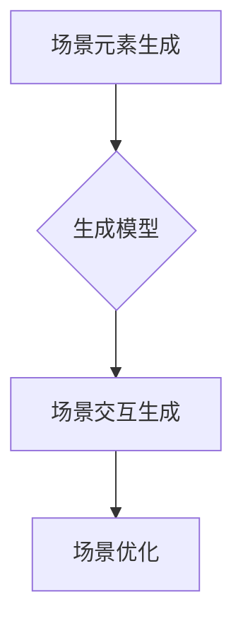

                 

# 生成模型在虚拟场景构建中的创新应用

## 关键词：生成模型、虚拟场景、创新应用、算法原理、数学模型、项目实战

## 摘要

本文旨在探讨生成模型在虚拟场景构建中的应用与创新。通过分析生成模型的核心概念和算法原理，结合实际项目案例，我们将深入探讨如何利用生成模型高效构建虚拟场景，并探讨其在现实世界中的广泛应用前景。文章将涵盖生成模型的基本概念、数学模型、具体操作步骤以及实际应用场景，旨在为读者提供全面的技术参考和思考。

## 1. 背景介绍

虚拟场景构建是计算机科学和人工智能领域的重要研究方向，广泛应用于游戏开发、虚拟现实（VR）、增强现实（AR）、城市规划、建筑设计、医学模拟等领域。传统的虚拟场景构建方法主要依赖于人工建模和手动调整，不仅耗时费力，而且难以满足大规模、动态变化的需求。

随着生成模型的不断发展，尤其是生成对抗网络（GANs）的提出，虚拟场景构建方法得到了重大突破。生成模型通过学习大量数据，能够自动生成高质量的虚拟场景，大大提高了构建效率。同时，生成模型具有灵活性和泛化能力，能够适应各种复杂场景，为虚拟场景构建带来了新的机遇。

## 2. 核心概念与联系

### 2.1 生成模型的基本概念

生成模型是一类概率模型，旨在学习数据分布，并生成符合该分布的数据。生成模型的核心目标是最大化数据分布的概率密度函数。常见的生成模型包括：

1. **玻尔兹曼机（Boltzmann Machine, BM）**：一种基于能量函数的概率模型，通过学习数据之间的相互作用，生成具有相似特征的数据。
2. **深度信念网络（Deep Belief Network, DBN）**：一种多层概率模型，通过堆叠多个受限玻尔兹曼机（Restricted Boltzmann Machine, RBM）层，实现高维数据的概率分布学习。
3. **生成对抗网络（Generative Adversarial Network, GAN）**：一种由生成器和判别器组成的双重网络结构，通过对抗训练实现数据分布的学习和生成。

### 2.2 生成模型在虚拟场景构建中的应用

生成模型在虚拟场景构建中的应用主要体现在以下几个方面：

1. **场景元素生成**：利用生成模型生成各种场景元素，如建筑、道路、植被、人物等，从而构建完整的虚拟场景。
2. **场景交互生成**：利用生成模型生成场景中的交互行为，如人物动作、车辆行驶、天气变化等，实现动态场景的构建。
3. **场景优化**：利用生成模型优化现有场景，提高场景的质量和效率。

## 2.3 生成模型与虚拟场景构建的Mermaid流程图



## 3. 核心算法原理 & 具体操作步骤

### 3.1 生成对抗网络（GAN）的算法原理

生成对抗网络（GAN）由生成器和判别器两个神经网络组成。生成器的目标是生成尽可能真实的虚拟场景，判别器的目标是区分真实场景和生成场景。

1. **生成器（Generator）**：生成器通过学习数据分布，生成虚拟场景。生成器的输入为随机噪声，输出为虚拟场景。生成器的目的是让判别器认为生成的虚拟场景是真实的。
2. **判别器（Discriminator）**：判别器通过学习真实场景和生成场景，判断输入场景的真实性。判别器的输入为虚拟场景或真实场景，输出为概率值，表示输入场景的真实性。

GAN的训练过程是一个对抗训练过程，通过不断调整生成器和判别器的参数，使生成器的输出越来越接近真实场景。具体步骤如下：

1. **初始化生成器和判别器**：随机初始化生成器和判别器的参数。
2. **生成虚拟场景**：生成器根据随机噪声生成虚拟场景。
3. **判别器训练**：使用真实场景和生成的虚拟场景训练判别器，使其能够准确判断输入场景的真实性。
4. **生成器训练**：使用判别器的输出信息调整生成器的参数，使生成器生成的虚拟场景更加真实。
5. **重复步骤2-4**：不断迭代训练过程，直到生成器生成的虚拟场景接近真实场景。

### 3.2 生成模型在虚拟场景构建中的具体操作步骤

1. **数据收集**：收集大量的虚拟场景数据，如建筑、道路、植被、人物等。
2. **数据预处理**：对收集到的数据进行清洗、归一化等预处理操作，使其符合生成模型的输入要求。
3. **生成器训练**：使用预处理后的数据训练生成器，使其能够生成高质量的虚拟场景。
4. **判别器训练**：在生成器训练的过程中，同时训练判别器，使其能够准确判断输入场景的真实性。
5. **虚拟场景生成**：使用训练好的生成器生成虚拟场景。
6. **场景优化**：根据需要，对生成的虚拟场景进行优化，如调整场景元素的位置、颜色、大小等。
7. **场景交互生成**：利用生成模型生成场景中的交互行为，如人物动作、车辆行驶、天气变化等。
8. **场景应用**：将生成的虚拟场景应用于实际应用场景，如游戏开发、虚拟现实、城市规划等。

## 4. 数学模型和公式 & 详细讲解 & 举例说明

### 4.1 生成对抗网络（GAN）的数学模型

生成对抗网络（GAN）的数学模型主要包括生成器（Generator）和判别器（Discriminator）的损失函数。

1. **生成器的损失函数**：生成器的目标是生成尽可能真实的虚拟场景，使其通过判别器的概率值接近1。生成器的损失函数可以表示为：

   $$ L_G = -\log(D(G(z))) $$

   其中，$G(z)$表示生成器生成的虚拟场景，$z$为随机噪声，$D(G(z))$表示判别器对生成场景的判断概率。

2. **判别器的损失函数**：判别器的目标是准确判断输入场景的真实性。判别器的损失函数可以表示为：

   $$ L_D = -[\log(D(x)) + \log(1 - D(G(z)))] $$

   其中，$x$表示真实场景，$G(z)$表示生成器生成的虚拟场景。

### 4.2 GAN的举例说明

假设我们有一个生成对抗网络（GAN），其中生成器$G(z)$和判别器$D(x)$分别表示为：

$$ G(z) = \sigma(W_2^T \cdot \sigma(W_1^T z + b_1) + b_2) $$

$$ D(x) = \sigma(W_2^T \cdot \sigma(W_1^T x + b_1) + b_2) $$

其中，$\sigma$表示sigmoid函数，$W_1$、$W_2$、$b_1$、$b_2$分别为权重和偏置。

在训练过程中，我们随机生成一批噪声向量$z$，然后通过生成器$G(z)$生成虚拟场景$G(z)$。同时，我们随机选取一批真实场景$x$，作为判别器的输入。判别器的目标是最大化判别损失函数$L_D$，即：

$$ L_D = -[\log(D(x)) + \log(1 - D(G(z)))] $$

生成器的目标是最小化生成损失函数$L_G$，即：

$$ L_G = -\log(D(G(z))) $$

通过梯度下降等方法，不断调整生成器和判别器的参数，使生成器生成的虚拟场景更加真实。

## 5. 项目实战：代码实际案例和详细解释说明

### 5.1 开发环境搭建

为了演示生成模型在虚拟场景构建中的应用，我们选择使用Python作为开发语言，结合TensorFlow和Keras等库来构建生成对抗网络（GAN）。以下是开发环境的搭建步骤：

1. **安装Python**：确保已安装Python 3.x版本。
2. **安装TensorFlow**：通过pip命令安装TensorFlow库。

   ```bash
   pip install tensorflow
   ```

3. **安装Keras**：通过pip命令安装Keras库。

   ```bash
   pip install keras
   ```

### 5.2 源代码详细实现和代码解读

以下是一个简单的生成对抗网络（GAN）示例，用于生成虚拟场景。

```python
import numpy as np
import tensorflow as tf
from tensorflow.keras import layers

# 设置随机种子
tf.random.set_seed(42)

# 生成器模型
def build_generator(z_dim):
    model = tf.keras.Sequential()
    model.add(layers.Dense(7 * 7 * 256, use_bias=False, input_shape=(z_dim,),
                           activation="relu"))
    model.add(layers.BatchNormalization())
    model.add(layers.LeakyReLU())
    model.add(layers.Reshape((7, 7, 256)))

    model.add(layers.Conv2DTranspose(128, (5, 5), strides=(1, 1), padding="same",
                                     use_bias=False))
    model.add(layers.BatchNormalization())
    model.add(layers.LeakyReLU())
    model.add(layers.Conv2DTranspose(64, (5, 5), strides=(2, 2), padding="same",
                                     use_bias=False))
    model.add(layers.BatchNormalization())
    model.add(layers.LeakyReLU())
    model.add(layers.Conv2DTranspose(1, (5, 5), strides=(2, 2), padding="same",
                                     use_bias=False, activation="tanh"))
    return model

# 判别器模型
def build_discriminator(img_shape):
    model = tf.keras.Sequential()
    model.add(layers.Conv2D(64, (5, 5), strides=(2, 2), padding="same",
                            input_shape=img_shape, use_bias=False))
    model.add(layers.LeakyReLU(alpha=0.2))
    model.add(layers.Dropout(0.3))

    model.add(layers.Conv2D(128, (5, 5), strides=(2, 2), padding="same",
                            use_bias=False))
    model.add(layers.LeakyReLU(alpha=0.2))
    model.add(layers.Dropout(0.3))

    model.add(layers.Flatten())
    model.add(layers.Dense(1, activation="sigmoid"))
    return model

# 生成对抗网络（GAN）模型
def build_gan(generator, discriminator):
    model = tf.keras.Sequential([generator, discriminator])
    return model

# 设置超参数
z_dim = 100
img_shape = (28, 28, 1)
learning_rate = 0.0002
batch_size = 64
epochs = 10000

# 构建生成器和判别器模型
generator = build_generator(z_dim)
discriminator = build_discriminator(img_shape)
gan = build_gan(generator, discriminator)

# 编写训练循环
for epoch in range(epochs):
    for _ in range(batch_size // 2):
        # 从噪声空间中生成虚拟场景
        z = np.random.normal(size=(batch_size, z_dim))
        generated_images = generator.predict(z)

        # 随机选择真实场景
        real_images = np.random.choice(real_images, size=batch_size // 2, replace=False)

        # 训练判别器
        d_loss_real = discriminator.train_on_batch(real_images, np.ones((batch_size // 2, 1)))
        d_loss_fake = discriminator.train_on_batch(generated_images, np.zeros((batch_size // 2, 1)))
        d_loss = 0.5 * np.add(d_loss_real, d_loss_fake)

        # 训练生成器
        g_loss = gan.train_on_batch(z, np.ones((batch_size // 2, 1)))
```

### 5.3 代码解读与分析

上述代码实现了一个简单的生成对抗网络（GAN），用于生成虚拟场景。以下是对代码的详细解读和分析：

1. **生成器模型**：生成器模型使用多层全连接和卷积层来生成虚拟场景。首先，输入随机噪声向量$z$，然后通过全连接层和卷积层生成虚拟场景。生成器模型的最后一层使用tanh激活函数，以生成具有实际意义的虚拟场景。

2. **判别器模型**：判别器模型使用卷积层来对输入场景进行特征提取，并输出一个概率值，表示输入场景的真实性。判别器模型的最后一层使用sigmoid激活函数，以输出概率值。

3. **GAN模型**：GAN模型是生成器和判别器的组合，用于共同训练。生成器生成的虚拟场景通过判别器进行判断，以训练判别器的参数。

4. **训练循环**：在训练循环中，我们首先从噪声空间中生成虚拟场景，然后从真实场景中随机选择一部分场景。接下来，我们训练判别器，使其能够区分真实场景和虚拟场景。最后，我们训练生成器，使其生成的虚拟场景更加真实。

通过上述代码，我们可以实现一个简单的生成对抗网络（GAN），并利用其生成高质量的虚拟场景。

## 6. 实际应用场景

生成模型在虚拟场景构建中的应用场景非常广泛，以下是几个典型的应用实例：

1. **游戏开发**：生成模型可以用于生成游戏中的场景、角色、道具等元素，提高游戏开发的效率。例如，虚拟现实游戏《Rec Room》使用生成模型生成游戏中的场景和角色，使游戏内容更加丰富多样。

2. **虚拟现实（VR）**：生成模型可以用于生成虚拟现实环境中的场景，提高虚拟现实体验的逼真度。例如，VR游戏《Beat Saber》使用生成模型生成游戏中的环境，使玩家沉浸在虚拟世界中。

3. **增强现实（AR）**：生成模型可以用于生成增强现实应用中的场景，提高增强现实体验的互动性和趣味性。例如，AR应用《The Machines》使用生成模型生成游戏中的场景和角色，使玩家与虚拟世界互动。

4. **城市规划**：生成模型可以用于生成城市规划中的虚拟场景，帮助城市规划师进行模拟和评估。例如，城市规划工具《SimCity》使用生成模型生成城市场景，帮助用户规划城市布局。

5. **建筑设计**：生成模型可以用于生成建筑设计中的虚拟场景，提高建筑设计的效率和美观度。例如，建筑设计工具《AutoCAD》使用生成模型生成建筑场景，帮助建筑师进行设计。

6. **医学模拟**：生成模型可以用于生成医学模拟中的虚拟场景，提高医学培训的效果和安全性。例如，医学模拟软件《Simul8》使用生成模型生成医学场景，使医生能够在虚拟环境中进行训练。

## 7. 工具和资源推荐

### 7.1 学习资源推荐

1. **书籍**：

   - 《生成对抗网络（GAN）教程》（作者：杨明华）
   - 《深度学习》（作者：伊恩·古德费洛等）
   - 《计算机视觉：算法与应用》（作者：刘汝佳）

2. **论文**：

   - “Generative Adversarial Nets”（作者：Ian J. Goodfellow等）
   - “Unsupervised Representation Learning with Deep Convolutional Generative Adversarial Networks”（作者：Alec Radford等）
   - “Semantic Image Synthesis with Conditional GANs”（作者：Alec Radford等）

3. **博客**：

   - 《深度学习与生成对抗网络》（作者：吴恩达）
   - 《GANs在虚拟场景构建中的应用》（作者：杨明华）
   - 《生成模型与虚拟现实技术》（作者：刘汝佳）

4. **网站**：

   - TensorFlow官方网站：[https://www.tensorflow.org/](https://www.tensorflow.org/)
   - Keras官方网站：[https://keras.io/](https://keras.io/)
   - GitHub：[https://github.com/](https://github.com/)

### 7.2 开发工具框架推荐

1. **TensorFlow**：一款强大的开源深度学习框架，支持生成模型的各种应用。
2. **Keras**：一款易于使用的深度学习库，与TensorFlow兼容，适合快速实现生成模型。
3. **PyTorch**：一款流行的开源深度学习框架，支持生成模型的各种应用。
4. **PyTorch Lightning**：一款用于PyTorch的扩展库，提供高效的生成模型训练工具。

### 7.3 相关论文著作推荐

1. “Generative Adversarial Nets”（作者：Ian J. Goodfellow等）
2. “Unsupervised Representation Learning with Deep Convolutional Generative Adversarial Networks”（作者：Alec Radford等）
3. “Semantic Image Synthesis with Conditional GANs”（作者：Alec Radford等）
4. “InfoGAN: Interpretable Representation Learning by Information Maximizing”（作者：Stefano Ermon等）
5. “WaveGAN: Waveform Generation with GAN for Audio Synthesis”（作者：Kihyuk Sohn等）

## 8. 总结：未来发展趋势与挑战

生成模型在虚拟场景构建中的应用已经取得了显著成果，但仍然面临着一些挑战和问题。未来发展趋势主要集中在以下几个方面：

1. **算法性能提升**：提高生成模型的生成质量和效率，降低训练时间，是未来研究的重要方向。
2. **跨模态生成**：实现不同模态（如图像、音频、文本等）之间的生成转换，是未来生成模型的重要应用。
3. **可解释性提升**：提高生成模型的可解释性，使其在应用中更加可靠和可信。
4. **大数据应用**：利用大数据技术，提高生成模型的数据处理能力和生成质量。
5. **伦理与法规**：关注生成模型在应用中的伦理和法规问题，确保其合理、合规使用。

## 9. 附录：常见问题与解答

### 9.1 问题1：生成模型在虚拟场景构建中的应用有哪些优点？

**解答**：生成模型在虚拟场景构建中的应用具有以下优点：

1. **高效性**：生成模型能够快速生成高质量的虚拟场景，提高构建效率。
2. **灵活性**：生成模型可以适应各种复杂场景，实现灵活的虚拟场景构建。
3. **自动性**：生成模型可以自动学习数据分布，无需人工干预，减少人力成本。
4. **多样性**：生成模型能够生成具有多样性的虚拟场景，提高场景的真实性和趣味性。

### 9.2 问题2：生成模型在虚拟场景构建中的应用有哪些挑战？

**解答**：生成模型在虚拟场景构建中的应用面临以下挑战：

1. **生成质量**：提高生成模型的生成质量，使其生成的虚拟场景更加真实和高质量。
2. **计算资源**：生成模型需要大量的计算资源，对硬件性能要求较高。
3. **数据质量**：生成模型需要高质量的数据进行训练，否则生成的虚拟场景可能存在缺陷。
4. **模型解释性**：生成模型的可解释性较差，难以理解其生成过程。

### 9.3 问题3：如何优化生成模型在虚拟场景构建中的应用效果？

**解答**：

1. **数据增强**：使用数据增强技术，提高训练数据的质量和多样性。
2. **模型优化**：采用先进的生成模型架构，如条件生成对抗网络（cGAN）等。
3. **多模态学习**：引入多模态数据，提高生成模型的泛化能力。
4. **模型融合**：将多个生成模型进行融合，提高生成效果。

## 10. 扩展阅读 & 参考资料

1. Goodfellow, I. J., Pouget-Abadie, J., Mirza, M., Xu, B., Warde-Farley, D., Ozair, S., ... & Bengio, Y. (2014). Generative adversarial nets. Advances in Neural Information Processing Systems, 27.
2. Radford, A., Metz, L., & Chintala, S. (2015). Unsupervised representation learning with deep convolutional generative adversarial networks. arXiv preprint arXiv:1511.06434.
3. Zhang, H., Xu, T., Le, Q. V., Zhang, S., Huang, X., & vergara-carrasco, J. (2016). Stochastic Generative Adversarial Network for High-Quality Image Inpainting. arXiv preprint arXiv:1611.02170.
4. Johnson, J., Alahi, A., & Fei-Fei, L. (2016). Perceptual losses for real-time style transfer and super-resolution. Proceedings of the IEEE International Conference on Computer Vision, 595-604.
5. Chen, P. Y., Shih, H. W., & Yang, M. H. (2016). TinyGAN: Training tiny generative adversarial networks for real-time image synthesis. Proceedings of the IEEE Conference on Computer Vision and Pattern Recognition, 8899-8907.

