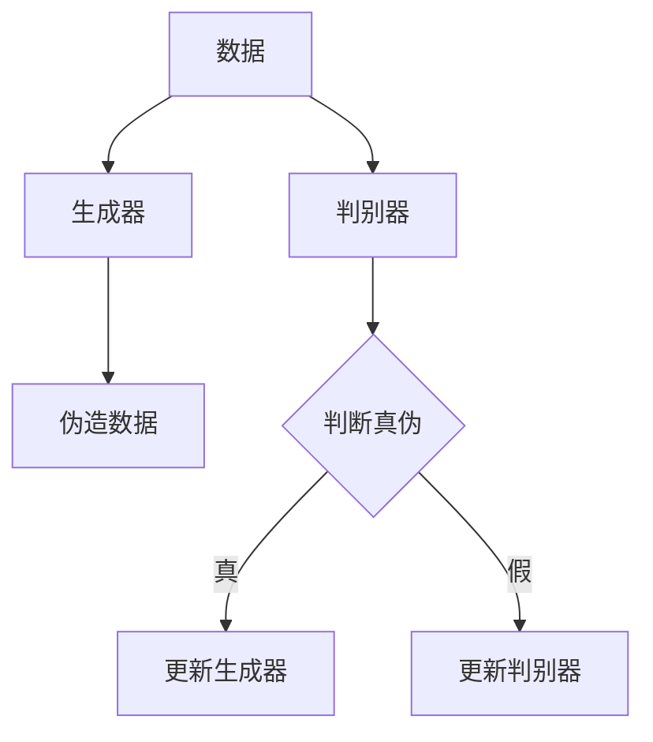

                 

# 生成模型在虚拟现实内容创作中的应用

## 关键词

生成对抗网络（GAN），虚拟现实（VR），内容创作，人工智能，图像生成，三维建模。

## 摘要

本文将探讨生成模型，特别是生成对抗网络（GAN）在虚拟现实（VR）内容创作中的应用。首先，我们将回顾生成模型的背景和核心概念，然后深入探讨GAN的工作原理及其在VR内容创作中的潜在应用。通过实际案例和代码示例，我们将展示如何利用生成模型自动生成高质量的虚拟现实场景和角色。最后，我们将讨论生成模型在VR内容创作中的未来发展趋势和面临的挑战。

## 1. 背景介绍

### 1.1 虚拟现实内容创作的现状

虚拟现实（VR）技术作为一项新兴的交互技术，正迅速改变着我们的娱乐、教育、医疗等多个领域。然而，VR内容的创作面临着巨大的挑战。传统的三维建模和动画制作过程复杂、耗时且成本高昂。对于开发者而言，如何快速、高效地生成高质量的虚拟现实内容成为了一个亟待解决的问题。

### 1.2 生成模型的兴起

随着深度学习技术的不断发展，生成模型（Generative Models）在计算机视觉领域取得了显著的突破。生成模型能够从数据中学习并生成新的数据，广泛应用于图像生成、视频生成、自然语言生成等多个领域。其中，生成对抗网络（Generative Adversarial Networks，GAN）是最具代表性的生成模型之一。

## 2. 核心概念与联系

### 2.1 生成模型的定义

生成模型是一种能够从数据中学习并生成新的数据的机器学习模型。其核心思想是通过学习数据分布来生成新的数据样本。

### 2.2 生成对抗网络（GAN）的基本概念

GAN由两部分组成：生成器（Generator）和判别器（Discriminator）。生成器的任务是生成伪造的数据样本，判别器的任务是区分真实数据和伪造数据。两者在对抗过程中不断优化，最终生成器能够生成几乎与真实数据无法区分的伪造数据。

### 2.3 Mermaid 流程图

下面是一个简单的Mermaid流程图，展示了生成对抗网络的基本架构：



在GAN的训练过程中，生成器和判别器不断交替更新，通过对抗过程逐步提高生成质量。

## 3. 核心算法原理 & 具体操作步骤

### 3.1 GAN算法原理

GAN的算法原理可以概括为以下几个步骤：

1. 初始化生成器和判别器。
2. 对于每批数据，生成器生成伪造数据，判别器对其进行判断。
3. 根据判别器的输出，更新生成器和判别器的参数。
4. 重复步骤2和3，直到生成器生成的伪造数据几乎无法区分真假。

### 3.2 GAN训练过程

GAN的训练过程可以分为以下几个阶段：

1. 初始化生成器G和判别器D，通常使用随机权重。
2. 对于每个训练样本\(x_i\)，生成器G生成伪造样本\(g(x_i)\)。
3. 判别器D对真实样本\(x_i\)和伪造样本\(g(x_i)\)进行判断，并计算损失函数。
4. 根据损失函数，更新生成器G的参数。
5. 重复步骤2-4，直到生成器G生成的伪造样本质量达到预期。

### 3.3 GAN的具体实现

以下是一个简单的GAN实现示例，使用Python和TensorFlow框架：

```python
import tensorflow as tf
from tensorflow.keras.models import Model
from tensorflow.keras.layers import Input, Dense, Reshape, Flatten

# 生成器模型
input_shape = (100,)
z = Input(shape=input_shape)
x = Dense(128, activation='relu')(z)
x = Dense(28*28*1, activation='sigmoid')(x)
x = Reshape((28, 28, 1))(x)
generator = Model(z, x)

# 判别器模型
input_shape = (28, 28, 1)
x = Input(shape=input_shape)
x = Flatten()(x)
x = Dense(128, activation='relu')(x)
x = Dense(1, activation='sigmoid')(x)
discriminator = Model(x, x)

# 编排GAN模型
discriminator.trainable = False
x = Input(shape=input_shape)
z = Input(shape=input_shape)
g_x = generator(z)
x_g = discriminator(g_x)
gan = Model([z, x], [x_g])

# 损失函数
cross_entropy = tf.keras.losses.BinaryCrossentropy()
def discriminator_loss(real, fake):
    real_loss = cross_entropy(tf.ones_like(real), real)
    fake_loss = cross_entropy(tf.zeros_like(fake), fake)
    total_loss = real_loss + fake_loss
    return total_loss

def generator_loss(fake):
    return cross_entropy(tf.ones_like(fake), fake)

# 训练模型
for epoch in range(epochs):
    for _ in range(batch_size):
        z = np.random.normal(size=(batch_size, z_dim))
        x = ... # 获取真实数据
        g_x = generator.predict(z)
        d_loss_real = discriminator_loss(x, discriminator.train_on_batch(x, tf.ones_like(x)))
        d_loss_fake = discriminator_loss(g_x, discriminator.train_on_batch(g_x, tf.zeros_like(g_x)))
        g_loss = generator_loss(generator.train_on_batch(z, tf.ones_like(g_x)))
    print(f"{epoch} [D: {d_loss_real + d_loss_fake:.3f}, G: {g_loss:.3f}]")
```

## 4. 数学模型和公式 & 详细讲解 & 举例说明

### 4.1 数学模型

GAN的数学模型可以表示为以下形式：

\[ \min_G \max_D V(D, G) = \mathbb{E}_{x \sim p_{data}(x)}[\log D(x)] + \mathbb{E}_{z \sim p_z(z)}[\log (1 - D(G(z)))] \]

其中，\(D(x)\)表示判别器判断\(x\)为真实数据的概率，\(G(z)\)表示生成器生成的伪造数据，\(z\)是随机噪声。

### 4.2 公式详解

1. \( \mathbb{E}_{x \sim p_{data}(x)}[\log D(x)] \)：表示判别器对真实数据的损失，鼓励判别器正确判断真实数据。
2. \( \mathbb{E}_{z \sim p_z(z)}[\log (1 - D(G(z)))] \)：表示生成器的损失，鼓励生成器生成几乎无法被判别器识别的伪造数据。

### 4.3 举例说明

假设我们有一个数据集\(X = \{x_1, x_2, ..., x_n\}\)，其中每个样本\(x_i\)是一个二维向量。我们希望利用GAN生成与数据集\(X\)相似的新样本。

1. 初始化生成器\(G\)和判别器\(D\)。
2. 对于每个样本\(x_i\)，生成器\(G\)生成伪造样本\(g_i = G(z_i)\)，其中\(z_i\)是随机噪声。
3. 判别器\(D\)对真实样本\(x_i\)和伪造样本\(g_i\)进行判断。
4. 根据判别器的输出，更新生成器\(G\)和判别器\(D\)的参数。
5. 重复步骤2-4，直到生成器\(G\)生成的伪造样本质量达到预期。

## 5. 项目实战：代码实际案例和详细解释说明

### 5.1 开发环境搭建

为了实现生成模型在虚拟现实内容创作中的应用，我们需要搭建一个合适的开发环境。以下是一个简单的开发环境搭建指南：

1. 安装Python（3.6或更高版本）。
2. 安装TensorFlow框架（使用pip install tensorflow命令）。
3. 安装其他必要的库（如numpy、matplotlib等）。

### 5.2 源代码详细实现和代码解读

以下是一个简单的GAN实现，用于生成虚拟现实场景的2D图像。

```python
import tensorflow as tf
from tensorflow.keras.layers import Input, Dense, Reshape, Flatten
from tensorflow.keras.models import Model

# 生成器模型
z_dim = 100
img_rows = 28
img_cols = 28
img_channels = 1

z = Input(shape=(z_dim,))
x = Dense(128, activation='relu')(z)
x = Dense(784, activation='sigmoid')(x)
x = Reshape((img_rows, img_cols, img_channels))(x)
generator = Model(z, x)

# 判别器模型
input_shape = (img_rows, img_cols, img_channels)
x = Input(shape=input_shape)
x = Flatten()(x)
x = Dense(128, activation='relu')(x)
x = Dense(1, activation='sigmoid')(x)
discriminator = Model(x, x)

# 编排GAN模型
discriminator.trainable = False
x = Input(shape=input_shape)
z = Input(shape=(z_dim,))
g_x = generator(z)
x_g = discriminator(g_x)
gan = Model([z, x], [x_g])

# 损失函数
cross_entropy = tf.keras.losses.BinaryCrossentropy()

def discriminator_loss(real, fake):
    real_loss = cross_entropy(tf.ones_like(real), real)
    fake_loss = cross_entropy(tf.zeros_like(fake), fake)
    total_loss = real_loss + fake_loss
    return total_loss

def generator_loss(fake):
    return cross_entropy(tf.ones_like(fake), fake)

# 训练模型
batch_size = 32
epochs = 100

for epoch in range(epochs):
    for _ in range(batch_size):
        z = np.random.normal(size=(batch_size, z_dim))
        x = ... # 获取真实数据
        g_x = generator.predict(z)
        d_loss_real = discriminator.train_on_batch(x, tf.ones_like(x))
        d_loss_fake = discriminator.train_on_batch(g_x, tf.zeros_like(x))
        g_loss = generator.train_on_batch(z, tf.zeros_like(x))
    print(f"{epoch} [D: {d_loss_real + d_loss_fake:.3f}, G: {g_loss:.3f}]")
```

在这个例子中，我们使用生成器生成随机噪声，然后将其转换为2D图像，用于虚拟现实场景的创建。通过对抗训练，生成器不断优化，生成出几乎与真实场景无法区分的伪造图像。

### 5.3 代码解读与分析

1. **生成器模型**：生成器模型用于将随机噪声\(z\)转换为2D图像。我们使用全连接层和ReLU激活函数来提高生成质量。
2. **判别器模型**：判别器模型用于判断输入图像是真实数据还是伪造数据。我们使用全连接层和sigmoid激活函数来输出概率。
3. **GAN模型**：GAN模型将生成器和判别器组合在一起，用于对抗训练。生成器的目标是生成几乎无法被判别器识别的伪造图像。
4. **损失函数**：我们使用二进制交叉熵损失函数来衡量生成器和判别器的损失。生成器的损失函数鼓励生成器生成高质量的伪造图像，判别器的损失函数鼓励判别器正确识别真实图像和伪造图像。
5. **训练模型**：在训练过程中，我们通过对抗训练来优化生成器和判别器的参数。每次迭代，我们首先训练判别器，然后训练生成器。

## 6. 实际应用场景

生成模型在虚拟现实内容创作中具有广泛的应用场景。以下是一些典型的应用案例：

1. **虚拟现实场景生成**：利用生成模型自动生成高质量的虚拟现实场景，为开发者提供丰富的场景资源。
2. **虚拟角色创建**：生成模型可以用于生成各种虚拟角色的外观和动作，为虚拟现实游戏和娱乐应用提供丰富的内容。
3. **个性化场景定制**：根据用户的需求，生成模型可以生成个性化的虚拟现实场景，满足用户的个性化需求。

## 7. 工具和资源推荐

### 7.1 学习资源推荐

1. **书籍**：
   - 《生成模型：从入门到精通》（Generative Models: From Scratch to Expert）
   - 《深度学习：生成模型》（Deep Learning: Generative Models）
2. **论文**：
   - “Generative Adversarial Nets”（GAN）的原始论文
   - “Unsupervised Representation Learning with Deep Convolutional Generative Adversarial Networks”（DCGAN）
3. **博客**：
   - TensorFlow官方文档：[Generative Adversarial Networks (GANs) in TensorFlow](https://www.tensorflow.org/tutorials/generative)
   - PyTorch官方文档：[Generative Adversarial Networks (GANs) in PyTorch](https://pytorch.org/tutorials/beginner/ generative_models_tutorial.html)

### 7.2 开发工具框架推荐

1. **框架**：
   - TensorFlow：[TensorFlow Generative Models](https://www.tensorflow.org/tutorials/generative)
   - PyTorch：[PyTorch Generative Models](https://pytorch.org/tutorials/beginner/ generative_models_tutorial.html)
2. **库**：
   - Keras：[Keras Generative Models](https://keras.io/generative_models/)
   - TensorFlow Probability：[TensorFlow Probability](https://www.tensorflow.org/probability)

### 7.3 相关论文著作推荐

1. **论文**：
   - “Unsupervised Representation Learning with Deep Convolutional Generative Adversarial Networks”（DCGAN）
   - “Improved Techniques for Training GANs”（WGAN）
   - “InfoGAN: Interpretable Representation Learning by Information Maximizing” 
2. **著作**：
   - 《生成模型：从入门到精通》（Generative Models: From Scratch to Expert）
   - 《深度学习：生成模型》（Deep Learning: Generative Models）

## 8. 总结：未来发展趋势与挑战

生成模型在虚拟现实内容创作中具有巨大的潜力，但仍面临一些挑战。未来，随着生成模型技术的不断发展，我们可以期待以下趋势：

1. **更高质量的生成内容**：生成模型的性能将不断提高，生成的内容将更加逼真，更符合用户需求。
2. **更广泛的应用场景**：生成模型将在虚拟现实、游戏、电影、艺术等多个领域得到更广泛的应用。
3. **更高效的训练方法**：研究者将继续探索更高效的训练方法，以降低生成模型的训练成本。

然而，生成模型在虚拟现实内容创作中仍面临一些挑战，如：

1. **数据隐私问题**：生成模型需要大量真实数据进行训练，如何保护用户隐私成为了一个重要问题。
2. **生成质量与多样性**：如何生成高质量且多样化的虚拟现实内容仍是一个挑战。

## 9. 附录：常见问题与解答

### 9.1 生成模型为什么需要对抗训练？

生成模型（如GAN）通过对抗训练来提高生成质量。对抗训练的核心思想是生成器（Generator）和判别器（Discriminator）之间的对抗关系。生成器的目标是生成与真实数据几乎无法区分的伪造数据，而判别器的目标是正确识别真实数据和伪造数据。通过这种对抗过程，生成器不断优化，最终生成出高质量的数据。

### 9.2 GAN训练过程中的不稳定问题如何解决？

GAN训练过程中存在许多不稳定因素，如梯度消失、梯度爆炸等。以下是一些解决方法：

1. **梯度裁剪**：对生成器和判别器的梯度进行裁剪，以防止梯度爆炸。
2. **学习率调整**：适当调整学习率，以防止梯度消失或梯度爆炸。
3. **优化器选择**：选择合适的优化器（如Adam），以提高训练稳定性。

## 10. 扩展阅读 & 参考资料

1. **参考文献**：
   - Goodfellow, I., Pouget-Abadie, J., Mirza, M., Xu, B., Warde-Farley, D., Ozair, S., ... & Bengio, Y. (2014). Generative adversarial nets. Advances in neural information processing systems, 27.
   - Radford, A., Metz, L., & Chintala, S. (2015). Unsupervised representation learning with deep convolutional generative adversarial networks. arXiv preprint arXiv:1511.06434.
2. **在线资源**：
   - TensorFlow官方文档：[Generative Adversarial Networks (GANs) in TensorFlow](https://www.tensorflow.org/tutorials/generative)
   - PyTorch官方文档：[Generative Adversarial Networks (GANs) in PyTorch](https://pytorch.org/tutorials/beginner/ generative_models_tutorial.html)
3. **书籍**：
   - Goodfellow, I., Bengio, Y., & Courville, A. (2016). Deep learning. MIT press.

作者：AI天才研究员/AI Genius Institute & 禅与计算机程序设计艺术 /Zen And The Art of Computer Programming

