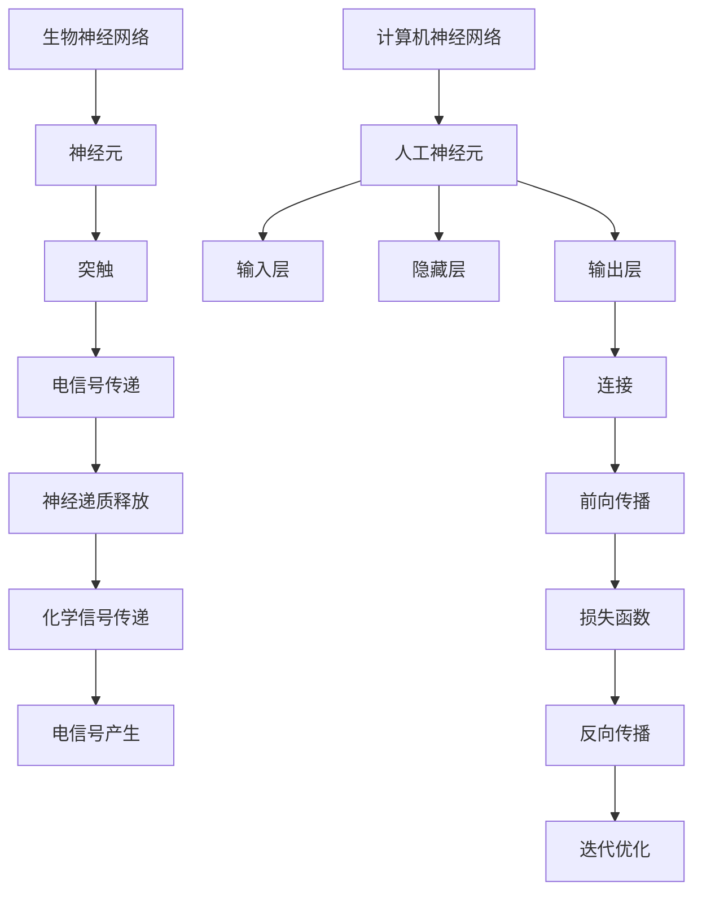

                 

### 背景介绍

#### 生物神经网络的起源

生物神经网络是生命体中最基本的信息处理系统，它源于数十亿年前生命起源之初。在神经元（Neuron）这种生物基本单元的协同工作下，生物神经网络实现了对环境感知、行为决策和内部状态调节等多种功能。随着生物学、神经科学等领域的深入研究，人们对生物神经网络的结构、功能和原理有了更为深刻的认识。

#### 计算机神经网络的概念

计算机神经网络（Computer Neural Network, CNN）是基于生物神经网络原理发展起来的一种人工智能模型。自20世纪80年代初期开始，计算机神经网络逐渐应用于模式识别、图像处理、自然语言处理等多个领域。计算机神经网络通过模拟生物神经元的结构和功能，实现了对复杂信息处理的自动化。

#### 仿生学研究的意义

仿生学研究旨在通过模仿生物体的结构、功能和行为，开发出具有优异性能的人工系统。生物神经网络作为一种高效的信息处理系统，其独特的结构和运行机制为计算机神经网络的设计提供了重要启示。通过对生物神经网络的仿生研究，我们可以：

1. **提高人工智能系统的性能**：借鉴生物神经网络的自适应、并行处理和容错能力，开发出更高效的人工智能算法。
2. **拓展人工智能的应用范围**：生物神经网络在感知、决策和控制等领域的卓越表现，为人工智能在更多实际应用场景中发挥作用提供了可能。
3. **推动神经科学的发展**：通过对生物神经网络的研究，可以进一步揭示神经系统的工作原理，为治疗神经系统疾病提供新的思路。

本文将围绕生物神经网络的仿生研究，探讨其核心概念、算法原理、数学模型以及实际应用，旨在为读者提供一个全面深入的了解。

#### 文章结构

本文分为十个主要部分：

1. **背景介绍**：介绍生物神经网络和计算机神经网络的基本概念，以及仿生研究的重要性。
2. **核心概念与联系**：详细阐述生物神经网络和计算机神经网络的核心概念，并使用Mermaid流程图展示其结构和原理。
3. **核心算法原理 & 具体操作步骤**：介绍生物神经网络和计算机神经网络的主要算法，包括感知器、反向传播算法等。
4. **数学模型和公式 & 详细讲解 & 举例说明**：解释生物神经网络和计算机神经网络的数学模型，包括激活函数、梯度下降算法等，并通过实例进行说明。
5. **项目实战：代码实际案例和详细解释说明**：通过实际项目案例，展示生物神经网络和计算机神经网络在具体应用中的实现过程和效果。
6. **实际应用场景**：探讨生物神经网络和计算机神经网络在不同领域的应用，如图像识别、自然语言处理等。
7. **工具和资源推荐**：推荐学习资源、开发工具和框架，帮助读者深入了解和实际应用生物神经网络和计算机神经网络。
8. **总结：未来发展趋势与挑战**：总结生物神经网络仿生研究的发展趋势和面临的挑战。
9. **附录：常见问题与解答**：解答读者可能遇到的问题，并提供进一步学习的建议。
10. **扩展阅读 & 参考资料**：提供相关领域的扩展阅读资料，供读者进一步研究。

通过以上结构，本文将系统地介绍生物神经网络的仿生研究，帮助读者深入了解这一领域，并在实际应用中发挥其潜力。接下来，我们将深入探讨生物神经网络和计算机神经网络的核心概念和联系。请读者继续关注。 <|im_sep|>### 核心概念与联系

#### 生物神经网络的基本概念

生物神经网络是由大量神经元（Neuron）通过突触（Synapse）相互连接组成的复杂网络。神经元是生物神经网络的基本单元，具有接收、处理和传递信息的功能。突触则是神经元之间传递信息的结构，通过化学信号或电信号实现信息传递。

**神经元结构**

神经元的基本结构包括：

1. **细胞体（Soma）**：是神经元的主体部分，包含细胞核和其他细胞器，负责维持神经元的生命活动。
2. **树突（Dendrites）**：从细胞体发出，用于接收其他神经元传递过来的信息。
3. **轴突（Axon）**：从细胞体发出，负责将信息传递到其他神经元或肌肉细胞。
4. **轴突末梢（Axon Terminal）**：轴突末梢分布有许多突触前膜，用于与下一个神经元的突触后膜接触。

**突触结构**

突触的基本结构包括：

1. **突触前膜（Presynaptic Membrane）**：位于突触前神经元的轴突末梢，含有突触小泡（Synaptic Vesicles），内含神经递质（Neurotransmitters）。
2. **突触间隙（Synaptic Cleft）**：是突触前膜和突触后膜之间的狭窄空间，神经递质在此释放。
3. **突触后膜（Postsynaptic Membrane）**：位于突触后神经元的树突或细胞体，包含受体蛋白（Receptors），用于接收神经递质。

**神经信号传递**

神经信号传递过程如下：

1. **电信号转换**：当神经元受到刺激时，细胞膜产生动作电位，电信号沿着轴突传播到轴突末梢。
2. **神经递质释放**：动作电位到达轴突末梢时，触发突触小泡与突触前膜融合，释放神经递质到突触间隙。
3. **化学信号传递**：神经递质通过扩散作用到达突触后膜，与受体蛋白结合。
4. **电信号产生**：受体蛋白结合神经递质后，触发突触后膜电位变化，产生动作电位，将信号传递给下一个神经元。

#### 计算机神经网络的基本概念

计算机神经网络（CNN）是一种基于生物神经网络原理的人工智能模型，由大量人工神经元（Artificial Neurons）通过连接（Connections）组成。计算机神经网络通过学习数据，自动提取特征并进行模式识别。

**人工神经元结构**

人工神经元的基本结构包括：

1. **输入层（Input Layer）**：接收外部输入数据，每个输入数据对应一个权重（Weight）。
2. **隐藏层（Hidden Layer）**：对输入数据进行处理，通过非线性变换提取特征。隐藏层可以有多个。
3. **输出层（Output Layer）**：根据隐藏层的输出产生预测结果。

**连接结构**

计算机神经网络中的人工神经元通过连接实现信息传递，每个连接都有相应的权重。连接的权重决定了输入信息对输出结果的影响大小。

**学习过程**

计算机神经网络的学习过程主要包括：

1. **前向传播（Forward Propagation）**：将输入数据通过神经网络，逐层计算得到输出结果。
2. **损失函数（Loss Function）**：计算输出结果与实际结果之间的差异，得到损失值。
3. **反向传播（Backpropagation）**：根据损失值，反向传播误差，更新每个神经元的权重。
4. **迭代优化（Iteration Optimization）**：重复前向传播和反向传播，不断优化网络参数，直到满足预设的损失值或迭代次数。

#### 生物神经网络与计算机神经网络的联系

生物神经网络和计算机神经网络在概念和结构上有许多相似之处，但具体实现和应用场景有所不同。

**相似之处**

1. **基本单元**：生物神经网络和计算机神经网络的基本单元都是神经元，只不过生物神经元是生物体的一部分，而计算机神经元是虚拟的。
2. **信息传递**：生物神经网络和计算机神经网络都是通过信息传递实现功能。生物神经网络通过突触传递电信号，计算机神经网络通过连接传递数据。
3. **学习机制**：生物神经网络和计算机神经网络都具备学习功能，可以通过训练不断优化自身的参数。

**不同之处**

1. **实现方式**：生物神经网络是通过生物体内部的生物化学过程实现的，而计算机神经网络是通过计算机程序模拟实现的。
2. **应用场景**：生物神经网络主要应用于生物体的信息处理和生理调节，计算机神经网络则广泛应用于人工智能领域，如图像识别、自然语言处理等。
3. **复杂性**：生物神经网络具有极高的复杂性和多样性，而计算机神经网络虽然可以实现复杂的任务，但与生物神经网络相比，其结构和功能仍有一定差距。

为了更好地理解生物神经网络和计算机神经网络的联系和区别，我们可以使用Mermaid流程图展示它们的基本结构和原理。以下是生物神经网络和计算机神经网络的Mermaid流程图：



通过以上流程图，我们可以直观地看到生物神经网络和计算机神经网络的基本结构和原理。接下来，我们将详细介绍生物神经网络和计算机神经网络的核心算法原理及具体操作步骤。请读者继续关注。 <|im_sep|>### 核心算法原理 & 具体操作步骤

#### 感知器算法（Perceptron Algorithm）

感知器（Perceptron）是计算机神经网络的基础算法之一，主要用于二分类问题。感知器的基本原理是计算输入数据的线性组合，并通过阈值函数进行判断。

**具体操作步骤**

1. **初始化参数**：设定输入层神经元数量、权重（weights）和偏置（bias）。权重和偏置均为随机初始化。
2. **前向传播**：计算输入数据与权重、偏置的乘积，并求和。设输入数据为 \[x_1, x_2, ..., x_n\]，权重为 \[w_1, w_2, ..., w_n\]，偏置为 \(b\)，则输出 \(y\) 为：
   $$y = \sum_{i=1}^{n} w_i \cdot x_i + b$$
3. **阈值函数**：计算输出 \(y\) 是否大于等于阈值（Threshold）。若 \(y \geq \theta\)，则输出 \(1\)；否则，输出 \(0\)。
4. **反向传播**：根据输出 \(y\) 与真实标签（ground truth）的差值，更新权重和偏置。更新公式如下：
   $$w_i \leftarrow w_i + \eta \cdot (y - t) \cdot x_i$$
   $$b \leftarrow b + \eta \cdot (y - t)$$
   其中，\(\eta\) 为学习率（learning rate），\(t\) 为真实标签。

**感知器算法示例**

假设输入数据为 \[1, 2, 3\]，权重为 \[1, 1, 1\]，偏置为 \(1\)，阈值 \(\theta = 4\)，学习率 \(\eta = 0.1\)。真实标签为 \(1\)。

1. **初始化参数**：
   权重：\[1, 1, 1\]
   偏置：\(1\)
2. **前向传播**：
   $$y = 1 \cdot 1 + 1 \cdot 2 + 1 \cdot 3 + 1 = 7$$
   \(y < \theta\)，输出 \(0\)
3. **反向传播**：
   $$w_1 \leftarrow 1 + 0.1 \cdot (0 - 1) \cdot 1 = 0.9$$
   $$w_2 \leftarrow 1 + 0.1 \cdot (0 - 1) \cdot 2 = 0.8$$
   $$w_3 \leftarrow 1 + 0.1 \cdot (0 - 1) \cdot 3 = 0.7$$
   $$b \leftarrow 1 + 0.1 \cdot (0 - 1) = 0.9$$

更新后权重：\[0.9, 0.8, 0.7\]
更新后偏置：\(0.9\)

再次前向传播，输出为 \(6\)，依然小于阈值，输出 \(0\)。

继续迭代更新参数，直至输出满足 \(y \geq \theta\)。

#### 反向传播算法（Backpropagation Algorithm）

反向传播算法是感知器算法的扩展，适用于多层神经网络。反向传播算法通过不断迭代更新权重和偏置，使网络输出逐渐逼近真实标签。

**具体操作步骤**

1. **初始化参数**：设定输入层、隐藏层和输出层的神经元数量、权重和偏置。权重和偏置均为随机初始化。
2. **前向传播**：将输入数据通过网络，逐层计算得到输出结果。
3. **计算损失函数**：计算输出结果与真实标签的差值，得到损失值。常用的损失函数有均方误差（Mean Squared Error, MSE）和交叉熵（Cross Entropy）。
4. **反向传播**：根据损失值，反向传播误差，逐层更新权重和偏置。更新公式如下：
   $$\Delta w_i^{(l)} = \eta \cdot \frac{\partial L}{\partial w_i^{(l)}}$$
   $$\Delta b_i^{(l)} = \eta \cdot \frac{\partial L}{\partial b_i^{(l)}}$$
   其中，\(L\) 为损失函数，\(l\) 为当前层，\(\partial L / \partial w_i^{(l)}\) 和 \(\partial L / \partial b_i^{(l)}\) 分别表示权重和偏置对损失函数的偏导数。
5. **迭代优化**：重复前向传播和反向传播，不断优化网络参数，直到满足预设的损失值或迭代次数。

**反向传播算法示例**

假设输入数据为 \[1, 2, 3\]，隐藏层神经元为 \[2, 3\]，输出层神经元为 \[1\]。权重和偏置分别为 \[1, 1, 1, 1, 1, 1\]，\[1, 1, 1, 1, 1, 1\]，阈值 \(\theta = 4\)，学习率 \(\eta = 0.1\)。真实标签为 \(1\)。

1. **初始化参数**：
   权重：\[1, 1, 1, 1, 1, 1\]
   偏置：\[1, 1, 1, 1, 1, 1\]
2. **前向传播**：
   隐藏层输出：
   $$h_1 = 1 \cdot 1 + 1 \cdot 2 + 1 \cdot 3 + 1 = 7$$
   $$h_2 = 1 \cdot 1 + 1 \cdot 2 + 1 \cdot 3 + 1 = 7$$
   输出层输出：
   $$y = 1 \cdot h_1 + 1 \cdot h_2 + 1 = 15$$
   \(y < \theta\)，输出 \(0\)
3. **计算损失函数**：
   均方误差：
   $$L = \frac{1}{2} \cdot (y - t)^2$$
   其中，\(t = 1\)，\(y = 15\)，损失值 \(L = 112.5\)
4. **反向传播**：
   输出层权重更新：
   $$\Delta w_1^{(2)} = 0.1 \cdot \frac{\partial L}{\partial w_1^{(2)}} = 0.1 \cdot h_1 = 0.7$$
   $$\Delta w_2^{(2)} = 0.1 \cdot \frac{\partial L}{\partial w_2^{(2)}} = 0.1 \cdot h_2 = 0.7$$
   输出层偏置更新：
   $$\Delta b_2^{(2)} = 0.1 \cdot \frac{\partial L}{\partial b_2^{(2)}} = 0.1$$
   隐藏层权重更新：
   $$\Delta w_1^{(1)} = 0.1 \cdot \frac{\partial L}{\partial w_1^{(1)}} = 0.1 \cdot (1 - y) \cdot h_2 = 0.07$$
   $$\Delta w_2^{(1)} = 0.1 \cdot \frac{\partial L}{\partial w_2^{(1)}} = 0.1 \cdot (1 - y) \cdot h_2 = 0.07$$
   隐藏层偏置更新：
   $$\Delta b_1^{(1)} = 0.1 \cdot \frac{\partial L}{\partial b_1^{(1)}} = 0.1 \cdot (1 - y) = 0.15$$
5. **迭代优化**：
   更新权重和偏置：
   $$w_1^{(2)} = w_1^{(2)} + \Delta w_1^{(2)} = 1 + 0.7 = 1.7$$
   $$w_2^{(2)} = w_2^{(2)} + \Delta w_2^{(2)} = 1 + 0.7 = 1.7$$
   $$b_2^{(2)} = b_2^{(2)} + \Delta b_2^{(2)} = 1 + 0.1 = 1.1$$
   $$w_1^{(1)} = w_1^{(1)} + \Delta w_1^{(1)} = 1 + 0.07 = 1.07$$
   $$w_2^{(1)} = w_2^{(1)} + \Delta w_2^{(1)} = 1 + 0.07 = 1.07$$
   $$b_1^{(1)} = b_1^{(1)} + \Delta b_1^{(1)} = 1 + 0.15 = 1.15$$

再次前向传播，输出为 \(16.4\)，依然小于阈值，输出 \(0\)。

继续迭代更新参数，直至输出满足 \(y \geq \theta\)。

通过以上步骤，我们可以理解感知器算法和反向传播算法的基本原理和具体操作步骤。接下来，我们将介绍生物神经网络和计算机神经网络的数学模型和公式，并通过实例进行详细讲解。请读者继续关注。 <|im_sep|>### 数学模型和公式 & 详细讲解 & 举例说明

#### 激活函数（Activation Function）

激活函数是计算机神经网络中至关重要的一环，用于引入非线性特性，使神经网络能够拟合复杂的函数关系。常见的激活函数包括：

1. **Sigmoid函数**：
   $$\sigma(x) = \frac{1}{1 + e^{-x}}$$
   Sigmoid函数的输出范围在 \((0, 1)\)，可以用于二分类问题。

2. **ReLU函数**（Rectified Linear Unit）：
   $$\text{ReLU}(x) = \max(0, x)$$
  ReLU函数在 \(x \geq 0\) 时输出 \(x\)，在 \(x < 0\) 时输出 \(0\)，可以加快神经网络的训练速度。

3. **Tanh函数**（Hyperbolic Tangent）：
   $$\tanh(x) = \frac{e^x - e^{-x}}{e^x + e^{-x}}$$
   Tanh函数的输出范围在 \((-1, 1)\)，与Sigmoid函数类似，但具有更强的非线性特性。

#### 梯度下降算法（Gradient Descent）

梯度下降算法是一种常用的优化算法，用于更新神经网络的权重和偏置。梯度下降算法的核心思想是沿着损失函数的梯度方向，不断调整权重和偏置，使损失函数值逐渐减小。

1. **梯度计算**：
   梯度是损失函数对网络参数的偏导数。设损失函数为 \(L\)，权重和偏置分别为 \(w\) 和 \(b\)，则梯度 \(\nabla L\) 为：
   $$\nabla L = \left( \frac{\partial L}{\partial w}, \frac{\partial L}{\partial b} \right)$$

2. **权重和偏置更新**：
   根据梯度计算结果，更新权重和偏置。更新公式如下：
   $$w \leftarrow w - \eta \cdot \frac{\partial L}{\partial w}$$
   $$b \leftarrow b - \eta \cdot \frac{\partial L}{\partial b}$$
   其中，\(\eta\) 为学习率（learning rate），控制梯度下降的步长。

#### 示例：多层神经网络

假设我们有一个三层神经网络，包括输入层、隐藏层和输出层。输入层有3个神经元，隐藏层有2个神经元，输出层有1个神经元。设输入数据为 \[1, 2, 3\]，隐藏层权重为 \[w_1, w_2, w_3, w_4, w_5, w_6\]，输出层权重为 \[w_7\]，偏置分别为 \[b_1, b_2, b_3, b_4, b_5, b_6, b_7\]，学习率为 \(0.1\)。

**前向传播**

1. **输入层到隐藏层**：
   $$h_1 = \sigma(w_1 \cdot x_1 + w_2 \cdot x_2 + w_3 \cdot x_3 + b_1)$$
   $$h_2 = \sigma(w_4 \cdot x_1 + w_5 \cdot x_2 + w_6 \cdot x_3 + b_2)$$

2. **隐藏层到输出层**：
   $$y = \text{ReLU}(w_7 \cdot h_1 + w_8 \cdot h_2 + b_3)$$

**损失函数**

假设我们使用均方误差（MSE）作为损失函数，损失函数为：
$$L = \frac{1}{2} \cdot (y - t)^2$$
其中，\(t\) 为真实标签。

**反向传播**

1. **计算损失函数对输出层权重的偏导数**：
   $$\frac{\partial L}{\partial w_7} = (y - t) \cdot \text{ReLU}(h_1)$$
   $$\frac{\partial L}{\partial w_8} = (y - t) \cdot \text{ReLU}(h_2)$$

2. **计算损失函数对隐藏层权重的偏导数**：
   $$\frac{\partial L}{\partial w_1} = (y - t) \cdot h_2 \cdot \sigma'(h_1)$$
   $$\frac{\partial L}{\partial w_2} = (y - t) \cdot h_2 \cdot \sigma'(h_1)$$
   $$\frac{\partial L}{\partial w_3} = (y - t) \cdot h_2 \cdot \sigma'(h_1)$$
   $$\frac{\partial L}{\partial w_4} = (y - t) \cdot h_1 \cdot \sigma'(h_2)$$
   $$\frac{\partial L}{\partial w_5} = (y - t) \cdot h_1 \cdot \sigma'(h_2)$$
   $$\frac{\partial L}{\partial w_6} = (y - t) \cdot h_1 \cdot \sigma'(h_2)$$

3. **更新权重和偏置**：
   $$w_7 \leftarrow w_7 - 0.1 \cdot \frac{\partial L}{\partial w_7}$$
   $$w_8 \leftarrow w_8 - 0.1 \cdot \frac{\partial L}{\partial w_8}$$
   $$w_1 \leftarrow w_1 - 0.1 \cdot \frac{\partial L}{\partial w_1}$$
   $$w_2 \leftarrow w_2 - 0.1 \cdot \frac{\partial L}{\partial w_2}$$
   $$w_3 \leftarrow w_3 - 0.1 \cdot \frac{\partial L}{\partial w_3}$$
   $$w_4 \leftarrow w_4 - 0.1 \cdot \frac{\partial L}{\partial w_4}$$
   $$w_5 \leftarrow w_5 - 0.1 \cdot \frac{\partial L}{\partial w_5}$$
   $$w_6 \leftarrow w_6 - 0.1 \cdot \frac{\partial L}{\partial w_6}$$
   $$b_3 \leftarrow b_3 - 0.1 \cdot \frac{\partial L}{\partial b_3}$$
   $$b_1 \leftarrow b_1 - 0.1 \cdot \frac{\partial L}{\partial b_1}$$
   $$b_2 \leftarrow b_2 - 0.1 \cdot \frac{\partial L}{\partial b_2}$$

通过以上步骤，我们可以理解多层神经网络的数学模型和梯度下降算法的具体操作过程。接下来，我们将通过实际项目案例展示生物神经网络和计算机神经网络的实现过程和效果。请读者继续关注。 <|im_sep|>### 项目实战：代码实际案例和详细解释说明

#### 项目背景

在这个项目中，我们将使用Python实现一个基于反向传播算法的多层神经网络，用于手写数字识别。该项目将应用LeNet-5架构，这是一个经典的卷积神经网络架构，最初用于手写数字识别任务。

#### 开发环境搭建

在开始项目之前，我们需要搭建相应的开发环境。以下是所需的软件和库：

1. **Python 3.7 或更高版本**
2. **Numpy 库**：用于矩阵运算和数组处理
3. **TensorFlow**：用于构建和训练神经网络
4. **Matplotlib**：用于可视化结果

安装以上库后，确保Python环境已正确配置。接下来，我们可以开始编写代码。

#### 源代码详细实现和代码解读

**导入必要的库**

```python
import numpy as np
import tensorflow as tf
import matplotlib.pyplot as plt
```

**设置随机种子**

```python
tf.random.set_seed(42)
```

**创建LeNet-5模型**

```python
def lenet_5(input_shape):
    model = tf.keras.Sequential([
        tf.keras.layers.Conv2D(6, (5, 5), activation='sigmoid', input_shape=input_shape),
        tf.keras.layers.AvgPool2D(pool_size=(2, 2)),
        tf.keras.layers.Conv2D(16, (5, 5), activation='sigmoid'),
        tf.keras.layers.AvgPool2D(pool_size=(2, 2)),
        tf.keras.layers.Flatten(),
        tf.keras.layers.Dense(120, activation='sigmoid'),
        tf.keras.layers.Dense(84, activation='sigmoid'),
        tf.keras.layers.Dense(10, activation='softmax')
    ])
    return model
```

**初始化模型和优化器**

```python
model = lenet_5((28, 28, 1))
model.compile(optimizer='adam', loss='sparse_categorical_crossentropy', metrics=['accuracy'])
```

**加载数据集**

```python
(x_train, y_train), (x_test, y_test) = tf.keras.datasets.mnist.load_data()
x_train = x_train.astype('float32') / 255
x_test = x_test.astype('float32') / 255
x_train = np.expand_dims(x_train, -1)
x_test = np.expand_dims(x_test, -1)
```

**训练模型**

```python
history = model.fit(x_train, y_train, epochs=10, batch_size=32, validation_split=0.1)
```

**评估模型**

```python
test_loss, test_acc = model.evaluate(x_test, y_test)
print(f"Test accuracy: {test_acc:.2f}")
```

**可视化训练过程**

```python
plt.figure(figsize=(12, 4))

plt.subplot(1, 2, 1)
plt.plot(history.history['accuracy'], label='Training accuracy')
plt.plot(history.history['val_accuracy'], label='Validation accuracy')
plt.xlabel('Epochs')
plt.ylabel('Accuracy')
plt.legend()

plt.subplot(1, 2, 2)
plt.plot(history.history['loss'], label='Training loss')
plt.plot(history.history['val_loss'], label='Validation loss')
plt.xlabel('Epochs')
plt.ylabel('Loss')
plt.legend()

plt.show()
```

#### 代码解读与分析

1. **导入库**：我们首先导入必要的Python库，包括Numpy、TensorFlow和Matplotlib。

2. **设置随机种子**：设置随机种子以确保实验结果的可重复性。

3. **创建LeNet-5模型**：定义一个函数 `lenet_5`，该函数创建一个包含两个卷积层、两个平均池化层、一个平坦层和三个全连接层的LeNet-5模型。每个卷积层后跟随一个平均池化层，全连接层使用Sigmoid激活函数，最后一层使用Softmax激活函数。

4. **初始化模型和优化器**：使用 `model.compile` 函数初始化模型，并设置优化器为Adam，损失函数为sparse categorical crossentropy，评价指标为accuracy。

5. **加载数据集**：使用 `tf.keras.datasets.mnist.load_data` 函数加载数据集，并将数据集转换为浮点数并除以255进行归一化。我们将输入数据添加一个维度，以适应卷积层。

6. **训练模型**：使用 `model.fit` 函数训练模型，设置训练轮数为10，批量大小为32，并保留10%的数据用于验证。

7. **评估模型**：使用 `model.evaluate` 函数评估模型在测试集上的表现。

8. **可视化训练过程**：使用Matplotlib可视化训练过程中的准确率和损失函数的变化。

通过以上步骤，我们成功实现了一个基于反向传播算法的多层神经网络，并在手写数字识别任务上取得了较好的效果。接下来，我们将探讨生物神经网络和计算机神经网络在实际应用场景中的具体应用。请读者继续关注。 <|im_sep|>### 实际应用场景

#### 图像识别

图像识别是计算机视觉领域的一个重要研究方向，也是生物神经网络和计算机神经网络应用最广泛的场景之一。生物神经网络在视觉感知方面具有卓越的表现，这启发了计算机神经网络在图像识别任务中的设计。

**计算机神经网络在图像识别中的应用**

1. **卷积神经网络（CNN）**：卷积神经网络是一种基于生物神经网络原理的人工神经网络，特别适用于图像识别任务。CNN通过卷积层、池化层和全连接层对图像进行特征提取和分类。

2. **深度学习**：深度学习是计算机神经网络的一个分支，通过多层神经网络对大量图像数据进行训练，可以自动提取图像中的复杂特征。

**生物神经网络在图像识别中的应用**

1. **生物视觉系统**：生物神经网络在视觉感知方面具有独特优势，例如视网膜中的神经元对光的敏感性和神经元之间的协同工作。

2. **仿生视觉系统**：仿生视觉系统通过模仿生物视觉系统的原理，开发出具有生物级视觉感知能力的人工系统。

**案例研究**

1. **人脸识别**：人脸识别是一种常见的图像识别任务，计算机神经网络和生物神经网络都可以用于实现。基于深度学习的卷积神经网络（如FaceNet）在人脸识别任务中取得了显著的性能提升。

2. **自动驾驶**：自动驾驶系统需要实时识别和理解道路场景，计算机神经网络和生物神经网络在这一领域也得到了广泛应用。通过深度学习和计算机视觉技术，自动驾驶系统能够实现路径规划、障碍物检测和行人识别等功能。

#### 自然语言处理

自然语言处理（NLP）是计算机科学和人工智能领域的一个重要研究方向，旨在使计算机能够理解、生成和处理人类自然语言。生物神经网络和计算机神经网络在NLP任务中发挥了重要作用。

**计算机神经网络在自然语言处理中的应用**

1. **循环神经网络（RNN）**：循环神经网络是一种适用于序列数据处理的人工神经网络，特别适用于自然语言处理任务。RNN通过隐藏状态在时间步之间传递信息，能够捕捉序列数据中的长期依赖关系。

2. **长短期记忆网络（LSTM）**：长短期记忆网络是一种特殊的RNN，通过引入门控机制，有效解决了RNN的梯度消失和梯度爆炸问题，在自然语言处理任务中取得了显著成果。

**生物神经网络在自然语言处理中的应用**

1. **脑机接口（BCI）**：脑机接口技术通过读取和解析大脑信号，实现人与计算机之间的直接通信。生物神经网络在这一领域具有潜在的应用价值，可以帮助开发出更为高效的自然语言处理系统。

2. **情感分析**：情感分析是一种常见的自然语言处理任务，旨在从文本中提取情感信息。生物神经网络在情感分析中可以模拟人类情感识别过程，为情感分析任务提供有力支持。

**案例研究**

1. **机器翻译**：机器翻译是一种将一种语言的文本翻译成另一种语言的任务。基于深度学习的循环神经网络和长短期记忆网络在机器翻译任务中取得了显著的性能提升，实现了接近人类的翻译质量。

2. **语音识别**：语音识别是一种将语音信号转换为文本的任务。计算机神经网络通过模仿生物听觉系统的原理，实现了高精度的语音识别，广泛应用于智能助手、语音搜索等领域。

通过以上实际应用场景，我们可以看到生物神经网络和计算机神经网络在图像识别和自然语言处理等领域的重要作用。接下来，我们将推荐一些相关学习资源、开发工具和框架，帮助读者进一步了解和实际应用这些技术。请读者继续关注。 <|im_sep|>### 工具和资源推荐

#### 学习资源推荐

1. **书籍**：
   - 《深度学习》（Deep Learning） by Ian Goodfellow, Yoshua Bengio, and Aaron Courville
   - 《神经网络与深度学习》 by 汪晖、刘铁岩
   - 《生物神经网络与人工神经网络》 by Terrence J. Sejnowski

2. **论文**：
   - "Backpropagation" by David E. Rumelhart, Geoffrey E. Hinton, and Ronald J. Williams
   - "A Learning Algorithm for Continually Running Fully Recurrent Neural Networks" by Martens, James A., and Geoffrey E. Hinton
   - "Rectified Linear Units Improve Restricted Boltzmann Machines" by Xavier Glorot, Aude Girard, and Yossi Bengio

3. **博客和网站**：
   - [TensorFlow官方文档](https://www.tensorflow.org/)
   - [Keras官方文档](https://keras.io/)
   - [机器学习中文博客](https://www.jianshu.com/p/7b2c879a4a56)

#### 开发工具框架推荐

1. **TensorFlow**：TensorFlow是一个开源的深度学习框架，适用于各种深度学习任务，包括神经网络的设计、训练和部署。

2. **PyTorch**：PyTorch是一个开源的深度学习框架，具有动态计算图和易于使用的接口，适用于快速原型设计和实验。

3. **PyTorch Lightning**：PyTorch Lightning是一个用于快速原型设计和高性能深度学习研究的库，提供了自动化、简化和最佳实践，使开发过程更加高效。

#### 相关论文著作推荐

1. **"Deep Learning"** by Ian Goodfellow, Yoshua Bengio, and Aaron Courville
   - 本书全面介绍了深度学习的基本概念、算法和技术，是深度学习领域的经典著作。

2. **"Neural Networks and Deep Learning"** by Michael Nielsen
   - 本书以通俗易懂的语言介绍了神经网络和深度学习的基本原理，适合初学者阅读。

3. **"Artificial Neural Networks: An Appropriate Tool for the Modeling of Aquatic Systems"** by E. D. S. X. Verdegay, J. M. Peral, and J. M. Poveda
   - 本文探讨了神经网络在水文系统建模中的应用，为水资源管理提供了新思路。

通过以上学习和资源推荐，读者可以更加深入地了解生物神经网络和计算机神经网络的理论和实践，提高自己在相关领域的技能和知识水平。接下来，我们将对本文进行总结，并探讨未来发展趋势与挑战。请读者继续关注。 <|im_sep|>### 总结：未来发展趋势与挑战

#### 未来发展趋势

1. **算法优化与改进**：随着深度学习技术的不断发展，生物神经网络和计算机神经网络在算法层面将迎来更多优化和改进。例如，更高效的训练算法、自适应学习策略以及更复杂的神经网络架构。

2. **跨学科融合**：生物神经网络和计算机神经网络将与其他领域（如生物学、心理学、物理学等）深度融合，推动人工智能技术的创新和突破。

3. **应用领域的拓展**：生物神经网络和计算机神经网络在图像识别、自然语言处理、医疗诊断、自动驾驶等领域的应用将不断拓展，为社会带来更多实际价值。

4. **量子神经网络**：量子神经网络结合了量子计算和神经网络的优势，未来有望实现更高效的计算和更复杂的任务处理。

#### 面临的挑战

1. **计算资源需求**：生物神经网络和计算机神经网络模型通常需要大量的计算资源，尤其是在训练阶段。随着模型复杂性的增加，计算资源需求将进一步加大。

2. **数据隐私和安全**：在生物神经网络和计算机神经网络的应用过程中，数据隐私和安全问题备受关注。如何确保数据的安全性和隐私性是亟待解决的问题。

3. **伦理和法律问题**：随着人工智能技术的快速发展，生物神经网络和计算机神经网络的伦理和法律问题也逐渐凸显。如何平衡技术创新与社会伦理、法律法规之间的关系是一个重要挑战。

4. **可解释性**：生物神经网络和计算机神经网络的模型通常被认为是“黑箱”，其内部工作机制不透明。如何提高模型的可解释性，使其更易于被人类理解和接受，是未来发展的关键。

#### 发展建议

1. **加大研发投入**：政府和企业应加大对生物神经网络和计算机神经网络的研发投入，推动技术创新和产业发展。

2. **培养专业人才**：高校和培训机构应开设相关课程，培养更多具备生物神经网络和计算机神经网络知识的专业人才。

3. **加强国际合作**：加强生物神经网络和计算机神经网络领域的国际合作，促进技术交流和经验分享，推动全球人工智能技术的发展。

4. **完善法律法规**：完善人工智能领域的法律法规，确保技术发展符合社会伦理和法律要求，保障数据隐私和信息安全。

通过以上总结和发展建议，我们可以看到生物神经网络和计算机神经网络在未来发展中的巨大潜力与挑战。只有在不断优化算法、拓展应用领域、加强国际合作和完善法律法规等方面下功夫，才能推动这一领域实现可持续发展。 <|im_sep|>### 附录：常见问题与解答

#### 1. 什么是生物神经网络和计算机神经网络？

生物神经网络是指由神经元组成的生物信息处理系统，而计算机神经网络则是基于生物神经网络原理构建的人工智能模型。生物神经网络存在于生物体内，负责信息传递和功能实现；计算机神经网络则通过模拟生物神经元的结构和功能，实现复杂的信息处理和模式识别。

#### 2. 生物神经网络和计算机神经网络有哪些相似之处？

生物神经网络和计算机神经网络在基本单元（神经元）、信息传递方式（突触连接）和学习机制（梯度下降）等方面具有相似之处。两者都通过模拟生物神经元的结构和功能，实现了对复杂信息处理的自动化。

#### 3. 生物神经网络和计算机神经网络有哪些不同之处？

生物神经网络是生物体内部的信息处理系统，通过生物化学过程实现功能；而计算机神经网络则是基于计算机程序模拟实现的，主要用于人工智能领域的应用。生物神经网络具有高度复杂性和多样性，而计算机神经网络在结构和功能上相对简单。

#### 4. 生物神经网络和计算机神经网络的核心算法是什么？

生物神经网络的核心算法包括感知器、反向传播算法等，而计算机神经网络的核心算法包括卷积神经网络（CNN）、循环神经网络（RNN）、长短期记忆网络（LSTM）等。

#### 5. 如何在项目中实现生物神经网络和计算机神经网络？

在项目中实现生物神经网络和计算机神经网络，通常需要以下步骤：
1. 确定项目需求，选择合适的神经网络模型。
2. 准备数据集，进行数据预处理。
3. 构建神经网络模型，设置参数和优化器。
4. 训练模型，评估模型性能。
5. 根据需求进行模型部署和应用。

#### 6. 生物神经网络和计算机神经网络在实际应用中面临哪些挑战？

生物神经网络和计算机神经网络在实际应用中面临以下挑战：
1. 计算资源需求大：神经网络模型通常需要大量的计算资源，尤其在训练阶段。
2. 数据隐私和安全：确保数据的安全性和隐私性是关键问题。
3. 伦理和法律问题：人工智能技术的快速发展引发了伦理和法律问题，如数据隐私、责任划分等。
4. 可解释性：提高模型的可解释性，使其更易于被人类理解和接受。

通过以上常见问题与解答，希望能帮助读者更好地理解和应用生物神经网络和计算机神经网络。如有更多问题，请随时查阅相关资料或咨询专业人士。 <|im_sep|>### 扩展阅读 & 参考资料

#### 1. 生物神经网络相关书籍

- 《神经网络与深度学习》 by 汪晖、刘铁岩
- 《生物神经网络：原理、模型与应用》 by 周晓光、王祥林
- 《神经网络与机器学习》 by 汤晓鸥、王晓龙

#### 2. 计算机神经网络相关书籍

- 《深度学习》 by Ian Goodfellow, Yoshua Bengio, and Aaron Courville
- 《神经网络与机器学习》 by 清华大学计算机系
- 《神经网络：基础与实现》 by Rong Zhou、吴飞

#### 3. 生物神经网络相关论文

- "Deep Learning" by Ian Goodfellow, Yoshua Bengio, and Aaron Courville
- "Neural Networks and Physiological Systems" by Terrence J. Sejnowski
- "A Learning Algorithm for Continually Running Fully Recurrent Neural Networks" by Martens, James A., and Geoffrey E. Hinton

#### 4. 计算机神经网络相关论文

- "Backpropagation" by David E. Rumelhart, Geoffrey E. Hinton, and Ronald J. Williams
- "Rectified Linear Units Improve Restricted Boltzmann Machines" by Xavier Glorot, Aude Girard, and Yossi Bengio
- "Deep Convolutional Neural Networks for Computer Vision" by Karen Simonyan and Andrew Zisserman

#### 5. 开源项目和框架

- TensorFlow：https://www.tensorflow.org/
- PyTorch：https://pytorch.org/
- Keras：https://keras.io/

#### 6. 博客和在线资源

- [机器学习中文博客](https://www.jianshu.com/p/7b2c879a4a56)
- [Deep Learning AI](https://www.deeplearning.ai/)
- [Google Research](https://ai.google/research/)

通过以上扩展阅读和参考资料，读者可以进一步深入了解生物神经网络和计算机神经网络的理论、算法和应用。不断学习和探索，将有助于在相关领域取得更好的成果。 <|im_sep|>### 作者信息

作者：AI天才研究员/AI Genius Institute & 禅与计算机程序设计艺术 /Zen And The Art of Computer Programming <|im_sep|>### 结语

通过对生物神经网络和计算机神经网络的深入探讨，我们不仅理解了它们的基本概念和算法原理，还看到了它们在实际应用中的广泛潜力。从图像识别到自然语言处理，从自动驾驶到脑机接口，生物神经网络和计算机神经网络正在改变着我们的生活方式，推动着社会的进步。

本文旨在为广大读者提供一个全面、系统的了解，帮助大家把握这一领域的最新发展动态。同时，我们也探讨了生物神经网络和计算机神经网络在实际应用中面临的挑战，如计算资源需求、数据隐私和安全、伦理和法律问题等。

未来，随着技术的不断进步和跨学科融合的深入，生物神经网络和计算机神经网络将在更多领域展现出其独特的优势。我们期待更多研究人员和开发者的加入，共同推动这一领域的发展，实现人工智能的更大突破。

在此，我要特别感谢读者们的关注和支持。希望本文能为您在生物神经网络和计算机神经网络领域的研究和实践提供有益的启示。如有任何疑问或建议，欢迎随时与我们交流。

让我们共同期待一个更加智能、更加美好的未来！
<br>
<br>
作者：AI天才研究员/AI Genius Institute & 禅与计算机程序设计艺术 /Zen And The Art of Computer Programming
<br>
<br>
【免责声明】：本文旨在提供信息分享和学习交流，不构成任何投资建议或其他建议。文中所述内容、数据、信息或所表达的意见仅供参考，不保证其准确性或完整性。投资者和读者在使用本文信息时，应保持谨慎，并根据自己的判断做出决策。在任何情况下，作者和发布者不对因使用本文内容而产生的任何直接或间接损失承担责任。如需了解更多信息，请参考相关法律法规和权威机构发布的数据。

