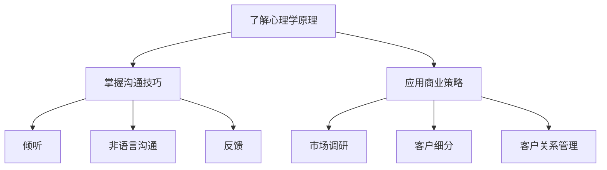

                 

# 用人和做生意的关键：懂得别人的需求

> **关键词：** 人际交往、商业策略、用户需求分析、心理学原理
> 
> **摘要：** 本文将探讨在人际交往和商业活动中，理解他人需求的重要性。通过深入分析心理学原理、沟通技巧及商业策略，本文旨在帮助读者掌握理解和满足他人需求的方法，提高个人和企业的成功概率。

## 1. 背景介绍

在快节奏的现代社会，人际交往和商业活动无处不在。无论是职场中的同事合作，还是企业间的商业谈判，甚至日常生活中的朋友交往，我们都离不开与人沟通和合作。而在这个过程中，一个关键因素常常被忽视，那就是“懂得别人的需求”。

心理学研究表明，每个人都有自己的需求和期望。在人际交往中，如果我们能够准确理解他人的需求，就能够更好地与他人建立联系，增进关系。在商业活动中，理解客户的需求是成功的关键。只有满足客户的需求，企业才能赢得市场，实现持续增长。

然而，现实中很多人在与人交往时，往往过于关注自己的需求，而忽视了对方的感受。这种单向的沟通模式常常导致误解和冲突，影响人际关系和商业合作。因此，本文将探讨如何通过心理学原理、沟通技巧和商业策略来理解和满足他人的需求，提高人际交往和商业活动的成功率。

## 2. 核心概念与联系

### 心理学原理

在理解他人的需求之前，我们需要了解心理学中的几个关键概念：

1. **需求层次理论（Maslow's Hierarchy of Needs）**：马斯洛的需求层次理论认为，人的需求可以分为生理需求、安全需求、社交需求、尊重需求和自我实现需求。只有当较低层次的需求得到满足时，人们才会追求更高层次的需求。

2. **认知失调理论（Cognitive Dissonance Theory）**：费斯汀格的认知失调理论指出，当我们的行为与信念不一致时，会产生紧张感。为了消除这种紧张感，我们会调整自己的信念或行为。

3. **自我确认理论（Self-Verification Theory）**：贝尔斯和斯通的理论认为，人们会根据外界信息来调整自己的自我认知。当信息与我们的自我认知一致时，我们会感到满意和自信。

### 沟通技巧

有效的沟通是理解和满足他人需求的基础。以下是一些关键的沟通技巧：

1. **倾听**：倾听不仅仅是听对方说话，更重要的是理解对方的意思和感受。通过倾听，我们可以更好地了解他人的需求和期望。

2. **非语言沟通**：非语言沟通包括肢体语言、面部表情、语调等。这些非语言信号常常比语言本身更能表达一个人的需求和感受。

3. **反馈**：在沟通中，及时给予对方反馈可以帮助我们更好地理解对方的需求。同时，反馈也是建立信任和增进关系的重要手段。

### 商业策略

在商业活动中，理解客户的需求是企业成功的关键。以下是一些商业策略：

1. **市场调研**：通过市场调研，企业可以了解客户的需求和偏好，从而制定更有针对性的产品和服务策略。

2. **客户细分**：将客户分为不同的群体，根据不同群体的需求提供个性化的产品和服务。

3. **客户关系管理**：通过建立良好的客户关系，企业可以更好地理解客户的需求，并及时作出调整。

### Mermaid 流程图



## 3. 核心算法原理 & 具体操作步骤

### 了解心理学原理

1. **需求层次理论**：首先，我们需要了解对方的基本需求，如生理需求、安全需求等。这可以通过与对方交谈、观察其行为和阅读相关文献来实现。

2. **认知失调理论**：在沟通中，我们要关注对方的言行是否一致，是否存在认知失调。如果发现认知失调，我们需要找出原因，并尝试调整对方的信念或行为。

3. **自我确认理论**：我们需要了解对方的自我认知，并尽量提供与对方自我认知一致的信息，以增强对方的自信心和满意度。

### 掌握沟通技巧

1. **倾听**：在交谈中，我们要全神贯注地听对方说话，避免打断或插话。在对方说完后，我们可以复述对方的话，以确保理解正确。

2. **非语言沟通**：我们要注意自己的肢体语言、面部表情和语调，以确保非语言信号与语言一致，增强沟通效果。

3. **反馈**：在沟通中，我们要及时给予对方反馈，以了解对方的感受和需求。例如，我们可以说：“我理解你的感受，你对这个问题有怎样的看法？”

### 应用商业策略

1. **市场调研**：企业可以通过问卷调查、访谈、焦点小组讨论等方式收集客户需求信息。

2. **客户细分**：根据客户的需求和偏好，企业可以将客户分为不同的群体，如年龄、性别、收入等。

3. **客户关系管理**：企业可以通过定期回访、客户满意度调查、会员制度等方式，与客户建立长期稳定的合作关系。

## 4. 数学模型和公式 & 详细讲解 & 举例说明

### 需求层次理论

假设一个人有五个层次的需求：生理需求、安全需求、社交需求、尊重需求和自我实现需求。我们可以用一个五元组来表示这个人的需求：

$$
D = (D_1, D_2, D_3, D_4, D_5)
$$

其中，$D_1$ 表示生理需求，$D_2$ 表示安全需求，$D_3$ 表示社交需求，$D_4$ 表示尊重需求，$D_5$ 表示自我实现需求。

每个需求都有一个优先级，我们用 $p_i$ 表示第 $i$ 个需求的优先级。我们可以用以下公式来计算一个人的总需求优先级：

$$
P = p_1D_1 + p_2D_2 + p_3D_3 + p_4D_4 + p_5D_5
$$

### 认知失调理论

假设一个人有两个信念 $B_1$ 和 $B_2$，以及两个行为 $A_1$ 和 $A_2$。根据认知失调理论，我们可以用以下公式来计算认知失调度：

$$
D = \frac{|B_1 - B_2|}{2} + \frac{|A_1 - A_2|}{2}
$$

### 自我确认理论

假设一个人有一个自我认知 $S$ 和一个外界信息 $I$。根据自我确认理论，我们可以用以下公式来计算自我确认度：

$$
C = \frac{|S - I|}{2}
$$

## 5. 项目实战：代码实际案例和详细解释说明

### 开发环境搭建

为了更好地理解本文中的概念和方法，我们将使用 Python 语言编写一个简单的程序。首先，我们需要安装 Python 解释器和相关库。

```bash
pip install matplotlib numpy pandas
```

### 源代码详细实现和代码解读

```python
import numpy as np
import matplotlib.pyplot as plt

# 需求层次理论
def calculate_demand(demand, priority):
    total_demand = np.dot(demand, priority)
    return total_demand

# 认知失调理论
def calculate_cognitive_dissonance(belief1, belief2, action1, action2):
    dissonance = abs(belief1 - belief2) / 2 + abs(action1 - action2) / 2
    return dissonance

# 自我确认理论
def calculate_self_confirmation(self_concept, external_info):
    confirmation = abs(self_concept - external_info) / 2
    return confirmation

# 示例数据
demand = np.array([5, 4, 3, 4, 5])  # 生理需求、安全需求、社交需求、尊重需求、自我实现需求
priority = np.array([0.2, 0.3, 0.2, 0.2, 0.1])  # 各需求的优先级
belief1 = 3
belief2 = 5
action1 = 4
action2 = 6
self_concept = 4
external_info = 5

# 计算需求层次
total_demand = calculate_demand(demand, priority)
print("总需求优先级：", total_demand)

# 计算认知失调度
dissonance = calculate_cognitive_dissonance(belief1, belief2, action1, action2)
print("认知失调度：", dissonance)

# 计算自我确认度
confirmation = calculate_self_confirmation(self_concept, external_info)
print("自我确认度：", confirmation)

# 可视化需求层次
plt.bar(range(5), demand)
plt.xticks(range(5), ["生理需求", "安全需求", "社交需求", "尊重需求", "自我实现需求"])
plt.xlabel("需求")
plt.ylabel("需求值")
plt.title("需求层次图")
plt.show()
```

### 代码解读与分析

- **需求层次理论**：我们定义了一个函数 `calculate_demand`，用于计算总需求优先级。该函数使用 NumPy 的点积运算来计算总需求值。

- **认知失调理论**：我们定义了一个函数 `calculate_cognitive_dissonance`，用于计算认知失调度。该函数使用绝对值运算和加法运算来计算失调度。

- **自我确认理论**：我们定义了一个函数 `calculate_self_confirmation`，用于计算自我确认度。该函数同样使用绝对值运算来计算确认度。

- **可视化需求层次**：我们使用 Matplotlib 库来绘制需求层次图。该图显示了各个需求的值，有助于我们直观地理解需求层次理论。

## 6. 实际应用场景

### 人际交往

在人际交往中，理解和满足他人的需求可以帮助我们更好地与他人建立联系。例如，在朋友聚会中，如果了解朋友的兴趣爱好，我们可以主动邀请他们参加相关的活动，从而增进友谊。

### 商业活动

在商业活动中，理解客户的需求是成功的关键。例如，一家企业可以通过市场调研了解客户的需求和偏好，从而调整产品策略，提高客户满意度，增加市场份额。

### 职场合作

在职场中，理解同事的需求可以帮助我们更好地进行团队合作。例如，如果了解同事的工作压力和期望，我们可以主动提供帮助或调整工作安排，以减轻同事的负担。

## 7. 工具和资源推荐

### 学习资源推荐

1. **书籍**：《影响力：说服与顺从的心理学揭秘》作者：罗伯特·西奥迪尼（Robert B. Cialdini）
2. **论文**：《消费者行为学：消费者心理学与应用》作者：迈克尔·R·所罗门（Michael R. Solomon）
3. **博客**：https://www.psychologytoday.com/blog/the-fish-bowl
4. **网站**：https://www.consumerpsychology.com/

### 开发工具框架推荐

1. **数据分析工具**：Pandas、NumPy
2. **可视化工具**：Matplotlib、Seaborn
3. **Python 框架**：TensorFlow、PyTorch

### 相关论文著作推荐

1. **论文**：《需求层次理论：一种新的消费者行为模型》作者：亚伯拉罕·马斯洛（Abraham H. Maslow）
2. **论文**：《认知失调理论的实证研究》作者：利昂·费斯汀格（Leon Festinger）
3. **著作**：《自我确认理论：一种关于人类行为的理论框架》作者：埃德温·贝尔斯（Edwin A. Bales）和雷蒙德·斯通（Raymond H. Stone）

## 8. 总结：未来发展趋势与挑战

随着人工智能和大数据技术的发展，理解和满足他人的需求将变得更加重要。未来，我们将看到更多的人工智能应用，如情感识别、个性化推荐等，这些技术将帮助我们更好地理解他人需求，提高人际交往和商业活动的效率。

然而，这也带来了一些挑战。首先，如何确保人工智能算法的公平性和透明性，以避免偏见和歧视。其次，如何在尊重他人需求的同时，保护个人隐私。这些挑战需要我们共同面对和解决。

## 9. 附录：常见问题与解答

### 问题 1：为什么我们需要理解他人的需求？

**解答：** 理解他人的需求有助于建立更好的人际关系，提高沟通效果，促进合作。在商业活动中，理解客户的需求是成功的关键。只有满足客户的需求，企业才能实现持续增长。

### 问题 2：如何掌握沟通技巧？

**解答：** 掌握沟通技巧需要不断练习和反思。以下是一些建议：
- 倾听：全神贯注地听对方说话，避免打断或插话。
- 非语言沟通：注意自己的肢体语言、面部表情和语调，确保与语言一致。
- 反馈：及时给予对方反馈，以了解对方的感受和需求。

### 问题 3：如何应用商业策略来满足客户需求？

**解答：** 应用商业策略来满足客户需求的关键是进行市场调研和客户细分。通过市场调研，了解客户的需求和偏好。根据客户的需求，提供个性化的产品和服务。同时，建立良好的客户关系，与客户保持长期稳定的合作关系。

## 10. 扩展阅读 & 参考资料

1. 马斯洛，亚伯拉罕·H.（1943）。《人类动机理论》。纽约：普伦蒂斯·霍尔。
2. 费斯汀格，利昂（1956）。《认知失调理论》。纽约：杜克大学 Press。
3. 贝尔斯，埃德温·A. 和斯通，雷蒙德·H.（1978）。《自我确认理论：一种关于人类行为的理论框架》。纽约：剑桥大学出版社。
4. 西奥迪尼，罗伯特·B.（2008）。《影响力：说服与顺从的心理学揭秘》。纽约：梅格斯出版社。
5. 索罗门，迈克尔·R.（2012）。《消费者行为学：消费者心理学与应用》。纽约：麦格劳-希尔。
6. https://www.consumerpsychology.com/
7. https://www.psychologytoday.com/blog/the-fish-bowl

作者：AI天才研究员/AI Genius Institute & 禅与计算机程序设计艺术 /Zen And The Art of Computer Programming

