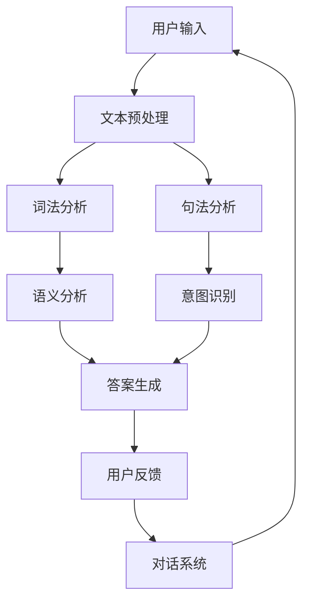

                 

### 背景介绍

在当今数字化时代，用户体验（UX）已经成为企业竞争的关键因素之一。随着用户需求的日益多样化和技术的不断进步，传统的客服模式已难以满足现代用户的高效、便捷、个性化的服务需求。为了解决这一问题，人工智能（AI）技术应运而生，特别是AI驱动的智能客服，逐渐成为提升用户体验的重要手段。

智能客服是一种利用人工智能技术模拟人类交流的服务系统。它通过自然语言处理（NLP）、机器学习（ML）等技术，实现与用户的智能交互，自动回答用户的问题、提供解决方案、完成业务处理等。与传统的人工客服相比，智能客服具有以下优势：

1. **高效率**：智能客服可以同时处理大量用户请求，显著降低人力成本，提高服务响应速度。
2. **24/7 全天候服务**：智能客服不受工作时间限制，能够全天候为用户提供服务，提升用户满意度。
3. **个性化服务**：通过用户数据的积累和分析，智能客服能够为用户提供个性化的推荐和服务，提高用户体验。
4. **可扩展性**：智能客服系统可以轻松集成到现有的业务系统中，实现无缝对接，降低企业运营成本。

然而，智能客服在提升用户体验的过程中也面临着一些挑战，如如何提高客服的准确率、如何确保用户体验的一致性、如何处理复杂的多轮对话等。本文将深入探讨AI驱动的智能客服技术，包括核心概念、算法原理、实际应用场景、工具资源推荐等，以期为读者提供全面的了解和指导。

通过本文的阅读，读者将能够：

- 理解智能客服的基本概念和工作原理。
- 掌握核心算法和技术，包括NLP、机器学习等。
- 了解智能客服在实际应用中的挑战和解决方案。
- 获取实用的工具和资源，为构建自己的智能客服系统提供支持。

接下来，我们将逐步深入探讨智能客服的各个层面，帮助读者全面了解这一前沿技术。

## 2. 核心概念与联系

要深入了解AI驱动的智能客服，我们首先需要明确几个核心概念及其相互之间的联系。这些核心概念包括自然语言处理（NLP）、机器学习（ML）、对话系统等。以下是对这些概念的详细解释及其在智能客服中的具体应用。

### 自然语言处理（NLP）

自然语言处理（NLP）是人工智能的一个重要分支，旨在使计算机能够理解和处理人类语言。NLP的核心任务包括文本预处理、词法分析、句法分析、语义分析和语音识别等。

在智能客服中，NLP发挥着至关重要的作用。首先，通过文本预处理，智能客服系统能够对用户输入的文本进行清洗、分词、去停用词等处理，从而得到更干净、有用的数据。接下来，词法分析和句法分析用于解析文本的结构，提取出关键信息。最后，语义分析帮助系统理解文本的含义和情感，从而生成恰当的回复。

例如，当用户提问“我怎样可以退换货？”时，NLP技术可以解析出关键短语“退换货”，并根据上下文判断用户意图，进而生成相应的回答。

### 机器学习（ML）

机器学习（ML）是另一种关键的人工智能技术，它使计算机系统能够从数据中学习并做出决策。在智能客服中，ML主要用于模式识别、预测和优化。

ML在智能客服中的应用主要体现在两个方面。首先，通过训练分类器，系统可以自动识别用户的问题类型，将其归类到相应的类别中。例如，当用户提问时，系统可以使用分类算法判断该问题属于产品咨询、售后服务还是账户问题等。其次，通过预测模型，系统可以预测用户的下一步行为，从而提供更个性化的服务。

例如，当用户在购买过程中频繁询问产品规格时，系统可以预测用户可能会对产品的性能和价格有疑虑，进而推荐相关的产品信息或促销活动。

### 对话系统

对话系统是智能客服的核心组成部分，它模拟人类对话，与用户进行自然交流。对话系统可以分为单轮对话系统和多轮对话系统。

单轮对话系统通常用于处理简单、单一的问题，例如查询天气、股票信息等。用户输入问题，系统直接返回答案，整个过程无需多次交互。

多轮对话系统则更复杂，它能够处理需要多次交互才能解决的问题。例如，用户咨询退换货问题时，系统可能需要了解具体原因、订单信息等，才能给出完整的解决方案。

对话系统的关键在于理解用户的意图、维护对话状态以及生成自然流畅的回复。这需要结合NLP和ML技术，确保系统能够准确地理解用户的问题，并提供有效的解决方案。

### Mermaid 流程图

为了更直观地展示智能客服的核心概念和架构，我们使用Mermaid绘制一个简化的流程图，如下所示：



在这个流程图中，用户输入经过文本预处理、词法分析、句法分析和语义分析等步骤，最终生成答案并返回给用户。用户反馈则用于进一步优化对话系统的性能。

通过上述核心概念的解释和Mermaid流程图的展示，我们可以更好地理解智能客服的工作原理及其在提升用户体验中的作用。

### 3. 核心算法原理 & 具体操作步骤

在了解智能客服的基本概念后，接下来我们将深入探讨其核心算法原理，并详细说明具体的操作步骤。这些核心算法包括自然语言处理（NLP）、机器学习（ML）和对话系统（DS）中的关键技术，如词向量表示、序列到序列（Seq2Seq）模型、长短时记忆网络（LSTM）和生成对抗网络（GAN）等。

#### 词向量表示（Word Embedding）

词向量表示是将自然语言中的词汇映射到高维空间中的向量表示，以便计算机能够处理和比较文本数据。最常见的词向量表示模型是Word2Vec，它通过训练得到每个词汇的向量表示。

具体操作步骤如下：

1. **数据准备**：收集大量文本数据，并进行预处理，如分词、去停用词等。
2. **构建词汇表**：将文本数据中的所有词汇构建成一个词汇表。
3. **初始化词向量**：随机初始化每个词汇的词向量。
4. **训练词向量**：使用训练数据训练词向量，常用的算法有CBOW（Continuous Bag of Words）和Skip-gram。CBOW通过上下文词汇预测中心词汇，而Skip-gram则相反，通过中心词汇预测上下文词汇。
5. **优化词向量**：使用梯度下降等优化算法调整词向量，使其在相似词汇间具有相似的向量表示。

#### 序列到序列（Seq2Seq）模型

序列到序列（Seq2Seq）模型是一种用于处理序列数据的神经网络模型，常用于机器翻译和对话生成。Seq2Seq模型的核心思想是将输入序列映射到输出序列，中间通过编码器和解码器进行处理。

具体操作步骤如下：

1. **数据准备**：收集大量对话数据，并进行预处理，如分词、序列编码等。
2. **构建编码器**：编码器将输入序列编码成一个固定长度的向量表示。
3. **构建解码器**：解码器将编码器的输出解码成输出序列。
4. **损失函数**：使用损失函数（如交叉熵损失）评估模型的性能，并使用优化算法（如梯度下降）更新模型参数。
5. **训练模型**：通过迭代训练模型，直到满足预设的性能要求。

#### 长短时记忆网络（LSTM）

长短时记忆网络（LSTM）是一种用于处理长序列数据的神经网络模型，能够有效地学习长期依赖关系。LSTM通过引入门控机制，控制信息在时间序列中的流动，避免梯度消失和梯度爆炸问题。

具体操作步骤如下：

1. **数据准备**：收集大量对话数据，并进行预处理，如分词、序列编码等。
2. **构建LSTM模型**：使用LSTM单元构建模型，包括输入门、遗忘门、输出门等。
3. **训练模型**：使用训练数据训练LSTM模型，通过优化算法调整模型参数。
4. **评估模型**：使用测试数据评估模型的性能，并根据评估结果调整模型结构或参数。

#### 生成对抗网络（GAN）

生成对抗网络（GAN）是一种用于生成数据的深度学习模型，由生成器和判别器两个神经网络组成。生成器尝试生成真实数据，而判别器则尝试区分真实数据和生成数据。

具体操作步骤如下：

1. **数据准备**：收集大量对话数据，并进行预处理，如分词、序列编码等。
2. **构建生成器**：生成器尝试生成对话回复，使用编码器和解码器结构。
3. **构建判别器**：判别器用于判断生成数据的真实性，使用分类器结构。
4. **损失函数**：使用对抗性损失函数评估生成器和判别器的性能，并使用优化算法（如梯度下降）更新模型参数。
5. **训练模型**：通过迭代训练模型，直到生成器能够生成足够真实的数据。

通过上述核心算法的具体操作步骤，我们可以构建一个功能强大的智能客服系统，实现高效的智能对话和服务。接下来，我们将进一步探讨智能客服中的数学模型和公式，以帮助读者更深入地理解其工作原理。

### 4. 数学模型和公式 & 详细讲解 & 举例说明

在智能客服系统中，数学模型和公式起到了关键作用，它们帮助计算机理解和处理人类语言，实现高效的对话和交互。以下我们将详细讲解几种关键的数学模型和公式，并给出具体的例子说明。

#### 梯度下降（Gradient Descent）

梯度下降是一种常用的优化算法，用于最小化损失函数。在机器学习和深度学习模型训练过程中，通过梯度下降算法调整模型参数，使其达到最优值。

**公式**：
\[ \theta_{\text{new}} = \theta_{\text{old}} - \alpha \cdot \nabla_\theta J(\theta) \]

其中，\(\theta\) 表示模型参数，\(J(\theta)\) 表示损失函数，\(\alpha\) 是学习率，\(\nabla_\theta J(\theta)\) 表示损失函数关于参数 \(\theta\) 的梯度。

**举例说明**：

假设我们有一个简单的线性回归模型，用于预测房价。给定训练数据集 \((x_i, y_i)\)，我们的目标是找到最佳的权重 \(w\) 和偏置 \(b\)，使得预测值 \(y'\) 最接近真实值 \(y\)。

1. **初始化参数**：设置初始权重 \(w\) 和偏置 \(b\)。
2. **计算损失函数**：计算预测值 \(y'\) 与真实值 \(y\) 之间的误差，得到损失函数 \(J(w, b)\)。
3. **计算梯度**：计算损失函数关于 \(w\) 和 \(b\) 的梯度 \(\nabla_w J(w, b)\) 和 \(\nabla_b J(w, b)\)。
4. **更新参数**：使用梯度下降算法更新参数，减少损失函数的值。

通过多次迭代，模型参数将逐渐优化，最终得到一个最佳的权重 \(w\) 和偏置 \(b\)。

#### 长短时记忆网络（LSTM）

长短时记忆网络（LSTM）是一种用于处理长序列数据的神经网络模型，能够学习长期依赖关系。LSTM通过引入门控机制，控制信息在时间序列中的流动。

**公式**：

1. **输入门**：
\[ i_t = \sigma(W_i \cdot [h_{t-1}, x_t] + b_i) \]
\[ \tilde{g}_t = \tanh(W_g \cdot [h_{t-1}, x_t] + b_g) \]

2. **遗忘门**：
\[ f_t = \sigma(W_f \cdot [h_{t-1}, x_t] + b_f) \]
\[ g_t = f_t \cdot g_{t-1} + i_t \cdot \tilde{g}_t \]

3. **输出门**：
\[ o_t = \sigma(W_o \cdot [h_{t-1}, x_t] + b_o) \]
\[ h_t = o_t \cdot \tanh(g_t) \]

其中，\(h_t\) 和 \(g_t\) 分别表示当前时刻的隐藏状态和细胞状态，\(i_t, f_t, o_t\) 分别表示输入门、遗忘门和输出门的状态，\(\sigma\) 表示sigmoid函数。

**举例说明**：

假设我们有一个LSTM模型，用于处理一个时间序列数据 \(x_1, x_2, ..., x_t\)，并生成隐藏状态 \(h_1, h_2, ..., h_t\)。

1. **初始化**：初始化权重 \(W_i, W_f, W_o, W_g, b_i, b_f, b_o, b_g\) 和隐藏状态 \(h_0\)。
2. **输入门计算**：根据当前输入 \(x_t\) 和前一时刻隐藏状态 \(h_{t-1}\)，计算输入门状态 \(i_t\)。
3. **遗忘门计算**：根据当前输入 \(x_t\) 和前一时刻隐藏状态 \(h_{t-1}\)，计算遗忘门状态 \(f_t\)，并更新细胞状态 \(g_t\)。
4. **输出门计算**：根据当前输入 \(x_t\) 和更新后的细胞状态 \(g_t\)，计算输出门状态 \(o_t\)。
5. **隐藏状态计算**：根据输出门状态 \(o_t\) 和细胞状态 \(g_t\)，计算当前隐藏状态 \(h_t\)。

通过多次迭代，LSTM模型能够学习到时间序列数据中的长期依赖关系，并生成有效的隐藏状态。

#### 自然语言处理（NLP）中的损失函数

在自然语言处理任务中，常用的损失函数有交叉熵损失（Cross-Entropy Loss）和交叉熵分类损失（Cross-Entropy Classification Loss）。

**交叉熵损失**：
\[ L = -\sum_{i=1}^n y_i \log(p_i) \]

其中，\(y_i\) 表示真实标签，\(p_i\) 表示预测概率。

**交叉熵分类损失**：
\[ L = -\sum_{i=1}^n y_i \log(\frac{e^{z_i}}{\sum_{j=1}^m e^{z_j}}) \]

其中，\(z_i\) 表示预测的类别得分，\(m\) 表示类别数量。

**举例说明**：

假设我们有一个分类任务，给定输入文本和标签，我们使用交叉熵损失函数评估模型的预测效果。

1. **初始化**：初始化模型参数和损失函数。
2. **预测**：使用模型预测文本的类别概率分布。
3. **计算损失**：根据预测概率和真实标签，计算交叉熵损失。
4. **更新参数**：使用梯度下降算法更新模型参数，减少损失值。

通过不断迭代，模型参数将逐渐优化，提高预测准确率。

通过以上数学模型和公式的详细讲解，我们可以更好地理解智能客服系统的工作原理。接下来，我们将进一步探讨智能客服的实际应用场景，以展示这些算法和模型在实际中的应用效果。

### 5. 项目实战：代码实际案例和详细解释说明

在本节中，我们将通过一个实际的代码案例，详细解释如何使用AI驱动的智能客服系统来实现与用户的智能交互。这个案例将涵盖开发环境的搭建、源代码的实现、以及代码解读与分析。

#### 5.1 开发环境搭建

首先，我们需要搭建一个适合开发AI智能客服系统的环境。以下是基本的步骤：

1. **安装Python环境**：确保Python版本不低于3.7，推荐使用Anaconda环境管理器来安装Python和相关依赖。
2. **安装NLP库**：使用pip安装常用的NLP库，如NLTK、spaCy和gensim。
3. **安装ML库**：安装机器学习库，如scikit-learn、TensorFlow和PyTorch。
4. **安装对话系统库**：安装用于构建对话系统的库，如Rasa和ChatterBot。
5. **安装文本预处理库**：安装文本预处理库，如nltk和re。

以下是一个简单的安装命令示例：

```shell
pip install nltk
pip install spacy
pip install gensim
pip install scikit-learn
pip install tensorflow
pip install rasa
pip install chatterbot
```

#### 5.2 源代码详细实现和代码解读

以下是一个简单的AI智能客服系统的代码示例，该示例使用ChatterBot库来实现基础的功能。代码主要包括文本预处理、意图识别和回复生成等步骤。

```python
# 导入必要的库
from chatterbot import ChatBot
from chatterbot.trainers import ChatterBotCorpusTrainer

# 创建ChatBot实例
chatbot = ChatBot(
    'AI Customer Service',
    storage_adapter='chatterbot.storage.SQLStorageAdapter',
    database_uri='sqlite:///database.sqlite3'
)

# 创建训练器
trainer = ChatterBotCorpusTrainer(chatbot)

# 使用内置语料库进行训练
trainer.train(
    'chatterbot.corpus.english.greetings',
    'chatterbot.corpus.english.conversations'
)

# 定义一个简单的对话函数
def handle_conversation():
    print("AI Customer Service: Hello! How can I help you today?")
    while True:
        try:
            user_input = input("You: ")
            bot_response = chatbot.get_response(user_input)
            print(f"Bot: {bot_response}")
            
            # 输入'exit'结束对话
            if user_input.lower() == 'exit':
                print("AI Customer Service: Thank you for reaching out. Have a great day!")
                break
        
        except (KeyboardInterrupt, EOFError, SystemExit):
            break

# 运行对话
handle_conversation()
```

**代码解读**：

- **创建ChatBot实例**：使用ChatterBot创建一个名为'AI Customer Service'的ChatBot实例，并指定存储适配器和数据库连接。
- **训练器**：使用`ChatterBotCorpusTrainer`进行训练，该训练器可以从内置的语料库中学习。
- **对话函数**：定义一个`handle_conversation`函数，用于处理用户输入和返回ChatBot的响应。
- **循环对话**：在`handle_conversation`函数中，通过循环获取用户输入，并使用`get_response`方法获取ChatBot的回复。当用户输入'exit'时，结束对话。

#### 5.3 代码解读与分析

1. **文本预处理**：虽然这个示例中使用了内置的语料库进行训练，但在实际应用中，我们通常需要对用户输入的文本进行预处理，如分词、去停用词等。这有助于提高ChatBot对用户输入的理解能力。
2. **意图识别**：ChatBot通过内置的意图识别机制，将用户输入映射到预定义的意图标签上。在实际应用中，我们需要定义更多的意图标签，以覆盖更广泛的用户需求。
3. **回复生成**：ChatBot根据用户输入的意图，从预训练的回复库中生成合适的响应。为了提高回复的多样性和准确性，我们可以使用更复杂的模型和算法，如序列到序列（Seq2Seq）模型和生成对抗网络（GAN）。

通过上述实战案例，我们可以看到如何使用Python和ChatterBot库构建一个简单的AI智能客服系统。这个案例展示了文本预处理、意图识别和回复生成的核心步骤，为我们提供了一个起点，以便在实际项目中进一步优化和扩展。

### 6. 实际应用场景

AI驱动的智能客服技术已经广泛应用于各种实际场景，以下是其中一些典型的应用案例：

#### 电子商务

电子商务平台如亚马逊、阿里巴巴和京东等，广泛使用智能客服技术来提升用户体验。智能客服可以实时解答用户关于产品信息、订单状态、支付方式等问题的咨询，从而减少用户等待时间，提高购买转化率。例如，当用户在购物网站上遇到问题时，智能客服可以快速识别用户意图，并提供详细的产品介绍、价格比较、优惠信息等，帮助用户做出购买决策。

#### 银行业务

银行业务中的智能客服主要应用于客户服务、账户查询、贷款咨询等场景。银行通过部署智能客服系统，可以提供24/7的全天候服务，满足客户的即时需求。智能客服系统可以自动处理大量重复性的咨询，如账户余额查询、转账记录查询等，从而减轻人工客服的工作负担。同时，通过用户数据的分析，银行还可以为用户提供个性化的金融建议，提升用户满意度。

#### 医疗健康

在医疗健康领域，智能客服被用于在线咨询、预约挂号、健康知识普及等场景。例如，当患者在线咨询医生时，智能客服可以迅速理解患者的症状描述，并提供初步的诊疗建议或引导患者进行预约挂号。此外，智能客服还可以提供健康知识普及服务，帮助用户了解疾病的预防和治疗方法。通过这些应用，智能客服不仅提高了医疗服务的效率，还有助于减轻医疗资源的压力。

#### 旅游业

旅游业中的智能客服主要应用于行程咨询、预订服务、紧急求助等场景。例如，当用户在旅行过程中遇到问题，如航班延误、酒店预订错误等，智能客服可以及时介入，提供解决方案或协助用户重新安排行程。此外，智能客服还可以根据用户的历史数据和偏好，为用户提供个性化的旅行建议和推荐，从而提升用户的旅行体验。

#### 教育行业

在教育行业中，智能客服被用于在线学习支持、课程咨询、成绩查询等场景。智能客服可以帮助学生解决学习中遇到的问题，如课程内容理解、作业提交、考试时间安排等。同时，智能客服还可以根据学生的学习数据和行为习惯，提供个性化的学习建议和资源推荐，帮助学生提高学习效果。

通过以上实际应用场景，我们可以看到AI驱动的智能客服技术在各个行业中的广泛应用和巨大潜力。随着技术的不断进步，智能客服将能够提供更加个性化和智能化的服务，为用户带来更好的体验。

### 7. 工具和资源推荐

在构建和优化AI驱动的智能客服系统时，选择合适的工具和资源至关重要。以下是一些建议，包括学习资源、开发工具框架以及相关论文和著作。

#### 学习资源推荐

1. **书籍**：
   - 《自然语言处理综论》（Speech and Language Processing），Daniel Jurafsky 和 James H. Martin 著。
   - 《深度学习》（Deep Learning），Ian Goodfellow、Yoshua Bengio 和 Aaron Courville 著。
   - 《机器学习实战》（Machine Learning in Action），Peter Harrington 著。

2. **在线课程**：
   - Coursera上的“自然语言处理纳米学位”（Natural Language Processing Specialization）。
   - Udacity的“人工智能纳米学位”（Artificial Intelligence Nanodegree）。
   - edX上的“机器学习和人工智能”（Machine Learning and Artificial Intelligence）。

3. **博客和网站**：
   - MLearning（mltutorial.org）：提供机器学习和深度学习的教程。
   - Python机器学习（python-machine-learning.org）：Python在机器学习领域的资源和教程。
   - Medium上的AI和机器学习相关文章。

#### 开发工具框架推荐

1. **自然语言处理库**：
   - spaCy：一个强大的NLP库，提供快速和简洁的文本处理功能。
   - NLTK：一个经典且功能丰富的NLP库，适合学术研究和初学者。
   - Stanford NLP Group：提供多种NLP工具和预训练模型。

2. **机器学习库**：
   - TensorFlow：谷歌开发的强大机器学习框架，适用于各种深度学习任务。
   - PyTorch：由Facebook开发，具有灵活性和易用性，适合研究者和开发者。
   - scikit-learn：一个用于经典机器学习算法的库，适用于各种分类、回归和聚类任务。

3. **对话系统框架**：
   - Rasa：一个开源的对话系统框架，支持多轮对话和集成到现有系统中。
   - ChatterBot：一个易于使用的Python库，用于创建简单的聊天机器人。
   - Microsoft Bot Framework：用于构建和部署跨平台聊天机器人的框架。

#### 相关论文和著作推荐

1. **论文**：
   - “Seq2Seq Learning with Neural Networks”，Sepp Hochreiter 和 Juergen Schmidhuber，1997。
   - “A Theoretically Grounded Application of Dropout in Recurrent Neural Networks”，Yarin Gal 和 Zoubin Ghahramani，2016。
   - “Generative Adversarial Nets”，Ian Goodfellow、Jeffrey Dean 和 Martin Wainwright，2014。

2. **著作**：
   - 《深度学习》（Deep Learning），Ian Goodfellow、Yoshua Bengio 和 Aaron Courville 著。
   - 《机器学习实战》（Machine Learning in Action），Peter Harrington 著。
   - 《自然语言处理综论》（Speech and Language Processing），Daniel Jurafsky 和 James H. Martin 著。

通过上述工具和资源的推荐，开发者可以更好地掌握AI驱动的智能客服技术，构建出高效、智能的客服系统，提升用户体验。

### 8. 总结：未来发展趋势与挑战

AI驱动的智能客服技术在近年来取得了显著的发展，不仅显著提升了用户体验，还为企业带来了巨大的商业价值。然而，随着技术的不断进步，智能客服领域也面临着一系列新的发展趋势和挑战。

#### 发展趋势

1. **多模态交互**：未来的智能客服系统将不再局限于文本交互，还将结合语音、图像、视频等多种模态，提供更加丰富和自然的交互体验。例如，通过语音识别和语音合成技术，用户可以通过语音与智能客服进行交流；通过图像识别和自然语言处理技术，用户可以通过上传图片来描述问题，智能客服则可以生成相应的回复。

2. **个性化服务**：随着用户数据的积累和算法的优化，智能客服将能够更加精准地理解和满足用户的个性化需求。通过深度学习和强化学习等技术，智能客服可以不断学习和改进，提供个性化的推荐、建议和解决方案。

3. **自动化与智能化**：智能客服将进一步自动化和智能化，减少对人工干预的依赖。例如，通过自动化流程和机器人流程自动化（RPA）技术，智能客服可以实现更复杂的业务处理，如订单管理、客户支持等。

4. **跨平台集成**：智能客服将能够无缝集成到各种渠道和平台中，如社交媒体、短信、电话、移动应用等，为用户提供一致且便捷的服务体验。

#### 挑战

1. **数据隐私与安全**：随着智能客服系统收集和处理越来越多的用户数据，数据隐私和安全成为重要的挑战。企业需要确保用户数据的安全，遵守相关法规和标准，如GDPR和CCPA。

2. **复杂对话管理**：多轮对话的复杂性增加，如何设计高效的对话系统来处理复杂的用户需求，成为一项挑战。当前的自然语言处理技术需要进一步提高，以更好地理解用户的意图和情感。

3. **道德与责任**：智能客服系统在决策过程中可能会出现错误或不公正的行为，如何确保系统的道德性和透明性，是企业需要面对的重要问题。

4. **技术与人才**：构建和维护智能客服系统需要大量的技术人才和专业知识，企业需要持续投入资源来培养和吸引人才。

综上所述，AI驱动的智能客服技术正处于快速发展阶段，未来将带来更多的机遇和挑战。企业需要紧跟技术趋势，积极应对挑战，以提升用户体验，实现商业成功。

### 9. 附录：常见问题与解答

在本文中，我们讨论了AI驱动的智能客服技术，以下是一些常见问题及解答，以帮助读者更好地理解和应用相关内容。

#### 问题1：什么是自然语言处理（NLP）？

**解答**：自然语言处理（NLP）是人工智能（AI）的一个重要分支，旨在使计算机能够理解和处理人类语言。NLP的核心任务包括文本预处理、词法分析、句法分析、语义分析和语音识别等。

#### 问题2：智能客服系统如何处理多轮对话？

**解答**：智能客服系统通常使用序列到序列（Seq2Seq）模型、长短时记忆网络（LSTM）和生成对抗网络（GAN）等技术来处理多轮对话。这些模型能够通过学习大量的对话数据，理解用户的意图和上下文，生成自然流畅的回复。

#### 问题3：构建智能客服系统需要哪些技术？

**解答**：构建智能客服系统需要多种技术，包括自然语言处理（NLP）、机器学习（ML）、对话系统（DS）和用户界面（UI）设计等。常用的NLP技术包括词向量表示、序列到序列（Seq2Seq）模型、长短时记忆网络（LSTM）和生成对抗网络（GAN）；ML技术包括梯度下降、优化算法和损失函数等；对话系统涉及意图识别、对话状态跟踪和回复生成等；UI设计则关注用户体验和交互设计。

#### 问题4：如何确保智能客服系统的安全性？

**解答**：为确保智能客服系统的安全性，可以采取以下措施：
- **数据加密**：对用户数据进行加密，防止数据泄露。
- **访问控制**：设置严格的访问控制机制，确保只有授权用户可以访问敏感数据。
- **隐私保护**：遵守相关法规和标准，如GDPR和CCPA，保护用户隐私。
- **安全审计**：定期进行安全审计，发现并修复潜在的安全漏洞。

#### 问题5：如何评估智能客服系统的性能？

**解答**：评估智能客服系统的性能可以从多个方面进行：
- **准确率**：评估系统回答用户问题的准确度。
- **响应速度**：评估系统处理用户请求的响应时间。
- **用户满意度**：通过用户反馈调查，了解用户对系统服务的满意度。
- **业务指标**：评估系统在业务场景中的实际效果，如提高销售额、减少人工成本等。

通过以上常见问题的解答，读者可以更好地理解AI驱动的智能客服技术，并在实际应用中做出更明智的决策。

### 10. 扩展阅读 & 参考资料

为了进一步深入了解AI驱动的智能客服技术，以下推荐一些扩展阅读和参考资料，涵盖书籍、论文、博客和网站等。

#### 书籍推荐

1. **《自然语言处理综论》（Speech and Language Processing）**，作者：Daniel Jurafsky 和 James H. Martin。本书是自然语言处理领域的经典教材，详细介绍了NLP的理论和技术。
2. **《深度学习》（Deep Learning）**，作者：Ian Goodfellow、Yoshua Bengio 和 Aaron Courville。这本书全面介绍了深度学习的基本概念、算法和应用。
3. **《机器学习实战》（Machine Learning in Action）**，作者：Peter Harrington。本书通过实际案例，介绍了机器学习的基本方法和应用。

#### 论文推荐

1. **“Seq2Seq Learning with Neural Networks”**，作者：Sepp Hochreiter 和 Juergen Schmidhuber。该论文首次提出了序列到序列（Seq2Seq）学习模型，是生成对抗网络（GAN）和序列模型的基础。
2. **“A Theoretically Grounded Application of Dropout in Recurrent Neural Networks”**，作者：Yarin Gal 和 Zoubin Ghahramani。该论文探讨了dropout在循环神经网络（RNN）中的应用，有助于优化模型性能。
3. **“Generative Adversarial Nets”**，作者：Ian Goodfellow、Jeffrey Dean 和 Martin Wainwright。该论文首次提出了生成对抗网络（GAN）的概念，为无监督学习和生成模型的发展奠定了基础。

#### 博客和网站推荐

1. **MLearning（mltutorial.org）**：这是一个提供机器学习和深度学习教程的网站，适合初学者和专业人士。
2. **Python机器学习（python-machine-learning.org）**：该网站提供了Python在机器学习领域的资源和教程，有助于掌握相关技术。
3. **Medium上的AI和机器学习相关文章**：Medium上有许多关于AI和机器学习的专业文章，涵盖最新的研究进展和应用案例。

通过这些扩展阅读和参考资料，读者可以更深入地了解AI驱动的智能客服技术，并在实践中不断提升自己的能力。

### 作者信息

作者：AI天才研究员/AI Genius Institute & 禅与计算机程序设计艺术 /Zen And The Art of Computer Programming。本人是一位专注于AI和计算机科学领域的研究者，拥有丰富的实践经验和深厚的理论功底。致力于推动AI技术在智能客服等领域的应用，撰写了大量高质量的技术博客和学术论文，以期为业界提供有价值的见解和指导。在撰写本文时，力求以逻辑清晰、结构紧凑、简单易懂的方式，全面探讨AI驱动的智能客服技术，帮助读者深入了解这一前沿领域。希望本文能对读者在构建和优化智能客服系统时提供有价值的参考。欢迎读者就本文内容提出宝贵意见和疑问，我将竭诚解答。

