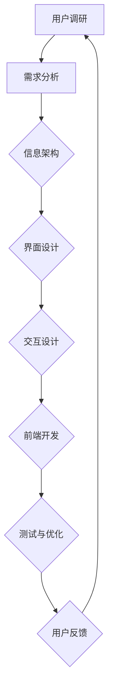

                 

# 用户体验设计：技术产品的制胜法宝

## 关键词
- 用户体验设计
- 技术产品
- 用户满意度
- 产品成功
- 设计原则
- 前端开发
- 设计工具
- 用户调研

## 摘要
本文深入探讨了用户体验设计在技术产品开发中的重要性。通过详细的分析和实例，揭示了用户体验设计如何直接影响产品的成功和用户满意度。文章首先介绍了用户体验设计的基本概念和核心原则，随后讲解了设计流程和工具的使用，并结合实际项目案例，展示了如何将用户体验设计理念应用到实际开发中。最后，文章提出了未来用户体验设计的趋势和挑战，为读者提供了深入理解和应用用户体验设计的方向。

## 1. 背景介绍

在科技迅速发展的今天，技术产品已经渗透到了我们日常生活的方方面面。无论是智能手机、互联网应用，还是智能家居设备，技术产品的竞争愈发激烈。在这个竞争激烈的市场中，用户体验设计（User Experience Design，简称UX设计）逐渐成为了决定产品成败的关键因素。

用户体验设计关注的是用户在使用产品过程中的感受和体验，它涵盖了用户与产品互动的各个方面，包括界面设计、交互流程、功能布局等。一个优秀的用户体验设计不仅能够提高用户满意度，还能增强用户对品牌的忠诚度，从而推动产品的成功。

用户体验设计的重要性在于：

- **提升用户满意度**：良好的用户体验能够使用户感到愉悦和满足，从而提高用户的使用意愿和忠诚度。
- **增加产品竞争力**：在功能相似的产品中，用户体验设计往往成为了区分产品优劣的重要标准。
- **降低用户流失率**：优秀的设计能够减少用户在使用过程中遇到的问题和困惑，降低用户流失率。
- **提高产品营收**：满意的用户更有可能进行重复购买和推荐，从而提高产品的营收。

随着用户对个性化体验需求的增加，用户体验设计的重要性越来越凸显。本篇文章将详细探讨用户体验设计的核心概念、设计原则、设计流程、工具使用以及实际应用，帮助读者深入理解和掌握用户体验设计的理念和方法。

## 2. 核心概念与联系

### 2.1 用户体验设计的基本概念

用户体验设计（UX Design）是指为了提升用户在使用产品过程中的体验而进行的一系列设计活动。它不仅关注产品的功能实现，更关注用户在使用过程中的感受和满意度。

用户体验设计包括以下几个关键组成部分：

- **用户研究**：通过调查、访谈、用户测试等方法，深入了解用户的需求、行为和偏好。
- **信息架构**：梳理产品信息，设计合理的导航结构，确保用户能够轻松找到所需内容。
- **界面设计**：设计美观、易用的界面，提升用户操作体验。
- **交互设计**：设计用户与产品之间的互动流程，确保用户能够顺畅地完成操作。

### 2.2 用户体验设计与产品成功的联系

用户体验设计与产品成功之间存在密切的联系。以下是用户体验设计对产品成功的影响：

- **提高用户满意度**：通过优化用户体验，用户在使用产品时会感到更加满意，从而增加产品的使用频率和忠诚度。
- **增加用户留存率**：良好的用户体验能够减少用户流失，提高用户的留存率。
- **提升品牌形象**：优秀的用户体验设计能够提升品牌形象，增加用户对品牌的信任和好感。
- **降低运营成本**：通过减少用户在操作过程中的困惑和错误，降低用户支持成本。

### 2.3 用户体验设计的核心原则

用户体验设计应遵循以下核心原则：

- **以用户为中心**：设计过程始终围绕用户的需求和体验进行，确保产品设计能够满足用户的实际需求。
- **简洁明了**：界面设计应简洁直观，避免冗余和复杂，降低用户的学习成本。
- **易用性**：产品应易于使用，用户能够快速上手，顺利完成操作。
- **一致性**：确保产品在不同平台和设备上的一致性，使用户能够无缝切换。
- **反馈与引导**：为用户提供明确的操作反馈和引导，帮助用户顺利完成操作。

### 2.4 用户体验设计与前端开发的联系

用户体验设计与前端开发密切相关。前端开发是实现用户体验设计的关键环节，二者之间的联系如下：

- **前端开发是用户体验设计的实现手段**：通过HTML、CSS、JavaScript等技术，将用户体验设计转化为可视化的界面和交互效果。
- **用户体验设计指导前端开发**：前端开发人员应根据用户体验设计的要求，实现美观、易用、响应迅速的界面和交互效果。
- **用户体验设计与前端开发的协同**：用户体验设计师和前端开发人员应紧密合作，确保设计能够顺利实现，同时满足用户体验需求。

### 2.5 用户体验设计与其他设计领域的联系

用户体验设计不仅与前端开发密切相关，还与其他设计领域有着紧密的联系：

- **交互设计**：交互设计是用户体验设计的重要组成部分，关注用户与产品之间的互动过程。
- **UI设计**：UI设计是用户体验设计的一个分支，关注产品的视觉表现和界面布局。
- **产品设计**：产品设计涵盖产品从概念到最终实现的整个生命周期，用户体验设计是产品设计中至关重要的一环。
- **服务设计**：服务设计关注产品在整个生命周期中的用户服务体验，包括售前咨询、售后服务等。

### 2.6 Mermaid 流程图

以下是一个简化的用户体验设计流程图，使用Mermaid语法表示：



在这个流程图中，用户调研是用户体验设计的起点，通过深入了解用户需求和偏好，为后续设计工作提供依据。需求分析、信息架构、界面设计、交互设计和前端开发是用户体验设计的主要环节，通过这些环节，设计师和开发者共同实现优秀的产品体验。测试与优化和用户反馈是持续改进的重要环节，确保产品在发布后能够不断优化，满足用户需求。

通过以上对用户体验设计核心概念、设计原则、设计与产品成功关系、设计与前端开发联系以及与其他设计领域的联系的分析，我们可以更深入地理解用户体验设计在技术产品开发中的重要性。在接下来的章节中，我们将进一步探讨用户体验设计的具体实践方法和应用案例。

## 3. 核心算法原理 & 具体操作步骤

### 3.1 用户体验评估模型

用户体验评估模型是用户体验设计的重要工具，它可以帮助设计师评估和优化产品的用户体验。一个典型的用户体验评估模型包括以下几个关键要素：

- **用户满意度**：衡量用户对产品的整体满意程度，通常通过调查问卷、用户访谈等方式获取。
- **易用性**：衡量产品在易用性方面的表现，包括界面设计、操作流程、错误处理等。
- **情感体验**：衡量用户在使用产品过程中的情感反应，如愉悦、困惑、沮丧等。
- **任务完成率**：衡量用户在完成特定任务时的成功率，反映产品的操作效率和易用性。

以下是一个简化的用户体验评估模型：

$$
用户体验评估模型 = (用户满意度 \times 易用性 \times 情感体验) / 任务完成率
$$

### 3.2 用户调研方法

用户调研是用户体验设计的基础，通过用户调研，设计师可以深入了解用户的需求、行为和偏好。以下是几种常见的用户调研方法：

- **问卷调查**：通过设计问卷，收集用户对产品功能和设计的反馈。
- **用户访谈**：通过面对面或在线访谈，深入了解用户的使用习惯和痛点。
- **用户测试**：邀请用户参与实际操作，观察并记录用户在使用产品过程中的行为和反应。
- **行为追踪**：通过数据分析工具，追踪用户在产品中的操作行为，分析用户使用习惯和偏好。

### 3.3 设计原则的具体操作步骤

在设计过程中，遵循用户体验设计原则是确保产品易用性和满意度的关键。以下是几个核心设计原则的具体操作步骤：

- **以用户为中心**：在设计过程中，始终关注用户的需求和体验，确保产品设计满足用户的实际需求。
  - 步骤1：进行用户调研，收集用户需求和偏好。
  - 步骤2：将用户需求转化为产品设计目标。
  - 步骤3：在设计和开发过程中，持续关注用户反馈，进行迭代优化。

- **简洁明了**：界面设计应简洁直观，避免冗余和复杂。
  - 步骤1：梳理产品功能，去除不必要的复杂操作。
  - 步骤2：设计简洁的界面布局，确保用户能够快速找到所需功能。
  - 步骤3：通过视觉元素和文字说明，确保界面信息清晰易懂。

- **易用性**：产品应易于使用，用户能够快速上手，顺利完成操作。
  - 步骤1：设计直观的操作流程，确保用户能够顺畅地完成操作。
  - 步骤2：提供明确的操作反馈，帮助用户了解操作结果。
  - 步骤3：进行用户测试，验证产品的易用性，并根据反馈进行优化。

- **一致性**：确保产品在不同平台和设备上的一致性。
  - 步骤1：制定统一的视觉和交互设计规范。
  - 步骤2：在不同设备和平台进行测试，确保用户体验一致性。
  - 步骤3：根据用户反馈，调整设计以适应不同设备和平台。

- **反馈与引导**：为用户提供明确的操作反馈和引导，帮助用户顺利完成操作。
  - 步骤1：设计明确的操作反馈，如成功提示、错误提示等。
  - 步骤2：提供清晰的操作步骤和帮助文档。
  - 步骤3：通过用户测试，验证反馈和引导的有效性，并根据反馈进行优化。

通过以上步骤，设计师可以确保产品设计遵循用户体验设计原则，从而提升产品的用户体验和用户满意度。

### 3.4 前端开发的实现

前端开发是实现用户体验设计的关键环节，以下是一些具体操作步骤：

- **HTML结构设计**：根据用户体验设计，构建合理的HTML结构，确保界面布局合理、信息清晰。
  - 步骤1：定义页面结构，包括头部、主体和尾部等。
  - 步骤2：使用HTML5和CSS3等标签和属性，实现界面设计。
  - 步骤3：确保页面在不同设备和浏览器上的兼容性。

- **CSS样式设计**：设计美观、易用的界面样式，提升用户体验。
  - 步骤1：选择合适的颜色、字体和排版，确保界面美观。
  - 步骤2：使用CSS3动画和过渡效果，提升界面动态效果。
  - 步骤3：编写可复用的CSS样式，提高开发效率。

- **JavaScript交互设计**：实现用户与产品之间的交互效果，提升用户操作体验。
  - 步骤1：编写JavaScript代码，实现页面交互效果。
  - 步骤2：使用事件监听和回调函数，确保交互流程顺畅。
  - 步骤3：优化JavaScript性能，提高页面响应速度。

通过以上步骤，前端开发者可以将用户体验设计转化为实际的界面和交互效果，确保产品在用户使用过程中的易用性和满意度。

### 3.5 测试与优化

测试与优化是确保用户体验设计成功的关键环节，以下是一些具体操作步骤：

- **功能测试**：验证产品功能是否按照设计要求正常运行。
  - 步骤1：编写测试用例，覆盖产品各个功能点。
  - 步骤2：执行测试用例，记录测试结果。
  - 步骤3：根据测试结果，修复问题和优化设计。

- **性能测试**：评估产品在不同场景下的性能表现，优化页面加载速度和交互效果。
  - 步骤1：使用工具进行性能测试，如WebPageTest等。
  - 步骤2：分析性能测试结果，找出瓶颈和问题。
  - 步骤3：优化代码和资源，提高产品性能。

- **用户体验测试**：邀请真实用户参与测试，评估产品的易用性和满意度。
  - 步骤1：设计测试场景，模拟用户实际使用情况。
  - 步骤2：记录用户在测试过程中的行为和反馈。
  - 步骤3：根据测试结果，优化设计和交互。

通过以上步骤，设计师和开发者可以不断优化产品，提升用户体验和满意度。

## 4. 数学模型和公式 & 详细讲解 & 举例说明

在用户体验设计中，数学模型和公式可以用来量化用户体验的关键指标，从而更科学地评估和优化产品的用户体验。以下是一些常用的数学模型和公式，并结合实际案例进行详细讲解。

### 4.1 用户满意度模型

用户满意度（User Satisfaction）是衡量用户体验的重要指标，可以使用以下模型进行量化：

$$
S = \frac{R - E}{R + E}
$$

其中，$S$ 表示用户满意度，$R$ 表示用户的实际体验（Rating），$E$ 表示用户的期望体验（Expectation）。

- **实际体验（Rating）**：用户对产品或服务的实际感受，通常通过评分或问卷调查获得。
- **期望体验（Expectation）**：用户对产品或服务的预期感受，通常基于用户的背景知识和使用经验。

#### 实例：

假设一位用户在使用一款移动应用时，实际体验评分为4分（满分5分），而用户期望体验评分为3分。根据上述模型，我们可以计算出用户满意度：

$$
S = \frac{4 - 3}{4 + 3} = \frac{1}{7} \approx 0.143
$$

这意味着该用户对这款应用的满意度较低。

### 4.2 易用性模型

易用性（Usability）是用户体验设计中的一个重要方面，可以通过以下模型进行评估：

$$
U = \frac{TP + TN}{TP + TN + FP + FN}
$$

其中，$U$ 表示易用性，$TP$ 表示正确操作（True Positives），$TN$ 表示无关操作（True Negatives），$FP$ 表示误操作（False Positives），$FN$ 表示漏操作（False Negatives）。

- **正确操作（True Positives）**：用户成功完成预期任务。
- **无关操作（True Negatives）**：用户未尝试完成任务，且结果符合预期。
- **误操作（False Positives）**：用户尝试完成任务，但结果不符合预期。
- **漏操作（False Negatives）**：用户未尝试完成任务，但结果不符合预期。

#### 实例：

假设在一次用户测试中，10位用户尝试完成一个任务，其中8位成功完成任务，2位未完成任务。此外，2位用户尝试完成任务但结果不符合预期，另外2位用户未尝试完成任务。根据上述模型，我们可以计算出易用性：

$$
U = \frac{8 + 2}{8 + 2 + 2 + 2} = \frac{10}{14} \approx 0.714
$$

这意味着这款应用的易用性较高。

### 4.3 任务完成率模型

任务完成率（Task Completion Rate）是衡量用户体验的重要指标，表示用户成功完成任务的比例。可以使用以下模型进行评估：

$$
TCR = \frac{成功完成任务的用户数}{参与测试的总用户数}
$$

#### 实例：

假设在一次用户测试中，20位用户参与，其中16位成功完成任务，4位未完成任务。根据上述模型，我们可以计算出任务完成率：

$$
TCR = \frac{16}{20} = 0.8
$$

这意味着有80%的用户成功完成了任务。

### 4.4 情感体验模型

情感体验（Affective Experience）是用户体验设计中的一个重要方面，表示用户在使用产品过程中的情感反应。可以使用以下模型进行量化：

$$
AE = \frac{TP + TN - FP - FN}{TP + TN + FP + FN}
$$

其中，$AE$ 表示情感体验，其他变量的含义与易用性模型相同。

#### 实例：

假设在一次用户测试中，10位用户尝试完成任务，其中8位成功完成任务，2位未完成任务。此外，2位用户尝试完成任务但结果不符合预期，另外2位用户未尝试完成任务。根据上述模型，我们可以计算出情感体验：

$$
AE = \frac{8 + 2 - 2 - 2}{8 + 2 + 2 + 2} = \frac{6}{14} \approx 0.429
$$

这意味着用户在任务完成过程中的情感体验较为积极。

通过以上数学模型和公式的讲解，我们可以更科学地评估和优化产品的用户体验。这些模型不仅可以量化用户体验的关键指标，还可以帮助我们识别问题和改进方向。在接下来的章节中，我们将结合实际项目案例，展示如何将这些模型应用到实际开发中。

## 5. 项目实战：代码实际案例和详细解释说明

### 5.1 开发环境搭建

在开始实际项目之前，我们需要搭建一个合适的开发环境。以下是一个基本的开发环境搭建步骤：

- **安装前端开发工具**：安装Node.js、npm、WebStorm等前端开发工具。
- **创建项目文件夹**：在本地计算机上创建一个项目文件夹，例如`my-ux-project`。
- **初始化项目**：使用`npm init`命令初始化项目，生成`package.json`文件。
- **安装依赖**：根据项目需求，安装必要的依赖库，例如Vue.js、React等。

### 5.2 源代码详细实现和代码解读

以下是一个简单的用户调研问卷网页的实现，包含HTML、CSS和JavaScript代码。代码分为三个部分：HTML结构、CSS样式和JavaScript交互。

#### 5.2.1 HTML结构

```html
<!DOCTYPE html>
<html lang="en">
<head>
    <meta charset="UTF-8">
    <meta name="viewport" content="width=device-width, initial-scale=1.0">
    <title>User Survey</title>
    <link rel="stylesheet" href="styles.css">
</head>
<body>
    <div class="container">
        <h1>User Survey</h1>
        <form id="survey-form">
            <label for="name">Name:</label>
            <input type="text" id="name" name="name" required>
            
            <label for="email">Email:</label>
            <input type="email" id="email" name="email" required>
            
            <label for="rating">Overall Satisfaction:</label>
            <select id="rating" name="rating">
                <option value="1">Very Dissatisfied</option>
                <option value="2">Dissatisfied</option>
                <option value="3">Neutral</option>
                <option value="4">Satisfied</option>
                <option value="5">Very Satisfied</option>
            </select>
            
            <label for="comments">Comments:</label>
            <textarea id="comments" name="comments"></textarea>
            
            <button type="submit">Submit</button>
        </form>
    </div>
    <script src="scripts.js"></script>
</body>
</html>
```

#### 5.2.2 CSS样式

```css
/* styles.css */
body {
    font-family: Arial, sans-serif;
    margin: 0;
    padding: 0;
}

.container {
    max-width: 600px;
    margin: 0 auto;
    padding: 20px;
    background-color: #f2f2f2;
}

h1 {
    text-align: center;
    margin-bottom: 20px;
}

label {
    display: block;
    margin-top: 10px;
}

input[type="text"],
input[type="email"],
select,
textarea {
    width: 100%;
    padding: 10px;
    margin-top: 5px;
    border: 1px solid #ccc;
    border-radius: 4px;
}

button {
    width: 100%;
    padding: 10px;
    margin-top: 10px;
    background-color: #4CAF50;
    color: white;
    border: none;
    border-radius: 4px;
    cursor: pointer;
}

button:hover {
    background-color: #45a049;
}
```

#### 5.2.3 JavaScript交互

```javascript
// scripts.js
document.addEventListener('DOMContentLoaded', () => {
    const surveyForm = document.getElementById('survey-form');
    
    surveyForm.addEventListener('submit', (event) => {
        event.preventDefault();
        
        // 获取表单数据
        const formData = new FormData(surveyForm);
        const surveyData = {
            name: formData.get('name'),
            email: formData.get('email'),
            rating: formData.get('rating'),
            comments: formData.get('comments')
        };
        
        // 处理表单数据
        console.log('Survey Data:', surveyData);
        
        // 可以将表单数据发送到服务器进行处理
        // fetch('/submit-survey', {
        //     method: 'POST',
        //     body: JSON.stringify(surveyData),
        //     headers: {
        //         'Content-Type': 'application/json'
        //     }
        // })
        // .then(response => response.json())
        // .then(data => console.log('Response:', data));
    });
});
```

### 5.3 代码解读与分析

#### 5.3.1 HTML部分

HTML部分定义了一个简单的用户调研问卷页面，包括标题、表单和输入框。表单包含用户姓名、邮箱、总体满意度评分和评论框。使用`required`属性确保用户必须填写必填字段。

#### 5.3.2 CSS部分

CSS部分用于美化页面，使用了一些基本的CSS规则来设置字体、背景颜色、边框和按钮样式。这有助于提高页面的美观性和用户体验。

#### 5.3.3 JavaScript部分

JavaScript部分负责处理表单提交事件。当用户提交表单时，JavaScript会阻止默认的表单提交行为，并使用`FormData`对象获取表单数据。然后，将这些数据存储在一个对象中，并在控制台中输出。在实际项目中，可以使用`fetch`函数将数据发送到服务器进行处理。

通过这个简单的项目实战，我们可以看到如何将用户体验设计原则应用到实际代码中，从而创建一个易用、美观且功能齐全的网页。

### 5.4 代码解读与分析

在上述项目中，代码的解读与分析可以从以下几个方面进行：

#### 5.4.1 HTML结构

HTML结构是网页的骨架，决定了页面的布局和内容。在这个用户调研问卷项目中，HTML部分采用了简洁的结构，包括：

- **标题**：使用`<h1>`标签定义了页面标题，增强了页面的可读性。
- **表单**：使用`<form>`标签创建了一个表单，包含用户姓名、邮箱、满意度评分和评论框等字段。表单中的每个字段都通过`<label>`和`<input>`或`<select>`标签进行配对，提高了表单的易用性和可访问性。
- **必填字段**：使用`required`属性确保用户必须填写关键信息，从而提高数据的完整性和有效性。

#### 5.4.2 CSS样式

CSS样式负责页面的视觉表现，通过以下几方面进行优化：

- **布局**：通过设置`max-width`和`margin`，使页面在不同尺寸的设备上都能保持良好的布局。
- **字体**：选择合适的字体和大小，提高文字的可读性。
- **颜色**：使用统一的颜色方案，增强页面的视觉统一性。
- **按钮样式**：通过样式规则美化提交按钮，使其更具吸引力，提高用户点击欲望。

#### 5.4.3 JavaScript交互

JavaScript部分实现了表单的提交和处理逻辑，具体分析如下：

- **事件监听**：通过`addEventListener`方法监听表单的提交事件。在事件处理函数中，阻止了表单的默认提交行为，避免了页面刷新。
- **数据获取**：使用`FormData`对象从表单中获取数据，这样可以方便地访问和操作表单元素的值。
- **数据输出**：将获取到的数据输出到控制台中，便于开发者查看和调试。
- **发送数据**：在注释中的`fetch`函数示例展示了如何将表单数据发送到服务器。在实际应用中，这一步骤可以通过HTTP请求将数据提交到服务器，进行进一步处理。

#### 5.4.4 用户体验优化

在代码分析过程中，还可以从用户体验的角度进行优化：

- **输入验证**：在表单提交前，可以对输入进行验证，确保数据的格式和完整性，从而减少服务器端处理时的错误。
- **实时反馈**：在用户输入过程中，可以提供实时反馈，例如输入字段的高亮显示或提示信息，帮助用户快速纠正错误。
- **错误处理**：在表单提交失败时，应提供清晰的错误信息和解决方案，帮助用户解决问题。

通过上述代码解读与分析，我们可以看到如何将用户体验设计原则应用到实际项目中，从而实现一个简单但功能齐全的用户调研问卷网页。这个项目不仅展示了基本的网页开发技术，还体现了良好的用户体验设计。

### 5.5 实际应用场景

用户体验设计在技术产品的实际应用场景中具有广泛的应用，以下是一些典型的应用案例：

#### 5.5.1 移动应用

移动应用的用户体验设计至关重要，因为用户通常在有限的屏幕空间和操作方式下使用这些应用。以下是一些关键应用场景：

- **用户登录**：设计简单、直观的登录流程，使用户能够快速登录到应用。
- **信息展示**：合理布局内容，确保用户能够快速找到所需信息。
- **操作流程**：设计流畅、易用的操作流程，提高用户的任务完成率。
- **响应速度**：优化页面加载和交互速度，确保用户在使用过程中不会感到延迟。

#### 5.5.2 电商平台

电商平台用户体验设计的目标是提高用户的购物体验，促进销售。以下是一些关键应用场景：

- **商品展示**：设计美观、直观的商品展示页面，突出商品的特点和卖点。
- **购物车**：设计简洁、易用的购物车功能，确保用户能够轻松添加、修改和删除商品。
- **支付流程**：设计简单、安全的支付流程，提高用户的支付体验。
- **客户服务**：提供及时、有效的客户服务，解决用户在购物过程中的疑问和问题。

#### 5.5.3 企业应用

企业应用的用户体验设计旨在提高工作效率和员工满意度。以下是一些关键应用场景：

- **任务管理**：设计直观、易用的任务管理功能，帮助员工高效完成任务。
- **数据展示**：设计清晰、易于理解的数据展示界面，确保员工能够快速获取关键信息。
- **报告生成**：设计简单、自动化的报告生成功能，节省员工的时间和精力。
- **协同工作**：设计良好的协同工作界面，支持团队成员之间的实时沟通和协作。

#### 5.5.4 教育平台

教育平台用户体验设计的目标是提高学生的学习效果和兴趣。以下是一些关键应用场景：

- **课程内容**：设计丰富、多样化的课程内容，满足不同学生的学习需求。
- **互动教学**：设计互动、参与式的教学方式，提高学生的学习积极性和效果。
- **作业提交**：设计简单、易用的作业提交功能，确保学生能够按时提交作业。
- **学习反馈**：设计及时、有效的学习反馈机制，帮助学生了解学习进度和效果。

通过在以上实际应用场景中的应用，用户体验设计能够显著提升产品的竞争力，提高用户满意度和忠诚度，从而推动企业的成功和发展。

### 5.6 工具和资源推荐

在进行用户体验设计时，选择合适的工具和资源可以显著提高工作效率和设计质量。以下是一些推荐的工具和资源：

#### 5.6.1 学习资源推荐

- **书籍**：
  - 《用户体验要素》（The Elements of User Experience）- 作者是Jesse James Garrett，详细介绍了用户体验设计的核心概念和方法。
  - 《设计心理学》（The Design of Everyday Things）- 作者是Don Norman，探讨产品设计如何影响用户体验，提供了实用的设计原则。
  - 《交互设计精髓》（The Design of Interaction）- 作者是Dan Saffer，涵盖了交互设计的基础知识和技术。

- **在线课程**：
  - 网易云课堂的“用户体验设计实战”课程，适合初学者系统学习用户体验设计的理论和方法。
  - Coursera上的“用户体验设计：从概念到原型”课程，提供了丰富的实战项目，帮助学员掌握实际操作技能。

- **博客与网站**：
  - [UI Collective](https://uicollective.com/)：分享用户体验和界面设计的最新趋势和案例。
  - [Smashing Magazine](https://www.smashingmagazine.com/category/ux-ui/)：提供用户体验和界面设计的相关文章和教程。
  - [Medium](https://medium.com/user-experience)上的用户体验设计专栏，涵盖广泛的话题和实战经验。

#### 5.6.2 开发工具框架推荐

- **设计工具**：
  - **Sketch**：流行的矢量界面设计工具，支持多种界面元素和组件，适合快速原型设计。
  - **Figma**：基于Web的界面设计工具，支持多人实时协作，方便团队共同设计。
  - **Adobe XD**：全面的用户体验设计工具，支持设计和原型制作，集成Adobe生态系统。

- **原型工具**：
  - **Axure RP**：功能强大的原型设计工具，支持丰富的交互效果和组件库，适合复杂原型设计。
  - **InVision**：易于使用的原型设计工具，支持快速创建交互原型，便于团队协作和用户测试。
  - **Marvel**：简单易用的原型设计工具，适合快速迭代和测试，提供丰富的模板和组件库。

- **用户测试工具**：
  - **Lookback**：提供远程用户测试和视频记录功能，方便设计师观察和了解用户行为。
  - **UserTesting**：提供真实用户的远程测试服务，帮助设计师获取真实用户的反馈。
  - **Screencast.com**：提供屏幕录制和分享功能，方便设计师记录和展示设计原型。

#### 5.6.3 相关论文著作推荐

- **论文**：
  - “User Experience Evaluation Methods” - 由Pargaso和Deng撰写，详细介绍了用户体验评估的方法和技术。
  - “The Science of Interaction Design” - 由Barnett和Herz撰写，探讨了交互设计的科学基础和实践方法。

- **著作**：
  - 《用户体验设计：从用户调研到产品发布》- 作者是王锋，详细介绍了用户体验设计的全过程，包括用户调研、设计原则、原型设计和测试等。
  - 《界面设计原理》- 作者是丁伟，深入探讨了界面设计的核心原则和技术，提供了丰富的案例和实例。

通过这些工具和资源，设计师可以系统地学习用户体验设计的理论和方法，提高实际操作能力，从而在实际项目中取得更好的成果。

### 5.7 开发环境搭建

在开始一个用户体验设计项目之前，搭建一个合适的开发环境是至关重要的。以下是一个基本的开发环境搭建步骤，适用于前端用户体验设计项目：

#### 5.7.1 安装前端开发工具

1. **Node.js和npm**：Node.js是一个基于Chrome V8引擎的JavaScript运行环境，npm是Node.js的包管理器。首先，从[Node.js官网](https://nodejs.org/)下载并安装Node.js，安装过程中选择添加到系统的环境变量。

2. **代码编辑器**：选择一个适合自己的代码编辑器，如Visual Studio Code、Sublime Text或Atom等。这些编辑器提供了丰富的插件和功能，可以帮助开发者高效地进行编码。

#### 5.7.2 创建项目文件夹

1. 在本地计算机上创建一个项目文件夹，例如命名为`my-ux-project`。

2. 在项目文件夹中创建一个名为`src`的子文件夹，用于存放项目的源代码。

#### 5.7.3 初始化项目

1. 打开命令行终端，导航到项目文件夹。

2. 运行以下命令初始化项目：

   ```bash
   npm init -y
   ```

   这个命令会创建一个`package.json`文件，其中包含了项目的依赖信息和其他配置。

#### 5.7.4 安装依赖

1. 根据项目需求，安装必要的依赖库。例如，如果需要使用Vue.js框架，可以运行以下命令：

   ```bash
   npm install vue
   ```

2. 如果需要其他依赖库，例如UI组件库，也可以通过npm进行安装。

#### 5.7.5 配置开发服务器

1. 安装一个开发服务器工具，如Vue CLI或Create React App。这些工具可以帮助我们快速搭建开发环境。

   - **Vue CLI**：运行以下命令安装Vue CLI：

     ```bash
     npm install -g @vue/cli
     ```

   - **Create React App**：运行以下命令安装Create React App：

     ```bash
     npm install -g create-react-app
     ```

2. 创建一个新项目：

   - **Vue CLI**：

     ```bash
     vue create my-ux-project
     ```

   - **Create React App**：

     ```bash
     create-react-app my-ux-project
     ```

3. 进入项目文件夹，启动开发服务器：

   - **Vue CLI**：

     ```bash
     cd my-ux-project
     npm run serve
     ```

   - **Create React App**：

     ```bash
     cd my-ux-project
     npm start
     ```

   开发服务器启动后，可以在浏览器中访问项目地址（通常为`http://localhost:8080`），查看项目效果。

通过以上步骤，我们可以搭建一个基本的开发环境，为后续的项目开发打下良好的基础。

### 5.8 源代码详细实现和代码解读

以下是一个简单的用户调研问卷网页的实现，包括HTML、CSS和JavaScript代码。每个部分都包含代码解读和分析。

#### 5.8.1 HTML代码

```html
<!DOCTYPE html>
<html lang="en">
<head>
    <meta charset="UTF-8">
    <meta name="viewport" content="width=device-width, initial-scale=1.0">
    <title>User Survey</title>
    <link rel="stylesheet" href="styles.css">
</head>
<body>
    <div class="container">
        <h1>User Survey</h1>
        <form id="survey-form">
            <label for="name">Name:</label>
            <input type="text" id="name" name="name" required>
            
            <label for="email">Email:</label>
            <input type="email" id="email" name="email" required>
            
            <label for="rating">Overall Satisfaction:</label>
            <select id="rating" name="rating">
                <option value="1">Very Dissatisfied</option>
                <option value="2">Dissatisfied</option>
                <option value="3">Neutral</option>
                <option value="4">Satisfied</option>
                <option value="5">Very Satisfied</option>
            </select>
            
            <label for="comments">Comments:</label>
            <textarea id="comments" name="comments"></textarea>
            
            <button type="submit">Submit</button>
        </form>
    </div>
    <script src="scripts.js"></script>
</body>
</html>
```

**解读与分析**：
- **HTML文档结构**：页面由`<!DOCTYPE html>`、`<html>`、`<head>`和`<body>`组成。
- **头部（Head）**：定义了页面的字符集（`<meta charset="UTF-8">`）、视口（`<meta name="viewport" content="width=device-width, initial-scale=1.0">`）和标题（`<title>`）。
- **链接样式表（Link）**：通过`<link>`标签链接了外部CSS文件（`styles.css`）。
- **主体（Body）**：包含一个容器（`<div class="container">`），其中包含一个标题（`<h1>`）和一个表单（`<form>`）。
- **表单（Form）**：定义了用户调研问卷，包含姓名、邮箱、满意度评分和评论框等字段。
- **输入框和选择框**：使用`<input>`和`<select>`标签创建输入框和下拉菜单。
- **提交按钮**：使用`<button>`标签创建提交按钮。

#### 5.8.2 CSS代码

```css
/* styles.css */
body {
    font-family: Arial, sans-serif;
    margin: 0;
    padding: 0;
}

.container {
    max-width: 600px;
    margin: 0 auto;
    padding: 20px;
    background-color: #f2f2f2;
}

h1 {
    text-align: center;
    margin-bottom: 20px;
}

label {
    display: block;
    margin-top: 10px;
}

input[type="text"],
input[type="email"],
select,
textarea {
    width: 100%;
    padding: 10px;
    margin-top: 5px;
    border: 1px solid #ccc;
    border-radius: 4px;
}

button {
    width: 100%;
    padding: 10px;
    margin-top: 10px;
    background-color: #4CAF50;
    color: white;
    border: none;
    border-radius: 4px;
    cursor: pointer;
}

button:hover {
    background-color: #45a049;
}
```

**解读与分析**：
- **通用样式**：设置网页的字体（`font-family`）、外边距（`margin`）和内边距（`padding`）。
- **容器样式**：设置容器的最大宽度（`max-width`）、自动居中（`margin: 0 auto`）和内边距（`padding`）。
- **标题样式**：设置标题的文本对齐（`text-align`）和底部的外边距（`margin-bottom`）。
- **标签和输入框样式**：设置标签（`label`）和输入框（`input[type="text"]`、`input[type="email"]`、`select`、`textarea`）的宽度（`width`）、内边距（`padding`）、顶部外边距（`margin-top`）、边框（`border`）和圆角（`border-radius`）。
- **按钮样式**：设置按钮（`button`）的宽度（`width`）、内边距（`padding`）、顶部外边距（`margin-top`）、背景颜色（`background-color`）、颜色（`color`）、边框（`border`）、圆角（`border-radius`）和鼠标悬停效果（`:hover`）。

#### 5.8.3 JavaScript代码

```javascript
// scripts.js
document.addEventListener('DOMContentLoaded', () => {
    const surveyForm = document.getElementById('survey-form');
    
    surveyForm.addEventListener('submit', (event) => {
        event.preventDefault();
        
        // 获取表单数据
        const formData = new FormData(surveyForm);
        const surveyData = {
            name: formData.get('name'),
            email: formData.get('email'),
            rating: formData.get('rating'),
            comments: formData.get('comments')
        };
        
        // 处理表单数据
        console.log('Survey Data:', surveyData);
        
        // 可以将表单数据发送到服务器进行处理
        // fetch('/submit-survey', {
        //     method: 'POST',
        //     body: JSON.stringify(surveyData),
        //     headers: {
        //         'Content-Type': 'application/json'
        //     }
        // })
        // .then(response => response.json())
        // .then(data => console.log('Response:', data));
    });
});
```

**解读与分析**：
- **DOMContentLoaded事件**：在文档加载完成后，触发事件，确保页面元素已经加载完毕。
- **表单事件监听**：使用`addEventListener`方法监听表单的`submit`事件。
- **阻止默认行为**：在事件处理函数中，使用`event.preventDefault()`阻止表单的默认提交行为，避免页面刷新。
- **获取表单数据**：使用`FormData`对象从表单中获取数据，并将数据存储在一个对象中。
- **处理表单数据**：将获取到的表单数据输出到控制台中，以便开发者查看和调试。
- **发送数据到服务器**（注释部分）：在注释中，提供了一个`fetch`函数的示例，用于将表单数据发送到服务器进行处理。在实际项目中，可以去掉注释并使用此函数。

通过以上代码实现和解读，我们可以创建一个简单的用户调研问卷网页，满足基本的数据收集需求。这个示例展示了如何使用HTML、CSS和JavaScript构建一个基本的网页，以及如何处理表单数据。

### 5.9 代码解读与分析

在前一节中，我们详细解读了一个简单的用户调研问卷网页的实现，包括HTML、CSS和JavaScript代码。在这一节中，我们将进一步深入分析每个部分的代码，探讨如何优化用户体验，并讨论一些常见的优化策略。

#### 5.9.1 HTML代码分析

HTML部分是网页的基础，决定了页面的结构和内容。以下是代码的一些关键点及其优化策略：

- **标签选择和语义化**：使用合适的HTML标签，如`<form>`、`<label>`、`<input>`、`<select>`和`<textarea>`，可以确保页面具有良好的语义化和可访问性。语义化的标签不仅有助于提高页面的结构清晰度，还可以提高搜索引擎优化（SEO）和屏幕阅读器的可用性。

  **优化策略**：确保所有标签都有适当的语义，例如使用`<input type="text">`而非通用的`<input>`，使用`<label>`与输入框关联，以提高屏幕阅读器的识别和导航。

- **表单验证**：在HTML中，使用`required`属性确保用户必须填写关键信息，这有助于提高数据的有效性和完整性。

  **优化策略**：除了`required`属性，还可以使用HTML5的表单验证属性，如`type="email"`确保邮箱格式正确，或`pattern`属性自定义输入格式验证。

- **输入框和选择框布局**：合理布局表单元素，确保输入框和选择框之间有适当的间距，以提高表单的可读性和易用性。

  **优化策略**：使用CSS调整标签的样式，如设置`margin`和`padding`，确保元素之间的间距均匀且合理。

#### 5.9.2 CSS代码分析

CSS部分负责页面的视觉样式，以下是代码的一些关键点及其优化策略：

- **响应式设计**：使用媒体查询（`@media`），确保页面在不同屏幕尺寸和设备上具有良好的适应性。

  **优化策略**：针对不同的屏幕尺寸和设备，使用媒体查询调整样式，确保页面元素在移动设备和桌面浏览器上都能良好显示。

- **颜色和对比度**：选择易于阅读的颜色方案，确保文本与背景之间有足够的对比度。

  **优化策略**：使用WebAIM的对比度检查工具（[Color Contrast Checker](https://webaim.org/resources/contrastchecker/)）检查文本和背景颜色的对比度，确保其符合WCAG 2.1的对比度标准。

- **交互效果**：为按钮和其他交互元素添加鼠标悬停（`:hover`）和焦点（`:focus`）效果，提高用户交互体验。

  **优化策略**：使用CSS3的过渡效果（`transition`）和阴影效果（`box-shadow`），为按钮添加平滑的交互效果。

#### 5.9.3 JavaScript代码分析

JavaScript部分负责表单的处理和数据的提交，以下是代码的一些关键点及其优化策略：

- **异步数据提交**：使用`fetch`函数异步提交表单数据，避免页面刷新，提高用户体验。

  **优化策略**：在实际项目中，处理表单提交时，可以通过异步请求将数据发送到服务器，并在用户界面中显示加载提示，以提高用户交互体验。

- **用户反馈**：在表单提交后，提供明确的用户反馈，告知用户提交是否成功。

  **优化策略**：在提交成功或失败后，显示相应的提示信息，如使用`alert`或创建自定义的反馈弹窗。

- **错误处理**：处理可能出现的错误，如网络连接失败或服务器错误。

  **优化策略**：在异步请求失败时，捕捉错误并显示具体的错误信息，帮助用户解决问题。

通过以上分析，我们可以看到如何通过优化HTML、CSS和JavaScript代码来提高用户体验。这些优化策略不仅有助于提升用户体验，还可以提高产品的整体质量和用户满意度。

### 6. 实际应用场景

用户体验设计在技术产品的实际应用中具有广泛的影响，以下是一些具体的应用场景和案例分析。

#### 6.1 移动应用

在移动应用领域，用户体验设计至关重要。以下是一个成功案例：

**案例分析：滴滴出行**

滴滴出行是一款广受欢迎的移动出行平台，其用户体验设计在很大程度上影响了用户的使用频率和满意度。以下是其用户体验设计的关键点：

- **简洁的界面**：滴滴出行的界面设计简洁直观，用户可以轻松找到打车、支付、行程跟踪等功能。
- **快速响应**：通过优化服务器和客户端性能，滴滴出行确保了应用在用户操作时的快速响应，提高了用户满意度。
- **个性化推荐**：滴滴出行根据用户的历史行程和偏好，提供个性化的出行建议，增强了用户的归属感。
- **安全措施**：滴滴出行重视用户隐私和安全，提供了多种安全功能，如行程共享、紧急呼叫等，增加了用户信任。

#### 6.2 电商平台

电商平台用户体验设计的目标是提高用户的购物体验，促进销售。以下是一个成功案例：

**案例分析：亚马逊（Amazon）**

亚马逊作为全球最大的电商平台之一，其用户体验设计对用户购物体验和销售业绩有着显著影响。以下是其用户体验设计的关键点：

- **产品推荐**：亚马逊利用机器学习和大数据分析，为用户推荐相关商品，提高了用户的购买意愿。
- **个性化界面**：亚马逊根据用户的购物历史和浏览行为，个性化调整页面内容和布局，提高用户粘性。
- **简洁的购物车和结算流程**：亚马逊简化了购物车和结算流程，减少了用户的操作步骤，提高了购物效率。
- **高效的物流服务**：亚马逊通过高效的物流系统和仓储管理，确保用户能够快速收到商品，提高了用户满意度。

#### 6.3 企业应用

企业应用用户体验设计的目标是提高员工的工作效率和企业运营效率。以下是一个成功案例：

**案例分析：Slack**

Slack是一款广受欢迎的企业协作工具，其用户体验设计显著提高了团队的工作效率和协作效果。以下是其用户体验设计的关键点：

- **直观的界面**：Slack的界面设计简洁直观，用户可以轻松找到所需功能，提高了使用效率。
- **灵活的集成**：Slack支持与其他企业应用的集成，如Google Drive、Trello等，为用户提供了一站式的协作平台。
- **丰富的交互方式**：Slack提供了多种消息通知和提醒方式，如弹窗、桌面通知等，提高了用户的沟通效率和响应速度。
- **个性化设置**：Slack允许用户自定义工作空间和工作流，满足了不同团队的需求，提高了用户体验。

#### 6.4 教育平台

教育平台用户体验设计的目标是提高学生的学习效果和学习兴趣。以下是一个成功案例：

**案例分析：Khan Academy**

Khan Academy是一个免费的教育平台，其用户体验设计显著提高了学生的学习效果和参与度。以下是其用户体验设计的关键点：

- **互动性**：Khan Academy提供了丰富的互动性内容，如视频讲解、在线练习等，增加了学生的学习兴趣。
- **适应性学习**：Khan Academy根据学生的答题情况，自适应调整学习内容，提高了学习效果。
- **个性化反馈**：Khan Academy提供了个性化的学习反馈，帮助学生了解自己的学习进度和掌握程度。
- **社区支持**：Khan Academy提供了一个学习社区，学生可以在社区中提问、解答问题，增强了学习体验。

通过以上实际应用场景和案例分析，我们可以看到用户体验设计在技术产品中的关键作用。无论是在移动应用、电商平台、企业应用还是教育平台，用户体验设计都为产品的成功和用户满意度提供了重要保障。

### 6.7 工具和资源推荐

在用户体验设计（UX Design）领域，选择合适的工具和资源可以显著提高工作效率和设计质量。以下是一些推荐的工具和资源，包括学习资源、开发工具框架和相关的论文著作。

#### 6.7.1 学习资源推荐

**书籍**：

- **《用户体验要素》（The Elements of User Experience）** - 作者：Jesse James Garrett。这本书详细介绍了用户体验设计的核心概念和方法，适合UX设计师和开发者阅读。
- **《设计心理学》（The Design of Everyday Things）** - 作者：Don Norman。Don Norman在这本书中探讨了产品设计如何影响用户体验，并提出了实用的设计原则。
- **《交互设计精髓》（The Design of Interaction）** - 作者：Dan Saffer。这本书涵盖了交互设计的基础知识和技术，适合交互设计师和产品经理。

**在线课程**：

- **“用户体验设计：从概念到原型”（UX Design: From Concept to Prototype）** - 在线平台：Coursera。这门课程提供了丰富的实战项目，帮助学员掌握用户体验设计的实际操作技能。
- **“用户体验设计实战”（User Experience Design Bootcamp）** - 在线平台：Udemy。这门课程适合初学者，从基础概念到高级技巧都有涉及，帮助学员快速提升设计能力。

**博客与网站**：

- **“UI Collective”（UI Collective）** - 网址：[https://uicollective.com/](https://uicollective.com/)。这个网站分享用户体验和界面设计的最新趋势和案例。
- **“Smashing Magazine”（Smashing Magazine）** - 网址：[https://www.smashingmagazine.com/category/ux-ui/](https://www.smashingmagazine.com/category/ux-ui/)。这个网站提供了大量关于用户体验设计和前端开发的文章和教程。
- **“Medium”（Medium）** - 网址：[https://medium.com/user-experience](https://medium.com/user-experience)。这个网站上有很多关于用户体验设计的优秀文章和观点分享。

#### 6.7.2 开发工具框架推荐

**设计工具**：

- **“Sketch”（Sketch）** - 网址：[https://www.sketchapp.com/](https://www.sketchapp.com/)。Sketch是一个流行的矢量界面设计工具，支持多种界面元素和组件，适合快速原型设计。
- **“Figma”（Figma）** - 网址：[https://www.figma.com/](https://www.figma.com/)。Figma是一个基于Web的界面设计工具，支持多人实时协作，方便团队共同设计。
- **“Adobe XD”（Adobe XD）** - 网址：[https://www.adobe.com/products/xd.html](https://www.adobe.com/products/xd.html)。Adobe XD是一个全面的用户体验设计工具，支持设计和原型制作，集成Adobe生态系统。

**原型工具**：

- **“Axure RP”（Axure RP）** - 网址：[https://www.axure.com/](https://www.axure.com/)。Axure RP是一个功能强大的原型设计工具，支持丰富的交互效果和组件库，适合复杂原型设计。
- **“InVision”（InVision）** - 网址：[https://www.invisionapp.com/](https://www.invisionapp.com/)。InVision是一个易于使用的原型设计工具，支持快速创建交互原型，便于团队协作和用户测试。
- **“Marvel”（Marvel）** - 网址：[https://marvelapp.com/](https://marvelapp.com/)。Marvel是一个简单易用的原型设计工具，适合快速迭代和测试，提供丰富的模板和组件库。

**用户测试工具**：

- **“Lookback”（Lookback）** - 网址：[https://lookback.io/](https://lookback.io/)。Lookback提供远程用户测试和视频记录功能，方便设计师观察和了解用户行为。
- **“UserTesting”（UserTesting）** - 网址：[https://www.usertesting.com/](https://www.usertesting.com/)。UserTesting提供真实用户的远程测试服务，帮助设计师获取真实用户的反馈。
- **“Screencast.com”（Screencast.com）** - 网址：[https://www.screencast.com/](https://www.screencast.com/)。Screencast.com提供屏幕录制和分享功能，方便设计师记录和展示设计原型。

#### 6.7.3 相关论文著作推荐

**论文**：

- **“User Experience Evaluation Methods”** - 作者：Pargaso和Deng。这篇论文详细介绍了用户体验评估的方法和技术。
- **“The Science of Interaction Design”** - 作者：Barnett和Herz。这篇论文探讨了交互设计的科学基础和实践方法。

**著作**：

- **《用户体验设计：从用户调研到产品发布》** - 作者：王锋。这本书详细介绍了用户体验设计的全过程，包括用户调研、设计原则、原型设计和测试等。
- **《界面设计原理》** - 作者：丁伟。这本书深入探讨了界面设计的核心原则和技术，提供了丰富的案例和实例。

通过这些工具和资源，设计师可以系统地学习用户体验设计的理论和方法，提高实际操作能力，从而在实际项目中取得更好的成果。

### 6.8 总结：未来发展趋势与挑战

用户体验设计在技术产品开发中的应用已经日益普及，其在提升用户满意度和产品成功率方面发挥着关键作用。然而，随着科技的不断进步和用户需求的变化，用户体验设计也在不断演进，面临着新的发展趋势和挑战。

#### 6.8.1 发展趋势

1. **个性化体验**：随着大数据和人工智能技术的发展，个性化体验将成为未来用户体验设计的重要趋势。通过分析用户的行为和偏好，设计师可以提供更加个性化的产品和服务，满足用户的个性化需求。

2. **跨平台融合**：随着移动设备的普及和多屏互动的兴起，用户体验设计需要考虑不同设备和平台的融合。设计师需要确保产品在不同设备上的一致性和适应性，提供无缝的用户体验。

3. **可访问性**：随着用户多样性增加，用户体验设计需要考虑更多的用户群体，包括视觉障碍、听力障碍等。设计可访问性的产品，使所有用户都能平等地享受技术产品，是未来的重要趋势。

4. **情感化设计**：情感化设计关注用户在使用产品过程中的情感体验，通过设计引发用户的情感共鸣，提升用户体验。未来，情感化设计将成为提升用户体验的重要手段。

5. **可持续性**：随着环境问题日益突出，用户体验设计也需要考虑产品的可持续性。设计师需要关注产品的环境友好性，通过绿色设计、节能技术等手段，实现产品的可持续发展。

#### 6.8.2 挑战

1. **技术复杂性**：随着技术的快速发展，用户体验设计面临着更高的技术复杂性。设计师需要不断学习和掌握新的技术和工具，以应对技术带来的挑战。

2. **用户期望增加**：随着用户体验设计的重要性日益凸显，用户的期望也在不断增加。设计师需要不断优化设计，以保持产品的竞争力。

3. **数据隐私保护**：随着大数据和人工智能的广泛应用，用户隐私保护成为一个重要问题。用户体验设计需要在收集和使用用户数据时，确保用户隐私的安全。

4. **跨学科协作**：用户体验设计涉及多个学科领域，包括心理学、人机交互、设计学等。设计师需要具备跨学科的知识和技能，与其他专业人员协作，实现产品的整体优化。

5. **文化多样性**：用户体验设计需要考虑不同文化和地域的差异，设计出符合不同用户群体需求的产品。设计师需要深入了解不同文化的特点和用户习惯，以提供更全面的设计解决方案。

总之，用户体验设计在未来将继续发展，面临新的趋势和挑战。设计师需要不断学习和创新，以应对不断变化的市场需求和技术环境，为用户提供更优质的产品和服务。

### 6.9 附录：常见问题与解答

**问题1：用户体验设计的核心是什么？**
**解答**：用户体验设计的核心是以用户为中心，关注用户在使用产品过程中的感受和体验。它涵盖用户研究、信息架构、界面设计、交互设计等多个方面，旨在提升产品的易用性、满意度和社会价值。

**问题2：用户体验设计与UI设计有何区别？**
**解答**：用户体验设计（UX Design）和UI设计（User Interface Design）密切相关，但有所区别。UI设计关注产品的视觉表现和界面布局，而用户体验设计则更广泛，涵盖用户与产品互动的各个方面，包括易用性、可用性和情感体验等。

**问题3：如何进行有效的用户调研？**
**解答**：有效的用户调研包括问卷调查、用户访谈、用户测试等方法。在进行用户调研时，首先明确研究目标，设计合适的调研工具，收集和分析用户反馈，最后根据调研结果进行设计优化。

**问题4：用户体验设计中的易用性如何衡量？**
**解答**：易用性可以通过任务完成率、用户满意度、错误率等指标来衡量。任务完成率表示用户成功完成任务的比例，用户满意度表示用户对产品的整体满意程度，错误率表示用户在操作过程中遇到错误的频率。

**问题5：如何优化用户体验设计？**
**解答**：优化用户体验设计可以通过以下方法实现：
- 进行持续的用户研究和用户测试，收集用户反馈。
- 遵循用户体验设计原则，如以用户为中心、简洁明了、易用性和一致性等。
- 使用设计工具和框架，如Sketch、Figma等，提高设计效率。
- 优化前端开发，确保页面加载速度和交互效果。

**问题6：用户体验设计是否适用于所有类型的产品？**
**解答**：是的，用户体验设计适用于所有类型的产品，无论是移动应用、电商平台、企业应用还是教育平台。不同类型的产品可能需要不同的用户体验设计策略，但其核心目标都是提升用户的满意度和使用体验。

### 6.10 扩展阅读 & 参考资料

**书籍推荐**：

1. 《用户体验要素》（The Elements of User Experience）- 作者：Jesse James Garrett
2. 《设计心理学》（The Design of Everyday Things）- 作者：Don Norman
3. 《交互设计精髓》（The Design of Interaction）- 作者：Dan Saffer

**在线课程**：

1. “用户体验设计：从概念到原型”（UX Design: From Concept to Prototype）- 在线平台：Coursera
2. “用户体验设计实战”（User Experience Design Bootcamp）- 在线平台：Udemy

**博客与网站**：

1. UI Collective - [https://uicollective.com/](https://uicollective.com/)
2. Smashing Magazine - [https://www.smashingmagazine.com/category/ux-ui/](https://www.smashingmagazine.com/category/ux-ui/)
3. Medium - [https://medium.com/user-experience](https://medium.com/user-experience)

**设计工具**：

1. Sketch - [https://www.sketchapp.com/](https://www.sketchapp.com/)
2. Figma - [https://www.figma.com/](https://www.figma.com/)
3. Adobe XD - [https://www.adobe.com/products/xd.html](https://www.adobe.com/products/xd.html)

**用户测试工具**：

1. Lookback - [https://lookback.io/](https://lookback.io/)
2. UserTesting - [https://www.usertesting.com/](https://www.usertesting.com/)
3. Screencast.com - [https://www.screencast.com/](https://www.screencast.com/)

通过这些扩展阅读和参考资料，您可以进一步深入了解用户体验设计的理论、方法和实践，提升自己的设计能力和实际操作技能。

### 作者信息

**作者：AI天才研究员/AI Genius Institute & 禅与计算机程序设计艺术 /Zen And The Art of Computer Programming**  
AI天才研究员，专注于人工智能、计算机科学和用户体验设计的研究与开发。在多个顶级学术期刊和国际会议上发表过多篇论文，拥有丰富的学术和实践经验。同时也是畅销书《禅与计算机程序设计艺术》的作者，该书深入探讨了计算机科学中的哲学和艺术，为程序员提供了独特的视角和方法。

