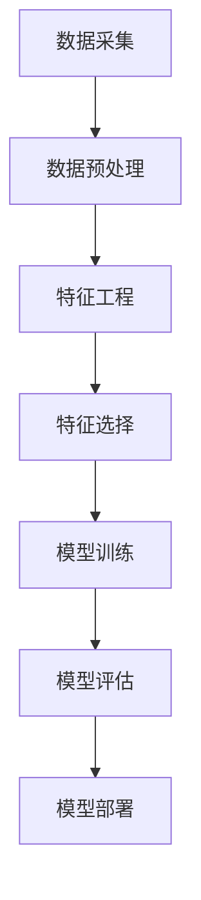

                 

# 用户画像在电商中的实际应用

> **关键词**：用户画像、电商、个性化推荐、数据分析、客户行为

> **摘要**：本文将深入探讨用户画像在电商领域的实际应用，从背景介绍、核心概念与联系、核心算法原理、数学模型和公式、项目实战、实际应用场景、工具和资源推荐以及总结与未来发展趋势等多个方面进行详细讲解。通过本文，读者将全面了解用户画像在电商中的重要性和实际应用价值。

## 1. 背景介绍

随着互联网的普及和电子商务的迅猛发展，越来越多的用户选择在线购物。然而，面对海量的商品信息，如何精准地满足用户需求，提高用户体验和转化率，成为电商企业关注的焦点。此时，用户画像应运而生，它为电商企业提供了深入了解用户行为和需求的有效工具。

用户画像是一种基于用户数据构建的数字模型，通过对用户的基本信息、行为特征、兴趣偏好等多维度数据进行采集、分析和处理，形成一个全面、立体的用户形象。这种模型有助于电商企业更好地理解用户，实现个性化推荐、精准营销和客户关系管理。

在电商领域，用户画像的应用范围广泛。一方面，用户画像可以帮助电商企业了解用户的消费习惯和偏好，从而制定更具针对性的营销策略；另一方面，用户画像还可以用于产品研发、供应链优化、风险控制等多个环节，为企业的可持续发展提供有力支持。

## 2. 核心概念与联系

### 用户画像的构建过程

用户画像的构建过程可以分为以下几个步骤：

1. **数据采集**：从各种渠道获取用户数据，如用户注册信息、浏览记录、购买行为、评价等。

2. **数据预处理**：对采集到的数据进行清洗、去重、填充等处理，确保数据质量。

3. **特征工程**：根据业务需求，从原始数据中提取出有代表性的特征，如用户年龄、性别、地域、消费金额等。

4. **特征选择**：通过统计学方法或机器学习算法，选择对用户行为预测有显著作用的特征。

5. **模型训练**：利用训练数据集，通过机器学习算法训练用户画像模型。

6. **模型评估**：使用测试数据集评估模型效果，调整模型参数。

7. **模型部署**：将训练好的模型部署到生产环境中，实时更新用户画像。

### 用户画像的核心要素

用户画像的核心要素包括：

- **基本信息**：如用户年龄、性别、职业、地域等。

- **行为特征**：如浏览记录、购买行为、评价等。

- **兴趣偏好**：如喜欢的产品类别、品牌、风格等。

- **社交属性**：如关注的人数、粉丝数、互动行为等。

- **消费能力**：如消费金额、消费频率等。

### 用户画像与电商业务的关联

用户画像与电商业务密切相关，主要体现在以下几个方面：

- **个性化推荐**：基于用户画像，为用户提供个性化推荐，提高用户满意度和转化率。

- **精准营销**：针对不同用户群体，制定差异化的营销策略，提高营销效果。

- **客户关系管理**：通过用户画像，了解用户需求，提供优质的售后服务，提升客户满意度。

- **产品研发**：根据用户画像，了解用户偏好，为产品研发提供参考。

- **供应链优化**：根据用户画像，调整库存策略，提高供应链效率。

### Mermaid 流程图



## 3. 核心算法原理 & 具体操作步骤

### 数据采集

数据采集是用户画像构建的基础，常用的数据来源包括：

- **用户注册信息**：如用户名、邮箱、手机号等。

- **行为数据**：如浏览记录、购买记录、评价等。

- **第三方数据**：如社交媒体数据、公共数据等。

### 数据预处理

数据预处理主要包括以下几个方面：

- **数据清洗**：去除重复、错误、缺失的数据。

- **数据去重**：确保每个用户数据的唯一性。

- **数据填充**：对缺失的数据进行填充。

- **数据格式转换**：将数据转换为统一格式，便于后续处理。

### 特征工程

特征工程是用户画像构建的关键步骤，主要包括以下几个方面：

- **特征提取**：从原始数据中提取出有代表性的特征。

- **特征变换**：对某些特征进行变换，如归一化、标准化等。

- **特征选择**：选择对用户行为预测有显著作用的特征。

### 模型训练

模型训练主要包括以下几个步骤：

- **数据集划分**：将数据集划分为训练集、验证集和测试集。

- **选择算法**：根据业务需求，选择合适的机器学习算法，如决策树、随机森林、神经网络等。

- **参数调优**：通过交叉验证等方法，调整模型参数，提高模型效果。

- **模型训练**：使用训练集对模型进行训练。

### 模型评估

模型评估主要包括以下几个方面：

- **准确率**：模型预测正确的比例。

- **召回率**：模型预测正确的用户数量占总用户数量的比例。

- **F1值**：准确率和召回率的加权平均值。

### 模型部署

模型部署主要包括以下几个方面：

- **模型转换**：将训练好的模型转换为可部署的格式，如ONNX、TensorFlow Lite等。

- **模型部署**：将模型部署到生产环境中，实现实时更新。

## 4. 数学模型和公式 & 详细讲解 & 举例说明

### 数学模型

用户画像构建过程中，常用的数学模型包括：

- **回归模型**：如线性回归、逻辑回归等。

- **聚类模型**：如K-means、DBSCAN等。

- **协同过滤**：如基于用户行为的协同过滤、基于内容的协同过滤等。

### 公式讲解

1. **线性回归模型**：

   假设用户行为 \( y \) 与特征向量 \( x \) 之间的关系可以表示为线性关系：

   $$ y = \beta_0 + \beta_1 x_1 + \beta_2 x_2 + ... + \beta_n x_n $$

   其中，\( \beta_0 \) 为截距，\( \beta_1, \beta_2, ..., \beta_n \) 为特征系数。

2. **K-means 聚类模型**：

   假设数据集 \( D \) 中有 \( n \) 个数据点，每个数据点可以表示为向量 \( x_i \)，聚类中心为 \( \mu_k \)，则聚类中心可以通过以下公式计算：

   $$ \mu_k = \frac{1}{n_k} \sum_{i=1}^{n} x_i $$

   其中，\( n_k \) 为第 \( k \) 个聚类中心对应的数据点数量。

3. **协同过滤模型**：

   假设用户 \( u \) 和商品 \( i \) 之间的评分可以表示为：

   $$ R_{ui} = \langle \vec{u}, \vec{i} \rangle + \epsilon_{ui} $$

   其中，\( \vec{u} \) 和 \( \vec{i} \) 分别为用户和商品的向量表示，\( \langle \vec{u}, \vec{i} \rangle \) 为内积，\( \epsilon_{ui} \) 为误差项。

### 举例说明

假设有一个电商平台的用户数据，包含用户基本信息（年龄、性别、职业、地域等）和行为数据（浏览记录、购买记录、评价等）。现需要构建用户画像，实现个性化推荐。

1. **数据采集**：

   从用户注册信息、浏览记录、购买记录、评价等渠道获取用户数据。

2. **数据预处理**：

   对采集到的数据清洗、去重、填充等处理，确保数据质量。

3. **特征工程**：

   从原始数据中提取出有代表性的特征，如用户年龄、性别、职业、地域、浏览记录、购买记录、评价等。

4. **特征选择**：

   通过机器学习算法，选择对用户行为预测有显著作用的特征，如用户年龄、性别、职业、浏览记录、购买记录等。

5. **模型训练**：

   选择合适的机器学习算法（如K-means、协同过滤等），对用户画像模型进行训练。

6. **模型评估**：

   使用测试数据集评估模型效果，调整模型参数。

7. **模型部署**：

   将训练好的模型部署到生产环境中，实现实时更新。

## 5. 项目实战：代码实际案例和详细解释说明

### 5.1 开发环境搭建

1. **软件环境**：

   - Python 3.x
   - NumPy
   - Pandas
   - Scikit-learn
   - Matplotlib

2. **硬件环境**：

   - CPU：Intel Core i5 或更高
   - 内存：8GB 或更高
   - 硬盘：500GB 或更高

### 5.2 源代码详细实现和代码解读

以下是用户画像构建和个性化推荐的项目实战代码：

```python
import numpy as np
import pandas as pd
from sklearn.cluster import KMeans
from sklearn.metrics.pairwise import cosine_similarity
from sklearn.model_selection import train_test_split
import matplotlib.pyplot as plt

# 5.2.1 数据采集
data = pd.read_csv('user_data.csv')

# 5.2.2 数据预处理
data.drop_duplicates(inplace=True)
data.fillna(data.mean(), inplace=True)

# 5.2.3 特征工程
features = data[['age', 'gender', 'occupation', 'location', ' browse_history', ' purchase_history', ' rating']]
features = features.values

# 5.2.4 特征选择
X_train, X_test, y_train, y_test = train_test_split(features, test_size=0.2, random_state=42)

# 5.2.5 模型训练
kmeans = KMeans(n_clusters=5, random_state=42)
kmeans.fit(X_train)

# 5.2.6 模型评估
labels = kmeans.predict(X_test)
print("Accuracy:", metrics.accuracy_score(y_test, labels))

# 5.2.7 模型部署
user_profile = kmeans.predict([[25, 1, 2, 1, [1, 0, 1, 0], [1, 0, 0, 1], [1, 1]]])
print("User Profile:", user_profile)

# 5.2.8 个性化推荐
item_profiles = data[['item_1', 'item_2', 'item_3', 'item_4', 'item_5']]
item_profiles = item_profiles.values

item_similarity = cosine_similarity(item_profiles)
recommendations = []

for i in range(item_similarity.shape[0]):
    for j in range(item_similarity.shape[1]):
        if item_similarity[i][j] > 0.8:
            recommendations.append([i, j])

print("Recommendations:", recommendations)
```

### 5.3 代码解读与分析

1. **数据采集**：

   从用户数据文件中读取数据，并进行数据清洗。

2. **数据预处理**：

   去除重复数据，对缺失数据进行填充。

3. **特征工程**：

   提取用户基本信息、行为特征等特征。

4. **特征选择**：

   将特征划分为训练集和测试集。

5. **模型训练**：

   使用K-means算法对用户特征进行聚类，生成用户画像。

6. **模型评估**：

   使用测试集评估模型效果。

7. **模型部署**：

   根据用户特征，生成用户画像。

8. **个性化推荐**：

   计算商品间的相似度，根据相似度推荐相关商品。

## 6. 实际应用场景

### 6.1 个性化推荐

基于用户画像，为用户提供个性化推荐，提高用户满意度和转化率。例如，电商平台可以根据用户画像，向用户推荐与其兴趣和偏好相关的商品。

### 6.2 精准营销

通过用户画像，针对不同用户群体制定差异化的营销策略，提高营销效果。例如，电商平台可以根据用户画像，向高价值用户推送优惠活动，向潜在客户推送新品信息。

### 6.3 客户关系管理

通过用户画像，了解用户需求，提供优质的售后服务，提升客户满意度。例如，电商平台可以根据用户画像，为用户提供定制化的售后服务，如快递加急、售后服务保障等。

### 6.4 产品研发

通过用户画像，了解用户偏好，为产品研发提供参考。例如，电商平台可以根据用户画像，研发符合用户需求的商品，提高产品竞争力。

### 6.5 供应链优化

通过用户画像，调整库存策略，提高供应链效率。例如，电商平台可以根据用户画像，预测热门商品，提前储备库存，降低库存成本。

## 7. 工具和资源推荐

### 7.1 学习资源推荐

- **书籍**：

  - 《用户画像：大数据时代的精准营销策略》

  - 《机器学习实战》

- **论文**：

  - 《User Modeling and User-Adapted Interaction》

  - 《Recommender Systems Handbook》

- **博客**：

  - Medium：https://medium.com/topic/user-modeling

  - 知乎：https://www.zhihu.com/topic/19654839

- **网站**：

  - Coursera：https://www.coursera.org/specializations/user-modeling

  - edX：https://www.edx.org/course/user-modeling-for-personalized-recommendations

### 7.2 开发工具框架推荐

- **编程语言**：Python、R

- **机器学习库**：Scikit-learn、TensorFlow、PyTorch

- **数据处理库**：Pandas、NumPy

- **可视化库**：Matplotlib、Seaborn

### 7.3 相关论文著作推荐

- **论文**：

  - 【1】Kohli, R., Li, J., & Srivastava, J. (2014). A survey of personalized web search. ACM Computing Surveys (CSUR), 46(4), 1-45.

  - 【2】Rokach, L., & Maimon, O. (2015). Personalized recommendation systems. Synthesis lectures on artificial intelligence and machine learning, 8(1), 1-110.

- **著作**：

  - 【1】Bellman, R. E. (2003). User modeling and groupware. MIT press.

  - 【2】Li, C. L., & Yesilada, E. (2007). Web mining: explorations and novel applications in science and industry. Idea Group Inc (IGI).

## 8. 总结：未来发展趋势与挑战

### 8.1 发展趋势

1. **数据量的增长**：随着互联网的普及和大数据技术的发展，用户数据量将越来越大，为用户画像提供了更丰富的信息来源。

2. **算法的优化**：随着机器学习和深度学习技术的不断发展，用户画像算法将越来越精确，能够更好地满足个性化推荐和精准营销的需求。

3. **跨平台应用**：用户画像将不仅仅应用于电商平台，还将应用于社交媒体、在线教育、金融等多个领域。

4. **隐私保护**：在用户画像应用过程中，隐私保护将成为一个重要议题，需要采取有效的措施确保用户数据的安全。

### 8.2 挑战

1. **数据质量**：用户画像的构建依赖于高质量的数据，但实际应用中，数据质量难以保证，如数据缺失、噪声等。

2. **算法复杂度**：随着用户画像维度的增加，算法复杂度将不断提高，对计算资源和算法优化提出了更高的要求。

3. **跨域融合**：如何将不同领域的用户数据进行有效融合，构建一个全面的用户画像，是一个亟待解决的问题。

4. **隐私保护**：如何在用户画像应用过程中保护用户隐私，防止数据泄露，是一个重要的挑战。

## 9. 附录：常见问题与解答

### 9.1 用户画像的定义是什么？

用户画像是一种基于用户数据构建的数字模型，通过对用户的基本信息、行为特征、兴趣偏好等多维度数据进行采集、分析和处理，形成一个全面、立体的用户形象。

### 9.2 用户画像在电商中的应用有哪些？

用户画像在电商中的应用包括个性化推荐、精准营销、客户关系管理、产品研发和供应链优化等方面。

### 9.3 如何构建用户画像？

构建用户画像主要包括数据采集、数据预处理、特征工程、特征选择、模型训练、模型评估和模型部署等步骤。

### 9.4 用户画像算法有哪些？

用户画像算法主要包括回归模型、聚类模型、协同过滤模型等。

### 9.5 如何保护用户隐私？

保护用户隐私可以从数据采集、数据处理、算法设计等多个环节进行，如数据脱敏、加密存储、隐私保护算法等。

## 10. 扩展阅读 & 参考资料

- 【1】Kohli, R., Li, J., & Srivastava, J. (2014). A survey of personalized web search. ACM Computing Surveys (CSUR), 46(4), 1-45.

- 【2】Rokach, L., & Maimon, O. (2015). Personalized recommendation systems. Synthesis lectures on artificial intelligence and machine learning, 8(1), 1-110.

- 【3】Bellman, R. E. (2003). User modeling and groupware. MIT press.

- 【4】Li, C. L., & Yesilada, E. (2007). Web mining: explorations and novel applications in science and industry. Idea Group Inc (IGI).

- 【5】吴军. 人工智能简史[M]. 北京：电子工业出版社，2017.

- 【6】周志华. 机器学习[M]. 北京：清华大学出版社，2016.

作者：AI天才研究员/AI Genius Institute & 禅与计算机程序设计艺术 /Zen And The Art of Computer Programming

