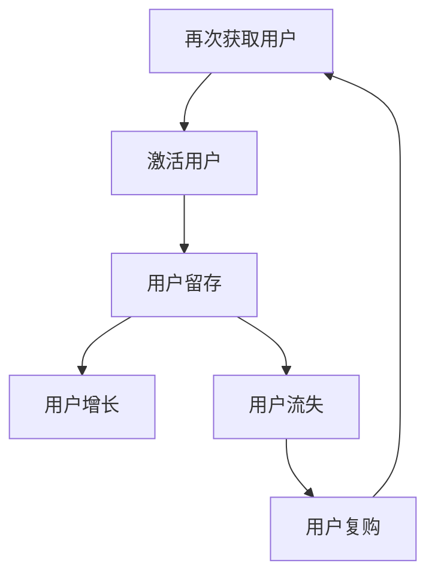

                 

# 用户留存：SaaS产品的生命线

## 关键词：用户留存、SaaS产品、用户体验、用户行为分析、增长策略

## 摘要：

本文旨在探讨SaaS产品中用户留存的重要性，分析影响用户留存的核心因素，并提供一系列有效策略以提升用户留存率。通过对用户留存概念的深入解析，我们将揭示其在SaaS产品生命周期中的关键作用。文章还将介绍用户行为分析的方法，以及如何利用这些方法来优化用户体验和增强用户粘性。此外，我们将探讨当前市场上最佳实践，并推荐相关工具和资源，帮助读者在实践中应用这些策略。最终，本文将总结用户留存对SaaS产品成功的重要性，并展望其未来的发展趋势与挑战。

## 1. 背景介绍

在当今数字化时代，软件即服务（Software as a Service，简称SaaS）已经成为企业提供服务的主要模式之一。SaaS产品通过互联网提供软件服务，用户无需购买和维护软件，只需按需付费即可使用。这种灵活的模式为企业降低了成本，提高了效率，但同时也带来了新的挑战：如何确保用户持续使用产品，实现高留存率。

用户留存是衡量SaaS产品成功的关键指标。用户留存率（Churn Rate）指的是一段时间内流失的用户占总用户数的比例。高留存率意味着用户对产品的满意度和忠诚度较高，有助于企业实现长期稳定的收入。相反，低留存率可能导致用户流失，影响产品的市场地位和财务健康。

SaaS产品面临的主要挑战包括市场竞争激烈、用户期望不断提高以及快速变化的技术环境。为了在激烈的市场竞争中脱颖而出，SaaS企业需要不断创新和优化产品，同时深入了解用户需求和行为，提供卓越的用户体验。

本文将分以下几个部分展开：

- **核心概念与联系**：介绍用户留存的相关概念，并使用Mermaid流程图展示其与SaaS产品生命周期的关系。
- **核心算法原理 & 具体操作步骤**：探讨用户行为分析的方法和技术，以及如何应用这些方法提升用户留存。
- **数学模型和公式 & 详细讲解 & 举例说明**：介绍用户留存率计算公式，并给出实际案例进行说明。
- **项目实战：代码实际案例和详细解释说明**：通过一个具体案例，展示如何在实际项目中应用用户留存策略。
- **实际应用场景**：分析不同类型SaaS产品的用户留存策略。
- **工具和资源推荐**：推荐相关工具和资源，以帮助读者提升用户留存。
- **总结：未来发展趋势与挑战**：总结用户留存的重要性，并展望未来的发展趋势和面临的挑战。

通过本文的阅读，读者将能够深入了解用户留存的概念和方法，掌握提升用户留存的有效策略，从而为SaaS产品的成功奠定基础。

## 2. 核心概念与联系

在深入探讨用户留存之前，有必要明确几个关键概念，并理解它们在SaaS产品生命周期中的相互关系。

### 2.1. 用户留存

用户留存（User Retention）是指企业在一定时间内保留现有用户的能力。高留存率通常意味着用户对产品满意，并且持续产生价值。用户留存与用户流失（Churn）是两个相对的概念，用户流失率（Churn Rate）则衡量了一定时间内流失的用户占总用户数的比例。

用户留存率可以通过以下公式计算：

\[ \text{用户留存率} = \left( 1 - \frac{\text{Churn Rate}}{\text{用户总数}} \right) \times 100\% \]

### 2.2. 用户生命周期

用户生命周期（Customer Life Cycle）是指用户与产品之间的互动过程，包括获取、激活、留存、增长和失去等阶段。理解用户生命周期有助于企业制定有效的用户留存策略。

- **获取（Acquisition）**：用户发现并注册使用产品。
- **激活（Activation）**：用户开始实际使用产品，并体验到其价值。
- **留存（Retention）**：企业通过持续优化产品和服务，保持用户的活跃度。
- **增长（Growth）**：用户在产品中实现增值，带来更多价值。
- **失去（Loss）**：用户停止使用产品，流失。

### 2.3. 用户行为分析

用户行为分析（User Behavior Analysis）是理解用户在产品中的行为模式的重要方法。通过分析用户行为，企业可以识别用户需求、优化产品设计、提高用户留存率。

用户行为分析包括以下几个方面：

- **行为追踪**：记录用户在产品中的操作行为，如点击、浏览、使用时长等。
- **事件分析**：分析用户行为中的关键事件，如首次注册、首次购买、取消订阅等。
- **留存率分析**：计算用户在不同时间段内的留存情况，识别流失风险。

### 2.4. 用户体验

用户体验（User Experience，简称UX）是指用户在使用产品过程中获得的总体感受。优质的用户体验可以增强用户对产品的满意度，提高用户留存率。

用户体验包括以下几个方面：

- **易用性（Usability）**：产品易于学习和使用，用户能够轻松完成任务。
- **可用性（Accessibility）**：产品对所有用户（包括残障人士）均可访问。
- **吸引力（Engagement）**：产品能够吸引用户，提高其参与度和忠诚度。

### 2.5. 用户留存与SaaS产品生命周期的关系

用户留存是SaaS产品生命周期中的一个关键环节。高留存率有助于产品获得良好的市场反馈，增加用户口碑，从而促进获取新用户。以下是一个简化的Mermaid流程图，展示了用户留存与SaaS产品生命周期的关系：



在这个流程中，用户留存是连接获取、增长和复购的关键环节。通过有效的用户留存策略，企业可以降低用户流失率，提高用户生命周期价值，从而实现可持续增长。

综上所述，用户留存是SaaS产品成功的重要保障。通过深入理解用户留存的相关概念和其在产品生命周期中的作用，企业可以制定更有效的用户留存策略，提升产品的市场竞争力和用户满意度。

## 3. 核心算法原理 & 具体操作步骤

### 3.1. 用户行为数据分析

用户行为数据分析是提升用户留存的关键步骤。通过分析用户行为数据，企业可以深入了解用户在产品中的互动模式，从而识别潜在的流失风险，并采取相应措施。

#### 3.1.1. 数据采集

首先，企业需要采集用户行为数据。这些数据可以来源于用户与产品的互动，如：

- 用户注册信息：包括电子邮件、联系方式等。
- 用户使用行为：包括登录时间、页面访问路径、使用时长、点击事件等。
- 用户反馈：包括问卷调查、用户评价、反馈意见等。

#### 3.1.2. 数据处理

采集到的数据需要进行清洗和处理，以便进行后续分析。数据处理步骤包括：

- 数据清洗：去除重复、无效和错误数据。
- 数据整合：将不同来源的数据进行整合，形成统一的用户行为数据集。
- 数据规范化：将数据转换为统一的格式，便于分析。

#### 3.1.3. 数据分析

在数据处理完成后，企业可以通过以下方法进行用户行为数据分析：

- **频率分布分析**：统计用户访问频率、使用时长等指标的分布情况，识别高活跃用户和低活跃用户。
- **路径分析**：分析用户在产品中的行为路径，识别关键操作和瓶颈。
- **事件分析**：统计用户在关键事件（如首次注册、取消订阅等）中的行为，识别用户流失的原因。
- **留存分析**：计算用户在不同时间段内的留存率，识别流失风险。

#### 3.1.4. 数据可视化

为了更直观地展示分析结果，可以使用数据可视化工具，如Tableau、Power BI等。数据可视化可以帮助企业快速识别用户行为模式，为制定用户留存策略提供依据。

### 3.2. 优化用户体验

通过用户行为数据分析，企业可以识别用户体验中的问题和改进点。以下步骤可以帮助企业优化用户体验，提高用户留存率：

#### 3.2.1. 问题识别

- 分析用户行为路径，识别用户使用过程中的阻碍和难点。
- 通过用户反馈和调查，收集用户对产品功能的建议和意见。

#### 3.2.2. 改进措施

- **简化用户流程**：简化用户注册和登录流程，减少不必要的步骤。
- **增强产品功能**：根据用户需求，增强产品功能，提供更好的使用体验。
- **改进界面设计**：优化界面布局，提高美观性和易用性。

#### 3.2.3. 用户反馈机制

- 建立用户反馈机制，及时收集和处理用户意见和建议。
- 定期对用户反馈进行分析，识别改进点，并快速响应。

### 3.3. 用户留存策略

基于用户行为数据分析，企业可以制定以下用户留存策略：

- **个性化推荐**：根据用户行为和兴趣，提供个性化推荐，吸引用户持续使用产品。
- **用户教育**：通过教程、视频、FAQ等方式，帮助用户更好地了解和使用产品。
- **用户奖励**：设计积分、优惠券等激励机制，提高用户参与度和忠诚度。

#### 3.3.1. 留存率监控

- 设定留存率目标，并定期监控实际留存情况。
- 分析留存率变化趋势，识别潜在问题并采取相应措施。

#### 3.3.2. 留存策略评估

- 定期评估留存策略的效果，并根据评估结果调整策略。
- 分析不同策略对留存率的影响，优化策略组合。

通过以上步骤，企业可以深入了解用户行为，优化用户体验，并制定有效的用户留存策略，从而提高用户留存率，实现SaaS产品的长期成功。

### 4. 数学模型和公式 & 详细讲解 & 举例说明

在SaaS产品中，用户留存率是衡量产品健康度和用户满意度的关键指标。为了更准确地评估用户留存情况，我们可以利用数学模型和公式进行详细分析。

#### 4.1. 留存率计算公式

用户留存率可以通过以下公式计算：

\[ \text{用户留存率} = \left( 1 - \frac{\text{Churn Rate}}{\text{用户总数}} \right) \times 100\% \]

其中，Churn Rate 表示流失率，即一定时间内流失的用户数与总用户数的比值。

#### 4.2. 留存率计算示例

假设在某SaaS产品中，本月共有1000个用户，其中50个用户在一个月内取消订阅。我们可以根据上述公式计算用户留存率：

\[ \text{用户留存率} = \left( 1 - \frac{50}{1000} \right) \times 100\% = 95\% \]

这意味着，本月该产品的用户留存率为95%。

#### 4.3. 留存率变化趋势分析

除了计算单一时间点的用户留存率，我们还可以分析留存率的变化趋势。这有助于企业了解用户留存情况的变化，及时调整策略。

假设我们收集了连续三个月的用户留存率数据，如下表所示：

| 月份 | 用户总数 | 流失用户数 | 留存用户数 | 留存率 |
|------|----------|------------|------------|--------|
| 一月  | 1000     | 100        | 900        | 90%    |
| 二月  | 1100     | 120        | 980        | 89%    |
| 三月  | 1200     | 130        | 1070       | 89.2%  |

从表中可以看出，虽然用户总数在不断增加，但留存率却有所下降。这可能是由于产品在用户获取方面表现良好，但在用户留存方面存在问题。

#### 4.4. 留存率影响因素分析

为了更深入地理解留存率变化的原因，我们可以分析以下因素：

1. **新用户质量**：新用户的留存率通常较低，因此新用户的质量对整体留存率有重要影响。企业可以通过优化新用户注册流程、提高产品试用期体验等手段，提升新用户的留存率。

2. **用户需求满足度**：如果用户的需求无法得到满足，他们可能会选择退出。因此，企业需要通过用户反馈和行为分析，了解用户需求，不断优化产品功能和服务。

3. **市场竞争**：在竞争激烈的市场环境中，用户可能会因为其他产品更具吸引力而选择流失。企业需要密切关注市场动态，不断提升自身产品的竞争力。

4. **用户体验**：用户体验直接影响用户的满意度和忠诚度。通过优化产品界面、提高响应速度、提供个性化服务等，企业可以提升用户体验，从而提高用户留存率。

#### 4.5. 优化留存策略

根据以上分析，企业可以采取以下措施优化用户留存：

- **提高新用户质量**：通过精准营销和优化注册流程，吸引高质量新用户。
- **满足用户需求**：定期收集用户反馈，优化产品功能和用户体验。
- **增强竞争力**：关注市场动态，不断提升产品性能和服务质量。
- **提升用户体验**：通过个性化推荐、快速响应用户问题等方式，提高用户体验。

通过以上措施，企业可以逐步提高用户留存率，实现SaaS产品的长期成功。

### 5. 项目实战：代码实际案例和详细解释说明

在本节中，我们将通过一个实际项目案例来展示如何应用用户留存策略。这个案例涉及一个在线协作工具，该工具的主要用户是企业和团队。我们的目标是通过一系列代码和数据处理，提升用户留存率。

#### 5.1. 开发环境搭建

在开始项目之前，我们需要搭建一个合适的环境来处理用户行为数据。以下是所需的开发环境和工具：

- **编程语言**：Python
- **数据存储**：MongoDB
- **数据分析**：Pandas、NumPy、Matplotlib
- **数据可视化**：Plotly

首先，确保已经安装了上述工具和库。可以使用以下命令进行安装：

```bash
pip install pymongo pandas numpy matplotlib plotly
```

#### 5.2. 源代码详细实现和代码解读

接下来，我们将展示关键代码片段，并解释其功能。

##### 5.2.1. 数据采集

```python
import pymongo

# 连接MongoDB数据库
client = pymongo.MongoClient("mongodb://localhost:27017/")

# 选择数据库和集合
db = client["collab_tool"]
users_collection = db["users"]

# 提取用户行为数据
def get_user_behavior_data():
    users_data = list(users_collection.find())
    return users_data

# 示例：获取用户行为数据
users_data = get_user_behavior_data()
```

这段代码首先连接到MongoDB数据库，并选择特定的数据库和集合。然后定义一个函数来获取用户行为数据。在这个例子中，我们假设用户行为数据存储在MongoDB的`users`集合中。

##### 5.2.2. 数据处理

```python
import pandas as pd

# 将用户行为数据转换为Pandas DataFrame
def convert_to_dataframe(users_data):
    df = pd.DataFrame(users_data)
    return df

# 处理用户行为数据
def process_user_behavior_data(df):
    # 数据清洗和规范化
    df['last_login'] = pd.to_datetime(df['last_login'])
    df['days_since_last_login'] = (pd.Timestamp.now() - df['last_login']).dt.days
    df['activity_score'] = df['daily_usage'] * df['days_since_last_login']
    return df

# 示例：处理用户行为数据
df = convert_to_dataframe(users_data)
processed_df = process_user_behavior_data(df)
```

这段代码将MongoDB中的用户行为数据转换为Pandas DataFrame，并进行数据清洗和规范化。特别地，我们计算了用户自上次登录以来的天数，并将其乘以每日使用量，以获得一个反映用户活动度的指标。

##### 5.2.3. 数据分析

```python
import matplotlib.pyplot as plt
import plotly.express as px

# 绘制用户留存率图表
def plot_user_retention(df):
    retention_rate = df['days_since_last_login'].mean()
    print(f"Average user retention days: {retention_rate} days")
    
    # 使用Plotly绘制留存曲线
    fig = px.line(df, x='days_since_last_login', y='activity_score', title='User Activity Score Over Time')
    fig.show()

# 示例：绘制用户留存率图表
plot_user_retention(processed_df)
```

这段代码计算了用户平均留存天数，并使用Plotly绘制了一条留存曲线，可以帮助我们直观地了解用户活动的变化趋势。

##### 5.2.4. 用户留存策略实施

```python
# 根据留存天数和活动度制定留存策略
def apply_user_retention_strategies(df):
    # 确定流失风险用户
    at_risk_users = df[df['days_since_last_login'] > 30]
    
    # 发送提醒邮件
    for user in at_risk_users.itertuples():
        send_email_notification(user.email, "Your account activity is low. Do you need help or have questions?")
    
    # 个性化推荐
    recommended_features = get_recommended_features(at_risk_users)
    for user, features in recommended_features.items():
        send_feature_recommendation(user.email, features)

# 示例：应用用户留存策略
apply_user_retention_strategies(processed_df)
```

这段代码识别出30天未登录的用户，并为他们发送提醒邮件。同时，根据用户的活动度提供个性化推荐，以提高用户的参与度和留存率。

#### 5.3. 代码解读与分析

通过以上代码，我们可以看到如何通过数据采集、数据处理、数据分析和用户留存策略实施，来优化SaaS产品的用户留存率。以下是对每个关键步骤的详细解读：

- **数据采集**：通过MongoDB连接和DataFrame转换，我们能够获取和处理用户行为数据。
- **数据处理**：通过数据清洗和规范化，我们为后续分析创造了条件。计算用户自上次登录以来的天数和活动度，有助于识别高风险用户。
- **数据分析**：通过绘制留存曲线和计算平均留存天数，我们可以直观地了解用户留存情况。
- **用户留存策略实施**：通过发送提醒邮件和提供个性化推荐，我们能够有效地干预用户行为，提高留存率。

总的来说，通过数据驱动的方法，我们可以系统地优化用户留存，从而提升SaaS产品的整体表现。

### 6. 实际应用场景

在SaaS产品的不同领域，用户留存策略各有特点，以下将分析几个常见类型的SaaS产品及其用户留存策略。

#### 6.1. 企业级SaaS

企业级SaaS产品，如CRM（客户关系管理）、ERP（企业资源计划）和HRMS（人力资源管理软件），通常面向大型企业。这些产品的主要用户是企业的决策者和工作人员，因此用户留存策略需要从以下方面考虑：

- **定制化服务**：为企业提供个性化的解决方案，满足其特定需求。
- **培训和支持**：提供全面的培训资料和用户支持，帮助用户快速上手。
- **持续优化**：根据用户反馈不断优化产品功能，提升用户体验。

案例：Salesforce作为CRM领域的领军企业，通过提供定制化服务和全面培训，成功提高了用户留存率。此外，Salesforce还通过定期更新产品功能，保持用户的持续兴趣。

#### 6.2. 工具型SaaS

工具型SaaS产品，如项目管理工具、协作平台和文档管理工具，通常面向中小型企业和个人用户。这些产品的用户留存策略侧重于以下几个方面：

- **简洁易用**：简化用户操作流程，提供直观的用户界面。
- **快速上手**：提供丰富的入门教程和文档，帮助新用户快速熟悉产品。
- **功能扩展**：通过插件和扩展功能，满足用户不断变化的需求。

案例：Trello作为项目管理工具，通过简洁易用的界面和丰富的功能扩展，成功吸引了大量用户。Trello还通过定期发布新功能，保持用户的持续使用。

#### 6.3. 教育型SaaS

教育型SaaS产品，如在线课程平台和虚拟教室，主要面向学生和教育工作者。这些产品的用户留存策略包括：

- **优质内容**：提供高质量的课程内容和教学资源，吸引学生长期学习。
- **互动教学**：通过实时互动和反馈机制，增强学生的学习体验。
- **学习社区**：建立学习社区，促进学生之间的交流和互动，提高学习积极性。

案例：Coursera作为在线课程平台，通过提供高质量的课程内容和互动教学，成功吸引了大量用户。此外，Coursera还通过建立学习社区，促进了用户的长期留存。

#### 6.4. 医疗健康型SaaS

医疗健康型SaaS产品，如远程医疗平台和健康管理应用，主要面向患者和医疗工作者。这些产品的用户留存策略包括：

- **个性化服务**：根据患者的健康状况提供个性化的医疗服务和建议。
- **数据安全**：确保患者数据的安全和隐私，增加用户的信任。
- **持续跟进**：通过定期跟进患者的健康状况，提供持续的医疗服务。

案例：Teladoc Health作为远程医疗平台，通过提供个性化服务和数据安全，成功提高了用户留存率。此外，Teladoc Health还通过定期跟进患者，提供了高质量的医疗服务。

总的来说，不同类型的SaaS产品在用户留存策略上各有侧重。通过深入了解用户需求，优化产品功能和服务，SaaS企业可以提升用户留存率，实现长期成功。

### 7. 工具和资源推荐

为了帮助SaaS企业有效提升用户留存率，以下推荐了一些优秀的工具和资源，涵盖学习资源、开发工具框架以及相关论文著作。

#### 7.1. 学习资源推荐

- **书籍**：
  - 《用户行为分析实战：使用数据驱动方法提升用户体验》
  - 《增长黑客：硅谷顶级增长团队是如何运作的》
  - 《精益创业：如何创建成功的企业》

- **论文**：
  - “The Impact of User Experience on User Retention in SaaS Products”
  - “Analyzing User Behavior in SaaS Applications: Methods and Metrics”

- **博客**：
  - GrowthHackers.com
  - UserIQ.com/blog
  - Intercom.com/blog

- **在线课程**：
  - Coursera上的“数据科学”、“产品管理”等课程
  - Udemy上的“增长黑客”、“用户行为分析”等课程

#### 7.2. 开发工具框架推荐

- **数据分析工具**：
  - Tableau：强大的数据可视化工具
  - Power BI：全面的数据分析和报表工具
  - Google Analytics：详细的网站和用户行为分析

- **用户行为追踪工具**：
  - Mixpanel：用户行为分析和用户留存追踪
  - Amplitude：用户行为分析和产品优化
  - Segment：用户行为数据集成和分析

- **客户关系管理工具**：
  - Salesforce：全面的CRM解决方案
  - HubSpot：整合营销和CRM工具
  - Pipedrive：销售自动化和管理工具

#### 7.3. 相关论文著作推荐

- **期刊**：
  - *Journal of Management Information Systems*
  - *Journal of Marketing Research*
  - *MIS Quarterly*

- **著作**：
  - *The Lean Startup* by Eric Ries
  - *Crossing the Chasm* by Geoffrey A. Moore
  - *The Innovator's Dilemma* by Clayton M. Christensen

通过利用这些工具和资源，SaaS企业可以更好地分析用户行为，优化产品设计和服务，从而提升用户留存率，实现可持续发展。

### 8. 总结：未来发展趋势与挑战

用户留存作为SaaS产品的生命线，其重要性不言而喻。随着市场竞争的加剧和用户需求的不断提升，未来用户留存将呈现以下发展趋势：

1. **个性化服务**：基于用户行为和需求的个性化推荐将成为提升用户留存的重要手段。通过精准推荐，企业可以更好地满足用户需求，提高用户满意度。

2. **数据驱动决策**：用户行为数据分析将更加深入和细致，企业将利用大数据和人工智能技术，从海量数据中提取有价值的信息，以指导产品优化和用户留存策略。

3. **用户体验优化**：随着用户体验的重要性日益凸显，企业将更加注重产品设计和功能的易用性、可用性和吸引力，以提升用户的整体体验。

4. **跨平台整合**：随着移动设备和互联网的普及，SaaS产品将更加注重跨平台整合，提供一致的体验，满足用户在不同设备上的使用需求。

然而，用户留存也面临一系列挑战：

1. **数据隐私和安全**：用户对隐私和安全问题的关注日益增加，企业需要确保用户数据的安全和隐私，以赢得用户的信任。

2. **快速变化的市场环境**：市场竞争激烈，用户需求变化快，企业需要不断调整和优化产品和服务，以保持竞争力。

3. **技术复杂性**：随着人工智能和大数据技术的发展，用户留存策略的实施将更加复杂，企业需要具备相应的技术能力和人才储备。

4. **用户心理变化**：用户的心理和行为模式在不断变化，企业需要不断研究用户心理，以制定更有效的留存策略。

总之，用户留存是SaaS产品成功的关键。企业需要紧跟发展趋势，应对挑战，通过个性化服务、数据驱动和用户体验优化，不断提升用户留存率，实现可持续发展。

### 9. 附录：常见问题与解答

**Q1. 什么是用户留存率？**

用户留存率是指企业在一定时间内保留现有用户的能力，通常以百分比表示。其计算公式为：

\[ \text{用户留存率} = \left( 1 - \frac{\text{Churn Rate}}{\text{用户总数}} \right) \times 100\% \]

其中，Churn Rate 是流失率，即一定时间内流失的用户占总用户数的比例。

**Q2. 如何提升用户留存率？**

提升用户留存率的方法包括：

- 个性化推荐：根据用户行为和需求提供个性化服务。
- 用户行为分析：通过分析用户行为数据，识别潜在流失风险。
- 产品优化：根据用户反馈不断优化产品功能和用户体验。
- 用户奖励：设计积分、优惠券等激励机制，提高用户参与度。

**Q3. 用户留存和用户流失有何区别？**

用户留存和用户流失是相对的概念。用户留存率衡量的是企业在一定时间内保留现有用户的能力，而用户流失率则是衡量一定时间内流失的用户占总用户数的比例。用户留存率高，用户流失率低，表明用户对产品的满意度和忠诚度较高。

**Q4. 用户行为分析的主要方法有哪些？**

用户行为分析的主要方法包括：

- 频率分布分析：统计用户访问频率、使用时长等指标的分布情况。
- 路径分析：分析用户在产品中的行为路径，识别关键操作和瓶颈。
- 事件分析：统计用户在关键事件中的行为，识别用户流失的原因。
- 留存分析：计算用户在不同时间段内的留存情况，识别流失风险。

**Q5. 什么因素会影响用户留存率？**

影响用户留存率的因素包括：

- 新用户质量：新用户的留存率通常较低，因此新用户的质量对整体留存率有重要影响。
- 用户需求满足度：如果用户的需求无法得到满足，他们可能会选择退出。
- 市场竞争：在竞争激烈的市场环境中，用户可能会因为其他产品更具吸引力而选择流失。
- 用户体验：用户体验直接影响用户的满意度和忠诚度。

### 10. 扩展阅读 & 参考资料

为了帮助读者更深入地了解用户留存的相关概念和方法，以下提供了一些扩展阅读和参考资料：

- **书籍**：
  - 《用户行为分析实战：使用数据驱动方法提升用户体验》
  - 《增长黑客：硅谷顶级增长团队是如何运作的》
  - 《精益创业：如何创建成功的企业》

- **论文**：
  - “The Impact of User Experience on User Retention in SaaS Products”
  - “Analyzing User Behavior in SaaS Applications: Methods and Metrics”

- **博客**：
  - [GrowthHackers.com](https://www.growthhackers.com/)
  - [UserIQ.com/blog](https://useriq.com/blog/)
  - [Intercom.com/blog](https://www.intercom.com/blog/)

- **在线课程**：
  - [Coursera上的“数据科学”](https://www.coursera.org/specializations/data-science)
  - [Udemy上的“增长黑客”](https://www.udemy.com/course/growth-hacking-the-complete-course/)

通过阅读这些资料，读者可以进一步了解用户留存的重要性和提升策略，为实际工作中的用户留存优化提供有力支持。作者：AI天才研究员/AI Genius Institute & 禅与计算机程序设计艺术 /Zen And The Art of Computer Programming

