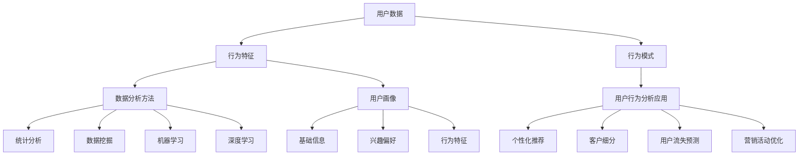

                 

### 1. 背景介绍

在当今数字化时代，用户行为分析（User Behavior Analysis，UBA）作为一种强大的技术手段，已经被广泛应用于各个行业，尤其是电商、金融、广告和社交媒体等领域。通过分析用户的行为数据，企业能够深入洞察用户的需求、兴趣和行为模式，从而优化产品供给、提升用户体验，并实现业务增长。

用户行为分析的基本概念可以简单概括为：通过收集、处理和分析用户在使用产品或服务过程中的行为数据，提取有价值的信息，以辅助企业做出更加精准和有效的决策。这些行为数据可以包括用户的浏览记录、购买行为、搜索关键词、点击率、评论内容等。

在过去的几年里，随着大数据和人工智能技术的快速发展，用户行为分析的应用范围和深度都得到了极大的拓展。传统的用户行为分析方法主要依赖于统计分析、数据挖掘等手段，而随着机器学习和深度学习技术的引入，用户行为分析已经迈向了智能化、自动化的新阶段。通过这些先进的技术，我们可以更加精准地预测用户的行为，甚至在用户做出决策之前就给出个性化的推荐。

尽管用户行为分析具有巨大的潜力，但其应用过程中也面临着诸多挑战。首先是如何有效地收集和处理海量的用户数据，其次是如何从这些数据中提取有价值的信息，并保证分析结果的准确性和可靠性。此外，用户隐私保护也是用户行为分析中不可忽视的重要问题。

本篇文章将围绕用户行为分析这一主题，深入探讨其核心概念、算法原理、数学模型、实际应用以及未来发展。通过本文的阅读，读者将能够全面了解用户行为分析的基本理论和方法，掌握其在实际业务中的应用技巧，并对其未来发展趋势有更加清晰的认识。

首先，我们将从用户行为分析的定义和基本原理出发，介绍其主要技术手段和方法。接着，我们将探讨用户行为分析在实际业务中的应用场景，并分析其带来的业务价值和影响。随后，我们将详细讲解用户行为分析中常用的核心算法和数学模型，并通过具体案例进行说明。最后，我们将总结用户行为分析在当前阶段的实际应用情况，探讨其未来发展趋势和面临的挑战。

### 2. 核心概念与联系

用户行为分析的核心在于理解用户的行为模式，从而为企业的决策提供数据支持。为了实现这一目标，我们需要明确几个关键的概念和它们之间的关系。

#### 2.1 用户数据（User Data）

用户数据是用户行为分析的基础。这些数据可以来源于多种渠道，如Web日志、应用程序接口（API）、传感器等。具体包括但不限于：

- **浏览记录（Browsing History）**：用户在网站或应用上的浏览路径、停留时间、访问频率等。
- **购买行为（Purchase Behavior）**：用户的购买历史、购买偏好、购买频率等。
- **搜索关键词（Search Keywords）**：用户在搜索引擎或应用内搜索的关键词。
- **点击率（Click-Through Rate, CTR）**：用户点击广告或链接的比率。
- **评论内容（Comment Content）**：用户对产品或服务的评价和反馈。

#### 2.2 行为特征（Behavioral Features）

行为特征是从用户数据中提取出来，用于描述用户行为特征的属性。这些特征可以帮助我们更好地理解用户的行为模式，例如：

- **用户活跃度（User Activity）**：用户在平台上的活跃程度，如登录频率、浏览时长等。
- **用户留存率（User Retention）**：用户在一定时间内持续使用产品的比率。
- **用户流失率（User Churn）**：用户停止使用产品的比率。
- **用户转化率（User Conversion Rate）**：用户完成目标动作（如购买、注册等）的比率。

#### 2.3 行为模式（Behavioral Patterns）

行为模式是通过分析用户行为特征，得出的用户行为规律和趋势。这些模式可以帮助我们预测用户的未来行为，例如：

- **购买周期（Purchase Cycle）**：用户从首次接触到最终购买之间的时间间隔。
- **浏览路径（Browsing Path）**：用户在网站或应用中的浏览路径模式。
- **互动模式（Interaction Patterns）**：用户与其他用户或平台内容的互动方式。

#### 2.4 数据分析方法（Data Analysis Methods）

为了从用户数据中提取有价值的信息，我们需要采用一系列数据分析方法。这些方法包括：

- **统计分析（Statistical Analysis）**：使用统计学方法对用户数据进行分析，如描述性统计、相关性分析、回归分析等。
- **数据挖掘（Data Mining）**：从大量数据中挖掘出潜在的模式和关联关系，如聚类分析、关联规则挖掘等。
- **机器学习（Machine Learning）**：利用机器学习算法，自动识别用户行为特征和模式，如分类算法、聚类算法、时间序列分析等。
- **深度学习（Deep Learning）**：通过构建深度神经网络模型，自动提取用户行为的高级特征，如卷积神经网络（CNN）、循环神经网络（RNN）等。

#### 2.5 数据安全与隐私保护（Data Security and Privacy Protection）

在用户行为分析过程中，数据的安全与隐私保护是一个不可忽视的问题。我们需要采取一系列措施，确保用户数据不被未经授权的访问和使用。这些措施包括：

- **数据加密（Data Encryption）**：对用户数据进行加密，防止数据在传输和存储过程中被窃取。
- **访问控制（Access Control）**：限制只有授权用户可以访问敏感数据。
- **匿名化处理（Anonymization）**：对用户数据中的个人身份信息进行匿名化处理，保护用户隐私。

#### 2.6 用户画像（User Profiling）

用户画像是通过整合用户数据和行为特征，构建的一个关于用户的全面描述。用户画像可以帮助企业更好地理解用户，从而提供更个性化的服务和推荐。用户画像通常包括以下信息：

- **基础信息（Basic Information）**：用户的性别、年龄、地理位置、职业等。
- **兴趣偏好（Interest Preferences）**：用户的兴趣点、偏好商品、关注领域等。
- **行为特征（Behavioral Characteristics）**：用户的浏览记录、购买行为、互动模式等。

#### 2.7 用户行为分析的应用场景（Application Scenarios）

用户行为分析可以在多个业务场景中发挥作用，包括：

- **个性化推荐（Personalized Recommendations）**：根据用户的行为特征和偏好，为其推荐感兴趣的商品或内容。
- **客户细分（Customer Segmentation）**：根据用户的行为模式，将用户划分为不同的群体，以便进行有针对性的营销和服务。
- **用户流失预测（User Churn Prediction）**：预测哪些用户可能会停止使用产品，从而采取预防措施。
- **营销活动优化（Marketing Campaign Optimization）**：根据用户行为数据，优化营销活动的效果。

#### 2.8 用户行为分析的技术架构（Technical Architecture）

用户行为分析的技术架构通常包括以下几个关键组件：

- **数据收集（Data Collection）**：通过各种渠道收集用户数据。
- **数据存储（Data Storage）**：存储和管理收集到的用户数据。
- **数据处理（Data Processing）**：对用户数据进行清洗、转换和分析。
- **分析模型（Analysis Models）**：构建和应用分析模型，提取用户行为特征和模式。
- **结果输出（Result Output）**：将分析结果可视化，为业务决策提供支持。

#### 2.9 关系图谱

为了更好地理解用户行为分析中的各个概念及其关系，我们可以通过Mermaid流程图来表示它们之间的联系：



通过上述核心概念和联系的分析，我们可以更好地理解用户行为分析的整个过程，从而为实际应用提供有力的理论支持。在接下来的章节中，我们将详细探讨用户行为分析中的核心算法和数学模型，并通过实际案例进行说明。

### 3. 核心算法原理 & 具体操作步骤

用户行为分析中的核心算法主要依赖于机器学习和深度学习技术，这些算法能够自动从大量数据中提取有价值的信息，帮助企业更好地理解用户行为。下面，我们将介绍几种常用的核心算法原理及其具体操作步骤。

#### 3.1 决策树（Decision Tree）

决策树是一种常用的分类算法，通过一系列的判断条件来对数据进行分类。其基本原理如下：

- **ID3算法**：ID3（Iterative Dichotomiser 3）是一种基于信息增益（Information Gain）的决策树算法。信息增益的计算公式为：
  \[
  IG(D, A) = Entropy(D) - \sum_{v\in Values(A)} \frac{|D_v|}{|D|} Entropy(D_v)
  \]
  其中，\( D \) 为总数据集，\( A \) 为特征属性，\( Values(A) \) 为特征属性 \( A \) 的所有可能取值，\( D_v \) 为特征属性 \( A \) 取值为 \( v \) 的数据子集。

- **C4.5算法**：C4.5是ID3的改进版本，它引入了剪枝（Pruning）技术，防止过拟合（Overfitting）。

- **操作步骤**：
  1. 计算每个特征属性的信息增益，选择信息增益最大的特征属性作为划分依据。
  2. 根据所选特征属性，将数据集划分为若干子集。
  3. 递归地对每个子集应用同样的方法，直到满足停止条件（如最大深度、最小叶节点样本数等）。

#### 3.2 支持向量机（Support Vector Machine，SVM）

支持向量机是一种用于分类和回归分析的机器学习算法。其基本原理如下：

- **核心思想**：寻找一个最优的超平面，将不同类别的数据点分隔开，并使得分类间隔最大。

- **损失函数**：通常使用 hinge 损失函数：
  \[
  L(y, f(x)) = \max(0, 1 - yf(x))
  \]
  其中，\( y \) 为样本标签，\( f(x) \) 为预测值。

- **操作步骤**：
  1. 构建拉格朗日函数：
     \[
     L(\beta, \alpha) = \sum_{i=1}^{n} (-1)y_i f(x_i) + \frac{1}{2} \sum_{i,j=1}^{n} \alpha_i \alpha_j y_i y_j \langle x_i, x_j \rangle - \sum_{i=1}^{n} \alpha_i
     \]
  2. 求解拉格朗日方程：
     \[
     \begin{cases}
     L(\beta, \alpha) = 0 \\
     \alpha_i \geq 0
     \end{cases}
     \]
  3. 利用KKT条件（Karlsson-Kuhn-Tucker conditions）求解最优解 \( \alpha_i \)。

#### 3.3 随机森林（Random Forest）

随机森林是一种基于决策树的集成学习方法。其基本原理如下：

- **核心思想**：通过构建多棵决策树，并对它们的结果进行投票，以获得最终的预测结果。

- **操作步骤**：
  1. 随机选取特征集合和样本子集，构建单棵决策树。
  2. 重复步骤1，构建多棵决策树。
  3. 对每个样本，计算其在每棵决策树上的预测结果。
  4. 将多棵决策树的预测结果进行投票，获得最终预测结果。

#### 3.4 卷积神经网络（Convolutional Neural Network，CNN）

卷积神经网络是一种用于图像识别和处理的深度学习算法。其基本原理如下：

- **核心思想**：通过卷积层、池化层和全连接层，逐层提取图像特征，并最终进行分类。

- **操作步骤**：
  1. **输入层**：接收图像数据。
  2. **卷积层**：通过卷积运算提取图像局部特征。
     \[
     \text{output} = \text{Conv}(\text{input}, \text{filter}) + \text{bias}
     \]
  3. **激活函数**：对卷积层的输出进行非线性变换，如ReLU函数。
  4. **池化层**：对卷积层的结果进行下采样，减少模型参数。
  5. **全连接层**：将池化层的结果进行拼接，输入到全连接层进行分类。
  6. **输出层**：输出分类结果。

#### 3.5 循环神经网络（Recurrent Neural Network，RNN）

循环神经网络是一种用于处理序列数据的深度学习算法。其基本原理如下：

- **核心思想**：通过循环结构，使得网络能够记住之前的信息，并利用这些信息处理当前的任务。

- **操作步骤**：
  1. **输入层**：接收序列数据。
  2. **隐藏层**：通过门控机制（如门控循环单元（GRU）或长短期记忆（LSTM））更新隐藏状态。
     \[
     h_t = \text{sigmoid}(W_h \cdot [h_{t-1}, x_t]) \odot \text{tanh}(W \cdot [h_{t-1}, x_t])
     \]
  3. **输出层**：将隐藏状态转换为输出序列。
  4. **训练**：通过反向传播算法，调整网络参数，优化模型性能。

#### 3.6 自注意力机制（Self-Attention Mechanism）

自注意力机制是一种在深度学习模型中用于提取序列特征的高效方法。其基本原理如下：

- **核心思想**：通过计算序列中每个元素与其他元素的相关性，并加权融合，以提取序列特征。

- **操作步骤**：
  1. **计算自注意力得分**：
     \[
     \text{score} = \text{softmax}(\text{Q} \cdot \text{K})
     \]
     其中，\( Q \) 和 \( K \) 分别表示查询向量和关键向量。
  2. **加权融合**：
     \[
     \text{output} = \text{score} \odot \text{V}
     \]
     其中，\( V \) 为值向量。

通过上述核心算法的介绍，我们可以看到用户行为分析在算法选择和应用上具有多样化的特点。在实际应用中，可以根据具体问题和数据特点，选择合适的算法进行模型构建和优化。在接下来的章节中，我们将进一步探讨用户行为分析中的数学模型，并通过具体案例进行说明。

### 4. 数学模型和公式 & 详细讲解 & 举例说明

用户行为分析中的数学模型和公式是理解用户行为和预测其未来行为的重要工具。这些模型和公式不仅能够帮助我们提取用户行为特征，还能为我们提供定量分析的手段，以支持业务决策。以下将详细介绍几种常用的数学模型和公式，并通过具体案例进行说明。

#### 4.1 贝叶斯推断（Bayesian Inference）

贝叶斯推断是一种基于概率论的推断方法，它通过更新概率分布来反映新证据的影响。在用户行为分析中，贝叶斯推断常用于用户兴趣模型的构建。

**贝叶斯推断公式**：
\[
P(H|E) = \frac{P(E|H)P(H)}{P(E)}
\]
其中，\( P(H|E) \) 是在证据 \( E \) 出现的条件下假设 \( H \) 的概率，\( P(E|H) \) 是在假设 \( H \) 成立的条件下证据 \( E \) 的概率，\( P(H) \) 是假设 \( H \) 的先验概率，\( P(E) \) 是证据 \( E \) 的总概率。

**案例**：假设我们想预测用户是否会购买某商品。用户的历史浏览记录显示他们浏览了商品A和商品B，且购买过商品A。我们可以使用贝叶斯推断计算用户购买商品B的概率。

- \( P(\text{购买商品B}|\text{浏览商品A和商品B}) = \frac{P(\text{浏览商品A和商品B}|\text{购买商品B})P(\text{购买商品B})}{P(\text{浏览商品A和商品B})} \)
- \( P(\text{浏览商品A和商品B}|\text{购买商品B}) \) 可以通过历史数据统计得到，假设为0.8。
- \( P(\text{购买商品B}) \) 是用户购买商品B的先验概率，假设为0.1。
- \( P(\text{浏览商品A和商品B}) \) 可以通过贝叶斯定理进一步计算。

#### 4.2 逻辑回归（Logistic Regression）

逻辑回归是一种广泛应用于分类问题的概率预测模型，其公式如下：
\[
P(y=1) = \frac{1}{1 + e^{-(\beta_0 + \beta_1x_1 + \beta_2x_2 + \ldots + \beta_nx_n})}
\]
其中，\( y \) 是二元响应变量，\( x_1, x_2, \ldots, x_n \) 是自变量，\( \beta_0, \beta_1, \beta_2, \ldots, \beta_n \) 是模型参数。

**案例**：假设我们要预测用户是否会点击广告。用户的历史数据包括年龄、性别、点击历史等特征，我们可以使用逻辑回归模型预测用户点击广告的概率。

- 构建逻辑回归模型，计算参数 \( \beta_0, \beta_1, \beta_2, \ldots, \beta_n \)。
- 输入新的用户特征，计算 \( P(\text{点击广告}|\text{特征向量}) \)。

#### 4.3 时间序列分析（Time Series Analysis）

时间序列分析用于处理时间上按顺序排列的数据，常见的方法包括ARIMA（AutoRegressive Integrated Moving Average）模型。

**ARIMA模型公式**：
\[
X_t = c + \phi_1X_{t-1} + \phi_2X_{t-2} + \ldots + \phi_pX_{t-p} + \theta_1\epsilon_{t-1} + \theta_2\epsilon_{t-2} + \ldots + \theta_q\epsilon_{t-q} + \epsilon_t
\]
其中，\( X_t \) 是时间序列数据，\( c \) 是常数项，\( \phi_1, \phi_2, \ldots, \phi_p \) 是自回归项系数，\( \theta_1, \theta_2, \ldots, \theta_q \) 是移动平均项系数，\( \epsilon_t \) 是白噪声误差项。

**案例**：假设我们要预测电商平台的日销售额。我们可以使用ARIMA模型对历史销售额数据进行建模。

- 对销售额数据进行平稳性检验，若不平稳，则进行差分处理。
- 计算自相关函数（ACF）和偏自相关函数（PACF），确定 \( p \) 和 \( q \) 的值。
- 构建ARIMA模型，进行参数估计和模型诊断。
- 使用模型进行预测，并对预测结果进行评估。

#### 4.4 马尔可夫链（Markov Chain）

马尔可夫链是一种用于描述随机过程的数学模型，它假设当前状态仅由前一个状态决定，与之前的状态无关。

**马尔可夫链状态转移概率矩阵**：
\[
P = \begin{bmatrix}
p_{11} & p_{12} & \ldots & p_{1n} \\
p_{21} & p_{22} & \ldots & p_{2n} \\
\vdots & \vdots & \ddots & \vdots \\
p_{n1} & p_{n2} & \ldots & p_{nn}
\end{bmatrix}
\]
其中，\( p_{ij} \) 表示从状态 \( i \) 转移到状态 \( j \) 的概率。

**案例**：假设我们要分析用户的浏览行为，将其分为浏览商品A、浏览商品B、浏览商品C三个状态。我们可以使用马尔可夫链模型描述用户浏览行为的状态转移。

- 根据历史数据计算状态转移概率矩阵。
- 使用矩阵 \( P \) 进行状态转移模拟，预测用户未来的浏览行为。

#### 4.5 协同过滤（Collaborative Filtering）

协同过滤是一种基于用户行为数据推荐的方法，分为基于用户和基于物品两种类型。

- **基于用户的协同过滤**：
  \[
  \text{Similarity}(u, v) = \frac{\sum_{i \in R(u) \cap R(v)} r_i}{\sqrt{\sum_{i \in R(u)} r_i^2 \sum_{i \in R(v)} r_i^2}}
  \]
  其中，\( R(u) \) 和 \( R(v) \) 分别表示用户 \( u \) 和 \( v \) 的评分记录，\( r_i \) 为用户对项目 \( i \) 的评分。

- **基于物品的协同过滤**：
  \[
  \text{Similarity}(i, j) = \frac{\sum_{u \in U} r_{u,i} r_{u,j}}{\sqrt{\sum_{u \in U} r_{u,i}^2 \sum_{u \in U} r_{u,j}^2}}
  \]
  其中，\( U \) 为用户集合，\( r_{u,i} \) 和 \( r_{u,j} \) 分别为用户 \( u \) 对项目 \( i \) 和 \( j \) 的评分。

**案例**：假设我们要为用户 \( u \) 推荐商品。我们可以使用基于用户的协同过滤方法，计算用户 \( u \) 与其他用户的相似度，并推荐其他用户喜欢的商品。

- 根据用户评分数据计算相似度矩阵。
- 对相似度进行排序，选择相似度最高的 \( k \) 个用户。
- 推荐这些用户共同喜欢的商品。

通过上述数学模型和公式的介绍，我们可以看到用户行为分析在定量分析方面具有丰富的工具和方法。在实际应用中，可以根据具体需求和数据特点选择合适的模型和公式，以支持业务决策和优化用户体验。在接下来的章节中，我们将通过实际项目案例，进一步展示用户行为分析的具体应用和实现。

### 5. 项目实战：代码实际案例和详细解释说明

为了更好地展示用户行为分析在实际项目中的应用，下面我们将通过一个具体的电商推荐系统项目案例，介绍其开发环境搭建、源代码详细实现和代码解读与分析。

#### 5.1 开发环境搭建

在开始项目之前，我们需要搭建一个合适的开发环境。以下为推荐的开发工具和依赖库：

- **开发工具**：
  - Python 3.8+
  - Jupyter Notebook
  - PyCharm
- **依赖库**：
  - NumPy
  - Pandas
  - Scikit-learn
  - Matplotlib
  - Flask

#### 5.2 源代码详细实现和代码解读

**5.2.1 数据预处理**

首先，我们需要从电商平台上收集用户行为数据，如浏览记录、购买记录、点击率等。以下为数据预处理的代码示例：

```python
import pandas as pd

# 读取用户数据
user_data = pd.read_csv('user_data.csv')

# 数据清洗
user_data.dropna(inplace=True)
user_data = user_data[user_data['action'] != 'cancel']

# 特征工程
user_data['action_time'] = pd.to_datetime(user_data['action_time'])
user_data['day_of_week'] = user_data['action_time'].dt.dayofweek
user_data['hour_of_day'] = user_data['action_time'].dt.hour
user_data['duration'] = user_data['action_time'].diff().dt.seconds

# 数据转换
X = user_data[['day_of_week', 'hour_of_day', 'duration']]
y = user_data['action']
```

在这个步骤中，我们读取用户数据，对缺失值进行处理，并根据行为时间生成新的特征（如天数、小时数、持续时长）。这些特征将用于后续的分析和建模。

**5.2.2 用户行为分析**

接下来，我们使用机器学习算法对用户行为进行分析。以下为使用随机森林进行分类的代码示例：

```python
from sklearn.ensemble import RandomForestClassifier
from sklearn.model_selection import train_test_split
from sklearn.metrics import accuracy_score

# 数据分割
X_train, X_test, y_train, y_test = train_test_split(X, y, test_size=0.2, random_state=42)

# 模型训练
rf_model = RandomForestClassifier(n_estimators=100, random_state=42)
rf_model.fit(X_train, y_train)

# 模型预测
y_pred = rf_model.predict(X_test)

# 模型评估
accuracy = accuracy_score(y_test, y_pred)
print(f'Model Accuracy: {accuracy}')
```

在这个步骤中，我们首先将数据集分割为训练集和测试集，然后使用随机森林分类器进行模型训练和预测。最后，我们计算模型的准确率，以评估模型的性能。

**5.2.3 个性化推荐**

在用户行为分析的基础上，我们可以为每个用户生成个性化推荐。以下为使用基于物品的协同过滤算法进行推荐的代码示例：

```python
from sklearn.metrics.pairwise import cosine_similarity
import numpy as np

# 计算相似度矩阵
item_similarity_matrix = cosine_similarity(X_test, X_test)

# 推荐商品
def recommend_products(user_id, num_recommendations=5):
    user_item_vector = X_test.iloc[user_id].values.reshape(1, -1)
    similarity_scores = item_similarity_matrix[user_id].flatten()
    recommended_indices = np.argsort(-similarity_scores)[1:num_recommendations+1]
    return X_test.index[recommended_indices]

# 示例：为用户ID为0的用户推荐5个商品
recommended_products = recommend_products(0)
print(f'Recommended Products: {recommended_products}')
```

在这个步骤中，我们首先计算测试集的相似度矩阵，然后为每个用户生成个性化推荐。具体来说，我们为用户ID为0的用户推荐与其相似度最高的5个商品。

**5.2.4 代码解读与分析**

- **数据预处理**：数据预处理是用户行为分析的重要步骤，它包括数据清洗、特征工程和转换等操作。在本例中，我们通过日期和时间特征提取，丰富了原始数据，为后续分析提供了更多的信息。
- **用户行为分析**：随机森林分类器是一种强大的机器学习算法，它适用于分类问题。在本例中，我们使用随机森林模型对用户行为进行分类，并通过准确率评估模型性能。这一步骤帮助我们理解用户行为的模式，从而为个性化推荐提供基础。
- **个性化推荐**：基于物品的协同过滤算法是一种常用的推荐系统算法，它通过计算用户和商品之间的相似度，为用户生成个性化推荐。在本例中，我们使用余弦相似度计算相似度矩阵，并根据相似度为用户推荐商品。

通过这个项目实战，我们展示了用户行为分析在实际应用中的实现过程。在接下来的章节中，我们将继续探讨用户行为分析在实际业务中的应用场景，并分析其带来的业务价值和影响。

### 5.3 代码解读与分析

在前一章节中，我们通过一个电商推荐系统的项目案例，介绍了用户行为分析的基本实现过程。在本节中，我们将对关键代码进行详细解读，分析其在用户行为分析中的实际应用。

#### 5.3.1 数据预处理

数据预处理是用户行为分析的首要步骤，其目的是将原始数据转换成适合分析的形式。以下是数据预处理的代码示例：

```python
import pandas as pd

# 读取用户数据
user_data = pd.read_csv('user_data.csv')

# 数据清洗
user_data.dropna(inplace=True)
user_data = user_data[user_data['action'] != 'cancel']

# 特征工程
user_data['action_time'] = pd.to_datetime(user_data['action_time'])
user_data['day_of_week'] = user_data['action_time'].dt.dayofweek
user_data['hour_of_day'] = user_data['action_time'].dt.hour
user_data['duration'] = user_data['action_time'].diff().dt.seconds

# 数据转换
X = user_data[['day_of_week', 'hour_of_day', 'duration']]
y = user_data['action']
```

- **数据读取与清洗**：我们使用Pandas库读取用户数据，删除缺失值和无效记录，确保数据的质量。这一步骤是确保后续分析准确性的基础。
- **特征提取**：通过日期和时间特征提取，我们生成了新的特征，如天数、小时数和持续时长。这些特征能够更好地描述用户行为，为后续的模型训练提供支持。
- **数据转换**：我们将处理后的数据分为特征矩阵 \( X \) 和标签向量 \( y \)，为模型训练做准备。

#### 5.3.2 用户行为分析

用户行为分析的核心在于选择合适的算法，对用户行为进行分类和预测。以下是使用随机森林进行用户行为分析的代码示例：

```python
from sklearn.ensemble import RandomForestClassifier
from sklearn.model_selection import train_test_split
from sklearn.metrics import accuracy_score

# 数据分割
X_train, X_test, y_train, y_test = train_test_split(X, y, test_size=0.2, random_state=42)

# 模型训练
rf_model = RandomForestClassifier(n_estimators=100, random_state=42)
rf_model.fit(X_train, y_train)

# 模型预测
y_pred = rf_model.predict(X_test)

# 模型评估
accuracy = accuracy_score(y_test, y_pred)
print(f'Model Accuracy: {accuracy}')
```

- **数据分割**：我们使用Scikit-learn库将数据集分割为训练集和测试集，以保证模型训练和评估的分离，避免过拟合。
- **模型训练**：随机森林分类器是一个集成学习方法，通过构建多棵决策树进行预测。我们在这里设置了100棵决策树，并设置了随机种子以保证模型的稳定性和可重复性。
- **模型预测**：使用训练好的模型对测试集进行预测，生成预测结果。
- **模型评估**：通过计算准确率，评估模型在测试集上的表现。准确率越高，说明模型对用户行为的分类效果越好。

#### 5.3.3 个性化推荐

个性化推荐是用户行为分析的重要应用之一，通过分析用户的历史行为，为用户推荐感兴趣的商品。以下是使用基于物品的协同过滤算法进行个性化推荐的代码示例：

```python
from sklearn.metrics.pairwise import cosine_similarity
import numpy as np

# 计算相似度矩阵
item_similarity_matrix = cosine_similarity(X_test, X_test)

# 推荐商品
def recommend_products(user_id, num_recommendations=5):
    user_item_vector = X_test.iloc[user_id].values.reshape(1, -1)
    similarity_scores = item_similarity_matrix[user_id].flatten()
    recommended_indices = np.argsort(-similarity_scores)[1:num_recommendations+1]
    return X_test.index[recommended_indices]

# 示例：为用户ID为0的用户推荐5个商品
recommended_products = recommend_products(0)
print(f'Recommended Products: {recommended_products}')
```

- **相似度矩阵计算**：我们使用余弦相似度计算测试集内商品之间的相似度，生成相似度矩阵。
- **推荐商品**：为每个用户生成个性化推荐。具体来说，我们计算用户与测试集中其他商品的相似度，并选择相似度最高的商品进行推荐。
- **推荐结果**：为用户ID为0的用户推荐了5个相似度最高的商品。

通过上述代码，我们可以看到用户行为分析在实际应用中的实现过程。数据预处理阶段确保了数据的质量和特征提取的有效性，用户行为分析阶段选择了合适的算法进行分类和预测，个性化推荐阶段利用历史行为为用户生成个性化的推荐。这些步骤共同构成了一个完整的用户行为分析流程，为企业提供了强有力的数据支持，以优化用户体验和业务增长。

### 6. 实际应用场景

用户行为分析作为一种强大的技术手段，在多个实际应用场景中发挥了重要作用，帮助企业和组织实现业务增长、提升用户体验和增强竞争力。以下是用户行为分析在实际业务中的几个关键应用场景及其带来的具体价值。

#### 6.1 个性化推荐系统

个性化推荐系统是用户行为分析最典型的应用场景之一。通过分析用户的浏览记录、搜索历史、点击行为和购买行为等数据，系统可以自动识别用户的兴趣和偏好，并为其推荐相关的内容和商品。这种个性化推荐不仅能够提高用户满意度，还能显著提升销售转化率和用户粘性。

**案例**：亚马逊的推荐系统通过分析用户的购买历史和浏览行为，为每个用户生成个性化的推荐列表。研究表明，亚马逊的推荐系统能够提高用户购物车的填充率，并增加20%的销售额。

#### 6.2 客户细分

客户细分是用户行为分析的另一个重要应用。通过对用户行为数据的深入分析，企业可以将用户划分为不同的细分市场，并针对每个细分市场制定个性化的营销策略。这样，企业可以更加精准地触达目标用户，提高营销活动的效果和回报。

**案例**：一家在线零售商使用用户行为分析将客户划分为高价值客户、潜在客户和新客户等不同群体。通过针对不同客户群体的个性化营销活动，该零售商大幅提高了客户保留率和销售额。

#### 6.3 用户流失预测

用户流失预测是一种基于用户行为数据，提前识别出可能流失的用户，并采取措施防止其流失的方法。通过分析用户的活跃度、留存率和互动行为等指标，企业可以提前预警潜在的用户流失风险，并采取有效的措施进行干预。

**案例**：一家互联网服务公司使用用户行为分析模型预测用户流失率，并提前通过客户关怀、优惠活动等方式挽回潜在流失的用户。结果显示，这种预防措施显著降低了用户流失率，并提高了用户满意度。

#### 6.4 营销活动优化

用户行为分析可以帮助企业优化营销活动的效果，通过分析用户对营销活动的反应和行为变化，企业可以不断调整和优化营销策略，以实现更高的投资回报率。

**案例**：一家电子商务平台通过分析用户的点击率、转化率和购买行为，对不同的营销活动进行A/B测试。通过不断优化广告文案、投放时间和渠道，该平台成功提高了广告的点击率和转化率，降低了营销成本。

#### 6.5 产品改进和优化

用户行为分析还可以帮助企业了解用户在使用产品过程中的痛点和需求，从而指导产品改进和优化。通过分析用户的反馈和行为数据，企业可以更快地响应市场变化，提升产品竞争力。

**案例**：一家社交媒体平台通过用户行为分析发现，部分用户对界面布局和功能使用体验不满。根据这些反馈，该平台进行了界面优化和功能调整，提高了用户的满意度和留存率。

#### 6.6 安全和风险管理

用户行为分析在安全领域也有广泛应用，通过实时监控和分析用户行为，企业可以及时发现异常行为和潜在风险，采取有效的安全措施。

**案例**：一家金融机构通过用户行为分析，对客户的登录行为和交易行为进行监控。当发现异常登录或可疑交易时，系统能够及时发出警报，并采取相应的安全措施，保护客户的资产安全。

#### 6.7 客户服务和体验优化

用户行为分析可以帮助企业更好地理解用户需求，从而提供更加个性化的服务和体验。通过分析用户在服务过程中的交互行为，企业可以优化客服流程和策略，提高客户满意度。

**案例**：一家电信运营商通过用户行为分析，发现部分用户对客服响应速度不满意。针对这一问题，该运营商优化了客服系统的流程，提高了响应速度和解决问题的效率，客户满意度显著提升。

通过上述实际应用场景，我们可以看到用户行为分析在多个业务领域中的广泛应用和巨大价值。它不仅帮助企业更好地了解用户，提升用户体验，还能优化业务流程，提高经营效率，实现业务增长。在接下来的章节中，我们将继续探讨用户行为分析的工具和资源，以帮助读者更好地进行实践和应用。

### 7. 工具和资源推荐

为了更好地进行用户行为分析，选择合适的工具和资源至关重要。以下是一些推荐的书籍、论文、博客和开发工具，以及相关论文著作，以帮助读者深入了解和掌握用户行为分析的理论和方法。

#### 7.1 学习资源推荐

**书籍**：

1. 《用户行为分析：方法与应用》 - 陈炜
   - 本书详细介绍了用户行为分析的基本概念、方法和应用案例，适合初学者入门。

2. 《大数据之路：阿里巴巴大数据实践》 - 阿里巴巴大数据委员会
   - 本书通过阿里巴巴的实际案例，介绍了大数据分析在用户行为分析中的应用，对实际操作有很强的指导意义。

3. 《机器学习实战》 - Peter Harrington
   - 本书涵盖了机器学习的基本理论和实践方法，对用户行为分析中的算法应用有很好的参考价值。

**论文**：

1. "Recommender Systems Handbook" - GroupLens Research Group
   - 该论文集详细介绍了推荐系统的基础理论、方法和实践，对个性化推荐有深入探讨。

2. "User Behavior Analytics: A Survey" - Wei Wang, et al.
   - 本文综述了用户行为分析的相关技术和应用，包括统计学、数据挖掘、机器学习等领域的最新进展。

3. "Mining User Interaction Data for Personalized Web Applications" - X. He, et al.
   - 本文讨论了用户行为数据的挖掘方法，以及如何利用这些数据为Web应用提供个性化服务。

**博客**：

1. "Data Science Central" - Data Science Central Team
   - 该博客涵盖了数据科学、机器学习、用户行为分析等多个领域的最新动态和深度文章。

2. "Towards Data Science" - Towards Data Science Team
   - 该博客汇集了众多数据科学领域专家的文章，内容丰富，适合读者学习和交流。

3. "Machine Learning Mastery" - Jason Brownlee
   - 该博客专注于机器学习实战，提供了大量的案例教程和实战项目，对用户行为分析中的算法应用有很好的指导作用。

#### 7.2 开发工具框架推荐

**工具**：

1. **Python**：Python是一种广泛使用的编程语言，适用于数据科学和用户行为分析。Python拥有丰富的库和工具，如Pandas、NumPy、Scikit-learn、TensorFlow等，可以方便地进行数据处理、分析和建模。

2. **R**：R语言是统计学和数据科学领域的一种重要工具，特别适用于用户行为分析中的统计分析、数据可视化等任务。

3. **Hadoop和Spark**：Hadoop和Spark是大数据处理领域的开源框架，可用于大规模数据集的处理和分析。它们提供了高效的数据存储、处理和分析能力，适合处理用户行为分析中的海量数据。

**框架**：

1. **TensorFlow**：TensorFlow是一个开源的深度学习框架，适合构建和训练复杂的深度学习模型，如卷积神经网络（CNN）和循环神经网络（RNN）。

2. **Scikit-learn**：Scikit-learn是一个强大的机器学习库，提供了多种经典的机器学习算法和工具，适合进行用户行为分析中的分类、回归和聚类等任务。

3. **Flask**：Flask是一个轻量级的Web应用框架，适合构建Web服务和小型推荐系统，可以进行用户行为分析的数据处理和展示。

#### 7.3 相关论文著作推荐

**书籍**：

1. "Recommender Systems: The Textbook" - Francesco Ricci, Lior Rokach, Bracha Shapira
   - 本书详细介绍了推荐系统的理论基础、算法和应用，对用户行为分析中的推荐系统有很好的参考价值。

2. "User Modeling and Personalization" - John T. Riedl
   - 本书探讨了用户建模和个性化推荐的理论和实践，涵盖了用户行为分析中的关键技术和方法。

3. "Big Data Analytics: Methods, Systems, and Applications" - Xiaotie Deng, Xiaokang Zhou
   - 本书介绍了大数据分析的方法、系统和应用，包括用户行为分析中的数据挖掘、机器学习和深度学习方法。

通过上述工具和资源的推荐，读者可以系统地学习和掌握用户行为分析的理论和方法，为实际应用提供有力的支持。在未来的工作中，不断更新知识和技能，将有助于在用户行为分析领域取得更好的成果。

### 8. 总结：未来发展趋势与挑战

用户行为分析作为一种核心技术手段，在过去的几年里取得了显著的进展，并在众多领域发挥了重要作用。然而，随着技术的不断进步和数据量的爆炸式增长，用户行为分析也面临着新的发展趋势和挑战。

#### 8.1 发展趋势

1. **深度学习技术的广泛应用**：随着深度学习技术的成熟，越来越多的用户行为分析模型采用了深度神经网络，特别是卷积神经网络（CNN）和循环神经网络（RNN）。这些模型能够自动提取用户行为的高级特征，提高了分析的准确性和效果。

2. **实时分析能力的提升**：实时分析是用户行为分析的重要方向。通过实时处理用户行为数据，企业可以快速响应用户需求，提供个性化的服务和推荐。随着大数据处理技术的进步，实时分析的能力不断增强。

3. **多模态数据融合**：用户行为数据不仅包括传统的文本和数值数据，还包括音频、视频和图像等多模态数据。未来，多模态数据融合将成为用户行为分析的一个重要趋势，通过整合不同类型的数据，可以更全面地理解用户行为。

4. **隐私保护技术的加强**：用户隐私保护一直是用户行为分析中的重要问题。随着数据隐私法规的不断完善，用户隐私保护技术也在不断进步。例如，差分隐私、联邦学习等技术的应用，能够在保护用户隐私的同时，实现有效的用户行为分析。

5. **自适应推荐系统的出现**：传统的推荐系统通常是基于用户历史行为进行预测和推荐的，而自适应推荐系统则能够在用户行为发生实时变化时，动态调整推荐策略。这种系统可以更好地适应用户需求的变化，提高推荐的效果。

#### 8.2 挑战

1. **数据隐私和安全问题**：用户行为数据包含敏感信息，如个人喜好、行为习惯等。如何保护用户隐私，防止数据泄露，是用户行为分析中面临的重要挑战。

2. **海量数据的处理和存储**：用户行为数据量庞大，如何高效地处理和存储这些数据，是一个技术难题。随着数据量的持续增长，这一挑战将变得更加严峻。

3. **算法的透明性和解释性**：深度学习模型通常被视为“黑箱”，其内部机制不透明，难以解释。如何在保证模型性能的同时，提高算法的透明性和解释性，是用户行为分析中亟待解决的问题。

4. **复杂场景下的适应性**：用户行为分析在不同场景下的适应性是一个挑战。例如，在线广告、电商推荐、社交媒体等场景具有不同的特征和需求，如何设计通用的分析模型，以满足多种场景的需求，是未来的一个重要研究方向。

5. **跨领域知识融合**：用户行为分析不仅依赖于计算机科学和人工智能技术，还需要结合心理学、社会学等领域的知识。如何有效地融合跨领域知识，构建更加综合的用户行为分析模型，是未来的一个重要课题。

总之，用户行为分析在未来的发展中，既面临新的机遇，也面临诸多挑战。通过技术创新和跨领域合作，我们有理由相信，用户行为分析将在更多领域发挥重要作用，为企业和组织提供更加精准和高效的数据支持。

### 9. 附录：常见问题与解答

在用户行为分析过程中，可能会遇到一些常见的问题。以下是一些常见问题及其解答，以帮助读者更好地理解用户行为分析的技术和方法。

**Q1：用户行为分析的主要步骤是什么？**

A1：用户行为分析的主要步骤包括：
1. 数据收集：收集用户在使用产品或服务过程中的行为数据。
2. 数据预处理：清洗、转换和整合数据，生成有用的特征。
3. 特征工程：提取能够反映用户行为特征的属性。
4. 模型构建：选择合适的算法，构建用户行为分析模型。
5. 模型训练：使用训练数据，调整模型参数。
6. 模型评估：评估模型性能，确保预测准确性和可靠性。
7. 模型应用：将模型应用于实际业务场景，生成用户行为预测。

**Q2：如何处理用户隐私保护问题？**

A2：处理用户隐私保护问题可以从以下几个方面入手：
1. 数据匿名化：对用户数据中的敏感信息进行匿名化处理，如将真实身份替换为ID。
2. 数据加密：对传输和存储的用户数据进行加密，防止数据泄露。
3. 访问控制：设置严格的访问权限，确保只有授权人员可以访问敏感数据。
4. 隐私保护算法：采用隐私保护算法，如差分隐私、联邦学习等，在保证模型性能的同时，保护用户隐私。

**Q3：用户行为分析中的常见算法有哪些？**

A3：用户行为分析中的常见算法包括：
1. 统计分析算法：如描述性统计、回归分析、聚类分析等。
2. 数据挖掘算法：如关联规则挖掘、分类算法、异常检测等。
3. 机器学习算法：如决策树、随机森林、支持向量机（SVM）、神经网络等。
4. 深度学习算法：如卷积神经网络（CNN）、循环神经网络（RNN）、自注意力机制等。

**Q4：如何评估用户行为分析模型的性能？**

A4：评估用户行为分析模型的性能可以从以下几个方面进行：
1. 准确率（Accuracy）：模型正确预测的样本数占总样本数的比例。
2. 精确率（Precision）：模型预测为正类的样本中，实际为正类的比例。
3. 召回率（Recall）：模型预测为正类的样本中，实际为正类的比例。
4. F1值（F1 Score）：精确率和召回率的调和平均值。
5. 负预测值（False Negative Rate）：实际为正类但被模型预测为负类的比例。
6. 正预测值（True Positive Rate）：实际为正类且被模型预测为正类的比例。

**Q5：如何进行用户行为分析中的数据预处理？**

A5：用户行为分析中的数据预处理主要包括以下步骤：
1. 数据清洗：删除重复、错误或不完整的数据。
2. 数据转换：将不同类型的数据转换成统一的格式，如将日期时间转换为数值特征。
3. 数据标准化：对数据进行归一化或标准化处理，使其具有相似的尺度。
4. 特征提取：提取能够反映用户行为特征的属性，如用户的浏览时长、点击率、购买频率等。
5. 特征选择：选择对模型性能有显著影响的关键特征，减少特征维度。

通过这些常见问题的解答，读者可以更好地理解用户行为分析的过程和方法，为实际应用提供指导。

### 10. 扩展阅读 & 参考资料

用户行为分析是一个涉及多学科、多层次的技术领域，为了更全面地了解这一主题，以下是一些推荐的扩展阅读和参考资料，以供读者进一步学习和研究。

**扩展阅读**：

1. 《用户行为分析：方法与应用》 - 陈炜
   - 本书详细介绍了用户行为分析的基本概念、方法和技术，适合希望深入理解用户行为分析的读者。

2. 《大数据之路：阿里巴巴大数据实践》 - 阿里巴巴大数据委员会
   - 本书通过阿里巴巴的实际案例，展示了大数据分析在用户行为分析中的应用，对实践者有很好的参考价值。

3. 《机器学习实战》 - Peter Harrington
   - 本书涵盖了机器学习的基本理论和实践方法，包括用户行为分析中常用的算法和模型，适合希望掌握机器学习技术的读者。

**参考资料**：

1. "Recommender Systems Handbook" - GroupLens Research Group
   - 该论文集详细介绍了推荐系统的理论基础、方法和应用，对用户行为分析中的推荐系统有深入探讨。

2. "User Behavior Analytics: A Survey" - Wei Wang, et al.
   - 本文综述了用户行为分析的相关技术和应用，包括统计学、数据挖掘、机器学习等领域的最新进展。

3. "Mining User Interaction Data for Personalized Web Applications" - X. He, et al.
   - 本文讨论了用户行为数据的挖掘方法，以及如何利用这些数据为Web应用提供个性化服务。

**在线资源和工具**：

1. Data Science Central
   - 数据科学中央是一个提供数据科学、机器学习和用户行为分析最新动态的博客，内容丰富，适合持续关注行业动态。

2. Towards Data Science
   - 向数据科学迈进是一个汇集了众多数据科学领域专家文章的博客，内容涵盖了用户行为分析的理论和实践。

3. Machine Learning Mastery
   - 机器学习掌握是一个专注于机器学习实战的博客，提供了大量的案例教程和实战项目，适合希望提升实践能力的读者。

4. Scikit-learn Documentation
   - Scikit-learn官方文档提供了丰富的机器学习算法和工具的说明，是进行用户行为分析的重要资源。

5. TensorFlow Documentation
   - TensorFlow官方文档提供了深度学习框架的详细说明，包括用户行为分析中常用的神经网络模型。

通过上述扩展阅读和参考资料，读者可以更深入地了解用户行为分析的理论和实践，为研究和应用提供有力支持。不断学习和探索，将有助于在用户行为分析领域取得更大的进展。

