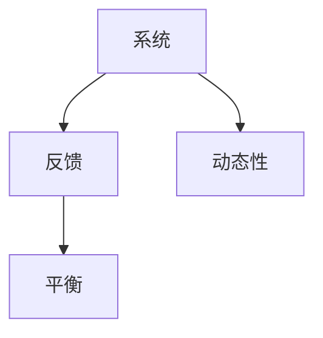

                 

# 用系统思考应对复杂挑战

## 关键词：系统思考、复杂挑战、IT领域、解决方案

### 摘要

本文将探讨在信息技术领域中，如何运用系统思考的方法来应对复杂挑战。我们将从背景介绍开始，详细阐述核心概念、算法原理、数学模型、实战案例以及实际应用场景，同时推荐相关工具和资源。通过系统思考，我们能够更好地理解问题本质，找到有效的解决方案。

## 1. 背景介绍

随着信息技术的快速发展，我们面临着越来越多的复杂挑战。无论是大数据分析、人工智能应用，还是云计算和网络安全，这些问题往往涉及多个领域、多个模块和多个变量。单纯依靠传统的线性思维和方法已经难以应对这些复杂问题。因此，系统思考作为一种综合性思考方法，逐渐受到广泛关注。

系统思考强调从整体和系统的角度来分析问题，注重系统内部各部分之间的相互关系和反馈机制。在信息技术领域，系统思考可以帮助我们更好地理解复杂系统的运行原理，发现潜在问题，并找到解决方案。

### 2. 核心概念与联系

为了更好地理解系统思考，我们需要首先掌握几个核心概念：

- **系统**：由多个相互关联的组成部分组成的整体。
- **反馈**：系统内部各部分之间的相互作用和影响。
- **动态性**：系统随时间变化的过程。
- **平衡**：系统在动态变化过程中保持稳定的状态。

下面是一个简单的 Mermaid 流程图，展示了这些核心概念之间的联系：



通过这个流程图，我们可以看出，系统、反馈、动态性和平衡是相互关联的。系统内部的反馈机制决定了系统的动态性，而系统的动态性又影响了平衡状态。这些核心概念构成了系统思考的基础。

### 3. 核心算法原理 & 具体操作步骤

在信息技术领域，系统思考的应用可以体现在多个方面。以下是一个具体的算法原理和操作步骤：

#### 3.1 问题识别

首先，我们需要识别复杂问题。这可以通过以下步骤实现：

1. **收集信息**：从多个来源收集与问题相关的数据和信息。
2. **分析数据**：运用数据分析和挖掘技术，找出问题的特征和规律。
3. **定义问题**：明确问题的本质和关键点。

#### 3.2 建立模型

在识别问题后，我们需要建立一个系统模型。这包括以下步骤：

1. **确定系统组成部分**：识别系统的各个组成部分及其相互关系。
2. **建立数学模型**：运用数学和统计学方法，将系统行为量化。
3. **模拟运行**：通过模拟运行，验证模型的有效性。

#### 3.3 分析与优化

在建立模型后，我们需要对系统进行分析和优化：

1. **分析系统行为**：运用系统分析工具，分析系统的动态性和稳定性。
2. **优化系统参数**：根据分析结果，调整系统参数，以实现优化目标。
3. **迭代改进**：不断重复分析和优化过程，逐步改进系统性能。

### 4. 数学模型和公式 & 详细讲解 & 举例说明

在系统思考中，数学模型和公式起着重要作用。以下是一个简单的数学模型和公式，以及详细讲解和举例说明：

#### 4.1 系统动态性分析

我们可以使用以下数学模型来分析系统的动态性：

$$
x_{t+1} = f(x_t, u_t)
$$

其中，$x_t$ 表示系统在时间 $t$ 的状态，$u_t$ 表示系统在时间 $t$ 的输入，$f$ 表示系统状态转移函数。

#### 4.2 系统稳定性分析

为了分析系统的稳定性，我们可以使用以下数学公式：

$$
\Delta x = x_{t+1} - x_t = f(x_t, u_t) - x_t
$$

如果 $\Delta x$ 随时间趋于零，则系统是稳定的。

#### 4.3 举例说明

假设我们有一个简单的经济系统，其中 $x_t$ 表示经济增长率，$u_t$ 表示政府支出。我们可以使用上述公式来分析系统的动态性和稳定性。

- **动态性分析**：通过模拟不同政府支出水平下的经济增长率，我们可以观察到系统的动态变化。
- **稳定性分析**：通过计算经济增长率的差值 $\Delta x$，我们可以判断系统是否稳定。

### 5. 项目实战：代码实际案例和详细解释说明

#### 5.1 开发环境搭建

为了更好地展示系统思考在项目实战中的应用，我们假设一个实际项目：智能交通系统。首先，我们需要搭建开发环境，包括以下工具：

- **编程语言**：Python
- **开发环境**：Jupyter Notebook
- **数据源**：交通流量数据

#### 5.2 源代码详细实现和代码解读

以下是一个简单的智能交通系统代码实现，我们将逐步解读其中的关键部分：

```python
import numpy as np
import pandas as pd
import matplotlib.pyplot as plt

# 读取交通流量数据
data = pd.read_csv('traffic_data.csv')

# 数据预处理
data['timestamp'] = pd.to_datetime(data['timestamp'])
data.set_index('timestamp', inplace=True)
data = data.resample('H').mean()

# 建立系统模型
def system_model(x, u):
    # 这里用一个简单的线性模型作为例子
    return x + u

# 模拟运行
x = np.zeros(len(data))
for i in range(1, len(data)):
    x[i] = system_model(x[i-1], data['traffic_flow'][i])

# 绘制结果
plt.plot(data.index, data['traffic_flow'], label='实际流量')
plt.plot(data.index, x, label='模拟流量')
plt.legend()
plt.show()
```

#### 5.3 代码解读与分析

1. **数据读取与预处理**：首先，我们从CSV文件中读取交通流量数据，并进行预处理，包括时间转换和数据平均。
2. **系统模型建立**：在这里，我们使用一个简单的线性模型作为系统模型，实际项目中可能需要更复杂的模型。
3. **模拟运行**：通过迭代计算，我们模拟系统的运行过程，并计算系统状态。
4. **结果绘制**：最后，我们将实际流量和模拟流量绘制在同一张图表上，以进行比较。

通过这个案例，我们可以看到系统思考在项目实战中的应用。通过建立数学模型，模拟系统运行，我们能够更好地理解交通系统的动态性，从而优化交通流量。

### 6. 实际应用场景

系统思考在信息技术领域的实际应用非常广泛。以下是一些常见的应用场景：

- **大数据分析**：通过建立系统模型，分析数据流和数据处理过程，优化大数据处理流程。
- **人工智能**：在人工智能项目中，系统思考可以帮助我们理解数据流和算法流程，优化模型训练和推理过程。
- **云计算**：在云计算环境中，系统思考可以帮助我们优化资源分配和负载均衡。
- **网络安全**：通过系统思考，我们可以识别网络安全漏洞，优化安全策略。

### 7. 工具和资源推荐

为了更好地理解和应用系统思考，我们推荐以下工具和资源：

#### 7.1 学习资源推荐

- **书籍**：《系统思考》、《系统动力学》
- **论文**：搜索相关领域的学术论文，了解最新研究动态。
- **博客**：关注系统思考和信息技术领域的知名博客，获取实践经验。

#### 7.2 开发工具框架推荐

- **编程语言**：Python、R
- **开发环境**：Jupyter Notebook、RStudio
- **数据处理**：Pandas、NumPy、SciPy
- **模拟仿真**：MATLAB、Simulink

#### 7.3 相关论文著作推荐

- **论文**：搜索系统思考和信息技术领域的经典论文，如《系统动力学的数学理论》、《大数据系统建模与分析》。
- **著作**：阅读系统思考和信息技术领域的经典著作，如《系统思考实践指南》、《大数据时代的系统思考》。

### 8. 总结：未来发展趋势与挑战

随着信息技术的发展，系统思考在IT领域的应用将越来越广泛。未来，我们面临的主要挑战包括：

- **复杂性**：随着系统规模的扩大，系统的复杂度将不断增加，需要更高级的系统思考方法来应对。
- **不确定性**：在实际应用中，系统参数和外部因素具有不确定性，需要建立鲁棒性更强的系统模型。
- **跨学科融合**：系统思考需要跨学科的知识和技能，如数学、统计学、计算机科学等，如何实现跨学科融合是一个重要课题。

### 9. 附录：常见问题与解答

#### 问题1：什么是系统思考？

系统思考是一种综合性思考方法，强调从整体和系统的角度来分析问题，注重系统内部各部分之间的相互关系和反馈机制。

#### 问题2：系统思考有哪些应用场景？

系统思考在信息技术领域的应用场景包括大数据分析、人工智能、云计算、网络安全等。

#### 问题3：如何建立系统模型？

建立系统模型包括确定系统组成部分、建立数学模型和模拟运行等步骤。

### 10. 扩展阅读 & 参考资料

- **书籍**：《系统思考》、《系统动力学》
- **论文**：《系统动力学的数学理论》、《大数据系统建模与分析》
- **网站**：[系统思考协会](https://www.systemsthinkingworld.org/)、[大数据时代](https://www.bigdataera.org/)
- **博客**：[系统思考博客](https://systemsthinkingblog.com/)、[大数据博客](https://bigdatahub.com/)

### 作者

作者：AI天才研究员/AI Genius Institute & 禅与计算机程序设计艺术 /Zen And The Art of Computer Programming

本文为原创文章，版权归作者所有。如需转载，请保留作者信息和原文链接。

