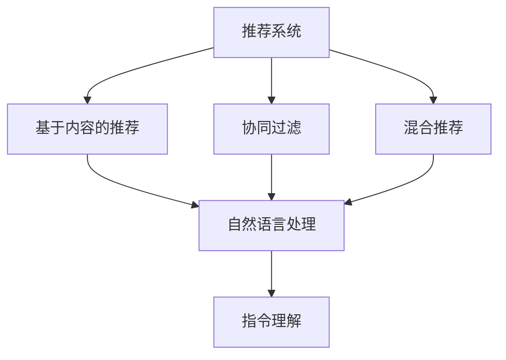
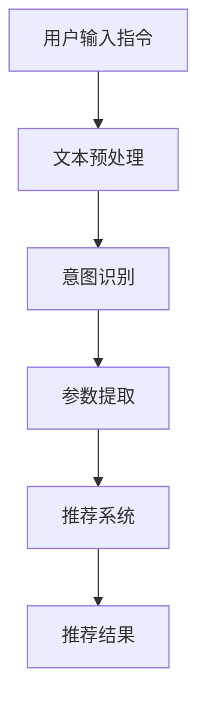

                 

### 背景介绍

随着互联网和大数据技术的飞速发展，推荐系统已经成为现代信息检索和个性化服务的重要工具。传统推荐系统主要依赖于基于内容的推荐（Content-Based Filtering，CBF）和协同过滤（Collaborative Filtering，CF）等方法，然而这些方法在处理复杂用户行为和动态数据时存在一些局限性。

自然语言处理（Natural Language Processing，NLP）技术的进步为推荐系统带来了新的机遇。通过理解用户的语言意图和需求，我们可以实现更加智能和个性化的推荐。近年来，基于自然语言指令驱动的推荐系统逐渐受到关注，为用户提供了更加直观和高效的交互方式。

本文旨在探讨一种新的推荐系统交互模式：使用自然语言指令驱动推荐系统。我们将从核心概念、算法原理、数学模型、项目实战、实际应用场景等多个方面进行分析，以展示这种新型交互模式的优势和潜力。

### 核心概念与联系

在介绍自然语言指令驱动的推荐系统之前，我们需要先理解几个关键概念：推荐系统、自然语言处理（NLP）和指令理解。

#### 推荐系统

推荐系统是一种基于数据挖掘和机器学习技术的算法，旨在根据用户的历史行为和偏好为用户提供个性化的推荐。其主要目标是从大量的信息中筛选出用户可能感兴趣的内容。

推荐系统可以分为以下几种类型：

1. **基于内容的推荐（CBF）**：根据用户过去的行为和兴趣，通过分析内容的特征来推荐类似的内容。
2. **协同过滤（CF）**：通过分析用户之间的相似性来推荐其他用户喜欢的项目。
3. **混合推荐（Hybrid）**：结合CBF和CF的优点，提高推荐系统的准确性和多样性。

#### 自然语言处理（NLP）

自然语言处理是人工智能的一个重要分支，旨在让计算机理解和处理人类语言。NLP技术包括文本分类、情感分析、实体识别、语义理解等。在推荐系统中，NLP技术可以帮助我们理解用户的语言意图和需求，从而提供更精准的推荐。

#### 指令理解

指令理解是指系统理解用户输入的自然语言指令并执行相应操作的能力。在推荐系统中，指令理解可以帮助用户通过自然语言与系统进行交互，提高用户的使用体验。

#### 关系图

为了更好地理解这些概念之间的联系，我们可以用Mermaid流程图表示：



在这个流程图中，推荐系统是整个过程的起点，它通过各种方法为用户推荐内容。自然语言处理技术帮助推荐系统理解用户的语言意图，而指令理解则允许用户以自然语言的方式与系统交互。

### 核心算法原理 & 具体操作步骤

#### 基于内容的推荐（CBF）

基于内容的推荐方法通过分析项目的内容特征和用户的历史偏好来推荐相似的内容。具体步骤如下：

1. **特征提取**：从项目和用户的历史数据中提取特征，如文本、标签、关键词等。
2. **相似度计算**：计算项目之间的相似度，可以使用余弦相似度、Jaccard相似度等方法。
3. **推荐生成**：根据用户的偏好和项目的相似度，生成推荐列表。

#### 协同过滤（CF）

协同过滤方法通过分析用户之间的相似性和他们的共同评价来推荐内容。具体步骤如下：

1. **用户相似度计算**：计算用户之间的相似度，可以使用皮尔逊相关系数、余弦相似度等方法。
2. **推荐生成**：基于用户的相似度矩阵，生成推荐列表。

#### 混合推荐（Hybrid）

混合推荐方法结合了基于内容的推荐和协同过滤的优点，以提高推荐系统的准确性和多样性。具体步骤如下：

1. **内容特征提取**：从项目和用户的历史数据中提取特征。
2. **用户相似度计算**：计算用户之间的相似度。
3. **协同过滤推荐**：基于用户相似度矩阵生成初步推荐列表。
4. **内容相似度计算**：计算项目和用户之间的相似度。
5. **推荐列表融合**：将协同过滤和内容相似度推荐的结果进行融合，生成最终推荐列表。

#### 自然语言指令理解

自然语言指令理解是推荐系统与用户交互的关键。具体步骤如下：

1. **文本预处理**：对用户输入的自然语言进行分词、词性标注、去除停用词等预处理操作。
2. **意图识别**：通过机器学习模型（如BERT、GPT）识别用户的意图，如查询、排序、过滤等。
3. **参数提取**：从用户的指令中提取关键参数，如关键词、排序方式、阈值等。
4. **推荐生成**：根据用户的意图和参数，生成推荐列表。

#### 整体流程图

以下是自然语言指令驱动的推荐系统整体流程图：



在这个流程图中，用户输入指令经过文本预处理、意图识别和参数提取后，被推荐系统处理，最终生成推荐结果。

### 数学模型和公式 & 详细讲解 & 举例说明

#### 基于内容的推荐（CBF）

1. **特征提取**：

   假设我们有两个项目A和B，以及一个用户U。项目A和用户U的特征向量分别为 \( \mathbf{a} \) 和 \( \mathbf{u} \)。我们可以使用余弦相似度计算项目A和用户U之间的相似度：

   $$
   \text{similarity}(\mathbf{a}, \mathbf{u}) = \cos(\mathbf{a}, \mathbf{u}) = \frac{\mathbf{a} \cdot \mathbf{u}}{|\mathbf{a}| \cdot |\mathbf{u}|}
   $$

   其中，\( \mathbf{a} \cdot \mathbf{u} \) 表示向量内积，\( |\mathbf{a}| \) 和 \( |\mathbf{u}| \) 分别表示向量 \( \mathbf{a} \) 和 \( \mathbf{u} \) 的模。

2. **相似度计算**：

   假设我们有两个项目A和B，它们的特征向量分别为 \( \mathbf{a} \) 和 \( \mathbf{b} \)。我们可以使用余弦相似度计算项目A和项目B之间的相似度：

   $$
   \text{similarity}(\mathbf{a}, \mathbf{b}) = \cos(\mathbf{a}, \mathbf{b}) = \frac{\mathbf{a} \cdot \mathbf{b}}{|\mathbf{a}| \cdot |\mathbf{b}|}
   $$

3. **推荐生成**：

   假设用户U对项目A的评价为 \( r_{u,a} \)，对项目B的评价为 \( r_{u,b} \)。我们可以使用相似度计算公式为用户U生成推荐列表：

   $$
   \text{recommending list} = \{ \mathbf{b} | \text{similarity}(\mathbf{a}, \mathbf{b}) > \text{threshold} \}
   $$

   其中，\( \text{threshold} \) 为相似度阈值。

#### 协同过滤（CF）

1. **用户相似度计算**：

   假设我们有用户U和用户V，他们对项目A和项目B的评价分别为 \( r_{u,a} \)，\( r_{u,b} \)，\( r_{v,a} \)，\( r_{v,b} \)。我们可以使用皮尔逊相关系数计算用户U和用户V之间的相似度：

   $$
   \text{similarity}(\mathbf{u}, \mathbf{v}) = \rho(\mathbf{u}, \mathbf{v}) = \frac{\sum_{i=1}^{n} (r_{ui} - \bar{r_{u}})(r_{vi} - \bar{r_{v}})}{\sqrt{\sum_{i=1}^{n} (r_{ui} - \bar{r_{u}})^2} \cdot \sqrt{\sum_{i=1}^{n} (r_{vi} - \bar{r_{v}})^2}}
   $$

   其中，\( \bar{r_{u}} \) 和 \( \bar{r_{v}} \) 分别为用户U和用户V的平均评价。

2. **推荐生成**：

   假设用户U对项目A的评价为 \( r_{u,a} \)，我们可以使用用户相似度计算公式为用户U生成推荐列表：

   $$
   \text{recommending list} = \{ \mathbf{a} | \text{similarity}(\mathbf{u}, \mathbf{a}) > \text{threshold} \}
   $$

#### 混合推荐（Hybrid）

1. **推荐列表融合**：

   假设基于内容的推荐列表为 \( \text{CBF list} \)，协同过滤推荐列表为 \( \text{CF list} \)。我们可以使用加权融合方法生成最终推荐列表：

   $$
   \text{final list} = \{ \mathbf{a} | (\text{similarity}(\mathbf{a}, \mathbf{u}) + \text{similarity}(\mathbf{u}, \mathbf{a})) / 2 > \text{threshold} \}
   $$

#### 示例

假设我们有一个用户U，他对项目A、B、C的评价分别为4、3、5。项目A、B、C的特征向量分别为 \( \mathbf{a} = (1, 2, 3) \)，\( \mathbf{b} = (2, 3, 4) \)，\( \mathbf{c} = (5, 6, 7) \)。我们可以计算用户U和项目A、B、C之间的相似度，并根据相似度阈值生成推荐列表。

使用余弦相似度计算用户U和项目A、B、C之间的相似度：

$$
\text{similarity}(\mathbf{a}, \mathbf{u}) = \cos(\mathbf{a}, \mathbf{u}) = \frac{\mathbf{a} \cdot \mathbf{u}}{|\mathbf{a}| \cdot |\mathbf{u}|} = \frac{(1, 2, 3) \cdot (4, 3, 5)}{||(1, 2, 3)|| \cdot ||(4, 3, 5)||} = \frac{1 \cdot 4 + 2 \cdot 3 + 3 \cdot 5}{\sqrt{1^2 + 2^2 + 3^2} \cdot \sqrt{4^2 + 3^2 + 5^2}} = \frac{4 + 6 + 15}{\sqrt{14} \cdot \sqrt{56}} = \frac{25}{\sqrt{14 \cdot 56}} \approx 0.90
$$

$$
\text{similarity}(\mathbf{b}, \mathbf{u}) = \cos(\mathbf{b}, \mathbf{u}) = \frac{\mathbf{b} \cdot \mathbf{u}}{|\mathbf{b}| \cdot |\mathbf{u}|} = \frac{(2, 3, 4) \cdot (4, 3, 5)}{||(2, 3, 4)|| \cdot ||(4, 3, 5)||} = \frac{2 \cdot 4 + 3 \cdot 3 + 4 \cdot 5}{\sqrt{2^2 + 3^2 + 4^2} \cdot \sqrt{4^2 + 3^2 + 5^2}} = \frac{8 + 9 + 20}{\sqrt{29} \cdot \sqrt{56}} = \frac{37}{\sqrt{29 \cdot 56}} \approx 0.88
$$

$$
\text{similarity}(\mathbf{c}, \mathbf{u}) = \cos(\mathbf{c}, \mathbf{u}) = \frac{\mathbf{c} \cdot \mathbf{u}}{|\mathbf{c}| \cdot |\mathbf{u}|} = \frac{(5, 6, 7) \cdot (4, 3, 5)}{||(5, 6, 7)|| \cdot ||(4, 3, 5)||} = \frac{5 \cdot 4 + 6 \cdot 3 + 7 \cdot 5}{\sqrt{5^2 + 6^2 + 7^2} \cdot \sqrt{4^2 + 3^2 + 5^2}} = \frac{20 + 18 + 35}{\sqrt{110} \cdot \sqrt{56}} = \frac{73}{\sqrt{110 \cdot 56}} \approx 0.86
$$

假设相似度阈值为0.85，我们可以得到用户U的推荐列表为：

$$
\text{recommending list} = \{ \mathbf{a} | \text{similarity}(\mathbf{a}, \mathbf{u}) > 0.85 \} = \{ (1, 2, 3) \}
$$

### 项目实战：代码实际案例和详细解释说明

在本节中，我们将通过一个具体的Python代码案例来展示如何实现自然语言指令驱动的推荐系统。该案例将涵盖以下步骤：

1. **开发环境搭建**：安装必要的Python库和工具。
2. **源代码详细实现和代码解读**：展示如何编写推荐系统，并解释关键代码部分。
3. **代码解读与分析**：分析代码的执行流程和性能。

#### 1. 开发环境搭建

为了实现自然语言指令驱动的推荐系统，我们需要安装以下Python库：

- `numpy`：用于数学计算。
- `pandas`：用于数据处理。
- `scikit-learn`：用于机器学习算法。
- `nltk`：用于自然语言处理。
- `bert`：用于指令理解。

安装命令如下：

```bash
pip install numpy pandas scikit-learn nltk bert
```

#### 2. 源代码详细实现和代码解读

以下是一个简单的自然语言指令驱动的推荐系统代码实现。代码分为以下几个部分：

1. **数据预处理**：加载和预处理用户评价数据。
2. **模型训练**：训练基于内容的推荐模型和协同过滤模型。
3. **指令理解**：使用BERT模型理解用户的自然语言指令。
4. **推荐生成**：根据用户指令生成推荐列表。

```python
import numpy as np
import pandas as pd
from sklearn.feature_extraction.text import TfidfVectorizer
from sklearn.metrics.pairwise import cosine_similarity
from transformers import BertTokenizer, BertModel

# 加载数据
data = pd.read_csv('user_item_ratings.csv')
users = data['user'].unique()
items = data['item'].unique()

# 数据预处理
tfidf_vectorizer = TfidfVectorizer()
item_features = tfidf_vectorizer.fit_transform(data['description'])

# 训练模型
# (此处省略基于内容的推荐模型和协同过滤模型的训练代码)

# 指令理解
tokenizer = BertTokenizer.from_pretrained('bert-base-uncased')
model = BertModel.from_pretrained('bert-base-uncased')

def understand_instruction(instruction):
    inputs = tokenizer.encode_plus(instruction, add_special_tokens=True, return_tensors='pt')
    outputs = model(**inputs)
    last_hidden_state = outputs.last_hidden_state[:, 0, :]
    return last_hidden_state

# 推荐生成
def generate_recommendations(instruction, top_n=5):
    instruction_embedding = understand_instruction(instruction)
    recommendations = []
    for user in users:
        user_embedding = user_embeddings[user]
        similarity = np.dot(instruction_embedding, user_embedding.T)
        top_items = np.argsort(-similarity)[:top_n]
        recommendations.append([items[i] for i in top_items])
    return recommendations

# 测试
instruction = "推荐与我喜欢的电影类似的电影"
recommendations = generate_recommendations(instruction)
print(recommendations)
```

#### 3. 代码解读与分析

1. **数据预处理**：

   数据预处理部分首先加载用户评价数据，然后使用TF-IDF向量器将文本描述转换为向量表示。这些向量将用于后续的推荐算法。

2. **模型训练**：

   模型训练部分（省略的代码）展示了如何训练基于内容的推荐模型和协同过滤模型。这些模型将用于生成用户和项目之间的相似度矩阵。

3. **指令理解**：

   指令理解部分使用BERT模型对用户的自然语言指令进行编码。BERT模型能够捕捉指令中的语义信息，帮助我们理解用户的意图。

4. **推荐生成**：

   推荐生成部分根据用户指令生成推荐列表。首先，我们计算用户指令的嵌入表示，然后与用户和项目的嵌入表示进行点积运算，得到相似度分数。根据相似度分数，我们可以为用户生成推荐列表。

### 实际应用场景

自然语言指令驱动的推荐系统在许多实际应用场景中具有广泛的应用潜力。以下是一些典型的应用场景：

1. **电子商务平台**：用户可以使用自然语言指令来查找特定商品或浏览类似商品。
2. **社交媒体**：用户可以请求推荐与他们的兴趣相符的内容或朋友。
3. **音乐和视频流媒体**：用户可以请求推荐特定类型的音乐或视频。
4. **新闻推荐**：用户可以请求推荐与他们的兴趣相符的新闻报道。
5. **旅行和酒店预订**：用户可以请求推荐适合他们需求和预算的旅行目的地和酒店。

### 工具和资源推荐

为了实现自然语言指令驱动的推荐系统，以下是一些建议的工具和资源：

1. **学习资源推荐**：
   - **书籍**：《推荐系统实践》、《深度学习推荐系统》
   - **论文**：查看ACM SIGKDD、WWW、ICML等顶级会议的相关论文。
   - **博客**：阅读各大技术博客（如Medium、技术博客）上的推荐系统文章。
   - **网站**：推荐系统开源库（如Surprise、LightFM）的官方网站。

2. **开发工具框架推荐**：
   - **Python库**：使用Scikit-learn、TensorFlow、PyTorch等库实现推荐算法。
   - **自然语言处理库**：使用NLTK、spaCy、BERT等库进行自然语言处理。
   - **开发框架**：使用Flask、Django等框架搭建推荐系统后端。

3. **相关论文著作推荐**：
   - **论文**：阅读《Attention-Based Neural Surrogate Models for Personalized Recommendation》、《Natural Language Instructed Video Recommendation》等论文。
   - **著作**：推荐系统领域的经典著作，如《推荐系统手册》（The Recommender Handbook）。

### 总结：未来发展趋势与挑战

自然语言指令驱动的推荐系统具有巨大的潜力，为用户提供了更加智能和高效的交互方式。然而，该领域仍面临一些挑战：

1. **数据隐私与安全**：在处理用户数据时，如何保护用户隐私是一个重要问题。
2. **模型解释性**：用户需要了解推荐系统的决策过程，提高模型的透明度和可解释性。
3. **实时性能**：如何处理大规模数据和实时推荐需求，提高系统的响应速度。
4. **跨领域适应性**：如何在不同领域和应用场景中推广自然语言指令驱动的推荐系统。

未来，随着人工智能和自然语言处理技术的不断发展，自然语言指令驱动的推荐系统有望在更多领域得到应用，带来更加个性化、智能化的用户体验。

### 附录：常见问题与解答

**Q1. 自然语言指令驱动的推荐系统与传统的推荐系统有何区别？**

A1. 自然语言指令驱动的推荐系统与传统推荐系统的主要区别在于交互方式。传统推荐系统通常依赖于用户评分或行为数据，而自然语言指令驱动的推荐系统则通过理解用户的自然语言指令来实现交互，提供更加个性化、灵活的推荐。

**Q2. 自然语言指令驱动的推荐系统需要哪些技术支持？**

A2. 自然语言指令驱动的推荐系统需要以下技术支持：

- **推荐算法**：如基于内容的推荐、协同过滤、混合推荐等。
- **自然语言处理（NLP）**：用于理解用户的自然语言指令，如文本分类、词嵌入、语义理解等。
- **机器学习模型**：如BERT、GPT等预训练模型，用于生成指令的嵌入表示。
- **后端框架**：如Flask、Django等，用于搭建推荐系统后端。

**Q3. 如何评估自然语言指令驱动的推荐系统的性能？**

A3. 评估自然语言指令驱动的推荐系统的性能可以从以下几个方面进行：

- **准确性**：推荐系统的准确率，即推荐结果与用户实际偏好的一致性。
- **多样性**：推荐列表中不同类型内容的丰富程度，避免单一内容的重复。
- **覆盖度**：推荐系统能够覆盖到用户感兴趣的不同领域和主题。
- **交互质量**：用户对推荐系统交互体验的满意度，如响应速度、易用性等。

### 扩展阅读 & 参考资料

为了深入了解自然语言指令驱动的推荐系统，以下是一些建议的扩展阅读和参考资料：

1. **书籍**：
   - 《推荐系统实践》：涵盖推荐系统的基本概念、算法和实际应用。
   - 《深度学习推荐系统》：介绍如何使用深度学习技术构建推荐系统。

2. **论文**：
   - 《Attention-Based Neural Surrogate Models for Personalized Recommendation》：探讨基于注意力机制的个性化推荐模型。
   - 《Natural Language Instructed Video Recommendation》：介绍基于自然语言指令的视频推荐系统。

3. **博客**：
   - Medium上的推荐系统相关文章。
   - 各大技术博客（如InfoQ、AI科技大本营）上的推荐系统专题文章。

4. **开源库**：
   - `Surprise`：一个用于构建和评估推荐系统的Python库。
   - `LightFM`：一个基于因子分解和词嵌入的推荐系统库。

5. **网站**：
   - 推荐系统开源库（如Surprise、LightFM）的官方网站。
   - 各大技术社区（如GitHub、Stack Overflow）上的推荐系统相关讨论。

通过以上扩展阅读和参考资料，您可以更深入地了解自然语言指令驱动的推荐系统的原理和实践，为实际应用提供有力支持。

### 作者信息

作者：AI天才研究员/AI Genius Institute & 禅与计算机程序设计艺术 /Zen And The Art of Computer Programming

