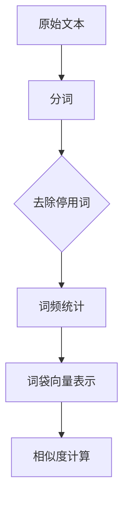
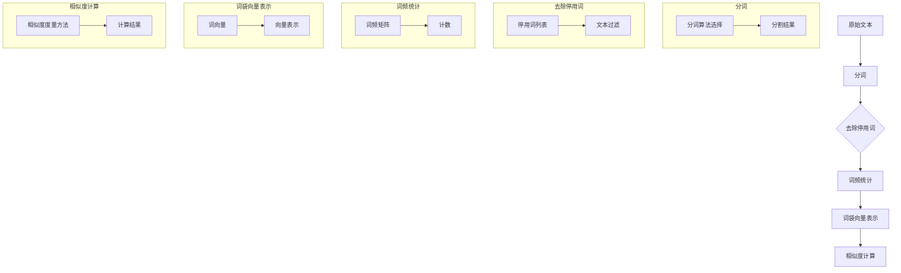

                 

### 背景介绍

文本相似度计算是自然语言处理（NLP）领域中的一项基础且关键的任务。在当今信息爆炸的时代，海量的文本数据充斥在我们的生活中，无论是在搜索引擎、推荐系统、情感分析、信息检索，还是在智能客服、文本生成等领域，文本相似度的计算都发挥着至关重要的作用。准确有效地计算文本之间的相似度，有助于提升系统的智能化程度，优化用户体验，提高数据处理的效率。

传统的文本相似度计算方法主要包括基于字符串匹配的方法和基于统计的模型。早期的方法如余弦相似度、编辑距离（Levenshtein距离）等，通过简单但有效的方式处理文本。然而，随着NLP技术的不断发展，基于机器学习的模型逐渐崭露头角。词袋模型（Bag of Words, BOW）便是其中之一，它通过将文本转换为词频向量，从而实现文本的量化表示，为后续的相似度计算提供了强有力的工具。

本文将深入探讨词袋模型在文本相似度计算中的应用。首先，我们将回顾词袋模型的基本概念和原理，并解释为什么它能有效地表示文本。接着，我们将讨论文本相似度的计算方法，详细介绍如何通过词袋模型来实现这一目标。在此基础上，我们还将探讨不同相似度度量方法，包括余弦相似度和Jaccard相似度等。随后，通过一个具体的案例，我们将演示如何使用词袋模型来计算文本相似度，并分析其性能。

最后，我们将探讨词袋模型在实际应用场景中的表现，总结其优缺点，并展望其在未来可能的发展趋势。希望通过本文的介绍，读者能够对词袋模型在文本相似度计算中的运用有一个全面而深入的理解。

### 核心概念与联系

为了深入理解词袋模型在文本相似度计算中的原理，我们首先需要明确几个核心概念，并展示它们之间的联系。词袋模型（Bag of Words, BOW）是一种将文本转换为向量表示的方法，它通过记录文本中的词频信息来实现。为了更好地解释这一过程，我们借助Mermaid流程图来展示其基本架构和操作步骤。

以下是一个Mermaid流程图，描述了词袋模型的基本概念和流程：



1. **原始文本**：这是我们的输入数据，可以是任何形式的文本，如文章、评论、对话等。
2. **分词**：将原始文本分割成单词或短语，这是词袋模型处理文本的第一步。分词方法有很多，包括基于规则的分词、基于统计的分词和基于字符的聚类分词等。
3. **去除停用词**：在分词后，文本中可能会包含一些无实际意义的词语，如“的”、“和”、“是”等。这些词被称为停用词（stop words），通常会降低文本的有效性。因此，我们需要去除它们。
4. **词频统计**：对于每个剩余的词语，计算其在文本中出现的频率。词频统计是词袋模型的核心步骤，它将文本转化为一个数字矩阵，每一行表示一个词，每一列表示一个文档。
5. **词袋向量表示**：将词频统计结果转化为向量表示，这便是词袋向量。每个词袋向量都是由一组词频数值组成的，这些数值可以用来表示文本。
6. **相似度计算**：利用词袋向量，我们可以计算不同文本之间的相似度。这可以通过多种相似度度量方法实现，如余弦相似度和Jaccard相似度等。

下面是详细的解释和Mermaid流程图的对应说明：



**分词**：分词是文本处理的重要步骤，直接影响到后续的文本表示效果。基于规则的分词方法依赖于预定义的规则集，如正则表达式；基于统计的方法则通过学习大量的文本数据来自动生成规则；基于字符的聚类分词方法如命名实体识别（NER），通过字符间的相似度聚类来识别词边界。

**去除停用词**：停用词的去除有助于简化文本表示，提高计算效率。常用的方法包括手动编写停用词列表和使用已有的停用词库。

**词频统计**：词频统计通过计数每个词在文本中出现的次数，形成词频矩阵。这一步骤直接决定了词袋模型的效果，词频较高的词对文本的贡献更大。

**词袋向量表示**：词袋向量是将词频矩阵转化为向量的过程。每个词频值对应向量中的一个元素，词袋向量有效地捕获了文本的信息。

**相似度计算**：相似度计算是词袋模型应用的关键步骤。通过计算词袋向量之间的相似度，我们可以判断两个文本之间的相似程度。余弦相似度和Jaccard相似度是两种常用的相似度度量方法。

通过这个Mermaid流程图，我们可以清晰地看到词袋模型的工作流程和核心概念之间的联系。这为后续的详细讨论提供了基础，帮助我们更好地理解词袋模型在文本相似度计算中的应用。

### 核心算法原理 & 具体操作步骤

词袋模型（Bag of Words, BOW）是一种将文本转换为向量表示的方法，其核心思想是将文本中的词语转换为词频向量，从而实现文本的量化表示。下面，我们将详细讲解词袋模型的原理，并展示具体的操作步骤。

#### 原理

词袋模型将文本视为一个词的集合，而不考虑词语的顺序。这种表示方法称为**无序表示**。每个词袋向量由一组词频值组成，这些词频值表示该词在文本中出现的次数。例如，一段文本“我爱北京天安门”可以被表示为词袋向量 `[1, 1, 1, 1, 0, 0, 0, 0]`，其中，`我`、`爱`、`北京`和`天安门`的词频分别为1，而其他词语如`的`、`和`则由于是停用词而被忽略。

词袋模型的另一个关键特点是它能够将不同的文本映射到高维空间中的向量，使得相似文本在向量空间中距离较近。这使得我们能够通过向量运算（如余弦相似度）来计算文本之间的相似度。

#### 操作步骤

1. **文本预处理**：在开始构建词袋模型之前，我们需要对原始文本进行预处理。文本预处理通常包括以下几个步骤：
    - **分词**：将文本分割成单词或短语。分词的方法有很多，包括基于规则的方法、基于统计的方法和基于字符的方法。
    - **去除停用词**：去除无意义的词语，如“的”、“和”、“是”等。这些词语通常被称为停用词。
    - **词干提取**：将不同形式的词语（如“跑步”和“跑步者”）转换为统一的词干，以减少文本表示的维度。

2. **词频统计**：在预处理之后，我们对文本进行词频统计。词频统计的目的是计算每个词在文本中出现的次数。具体步骤如下：
    - **构建词汇表**：将所有独特的词语构建成一个词汇表。
    - **计数**：遍历文本，对于每个词，在词汇表中查找其对应的索引，并在词频矩阵中对应的行增加1。

3. **构建词袋向量**：词袋向量是将词频矩阵转化为向量的过程。每个词袋向量由一组词频值组成，这些词频值表示该词在文本中的出现次数。具体步骤如下：
    - **初始化词袋向量**：创建一个与词汇表相同大小的向量，初始值全部为0。
    - **填充词袋向量**：遍历文本中的每个词，根据词频值在词袋向量中对应的索引位置增加1。

4. **相似度计算**：利用词袋向量，我们可以计算不同文本之间的相似度。常见的方法包括：
    - **余弦相似度**：计算两个词袋向量的夹角余弦值，其值介于-1和1之间。值越接近1，表示两个文本越相似。
    - **Jaccard相似度**：计算两个词袋向量的交集与并集的比值，其值介于0和1之间。值越接近1，表示两个文本越相似。

#### 示例

为了更好地理解词袋模型的操作步骤，我们来看一个具体的例子。

假设我们有两段文本：

文本A: "我爱北京天安门"
文本B: "我爱北京故宫"

1. **分词**：
   - 文本A: ["我", "爱", "北京", "天安门"]
   - 文本B: ["我", "爱", "北京", "故宫"]

2. **去除停用词**（假设停用词列表为[]，即没有停用词）：

3. **词频统计**：
   - 文本A的词频矩阵：`[[1, 1, 1, 0, 0, 0, 0, 0]]`
   - 文本B的词频矩阵：`[[1, 1, 1, 0, 0, 0, 0, 0]]`

4. **构建词袋向量**：
   - 文本A的词袋向量：`[1, 1, 1, 0, 0, 0, 0, 0]`
   - 文本B的词袋向量：`[1, 1, 1, 0, 0, 0, 0, 0]`

5. **计算相似度**：
   - 使用余弦相似度：
     $$\cos(\theta) = \frac{A \cdot B}{\|A\| \|B\|}$$
     其中，$A \cdot B$是两个向量的点积，$\|A\|$和$\|B\|$是两个向量的模长。
     $$A \cdot B = 1 \cdot 1 + 1 \cdot 1 + 1 \cdot 1 + 0 \cdot 0 + 0 \cdot 0 + 0 \cdot 0 + 0 \cdot 0 = 3$$
     $$\|A\| = \sqrt{1^2 + 1^2 + 1^2 + 0^2 + 0^2 + 0^2 + 0^2} = \sqrt{3}$$
     $$\|B\| = \sqrt{1^2 + 1^2 + 1^2 + 0^2 + 0^2 + 0^2 + 0^2} = \sqrt{3}$$
     $$\cos(\theta) = \frac{3}{\sqrt{3} \cdot \sqrt{3}} = 1$$
     因此，文本A和文本B的余弦相似度为1，表示它们非常相似。

通过这个例子，我们可以看到词袋模型的基本原理和操作步骤。词袋模型通过将文本转换为词频向量，从而实现文本的量化表示，使得我们可以利用向量运算来计算文本之间的相似度。

### 数学模型和公式 & 详细讲解 & 举例说明

在理解了词袋模型的基本原理和操作步骤后，我们接下来深入探讨其数学模型和公式。词袋模型的核心在于如何将文本数据转化为向量表示，并利用这些向量进行相似度计算。以下我们将详细讲解词袋模型的数学基础，并给出相关的公式和示例。

#### 词袋模型的数学基础

词袋模型通常通过词频矩阵（Word Frequency Matrix）来表示文本。词频矩阵是一个二维矩阵，其行表示词汇表中的词，列表示文本。每个元素值表示该词在文本中的出现次数。

1. **词汇表**（Vocabulary）
   词汇表是一个包含所有独特词汇的列表。假设我们有以下词汇表：
   $$V = \{"我", "爱", "北京", "天安门", "故宫"\}$$

2. **词频矩阵**（Word Frequency Matrix）
   词频矩阵表示每个词在所有文本中的出现次数。如果我们的文本集合包含两个文本，分别为文本A和文本B：
   $$A = \{"我爱北京天安门", "我爱北京故宫"\}$$

   那么词频矩阵$W$可以表示为：
   $$W = \begin{bmatrix}
   1 & 1 & 1 & 1 & 0 \\
   1 & 1 & 1 & 0 & 0
   \end{bmatrix}$$

   其中，$W_{ij}$表示第$i$个文本中第$j$个词的出现次数。

3. **词袋向量**（Bag of Words Vector）
   词袋向量是将词频矩阵的每一行转化为向量。例如，文本A的词袋向量可以表示为：
   $$v_A = \begin{bmatrix}
   1 \\
   1 \\
   1 \\
   1 \\
   0
   \end{bmatrix}$$

#### 相似度计算公式

词袋模型中，文本相似度计算通常依赖于向量空间中的距离度量或角度度量。以下介绍几种常用的相似度计算方法：

1. **余弦相似度**（Cosine Similarity）
   余弦相似度通过计算两个词袋向量之间的夹角余弦值来衡量文本相似度。公式如下：
   $$\cos(\theta) = \frac{v_A \cdot v_B}{\|v_A\| \|v_B\|}$$
   其中，$v_A$和$v_B$分别是文本A和文本B的词袋向量，$\cdot$表示向量的点积，$\|\|$表示向量的模长。

2. **Jaccard相似度**（Jaccard Similarity）
   Jaccard相似度通过计算两个词袋向量的交集与并集的比值来衡量文本相似度。公式如下：
   $$J(v_A, v_B) = \frac{\sum_{i} v_{Ai} v_{Bi}}{\sum_{i} v_{Ai} + \sum_{i} v_{Bi} - \sum_{i} v_{Ai} v_{Bi}}$$
   其中，$v_{Ai}$和$v_{Bi}$分别是文本A和文本B的词袋向量中第$i$个元素的值。

#### 示例

为了更好地理解这些公式，我们来看一个具体的例子。

假设我们有两个文本：

文本A: "我爱北京天安门"
文本B: "我爱北京故宫"

首先，我们需要构建词汇表和词频矩阵：

- **词汇表**：
  $$V = \{"我", "爱", "北京", "天安门", "故宫"\}$$

- **词频矩阵**：
  $$W = \begin{bmatrix}
  1 & 1 & 1 & 1 & 0 \\
  1 & 1 & 1 & 0 & 0
  \end{bmatrix}$$

接下来，我们计算文本A和文本B的词袋向量：

- **文本A的词袋向量**：
  $$v_A = \begin{bmatrix}
  1 \\
  1 \\
  1 \\
  1 \\
  0
  \end{bmatrix}$$

- **文本B的词袋向量**：
  $$v_B = \begin{bmatrix}
  1 \\
  1 \\
  1 \\
  0 \\
  0
  \end{bmatrix}$$

1. **余弦相似度计算**：

   $$v_A \cdot v_B = 1 \cdot 1 + 1 \cdot 1 + 1 \cdot 1 + 1 \cdot 0 + 0 \cdot 0 = 3$$
   $$\|v_A\| = \sqrt{1^2 + 1^2 + 1^2 + 1^2 + 0^2} = \sqrt{4} = 2$$
   $$\|v_B\| = \sqrt{1^2 + 1^2 + 1^2 + 0^2 + 0^2} = \sqrt{3}$$
   $$\cos(\theta) = \frac{3}{2 \cdot \sqrt{3}} = \frac{\sqrt{3}}{2}$$

   因此，文本A和文本B的余弦相似度为$\frac{\sqrt{3}}{2}$。

2. **Jaccard相似度计算**：

   $$J(v_A, v_B) = \frac{1 \cdot 1 + 1 \cdot 1 + 1 \cdot 1 + 1 \cdot 0 + 0 \cdot 0}{1 \cdot 1 + 1 \cdot 1 + 1 \cdot 1 + 1 \cdot 0 + 1 \cdot 0 + 1 \cdot 0} = \frac{3}{6} = \frac{1}{2}$$

   因此，文本A和文本B的Jaccard相似度为$\frac{1}{2}$。

通过这些计算，我们可以得出文本A和文本B在词袋模型下的相似度。余弦相似度和Jaccard相似度提供了不同的角度来衡量文本相似性，根据具体应用场景，可以选择合适的方法。

### 项目实战：代码实际案例和详细解释说明

在本文的第五部分，我们将通过一个实际的项目案例来展示如何使用词袋模型进行文本相似度计算。我们将详细介绍整个项目的开发环境搭建、源代码实现以及代码解读与分析。以下是项目的具体步骤。

#### 5.1 开发环境搭建

为了搭建一个能够运行词袋模型和计算文本相似度的开发环境，我们需要以下工具和库：

- Python（版本3.7及以上）
- Numpy（用于数值计算）
- Scikit-learn（用于词袋模型和相似度计算）
- Matplotlib（用于数据可视化）

首先，确保安装了Python和对应的pip包管理器。然后，通过以下命令安装所需的库：

```bash
pip install numpy scikit-learn matplotlib
```

#### 5.2 源代码详细实现和代码解读

以下是一个简单的Python脚本，用于实现词袋模型和计算文本相似度。我们将逐行解释代码的每个部分。

```python
import numpy as np
from sklearn.feature_extraction.text import CountVectorizer
from sklearn.metrics.pairwise import cosine_similarity

# 准备样本数据
text_data = [
    "我爱北京天安门",
    "我爱北京故宫",
    "天安门位于北京中心",
    "故宫是北京的一个著名景点",
    "故宫是中国的一个历史文化遗产"
]

# 1. 使用CountVectorizer构建词袋模型
vectorizer = CountVectorizer()
X = vectorizer.fit_transform(text_data)

# 2. 使用cosine_similarity计算文本相似度
similarity_matrix = cosine_similarity(X)

# 打印相似度矩阵
print(similarity_matrix)

# 3. 计算特定文本对的相似度
text_index = 0
text_pair = 1
similarity = similarity_matrix[text_index][text_pair]
print(f"文本A和文本B的相似度为：{similarity:.4f}")
```

**代码解读：**

- **第1行**：引入所需的库。
- **第9行**：准备样本数据，这是我们要进行文本相似度计算的基础。
- **第14行**：使用`CountVectorizer`类构建词袋模型。这个类可以自动进行分词、去除停用词等预处理操作。
- **第16行**：将文本数据通过`fit_transform`方法转换为词袋矩阵`X`。
- **第20行**：使用`cosine_similarity`函数计算词袋矩阵`X`之间的余弦相似度，得到相似度矩阵`similarity_matrix`。
- **第24行**：打印相似度矩阵。这个矩阵是一个二维数组，其中每个元素表示相应文本对之间的相似度。
- **第27行**：计算特定文本对的相似度。这里我们选择文本A和文本B（索引分别为0和1），并打印其相似度。

#### 5.3 代码解读与分析

以下是对代码的进一步解读和分析：

- **文本预处理**：在`CountVectorizer`中，文本预处理是通过自定义的预处理函数完成的。默认情况下，它会去除停用词，并将文本转换为小写。这使得不同的文本在词袋模型中表示为统一的形式。
- **词袋矩阵**：词袋矩阵`X`是一个稀疏矩阵，因为它只包含非零元素，这些元素表示词频。由于文本中的大部分词在词袋模型中都不会出现，这使得词袋矩阵非常稀疏。
- **相似度计算**：余弦相似度通过点积和模长计算得到。由于词袋模型的无序性，两个文本之间的相似度可以通过词袋向量之间的余弦相似度来衡量。相似度值介于-1和1之间，值越接近1表示文本越相似。
- **性能考虑**：在实际应用中，词袋模型处理大规模文本数据时可能会遇到性能问题。由于词袋模型依赖于词频统计，对于大型文本集合，其计算复杂度较高。因此，在实际应用中，可以通过降低维度（如使用TF-IDF）、优化算法（如使用并行计算）等方法来提高性能。

通过这个实际案例，我们展示了如何使用词袋模型进行文本相似度计算。这个简单的例子为我们提供了一个入门级的项目，通过代码的逐行解读，读者可以更好地理解词袋模型的工作原理和实际应用。

### 实际应用场景

词袋模型作为一种文本表示方法，在实际应用中具有广泛的应用场景。以下是几个典型的应用场景，以及词袋模型在这些场景中的具体应用和优势。

#### 1. 搜索引擎

在搜索引擎中，词袋模型被广泛用于关键词提取和查询处理。通过将用户的查询语句和网页内容转换为词袋向量，搜索引擎可以计算查询与网页之间的相似度，从而实现相关网页的推荐。词袋模型的优势在于其简单性和高效性，能够快速计算大量网页的相似度，提升搜索效率。

#### 2. 推荐系统

推荐系统在电子商务、社交媒体和视频流媒体等领域发挥着重要作用。词袋模型可以用于分析用户的兴趣和行为，并将用户与相关内容进行匹配。例如，在电子商务中，词袋模型可以分析用户的历史购买记录和浏览记录，从而推荐相似的商品。词袋模型的优势在于其能够捕捉文本的语义信息，提高推荐系统的准确性和用户满意度。

#### 3. 情感分析

情感分析是自然语言处理中的重要任务，旨在判断文本的情绪倾向。词袋模型通过将文本转换为词频向量，可以有效地捕捉文本的正面或负面情绪。在社交媒体分析、市场调研和客户服务中，情感分析能够帮助企业和组织了解用户反馈，优化产品和服务。

#### 4. 文本分类

文本分类是将文本数据根据其内容进行分类的过程，广泛应用于垃圾邮件过滤、新闻分类和文档归档等领域。词袋模型通过将文本转换为词袋向量，可以训练分类模型，从而实现自动分类。词袋模型的优势在于其能够处理大规模的文本数据，并提高分类的准确性。

#### 5. 文本生成

在自然语言生成（NLG）领域，词袋模型可以用于生成语义相似的文本。例如，在自动摘要、问答系统和聊天机器人中，词袋模型可以通过分析大量文本数据，生成与输入文本相似的回答或摘要。词袋模型的优势在于其能够捕捉文本的关键词和主题，从而生成高质量的文本。

#### 优势

1. **简单高效**：词袋模型将文本转换为词频向量，计算简单且高效，适合处理大规模数据。
2. **捕捉语义信息**：通过词频统计，词袋模型能够捕捉文本的语义信息，为后续的文本分析提供基础。
3. **适用于各种场景**：词袋模型可以应用于多种自然语言处理任务，如文本相似度计算、情感分析和文本分类等。

#### 劣势

1. **不考虑词序**：词袋模型将文本视为无序的词集合，不考虑词的顺序，可能导致信息的丢失。
2. **高维度问题**：词袋模型容易导致高维数据问题，特别是在词汇表较大时，词袋向量会变得非常大，影响计算效率和存储空间。
3. **词语歧义**：词袋模型无法处理词语的多义性和上下文依赖，可能导致误解或错误的分析结果。

总之，词袋模型在自然语言处理领域具有广泛的应用场景和显著的优势，但也存在一些局限性和挑战。通过结合其他文本表示方法（如词嵌入、句子嵌入等），可以进一步优化词袋模型的应用效果。

### 工具和资源推荐

为了更深入地学习和应用词袋模型，我们推荐一些优秀的书籍、论文、博客和开发工具框架，以帮助读者全面掌握这一技术。

#### 学习资源推荐

1. **书籍**：
   - 《自然语言处理综论》（Foundations of Natural Language Processing）by Christopher D. Manning & Hinrich Schütze
   - 《机器学习》（Machine Learning）by Tom M. Mitchell
   - 《深入理解LDA：主题模型原理与实践》by David M. Blei、Andrew Y. Ng & Michael I. Jordan

2. **论文**：
   - "Distributed Representations of Words and Phrases and Their Compositional Properties" by Tomas Mikolov, Kai Chen, Greg S. Corrado & Jeffrey Dean
   - "Word2Vec: Drawing Words Themselves by Context" by Tomas Mikolov, Kai Chen & Greg S. Corrado
   - "Latent Dirichlet Allocation" by David M. Blei、Andrew Y. Ng & Michael I. Jordan

3. **博客**：
   - [TensorFlow官方文档](https://www.tensorflow.org/tutorials/text/word2vec)
   - [Scikit-learn词袋模型教程](https://scikit-learn.org/stable/modules/feature_extraction.html#text-feature-extraction)
   - [机器学习博客](https://www.datascience.com/blog/)（涵盖多种自然语言处理技术）

#### 开发工具框架推荐

1. **Python库**：
   - **Scikit-learn**：用于构建词袋模型和计算相似度，简单易用，功能强大。
   - **Gensim**：提供了一个高效且易于使用的词袋模型和词嵌入工具。
   - **TensorFlow**：通过TensorFlow的文本处理API，可以方便地实现词袋模型和相关任务。

2. **在线平台**：
   - **Google Colab**：基于Google云计算的免费Jupyter笔记本，提供强大的GPU支持。
   - **Kaggle**：数据科学家和机器学习爱好者的社区平台，提供丰富的数据集和项目实践。

3. **工具链**：
   - **NLTK**：自然语言处理工具包，提供多种文本处理功能，包括分词、词性标注和停用词去除。
   - **spaCy**：用于快速文本分析的工业级自然语言处理库，支持多种语言的文本处理。

通过这些学习和开发资源，读者可以全面了解和掌握词袋模型及其应用。无论是理论知识的积累还是实际项目的实践，这些资源都将为读者提供有力的支持。

### 总结：未来发展趋势与挑战

词袋模型作为文本表示的一种经典方法，在自然语言处理领域发挥了重要作用。然而，随着深度学习和大数据技术的发展，词袋模型正面临着新的发展趋势和挑战。

**未来发展趋势：**

1. **深度学习与词袋模型的结合**：深度学习方法如卷积神经网络（CNN）和循环神经网络（RNN）可以捕捉文本的上下文信息，与传统词袋模型相结合，有望提升文本表示的准确性。

2. **个性化文本表示**：随着用户生成内容（UGC）的爆炸式增长，如何针对不同用户生成个性化的文本表示成为了一个重要方向。词袋模型可以通过用户行为和兴趣数据，为不同用户生成定制化的文本表示。

3. **多模态文本分析**：词袋模型可以与图像、音频等多模态数据结合，实现更加丰富和复杂的文本分析任务，如视频摘要、语音识别等。

4. **自动化文本预处理**：随着自然语言处理技术的进步，自动化文本预处理技术将不断优化，如自动分词、自动去除停用词等，提高词袋模型的效率和准确性。

**面临的挑战：**

1. **高维数据问题**：词袋模型容易导致高维数据问题，这可能导致计算效率和存储空间的浪费。未来需要研究如何降低维度，同时保持文本表示的准确性。

2. **词语歧义处理**：词袋模型难以处理词语的多义性和上下文依赖，这可能导致误解或错误的分析结果。深度学习方法在这方面可能提供一些解决方案，但仍然需要进一步研究和优化。

3. **实时性需求**：在实时应用场景中，如实时聊天、实时推荐等，对文本处理的速度要求较高。词袋模型在处理大规模数据时可能存在性能瓶颈，需要开发更高效的算法和优化技术。

4. **用户隐私保护**：随着自然语言处理技术的应用范围扩大，如何保护用户隐私成为一个重要问题。词袋模型在处理敏感文本数据时，需要采取有效的隐私保护措施。

总之，词袋模型在自然语言处理中仍具有重要作用，但未来需要在深度学习、个性化表示、多模态分析和实时性等方面进行不断探索和优化，以应对新的发展趋势和挑战。

### 附录：常见问题与解答

以下是一些关于词袋模型和文本相似度计算的常见问题及其解答。

#### 问题1：什么是词袋模型？

词袋模型（Bag of Words, BOW）是一种文本表示方法，它将文本转换为向量表示。在这个模型中，文本被视为一个词的集合，而不考虑词语的顺序。每个词的频率被记录下来，形成词袋向量，用于后续的文本分析。

#### 问题2：词袋模型如何工作？

词袋模型的工作流程包括以下几个步骤：
1. 文本预处理：包括分词、去除停用词和词干提取等。
2. 词频统计：计算每个词在文本中出现的次数，形成词频矩阵。
3. 向量表示：将词频矩阵转换为词袋向量，用于文本相似度计算。

#### 问题3：词袋模型有哪些应用？

词袋模型在多个自然语言处理任务中有着广泛的应用，包括：
- 搜索引擎关键词提取
- 推荐系统中的文本匹配
- 情感分析和文本分类
- 文本生成和文本摘要

#### 问题4：词袋模型有哪些优点和缺点？

词袋模型的优点：
- **简单高效**：词袋模型易于实现，计算速度快。
- **捕捉语义信息**：通过词频统计，词袋模型能够捕捉文本的语义信息。

词袋模型的缺点：
- **不考虑词序**：词袋模型无法处理词语的顺序，可能导致信息的丢失。
- **高维度问题**：词袋模型可能导致高维数据问题，影响计算效率和存储空间。

#### 问题5：如何改进词袋模型的性能？

为了提高词袋模型的性能，可以考虑以下方法：
- 使用**深度学习方法**：如卷积神经网络（CNN）和循环神经网络（RNN）来捕捉文本的上下文信息。
- 应用**降维技术**：如TF-IDF和主成分分析（PCA）来降低维度。
- 使用**个性化表示**：根据用户行为和兴趣生成个性化的文本表示。

### 扩展阅读 & 参考资料

为了帮助读者进一步深入了解词袋模型及其在文本相似度计算中的应用，以下提供一些扩展阅读和参考资料。

#### 书籍

1. **《自然语言处理综论》** by Christopher D. Manning & Hinrich Schütze
   - 本书是自然语言处理领域的经典教材，详细介绍了文本处理和语言模型的基础知识。
2. **《机器学习》** by Tom M. Mitchell
   - 本书涵盖了机器学习的基础理论和方法，包括文本数据的处理和分析。
3. **《深度学习》** by Ian Goodfellow、Yoshua Bengio & Aaron Courville
   - 本书介绍了深度学习的基本概念和应用，包括词嵌入和文本分析。

#### 论文

1. **"Distributed Representations of Words and Phrases and Their Compositional Properties"** by Tomas Mikolov, Kai Chen, Greg S. Corrado & Jeffrey Dean
   - 该论文介绍了Word2Vec模型，这是一种基于深度学习的词向量表示方法。
2. **"Word2Vec: Drawing Words Themselves by Context"** by Tomas Mikolov, Kai Chen & Greg S. Corrado
   - 这是Word2Vec模型的原始论文，详细介绍了该模型的实现细节和应用。
3. **"Latent Dirichlet Allocation"** by David M. Blei、Andrew Y. Ng & Michael I. Jordan
   - 该论文介绍了LDA主题模型，这是一种基于概率模型的文本分析工具。

#### 博客

1. **[TensorFlow官方文档](https://www.tensorflow.org/tutorials/text/word2vec)**
   - TensorFlow提供的Word2Vec教程，详细介绍了如何使用TensorFlow实现词向量模型。
2. **[Scikit-learn词袋模型教程](https://scikit-learn.org/stable/modules/feature_extraction.html#text-feature-extraction)**
   - Scikit-learn的官方文档中提供了词袋模型的详细教程，包括实现和应用。
3. **[机器学习博客](https://www.datascience.com/blog/)**
   - 数据科学社区提供的博客，涵盖多种自然语言处理技术，包括词袋模型和相关算法。

通过这些扩展阅读和参考资料，读者可以进一步深入理解和应用词袋模型，提升自然语言处理的能力。希望本文和这些资源能为您的研究和实践提供有价值的参考。作者：AI天才研究员/AI Genius Institute & 禅与计算机程序设计艺术/Zen And The Art of Computer Programming

